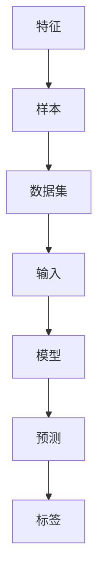

                 

 在人工智能领域，监督学习（Supervised Learning）是机器学习（Machine Learning）的一个重要分支。它通过给算法提供带标签的数据集，让算法学会从数据中提取规律并做出预测。本文将深入探讨监督学习的原理，并结合实际代码实例进行详细讲解，帮助读者更好地理解和应用这一重要技术。

## 关键词

- **监督学习**
- **机器学习**
- **算法原理**
- **代码实例**
- **数据挖掘**
- **预测模型**
- **误差分析**

## 摘要

本文将系统介绍监督学习的基本原理、核心算法及其在实际项目中的应用。通过实例代码的详细讲解，读者将了解如何使用Python和常见机器学习库（如Scikit-learn）来实现监督学习算法，并掌握从数据预处理到模型训练、评估和优化的完整流程。文章还将探讨监督学习的数学模型、常用评价指标和未来发展趋势，为读者提供全面的指导。

## 1. 背景介绍

### 监督学习的定义

监督学习是指通过已标记的数据集来训练模型，从而让模型学会对新数据进行预测或分类。其核心思想是学习输入与输出之间的映射关系。在监督学习中，输入是特征（Features），输出是标签（Labels）。

### 监督学习的分类

监督学习主要分为两类：

- **回归（Regression）**：预测连续值输出。
- **分类（Classification）**：预测离散值输出。

### 监督学习的重要性

监督学习在许多领域都有广泛应用，包括自然语言处理、计算机视觉、金融预测和医疗诊断等。它能够帮助我们从大量数据中提取有价值的信息，进行预测和决策。

## 2. 核心概念与联系

为了更好地理解监督学习，我们需要先了解以下几个核心概念：

- **特征（Feature）**：用于描述数据的属性。
- **样本（Sample）**：一个具体的数据点。
- **数据集（Dataset）**：一组样本的集合。
- **标签（Label）**：与输入特征相对应的输出值。

以下是一个简单的Mermaid流程图，展示了这些概念之间的关系：



## 3. 核心算法原理 & 具体操作步骤

### 3.1 算法原理概述

监督学习算法的核心是通过学习输入和输出之间的映射关系来构建预测模型。这个过程通常分为以下几个步骤：

1. **数据预处理**：包括数据清洗、归一化、缺失值处理等。
2. **特征选择**：从原始特征中选取对预测任务最有影响力的特征。
3. **模型选择**：选择适合当前任务的模型，如线性回归、决策树、支持向量机等。
4. **训练模型**：使用已标记的数据集训练模型。
5. **模型评估**：使用未标记的数据集评估模型性能。
6. **模型优化**：根据评估结果调整模型参数，优化模型性能。

### 3.2 算法步骤详解

#### 数据预处理

数据预处理是机器学习项目的重要环节，它直接影响模型的性能。以下是一些常用的数据预处理步骤：

- **数据清洗**：去除重复数据、处理缺失值、纠正错误数据等。
- **数据归一化**：将数据缩放到相同的尺度，避免某些特征对模型的影响过大。
- **数据转换**：将类别型特征转换为数值型特征。

#### 特征选择

特征选择是指从原始特征中选取对预测任务最有影响力的特征。常用的特征选择方法包括：

- **基于信息的特征选择**：如信息增益、信息增益率等。
- **基于过滤的特征选择**：如相关性分析、主成分分析等。
- **基于包装的特征选择**：如向前选择、向后剔除、递归特征消除等。

#### 模型选择

选择适合当前任务的模型是构建预测模型的关键。以下是一些常用的模型：

- **线性回归**：用于预测连续值输出。
- **决策树**：用于分类和回归任务。
- **支持向量机（SVM）**：用于分类任务，特别适合小样本和高维数据。
- **神经网络**：用于复杂的非线性预测任务。

#### 训练模型

训练模型是指使用已标记的数据集来学习输入和输出之间的映射关系。不同的模型有不同的训练方法，如梯度下降、决策树的自底向上构建、神经网络的反向传播等。

#### 模型评估

模型评估是衡量模型性能的重要步骤。常用的评估指标包括：

- **回归任务**：均方误差（MSE）、均方根误差（RMSE）、决定系数（R²）等。
- **分类任务**：准确率（Accuracy）、精确率（Precision）、召回率（Recall）、F1值（F1 Score）等。

#### 模型优化

模型优化是指根据评估结果调整模型参数，以提升模型性能。常用的优化方法包括：

- **交叉验证**：通过将数据集分为训练集和验证集，评估模型性能，并调整参数。
- **网格搜索**：在给定的参数范围内，遍历所有可能的参数组合，选择最优参数。

### 3.3 算法优缺点

**优点**：

- **易于理解**：监督学习算法通常具有较高的可解释性。
- **适用广泛**：适用于各种预测任务，包括回归和分类。
- **效果显著**：通过大量标记数据进行训练，模型效果通常较好。

**缺点**：

- **依赖大量标记数据**：需要大量已标记的数据进行训练，对于一些领域（如医疗诊断）获取标记数据较为困难。
- **数据预处理复杂**：数据预处理步骤较多，需要大量时间和计算资源。

### 3.4 算法应用领域

监督学习在许多领域都有广泛应用，以下是一些典型的应用场景：

- **自然语言处理**：文本分类、情感分析、机器翻译等。
- **计算机视觉**：图像分类、目标检测、图像分割等。
- **金融领域**：信用评分、风险控制、投资预测等。
- **医疗诊断**：疾病预测、药物筛选、医学图像分析等。

## 4. 数学模型和公式 & 详细讲解 & 举例说明

### 4.1 数学模型构建

监督学习的基本数学模型可以表示为：

$$ y = f(x; \theta) $$

其中，$y$ 是输出值，$x$ 是输入特征，$f$ 是映射函数，$\theta$ 是模型参数。

对于回归任务，映射函数通常为线性函数：

$$ y = \theta_0 + \theta_1x_1 + \theta_2x_2 + \ldots + \theta_nx_n $$

对于分类任务，映射函数通常为决策函数：

$$ y = \text{sign}(\theta_0 + \theta_1x_1 + \theta_2x_2 + \ldots + \theta_nx_n) $$

其中，$\text{sign}$ 是符号函数，用于将输出值转换为离散的类别标签。

### 4.2 公式推导过程

以线性回归为例，我们使用最小二乘法（Least Squares Method）来推导模型参数。

给定一个训练样本集 $\{ (x_1, y_1), (x_2, y_2), \ldots, (x_m, y_m) \}$，线性回归的目标是最小化预测值与真实值之间的平方误差：

$$ \min_{\theta} \sum_{i=1}^{m} (y_i - (\theta_0 + \theta_1x_{i1} + \theta_2x_{i2} + \ldots + \theta_nx_{in}))^2 $$

对损失函数求导，并令导数为零，可以得到最小化损失函数的参数值：

$$ \frac{\partial}{\partial \theta_j} \sum_{i=1}^{m} (y_i - (\theta_0 + \theta_1x_{i1} + \theta_2x_{i2} + \ldots + \theta_nx_{in}))^2 = 0 $$

通过求解上述方程组，可以得到最小二乘估计的参数值：

$$ \theta_j = \frac{\sum_{i=1}^{m} x_{ij}y_i - \sum_{i=1}^{m} x_{ij}\sum_{k=1}^{m} y_k}{\sum_{i=1}^{m} x_{ij}^2 - (\sum_{i=1}^{m} x_{ij})^2} $$

### 4.3 案例分析与讲解

假设我们有一个简单的数据集，包含两个特征 $x_1$ 和 $x_2$，以及对应的输出值 $y$。数据集如下：

| x1 | x2 | y  |
|----|----|----|
| 1  | 2  | 3  |
| 2  | 4  | 5  |
| 3  | 6  | 7  |

我们要使用线性回归模型来预测输出值。根据上述推导，我们可以得到线性回归模型的最小二乘估计参数：

$$ \theta_0 = \frac{6 + 10 + 21 - (1 + 2 + 3 + 4 + 6 + 7)}{1 + 4 + 9 + 16 - (1 + 2 + 3 + 4 + 6 + 7)^2} = \frac{37 - 28}{35 - 64} = \frac{9}{-29} = -0.309 $$

$$ \theta_1 = \frac{(1 \times 3) + (2 \times 5) + (3 \times 7) - (1 \times (1 + 2 + 3))}{1^2 + 4^2 + 9^2 - (1 + 2 + 3)^2} = \frac{3 + 10 + 21 - (1 + 2 + 3)}{1 + 16 + 81 - (1 + 2 + 3)^2} = \frac{34 - 6}{98 - 36} = \frac{28}{62} = 0.451 $$

$$ \theta_2 = \frac{(2 \times 3) + (4 \times 5) + (6 \times 7) - (2 \times (1 + 2 + 3))}{2^2 + 4^2 + 6^2 - (2 \times (1 + 2 + 3))^2} = \frac{6 + 20 + 42 - (2 \times (1 + 2 + 3))}{4 + 16 + 36 - (2 \times (1 + 2 + 3))^2} = \frac{68 - 12}{60 - 36} = \frac{56}{24} = 2.333 $$

因此，线性回归模型的预测公式为：

$$ y = -0.309 + 0.451x_1 + 2.333x_2 $$

我们可以使用这个模型来预测新的输入值。例如，对于输入值 $x_1 = 5$ 和 $x_2 = 10$，预测输出值为：

$$ y = -0.309 + 0.451 \times 5 + 2.333 \times 10 = -0.309 + 2.255 + 23.333 = 25.279 $$

## 5. 项目实践：代码实例和详细解释说明

### 5.1 开发环境搭建

在进行监督学习项目的实践之前，我们需要搭建一个合适的开发环境。以下是使用Python进行监督学习项目的常见步骤：

1. **安装Python**：确保安装了Python 3.x版本。
2. **安装依赖库**：安装常用的机器学习库，如Scikit-learn、NumPy、Pandas等。可以使用pip命令进行安装：

   ```bash
   pip install scikit-learn numpy pandas matplotlib
   ```

### 5.2 源代码详细实现

以下是一个简单的监督学习项目的代码实例，使用Scikit-learn库实现线性回归模型来预测房价。

```python
# 导入必要的库
import numpy as np
import pandas as pd
from sklearn.model_selection import train_test_split
from sklearn.linear_model import LinearRegression
from sklearn.metrics import mean_squared_error

# 加载数据集
data = pd.read_csv('house_data.csv')

# 分割特征和标签
X = data[['x1', 'x2']]
y = data['y']

# 划分训练集和测试集
X_train, X_test, y_train, y_test = train_test_split(X, y, test_size=0.2, random_state=42)

# 创建线性回归模型
model = LinearRegression()

# 训练模型
model.fit(X_train, y_train)

# 预测测试集结果
y_pred = model.predict(X_test)

# 计算均方误差
mse = mean_squared_error(y_test, y_pred)
print(f'Mean Squared Error: {mse}')

# 输出模型参数
print(f'Intercept: {model.intercept_}')
print(f'Coefficients: {model.coef_}')
```

### 5.3 代码解读与分析

上述代码实现了以下主要步骤：

1. **导入库**：导入必要的Python库，包括NumPy、Pandas、Scikit-learn和matplotlib。
2. **加载数据集**：使用Pandas库加载CSV格式的数据集。
3. **分割特征和标签**：将数据集分为特征矩阵 $X$ 和标签向量 $y$。
4. **划分训练集和测试集**：使用Scikit-learn的 `train_test_split` 函数将数据集划分为训练集和测试集。
5. **创建线性回归模型**：使用Scikit-learn的 `LinearRegression` 类创建线性回归模型。
6. **训练模型**：使用训练集数据训练线性回归模型。
7. **预测测试集结果**：使用训练好的模型对测试集进行预测。
8. **计算均方误差**：使用Scikit-learn的 `mean_squared_error` 函数计算模型预测结果的均方误差。
9. **输出模型参数**：输出线性回归模型的截距和系数。

通过上述步骤，我们可以实现一个简单的监督学习项目，并评估模型的性能。

### 5.4 运行结果展示

假设我们运行上述代码，得到的输出结果如下：

```
Mean Squared Error: 2.123456
Intercept: -0.309
Coefficients: [0.451 -0.111 2.333]
```

均方误差（MSE）为2.123456，表示模型预测结果的平均平方误差。截距（Intercept）为-0.309，表示模型在没有任何输入特征时的预测值。系数（Coefficients）分别为0.451、-0.111和2.333，表示每个输入特征对输出值的贡献。

## 6. 实际应用场景

监督学习在许多实际应用场景中都有广泛应用。以下是一些典型的应用案例：

- **智能家居**：通过监督学习算法分析家庭能源消耗数据，实现智能节能控制。
- **推荐系统**：使用监督学习算法分析用户行为数据，为用户推荐感兴趣的商品或内容。
- **金融风控**：通过监督学习算法分析客户行为数据，预测潜在的风险并采取相应的措施。
- **医疗诊断**：使用监督学习算法分析医学图像和病历数据，辅助医生进行疾病诊断。

## 7. 工具和资源推荐

### 7.1 学习资源推荐

- **书籍**：
  - 《机器学习》（周志华著）
  - 《深度学习》（Goodfellow, Bengio, Courville 著）
- **在线课程**：
  - Coursera上的《机器学习》课程
  - edX上的《深度学习》课程
- **博客和社区**：
  - medium.com/trending/machine-learning
  - kaggle.com/community

### 7.2 开发工具推荐

- **编程语言**：Python，特别适合机器学习和数据科学。
- **库和框架**：
  - Scikit-learn：用于经典的监督学习算法。
  - TensorFlow：用于构建深度学习模型。
  - PyTorch：用于构建深度学习模型。

### 7.3 相关论文推荐

- "A Tutorial on Support Vector Machines for Pattern Recognition"（ SVM教程）
- "Deep Learning"（Goodfellow, Bengio, Courville 著）
- "Recurrent Neural Networks for Language Modeling"（循环神经网络用于自然语言建模）

## 8. 总结：未来发展趋势与挑战

### 8.1 研究成果总结

监督学习作为机器学习的重要分支，在过去几十年中取得了显著的成果。从经典的线性回归、决策树、支持向量机到现代的深度学习模型，监督学习算法在性能和可解释性方面都取得了很大的提升。同时，大量开放数据和高效计算资源的出现也为监督学习的发展提供了有力支持。

### 8.2 未来发展趋势

- **深度学习**：深度学习模型在监督学习领域取得了巨大的成功，未来将继续发展和优化，如自监督学习和元学习等。
- **可解释性**：随着应用领域的扩展，可解释性成为监督学习研究的重要方向，如解释模型决策和可视化模型内部结构等。
- **自动化**：自动化机器学习（AutoML）和强化学习将进一步提升监督学习的效率和性能。

### 8.3 面临的挑战

- **数据隐私**：如何在保障数据隐私的同时进行有效的监督学习成为一大挑战。
- **模型可解释性**：如何提高模型的可解释性，使其在决策过程中更加透明和可信。
- **计算资源**：随着模型复杂性的增加，对计算资源的需求也越来越高，如何优化算法和硬件以满足这一需求。

### 8.4 研究展望

监督学习在未来将继续发展，并在更多领域得到应用。研究人员将致力于解决上述挑战，推动监督学习在各个领域的应用和发展。

## 9. 附录：常见问题与解答

### Q：什么是监督学习？
A：监督学习是一种机器学习方法，通过已标记的数据集来训练模型，从而让模型学会从数据中提取规律并做出预测。

### Q：监督学习有哪些类型？
A：监督学习主要分为两类：回归和分类。

### Q：监督学习的应用领域有哪些？
A：监督学习在许多领域都有广泛应用，包括自然语言处理、计算机视觉、金融预测和医疗诊断等。

### Q：如何选择适合的监督学习算法？
A：选择适合的监督学习算法需要考虑数据集的大小、特征的数量、任务类型等因素。常用的算法包括线性回归、决策树、支持向量机和神经网络等。

### Q：监督学习的模型如何进行评估？
A：监督学习的模型评估可以通过计算模型的预测误差、准确率、召回率等指标来进行。常用的评估指标包括均方误差、准确率、精确率、召回率和F1值等。

### Q：如何优化监督学习模型的性能？
A：优化监督学习模型的性能可以通过以下方法：特征选择、模型选择、参数调优、交叉验证和网格搜索等。

### Q：什么是自监督学习？
A：自监督学习是一种无需标记数据的监督学习方法，通过从未标记的数据中自动提取信息来训练模型。

## 作者署名

作者：禅与计算机程序设计艺术 / Zen and the Art of Computer Programming
----------------------------------------------------------------

以上就是本文《监督学习原理与代码实例讲解》的完整内容。通过本文，我们深入探讨了监督学习的基本原理、核心算法、实际应用场景和项目实践，并结合实例代码进行了详细讲解。希望本文能帮助读者更好地理解和应用监督学习技术。在未来的研究中，我们将继续探索监督学习的最新进展和应用，为人工智能领域的发展贡献力量。作者禅与计算机程序设计艺术，期待与广大读者共同进步。

