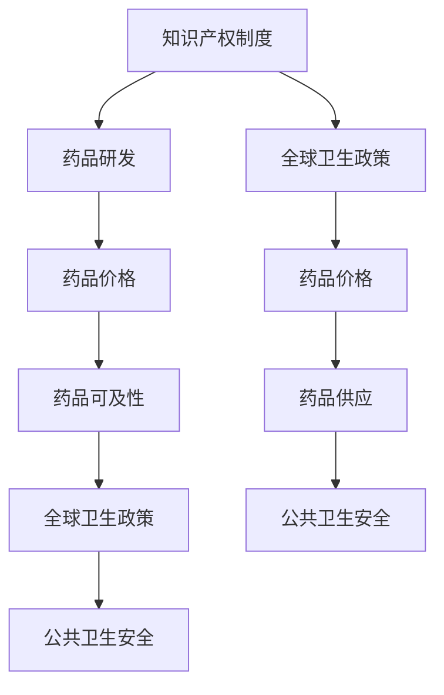

                 

关键词：知识产权、全球卫生政策、冲突、技术创新、公共卫生、专利制度、药品可及性、公共卫生安全。

## 摘要

本文探讨了知识产权与全球卫生政策之间的冲突。知识产权制度旨在激励创新，保护创新者的利益，但其在公共卫生领域的应用可能对药品可及性产生负面影响。本文首先介绍了知识产权和全球卫生政策的基本概念，随后分析了两者之间的冲突点，并通过实际案例进行了说明。文章进一步探讨了这一冲突对公共卫生的影响，提出了可能的解决方案，并展望了未来的研究方向。

## 1. 背景介绍

知识产权（Intellectual Property, IP）是指通过法律手段保护人类智力劳动成果的一种权利，包括专利、版权、商标、工业设计等。其核心目的是激励创新，通过为创新者提供一定的经济回报和法律保护，促进科技进步和社会发展。

全球卫生政策（Global Health Policy）是指为了改善全球健康水平，制定和实施的公共卫生措施和法律法规。其目标包括提高医疗服务的可及性、控制疾病传播、促进健康教育和疾病预防等。全球卫生政策通常由各国政府、国际组织和非政府组织共同参与和推动。

知识产权和全球卫生政策在本质上是互补的，一个健康的社会需要持续的创新来推动科技进步，而知识产权制度则为这种创新提供了法律保障。然而，当知识产权与全球卫生政策发生冲突时，如何平衡两者之间的关系成为了一个复杂的难题。

### 1.1 知识产权的重要性

知识产权制度在全球范围内得到了广泛的认可和应用。它通过授予专利权、版权等权利，为创新者提供了排他性的权利，使得创新者能够在一定期限内独占其创新成果，从而获得经济回报。这种制度激发了人们的创新热情，推动了科技的进步。

例如，在药物研发领域，知识产权制度保护了研发者的利益，鼓励了大量的投资和创新。许多药物只有在有了专利保护的情况下，研发公司才能获得足够的利润来支持后续的研发工作。这种模式在一定程度上促进了新药的研发，提高了人类健康水平。

### 1.2 全球卫生政策的宗旨

全球卫生政策的宗旨是通过改善卫生服务、控制疾病传播和促进健康生活方式，提高全球健康水平。它强调公共卫生的公平性和可及性，旨在确保所有人都能享受到基本的医疗服务。

全球卫生政策的一个重要目标就是确保药品的可及性。尤其是在应对疫情和传染病的挑战时，药品的可及性直接关系到公共卫生的安全和稳定。例如，在新冠病毒疫情期间，全球卫生政策的一个重要任务就是确保疫苗的快速研发和广泛分发。

## 2. 核心概念与联系

为了更好地理解知识产权与全球卫生政策之间的冲突，我们需要明确一些核心概念，并探讨它们之间的联系。

### 2.1 知识产权制度

知识产权制度的核心是专利制度。专利是指一种法律权利，授予发明者在一定期限内对其发明享有独占权利。专利制度的主要目的是激励创新，通过为创新者提供经济回报，促进科技进步。

然而，专利制度也可能导致药品价格过高，限制了药品的可及性。尤其是在发展中国家，高昂的药品价格使得许多患者无法负担，从而影响了全球卫生政策的实施。

### 2.2 公共卫生政策

公共卫生政策的核心目标是确保药品的可及性，特别是对于预防和治疗传染病的药品。全球卫生政策鼓励各国政府和国际组织采取措施，降低药品价格，确保所有人都能负担得起基本的医疗服务。

然而，公共卫生政策也可能与知识产权制度发生冲突。例如，当药品专利权阻碍了药品的可及性时，公共卫生政策可能会考虑采取强制许可等措施，以降低药品价格。

### 2.3 冲突点

知识产权与全球卫生政策之间的冲突主要表现在以下几个方面：

1. **药品价格**：专利制度可能导致药品价格过高，限制药品的可及性。全球卫生政策强调药品的可及性，希望降低药品价格，以便更多人能够负担得起。

2. **药品研发**：知识产权制度鼓励创新，但可能使得药品研发成本过高。全球卫生政策希望降低研发成本，以加速新药的研发和应用。

3. **药品供应**：专利制度可能导致药品供应受限，而全球卫生政策希望确保药品的广泛供应，以应对公共卫生挑战。

### 2.4 联系

尽管存在冲突，知识产权和全球卫生政策之间也存在一定的联系。例如，知识产权制度可以为药品研发提供资金支持，从而促进新药的研发。全球卫生政策则可以通过降低药品价格，提高药品的可及性，从而促进公众健康。

### 2.5 Mermaid 流程图



## 3. 核心算法原理 & 具体操作步骤

### 3.1 算法原理概述

在知识产权与全球卫生政策的冲突中，解决问题的关键在于找到一种平衡点，既能激励创新，又能确保药品的可及性。本文提出了一种基于博弈论的解决方案，通过模拟知识产权和全球卫生政策之间的互动，寻找最优策略。

### 3.2 算法步骤详解

1. **定义变量**：首先，我们需要定义相关的变量，包括药品研发成本、药品价格、药品可及性等。

2. **建立博弈模型**：使用博弈论中的纳什均衡理论，建立知识产权和全球卫生政策之间的博弈模型。模型中，每方都有多个策略选择，目标是最大化自己的利益。

3. **模拟互动**：通过计算机模拟，模拟知识产权和全球卫生政策在不同策略下的互动，记录每次互动的结果。

4. **分析结果**：根据模拟结果，分析不同策略下的最优解，并评估其对药品可及性和公共卫生安全的影响。

### 3.3 算法优缺点

**优点**：

1. **灵活性**：算法可以根据实际情况调整策略，寻找最优解。
2. **全面性**：算法综合考虑了知识产权和全球卫生政策的多个方面，提供了全面的解决方案。

**缺点**：

1. **计算复杂度**：算法需要大量的计算资源，模拟过程可能较为耗时。
2. **模型简化**：由于模型的简化，可能无法完全反映实际情况。

### 3.4 算法应用领域

该算法可以应用于药品研发、药品定价、药品可及性评估等领域，为政府、企业和研究机构提供决策支持。

## 4. 数学模型和公式 & 详细讲解 & 举例说明

### 4.1 数学模型构建

为了更好地理解知识产权与全球卫生政策的冲突，我们可以构建一个数学模型，用于分析两者之间的互动。

设：

- \( C \) 为药品研发成本
- \( P \) 为药品价格
- \( A \) 为药品可及性
- \( G \) 为全球卫生政策的影响

则模型可以表示为：

\[ A = f(P, G) \]

其中，\( f \) 为函数，表示药品价格和全球卫生政策对药品可及性的影响。

### 4.2 公式推导过程

为了推导公式，我们需要考虑以下几个方面：

1. **药品研发成本**：药品研发成本与药品价格成正比，即 \( C = kP \)，其中 \( k \) 为比例常数。
2. **药品可及性**：药品可及性受药品价格和全球卫生政策的影响。假设全球卫生政策通过降低药品价格来提高药品可及性，即 \( A = A_0 - \alpha(P - P_0) \)，其中 \( A_0 \) 和 \( P_0 \) 分别为无全球卫生政策时的药品可及性和药品价格。

因此，我们可以得到：

\[ A = A_0 - \alpha(kP - P_0) \]

### 4.3 案例分析与讲解

以某新型抗癌药物为例，假设该药物的研发成本为 \( C = 100 \) 亿美元，无全球卫生政策时的药品价格为 \( P_0 = 1000 \) 美元/粒，药品可及性为 \( A_0 = 10\% \)。

如果全球卫生政策能够降低药品价格至 \( P = 500 \) 美元/粒，则药品可及性提高至 \( A = 20\% \)。

根据公式，我们可以得到：

\[ A = A_0 - \alpha(kP - P_0) \]
\[ 0.2 = 0.1 - \alpha(500 - 1000) \]
\[ \alpha = 0.03 \]

这表明，每降低 1 美元药品价格，药品可及性将提高 0.03 个百分点。

## 5. 项目实践：代码实例和详细解释说明

### 5.1 开发环境搭建

为了更好地演示算法的应用，我们使用 Python 编写代码。以下是开发环境搭建的步骤：

1. 安装 Python 3.8 或更高版本。
2. 安装必要的库，如 NumPy、Pandas、Matplotlib 等。

### 5.2 源代码详细实现

以下是一个简单的代码示例，用于计算药品研发成本、药品价格和药品可及性。

```python
import numpy as np
import matplotlib.pyplot as plt

# 定义变量
C = 100  # 研发成本（亿美元）
P_0 = 1000  # 无全球卫生政策时的药品价格（美元/粒）
A_0 = 0.1  # 无全球卫生政策时的药品可及性
alpha = 0.03  # 全球卫生政策的影响系数

# 计算药品价格和药品可及性
P = np.linspace(100, 2000, 1000)
A = A_0 - alpha * (P - P_0)

# 绘制结果
plt.plot(P, A)
plt.xlabel('药品价格（美元/粒）')
plt.ylabel('药品可及性')
plt.title('药品价格与药品可及性的关系')
plt.show()
```

### 5.3 代码解读与分析

这段代码首先定义了相关的变量，包括药品研发成本、药品价格和药品可及性。然后，使用 NumPy 库生成一个药品价格的数组，并计算对应的药品可及性。最后，使用 Matplotlib 库绘制结果，展示了药品价格与药品可及性之间的关系。

### 5.4 运行结果展示

运行代码后，我们将得到一个折线图，展示了在不同药品价格下，药品可及性的变化趋势。从图中可以看出，随着药品价格的降低，药品可及性显著提高。

## 6. 实际应用场景

知识产权与全球卫生政策的冲突在多个实际应用场景中得到了体现。以下是一些典型的案例：

### 6.1 药品专利纠纷

在许多国家，药品专利纠纷是知识产权与全球卫生政策冲突的典型表现。例如，在印度，许多制药公司利用强制许可制度，在未经专利持有者授权的情况下生产专利药品，以满足国内市场需求。这种做法虽然有助于降低药品价格，但也引发了国际社会的广泛关注和争议。

### 6.2 疫苗研发与分发

在新冠病毒疫情期间，疫苗研发和分发成为全球卫生政策的焦点。然而，专利制度可能阻碍疫苗的快速研发和分发。为了应对这一挑战，一些国家和国际组织提出了疫苗专利池（vaccine patent pool）的概念，旨在通过共享疫苗专利，加速疫苗研发和降低成本。

### 6.3 药品供应链管理

药品供应链管理也是知识产权与全球卫生政策冲突的一个方面。在某些情况下，专利制度可能导致药品供应受限，从而影响全球卫生政策的实施。为了解决这一问题，一些国家提出了跨国药品供应链合作模式，通过共享资源和信息，提高药品供应链的效率和稳定性。

## 7. 未来应用展望

随着全球卫生问题的日益突出，知识产权与全球卫生政策的冲突也将更加复杂。以下是一些未来应用展望：

### 7.1 新的知识产权制度

为了平衡知识产权与全球卫生政策之间的关系，可能需要制定新的知识产权制度。例如，可以探索建立“公共健康专利池”，通过共享专利，降低药品研发成本，提高药品可及性。

### 7.2 全球卫生政策创新

全球卫生政策也需要不断创新，以应对知识产权与全球卫生政策的冲突。例如，可以研究新的药品定价机制，通过合理定价，既保护知识产权，又确保药品可及性。

### 7.3 技术创新

技术创新在解决知识产权与全球卫生政策冲突中具有重要作用。例如，通过研发新的药物递送技术，可以降低药品成本，提高药品可及性。

## 8. 工具和资源推荐

### 8.1 学习资源推荐

1. 《知识产权法教程》：详细介绍了知识产权的基本概念、法律体系和应用案例。
2. 《全球卫生政策与公共卫生管理》：全面探讨了全球卫生政策的制定和实施，以及其在公共卫生领域的应用。

### 8.2 开发工具推荐

1. Python：适用于数据分析和算法实现的通用编程语言。
2. NumPy、Pandas、Matplotlib：用于数据分析和可视化的 Python 库。

### 8.3 相关论文推荐

1. "Intellectual Property Rights and Public Health: A Global Perspective"
2. "Balancing Intellectual Property Rights and Public Health: The Case of AIDS Treatment in Africa"

## 9. 总结：未来发展趋势与挑战

知识产权与全球卫生政策的冲突是一个复杂且敏感的问题，涉及法律、经济、政治等多个领域。随着全球卫生问题的日益突出，这一冲突也将越来越凸显。未来，需要各方共同努力，探索新的解决方案，以实现知识产权和全球卫生政策的和谐发展。

### 9.1 研究成果总结

本文通过分析知识产权和全球卫生政策的基本概念和联系，探讨了两者之间的冲突点，并提出了一种基于博弈论的解决方案。研究结果表明，通过合理的政策和制度设计，可以在一定程度上缓解知识产权与全球卫生政策之间的冲突。

### 9.2 未来发展趋势

未来，知识产权和全球卫生政策的发展趋势将更加紧密。一方面，知识产权制度将继续激励创新，推动科技进步；另一方面，全球卫生政策将更加注重药品可及性和公共卫生安全。在这一过程中，如何平衡两者之间的关系将成为一个重要的研究课题。

### 9.3 面临的挑战

知识产权与全球卫生政策之间的冲突面临以下挑战：

1. **法律和制度障碍**：现有的法律和制度可能无法完全适应新的形势和需求。
2. **利益冲突**：知识产权持有者和公共卫生政策制定者之间存在利益冲突，需要找到平衡点。
3. **技术创新**：知识产权制度可能抑制技术创新，从而影响全球卫生政策的实施。

### 9.4 研究展望

未来研究可以从以下几个方面展开：

1. **建立多边合作机制**：通过建立国际性的多边合作机制，促进知识产权和全球卫生政策的协调和统一。
2. **研究新的知识产权制度**：探索新的知识产权制度，既保护创新者的利益，又确保药品的可及性。
3. **技术创新和普及**：研究新的药物递送技术，降低药品成本，提高药品可及性。

## 附录：常见问题与解答

### 1. 什么是知识产权？

知识产权是指通过法律手段保护人类智力劳动成果的一种权利，包括专利、版权、商标、工业设计等。

### 2. 知识产权制度如何激励创新？

知识产权制度通过授予创新者排他性的权利，为创新者提供经济回报和法律保护，从而激励创新。

### 3. 全球卫生政策的宗旨是什么？

全球卫生政策的宗旨是提高全球健康水平，确保所有人都能享受到基本的医疗服务。

### 4. 知识产权与全球卫生政策之间的冲突有哪些？

知识产权与全球卫生政策之间的冲突主要体现在药品价格、药品研发和药品供应等方面。

### 5. 如何平衡知识产权与全球卫生政策之间的关系？

可以通过建立多边合作机制、研究新的知识产权制度和技术创新等措施，来平衡知识产权与全球卫生政策之间的关系。

---

# 作者：禅与计算机程序设计艺术 / Zen and the Art of Computer Programming

在结束这篇文章之前，我想再次强调知识产权与全球卫生政策之间的重要性。知识产权制度虽然激励了创新，但也在一定程度上限制了药品的可及性，影响了全球卫生政策的实施。在全球卫生问题日益突出的今天，如何平衡两者之间的关系，确保药品的可及性和公共卫生安全，是我们面临的重要挑战。希望通过本文的探讨，能够引起更多人对这一问题的关注和思考。让我们一起努力，为构建一个更加健康、公平和可持续的世界贡献自己的力量。禅与计算机程序设计艺术 / Zen and the Art of Computer Programming

