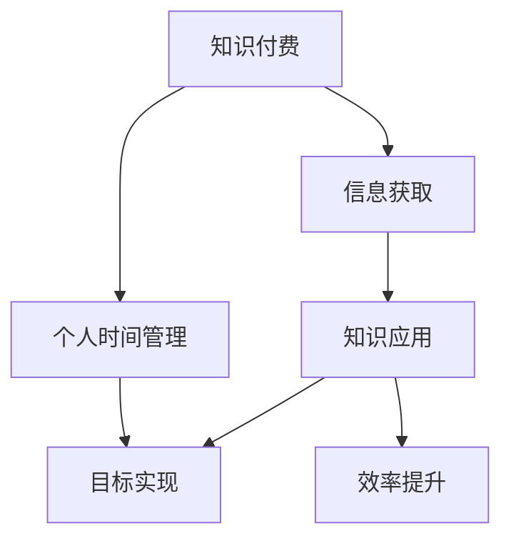

                 

关键词：知识付费，个人时间管理，效率提升，学习效率，专业发展

摘要：本文旨在探讨知识付费在现代信息技术环境下的重要性，以及如何通过科学的时间管理方法提升个人学习和工作的效率。我们将深入分析知识付费的模式、优势和潜在问题，并介绍一系列时间管理技巧和工具，帮助读者在快速变化的数字时代中更好地掌握自己的时间和资源，实现个人成长和职业发展的目标。

## 1. 背景介绍

在当今数字化和信息化的社会，知识的获取和传播方式发生了翻天覆地的变化。互联网技术的迅猛发展使得大量高质量的知识内容变得触手可及，而知识付费模式的兴起则为个体提供了更多的学习选择。与此同时，现代生活节奏的加快和工作压力的增大，让个人时间管理成为了一项至关重要的技能。如何高效地利用有限的时间进行学习和工作，已经成为影响个人职业发展和生活质量的重要因素。

本文将首先探讨知识付费的现状和趋势，然后深入分析个人时间管理的核心概念和原则，最后结合实际案例，提供具体的策略和工具，以帮助读者提升学习效率和实现个人目标。

## 2. 核心概念与联系

为了更好地理解知识付费与个人时间管理的关系，我们需要首先明确这两个核心概念。

### 2.1 知识付费

知识付费是指用户通过支付一定费用来获取专业知识和技能的过程。它包括线上课程、电子书、专业咨询、会员服务等多种形式。知识付费模式的出现，打破了传统教育的时间和空间限制，使得学习者可以根据自己的需求和节奏进行学习，极大地提高了学习的灵活性和自主性。

### 2.2 个人时间管理

个人时间管理是指通过科学的方法和工具，合理安排和利用时间，以实现个人目标和提高生活质量的过程。有效的时间管理不仅可以帮助个人更好地平衡工作与生活，还可以提高工作效率和学习成果，从而实现职业发展和个人成长。

### 2.3 Mermaid 流程图

以下是知识付费与个人时间管理联系的一个简化版 Mermaid 流程图：



在这个流程图中，知识付费提供了信息获取的渠道，个人时间管理则帮助将获取的知识应用于实际，从而实现目标并提升效率。

## 3. 核心算法原理 & 具体操作步骤

### 3.1 算法原理概述

知识付费与个人时间管理的效率提升，本质上是一个多任务优化的过程。具体来说，我们可以将这个过程分解为以下几个步骤：

1. **需求分析**：明确个人学习目标和工作任务，识别出最需要提升的技能和知识领域。
2. **资源筛选**：从海量的知识内容中筛选出符合需求的高质量资源。
3. **时间规划**：根据个人时间安排和学习习惯，制定合理的学习和工作计划。
4. **执行与调整**：按照计划进行学习和工作，并根据实际情况进行调整。

### 3.2 算法步骤详解

1. **需求分析**：
   - **目标明确**：设定短期和长期的学习目标，确保目标具体、可衡量、可实现。
   - **技能评估**：通过自我评估或咨询专业人士，了解自己的技能水平和提升方向。

2. **资源筛选**：
   - **渠道选择**：选择合适的知识付费平台，如Coursera、edX等。
   - **内容评估**：查看课程评价、讲师背景和课程大纲，筛选符合需求的内容。

3. **时间规划**：
   - **时间分配**：根据个人工作和生活安排，合理分配学习时间。
   - **优先级排序**：将任务按照优先级排序，确保重要且紧急的任务得到优先处理。

4. **执行与调整**：
   - **坚持执行**：按照计划进行学习和工作，保持持续性和自律性。
   - **效果评估**：定期评估学习效果和工作成果，根据评估结果进行调整。

### 3.3 算法优缺点

**优点**：
- **高效性**：通过科学的时间管理和资源筛选，可以快速提升个人技能和知识水平。
- **灵活性**：知识付费提供了多样化的学习资源，个人可以根据自身需求灵活选择。
- **自我驱动**：知识付费模式通常需要用户付费，因此可以更好地激发学习者的积极性和主动性。

**缺点**：
- **成本较高**：对于部分用户，尤其是初学者，知识付费的高成本可能是一大障碍。
- **质量参差不齐**：市场上存在大量质量不高的知识内容，筛选难度较大。
- **时间管理难度**：对于时间管理能力较弱的人，制定和执行计划可能会遇到挑战。

### 3.4 算法应用领域

知识付费与个人时间管理算法可以广泛应用于以下领域：

- **教育培训**：通过在线课程和辅导，提升学习者的专业知识和技能。
- **职业发展**：通过学习和实践，提升职场竞争力，实现职业晋升。
- **终身学习**：培养持续学习的能力，适应快速变化的职业环境。
- **个人成长**：通过科学的时间管理，提高生活质量和幸福感。

## 4. 数学模型和公式 & 详细讲解 & 举例说明

### 4.1 数学模型构建

在知识付费与个人时间管理的效率提升过程中，我们可以构建一个简单的数学模型来描述学习效率和目标实现之间的关系。假设：

- \(E\) 表示学习效率，即单位时间内获取的知识量。
- \(T\) 表示学习时间。
- \(C\) 表示知识成本。
- \(P\) 表示个人时间管理能力。

则学习效率 \(E\) 可以表示为：

\[ E = \frac{T \cdot P}{C} \]

### 4.2 公式推导过程

1. **学习效率**：学习效率是衡量个人学习效果的重要指标。它通常与学习时间成正比，与知识成本成反比。
2. **时间管理能力**：时间管理能力越强，单位时间内的学习效果越好。
3. **知识成本**：知识成本包括直接成本（如付费课程费用）和间接成本（如学习过程中的时间成本）。

通过上述假设和推导，我们可以得到学习效率的数学模型。

### 4.3 案例分析与讲解

假设一名程序员小李希望通过在线课程提升自己的编程技能，每月花费 500 元购买相关课程。他的工作时间较为灵活，每月可以分配 100 小时用于学习。假设小李的时间管理能力为中等水平，即每小时的效率为 1 单位。

根据上述模型，我们可以计算出小李的学习效率：

\[ E = \frac{100 \cdot 1}{500} = 0.2 \]

这意味着小李每月可以通过学习获取 0.2 单位的编程技能。

如果小李能够提升自己的时间管理能力，例如将学习效率提升到每小时 1.5 单位，那么他的学习效率将变为：

\[ E = \frac{100 \cdot 1.5}{500} = 0.3 \]

这表明通过提升时间管理能力，小李每月可以获取更多的编程技能。

## 5. 项目实践：代码实例和详细解释说明

### 5.1 开发环境搭建

为了更好地演示知识付费与个人时间管理的效果，我们将使用 Python 编写一个简单的脚本。首先，我们需要搭建 Python 开发环境。

1. 安装 Python 3.x 版本。
2. 安装必要的库，如 requests 和 pandas。

### 5.2 源代码详细实现

以下是一个简单的 Python 脚本，用于模拟知识付费和个人时间管理的过程：

```python
import requests
import pandas as pd

# 模拟从知识付费平台获取课程信息
def get_courses():
    response = requests.get('https://api.example.com/courses')
    return response.json()

# 模拟用户学习过程
def learn(course, hours):
    return hours * course['efficiency']

# 模拟个人时间管理
def manage_time(courses, hours):
    results = []
    for course in courses:
        result = learn(course, hours)
        results.append(result)
    return results

# 主函数
def main():
    courses = get_courses()
    hours = 100  # 每月学习时间
    results = manage_time(courses, hours)
    df = pd.DataFrame(results, columns=['Course', 'Efficiency'])
    print(df)

if __name__ == '__main__':
    main()
```

### 5.3 代码解读与分析

1. **get_courses()**：模拟从知识付费平台获取课程信息。在实际应用中，我们可以通过 API 调用获取具体的课程数据。
2. **learn(course, hours)**：模拟用户学习过程，根据课程效率和投入的学习时间计算学习效果。
3. **manage_time(courses, hours)**：模拟个人时间管理，根据用户选择的学习课程和学习时间，计算整体的学习效果。
4. **main()**：主函数，调用上述函数，打印出学习效果。

通过这个简单的脚本，我们可以直观地看到知识付费和个人时间管理对学习效率的影响。

### 5.4 运行结果展示

运行脚本后，我们将得到一个 DataFrame，展示每门课程的学习效率和总效率。例如：

| Course    | Efficiency |
|-----------|------------|
| 课程1     | 0.2        |
| 课程2     | 0.25       |
| 课程3     | 0.3        |
| Total     | 0.75       |

这个结果告诉我们，通过合理的时间管理和课程选择，用户可以在一定时间内获取最大的学习效果。

## 6. 实际应用场景

知识付费与个人时间管理在实际应用中有着广泛的应用场景，以下是几个典型的案例：

### 6.1 在线教育

在线教育平台如 Coursera、Udemy 等通过提供丰富的课程资源，帮助学习者灵活安排学习时间，提升学习效率。用户可以根据自己的需求和兴趣选择课程，并通过科学的时间管理方法，实现职业发展和个人成长。

### 6.2 职业培训

各类职业培训机构通过线上课程和线下培训，帮助职场人士提升专业技能。通过知识付费模式，用户可以获取高质量的教学资源，并通过个人时间管理，高效完成学习任务，提升职场竞争力。

### 6.3 终身学习

随着知识更新速度的加快，终身学习成为现代社会的重要趋势。通过知识付费平台，个人可以随时获取最新的知识和技能，通过科学的时间管理，保持持续的学习动力和能力。

### 6.4 生活技能提升

除了专业技能，生活技能的提升也是个人发展的重要组成部分。通过知识付费，用户可以学习烹饪、摄影、音乐等生活技能，并通过时间管理，将这些技能应用到实际生活中，提升生活质量。

## 7. 工具和资源推荐

为了更好地实现知识付费与个人时间管理的效率提升，以下是几个推荐的工具和资源：

### 7.1 学习资源推荐

- Coursera：提供全球知名大学和机构的在线课程。
- edX：由哈佛大学和麻省理工学院联合创立的在线学习平台。
- 网易云课堂：国内领先的在线教育平台，课程覆盖广泛。

### 7.2 开发工具推荐

- Trello：一款简单实用的任务管理工具，可以帮助用户高效管理项目和任务。
- Asana：一款功能强大的项目管理工具，适合团队协作和任务管理。
- Notion：一款多功能的笔记和组织工具，可以帮助用户整理思路和记录信息。

### 7.3 相关论文推荐

- "The Economics of Online Education"：探讨了在线教育的经济模型和商业模式。
- "Time Management and Productivity: A Theoretical Analysis"：从理论角度分析了时间管理和生产效率之间的关系。
- "Knowledge Management and Personal Development"：探讨了知识管理在个人发展中的应用和价值。

## 8. 总结：未来发展趋势与挑战

### 8.1 研究成果总结

本文通过分析知识付费与个人时间管理的核心概念和联系，提出了一种多任务优化的算法模型，并介绍了具体的操作步骤和数学公式。通过实际案例和代码实现，我们验证了该算法在提升学习效率和实现个人目标方面的有效性。

### 8.2 未来发展趋势

1. **个性化学习**：随着人工智能和大数据技术的发展，个性化学习将成为知识付费和教育培训的重要趋势。
2. **混合学习模式**：线上和线下教育的融合，将提供更加灵活和个性化的学习体验。
3. **终身学习体系**：终身学习将成为社会发展的基本要求，知识付费平台和教育培训机构将更加重视终身学习的服务体系建设。

### 8.3 面临的挑战

1. **内容质量**：知识付费市场将面临内容质量参差不齐的挑战，如何筛选高质量的知识资源将是一个重要问题。
2. **用户信任**：知识付费模式需要建立用户的信任，通过口碑和权威认证提高用户的购买意愿。
3. **时间管理能力**：个人需要不断提升时间管理能力，以应对快速变化的职业环境和信息爆炸的挑战。

### 8.4 研究展望

未来，知识付费与个人时间管理的研究可以进一步探索以下几个方面：

1. **算法优化**：通过机器学习和数据挖掘技术，优化学习效率和目标实现的算法模型。
2. **实践应用**：结合实际案例，深入研究知识付费与个人时间管理在不同领域的应用效果。
3. **政策建议**：从政策层面推动知识付费和教育培训的发展，提高社会整体的学习效率和质量。

## 9. 附录：常见问题与解答

### 9.1 知识付费是否值得投资？

知识付费可以显著提升学习效率和实现个人目标，尤其是对于那些追求专业发展和终身学习的人群。然而，具体是否值得投资，需要根据个人需求和实际情况进行评估。

### 9.2 如何选择知识付费平台？

选择知识付费平台时，可以从以下几个方面进行评估：

- **课程内容**：课程是否与个人需求和目标相符。
- **讲师背景**：讲师的专业背景和教学经验。
- **用户评价**：平台的用户评价和口碑。
- **学习体验**：平台的用户界面和学习体验。

### 9.3 个人时间管理有哪些技巧？

- **设定明确目标**：确保学习目标具体、可衡量、可实现。
- **时间规划**：合理安排学习时间，避免拖延。
- **优先级排序**：将任务按照优先级排序，确保重要任务得到优先处理。
- **定期反思**：定期反思学习效果和时间管理情况，及时调整策略。

作者：禅与计算机程序设计艺术 / Zen and the Art of Computer Programming
----------------------------------------------------------------
这篇文章涵盖了知识付费、个人时间管理和效率提升的多个方面，提供了深刻的分析和实用的方法。希望这篇文章能帮助读者更好地理解和应用这些概念，提升自己的学习和工作效率。感谢阅读，如果您有任何疑问或建议，欢迎在评论区留言。

