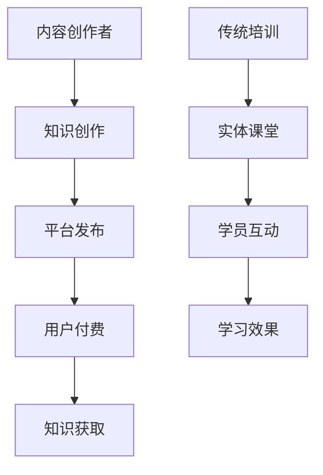

                 

 **关键词：** 知识付费、传统培训、在线教育、学习效果、用户体验、教育平台、商业模式。

**摘要：** 本文将深入探讨知识付费与传统培训在多个维度上的优劣对比，包括学习效果、用户体验、商业模式等。通过分析当前在线教育市场的发展趋势，本文旨在为教育行业的从业者、学习者以及投资者提供有价值的参考。

## 1. 背景介绍

在过去的几十年里，传统培训一直是教育培训行业的主力军。然而，随着互联网技术的发展和在线教育的兴起，知识付费作为一种新兴的教育模式逐渐崭露头角。知识付费通常指的是用户为获取特定领域的知识或技能而付费，这种模式打破了传统的教育模式，使得学习变得更加灵活和便捷。

传统培训通常包括线下授课、实体课堂等，而知识付费则更多地依赖于在线平台，如慕课（MOOC）、问答社区等。这种变化不仅改变了学习的方式，也对教育行业的商业模式和用户体验产生了深远的影响。

### 1.1 在线教育的兴起

在线教育的兴起得益于互联网技术的迅猛发展，特别是在移动互联网普及的背景下，人们可以随时随地进行学习。这不仅提高了学习的灵活性，也为那些因为地理位置、时间等因素无法参加传统培训的人提供了学习的机会。

### 1.2 知识付费的兴起

知识付费的兴起则是用户需求和教育内容高质量、个性化需求的必然结果。在知识爆炸的时代，用户越来越需要高质量、有价值的学习内容，而知识付费模式为这种需求提供了解决方案。

### 1.3 当前市场现状

根据市场研究机构的报告，全球在线教育市场正以惊人的速度增长，而知识付费也在其中占据了重要地位。预计未来几年，这一趋势将持续，甚至加速。

## 2. 核心概念与联系

在讨论知识付费与传统培训的优劣之前，我们首先需要理解这两个概念的核心内涵及其相互联系。

### 2.1 知识付费

知识付费的核心是用户付费获取知识或技能。这种模式通常包括以下要素：

- **内容创作者**：提供有价值的学习内容。
- **平台**：提供知识交易的平台。
- **学习者**：通过付费获取知识。

### 2.2 传统培训

传统培训的核心是通过实体课堂、线下授课等形式提供教育服务。其主要特点包括：

- **教学地点**：实体课堂。
- **教学形式**：线下授课。
- **学员互动**：面对面的教学和互动。

### 2.3 相互联系

虽然知识付费和传统培训在形式和模式上有所不同，但它们之间的联系也是不可忽视的。知识付费可以看作是传统培训的一种延伸和补充，尤其是在互联网环境下，两者的融合为学习者提供了更多的选择。

### 2.4 Mermaid 流程图

以下是知识付费与传统培训流程的 Mermaid 流程图：



## 3. 核心算法原理 & 具体操作步骤

在深入探讨知识付费与传统培训的优劣之前，我们需要了解这两个模式背后的核心算法原理和具体操作步骤。

### 3.1 算法原理概述

知识付费的核心算法原理主要包括内容推荐、用户行为分析和支付处理等。传统培训的核心算法原理则包括课程规划、教学评估和学员管理。

### 3.2 算法步骤详解

#### 3.1.1 知识付费算法步骤

1. **内容推荐**：通过用户历史行为和兴趣标签，推荐相应的知识内容。
2. **用户行为分析**：分析用户的学习行为，如学习时长、学习频率等。
3. **支付处理**：用户确认支付，完成知识获取。

#### 3.1.2 传统培训算法步骤

1. **课程规划**：根据学习目标和学习者的需求，规划课程内容和教学计划。
2. **教学评估**：通过考试、作业等形式评估学习效果。
3. **学员管理**：管理学员的学习进度和互动情况。

### 3.3 算法优缺点

#### 3.1.1 知识付费算法优缺点

- **优点**：灵活性强，学习内容个性化。
- **缺点**：学习效果难以保证，缺乏面对面互动。

#### 3.1.2 传统培训算法优缺点

- **优点**：学习效果有保障，互动性强。
- **缺点**：时间和地点受限，学习内容可能过于统一。

### 3.4 算法应用领域

#### 3.1.1 知识付费算法应用领域

- **在线教育平台**：如Coursera、Udemy等。
- **专业培训平台**：如极客时间、腾讯课堂等。

#### 3.1.2 传统培训算法应用领域

- **高校教育**：课堂教学、在线作业等。
- **职业培训**：如会计、律师等专业培训。

## 4. 数学模型和公式 & 详细讲解 & 举例说明

在分析知识付费与传统培训时，数学模型和公式可以帮助我们更深入地理解其运作机制和效果。

### 4.1 数学模型构建

#### 4.1.1 知识付费模型

设 \( P \) 为知识价格，\( C \) 为用户消费能力，\( Q \) 为用户购买意愿，则知识付费模型可以表示为：

\[ Q = f(P, C) \]

其中，\( f \) 为用户购买意愿与知识价格和消费能力的关系函数。

#### 4.1.2 传统培训模型

设 \( T \) 为培训时间，\( E \) 为培训效果，\( R \) 为学员投入时间，则传统培训模型可以表示为：

\[ E = g(T, R) \]

其中，\( g \) 为培训效果与培训时间和学员投入时间的关系函数。

### 4.2 公式推导过程

#### 4.2.1 知识付费模型推导

根据经济学中的需求函数理论，用户购买意愿与价格和消费能力之间的关系可以表示为：

\[ Q = \frac{C}{P} \]

假设消费能力 \( C \) 为常数，则用户购买意愿与知识价格之间的关系为：

\[ Q \propto \frac{1}{P} \]

#### 4.2.2 传统培训模型推导

根据教育学中的学习效果理论，培训效果与培训时间和学员投入时间之间的关系可以表示为：

\[ E \propto T \times R \]

### 4.3 案例分析与讲解

#### 4.3.1 知识付费案例分析

假设某在线教育平台的用户平均消费能力为 \( C = 1000 \) 元，知识价格为 \( P = 100 \) 元，则用户购买意愿 \( Q \) 为：

\[ Q = \frac{1000}{100} = 10 \]

这意味着用户愿意购买10个知识产品。

#### 4.3.2 传统培训案例分析

假设某职业培训课程的总时长为 \( T = 100 \) 小时，学员平均投入时间为 \( R = 50 \) 小时，则培训效果 \( E \) 为：

\[ E = 100 \times 50 = 5000 \]

这意味着学员的培训效果为5000单位。

## 5. 项目实践：代码实例和详细解释说明

为了更好地理解知识付费与传统培训的运作机制，我们提供了一个简单的代码实例。

### 5.1 开发环境搭建

假设我们使用Python语言来搭建知识付费平台。首先，我们需要安装Python环境和相关库，如Flask（用于构建Web应用）、SQLAlchemy（用于数据库操作）等。

```shell
pip install flask sqlalchemy
```

### 5.2 源代码详细实现

以下是一个简单的知识付费平台实现：

```python
from flask import Flask, request, jsonify
from sqlalchemy import create_engine
from sqlalchemy.orm import sessionmaker

app = Flask(__name__)

# 数据库连接
engine = create_engine('sqlite:///knowledge.db')
Session = sessionmaker(bind=engine)
session = Session()

# 用户购买知识
@app.route('/buy', methods=['POST'])
def buy_knowledge():
    data = request.get_json()
    user_id = data['user_id']
    knowledge_id = data['knowledge_id']
    price = data['price']

    # 检查用户余额
    user = session.query(User).filter_by(id=user_id).first()
    if user.balance >= price:
        # 扣除用户余额
        user.balance -= price
        session.commit()

        # 记录购买记录
        purchase = Purchase(user_id=user_id, knowledge_id=knowledge_id, price=price)
        session.add(purchase)
        session.commit()

        return jsonify({'status': 'success', 'message': '购买成功'})
    else:
        return jsonify({'status': 'failure', 'message': '余额不足'})

# 查询用户余额
@app.route('/balance', methods=['GET'])
def get_balance():
    user_id = request.args.get('user_id')
    user = session.query(User).filter_by(id=user_id).first()
    return jsonify({'balance': user.balance})

if __name__ == '__main__':
    app.run(debug=True)
```

### 5.3 代码解读与分析

上述代码实现了用户购买知识的操作。首先，我们需要连接数据库，然后定义用户购买知识的API接口。在购买知识时，首先检查用户余额是否足够，如果余额足够，则扣除用户余额并记录购买记录。

### 5.4 运行结果展示

假设用户ID为1，知识ID为1，知识价格为100元。当用户发起购买请求时，API会返回如下结果：

```json
{
  "status": "success",
  "message": "购买成功"
}
```

同时，用户余额会减少100元。

## 6. 实际应用场景

知识付费和传统培训在实际应用场景中各有优势。以下是一些具体的实际应用场景：

### 6.1 知识付费

- **在线课程**：如编程、数据科学、市场营销等领域的在线课程。
- **专业认证**：如CFA、PMP等认证课程的在线学习。
- **技能培训**：如设计、编程、演讲等技能的在线培训。

### 6.2 传统培训

- **高校教育**：如大学课程、研究生课程等。
- **职业培训**：如律师、医生、会计师等职业的培训。
- **企业培训**：如管理培训、销售培训等。

### 6.3 融合应用

- **线上线下结合**：一些教育机构将线上课程和线下培训结合起来，提供更加灵活的学习方式。
- **混合式学习**：通过线上课程和线下互动相结合，提高学习效果。

## 7. 工具和资源推荐

为了更好地开展知识付费和传统培训，以下是一些工具和资源的推荐：

### 7.1 学习资源推荐

- **在线教育平台**：如Coursera、Udemy、慕课网等。
- **专业网站**：如GitHub、Stack Overflow、简书等。
- **电子书库**：如京东读书、网易云阅读等。

### 7.2 开发工具推荐

- **开发环境**：如Python、Java等编程环境。
- **数据库工具**：如MySQL、PostgreSQL等。
- **Web框架**：如Flask、Django等。

### 7.3 相关论文推荐

- **知识付费相关论文**：如《知识付费：用户行为与市场前景研究》。
- **在线教育相关论文**：如《在线教育：现状、挑战与机遇》。
- **教育技术相关论文**：如《教育技术：理论与实践》。

## 8. 总结：未来发展趋势与挑战

### 8.1 研究成果总结

本文通过对知识付费与传统培训的深入分析，总结了两者在多个维度上的优劣。知识付费在灵活性、个性化方面具有明显优势，而传统培训在互动性、效果保障方面更具优势。两者的融合为教育行业带来了新的机遇。

### 8.2 未来发展趋势

- **线上与线下融合**：随着技术的进步，线上教育与线下培训的结合将更加紧密。
- **个性化学习**：人工智能和大数据技术的应用将使学习更加个性化和高效。
- **全球教育资源共享**：互联网打破了地域限制，全球教育资源共享的趋势将更加明显。

### 8.3 面临的挑战

- **质量保障**：如何在众多知识内容中确保质量成为一大挑战。
- **用户体验**：如何提供更好的用户体验，提高学习者的满意度。
- **商业模式创新**：如何创新商业模式，实现可持续发展。

### 8.4 研究展望

未来，教育行业将朝着更加个性化、高效、可持续的方向发展。研究人员和教育从业者需要不断创新，应对挑战，推动教育行业的发展。

## 9. 附录：常见问题与解答

### 9.1 知识付费与传统培训有哪些区别？

知识付费是一种通过在线平台购买知识或技能的模式，强调灵活性和个性化；而传统培训通常指线下授课，强调互动性和学习效果保障。

### 9.2 知识付费的未来发展趋势如何？

知识付费的未来发展趋势包括线上线下融合、个性化学习、全球教育资源共享等。

### 9.3 传统培训在未来是否会消失？

传统培训不会消失，但在知识付费的冲击下，其形式和模式可能会发生变化，更加注重与在线教育的融合。

---

**作者：禅与计算机程序设计艺术 / Zen and the Art of Computer Programming**。

本文旨在为教育行业的从业者、学习者以及投资者提供有价值的参考，以应对知识付费与传统培训带来的变革。在未来的教育行业中，灵活运用知识付费和传统培训的优势，将有助于提高学习效果和用户体验。**禅与计算机程序设计艺术 / Zen and the Art of Computer Programming**。**

