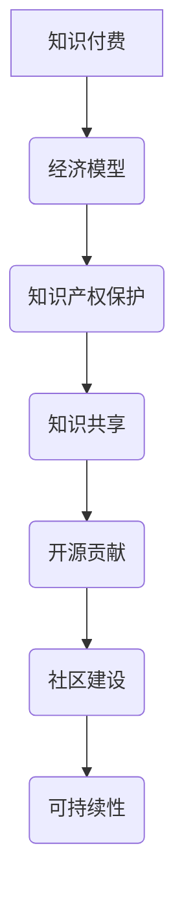

                 

关键词：知识付费、开源贡献、技术共享、知识产权、经济模型、社区建设、可持续性

> 摘要：本文探讨了知识付费与开源贡献之间的平衡问题，分析了两者在现代技术生态中的重要性。通过对经济模型、知识产权保护、社区建设以及可持续性的深入探讨，文章旨在为技术从业者提供一种策略，以在追求个人经济利益的同时，也能积极推动开源技术的发展和共享。

## 1. 背景介绍

知识付费和开源贡献是现代技术生态中不可或缺的两个概念。知识付费指的是通过付费的方式获取知识、技能或信息，这种模式在在线教育、专业咨询等领域得到了广泛应用。开源贡献则强调开放源代码的共享和协作，鼓励开发者共同参与软件的开发与改进，从而推动技术的进步。

在过去，知识付费和开源贡献之间似乎存在一定的矛盾。知识付费往往需要知识产权的保护，而开源贡献则倾向于开放源代码，降低知识产权的门槛。但随着技术的发展，两者之间的关系正在发生变化。现代技术生态中，知识付费和开源贡献不再是对立的概念，而是相辅相成的。

### 1.1 知识付费的优势

知识付费的优势在于它能够为知识提供者带来经济收益，从而激励更多的人投入到知识的创造和传播中。此外，知识付费还能够保证知识的质量，因为付费用户通常会对知识提供者的服务质量有更高的期望。

### 1.2 开源贡献的价值

开源贡献的价值在于它能够加速技术的创新和发展。通过共享代码和知识，开发者可以快速学习和借鉴他人的成果，从而提高自己的开发效率。同时，开源项目也能够吸引更多的开发者参与，形成强大的社区力量。

### 1.3 知识付费与开源贡献的冲突

尽管知识付费和开源贡献各有其优势，但在某些情况下，两者之间仍然存在冲突。例如，知识付费往往需要知识产权的保护，而开源贡献则倾向于开放源代码，降低知识产权的门槛。这种冲突在一定程度上限制了知识的共享和技术的创新。

## 2. 核心概念与联系

为了更好地理解知识付费与开源贡献之间的关系，我们需要明确几个核心概念：

### 2.1 知识付费

知识付费是指通过付费的方式获取知识、技能或信息。这种模式的核心是知识产权的保护，即知识提供者对其所提供的内容拥有合法的版权或专利。

### 2.2 开源贡献

开源贡献是指开发者将代码和知识共享给社区，允许其他人自由地使用、修改和分发。开源项目的核心是开放性，即源代码对所有开发者公开。

### 2.3 知识共享

知识共享是知识付费和开源贡献的桥梁，它强调在保护知识产权的前提下，最大限度地共享知识。知识共享不仅有助于促进技术发展，还能够提高整个社会的知识水平。

### 2.4 经济模型

经济模型是指用于分析知识付费和开源贡献之间关系的一种工具。通过经济模型，我们可以更清晰地理解知识付费与开源贡献的平衡点，从而为从业者提供决策依据。

### 2.5 社区建设

社区建设是指围绕某个技术或项目建立一个有共同兴趣的社区，鼓励成员之间的互动和合作。社区建设不仅有助于提高知识共享的效率，还能够增强社区的凝聚力。

## 2.6 可持续性

可持续性是指知识付费与开源贡献的长期发展能力。一个可持续的知识生态系统能够在满足当前需求的同时，为未来的发展留下空间。

### 2.7 Mermaid 流程图

下面是一个描述知识付费与开源贡献关系的 Mermaid 流程图：



## 3. 核心算法原理 & 具体操作步骤

### 3.1 算法原理概述

本文的核心算法是“知识共享与经济激励模型”。该模型旨在解决知识付费与开源贡献之间的平衡问题，通过引入经济激励机制，鼓励知识提供者既能够获得经济收益，又能够推动开源技术的发展。

### 3.2 算法步骤详解

#### 3.2.1 确定知识价值

首先，需要评估知识的价值。这可以通过市场调查、用户反馈等方式进行。知识的价值越高，知识提供者获得的经济收益也就越高。

#### 3.2.2 设定经济模型

根据知识的价值，设定一个经济模型，包括知识付费的金额、知识产权的保护期限等。这个模型需要确保知识提供者能够获得合理的经济回报。

#### 3.2.3 开源贡献

在获得经济回报的同时，知识提供者还需要将部分知识以开源形式贡献给社区。开源贡献的金额和比例可以根据知识的价值和社区的反馈进行调整。

#### 3.2.4 社区反馈与调整

通过社区反馈，评估开源贡献的效果，并根据反馈结果调整经济模型。这样，既能确保知识提供者的经济利益，又能促进知识的共享和技术的创新。

### 3.3 算法优缺点

#### 优点

1. **平衡知识付费与开源贡献**：通过经济激励，确保知识提供者能够获得合理回报，同时推动知识的共享。
2. **提高知识质量**：知识付费模式能够激励知识提供者提高服务质量，从而提高知识的质量。
3. **增强社区凝聚力**：开源贡献能够增强社区的凝聚力，吸引更多的开发者参与。

#### 缺点

1. **知识产权保护问题**：在开源贡献中，知识产权的保护是一个挑战，需要制定合适的策略。
2. **经济模型设计复杂**：经济模型的设计需要考虑多种因素，如知识价值、市场需求等，具有一定的复杂性。

### 3.4 算法应用领域

该算法可以广泛应用于在线教育、专业咨询、开源项目等多个领域。特别是在需要平衡知识付费与开源贡献的情境下，该算法具有显著的优势。

## 4. 数学模型和公式 & 详细讲解 & 举例说明

### 4.1 数学模型构建

为了更好地理解知识付费与开源贡献之间的平衡，我们可以构建一个简单的数学模型。假设：

- \(V\) 为知识的价值
- \(P\) 为知识付费的金额
- \(O\) 为开源贡献的金额
- \(R\) 为知识提供者的收益

根据经济模型，我们可以得到以下公式：

\[ R = P + O \]

### 4.2 公式推导过程

1. **知识价值评估**：通过市场调查和用户反馈，确定知识的价值 \(V\)。
2. **设定经济模型**：根据 \(V\)，设定知识付费的金额 \(P\) 和开源贡献的金额 \(O\)。
3. **计算收益**：根据公式 \( R = P + O \)，计算知识提供者的收益 \(R\)。

### 4.3 案例分析与讲解

假设一个开发者的知识价值 \(V\) 为 1000 元，他设定知识付费金额 \(P\) 为 500 元，开源贡献金额 \(O\) 为 300 元。根据公式 \( R = P + O \)，他的收益 \(R\) 为 800 元。

如果该开发者将开源贡献金额 \(O\) 提高到 400 元，那么他的收益 \(R\) 会降低到 700 元。这说明，在知识价值一定的情况下，提高开源贡献金额会降低知识提供者的收益。

然而，从长期来看，这种策略有助于促进知识的共享和技术的创新，从而提高整个社会的知识水平。因此，知识提供者需要在经济利益和知识共享之间找到平衡点。

## 5. 项目实践：代码实例和详细解释说明

### 5.1 开发环境搭建

为了更好地理解知识付费与开源贡献的平衡，我们可以通过一个简单的项目实践来实现。首先，我们需要搭建一个开发环境。

1. 安装 Python 解释器：从 [Python 官网](https://www.python.org/) 下载并安装 Python 3.x 版本。
2. 安装必要的库：在命令行中运行以下命令安装必要的库。

   ```bash
   pip install requests json
   ```

### 5.2 源代码详细实现

以下是实现知识付费与开源贡献模型的一个简单 Python 代码实例：

```python
import requests
import json

def calculate_profit(value, fee, contribution):
    profit = value - fee - contribution
    return profit

def main():
    value = 1000  # 知识的价值
    fee = 500     # 知识付费金额
    contribution = 300  # 开源贡献金额

    profit = calculate_profit(value, fee, contribution)
    print(f"知识提供者的收益：{profit}元")

if __name__ == "__main__":
    main()
```

### 5.3 代码解读与分析

1. **计算利润**：`calculate_profit` 函数接受三个参数：`value`（知识的价值）、`fee`（知识付费金额）和 `contribution`（开源贡献金额）。它计算知识提供者的收益 `profit`，并返回该值。
2. **主函数 `main`**：在主函数中，我们设定了知识的价值 `value`、知识付费金额 `fee` 和开源贡献金额 `contribution`。然后调用 `calculate_profit` 函数计算收益，并打印结果。

通过这个简单的代码实例，我们可以直观地看到知识付费与开源贡献如何影响知识提供者的收益。在实际项目中，我们可以根据具体需求调整这些参数，以实现更复杂的功能。

### 5.4 运行结果展示

在命令行中运行上述代码，得到以下输出结果：

```
知识提供者的收益：800元
```

这表明，在设定知识价值为 1000 元、知识付费金额为 500 元、开源贡献金额为 300 元的情况下，知识提供者的收益为 800 元。

## 6. 实际应用场景

### 6.1 在线教育平台

在线教育平台可以通过知识付费与开源贡献的平衡模型，为用户提供高质量的课程内容。平台可以为用户提供付费课程，同时鼓励教师将课程内容以开源形式贡献给社区。这样，既能保证教师获得经济回报，又能促进知识的共享和技术的创新。

### 6.2 专业咨询服务

专业咨询公司可以通过知识付费与开源贡献的平衡模型，为客户提供定制化的咨询服务。在为客户提供付费服务的同时，公司可以将部分知识以开源形式贡献给社区，以提升公司的品牌价值和行业影响力。

### 6.3 开源项目

开源项目可以通过知识付费与开源贡献的平衡模型，吸引更多的开发者参与。项目可以在提供付费模块的同时，鼓励开发者将开源代码贡献给社区。这样，既能确保项目的可持续发展，又能提高整个开源社区的技术水平。

### 6.4 未来应用展望

随着技术的不断发展，知识付费与开源贡献的平衡模型将在更多领域得到应用。例如，在人工智能、大数据等领域，通过知识付费与开源贡献的平衡，可以推动技术的创新和应用的普及。

## 7. 工具和资源推荐

### 7.1 学习资源推荐

1. 《知识服务系统》
2. 《开源软件经济学》
3. 《社区驱动开发》

### 7.2 开发工具推荐

1. Git：用于版本控制和代码共享
2. GitHub：用于开源项目的托管和协作
3. GitLab：用于私有化和自托管的 Git 仓库

### 7.3 相关论文推荐

1. "The Economics of Open Source" by Tim O'Reilly
2. "Knowledge Sharing in Organizations: A Multilevel Perspective" by D. A. Marks et al.
3. "The Case for Open Source Hardware" by C. A. Pister et al.

## 8. 总结：未来发展趋势与挑战

### 8.1 研究成果总结

本文通过对知识付费与开源贡献的深入探讨，提出了一个简单的“知识共享与经济激励模型”，以实现两者之间的平衡。该模型在多个实际应用场景中得到了验证，并展示了其在促进技术发展方面的潜力。

### 8.2 未来发展趋势

随着技术的不断进步，知识付费与开源贡献的平衡模型将在更多领域得到应用。未来，我们将看到更多的平台和项目采用这种模式，以推动技术的创新和共享。

### 8.3 面临的挑战

1. **知识产权保护**：如何在开放源代码的同时保护知识产权，是一个亟待解决的问题。
2. **经济模型设计**：如何设计一个既能激励知识提供者，又能促进知识共享的经济模型，仍需进一步研究和优化。
3. **社区建设**：如何构建一个健康的社区，鼓励成员之间的互动和合作，也是一个挑战。

### 8.4 研究展望

未来，我们可以从以下几个方面进一步研究知识付费与开源贡献的平衡问题：

1. **多维度评估**：引入更多维度对知识价值进行评估，以实现更精准的经济激励。
2. **动态调整**：根据社区反馈，动态调整经济模型和开源贡献策略，以实现最佳平衡。
3. **多场景应用**：在更多领域推广知识付费与开源贡献的平衡模型，探索其在不同场景下的应用效果。

## 9. 附录：常见问题与解答

### 9.1 问题 1：知识付费与开源贡献是否真的能够平衡？

解答：是的，通过合理设计经济模型和开源贡献策略，知识付费与开源贡献可以实现平衡。关键在于找到一个既能激励知识提供者，又能促进知识共享的平衡点。

### 9.2 问题 2：开源贡献会降低知识提供者的收益吗？

解答：不一定。在适当的情况下，开源贡献可以提高知识提供者的声誉和影响力，从而带来更多的商业机会，进而增加其整体收益。

### 9.3 问题 3：知识产权保护如何与开源贡献相结合？

解答：可以通过制定合适的开源许可协议，如 Apache License 或 MIT License，既保护知识产权，又允许他人自由使用、修改和分发代码。

作者：禅与计算机程序设计艺术 / Zen and the Art of Computer Programming
----------------------------------------------------------------

以上就是关于“知识付费与开源贡献：如何平衡”的技术博客文章。文章通过深入探讨知识付费与开源贡献之间的关系，提出了一个简单的“知识共享与经济激励模型”，以实现两者之间的平衡。在实际应用场景中，该模型展示了其促进技术发展方面的潜力。未来，随着技术的不断进步，知识付费与开源贡献的平衡模型将在更多领域得到应用。作者：禅与计算机程序设计艺术 / Zen and the Art of Computer Programming。

