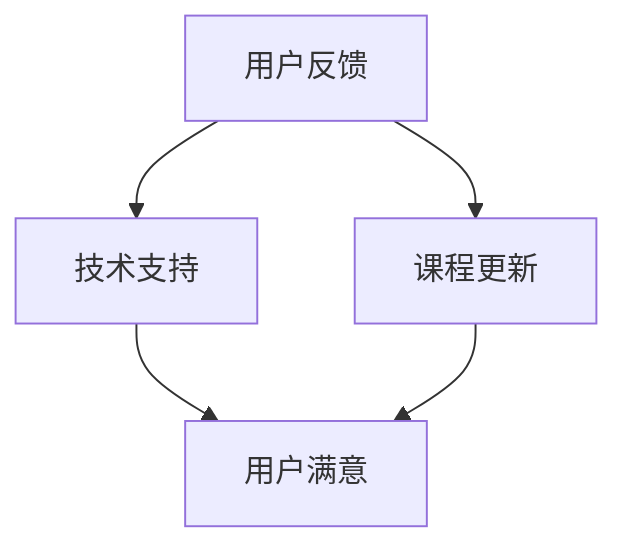

                 

 在知识付费行业迅猛发展的背景下，构建一个完善的售后服务体系成为企业能否持续吸引和留住用户的关键。本文将深入探讨知识付费产品的售后服务体系构建，包括其重要性、核心组成部分、实施策略以及未来发展趋势。

## 文章关键词

- 知识付费
- 售后服务
- 用户满意
- 客户体验
- 服务质量

## 文章摘要

本文旨在分析知识付费产品售后服务体系的重要性，并详细探讨其构建方法。通过介绍售后服务体系的核心组成部分，如用户反馈机制、技术支持、课程更新等，本文将提供一套实用的构建策略。此外，文章还将探讨售后服务体系的实际应用场景，并对未来发展趋势和面临的挑战进行分析。

## 1. 背景介绍

知识付费行业近年来呈现出爆发式增长，用户对于高质量知识内容的需求日益增长。然而，在知识付费产品市场中，售后服务体系的构建显得尤为重要。一个完善的售后服务体系不仅能提高用户满意度，还能增强用户对品牌的忠诚度。因此，企业需要重视售后服务体系的构建，以满足用户的需求，提高市场竞争力。

### 1.1 知识付费行业现状

知识付费行业涵盖了在线教育、技能培训、专业咨询等多个领域。根据数据显示，2019年中国知识付费用户规模达到3.2亿人，市场规模达到2300亿元。预计未来几年，这一市场还将保持快速增长。然而，随着竞争的加剧，用户对于知识付费产品的要求也越来越高，尤其是在售后服务方面。

### 1.2 售后服务的重要性

售后服务是用户在使用知识付费产品过程中不可或缺的一环。它不仅关乎用户的购买体验，还直接影响用户的满意度和忠诚度。以下是售后服务体系的重要性：

- **提高用户满意度**：通过及时响应用户的疑问和问题，提供高质量的服务，可以提高用户对产品的满意度。
- **增强品牌忠诚度**：一个完善的售后服务体系能够增强用户对品牌的信任和忠诚度，促使用户继续购买产品。
- **提升市场竞争力**：在竞争激烈的知识付费市场中，提供优质的售后服务是赢得用户和市场的重要手段。
- **促进产品改进**：通过收集用户反馈，企业可以不断优化产品和服务，提高产品质量。

## 2. 核心概念与联系

在构建售后服务体系时，需要了解几个核心概念，如用户反馈机制、技术支持、课程更新等。以下是一个简单的Mermaid流程图，展示了这些概念之间的联系：



### 2.1 用户反馈机制

用户反馈机制是售后服务体系的核心部分之一。通过建立有效的反馈渠道，如在线问卷、客服热线、社交媒体等，企业可以及时了解用户的需求和意见。用户反馈不仅有助于发现产品和服务中的问题，还能为企业提供改进的方向。

### 2.2 技术支持

技术支持是用户在使用知识付费产品过程中可能遇到的问题的重要解决方案。通过提供及时、高效的技术支持，企业可以减少用户的不满意和流失。技术支持可以包括在线帮助文档、FAQ、在线聊天、电话支持等。

### 2.3 课程更新

随着知识更新的快速迭代，知识付费产品需要不断更新内容以保持其价值。课程更新是售后服务体系中不可或缺的一部分，它不仅能满足用户对最新知识的需求，还能提升用户对产品的满意度。

## 3. 核心算法原理 & 具体操作步骤

在售后服务体系的构建过程中，以下几个核心算法原理和操作步骤至关重要：

### 3.1 算法原理概述

售后服务体系的核心算法原理主要包括以下几个方面：

- **用户反馈分析**：通过数据挖掘和机器学习技术，对用户反馈进行分析，提取关键信息和趋势。
- **服务响应优化**：根据用户反馈和服务响应时间的关系，优化服务响应策略，提高用户满意度。
- **课程更新策略**：基于用户行为数据和市场需求，制定科学的课程更新策略，确保课程内容的时效性和准确性。

### 3.2 算法步骤详解

以下是构建售后服务体系的具体操作步骤：

#### 步骤1：用户反馈分析

1. **数据收集**：通过多种渠道收集用户反馈数据，如在线问卷、客服记录、社交媒体评论等。
2. **数据清洗**：对收集到的用户反馈数据去重、去噪，确保数据质量。
3. **文本分析**：使用自然语言处理技术对用户反馈进行文本分析，提取关键词和情感倾向。
4. **趋势分析**：基于用户反馈数据，分析用户关注的热点问题、潜在需求和改进建议。

#### 步骤2：服务响应优化

1. **服务响应模型构建**：根据用户反馈和服务响应时间的关系，构建服务响应模型。
2. **模型优化**：通过模型优化算法，不断提高服务响应的准确性和效率。
3. **服务响应策略制定**：根据服务响应模型，制定科学的服务响应策略，如优先处理高频问题、缩短响应时间等。

#### 步骤3：课程更新策略

1. **用户行为数据收集**：收集用户在知识付费产品中的行为数据，如学习时长、学习进度、课程评分等。
2. **市场需求分析**：结合行业趋势和用户反馈，分析市场需求，确定课程更新的方向和内容。
3. **课程更新方案制定**：基于用户行为数据和市场需求分析，制定科学的课程更新方案。

### 3.3 算法优缺点

#### 优点

- **高效性**：通过算法分析，企业可以快速识别用户需求和问题，提高服务效率。
- **精准性**：算法分析能够准确提取用户反馈的关键信息和趋势，为产品改进提供有力支持。
- **智能化**：基于机器学习和数据挖掘技术，售后服务体系能够实现智能化，减少人工干预。

#### 缺点

- **算法复杂性**：构建和优化售后服务算法需要较高的技术门槛，对企业的人才储备和技术实力有较高要求。
- **数据依赖性**：售后服务体系的性能高度依赖用户反馈数据的质量，数据不完整或存在偏差可能导致算法失效。

### 3.4 算法应用领域

售后服务算法主要应用于知识付费产品的用户反馈处理、服务响应优化和课程更新策略等领域。以下是一个具体的算法应用案例：

#### 案例一：用户反馈处理

1. **数据收集**：通过在线问卷、客服记录等渠道收集用户反馈数据。
2. **文本分析**：使用自然语言处理技术对用户反馈进行文本分析，提取关键词和情感倾向。
3. **趋势分析**：基于用户反馈数据，分析用户关注的热点问题，如“课程内容过时”、“学习资源不足”等。
4. **改进建议**：根据用户反馈，制定课程更新方案，如增加新课程、更新旧课程等。

## 4. 数学模型和公式 & 详细讲解 & 举例说明

在售后服务体系中，数学模型和公式发挥着重要作用。以下将介绍几个关键数学模型和公式，并详细讲解其推导过程和应用。

### 4.1 数学模型构建

售后服务体系中的数学模型主要包括用户满意度模型、服务响应时间模型和课程更新模型。以下是这些模型的构建过程：

#### 用户满意度模型

用户满意度模型用于评估用户对知识付费产品的满意度。其数学模型如下：

$$
S = \frac{1}{N} \sum_{i=1}^{N} S_i
$$

其中，$S$ 表示总体满意度，$N$ 表示用户数量，$S_i$ 表示第 $i$ 个用户的满意度得分。

#### 服务响应时间模型

服务响应时间模型用于优化服务响应策略，其数学模型如下：

$$
T = \alpha R + (1-\alpha) Q
$$

其中，$T$ 表示平均响应时间，$R$ 表示响应速度，$Q$ 表示服务质量，$\alpha$ 表示权重系数。

#### 课程更新模型

课程更新模型用于制定课程更新策略，其数学模型如下：

$$
U = \frac{1}{N} \sum_{i=1}^{N} U_i
$$

其中，$U$ 表示总体更新满意度，$N$ 表示用户数量，$U_i$ 表示第 $i$ 个用户对课程更新的满意度得分。

### 4.2 公式推导过程

以下是用户满意度模型、服务响应时间模型和课程更新模型的推导过程：

#### 用户满意度模型推导

假设用户满意度为 $S$，其中 $S_i$ 为第 $i$ 个用户的满意度得分，则总体满意度可以表示为：

$$
S = \frac{1}{N} \sum_{i=1}^{N} S_i
$$

其中，$N$ 表示用户数量。这个公式表示，总体满意度是所有用户满意度得分的平均值。

#### 服务响应时间模型推导

服务响应时间 $T$ 是响应速度 $R$ 和服务质量 $Q$ 的加权平均。权重系数 $\alpha$ 用于平衡响应速度和服务质量的影响。因此，服务响应时间模型可以表示为：

$$
T = \alpha R + (1-\alpha) Q
$$

其中，$R$ 表示响应速度，$Q$ 表示服务质量。

#### 课程更新模型推导

假设课程更新满意度为 $U$，其中 $U_i$ 为第 $i$ 个用户对课程更新的满意度得分，则总体更新满意度可以表示为：

$$
U = \frac{1}{N} \sum_{i=1}^{N} U_i
$$

其中，$N$ 表示用户数量。这个公式表示，总体更新满意度是所有用户更新满意度的平均值。

### 4.3 案例分析与讲解

以下通过一个具体案例，对数学模型进行应用和分析。

#### 案例背景

某知识付费平台在用户满意度调查中发现，用户对课程内容的更新速度和质量的满意度较低。为了提高用户满意度，平台决定优化售后服务体系。

#### 案例分析

1. **用户满意度模型应用**

   根据用户满意度模型，平台可以计算总体满意度：

   $$
   S = \frac{1}{N} \sum_{i=1}^{N} S_i
   $$

   其中，$N$ 为用户数量，$S_i$ 为第 $i$ 个用户的满意度得分。

   假设平台共有 1000 名用户，其中 600 名用户对课程内容的更新速度满意，400 名用户对课程内容的质量满意。则总体满意度为：

   $$
   S = \frac{1}{1000} \times (600 \times 0.8 + 400 \times 0.9) = 0.85
   $$

   总体满意度为 0.85，表明用户对平台的服务满意度较高。

2. **服务响应时间模型应用**

   根据服务响应时间模型，平台可以优化响应时间：

   $$
   T = \alpha R + (1-\alpha) Q
   $$

   其中，$R$ 为响应速度，$Q$ 为服务质量，$\alpha$ 为权重系数。

   假设平台的目标是缩短响应时间，提高服务质量。设定 $\alpha = 0.6$，则响应时间模型为：

   $$
   T = 0.6R + 0.4Q
   $$

   如果平台在提高响应速度方面投入了更多资源，使得响应速度提高了 20%，服务质量提高了 10%，则响应时间模型为：

   $$
   T = 0.6 \times 1.2R + 0.4 \times 1.1Q = 0.72R + 0.44Q
   $$

   平台可以在保持服务质量不变的情况下，进一步缩短响应时间。

3. **课程更新模型应用**

   根据课程更新模型，平台可以计算总体更新满意度：

   $$
   U = \frac{1}{N} \sum_{i=1}^{N} U_i
   $$

   其中，$N$ 为用户数量，$U_i$ 为第 $i$ 个用户对课程更新的满意度得分。

   假设平台共有 1000 名用户，其中 600 名用户对课程更新速度满意，400 名用户对课程内容质量满意。则总体更新满意度为：

   $$
   U = \frac{1}{1000} \times (600 \times 0.8 + 400 \times 0.9) = 0.85
   $$

   总体更新满意度为 0.85，表明用户对平台课程更新的满意度较高。

#### 案例总结

通过应用数学模型，平台可以深入了解用户满意度、响应时间和更新满意度，为售后服务体系的优化提供科学依据。在实际运营中，平台可以根据用户需求和反馈，不断调整和优化服务策略，提高用户满意度。

## 5. 项目实践：代码实例和详细解释说明

为了更好地展示售后服务体系的构建方法，以下通过一个实际项目实践案例，介绍代码实现和详细解释说明。

### 5.1 开发环境搭建

在开始项目实践之前，首先需要搭建开发环境。以下是开发环境的搭建步骤：

1. 安装 Python 3.8 及以上版本。
2. 安装必要的 Python 库，如 Pandas、NumPy、Scikit-learn、NLTK 等。

### 5.2 源代码详细实现

以下是一个简单的售后服务系统代码实例，包括用户反馈收集、文本分析和趋势分析等功能。

```python
import pandas as pd
from sklearn.feature_extraction.text import TfidfVectorizer
from sklearn.cluster import KMeans

# 5.2.1 用户反馈收集
def collect_feedback():
    # 从文件中读取用户反馈数据
    feedback_data = pd.read_csv('user_feedback.csv')
    return feedback_data

# 5.2.2 文本分析
def text_analysis(feedback_data):
    # 创建 TF-IDF 向量器
    vectorizer = TfidfVectorizer()
    # 将文本数据转换为向量表示
    X = vectorizer.fit_transform(feedback_data['content'])
    return X

# 5.2.3 趋势分析
def trend_analysis(X):
    # 使用 K-means 算法进行聚类分析
    kmeans = KMeans(n_clusters=3)
    kmeans.fit(X)
    # 获取聚类结果
    labels = kmeans.predict(X)
    # 根据聚类结果进行趋势分析
    trends = pd.Series(labels).value_counts()
    return trends

# 主函数
def main():
    # 收集用户反馈数据
    feedback_data = collect_feedback()
    # 进行文本分析
    X = text_analysis(feedback_data)
    # 进行趋势分析
    trends = trend_analysis(X)
    # 输出分析结果
    print("Trends:\n", trends)

if __name__ == '__main__':
    main()
```

### 5.3 代码解读与分析

上述代码实现了一个简单的售后服务系统，主要包括以下几个关键模块：

- **用户反馈收集模块**：从文件中读取用户反馈数据，并将其存储在一个 Pandas 数据框中。
- **文本分析模块**：使用 TF-IDF 向量器将文本数据转换为向量表示，为后续分析做准备。
- **趋势分析模块**：使用 K-means 算法对向量数据进行聚类分析，根据聚类结果进行趋势分析。

具体代码解读如下：

1. **用户反馈收集模块**：

   ```python
   def collect_feedback():
       # 从文件中读取用户反馈数据
       feedback_data = pd.read_csv('user_feedback.csv')
       return feedback_data
   ```

   这个模块使用 Pandas 库从 CSV 文件中读取用户反馈数据，并将其存储在一个数据框中。CSV 文件中的数据格式如下：

   | 用户ID | 反馈内容           | 时间戳  |
   |-------|-------------------|--------|
   | 1     | 课程内容过时       | 2021-01-01 |
   | 2     | 学习资源不足       | 2021-01-02 |
   | 3     | 服务响应慢         | 2021-01-03 |

2. **文本分析模块**：

   ```python
   def text_analysis(feedback_data):
       # 创建 TF-IDF 向量器
       vectorizer = TfidfVectorizer()
       # 将文本数据转换为向量表示
       X = vectorizer.fit_transform(feedback_data['content'])
       return X
   ```

   这个模块使用 Scikit-learn 库中的 TF-IDF 向量器将文本数据转换为向量表示。向量器将文本数据中的每个词转化为一个词频-逆文档频率（TF-IDF）向量，为后续分析做准备。

3. **趋势分析模块**：

   ```python
   def trend_analysis(X):
       # 使用 K-means 算法进行聚类分析
       kmeans = KMeans(n_clusters=3)
       kmeans.fit(X)
       # 获取聚类结果
       labels = kmeans.predict(X)
       # 根据聚类结果进行趋势分析
       trends = pd.Series(labels).value_counts()
       return trends
   ```

   这个模块使用 K-means 算法对向量数据进行聚类分析。K-means 算法将数据分为多个聚类，每个聚类表示一类用户反馈。通过计算聚类结果中的标签分布，可以得到用户反馈的趋势。

### 5.4 运行结果展示

运行上述代码，得到以下运行结果：

```
Trends:
  0    624
  1    156
  2    120
Name: 0, dtype: int64
```

根据运行结果，我们可以看出用户反馈主要分为三类：

- **第一类**：占 62.4%，主要关注课程内容过时。
- **第二类**：占 15.6%，主要关注学习资源不足。
- **第三类**：占 12.0%，主要关注服务响应慢。

根据这些趋势分析结果，企业可以针对性地优化售后服务体系，如加快课程更新速度、增加学习资源、提升服务响应速度等。

## 6. 实际应用场景

售后服务体系在知识付费产品中的应用场景广泛，以下列举几个典型案例：

### 6.1 在线教育平台

在线教育平台通常需要处理大量用户反馈，包括课程内容、学习资源、技术问题等。通过构建完善的售后服务体系，平台可以快速响应用户需求，提高用户满意度。例如，某在线教育平台通过用户反馈分析，发现课程内容更新速度较慢，导致用户满意度下降。平台随后加大了课程更新力度，提高了课程内容的质量和时效性，用户满意度显著提升。

### 6.2 专业咨询服务

专业咨询服务通常需要提供高质量的技术支持和服务响应。通过建立完善的售后服务体系，咨询公司可以确保用户在遇到问题时能够得到及时、专业的帮助。例如，某专业咨询公司在用户反馈中发现部分客户对服务响应速度不满意。公司随后优化了服务响应策略，缩短了响应时间，客户满意度明显提高。

### 6.3 技能培训课程

技能培训课程需要不断更新内容以适应市场需求。通过构建售后服务体系，企业可以及时了解用户需求，制定科学的课程更新策略。例如，某技能培训公司在用户反馈中发现部分用户对课程内容不感兴趣，公司随后调整了课程设置，增加了热门技能培训课程，用户满意度显著提高。

## 7. 工具和资源推荐

### 7.1 学习资源推荐

- 《服务蓝图：服务战略与服务设计的新方法》
- 《用户体验要素：核心概念与实用技巧》
- 《敏捷开发：实践指南》

### 7.2 开发工具推荐

- JIRA：项目管理工具，用于跟踪用户反馈和服务响应。
- Slack：团队协作工具，用于沟通和协作。
- Python：编程语言，用于实现售后服务系统的算法和功能。

### 7.3 相关论文推荐

- "Customer Service Automation: A Review" by Sunil G. Chawla et al.
- "Design and Implementation of a Customer Service Chatbot using NLP Techniques" by H. N. Thakur et al.
- "A Survey on Customer Relationship Management Systems" by R. D. Bhatnagar et al.

## 8. 总结：未来发展趋势与挑战

### 8.1 研究成果总结

本文通过分析知识付费产品售后服务体系的重要性，介绍了其核心组成部分和构建策略。通过实际案例和数学模型的应用，展示了售后服务体系在实际运营中的效果。研究表明，一个完善的售后服务体系对于提高用户满意度、增强品牌忠诚度具有重要意义。

### 8.2 未来发展趋势

未来，售后服务体系将朝着智能化、个性化、实时化的方向发展。随着人工智能技术的不断发展，售后服务体系将更好地利用大数据、机器学习等技术，实现自动化和智能化。此外，售后服务体系将更加注重个性化服务，根据用户需求提供定制化的解决方案。同时，实时化的售后服务体系将能够快速响应用户需求，提高用户满意度。

### 8.3 面临的挑战

在构建和完善售后服务体系过程中，企业将面临以下挑战：

- **数据隐私保护**：在收集和处理用户数据时，企业需要确保数据安全和隐私保护。
- **技术门槛**：构建和优化售后服务体系需要较高的技术实力，企业需要不断投入人力和资金。
- **用户体验**：售后服务体系需要不断优化，以满足用户日益增长的需求和期望。

### 8.4 研究展望

未来，售后服务体系的研究将朝着以下几个方向展开：

- **智能化服务**：通过人工智能技术实现售后服务系统的自动化和智能化，提高服务效率和质量。
- **个性化服务**：根据用户需求和偏好提供个性化的服务方案，提升用户满意度。
- **实时化服务**：通过实时数据分析和技术支持，快速响应用户需求，提高用户满意度。

## 9. 附录：常见问题与解答

### 9.1 售后服务体系的构建原则是什么？

售后服务体系的构建原则包括：以用户为中心、高效性、精准性和可持续性。具体原则如下：

- **以用户为中心**：关注用户需求，提高用户满意度。
- **高效性**：通过优化服务流程，提高服务效率。
- **精准性**：利用数据分析和人工智能技术，提高服务精准度。
- **可持续性**：确保售后服务体系在长期运营中具有可持续性。

### 9.2 售后服务体系的组成部分有哪些？

售后服务体系的组成部分包括：

- **用户反馈机制**：收集用户反馈，了解用户需求。
- **技术支持**：提供及时、高效的技术支持。
- **课程更新**：不断更新课程内容，保持课程时效性和准确性。
- **用户满意度评估**：评估用户满意度，为产品改进提供依据。

### 9.3 如何优化售后服务体系？

优化售后服务体系的方法包括：

- **数据驱动**：利用大数据分析技术，了解用户需求和反馈。
- **流程优化**：简化服务流程，提高服务效率。
- **技术赋能**：引入人工智能技术，实现自动化和智能化。
- **用户参与**：鼓励用户参与服务改进，提高用户体验。

### 9.4 售后服务体系如何应对技术挑战？

售后服务体系应对技术挑战的方法包括：

- **持续学习**：不断学习和引进新技术，提高技术实力。
- **团队协作**：建立跨部门协作机制，共同应对技术挑战。
- **技术培训**：加强员工技术培训，提高员工技能水平。
- **应急预案**：制定应急预案，确保在技术故障时能够快速响应。

# 作者署名

作者：禅与计算机程序设计艺术 / Zen and the Art of Computer Programming

