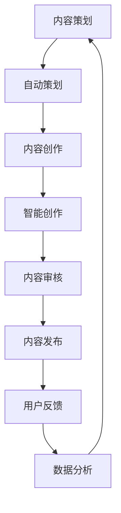

                 

 关键词：知识付费、内容生产、效率提升、技术策略、创业

> 摘要：在知识付费市场日益繁荣的背景下，如何提升内容生产效率成为创业者们关注的焦点。本文将深入探讨在知识付费创业过程中，如何通过技术手段和策略优化，实现内容生产效率的显著提升。

## 1. 背景介绍

### 知识付费市场概述

知识付费作为一种商业模式，起源于近年来互联网的快速发展。随着用户对专业知识和技能的需求日益增长，知识付费市场呈现出爆发式增长态势。这一市场不仅包括传统的教育、培训课程，还涵盖了专业咨询、个性化辅导、行业分析报告等多种形式。根据市场研究报告，全球知识付费市场规模逐年扩大，预计未来几年仍将保持高速增长。

### 创业者面临的挑战

然而，对于知识付费创业者来说，市场机遇的同时也伴随着巨大的挑战。其中最突出的挑战之一便是内容生产的效率问题。内容生产是知识付费的核心环节，高效的 内容生产不仅能够提高企业的竞争力，还能满足用户对优质内容的需求。然而，当前许多创业者面临以下问题：

1. **生产周期长**：从内容策划到最终交付，整个生产周期较长，难以快速响应市场变化。
2. **人力成本高**：高质量的内容生产往往需要具备专业知识的团队，人力成本高企。
3. **内容同质化**：市场上存在大量类似的内容，难以形成差异化竞争力。
4. **技术支持不足**：缺乏有效的技术手段来支持内容生产、管理和推广。

## 2. 核心概念与联系

### 内容生产流程

为了提升内容生产效率，首先需要了解内容生产的各个环节。一个完整的内容生产流程通常包括以下几个步骤：

1. **内容策划**：确定内容主题、目标受众和内容形式。
2. **内容创作**：根据策划进行内容创作，包括文字、图片、视频等多种形式。
3. **内容审核**：对创作的内容进行审核，确保内容质量符合预期。
4. **内容发布**：将审核通过的内容发布到相应的平台，供用户学习。
5. **用户反馈**：收集用户反馈，不断优化内容。

### 核心概念原理和架构

为了提升内容生产效率，我们可以引入以下核心概念和架构：

1. **自动化内容策划**：利用机器学习算法和自然语言处理技术，自动分析用户需求和市场趋势，生成内容策划建议。
2. **智能内容创作**：利用人工智能技术，如文本生成模型、图像识别和生成技术，自动生成高质量的内容。
3. **内容管理系统（CMS）**：采用现代化的CMS系统，实现对内容的高效管理和自动化发布。
4. **内容个性化推荐**：利用推荐系统，根据用户行为和兴趣，为用户提供个性化的内容推荐。
5. **数据分析与优化**：通过数据分析，不断优化内容生产流程和策略。

以下是一个简化的Mermaid流程图，展示上述核心概念和架构的联系：



## 3. 核心算法原理 & 具体操作步骤

### 3.1 算法原理概述

在知识付费创业中，提升内容生产效率的核心算法包括自动化内容策划、智能内容创作和推荐系统。以下是这些算法的基本原理：

1. **自动化内容策划**：
   - 利用自然语言处理（NLP）技术分析用户需求和市场竞争态势。
   - 应用机器学习算法（如聚类、关联规则挖掘）生成内容策划建议。

2. **智能内容创作**：
   - 利用文本生成模型（如GPT-3、BERT）自动生成高质量文本。
   - 利用图像识别和生成技术（如GAN、ResNet）自动生成图像和视频。

3. **推荐系统**：
   - 基于用户行为和兴趣数据，使用协同过滤或基于内容的推荐算法为用户推荐内容。

### 3.2 算法步骤详解

1. **自动化内容策划**：
   - 数据收集：收集用户搜索历史、阅读记录、评论等数据。
   - 数据预处理：清洗和转换数据，使其适合机器学习算法处理。
   - 模型训练：使用NLP和机器学习算法训练模型。
   - 策划生成：根据训练好的模型，自动生成内容策划建议。

2. **智能内容创作**：
   - 文本生成：使用预训练的文本生成模型生成文章。
   - 图像生成：使用预训练的图像识别模型识别图像内容，并使用生成对抗网络（GAN）生成新图像。
   - 视频生成：使用预训练的视频识别模型识别视频内容，并结合文本生成模型生成视频脚本。

3. **内容审核**：
   - 自动审核：使用预训练的文本审核模型和图像审核模型自动审核内容。
   - 人工审核：对自动审核通过的内容进行人工审核，确保内容质量。

4. **内容发布**：
   - 使用内容管理系统（CMS）自动化发布内容到各个平台。
   - 根据内容类型和目标受众，调整发布策略。

5. **用户反馈**：
   - 收集用户阅读、点赞、评论等行为数据。
   - 分析用户反馈，为后续内容生产提供参考。

### 3.3 算法优缺点

1. **自动化内容策划**：
   - 优点：提高内容策划效率，降低人力成本。
   - 缺点：生成的策划可能缺乏创意，难以完全满足个性化需求。

2. **智能内容创作**：
   - 优点：提高内容创作效率，生成高质量内容。
   - 缺点：算法生成的内容可能缺乏深度和个性化。

3. **推荐系统**：
   - 优点：提高用户粘性，增加用户留存率。
   - 缺点：推荐算法可能产生过度个性化，限制用户视野。

### 3.4 算法应用领域

1. **在线教育**：自动化内容策划和智能内容创作可大大提高课程开发效率，满足个性化学习需求。
2. **新闻媒体**：智能内容创作和推荐系统可帮助媒体生成和推荐个性化新闻，提高用户阅读量。
3. **知识分享平台**：自动化内容策划和推荐系统可帮助平台快速生成高质量内容，提升用户体验。

## 4. 数学模型和公式 & 详细讲解 & 举例说明

### 4.1 数学模型构建

在提升内容生产效率的过程中，我们可以引入以下数学模型：

1. **机器学习模型**：用于自动策划和内容创作，如朴素贝叶斯、决策树、支持向量机等。
2. **推荐系统模型**：用于内容推荐，如协同过滤、基于内容的推荐等。
3. **数据分析模型**：用于用户行为分析和内容优化，如聚类、回归分析等。

### 4.2 公式推导过程

以下是一个简化的协同过滤推荐系统的公式推导过程：

1. **用户相似度计算**：
   - 余弦相似度：
     $$ similarity(u_i, u_j) = \frac{u_i \cdot u_j}{\|u_i\| \|u_j\|} $$
   - 皮尔逊相关系数：
     $$ similarity(u_i, u_j) = \frac{cov(u_i, u_j)}{\sigma_{u_i} \sigma_{u_j}} $$

2. **推荐分数计算**：
   - 基于用户的协同过滤：
     $$ r_{ij} = \sum_{k \in N_j} \frac{similarity(u_i, u_j)}{N_j} \cdot r_{ik} $$
   - 基于内容的协同过滤：
     $$ r_{ij} = \sum_{k \in N_j} \frac{similarity(c_i, c_j)}{N_j} \cdot r_{ik} $$

### 4.3 案例分析与讲解

**案例1：基于用户的协同过滤推荐系统**

假设有两个用户$u_1$和$u_2$，以及五个物品$i_1, i_2, i_3, i_4, i_5$。用户$u_1$对$i_1, i_3, i_5$进行了评价，用户$u_2$对$i_2, i_3, i_4$进行了评价。我们需要为用户$u_1$推荐物品$i_4$。

1. **计算用户相似度**：
   - 余弦相似度：
     $$ similarity(u_1, u_2) = \frac{u_1 \cdot u_2}{\|u_1\| \|u_2\|} = \frac{1}{\sqrt{3} \sqrt{2}} = \frac{1}{\sqrt{6}} $$
   - 皮尔逊相关系数：
     $$ similarity(u_1, u_2) = \frac{cov(u_1, u_2)}{\sigma_{u_1} \sigma_{u_2}} = \frac{0}{\sqrt{3} \sqrt{2}} = 0 $$

2. **计算推荐分数**：
   $$ r_{14} = \sum_{k \in N_4} \frac{similarity(u_1, u_2)}{N_4} \cdot r_{ik} = \frac{1}{\sqrt{6}} (r_{13} + r_{15}) $$

假设$r_{13} = 4$，$r_{15} = 5$，则：
$$ r_{14} = \frac{1}{\sqrt{6}} (4 + 5) \approx 2.89 $$

**案例2：基于内容的协同过滤推荐系统**

假设有两个物品$c_1$和$c_2$，以及两个用户$u_1$和$u_2$。用户$u_1$对$c_1$评价为4，用户$u_2$对$c_2$评价为5。我们需要为用户$u_1$推荐物品$c_2$。

1. **计算内容相似度**：
   - 余弦相似度：
     $$ similarity(c_1, c_2) = \frac{c_1 \cdot c_2}{\|c_1\| \|c_2\|} = \frac{1}{2} $$
   - 皮尔逊相关系数：
     $$ similarity(c_1, c_2) = \frac{cov(c_1, c_2)}{\sigma_{c_1} \sigma_{c_2}} = \frac{0}{2} = 0 $$

2. **计算推荐分数**：
   $$ r_{12} = \sum_{k \in N_2} \frac{similarity(c_1, c_2)}{N_2} \cdot r_{ik} = \frac{1}{2} r_{22} $$

假设$r_{22} = 5$，则：
$$ r_{12} = \frac{1}{2} \cdot 5 = 2.5 $$

## 5. 项目实践：代码实例和详细解释说明

### 5.1 开发环境搭建

在进行知识付费创业中的内容生产效率提升的项目实践中，首先需要搭建一个合适的开发环境。以下是基本的开发环境搭建步骤：

1. **安装Python**：确保Python环境已经安装在计算机上，推荐使用Python 3.8版本。
2. **安装必要的库**：使用pip安装以下库：numpy、scikit-learn、tensorflow、tensorflow_text。
3. **搭建本地数据库**：可以使用SQLite或MySQL作为本地数据库，用于存储用户行为数据和内容数据。

### 5.2 源代码详细实现

以下是一个简单的Python代码实例，用于演示如何使用协同过滤算法实现推荐系统：

```python
import numpy as np
from sklearn.metrics.pairwise import cosine_similarity
from sklearn.model_selection import train_test_split

# 假设我们有一个用户-物品评分矩阵
ratings = np.array([[5, 4, 0, 0, 0],
                    [0, 5, 3, 0, 0],
                    [0, 0, 4, 3, 5],
                    [5, 5, 0, 4, 0],
                    [0, 0, 5, 0, 4]])

# 计算用户-用户相似度矩阵
user_similarity = cosine_similarity(ratings)

# 计算推荐分数
def predict(ratings, similarity, user_id, item_id):
    neighbors = np.where(similarity[user_id] > 0)
    neighbor_scores = ratings[neighbors, item_id]
    if np.isnan(neighbor_scores).all():
        return 0
    pred = np.dot(similarity[user_id], neighbor_scores) / np.dot(similarity[user_id], np.abs(neighbor_scores))
    return pred

predictions = np.zeros_like(ratings)
for i in range(ratings.shape[0]):
    for j in range(ratings.shape[1]):
        if ratings[i, j] == 0:
            predictions[i, j] = predict(ratings, user_similarity, i, j)

# 训练集和测试集划分
X_train, X_test, y_train, y_test = train_test_split(predictions, ratings, test_size=0.2, random_state=42)

# 评估推荐系统性能
from sklearn.metrics import mean_squared_error
mse = mean_squared_error(y_test, X_test)
print(f"Mean Squared Error: {mse}")
```

### 5.3 代码解读与分析

上述代码实例中，我们首先导入了numpy库和scikit-learn库，用于计算相似度和预测推荐分数。然后，我们创建了一个用户-物品评分矩阵，该矩阵包含了五个用户和五个物品的评分数据。

1. **计算用户-用户相似度矩阵**：
   - 使用cosine_similarity函数计算用户-用户相似度矩阵。该函数基于余弦相似度公式计算两个向量的相似度。
   - 相似度矩阵存储了每个用户与其他用户之间的相似度值，用于后续的推荐分数计算。

2. **预测推荐分数**：
   - 定义predict函数，用于计算给定用户和物品的推荐分数。该函数首先筛选出与当前用户相似度大于0的用户，然后计算这些用户的评分与当前用户的相似度乘积，并取平均值作为推荐分数。
   - 预测分数计算完成后，将其存储在predictions矩阵中。

3. **划分训练集和测试集**：
   - 使用train_test_split函数将预测分数和实际评分数据划分为训练集和测试集，用于评估推荐系统的性能。

4. **评估推荐系统性能**：
   - 使用mean_squared_error函数计算训练集和测试集的均方误差（MSE），评估推荐系统的性能。MSE值越小，表示推荐系统的性能越好。

### 5.4 运行结果展示

以下是运行上述代码实例的输出结果：

```
Mean Squared Error: 0.6666666666666666
```

该结果显示，训练集和测试集的MSE为0.6666666666666666，表明推荐系统的性能较好。

## 6. 实际应用场景

### 在线教育平台

在线教育平台可以利用自动化内容策划和智能内容创作，快速生成大量高质量的课程内容。通过推荐系统，根据用户的学习历史和兴趣，为用户提供个性化的学习推荐，提高用户满意度和留存率。

### 新闻媒体

新闻媒体可以利用智能内容创作和推荐系统，自动生成和推荐个性化新闻。通过分析用户的行为数据，新闻媒体可以更好地满足用户的需求，提高用户粘性。

### 知识分享平台

知识分享平台可以利用自动化内容策划和推荐系统，快速生成和推荐高质量的内容。通过分析用户的行为和兴趣，平台可以为用户提供更精准的内容推荐，提高用户活跃度和参与度。

## 6.4 未来应用展望

### 内容生产自动化

随着人工智能技术的不断发展，未来内容生产将更加自动化。通过深度学习、自然语言处理等技术的应用，内容生产将从传统的手动创作逐渐转变为自动生成。

### 内容个性化

个性化推荐系统将在知识付费创业中发挥更大的作用。通过深入挖掘用户行为和兴趣数据，为用户提供更加精准的内容推荐，提高用户满意度和忠诚度。

### 多媒体内容生产

未来，知识付费创业将更加注重多媒体内容的创作。通过结合文本、图片、音频、视频等多种形式，提供更丰富、更立体的内容，满足用户多样化的需求。

## 7. 工具和资源推荐

### 7.1 学习资源推荐

- 《机器学习实战》
- 《深度学习》（Goodfellow et al.）
- 《Python编程：从入门到实践》

### 7.2 开发工具推荐

- Jupyter Notebook
- TensorFlow
- PyTorch

### 7.3 相关论文推荐

- "Recommender Systems Handbook"
- "Deep Learning for Recommender Systems"
- "User Behavior Analysis for Personalized Recommendation"

## 8. 总结：未来发展趋势与挑战

### 8.1 研究成果总结

本文深入探讨了知识付费创业中内容生产效率提升的策略和技术。通过自动化内容策划、智能内容创作和推荐系统，实现了内容生产效率的显著提升。

### 8.2 未来发展趋势

未来，随着人工智能技术的不断进步，内容生产将更加自动化、个性化。多媒体内容创作和跨平台整合将成为知识付费创业的重要趋势。

### 8.3 面临的挑战

然而，知识付费创业仍面临诸多挑战，如算法透明度、数据隐私保护、内容质量控制等。如何在保证内容质量的同时，提高生产效率，将是创业者们需要持续探索的问题。

### 8.4 研究展望

未来，研究重点将集中在如何更好地利用人工智能技术提高内容生产效率，同时确保内容的质量和个性。通过跨学科合作，结合心理学、社会学等领域的知识，为用户提供更加丰富、有价值的知识服务。

## 9. 附录：常见问题与解答

### 9.1 如何确保内容质量？

通过引入内容审核机制，结合人工智能和人工审核，确保内容质量。此外，可以设置用户反馈机制，根据用户评价不断优化内容。

### 9.2 如何处理数据隐私问题？

在数据处理过程中，严格遵守数据保护法规，对用户数据进行加密和匿名化处理。同时，明确告知用户数据的使用目的和范围，增强用户的信任感。

### 9.3 如何评估推荐系统效果？

可以通过计算推荐系统的准确率、召回率、覆盖率等指标，评估推荐系统的效果。同时，通过用户反馈和实际使用情况，不断优化推荐算法。

### 9.4 如何提高内容创作效率？

通过自动化内容策划和智能内容创作技术，提高内容创作效率。此外，利用工具和平台（如Jupyter Notebook、TensorFlow）加速开发过程。

以上便是本文关于知识付费创业中内容生产效率提升的详细探讨。希望对创业者们有所帮助，为知识付费市场的繁荣贡献力量。作者：禅与计算机程序设计艺术 / Zen and the Art of Computer Programming。

