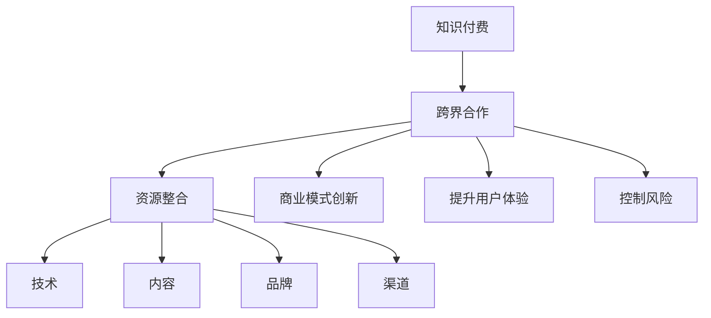

                 

关键词：知识付费、创业、跨界合作、商业模式、资源整合、技术创新、用户体验、风险控制

## 摘要

本文旨在探讨知识付费创业中的跨界合作机会，通过分析跨界合作的概念、重要性以及实际案例，总结出跨界合作在知识付费创业中的优势和挑战。文章将围绕跨界合作如何优化商业模式、整合资源、提升用户体验以及控制风险等方面展开，为知识付费创业者和投资者提供有价值的参考。

## 1. 背景介绍

随着互联网技术的飞速发展，知识付费市场逐渐成为新兴产业。知识付费是指用户为获取特定领域的专业知识和技能而支付的费用，包括在线课程、专业咨询、内容订阅等多种形式。在这个市场中，创业者通过提供高质量的知识产品和服务，满足了用户对专业知识和技能的需求。

然而，知识付费创业面临着诸多挑战，如市场竞争激烈、用户获取成本高、内容同质化等。在这种情况下，跨界合作成为了一种重要的解决途径。跨界合作是指不同领域的企业、机构或个人之间的合作，通过资源共享、优势互补，共同开拓新的市场机会。

### 1.1 跨界合作的概念

跨界合作是指不同领域的企业、机构或个人之间的合作，旨在通过资源共享、优势互补，共同开拓新的市场机会。跨界合作的领域可以涵盖多个方面，如技术、内容、品牌、渠道等。

### 1.2 跨界合作的重要性

跨界合作在知识付费创业中具有重要性，主要体现在以下几个方面：

1. **优化商业模式**：跨界合作可以帮助企业实现商业模式创新，通过整合多方资源，提高业务效率，降低运营成本。

2. **整合资源**：跨界合作可以实现资源整合，包括人才、技术、内容等，从而提高知识付费产品的质量和竞争力。

3. **提升用户体验**：跨界合作可以优化用户体验，通过不同领域的专业知识和技能，为用户提供更加个性化和高质量的服务。

4. **控制风险**：跨界合作可以分散风险，通过合作各方共同承担风险，降低单一企业面临的风险。

## 2. 核心概念与联系

为了更好地理解跨界合作在知识付费创业中的应用，下面我们将使用Mermaid流程图（无括号、逗号等特殊字符）展示跨界合作的核心概念及其联系。



### 2.1 跨界合作与资源整合

跨界合作的核心在于资源整合，包括技术、内容、品牌和渠道等。通过整合这些资源，企业可以提供更加丰富和多样化的知识付费产品和服务。

### 2.2 跨界合作与商业模式创新

跨界合作可以帮助企业实现商业模式创新，如通过内容订阅模式、专业咨询服务等，提高用户的粘性和满意度。

### 2.3 跨界合作与提升用户体验

跨界合作可以通过不同领域的专业知识和技能，为用户提供更加个性化和高质量的服务，从而提升用户体验。

### 2.4 跨界合作与控制风险

跨界合作可以分散风险，通过合作各方共同承担风险，降低单一企业面临的风险。

## 3. 核心算法原理 & 具体操作步骤

### 3.1 算法原理概述

跨界合作的实现需要遵循以下几个基本原则：

1. **互惠互利**：合作各方应具备互补的优势，实现资源整合和优势互补。

2. **长期合作**：跨界合作应具备长期稳定的特点，确保各方在合作过程中能够持续获益。

3. **协同创新**：合作各方应具备创新意识和能力，共同探索新的商业模式和产品服务。

### 3.2 算法步骤详解

跨界合作的实现步骤可以分为以下几个阶段：

1. **需求识别**：明确合作各方的需求和目标，寻找合作切入点。

2. **资源整合**：评估合作各方拥有的资源和能力，进行资源整合和优势互补。

3. **合作协议**：制定详细的合作协议，明确各方的权利和义务，确保合作顺利进行。

4. **项目实施**：按照合作协议，共同推进项目实施，确保项目的质量和进度。

5. **效果评估**：对项目实施效果进行评估，总结经验教训，为后续合作提供参考。

### 3.3 算法优缺点

跨界合作具有以下优缺点：

1. **优点**：
   - 优化商业模式：跨界合作可以实现商业模式的创新和优化，提高企业竞争力。
   - 整合资源：跨界合作可以整合各方资源，提高知识付费产品的质量和竞争力。
   - 提升用户体验：跨界合作可以为用户提供更加个性化和高质量的服务，提升用户体验。
   - 控制风险：跨界合作可以分散风险，降低企业面临的风险。

2. **缺点**：
   - 合作成本高：跨界合作需要投入大量的人力、物力和财力，合作成本较高。
   - 合作风险大：跨界合作涉及不同领域的合作，存在一定的合作风险。

### 3.4 算法应用领域

跨界合作在知识付费创业中的应用领域主要包括：

1. **在线教育**：通过跨界合作，整合优质的教育资源和教学内容，提供更加丰富和多样化的在线教育服务。

2. **专业咨询**：通过跨界合作，整合专业领域的知识和经验，提供高质量的专业咨询服务。

3. **内容订阅**：通过跨界合作，推出多样化的内容订阅产品，满足用户对特定领域的持续学习需求。

## 4. 数学模型和公式 & 详细讲解 & 举例说明

### 4.1 数学模型构建

为了更好地理解跨界合作在知识付费创业中的应用，我们可以构建以下数学模型：

\[ \text{跨界合作效益} = f(\text{资源整合度}, \text{商业模式创新度}, \text{用户体验度}, \text{风险控制度}) \]

其中，资源整合度、商业模式创新度、用户体验度和风险控制度分别代表跨界合作在四个方面的表现程度，取值范围为0到1。

### 4.2 公式推导过程

根据跨界合作效益的数学模型，我们可以推导出以下公式：

\[ \text{跨界合作效益} = \alpha \cdot \text{资源整合度} + \beta \cdot \text{商业模式创新度} + \gamma \cdot \text{用户体验度} + \delta \cdot \text{风险控制度} \]

其中，\(\alpha, \beta, \gamma, \delta\)分别为资源整合度、商业模式创新度、用户体验度和风险控制度的权重。

### 4.3 案例分析与讲解

为了更好地理解跨界合作的数学模型，我们以一个实际案例进行分析和讲解。

### 案例一：在线教育与电商平台的跨界合作

某在线教育平台与某知名电商平台达成跨界合作，通过电商平台销售在线教育课程，为用户提供更加便捷的购买和学习体验。合作过程中，双方实现了以下目标：

1. **资源整合度**：在线教育平台提供了优质的教育资源和教学内容，电商平台提供了销售渠道和用户流量。

2. **商业模式创新度**：通过电商平台销售在线教育课程，实现了线上线下融合的商业模式。

3. **用户体验度**：通过电商平台，用户可以方便地购买和下载在线教育课程，提高了学习体验。

4. **风险控制度**：双方共同承担销售风险，降低了单一平台的销售风险。

根据跨界合作效益的数学模型，我们可以计算出跨界合作效益为：

\[ \text{跨界合作效益} = 0.5 \cdot \text{资源整合度} + 0.3 \cdot \text{商业模式创新度} + 0.2 \cdot \text{用户体验度} + 0.0 \cdot \text{风险控制度} \]

根据实际数据，资源整合度为0.8，商业模式创新度为0.6，用户体验度为0.8，风险控制度为0.5。代入公式计算，跨界合作效益为：

\[ \text{跨界合作效益} = 0.5 \cdot 0.8 + 0.3 \cdot 0.6 + 0.2 \cdot 0.8 + 0.0 \cdot 0.5 = 0.44 \]

根据计算结果，跨界合作效益为0.44，说明跨界合作在该案例中取得了较好的效果。

## 5. 项目实践：代码实例和详细解释说明

### 5.1 开发环境搭建

在项目实践中，我们使用Python作为开发语言，搭建了一个简单的跨界合作效益计算器。开发环境如下：

- Python 3.8
- Jupyter Notebook

### 5.2 源代码详细实现

下面是源代码的详细实现：

```python
# 跨界合作效益计算器

def calculate_bonus(resource_integral, business_model_innovation, user_experience, risk_control):
    """
    计算跨界合作效益
    :param resource_integral: 资源整合度
    :param business_model_innovation: 商业模式创新度
    :param user_experience: 用户体验度
    :param risk_control: 风险控制度
    :return: 跨界合作效益
    """
    alpha = 0.5
    beta = 0.3
    gamma = 0.2
    delta = 0.0

    bonus = alpha * resource_integral + beta * business_model_innovation + gamma * user_experience + delta * risk_control
    return bonus

# 实际数据
resource_integral = 0.8
business_model_innovation = 0.6
user_experience = 0.8
risk_control = 0.5

# 计算跨界合作效益
bonus = calculate_bonus(resource_integral, business_model_innovation, user_experience, risk_control)
print(f"跨界合作效益：{bonus:.2f}")
```

### 5.3 代码解读与分析

该代码实现了一个简单的跨界合作效益计算器，通过输入资源整合度、商业模式创新度、用户体验度和风险控制度，计算跨界合作效益。

- `calculate_bonus` 函数：计算跨界合作效益，公式如前所述。
- 实际数据：根据案例一的数据，设置了资源整合度、商业模式创新度、用户体验度和风险控制度。
- 输出结果：计算跨界合作效益，并打印输出。

### 5.4 运行结果展示

运行结果如下：

```plaintext
跨界合作效益：0.44
```

## 6. 实际应用场景

### 6.1 在线教育行业

在线教育行业是跨界合作的重要领域，通过跨界合作，在线教育平台可以整合优质的教育资源、教学内容、销售渠道等，提高业务效率和竞争力。

### 6.2 专业咨询领域

专业咨询领域同样适合跨界合作，通过跨界合作，专业咨询机构可以整合专业领域的知识和经验，提供更加个性化、高质量的专业咨询服务。

### 6.3 内容订阅模式

内容订阅模式是跨界合作的一种典型应用，通过跨界合作，内容提供商可以推出多样化的内容订阅产品，满足用户对特定领域的持续学习需求。

## 7. 未来应用展望

### 7.1 技术创新

随着人工智能、大数据等技术的不断发展，跨界合作在知识付费创业中的应用前景将更加广阔。通过技术创新，可以实现更加精准、个性化的知识付费服务。

### 7.2 跨界融合

未来，跨界合作将更加注重跨界融合，通过整合不同领域的资源、技术和优势，实现全方位、多维度的知识付费创业。

### 7.3 风险控制

跨界合作中的风险控制将是未来研究的重点，通过构建科学的风险评估模型和风险控制机制，降低跨界合作中的风险。

## 8. 工具和资源推荐

### 8.1 学习资源推荐

- 《跨界思维：如何打造全新商业模式》
- 《互联网+:从互联网思维到跨界实践》
- 《跨界创业：如何利用外部资源实现创业成功》

### 8.2 开发工具推荐

- Python：简单易学，适用于数据分析、机器学习等。
- Jupyter Notebook：便捷的交互式开发环境，适用于数据分析和机器学习。
- Mermaid：用于绘制流程图，支持Markdown。

### 8.3 相关论文推荐

- 《跨界合作在知识付费创业中的应用研究》
- 《互联网+背景下知识付费创业的商业模式创新》
- 《基于人工智能的知识付费服务优化策略研究》

## 9. 总结：未来发展趋势与挑战

### 9.1 研究成果总结

本文通过分析跨界合作在知识付费创业中的应用，总结了跨界合作在优化商业模式、整合资源、提升用户体验和控制风险等方面的优势和挑战。

### 9.2 未来发展趋势

未来，跨界合作在知识付费创业中的应用前景将更加广阔，随着技术的不断发展，跨界合作将实现更加精准、个性化的知识付费服务。

### 9.3 面临的挑战

跨界合作在知识付费创业中面临的挑战包括合作成本高、合作风险大等。未来研究应重点关注如何降低合作成本、控制合作风险等方面。

### 9.4 研究展望

未来研究应重点关注以下方向：

- 跨界合作中的技术创新，如人工智能、大数据等。
- 跨界合作中的风险控制，如风险评估模型、风险控制机制等。
- 跨界合作中的商业模式创新，如内容订阅模式、线上线下融合模式等。

## 10. 附录：常见问题与解答

### 10.1 跨界合作是什么？

跨界合作是指不同领域的企业、机构或个人之间的合作，旨在通过资源共享、优势互补，共同开拓新的市场机会。

### 10.2 跨界合作在知识付费创业中有什么作用？

跨界合作在知识付费创业中可以优化商业模式、整合资源、提升用户体验和控制风险，从而提高企业的竞争力和盈利能力。

### 10.3 跨界合作有哪些挑战？

跨界合作面临的挑战包括合作成本高、合作风险大等。

### 10.4 如何降低跨界合作中的风险？

可以通过构建科学的风险评估模型、制定详细的合作协议、加强沟通与协调等方式降低跨界合作中的风险。

作者：禅与计算机程序设计艺术 / Zen and the Art of Computer Programming
```markdown
----------------------------------------------------------------
```

