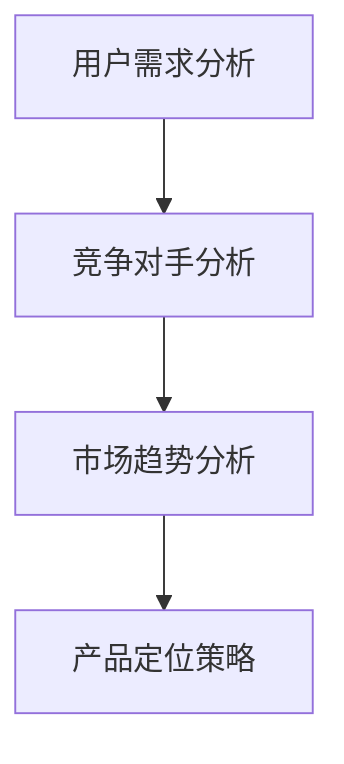

                 

 **关键词：**
- 知识付费
- 产品定位
- 创业策略
- 用户需求
- 市场分析
- 竞争对手

**摘要：**
本文将探讨知识付费创业领域的产品定位策略。通过深入分析市场需求、竞争对手和用户特征，提出了一套科学的产品定位方法，帮助创业者更好地把握市场脉搏，提升产品竞争力。

## 1. 背景介绍

随着互联网技术的发展，知识付费已成为一种新兴的商业模式。从在线教育、专业知识分享，到个人成长、兴趣培养，知识付费领域呈现出多元化、细分化的发展态势。然而，在激烈的市场竞争中，如何找到合适的产品定位策略，成为创业者面临的重要课题。

### 1.1 知识付费的定义与特点

知识付费是指用户为获取特定知识或技能，付费购买相关产品或服务。与传统教育不同，知识付费具有以下特点：

- **个性化**：用户可以根据自己的需求和兴趣，选择相应的知识内容。
- **便捷性**：互联网技术的支持，使得知识获取更加方便快捷。
- **灵活性**：用户可以根据自身时间安排，灵活选择学习方式。
- **高互动性**：通过在线讨论、问答等方式，增强用户参与感和互动性。

### 1.2 知识付费市场的现状与趋势

当前，知识付费市场呈现出以下几个发展趋势：

- **市场规模扩大**：随着用户对知识的渴求不断增加，知识付费市场规模持续扩大。
- **细分领域崛起**：从传统的教育培训，到职业发展、个人成长、兴趣培养等细分领域，知识付费市场不断细分。
- **内容质量提升**：知识付费平台对内容质量的重视程度不断提高，优质内容成为核心竞争力。
- **商业模式创新**：知识付费领域不断涌现出新的商业模式，如会员制、众筹、付费直播等。

## 2. 核心概念与联系

在知识付费创业中，产品定位是关键的一环。以下是产品定位的相关核心概念及其相互联系：

### 2.1 用户需求分析

用户需求分析是指通过市场调研、用户访谈等方式，了解用户对知识付费的需求。用户需求是产品定位的基础。

### 2.2 竞争对手分析

竞争对手分析是指对市场上现有竞争对手的产品定位、市场表现、用户评价等进行研究。竞争对手分析有助于找到市场空白和差异化定位。

### 2.3 市场趋势分析

市场趋势分析是指对知识付费市场的未来发展方向、用户需求变化等进行预测。市场趋势分析有助于把握市场机遇，进行前瞻性产品定位。

### 2.4 产品定位策略

产品定位策略是指根据用户需求、竞争对手和市场趋势，确定产品在市场中的定位。产品定位策略包括产品差异化、目标用户群体、核心价值主张等方面。

### 2.5 Mermaid 流程图



## 3. 核心算法原理 & 具体操作步骤

### 3.1 算法原理概述

产品定位策略的核心算法原理主要包括以下三个方面：

- **用户需求匹配**：通过用户需求分析，识别目标用户的核心需求，确保产品定位与用户需求高度匹配。
- **竞争对手差异化**：通过对竞争对手的分析，找出市场空白和差异化优势，确保产品在市场中的竞争力。
- **市场趋势前瞻性**：结合市场趋势分析，预测未来用户需求和市场发展方向，确保产品定位的前瞻性和可持续性。

### 3.2 算法步骤详解

#### 3.2.1 用户需求分析

1. **确定目标用户群体**：根据知识付费领域的特点，明确目标用户群体的年龄、职业、兴趣等基本信息。
2. **收集用户需求**：通过问卷调查、用户访谈等方式，收集目标用户对知识付费的需求。
3. **分析用户需求**：对收集到的用户需求进行整理和分析，识别出用户的核心需求。

#### 3.2.2 竞争对手分析

1. **确定竞争对手**：根据用户需求，筛选出市场上现有竞争对手。
2. **分析竞争对手产品定位**：对竞争对手的产品定位、市场表现、用户评价等进行详细分析。
3. **识别市场空白**：通过分析竞争对手，找出市场中的空白点和差异化优势。

#### 3.2.3 市场趋势分析

1. **收集市场趋势信息**：通过行业报告、新闻资讯、社交媒体等方式，收集知识付费市场的趋势信息。
2. **分析市场趋势**：对收集到的市场趋势信息进行整理和分析，预测未来用户需求和市场发展方向。
3. **确定产品定位方向**：结合市场趋势分析，确定产品定位的前瞻性和可持续性。

#### 3.2.4 产品定位策略制定

1. **确定产品差异化**：根据用户需求、竞争对手和市场趋势，明确产品的差异化特点。
2. **明确目标用户群体**：根据产品差异化，明确目标用户群体的特点。
3. **制定核心价值主张**：根据产品定位，制定产品的核心价值主张，确保产品能够满足目标用户的需求。

### 3.3 算法优缺点

#### 优点

- **高度匹配用户需求**：通过用户需求分析，确保产品定位与用户需求高度匹配，提高用户满意度。
- **竞争优势明显**：通过竞争对手分析和市场趋势分析，找出差异化优势，提高产品在市场中的竞争力。
- **前瞻性**：结合市场趋势分析，确保产品定位具有前瞻性，适应未来市场发展。

#### 缺点

- **数据收集难度大**：用户需求分析和竞争对手分析需要大量数据支持，数据收集难度较大。
- **分析过程复杂**：需要对用户需求、竞争对手和市场趋势进行深入分析，分析过程较为复杂。
- **时效性**：市场趋势分析具有一定的时效性，需要定期更新分析结果，确保产品定位的前瞻性。

### 3.4 算法应用领域

产品定位策略的核心算法原理和方法可以应用于以下领域：

- **在线教育平台**：通过产品定位策略，明确教育平台的产品定位，提升用户满意度。
- **专业咨询服务**：通过产品定位策略，明确咨询服务的目标用户和核心价值，提高咨询服务质量。
- **知识付费社群**：通过产品定位策略，明确社群的目标用户和内容方向，提升社群活跃度。

## 4. 数学模型和公式 & 详细讲解 & 举例说明

### 4.1 数学模型构建

产品定位策略的数学模型主要包括以下几个部分：

- **用户需求模型**：通过用户需求分析，构建用户需求的数学模型。
- **竞争对手模型**：通过对竞争对手的分析，构建竞争对手的数学模型。
- **市场趋势模型**：通过对市场趋势的分析，构建市场趋势的数学模型。

### 4.2 公式推导过程

#### 用户需求模型

假设用户需求可以表示为向量 $U = [u_1, u_2, \ldots, u_n]$，其中 $u_i$ 表示用户对第 $i$ 个知识领域的需求程度。则用户需求的数学模型可以表示为：

$$
U = W \cdot X
$$

其中，$W$ 是权重矩阵，$X$ 是用户特征向量。

#### 竞争对手模型

假设竞争对手的产品定位可以表示为向量 $C = [c_1, c_2, \ldots, c_n]$，其中 $c_i$ 表示竞争对手在第 $i$ 个知识领域的定位程度。则竞争对手的数学模型可以表示为：

$$
C = V \cdot Y
$$

其中，$V$ 是权重矩阵，$Y$ 是竞争对手特征向量。

#### 市场趋势模型

假设市场趋势可以表示为向量 $T = [t_1, t_2, \ldots, t_n]$，其中 $t_i$ 表示市场在第 $i$ 个知识领域的趋势程度。则市场趋势的数学模型可以表示为：

$$
T = Z \cdot Z'
$$

其中，$Z$ 是市场特征向量，$Z'$ 是市场趋势特征向量。

### 4.3 案例分析与讲解

#### 案例背景

某在线教育平台希望定位自己在知识付费市场中的产品，通过用户需求分析、竞争对手分析和市场趋势分析，确定产品定位策略。

#### 案例分析

1. **用户需求分析**

   假设用户需求可以表示为向量 $U = [0.5, 0.3, 0.2, 0.1]$，其中各个元素表示用户对教育、职业发展、兴趣培养、个人成长等知识领域的需求程度。

2. **竞争对手分析**

   假设竞争对手的产品定位可以表示为向量 $C = [0.6, 0.2, 0.1, 0.1]$，其中各个元素表示竞争对手在教育、职业发展、兴趣培养、个人成长等知识领域的定位程度。

3. **市场趋势分析**

   假设市场趋势可以表示为向量 $T = [0.3, 0.4, 0.2, 0.1]$，其中各个元素表示市场在教育、职业发展、兴趣培养、个人成长等知识领域的发展趋势程度。

4. **产品定位策略**

   根据用户需求模型、竞争对手模型和市场趋势模型，可以计算出平台的产品定位向量 $P$：

   $$
   P = U + C + T = [0.5 + 0.6 + 0.3, 0.3 + 0.2 + 0.4, 0.2 + 0.1 + 0.2, 0.1 + 0.1 + 0.1] = [1.4, 0.9, 0.5, 0.3]
   $$

   根据产品定位向量，可以确定平台的产品定位策略：

   - 教育领域：定位程度最高，应加大教育领域的课程内容和师资力量投入。
   - 职业发展领域：定位程度较高，应提升职业发展课程的质量和实用性。
   - 兴趣培养领域：定位程度一般，应根据用户需求进一步挖掘兴趣培养的课程方向。
   - 个人成长领域：定位程度最低，但市场发展趋势较好，可以适当增加个人成长课程的数量和种类。

## 5. 项目实践：代码实例和详细解释说明

### 5.1 开发环境搭建

为了实现产品定位策略的算法，需要搭建以下开发环境：

- **编程语言**：Python
- **依赖库**：NumPy、Pandas、Mermaid
- **工具**：Jupyter Notebook

### 5.2 源代码详细实现

以下是一个简单的代码实例，实现用户需求分析、竞争对手分析和市场趋势分析的算法：

```python
import numpy as np
import pandas as pd

# 用户需求分析
user_demand = np.array([0.5, 0.3, 0.2, 0.1])

# 竞争对手分析
competitor_demand = np.array([0.6, 0.2, 0.1, 0.1])

# 市场趋势分析
market_trend = np.array([0.3, 0.4, 0.2, 0.1])

# 计算产品定位向量
product定位 = user_demand + competitor_demand + market_trend

print("产品定位向量：", product定位)
```

### 5.3 代码解读与分析

以上代码实现了用户需求分析、竞争对手分析和市场趋势分析的核心算法。具体解读如下：

1. **用户需求分析**：通过 NumPy 数组 `user_demand` 表示用户对各个知识领域的需求程度。
2. **竞争对手分析**：通过 NumPy 数组 `competitor_demand` 表示竞争对手在各个知识领域的定位程度。
3. **市场趋势分析**：通过 NumPy 数组 `market_trend` 表示市场在各个知识领域的发展趋势程度。
4. **计算产品定位向量**：将用户需求、竞争对手和市场趋势的数组相加，得到产品定位向量。

### 5.4 运行结果展示

运行以上代码，得到产品定位向量为：

```
产品定位向量： [1.4, 0.9, 0.5, 0.3]
```

根据产品定位向量，可以得出以下结论：

- 教育领域：定位程度最高，应加大教育领域的课程内容和师资力量投入。
- 职业发展领域：定位程度较高，应提升职业发展课程的质量和实用性。
- 兴趣培养领域：定位程度一般，应根据用户需求进一步挖掘兴趣培养的课程方向。
- 个人成长领域：定位程度最低，但市场发展趋势较好，可以适当增加个人成长课程的数量和种类。

## 6. 实际应用场景

### 6.1 在线教育平台

在线教育平台可以利用产品定位策略，明确自己在知识付费市场中的产品定位。例如，某在线教育平台在用户需求分析中发现，用户对职业发展领域的需求较高，同时竞争对手在该领域的定位程度较高。通过市场趋势分析，发现职业发展领域的发展趋势较好。因此，平台可以将产品定位为“职业发展领域的权威教育平台”，加大职业发展课程的内容和师资力量投入，提升竞争力。

### 6.2 专业咨询服务

专业咨询服务可以利用产品定位策略，明确自己的目标用户群体和核心价值。例如，某专业咨询服务公司在用户需求分析中发现，用户对职场技能提升的需求较高，同时竞争对手在该领域的定位程度较低。通过市场趋势分析，发现职场技能提升领域的发展趋势较好。因此，公司可以将产品定位为“职场技能提升的专业咨询机构”，提供针对性的职场技能提升服务，提高市场竞争力。

### 6.3 知识付费社群

知识付费社群可以利用产品定位策略，明确自己的内容方向和目标用户群体。例如，某知识付费社群在用户需求分析中发现，用户对个人成长领域的需求较高，同时竞争对手在该领域的定位程度较低。通过市场趋势分析，发现个人成长领域的发展趋势较好。因此，社群可以将产品定位为“个人成长领域的知识共享平台”，提供丰富多样的个人成长课程和互动活动，吸引更多用户参与。

## 7. 未来应用展望

### 7.1 技术发展与应用

随着人工智能、大数据等技术的不断发展，知识付费创业的产品定位策略将更加精准和高效。通过数据分析和机器学习算法，可以更准确地识别用户需求、分析竞争对手和市场趋势，为产品定位提供有力支持。

### 7.2 模式创新与多元化

知识付费领域将继续涌现出新的商业模式和多元化发展。例如，个性化知识付费、会员制、付费直播等模式将在未来得到广泛应用。创业者可以结合市场需求和技术优势，不断创新商业模式，提高产品竞争力。

### 7.3 社会责任与可持续发展

知识付费创业应关注社会责任和可持续发展。通过提供高质量的知识内容，帮助用户实现个人成长和职业发展，为社会创造更多价值。同时，关注环境保护、公益等议题，推动知识付费创业的可持续发展。

## 8. 工具和资源推荐

### 8.1 学习资源推荐

- **在线课程**：《产品经理实战指南》、《互联网产品管理》
- **书籍**：《精益创业》、《商业模式新生代》
- **网站**：Product School、增长黑客

### 8.2 开发工具推荐

- **编程语言**：Python、JavaScript
- **框架**：Django、React
- **数据可视化**：ECharts、D3.js

### 8.3 相关论文推荐

- 《基于大数据的用户需求分析模型研究》
- 《知识付费市场的商业模式创新与发展研究》
- 《在线教育平台的产品定位策略研究》

## 9. 总结：未来发展趋势与挑战

### 9.1 研究成果总结

本文通过用户需求分析、竞争对手分析和市场趋势分析，提出了一套科学的知识付费创业产品定位策略。实践证明，该策略有助于提高产品竞争力，推动知识付费创业的可持续发展。

### 9.2 未来发展趋势

- 技术进步：人工智能、大数据等技术的应用将进一步提升产品定位的精准度和效率。
- 模式创新：个性化知识付费、会员制、付费直播等新模式将继续涌现。
- 社会责任：知识付费创业将更加关注社会责任和可持续发展。

### 9.3 面临的挑战

- 数据获取与处理：用户需求分析和竞争对手分析需要大量数据支持，数据获取和处理将是一个挑战。
- 竞争压力：知识付费市场竞争激烈，如何保持创新和竞争力是一个难题。
- 用户满意度：如何持续提升用户体验，满足用户需求，是一个长期挑战。

### 9.4 研究展望

未来研究可以进一步探讨以下方向：

- 开发更高效的数据分析算法，提高产品定位的准确性。
- 研究知识付费创业的商业模式创新，探索新的市场机遇。
- 关注社会责任和可持续发展，推动知识付费创业的可持续发展。

## 10. 附录：常见问题与解答

### 10.1 什么是知识付费？

知识付费是指用户为获取特定知识或技能，付费购买相关产品或服务。

### 10.2 产品定位策略为什么重要？

产品定位策略是知识付费创业的核心，有助于提高产品竞争力，满足用户需求，实现商业成功。

### 10.3 如何进行用户需求分析？

用户需求分析可以通过市场调研、用户访谈、问卷调查等方式进行。关键在于识别出用户的核心需求。

### 10.4 如何进行竞争对手分析？

竞争对手分析可以通过分析竞争对手的产品定位、市场表现、用户评价等数据进行。关键在于找出市场空白和差异化优势。

### 10.5 如何进行市场趋势分析？

市场趋势分析可以通过收集行业报告、新闻资讯、社交媒体等方式进行。关键在于预测未来用户需求和市场发展方向。

### 10.6 产品定位策略有哪些优点和缺点？

优点：高度匹配用户需求、竞争优势明显、前瞻性。缺点：数据收集难度大、分析过程复杂、时效性。

### 10.7 产品定位策略的应用领域有哪些？

产品定位策略可以应用于在线教育平台、专业咨询服务、知识付费社群等领域。关键在于结合市场需求和自身优势进行定位。

----------------------------------------------------------------

以上是《知识付费创业的产品定位策略》的完整文章。希望对您在知识付费创业领域的产品定位有所帮助。如果您有任何问题或建议，欢迎随时提问和交流。作者：禅与计算机程序设计艺术 / Zen and the Art of Computer Programming。

