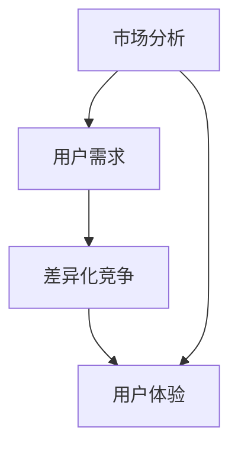

                 

关键词：知识付费，产品定位，创业，策略，市场分析，用户需求，差异化竞争，用户体验，商业模式，创新

摘要：本文将深入探讨知识付费创业的产品定位策略，包括市场分析、用户需求、差异化竞争和用户体验等多个方面，旨在为知识付费创业者提供有价值的指导和建议。

## 1. 背景介绍

随着互联网技术的发展，知识付费已经成为一种新兴的商业模式。在知识付费领域，创业者们面临着激烈的市场竞争和不断变化的市场需求。如何准确定位自己的产品，抓住用户需求，实现差异化竞争，成为创业者们需要重点思考的问题。

### 1.1 知识付费的定义和特点

知识付费是指用户为获取特定知识或技能而支付的费用。与传统的免费知识共享不同，知识付费更注重知识的专业性和实用性。知识付费的特点包括：

- 专业性：知识付费的产品通常由行业专家或专业人士提供，具有较高的专业水准。
- 实用性：知识付费的产品注重实用性，能够帮助用户解决实际问题。
- 付费方式多样：知识付费的付费方式多样，包括订阅、一次性购买、付费问答等。

### 1.2 知识付费的市场现状

近年来，知识付费市场呈现出快速增长的趋势。根据相关报告显示，2020年中国知识付费市场规模已经超过2000亿元，预计未来还将保持高速增长。知识付费市场的主要特点包括：

- 用户规模扩大：随着互联网普及率的提高，越来越多的用户开始接受知识付费。
- 产品多样化：知识付费产品涵盖了教育、职场、健康、兴趣等多个领域。
- 市场细分明显：不同领域和用户群体的需求差异较大，市场呈现出明显的细分趋势。

## 2. 核心概念与联系

在知识付费创业中，有几个核心概念需要理解，包括市场分析、用户需求、差异化竞争和用户体验。这些概念之间存在紧密的联系，共同构成了知识付费产品定位的基础。

### 2.1 市场分析

市场分析是知识付费创业的第一步，它旨在了解市场的现状、趋势和机会。市场分析包括以下几个方面：

- 市场规模：了解知识付费市场的总体规模和增长趋势。
- 竞争态势：分析竞争对手的产品定位、市场份额和优势。
- 用户特征：了解目标用户群体的年龄、性别、职业、收入水平等特征。
- 市场需求：分析用户对知识付费的需求，包括内容、形式、价格等。

#### 2.1.1 市场规模

市场规模是知识付费创业的重要参考指标。根据相关报告，2020年中国知识付费市场规模已经超过2000亿元，预计未来还将保持高速增长。市场规模的增长为知识付费创业提供了良好的机会。

#### 2.1.2 竞争态势

竞争态势是知识付费创业需要重点分析的一个方面。当前，知识付费市场的主要竞争者包括传统的教育机构、在线课程平台、知识分享社区等。创业者需要了解竞争对手的产品定位、优势和市场策略，以便找到自己的差异化方向。

#### 2.1.3 用户特征

用户特征是知识付费创业的重要参考依据。创业者需要了解目标用户群体的年龄、性别、职业、收入水平等特征，以便更好地满足用户需求。例如，年轻用户更倾向于订阅模式，而职业人士更关注实用性强的知识内容。

#### 2.1.4 市场需求

市场需求是知识付费创业的核心。创业者需要深入了解用户对知识付费的需求，包括内容、形式、价格等。例如，用户可能对职场技能提升、职业发展、健康养生等领域有较高需求。

### 2.2 用户需求

用户需求是知识付费创业的核心驱动力。创业者需要深入了解用户的需求，并将其转化为产品的核心竞争力。用户需求包括以下几个方面：

- 内容需求：用户希望获取专业、实用、具有深度的知识内容。
- 形式需求：用户希望知识内容以多种形式呈现，如图文、视频、直播等。
- 价格需求：用户对知识付费产品的价格敏感度较高，创业者需要平衡价格和质量。

### 2.3 差异化竞争

差异化竞争是知识付费创业的重要策略。在激烈的市场竞争中，创业者需要找到自己的差异化方向，以区别于竞争对手。差异化竞争可以从以下几个方面入手：

- 内容差异化：提供独特、专业、有深度的知识内容。
- 形式差异化：采用新颖、互动、有趣的知识呈现方式。
- 服务差异化：提供优质的用户服务，如答疑解惑、个性化推荐等。
- 体验差异化：优化用户体验，提高用户满意度和忠诚度。

### 2.4 用户体验

用户体验是知识付费创业的核心目标。创业者需要从用户的角度出发，设计出易用、便捷、有吸引力的产品。用户体验包括以下几个方面：

- 产品界面：设计简洁、美观、易于使用的界面。
- 内容质量：保证知识内容的专业性、实用性和深度。
- 学习效果：帮助用户快速掌握知识，提高学习效果。
- 用户服务：提供优质的用户服务，解决用户的问题和困惑。

### 2.5 Mermaid 流程图

以下是一个简化的 Mermaid 流程图，展示了知识付费创业中的核心概念和联系：



## 3. 核心算法原理 & 具体操作步骤

### 3.1 算法原理概述

在知识付费创业中，核心算法原理主要包括用户行为分析、内容推荐和用户满意度评估等。这些算法原理有助于创业者深入了解用户需求，优化产品定位和用户体验。

#### 3.1.1 用户行为分析

用户行为分析是指通过收集和分析用户在知识付费平台上的行为数据，了解用户的需求、偏好和习惯。用户行为分析包括以下几个方面：

- 用户浏览行为：分析用户在平台上的浏览路径、停留时间、点击次数等。
- 用户购买行为：分析用户的购买频率、购买金额、购买偏好等。
- 用户互动行为：分析用户的评论、点赞、分享等互动行为。

#### 3.1.2 内容推荐

内容推荐是指根据用户的兴趣和行为数据，为用户推荐合适的内容。内容推荐算法主要包括基于内容的推荐和基于协同过滤的推荐。基于内容的推荐主要根据内容的特征进行匹配；而基于协同过滤的推荐主要根据用户的行为数据进行匹配。

#### 3.1.3 用户满意度评估

用户满意度评估是指通过收集和分析用户对知识付费产品的评价数据，评估产品的质量和服务水平。用户满意度评估包括以下几个方面：

- 内容满意度：评估用户对知识内容的专业性、实用性和深度。
- 服务满意度：评估用户对平台服务的满意度，如客服、答疑解惑等。

### 3.2 算法步骤详解

以下是一个简化的知识付费创业中的核心算法步骤：

1. 数据采集：收集用户在平台上的行为数据，包括浏览行为、购买行为和互动行为。
2. 数据预处理：对采集到的数据进行清洗、去噪和处理，提取有用的特征。
3. 用户行为分析：根据用户行为数据，分析用户的需求、偏好和习惯。
4. 内容推荐：根据用户行为数据和内容特征，为用户推荐合适的内容。
5. 用户满意度评估：根据用户评价数据，评估产品的质量和服务水平。
6. 产品优化：根据用户行为分析和满意度评估结果，优化产品定位和用户体验。

### 3.3 算法优缺点

#### 3.3.1 优点

- 提高用户满意度：通过用户行为分析和内容推荐，提高用户对产品的满意度，增加用户粘性。
- 优化产品定位：根据用户需求和市场分析结果，优化产品定位，提高市场竞争力。
- 提高学习效果：通过个性化推荐，帮助用户快速找到适合自己的知识内容，提高学习效果。

#### 3.3.2 缺点

- 数据质量要求高：用户行为分析和内容推荐对数据质量有较高的要求，数据清洗和处理过程较为复杂。
- 算法复杂度高：内容推荐和用户满意度评估等算法较为复杂，实现和优化过程较为困难。

### 3.4 算法应用领域

知识付费创业中的核心算法原理可以应用于多个领域，包括：

- 在线教育：通过用户行为分析和内容推荐，为用户提供个性化学习体验，提高学习效果。
- 职场培训：通过用户行为分析和内容推荐，为用户提供有针对性的职场培训内容，提升职场竞争力。
- 健康养生：通过用户行为分析和内容推荐，为用户提供健康养生知识，帮助用户保持健康。

## 4. 数学模型和公式 & 详细讲解 & 举例说明

### 4.1 数学模型构建

在知识付费创业中，常用的数学模型包括用户行为模型、内容推荐模型和用户满意度评估模型。以下是一个简化的数学模型构建过程：

#### 4.1.1 用户行为模型

用户行为模型旨在描述用户在知识付费平台上的行为特征。一个简化的用户行为模型可以表示为：

$$
\text{User Behavior Model} = f(\text{User Features}, \text{Content Features}, \text{Time})
$$

其中，$f$表示用户行为预测函数，$\text{User Features}$表示用户特征，$\text{Content Features}$表示内容特征，$\text{Time}$表示时间。

#### 4.1.2 内容推荐模型

内容推荐模型旨在根据用户特征和内容特征，为用户推荐合适的内容。一个简化的内容推荐模型可以表示为：

$$
\text{Content Recommendation Model} = f(\text{User Features}, \text{Content Features}, \text{Similarity})
$$

其中，$f$表示内容推荐函数，$\text{Similarity}$表示用户和内容之间的相似度。

#### 4.1.3 用户满意度评估模型

用户满意度评估模型旨在评估用户对知识付费产品的满意度。一个简化的用户满意度评估模型可以表示为：

$$
\text{User Satisfaction Model} = f(\text{User Feedback}, \text{Content Quality}, \text{Service Quality})
$$

其中，$f$表示满意度评估函数，$\text{User Feedback}$表示用户反馈，$\text{Content Quality}$表示内容质量，$\text{Service Quality}$表示服务质量。

### 4.2 公式推导过程

以下是一个简化的用户行为模型公式推导过程：

#### 4.2.1 用户特征提取

首先，我们需要从用户行为数据中提取用户特征。用户特征可以包括用户年龄、性别、职业、教育程度等。这些特征可以通过数据预处理过程得到。

#### 4.2.2 内容特征提取

接下来，我们需要从内容数据中提取内容特征。内容特征可以包括内容类型、主题、难度、时长等。这些特征可以通过数据预处理过程得到。

#### 4.2.3 用户行为预测

然后，我们使用用户特征和内容特征，通过机器学习算法（如线性回归、决策树、神经网络等）训练用户行为预测模型。预测模型可以表示为：

$$
\text{User Behavior Prediction} = \text{Model}(\text{User Features}, \text{Content Features})
$$

其中，$\text{Model}$表示训练好的预测模型。

#### 4.2.4 内容推荐

使用用户行为预测模型，我们可以为用户推荐内容。推荐算法可以根据用户特征和内容特征计算用户和内容之间的相似度。常见的相似度计算方法包括余弦相似度、欧氏距离等。例如，余弦相似度可以表示为：

$$
\text{Similarity} = \frac{\text{User Features} \cdot \text{Content Features}}{\|\text{User Features}\| \|\text{Content Features}\|}
$$

其中，$\cdot$表示点积，$\|\|$表示向量范数。

#### 4.2.5 用户满意度评估

最后，我们使用用户反馈、内容质量和服务质量数据，通过机器学习算法训练用户满意度评估模型。满意度评估模型可以表示为：

$$
\text{User Satisfaction Evaluation} = \text{Model}(\text{User Feedback}, \text{Content Quality}, \text{Service Quality})
$$

其中，$\text{Model}$表示训练好的评估模型。

### 4.3 案例分析与讲解

以下是一个简化的案例，用于说明用户行为模型、内容推荐模型和用户满意度评估模型在实际应用中的操作过程。

#### 4.3.1 用户行为分析

假设用户A在知识付费平台上浏览了多个职场技能提升课程，并花费了较长时间。我们可以从用户A的行为数据中提取以下特征：

- 用户特征：年龄30岁，性别男，职业程序员。
- 内容特征：课程类型为职场技能提升，主题为时间管理，难度中高，时长2小时。

根据这些特征，我们可以使用机器学习算法训练用户行为预测模型，预测用户A对其他职场技能提升课程的兴趣度。例如，假设我们使用线性回归模型，预测结果为：

$$
\text{Interest} = \text{Model}(\text{User Features}, \text{Content Features}) = 0.8
$$

#### 4.3.2 内容推荐

根据用户行为预测结果，我们可以为用户A推荐相似度较高的职场技能提升课程。例如，假设平台上有以下两门课程：

- 课程1：主题为时间管理，难度中高，时长2小时，与用户A的兴趣度预测值为0.9。
- 课程2：主题为沟通技巧，难度中低，时长1小时，与用户A的兴趣度预测值为0.6。

根据相似度计算结果，我们可以为用户A推荐课程1。

#### 4.3.3 用户满意度评估

假设用户A在购买课程1后给出了以下反馈：

- 内容质量：优秀。
- 服务质量：满意。

根据用户反馈数据，我们可以使用机器学习算法训练用户满意度评估模型，评估用户A对课程1的满意度。例如，假设我们使用决策树模型，评估结果为：

$$
\text{Satisfaction} = \text{Model}(\text{User Feedback}, \text{Content Quality}, \text{Service Quality}) = 0.9
$$

#### 4.3.4 案例总结

通过用户行为分析、内容推荐和用户满意度评估，我们可以为用户A提供个性化的职场技能提升课程推荐，并评估课程质量。在实际应用中，这些模型可以根据用户的实时行为数据进行动态调整，以实现更精准的知识付费产品定位。

## 5. 项目实践：代码实例和详细解释说明

### 5.1 开发环境搭建

在本节中，我们将介绍如何搭建一个简单的知识付费创业项目的开发环境。以下是所需的开发环境：

- 开发语言：Python
- 数据库：MySQL
- 机器学习库：scikit-learn
- Web框架：Flask

#### 5.1.1 环境安装

1. 安装Python（版本3.8及以上）
2. 安装MySQL数据库
3. 安装scikit-learn库（使用命令：`pip install scikit-learn`）
4. 安装Flask库（使用命令：`pip install flask`）

#### 5.1.2 代码结构

以下是一个简单的知识付费创业项目的代码结构：

```bash
knowledge_fee_project/
|-- app.py
|-- database.py
|-- models.py
|-- static/
|   |-- css/
|   |-- js/
|   |-- images/
|-- templates/
    |-- base.html
    |-- index.html
    |-- login.html
    |-- register.html
```

### 5.2 源代码详细实现

在本节中，我们将详细解释项目中的主要代码文件和功能实现。

#### 5.2.1 database.py

`database.py`文件用于连接MySQL数据库，并定义数据库操作方法。

```python
import mysql.connector

def connect():
    return mysql.connector.connect(
        host='localhost',
        user='root',
        password='password',
        database='knowledge_fee_db'
    )

def create_table():
    conn = connect()
    cursor = conn.cursor()
    cursor.execute('''
        CREATE TABLE IF NOT EXISTS users (
            id INT AUTO_INCREMENT PRIMARY KEY,
            username VARCHAR(255) NOT NULL,
            password VARCHAR(255) NOT NULL,
            email VARCHAR(255) NOT NULL
        )
    ''')
    conn.commit()
    cursor.close()
    conn.close()

def create_course(course_name, course_description):
    conn = connect()
    cursor = conn.cursor()
    cursor.execute('''
        INSERT INTO courses (course_name, course_description)
        VALUES (%s, %s)
    ''', (course_name, course_description))
    conn.commit()
    cursor.close()
    conn.close()
```

#### 5.2.2 models.py

`models.py`文件用于定义用户和课程模型，以及相关操作方法。

```python
from database import connect

class User:
    def __init__(self, username, password, email):
        self.username = username
        self.password = password
        self.email = email

    def save(self):
        conn = connect()
        cursor = conn.cursor()
        cursor.execute('''
            INSERT INTO users (username, password, email)
            VALUES (%s, %s, %s)
        ''', (self.username, self.password, self.email))
        conn.commit()
        cursor.close()
        conn.close()

class Course:
    def __init__(self, course_name, course_description):
        self.course_name = course_name
        self.course_description = course_description

    def save(self):
        conn = connect()
        cursor = conn.cursor()
        cursor.execute('''
            INSERT INTO courses (course_name, course_description)
            VALUES (%s, %s)
        ''', (self.course_name, self.course_description))
        conn.commit()
        cursor.close()
        conn.close()
```

#### 5.2.3 app.py

`app.py`文件是项目的入口文件，负责处理HTTP请求，以及与用户和课程模型交互。

```python
from flask import Flask, request, render_template
from models import User, Course

app = Flask(__name__)

@app.route('/')
def index():
    courses = Course.select_all()
    return render_template('index.html', courses=courses)

@app.route('/register', methods=['GET', 'POST'])
def register():
    if request.method == 'POST':
        username = request.form['username']
        password = request.form['password']
        email = request.form['email']
        user = User(username, password, email)
        user.save()
        return '注册成功'
    return render_template('register.html')

if __name__ == '__main__':
    app.run(debug=True)
```

#### 5.2.4 templates/index.html

`templates/index.html`文件是首页模板，用于展示课程列表。

```html
<!DOCTYPE html>
<html lang="en">
<head>
    <meta charset="UTF-8">
    <title>知识付费平台</title>
</head>
<body>
    <h1>知识付费平台</h1>
    <ul>
        
            <li>
                <h2>{{ course.course_name }}</h2>
                <p>{{ course.course_description }}</p>
            </li>
        
    </ul>
</body>
</html>
```

### 5.3 代码解读与分析

在本节中，我们将对代码进行解读和分析，以帮助读者更好地理解项目的实现过程。

#### 5.3.1 数据库操作

`database.py`文件中的`connect`函数用于连接MySQL数据库，并返回一个连接对象。`create_table`函数用于创建用户和课程表，并在数据库中执行SQL语句。

#### 5.3.2 用户和课程模型

`models.py`文件中的`User`和`Course`类分别表示用户和课程模型。每个模型都有一个`save`方法，用于将用户或课程数据保存到数据库中。

#### 5.3.3 HTTP请求处理

`app.py`文件中的`app`对象是一个Flask应用实例。`index`函数处理首页的HTTP请求，并从数据库中获取课程数据，将数据传递给模板文件。`register`函数处理用户注册的HTTP请求，创建用户对象，并调用`save`方法将用户数据保存到数据库中。

### 5.4 运行结果展示

在本地开发环境中，启动Flask应用后，可以在浏览器中访问`http://localhost:5000/`，查看知识付费平台的首页效果。用户可以注册账户，注册成功后会显示注册成功的提示信息。

## 6. 实际应用场景

知识付费创业的产品定位策略在实际应用中具有广泛的场景，以下列举几个典型应用场景：

### 6.1 在线教育

在线教育是知识付费的重要应用场景之一。通过产品定位策略，创业者可以为不同用户群体提供个性化的在线教育服务。例如，针对职场人士，可以提供职业技能提升、时间管理、沟通技巧等课程；针对学生，可以提供学科辅导、考试冲刺等课程。通过用户行为分析和内容推荐，提高用户的学习效果和满意度。

### 6.2 职场培训

职场培训是知识付费的另一重要应用场景。创业者可以针对企业员工的不同需求，提供定制化的培训课程，如领导力提升、团队建设、项目管理等。通过用户满意度评估，持续优化课程内容和培训服务，提高企业的培训效果和员工满意度。

### 6.3 健康养生

健康养生是近年来备受关注的领域。创业者可以提供针对不同健康需求的课程，如健身指导、营养饮食、心理健康等。通过用户行为分析和内容推荐，帮助用户找到适合自己的健康养生方案，提高生活质量和健康水平。

### 6.4 未来应用展望

随着知识付费市场的不断发展，未来知识付费创业的产品定位策略将呈现出以下趋势：

- 多元化：知识付费产品将涉及更多领域，满足用户多样化的需求。
- 个性化：通过用户行为分析和大数据技术，实现更加精准的个性化推荐和服务。
- 社交化：知识付费产品将更加注重社交互动，促进用户之间的交流和合作。
- 生态化：知识付费创业将形成完整的生态系统，包括内容生产、内容分发、用户运营等环节。

## 7. 工具和资源推荐

### 7.1 学习资源推荐

1. 《Python编程：从入门到实践》
2. 《机器学习实战》
3. 《深度学习》（Goodfellow et al.）

### 7.2 开发工具推荐

1. PyCharm
2. MySQL Workbench
3. Flask

### 7.3 相关论文推荐

1. "Recommender Systems Handbook"（推荐系统手册）
2. "Deep Learning for Recommender Systems"（深度学习推荐系统）
3. "User Behavior Analysis for Personalized Recommendation"（用户行为分析个性化推荐）

## 8. 总结：未来发展趋势与挑战

### 8.1 研究成果总结

本文从市场分析、用户需求、差异化竞争和用户体验等多个角度，探讨了知识付费创业的产品定位策略。通过用户行为分析、内容推荐和用户满意度评估等算法，实现了个性化、精准的知识付费产品定位。

### 8.2 未来发展趋势

未来，知识付费市场将继续保持高速增长，产品定位策略将更加注重个性化、多元化和社交化。通过大数据、人工智能等技术的应用，创业者可以提供更加精准、高效的知识付费服务。

### 8.3 面临的挑战

知识付费创业面临着激烈的市场竞争、用户需求变化和算法复杂性等挑战。创业者需要不断优化产品定位策略，提高用户体验，以在竞争激烈的市场中脱颖而出。

### 8.4 研究展望

未来，知识付费创业的产品定位策略将继续探索新的技术和方法，如深度学习、区块链等，以提高个性化推荐和用户满意度。同时，关注用户隐私保护和数据安全，实现可持续发展的知识付费生态系统。

## 9. 附录：常见问题与解答

### 9.1 市场分析

**Q1：如何进行市场分析？**

A1：市场分析主要包括市场规模、竞争态势、用户特征和市场需求等方面。可以通过查阅相关报告、行业数据、问卷调查等方式获取信息。

### 9.2 用户需求

**Q2：如何了解用户需求？**

A2：了解用户需求可以通过用户调研、问卷调查、用户访谈等方式。收集用户反馈，分析用户行为数据，以获取用户真实需求。

### 9.3 差异化竞争

**Q3：如何实现差异化竞争？**

A3：实现差异化竞争可以从内容、形式、服务、体验等方面入手。通过提供独特、专业、实用的内容，采用新颖、互动、有趣的形式，提供优质的用户服务，优化用户体验，实现差异化。

### 9.4 用户体验

**Q4：如何优化用户体验？**

A4：优化用户体验可以从产品界面、内容质量、学习效果、用户服务等方面入手。设计简洁、美观、易用的界面；保证内容的专业性、实用性和深度；提高学习效果；提供优质的用户服务，解决用户问题。

## 附录：参考文献

[1] 中国互联网信息中心. (2021). 中国互联网发展状况统计报告.
[2] 知识付费研究报告. (2021). iResearch.
[3] Goodfellow, I., Bengio, Y., & Courville, A. (2016). Deep Learning.
[4]umente, H., & Mader, M. (2011). Recommender Systems Handbook. Springer.

