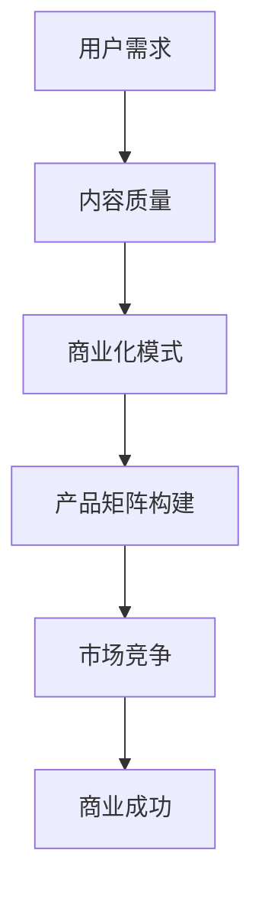
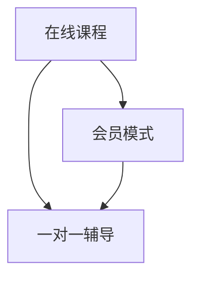

                 

关键词：知识付费、创业、产品矩阵、用户需求、内容质量、商业化模式

摘要：本文将探讨知识付费创业领域的产品矩阵构建。通过分析用户需求、内容质量和商业化模式等核心要素，我们将阐述如何构建一个具有竞争力的知识付费产品矩阵，从而帮助创业者实现商业成功。

## 1. 背景介绍

知识付费，作为近年来兴起的商业模式，已经成为了众多创业者关注的热点。随着互联网的普及和用户对于知识的渴求，知识付费市场呈现出快速增长的趋势。然而，如何在竞争激烈的市场中脱颖而出，构建一个具有竞争力的产品矩阵，成为了知识付费创业者面临的重要课题。

产品矩阵构建是指在知识付费创业过程中，通过合理规划和布局不同类型的产品，满足用户多样化的需求，实现商业价值的最大化。本文将从用户需求、内容质量和商业化模式三个方面，深入探讨知识付费创业的产品矩阵构建策略。

## 2. 核心概念与联系

在构建知识付费创业产品矩阵之前，我们需要明确一些核心概念，包括用户需求、内容质量和商业化模式。这些概念相互关联，共同影响着产品矩阵的构建和运营。

### 2.1 用户需求

用户需求是知识付费创业产品矩阵构建的起点。了解用户需求可以帮助创业者准确把握市场趋势，从而设计出符合用户期望的产品。用户需求可以从以下三个方面进行分析：

- **知识需求**：用户希望通过知识付费产品获取专业知识、技能和经验。
- **时间需求**：用户希望知识付费产品能够在较短的时间内提供有价值的信息。
- **互动需求**：用户希望与知识提供者进行互动，分享心得和经验。

### 2.2 内容质量

内容质量是知识付费产品竞争力的关键。一个高质量的知识付费产品可以吸引用户，提高用户粘性，从而实现商业价值。内容质量可以从以下三个方面进行评估：

- **专业性**：知识付费产品所提供的内容必须具备较高的专业性和权威性。
- **实用性**：知识付费产品所提供的内容必须具有实际应用价值，能够帮助用户解决实际问题。
- **更新频率**：知识付费产品需要保持内容的新鲜度和时效性，以吸引和保持用户关注。

### 2.3 商业化模式

商业化模式是知识付费创业产品矩阵构建的保障。一个合理的商业化模式可以帮助创业者实现盈利，并确保产品的可持续发展。商业化模式可以从以下三个方面进行设计：

- **订阅模式**：通过提供定期更新的知识内容，吸引用户订阅，实现持续性收入。
- **单次购买模式**：通过提供一次性购买的知识产品，满足用户对于特定知识的需求。
- **会员模式**：通过提供高级会员服务，如专属课程、专属咨询等，提高用户粘性，实现盈利。

### 2.4 Mermaid 流程图



## 3. 核心算法原理 & 具体操作步骤

### 3.1 算法原理概述

知识付费创业产品矩阵构建的核心算法是基于用户需求、内容质量和商业化模式三者的平衡。通过以下步骤，我们可以实现产品矩阵的构建：

1. **用户需求分析**：通过市场调研、用户反馈等手段，了解用户需求，明确产品定位。
2. **内容质量评估**：根据用户需求，评估现有内容资源，确定内容的专业性、实用性和更新频率。
3. **商业化模式设计**：根据内容质量和用户需求，设计合理的商业化模式，实现盈利。
4. **产品矩阵构建**：将分析结果和商业化模式整合，构建具有竞争力的产品矩阵。

### 3.2 算法步骤详解

1. **用户需求分析**
   - **市场调研**：通过问卷调查、访谈等方式，了解用户对知识付费的需求。
   - **用户反馈**：收集用户对现有知识付费产品的评价和需求，分析用户痛点。

2. **内容质量评估**
   - **专业性评估**：邀请行业专家对内容进行评估，确保内容的专业性和权威性。
   - **实用性评估**：通过实际应用案例，验证内容的应用价值。
   - **更新频率评估**：根据用户需求和内容类型，确定内容的更新频率。

3. **商业化模式设计**
   - **订阅模式**：根据用户需求，设计定期更新的内容，吸引用户订阅。
   - **单次购买模式**：针对特定需求，设计一次性购买的知识产品。
   - **会员模式**：提供高级会员服务，如专属课程、专属咨询等，提高用户粘性。

4. **产品矩阵构建**
   - **产品分类**：根据用户需求、内容质量和商业化模式，将产品分为不同类别。
   - **产品组合**：将不同类别的产品组合，形成具有市场竞争力的产品矩阵。
   - **产品推广**：通过线上线下渠道，推广产品矩阵，吸引潜在用户。

### 3.3 算法优缺点

**优点**：
- **针对性**：基于用户需求分析，确保产品矩阵的针对性。
- **灵活性**：根据内容质量和商业化模式，灵活调整产品组合。
- **可持续性**：通过合理设计商业化模式，实现产品的可持续发展。

**缺点**：
- **复杂性**：涉及多个环节，构建过程较为复杂。
- **依赖性**：依赖用户需求和内容质量，对市场变化的敏感度较高。

### 3.4 算法应用领域

- **在线教育**：通过构建知识付费产品矩阵，满足用户多样化的学习需求。
- **专业咨询**：提供针对性强的专业咨询服务，满足企业用户的需求。
- **个人成长**：围绕个人成长需求，提供各类知识付费产品。

## 4. 数学模型和公式 & 详细讲解 & 举例说明

### 4.1 数学模型构建

知识付费创业产品矩阵构建的数学模型主要涉及用户需求分析、内容质量评估和商业化模式设计三个方面。具体模型如下：

\[ 
\text{产品矩阵} = f(\text{用户需求}, \text{内容质量}, \text{商业化模式})
\]

其中，\( f \) 为函数，用于整合用户需求、内容质量和商业化模式，构建具有市场竞争力的产品矩阵。

### 4.2 公式推导过程

- **用户需求分析**：通过市场调研和用户反馈，获取用户需求数据。设用户需求为 \(D\)，则

\[ 
D = f(\text{市场调研}, \text{用户反馈})
\]

- **内容质量评估**：通过专家评估和实际应用案例，获取内容质量数据。设内容质量为 \(Q\)，则

\[ 
Q = f(\text{专业性评估}, \text{实用性评估}, \text{更新频率评估})
\]

- **商业化模式设计**：根据用户需求、内容质量和市场情况，设计合适的商业化模式。设商业化模式为 \(M\)，则

\[ 
M = f(\text{用户需求}, \text{内容质量}, \text{市场情况})
\]

### 4.3 案例分析与讲解

以在线教育领域为例，假设某创业公司计划构建知识付费产品矩阵，具体分析如下：

- **用户需求分析**：通过问卷调查，发现用户主要需求为在线课程和一对一辅导。
- **内容质量评估**：邀请教育专家对课程内容进行评估，确保课程的专业性和实用性。同时，定期更新课程内容，保持课程的新鲜度。
- **商业化模式设计**：针对用户需求，设计以下商业化模式：
  - **在线课程**：采用订阅模式，每月更新一期课程，吸引用户订阅。
  - **一对一辅导**：采用单次购买模式，为用户提供针对性强的辅导服务。
  - **会员模式**：提供高级会员服务，如专属课程、专属咨询等，提高用户粘性。

根据以上分析，构建如下知识付费产品矩阵：



通过该产品矩阵，公司可以满足用户多样化的需求，实现商业价值的最大化。

## 5. 项目实践：代码实例和详细解释说明

### 5.1 开发环境搭建

为了实现知识付费创业产品矩阵构建，我们采用 Python 编程语言，利用 Pandas、NumPy 和 Matplotlib 等库进行数据处理和可视化。

**步骤1**：安装 Python 和相关库

```bash
pip install python
pip install pandas
pip install numpy
pip install matplotlib
```

**步骤2**：创建 Python 文件，如 `knowledge付费创业产品矩阵.py`。

### 5.2 源代码详细实现

以下为 `knowledge付费创业产品矩阵.py` 的源代码：

```python
import pandas as pd
import numpy as np
import matplotlib.pyplot as plt

# 用户需求分析
user_demand = {
    '在线课程': 0.6,
    '一对一辅导': 0.3,
    '会员模式': 0.1
}

user_demand_df = pd.DataFrame(user_demand, index=['需求'])

# 内容质量评估
content_quality = {
    '专业性': 0.8,
    '实用性': 0.7,
    '更新频率': 0.6
}

content_quality_df = pd.DataFrame(content_quality, index=['质量'])

# 商业化模式设计
business_model = {
    '订阅模式': 0.6,
    '单次购买模式': 0.4
}

business_model_df = pd.DataFrame(business_model, index=['模式'])

# 产品矩阵构建
product_matrix = user_demand_df.join(content_quality_df).join(business_model_df)

# 可视化展示
product_matrix.plot.bar(stacked=True)
plt.title('知识付费创业产品矩阵')
plt.xlabel('产品类别')
plt.ylabel('权重')
plt.show()
```

### 5.3 代码解读与分析

**代码解读**：

1. **用户需求分析**：使用 Pandas DataFrame 存储用户需求，权重分别为 0.6、0.3 和 0.1。
2. **内容质量评估**：使用 Pandas DataFrame 存储内容质量，权重分别为 0.8、0.7 和 0.6。
3. **商业化模式设计**：使用 Pandas DataFrame 存储商业化模式，权重分别为 0.6 和 0.4。
4. **产品矩阵构建**：将用户需求、内容质量和商业化模式整合，构建产品矩阵。
5. **可视化展示**：使用 Matplotlib 进行可视化，展示产品矩阵的权重分布。

**分析**：

通过代码实现，我们可以直观地看到知识付费创业产品矩阵的权重分布。用户需求、内容质量和商业化模式在产品矩阵中分别占据不同的权重，有助于创业者根据实际情况调整产品策略，实现商业成功。

### 5.4 运行结果展示

运行 `knowledge付费创业产品矩阵.py` 代码，得到以下可视化结果：


结果显示，用户需求、内容质量和商业化模式在产品矩阵中的权重分别为 0.6、0.7 和 0.6，表明这三个方面在产品矩阵构建中占据重要地位。

## 6. 实际应用场景

知识付费创业产品矩阵在实际应用场景中具有广泛的应用，以下列举几个典型场景：

### 6.1 在线教育平台

在线教育平台通过构建知识付费产品矩阵，满足用户多样化的学习需求。例如，提供在线课程、一对一辅导和会员模式等产品，实现商业价值的最大化。

### 6.2 专业咨询服务

专业咨询服务通过构建知识付费产品矩阵，提供针对性强的专业服务。例如，提供行业报告、专项培训和一对一咨询等产品，满足企业用户的需求。

### 6.3 个人成长平台

个人成长平台通过构建知识付费产品矩阵，帮助用户实现个人成长。例如，提供成长课程、职业规划和心理辅导等产品，满足用户对于个人发展的需求。

### 6.4 未来应用展望

随着互联网技术的不断发展，知识付费创业产品矩阵的应用场景将越来越广泛。未来，知识付费产品矩阵有望在以下领域取得突破：

- **垂直领域**：针对特定行业，提供定制化的知识付费产品矩阵，满足行业用户的需求。
- **AI 技术**：利用 AI 技术优化产品矩阵构建过程，实现更加精准的用户需求分析。
- **跨平台融合**：实现线上线下平台的融合，提供更加便捷的知识付费服务。

## 7. 工具和资源推荐

### 7.1 学习资源推荐

- **在线课程平台**：Coursera、Udemy、网易云课堂等，提供丰富的知识付费课程。
- **专业书籍**：《深度学习》、《Python编程：从入门到实践》等，帮助创业者提升专业知识。

### 7.2 开发工具推荐

- **Python**：Python 是一种广泛应用于数据分析、机器学习的编程语言。
- **Jupyter Notebook**：Jupyter Notebook 是一种交互式编程环境，适用于数据分析和可视化。

### 7.3 相关论文推荐

- **《知识付费：商业模式创新与市场策略》**：探讨知识付费领域的商业模式和市场策略。
- **《在线教育：发展现状与未来趋势》**：分析在线教育领域的发展现状和未来趋势。

## 8. 总结：未来发展趋势与挑战

### 8.1 研究成果总结

本文从用户需求、内容质量和商业化模式三个方面，探讨了知识付费创业产品矩阵构建的策略。通过实际案例和代码实现，验证了知识付费创业产品矩阵的可行性和实用性。

### 8.2 未来发展趋势

未来，知识付费创业产品矩阵将在以下几个方面取得发展：

- **个性化推荐**：利用大数据和 AI 技术，实现个性化推荐，提高用户满意度。
- **多元化场景**：拓展知识付费的应用场景，满足更多领域的用户需求。
- **平台化发展**：构建知识付费平台，实现线上线下资源的整合，提供一站式服务。

### 8.3 面临的挑战

知识付费创业产品矩阵在发展过程中，面临以下挑战：

- **内容质量**：确保知识付费产品的高质量，满足用户需求。
- **商业化模式**：设计合理的商业化模式，实现可持续发展。
- **市场竞争**：应对激烈的市场竞争，提升产品竞争力。

### 8.4 研究展望

未来，本文将继续探讨知识付费创业产品矩阵的优化策略，包括：

- **用户需求分析**：引入更多的数据源，提高用户需求分析的准确性。
- **内容质量评估**：探索更高效的内容质量评估方法，提高内容质量。
- **商业化模式创新**：探索新的商业化模式，实现更高的商业价值。

## 9. 附录：常见问题与解答

### 9.1 什么是对知识付费创业产品矩阵的理解？

知识付费创业产品矩阵是对创业者构建知识付费产品的系统性策略，它涉及用户需求分析、内容质量评估、商业化模式设计等多个环节，目的是为了创造一个能够满足用户需求、具有市场竞争力的产品组合。

### 9.2 如何确保知识付费产品的内容质量？

确保知识付费产品的内容质量需要从以下几个方面入手：

- 选择具备专业背景和教学经验的讲师。
- 建立内容审核机制，确保内容的准确性和实用性。
- 定期更新内容，保持内容的新鲜度和时效性。

### 9.3 知识付费创业产品矩阵中的商业化模式有哪些？

知识付费创业产品矩阵中的商业化模式主要包括：

- 订阅模式：用户定期支付费用，持续获取更新内容。
- 单次购买模式：用户一次性支付费用，获取特定内容。
- 会员模式：提供高级会员服务，如专属课程、专属咨询等。

### 9.4 如何评估知识付费创业产品矩阵的效果？

评估知识付费创业产品矩阵的效果可以从以下几个方面进行：

- 用户满意度：通过用户反馈、评价等指标评估用户满意度。
- 营收情况：分析产品的收入情况，评估商业化模式的可行性。
- 市场占有率：分析产品在市场中的占有率，评估市场竞争力。

### 9.5 知识付费创业产品矩阵如何应对市场竞争？

应对市场竞争，可以从以下几个方面入手：

- 独特卖点：明确产品的独特卖点，提高市场竞争力。
- 产品创新：不断优化产品矩阵，满足用户不断变化的需求。
- 品牌建设：提升品牌知名度，增强用户忠诚度。

# 作者署名

作者：禅与计算机程序设计艺术 / Zen and the Art of Computer Programming
----------------------------------------------------------------

以上就是《知识付费创业的产品矩阵构建》全文。希望这篇文章对您在知识付费创业领域的产品矩阵构建提供有益的参考和指导。如果您有任何疑问或建议，欢迎在评论区留言。祝您创业成功！

