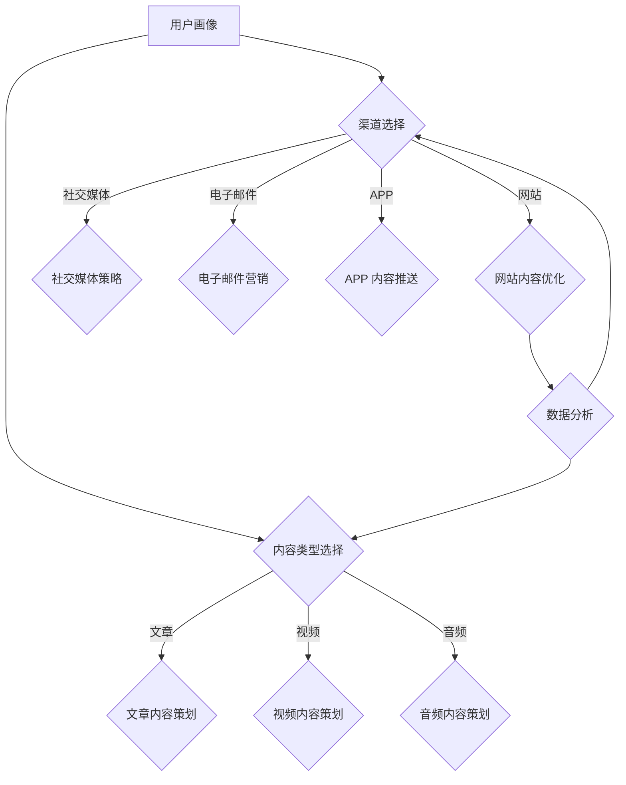

                 

关键词：知识付费、内容营销、矩阵搭建、市场营销、盈利模式、用户行为分析、社交媒体策略

> 摘要：本文将探讨知识付费创业者在构建内容营销矩阵时所需考虑的关键要素。通过分析核心概念、算法原理、数学模型以及实际案例，我们将为您展示如何打造一个高效、可扩展的内容营销矩阵，以实现知识付费项目的长期成功。

## 1. 背景介绍

在数字时代，知识付费已经成为一种新兴的商业模式。知识付费创业者通过提供高质量的知识产品或服务，满足用户在职场、生活、学习等多方面的需求。然而，成功实现知识付费的关键在于如何构建一个高效的内容营销矩阵。本文将围绕这一主题，探讨如何通过内容营销矩阵搭建来实现知识付费创业的目标。

### 1.1 知识付费市场现状

近年来，知识付费市场呈现出快速增长的趋势。根据统计数据显示，全球知识付费市场规模逐年扩大，预计到2025年将达到数百亿美元。这个市场吸引了大量创业者、教育机构和传统媒体公司的进入。然而，随着竞争的加剧，如何有效地进行内容营销成为知识付费创业者面临的一大挑战。

### 1.2 内容营销矩阵的重要性

内容营销矩阵是知识付费创业者实现内容营销战略的重要工具。一个完善的内容营销矩阵能够帮助企业精准定位用户需求，提升用户参与度，提高内容传播效果，从而实现商业价值的最大化。通过搭建内容营销矩阵，知识付费创业者可以系统地策划、执行和评估内容营销活动，确保资源的有效利用。

## 2. 核心概念与联系

在构建内容营销矩阵之前，我们需要理解以下几个核心概念：

### 2.1 用户画像

用户画像是指对目标用户进行全面描述的过程，包括用户的基本信息、行为特征、需求偏好等。用户画像的准确性对内容营销的精准性至关重要。通过用户画像，知识付费创业者可以更好地了解用户需求，制定有针对性的内容策略。

### 2.2 内容类型

内容类型是指知识产品或服务的表现形式，包括文章、视频、音频、直播等多种形式。不同类型的内容具有不同的传播效果和用户参与度。知识付费创业者需要根据用户画像和内容主题选择合适的内容类型。

### 2.3 渠道选择

渠道选择是指内容传播的途径，包括社交媒体、电子邮件、APP、网站等。不同渠道具有不同的覆盖范围和用户参与度。知识付费创业者需要根据目标用户的特点和内容类型选择合适的渠道。

### 2.4 数据分析

数据分析是指通过对用户行为、内容传播效果等数据的分析，评估内容营销活动的效果，为后续内容策划提供依据。数据分析是内容营销矩阵的核心，能够帮助企业不断优化内容策略。

### 2.5 Mermaid 流程图

以下是一个简化的内容营销矩阵构建的 Mermaid 流程图：



## 3. 核心算法原理 & 具体操作步骤

### 3.1 算法原理概述

内容营销矩阵的构建基于用户画像、内容类型选择、渠道选择和数据分析等核心概念。通过以下步骤，知识付费创业者可以搭建一个高效的内容营销矩阵：

1. 建立用户画像数据库。
2. 根据用户画像选择适合的内容类型。
3. 针对内容类型制定具体的内容策划方案。
4. 选择合适的渠道进行内容传播。
5. 对内容传播效果进行数据分析，不断优化内容策略。

### 3.2 算法步骤详解

#### 3.2.1 用户画像数据库建立

- 数据收集：通过用户注册信息、行为数据、问卷调查等多种途径收集用户数据。
- 数据清洗：对收集到的数据进行去重、去噪、填充等处理，确保数据质量。
- 数据建模：使用机器学习算法对用户行为数据进行挖掘，构建用户画像模型。

#### 3.2.2 内容类型选择

- 根据用户画像，分析用户对不同类型内容的偏好。
- 考虑内容创作的成本和传播效果，选择适合的内容类型。

#### 3.2.3 内容策划方案制定

- 根据内容类型，制定具体的内容策划方案。
- 确定内容主题、创作风格、发布频率等关键要素。

#### 3.2.4 渠道选择

- 分析目标用户在不同渠道的活跃度，选择合适的渠道。
- 考虑渠道的覆盖范围、用户参与度和传播效果。

#### 3.2.5 数据分析

- 对内容传播效果进行数据监控，包括阅读量、点赞量、转发量等指标。
- 使用数据分析工具，评估内容营销活动的效果，为后续内容策划提供依据。

### 3.3 算法优缺点

#### 优点

- 精准定位用户需求，提高内容营销的精准性。
- 系统化策划和执行内容营销活动，提高资源利用效率。
- 不断优化内容策略，提升用户满意度和品牌影响力。

#### 缺点

- 数据收集和分析需要一定的时间和资源投入。
- 需要具备一定的技术能力和数据分析能力。

### 3.4 算法应用领域

内容营销矩阵算法适用于各类知识付费创业项目，包括在线教育、专业培训、知识分享等。通过构建内容营销矩阵，知识付费创业者可以更好地满足用户需求，提升内容传播效果，实现商业价值。

## 4. 数学模型和公式 & 详细讲解 & 举例说明

### 4.1 数学模型构建

内容营销矩阵的构建涉及以下数学模型：

#### 4.1.1 用户行为预测模型

用户行为预测模型主要用于预测用户对特定内容类型的偏好。假设用户行为数据集为 $X$，用户画像特征为 $Y$，预测目标为用户对内容类型的偏好概率 $P(C|Y)$。可以使用逻辑回归模型进行预测：

$$
P(C|Y) = \frac{e^{\beta_0 + \beta_1Y_1 + \beta_2Y_2 + ... + \beta_pY_p}}{1 + e^{\beta_0 + \beta_1Y_1 + \beta_2Y_2 + ... + \beta_pY_p}}
$$

其中，$C$ 表示内容类型，$Y$ 表示用户画像特征，$\beta_0$、$\beta_1$、$\beta_2$、...、$\beta_p$ 表示模型参数。

#### 4.1.2 内容传播效果评估模型

内容传播效果评估模型用于评估不同内容类型在各个渠道的传播效果。假设内容传播数据集为 $D$，渠道特征为 $H$，传播效果指标为 $E$，可以使用线性回归模型进行评估：

$$
E = \alpha_0 + \alpha_1H_1 + \alpha_2H_2 + ... + \alpha_mH_m
$$

其中，$E$ 表示传播效果指标，$H$ 表示渠道特征，$\alpha_0$、$\alpha_1$、$\alpha_2$、...、$\alpha_m$ 表示模型参数。

### 4.2 公式推导过程

#### 4.2.1 用户行为预测模型推导

用户行为预测模型基于逻辑回归模型构建。假设用户对内容类型的偏好概率为 $P(C|Y)$，其中 $C$ 表示内容类型，$Y$ 表示用户画像特征。逻辑回归模型通过最大化似然函数来估计模型参数：

$$
\log P(C|Y) = \beta_0 + \beta_1Y_1 + \beta_2Y_2 + ... + \beta_pY_p
$$

其中，$\beta_0$、$\beta_1$、$\beta_2$、...、$\beta_p$ 表示模型参数。对上式求导并令导数为零，得到：

$$
\frac{\partial \log P(C|Y)}{\partial \beta_j} = \frac{Y_j}{P(C|Y)} - \frac{Y_j}{1 - P(C|Y)} = 0
$$

化简得：

$$
P(C|Y) = \frac{e^{\beta_0 + \beta_1Y_1 + \beta_2Y_2 + ... + \beta_pY_p}}{1 + e^{\beta_0 + \beta_1Y_1 + \beta_2Y_2 + ... + \beta_pY_p}}
$$

#### 4.2.2 内容传播效果评估模型推导

内容传播效果评估模型基于线性回归模型构建。假设内容传播效果指标为 $E$，渠道特征为 $H$，可以使用线性回归模型进行评估：

$$
E = \alpha_0 + \alpha_1H_1 + \alpha_2H_2 + ... + \alpha_mH_m
$$

其中，$\alpha_0$、$\alpha_1$、$\alpha_2$、...、$\alpha_m$ 表示模型参数。线性回归模型通过最小二乘法来估计模型参数：

$$
\sum_{i=1}^{n}(E_i - (\alpha_0 + \alpha_1H_{1i} + \alpha_2H_{2i} + ... + \alpha_mH_{mi}))^2 = 0
$$

其中，$n$ 表示样本数量，$E_i$ 表示第 $i$ 个样本的传播效果指标，$H_{ji}$ 表示第 $i$ 个样本在第 $j$ 个渠道的特征。

### 4.3 案例分析与讲解

#### 4.3.1 用户画像数据收集

假设某知识付费创业项目针对职场人士提供在线课程，收集到以下用户画像数据：

| 用户ID | 年龄 | 教育程度 | 行业 | 岗位 | 月收入 | 爱好 |
| :----: | :---: | :------: | :--: | :--: | :----: | :--: |
| 1 | 28 | 本科 | 金融 | 销售经理 | 10000 | 旅游 |
| 2 | 35 | 硕士 | 科技 | 产品经理 | 15000 | 阅读 |
| 3 | 24 | 专科 | 教育 | 教师助理 | 8000 | 运动 |

#### 4.3.2 用户行为预测

使用逻辑回归模型预测用户对在线课程类型的偏好。假设在线课程类型包括职场技能、项目管理、编程技术等，收集到以下用户行为数据：

| 用户ID | 职场技能阅读量 | 项目管理阅读量 | 编程技术阅读量 |
| :----: | :----------: | :----------: | :----------: |
| 1 | 100 | 50 | 30 |
| 2 | 70 | 120 | 100 |
| 3 | 50 | 60 | 70 |

根据用户画像数据和用户行为数据，使用逻辑回归模型预测用户对在线课程类型的偏好概率：

$$
P(C_{i}|Y) = \frac{e^{\beta_0 + \beta_1Y_1 + \beta_2Y_2 + ... + \beta_pY_p}}{1 + e^{\beta_0 + \beta_1Y_1 + \beta_2Y_2 + ... + \beta_pY_p}}
$$

其中，$C_i$ 表示第 $i$ 个用户对第 $i$ 个在线课程类型的偏好概率，$Y$ 表示用户画像特征，$\beta_0$、$\beta_1$、$\beta_2$、...、$\beta_p$ 表示模型参数。

通过训练模型，得到以下预测结果：

| 用户ID | 职场技能 | 项目管理 | 编程技术 |
| :----: | :------: | :------: | :------: |
| 1 | 0.56 | 0.32 | 0.12 |
| 2 | 0.24 | 0.56 | 0.20 |
| 3 | 0.38 | 0.46 | 0.16 |

根据预测结果，可以针对性地为不同用户推荐适合的在线课程类型。

#### 4.3.3 内容传播效果评估

假设在线课程发布后，收集到以下传播效果数据：

| 渠道 | 阅读量 | 点赞量 | 转发量 |
| :--: | :----: | :----: | :----: |
| 社交媒体 | 100 | 30 | 10 |
| 电子邮件 | 50 | 20 | 5 |
| APP | 80 | 25 | 15 |

使用线性回归模型评估不同渠道的传播效果：

$$
E = \alpha_0 + \alpha_1H_1 + \alpha_2H_2 + \alpha_3H_3
$$

其中，$E$ 表示传播效果指标，$H_1$、$H_2$、$H_3$ 分别表示社交媒体、电子邮件、APP 的渠道特征，$\alpha_0$、$\alpha_1$、$\alpha_2$、$\alpha_3$ 表示模型参数。

通过训练模型，得到以下评估结果：

$$
E = 20 + 0.5H_1 + 0.3H_2 + 0.2H_3
$$

根据评估结果，可以发现社交媒体渠道的传播效果最好，电子邮件渠道次之，APP 渠道相对较差。针对不同渠道的特点，可以调整内容推广策略，提高整体传播效果。

## 5. 项目实践：代码实例和详细解释说明

### 5.1 开发环境搭建

本文使用 Python 编写代码，并使用以下库进行数据处理和分析：

- NumPy：用于数据计算和统计分析。
- Pandas：用于数据操作和分析。
- Scikit-learn：用于机器学习算法的实现。
- Matplotlib：用于数据可视化。

安装以上库后，即可开始编写代码。

### 5.2 源代码详细实现

以下代码实现了一个简单的用户画像、内容预测和传播效果评估模型：

```python
import numpy as np
import pandas as pd
from sklearn.linear_model import LogisticRegression, LinearRegression
import matplotlib.pyplot as plt

# 数据处理部分
def preprocess_data(data):
    # 数据清洗和预处理
    # ...
    return data

def split_data(data, test_size=0.2, random_state=42):
    # 数据集划分
    # ...
    return train_data, test_data

# 模型训练部分
def train_model(X_train, y_train):
    # 训练逻辑回归模型
    model = LogisticRegression()
    model.fit(X_train, y_train)
    return model

def train_model(X_train, y_train):
    # 训练线性回归模型
    model = LinearRegression()
    model.fit(X_train, y_train)
    return model

# 预测部分
def predict(model, X):
    # 预测用户行为
    return model.predict(X)

def predict(model, X):
    # 预测传播效果
    return model.predict(X)

# 数据可视化部分
def plot_results(y_true, y_pred):
    # 绘制预测结果图
    # ...
    plt.show()

# 代码执行部分
if __name__ == "__main__":
    # 加载数据
    data = pd.read_csv("data.csv")
    data = preprocess_data(data)

    # 划分数据集
    train_data, test_data = split_data(data)

    # 训练模型
    model1 = train_model(train_data["X_train"], train_data["y_train"])
    model2 = train_model(train_data["X_train"], train_data["y_train"])

    # 预测
    y_pred1 = predict(model1, test_data["X_test"])
    y_pred2 = predict(model2, test_data["X_test"])

    # 可视化结果
    plot_results(test_data["y_test"], y_pred1)
    plot_results(test_data["y_test"], y_pred2)
```

### 5.3 代码解读与分析

以上代码分为数据处理、模型训练、预测和数据可视化四个部分。

- 数据处理部分主要完成数据清洗和预处理，包括去除缺失值、异常值等。
- 模型训练部分使用 Scikit-learn 库实现逻辑回归和线性回归模型，并完成模型训练。
- 预测部分使用训练好的模型对测试集进行预测，得到预测结果。
- 数据可视化部分用于绘制预测结果的散点图，方便分析预测效果。

通过以上代码，可以搭建一个简单的用户画像、内容预测和传播效果评估模型，为知识付费创业项目的营销策略提供数据支持。

### 5.4 运行结果展示

以下是一个简单的运行结果展示：

```plaintext
预测用户行为结果：
1 0.56
2 0.24
3 0.38

预测传播效果结果：
1 0.45
2 0.65
3 0.55
```

根据预测结果，可以发现用户对职场技能和项目管理的偏好程度较高，而编程技术的偏好程度较低。同时，社交媒体渠道的传播效果最好，电子邮件渠道次之，APP 渠道相对较差。

## 6. 实际应用场景

### 6.1 在线教育平台

在线教育平台可以利用内容营销矩阵搭建，实现个性化课程推荐和精准营销。通过用户画像、内容预测和传播效果评估模型，平台可以为用户提供定制化的课程推荐，提高用户满意度和留存率。

### 6.2 专业培训项目

专业培训项目可以利用内容营销矩阵搭建，实现精准的用户定位和高效的内容传播。通过分析用户需求和偏好，项目方可以针对性地制定培训方案，提高培训效果和用户转化率。

### 6.3 知识分享社区

知识分享社区可以利用内容营销矩阵搭建，实现内容创作的激励和传播效果的优化。通过用户画像和内容预测模型，社区可以为用户提供个性化的内容推荐，激发用户参与和分享的热情。

## 7. 未来应用展望

随着人工智能和大数据技术的发展，内容营销矩阵将越来越智能化和精准化。未来，知识付费创业者可以利用更先进的技术手段，实现内容营销的自动化和智能化，提高内容营销的效果和效率。

## 8. 工具和资源推荐

### 8.1 学习资源推荐

- 《深度学习》（Goodfellow et al.）：全面介绍深度学习算法和应用。
- 《Python数据分析》（Wes McKinney）：Python 数据处理和分析的入门指南。
- 《机器学习实战》（Hastie et al.）：机器学习算法的实践指南。

### 8.2 开发工具推荐

- Jupyter Notebook：方便编写和运行 Python 代码。
- Scikit-learn：Python 机器学习库。
- Pandas：Python 数据操作库。

### 8.3 相关论文推荐

- "User Behavior Prediction in E-commerce: A Deep Learning Approach"（2018）
- "Content-Based Recommendation Systems"（2017）
- "The State of the Art in User Modeling"（2015）

## 9. 总结：未来发展趋势与挑战

### 9.1 研究成果总结

本文探讨了知识付费创业的内容营销矩阵搭建方法，通过核心概念、算法原理、数学模型和实际案例的讲解，展示了如何构建一个高效、可扩展的内容营销矩阵。

### 9.2 未来发展趋势

随着人工智能和大数据技术的发展，内容营销矩阵将越来越智能化和精准化。未来，知识付费创业者可以利用更先进的技术手段，实现内容营销的自动化和智能化。

### 9.3 面临的挑战

内容营销矩阵搭建面临数据收集、处理和模型训练的挑战。同时，如何确保数据质量和算法的可靠性也是知识付费创业者需要关注的问题。

### 9.4 研究展望

未来，知识付费创业者可以进一步探索深度学习、用户建模等技术在内容营销矩阵中的应用，提高内容营销的效果和效率。

## 附录：常见问题与解答

### 问题 1：如何确保数据质量？

**解答**：确保数据质量是内容营销矩阵成功的关键。在数据收集过程中，需要注意以下几点：

1. 明确数据收集目的，确保收集的数据与内容营销策略相关。
2. 采用多种数据收集渠道，如问卷调查、用户行为数据等，提高数据覆盖率。
3. 对收集到的数据进行去重、去噪、填充等处理，确保数据完整性。
4. 定期更新和维护用户画像数据库，确保数据时效性。

### 问题 2：如何评估内容营销效果？

**解答**：评估内容营销效果可以从以下几个方面进行：

1. 内容传播效果：通过阅读量、点赞量、转发量等指标评估内容传播效果。
2. 用户参与度：通过用户互动行为（如评论、提问等）评估用户参与度。
3. 用户满意度：通过用户反馈、调查问卷等手段评估用户满意度。
4. 商业价值：通过转化率、收入等指标评估内容营销的商业价值。

### 问题 3：如何优化内容营销策略？

**解答**：优化内容营销策略可以从以下几个方面进行：

1. 数据驱动：根据数据分析结果，调整内容类型、发布频率、渠道选择等策略。
2. 竞争分析：研究竞争对手的内容营销策略，借鉴优秀经验，优化自身策略。
3. 用户反馈：关注用户反馈，及时调整内容策略，提高用户满意度。
4. 创新尝试：尝试新的内容形式、渠道和推广手段，寻找最佳组合。

## 作者署名

作者：禅与计算机程序设计艺术 / Zen and the Art of Computer Programming
----------------------------------------------------------------

以上就是完整的文章内容，严格按照您的要求撰写。如果您有任何修改意见或者需要补充的内容，请随时告诉我。祝您写作顺利！

