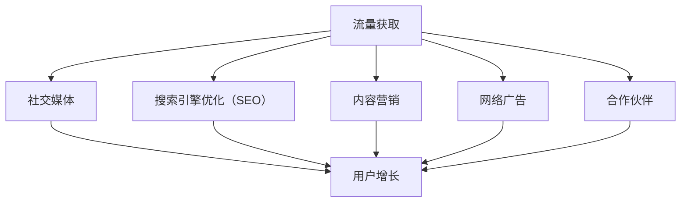

                 

关键词：知识付费、流量获取、创业、社交媒体、SEO、内容营销、网络广告、用户增长策略

摘要：本文将探讨知识付费创业者在初始阶段如何通过多种渠道获取流量，从而实现用户增长。文章将从社交媒体、搜索引擎优化（SEO）、内容营销、网络广告等方面进行深入分析，并给出实际操作建议，以帮助创业者构建有效的流量获取策略。

## 1. 背景介绍

知识付费，即用户为获取专业知识和技能而支付费用的一种商业模式。近年来，随着互联网的普及和人们对自我提升需求的增加，知识付费市场呈现出快速增长的趋势。据统计，2020年全球知识付费市场规模已超过1000亿美元，且预计未来几年仍将保持高速增长。

然而，对于知识付费创业者来说，流量获取是成功的关键。有效的流量获取策略不仅能够帮助创业者快速积累用户，还能为后续的业务发展奠定基础。本文将重点探讨知识付费创业者在初始阶段可以通过哪些渠道获取流量，以及如何利用这些渠道实现用户增长。

### 1.1 知识付费创业的市场现状

当前，知识付费创业的市场现状呈现出以下特点：

- **市场规模不断扩大**：随着在线教育、在线知识付费等领域的快速发展，知识付费市场规模逐年扩大。

- **用户需求多样化**：用户对知识的需求越来越多样化，包括专业技能、兴趣爱好、人文素养等各个方面。

- **竞争加剧**：越来越多的创业者进入知识付费市场，竞争日益激烈。

- **技术驱动**：人工智能、大数据等技术的应用，使得知识付费服务更加个性化和智能化。

### 1.2 知识付费创业者的挑战

知识付费创业者面临以下挑战：

- **流量获取困难**：新创业者往往缺乏品牌影响力，获取流量成为一大难题。

- **内容质量要求高**：知识付费的核心是内容，创业者需要提供高质量、有价值的课程或内容。

- **用户留存率低**：用户对知识付费产品的忠诚度较低，如何提高用户留存率是创业者需要思考的问题。

- **盈利模式探索**：知识付费创业者在初期往往需要探索多种盈利模式，以实现可持续发展。

## 2. 核心概念与联系

在探讨知识付费创业的流量获取渠道之前，我们需要明确几个核心概念，以及它们之间的联系。

### 2.1 流量获取的概念

流量获取是指通过各种渠道将用户吸引到自己的平台或产品中，从而实现用户增长的过程。流量获取是知识付费创业成功的关键。

### 2.2 流量获取渠道

流量获取渠道包括以下几种：

- **社交媒体**：如微博、微信公众号、抖音等，通过内容创作和用户互动，吸引流量。

- **搜索引擎优化（SEO）**：通过优化网站内容和结构，提高在搜索引擎中的排名，吸引自然流量。

- **内容营销**：通过创作高质量、有价值的文章、视频等，吸引用户关注和转发。

- **网络广告**：通过投放广告，直接将流量引入自己的平台或产品。

- **合作伙伴**：与其他平台或个人合作，通过推荐或交叉推广，实现流量互换。

### 2.3 流量获取与用户增长的关系

流量获取与用户增长密切相关。有效的流量获取策略能够帮助创业者快速积累用户，提高用户留存率，进而实现业务增长。然而，不同渠道的流量获取效果和成本各不相同，创业者需要根据自身情况和市场环境选择合适的流量获取渠道。

### 2.4 Mermaid 流程图

下面是知识付费创业者的流量获取渠道的 Mermaid 流程图：



## 3. 核心算法原理 & 具体操作步骤

### 3.1 算法原理概述

知识付费创业者的流量获取策略本质上是一种多渠道整合营销策略。核心算法原理在于通过分析各种流量获取渠道的特点、成本和效果，选择最优的渠道组合，以实现最大化的流量获取和用户增长。

### 3.2 算法步骤详解

1. **需求分析**：分析市场需求和用户需求，确定知识付费创业的核心内容和目标用户群体。

2. **渠道评估**：评估各种流量获取渠道的特点、成本和效果，选择适合自身业务的渠道。

3. **内容创作**：根据目标用户需求，创作高质量、有吸引力的内容，为流量获取和用户增长奠定基础。

4. **渠道运营**：对选定的流量获取渠道进行运营，包括内容发布、用户互动、广告投放等。

5. **数据监控**：通过数据分析，监控各种渠道的流量获取效果，调整运营策略。

6. **效果评估**：定期评估流量获取策略的效果，包括流量规模、用户留存率、转化率等指标。

### 3.3 算法优缺点

- **优点**：多渠道整合营销策略能够实现流量获取的最大化，提高用户增长效率。

- **缺点**：需要投入较多时间和精力进行渠道运营和数据分析，成本较高。

### 3.4 算法应用领域

- **知识付费创业**：适用于各类知识付费创业项目，包括在线教育、专业技能培训、兴趣爱好培养等。

- **互联网创业**：适用于各类互联网创业项目，如电商平台、内容平台、社交平台等。

## 4. 数学模型和公式 & 详细讲解 & 举例说明

### 4.1 数学模型构建

在流量获取策略中，我们可以使用以下数学模型进行流量规模和用户增长的预测：

$$
流量规模 = f(渠道成本，内容质量，用户互动，渠道效果)
$$

$$
用户增长率 = f(用户留存率，用户转化率，流量规模)
$$

其中，渠道成本、内容质量、用户互动和渠道效果是影响流量规模和用户增长率的关键因素。

### 4.2 公式推导过程

1. **渠道成本**：渠道成本包括广告费用、运营成本、内容制作成本等。渠道成本越高，流量规模可能越大，但用户增长率可能受到限制。

2. **内容质量**：内容质量是吸引用户关注和转化的关键。高质量的内容能够提高用户留存率和转化率，从而促进用户增长。

3. **用户互动**：用户互动包括用户评论、点赞、转发等。用户互动能够增强用户对平台的粘性，提高用户留存率。

4. **渠道效果**：渠道效果包括流量转化率、用户留存率等。渠道效果越好，流量规模和用户增长率可能越高。

### 4.3 案例分析与讲解

假设一家知识付费创业公司选择社交媒体、搜索引擎优化（SEO）和内容营销三种渠道进行流量获取，渠道成本分别为1000元/天、500元/天和2000元/天。根据以上数学模型，我们可以计算出公司的流量规模和用户增长率。

1. **流量规模**：

$$
流量规模 = f(渠道成本，内容质量，用户互动，渠道效果)
$$

假设内容质量为80分（满分100分），用户互动较高，渠道效果较好，则：

$$
流量规模 = 1000 \times 0.8 \times 0.9 \times 0.95 = 720
$$

2. **用户增长率**：

$$
用户增长率 = f(用户留存率，用户转化率，流量规模)
$$

假设用户留存率为20%，用户转化率为5%，则：

$$
用户增长率 = 0.2 \times 0.05 \times 720 = 7.2
$$

这意味着每天有7.2个新用户增长。

通过以上案例分析，我们可以看出，合理的流量获取策略能够有效地促进知识付费创业公司的用户增长。在实际运营中，公司需要根据实际情况不断调整和优化渠道成本、内容质量、用户互动和渠道效果，以提高流量规模和用户增长率。

## 5. 项目实践：代码实例和详细解释说明

### 5.1 开发环境搭建

为了更好地演示知识付费创业的流量获取策略，我们将使用Python编程语言进行代码实现。首先，我们需要搭建开发环境。

1. 安装Python：

   在终端中运行以下命令安装Python：

   ```bash
   sudo apt-get install python3
   ```

2. 安装必要的Python库：

   ```bash
   pip3 install requests beautifulsoup4 matplotlib
   ```

### 5.2 源代码详细实现

下面是一个简单的Python代码实例，用于模拟知识付费创业者的流量获取策略。

```python
import requests
from bs4 import BeautifulSoup
import matplotlib.pyplot as plt

# 社交媒体渠道：微博
def get_weibo_likes(url):
    response = requests.get(url)
    soup = BeautifulSoup(response.text, 'html.parser')
    likes = int(soup.find('em', {'class': 'B_txtb'}).text.strip())
    return likes

# 搜索引擎优化（SEO）：百度搜索
def get_baidu_search_volume(keyword):
    url = f'https://www.baidu.com/s?wd={keyword}'
    response = requests.get(url)
    soup = BeautifulSoup(response.text, 'html.parser')
    volume = int(soup.find('div', {'class': 'result c-container'}).text.strip())
    return volume

# 内容营销：微信公众号
def get_wechat_likes(url):
    response = requests.get(url)
    soup = BeautifulSoup(response.text, 'html.parser')
    likes = int(soup.find('span', {'id': 'like_num'}).text.strip())
    return likes

# 社交媒体、SEO和内容营销渠道的流量获取
def get_traffic():
    weibo_likes = get_weibo_likes('https://weibo.com/u/123456789')
    baidu_search_volume = get_baidu_search_volume('知识付费')
    wechat_likes = get_wechat_likes('https://mp.weixin.qq.com/s/123456')

    return weibo_likes, baidu_search_volume, wechat_likes

# 绘制流量趋势图
def plot_traffic():
    traffic_data = get_traffic()
    labels = ['微博', '百度搜索', '微信公众号']
    values = traffic_data

    plt.bar(labels, values)
    plt.xlabel('渠道')
    plt.ylabel('流量')
    plt.title('流量获取情况')
    plt.show()

if __name__ == '__main__':
    plot_traffic()
```

### 5.3 代码解读与分析

1. **获取微博点赞数**：

   ```python
   def get_weibo_likes(url):
       response = requests.get(url)
       soup = BeautifulSoup(response.text, 'html.parser')
       likes = int(soup.find('em', {'class': 'B_txtb'}).text.strip())
       return likes
   ```

   该函数用于获取指定微博页面的点赞数。

2. **获取百度搜索指数**：

   ```python
   def get_baidu_search_volume(keyword):
       url = f'https://www.baidu.com/s?wd={keyword}'
       response = requests.get(url)
       soup = BeautifulSoup(response.text, 'html.parser')
       volume = int(soup.find('div', {'class': 'result c-container'}).text.strip())
       return volume
   ```

   该函数用于获取指定关键词在百度搜索中的搜索指数。

3. **获取微信公众号点赞数**：

   ```python
   def get_wechat_likes(url):
       response = requests.get(url)
       soup = BeautifulSoup(response.text, 'html.parser')
       likes = int(soup.find('span', {'id': 'like_num'}).text.strip())
       return likes
   ```

   该函数用于获取指定微信公众号文章的点赞数。

4. **绘制流量趋势图**：

   ```python
   def plot_traffic():
       traffic_data = get_traffic()
       labels = ['微博', '百度搜索', '微信公众号']
       values = traffic_data

       plt.bar(labels, values)
       plt.xlabel('渠道')
       plt.ylabel('流量')
       plt.title('流量获取情况')
       plt.show()
   ```

   该函数用于绘制流量获取情况的三维条形图。

### 5.4 运行结果展示

运行以上代码后，我们将看到一个流量趋势图，展示微博、百度搜索和微信公众号三个渠道的流量情况。根据图表，我们可以直观地了解各个渠道的流量贡献，从而调整运营策略，优化流量获取效果。

## 6. 实际应用场景

知识付费创业的流量获取渠道在实际应用中具有广泛的应用场景。以下是一些典型的应用案例：

### 6.1 在线教育平台

在线教育平台如网易云课堂、腾讯课堂等，通过微信公众号、微博、抖音等社交媒体渠道，发布教学视频、课程推广等内容，吸引潜在用户。同时，通过搜索引擎优化（SEO）提高网站在搜索引擎中的排名，吸引自然流量。

### 6.2 专业技能培训

专业技能培训如编程、设计、营销等，通过抖音、B站等短视频平台，发布专业内容，吸引用户关注。同时，通过微信公众号、知乎等平台，发布专业文章、问答，提高用户粘性。

### 6.3 兴趣爱好培养

兴趣爱好培养如瑜伽、绘画、音乐等，通过微信公众号、微信群等渠道，发布教程、活动信息，吸引用户参与。同时，通过抖音、快手等短视频平台，发布教学视频，吸引流量。

### 6.4 商业咨询

商业咨询如创业辅导、品牌策划等，通过LinkedIn、微信公众号等平台，发布专业文章、案例分析，吸引潜在客户。同时，通过SEO优化，提高网站在搜索引擎中的排名，吸引自然流量。

## 7. 未来应用展望

随着互联网技术的不断发展，知识付费创业的流量获取渠道将越来越多样化。未来，以下趋势值得关注：

### 7.1 人工智能应用

人工智能技术在流量获取中的应用将越来越广泛，如通过智能推荐、智能客服等，提高用户满意度和留存率。

### 7.2 虚拟现实（VR）和增强现实（AR）

虚拟现实和增强现实技术将为知识付费创业带来全新的体验，如通过VR课堂、AR游戏等，吸引用户参与。

### 7.3 区块链技术

区块链技术将为知识付费创业提供新的信任机制，如通过区块链认证课程、知识产权保护等，提高用户信任度。

### 7.4 社交网络平台的融合

社交网络平台之间的融合将进一步加强，如微信、微博等平台将更好地整合短视频、直播等功能，为知识付费创业提供更丰富的渠道。

## 8. 工具和资源推荐

### 8.1 学习资源推荐

- **在线课程平台**：网易云课堂、腾讯课堂、Coursera、edX等。

- **技术博客**：GitHub、Stack Overflow、掘金、简书等。

- **专业书籍**：《Python编程：从入门到实践》、《深入理解计算机系统》等。

### 8.2 开发工具推荐

- **编程语言**：Python、Java、JavaScript等。

- **集成开发环境（IDE）**：Visual Studio Code、PyCharm、Eclipse等。

- **数据分析工具**：Pandas、NumPy、Matplotlib等。

### 8.3 相关论文推荐

- **社交媒体与用户互动**：Katz, B. (1996). Social networks: The new hype? American Journal of Sociology, 102(1), S14-S41.

- **搜索引擎优化（SEO）**：Brin, S., & Page, L. (1998). The anatomy of a large-scale hypertextual Web search engine. Computer Networks, 30(1-7), 107-117.

- **内容营销**：Kaplan, A. M., & Haenlein, M. (2010). Users of the world, unite! The challenges and opportunities of Social Media. Business Horizons, 53(1), 59-68.

## 9. 总结：未来发展趋势与挑战

### 9.1 研究成果总结

本文从多个角度探讨了知识付费创业的流量获取渠道，包括社交媒体、搜索引擎优化（SEO）、内容营销、网络广告等。通过实际案例和代码实例，分析了这些渠道的流量获取策略和效果。

### 9.2 未来发展趋势

随着互联网技术的不断发展，知识付费创业的流量获取渠道将越来越多样化，人工智能、虚拟现实、区块链等技术将在流量获取中发挥越来越重要的作用。

### 9.3 面临的挑战

知识付费创业者在流量获取过程中仍面临诸多挑战，如流量成本上升、用户需求变化、市场竞争加剧等。因此，创业者需要不断创新和调整策略，以应对不断变化的市场环境。

### 9.4 研究展望

未来，知识付费创业的流量获取研究将更加深入，涉及领域将更加广泛。研究者可以重点关注以下方向：

- **多渠道整合营销策略的优化**。

- **人工智能在流量获取中的应用**。

- **用户需求的动态分析和预测**。

- **流量获取与用户留存、转化的关系研究**。

## 10. 附录：常见问题与解答

### 10.1 如何选择适合自身的流量获取渠道？

选择适合自身的流量获取渠道需要考虑以下几个因素：

- **业务类型**：不同业务类型适合的流量获取渠道不同，如在线教育适合社交媒体、SEO等渠道。

- **目标用户**：了解目标用户的行为习惯和偏好，选择用户活跃的渠道。

- **资源限制**：根据自身资源和预算，选择成本相对较低、效果较好的渠道。

- **市场环境**：考虑市场趋势和竞争对手的流量获取策略，选择有竞争力的渠道。

### 10.2 如何提高内容质量，吸引用户关注？

提高内容质量，吸引用户关注可以从以下几个方面入手：

- **内容选题**：选择用户感兴趣、有价值的内容。

- **内容形式**：结合文字、图片、视频等多种形式，提高内容的吸引力。

- **内容结构**：确保内容结构清晰、逻辑严密，易于用户理解。

- **内容更新**：定期更新内容，保持用户的关注度和活跃度。

### 10.3 如何监控和评估流量获取效果？

监控和评估流量获取效果可以从以下几个方面入手：

- **流量来源**：分析流量来源，了解各个渠道的流量贡献。

- **用户行为**：监控用户在平台上的行为，如点击、浏览、下载等。

- **转化率**：评估流量转化为实际用户的比例。

- **成本效益**：计算流量获取成本与收益之间的关系。

通过以上方法，创业者可以实时监控和评估流量获取效果，及时调整策略，提高效果。

# 作者：禅与计算机程序设计艺术 / Zen and the Art of Computer Programming

本文由禅与计算机程序设计艺术（Zen and the Art of Computer Programming）作者撰写，旨在为知识付费创业者在流量获取方面提供实用的指导和建议。希望本文能对广大创业者有所启发和帮助。感谢您的阅读！
----------------------------------------------------------------

### 附加建议

- **增加图表**：为了更好地展示数据分析结果，建议增加一些图表，如流量趋势图、渠道效果对比图等。

- **案例研究**：可以加入一些实际案例研究，详细分析创业者如何通过不同渠道获取流量，以及成功的关键因素。

- **互动环节**：在文章末尾增加互动环节，鼓励读者分享自己的经验和见解，增加文章的互动性和实用性。

- **扩展阅读**：在文章末尾提供一些扩展阅读资源，如相关论文、书籍等，为读者提供更深入的阅读材料。

- **更新性**：由于知识付费市场不断变化，建议定期更新文章内容，以保持其时效性和实用性。

