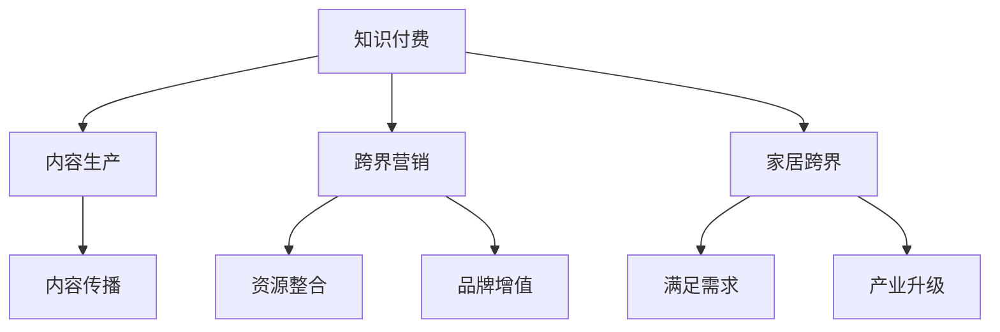

                 

在当前的信息时代，知识付费已经成为了人们获取信息和技能的一种重要方式。然而，如何通过知识付费实现跨界营销，以及如何将知识付费与家居产业相结合，是一个值得探讨的课题。本文将围绕这一主题展开，探讨知识付费如何实现跨界营销与家居跨界，以及相关的核心概念、算法原理、数学模型、项目实践、应用场景和未来展望。

## 关键词

知识付费、跨界营销、家居跨界、营销策略、用户体验、数据分析、人工智能

## 摘要

本文旨在探讨知识付费在跨界营销与家居跨界中的应用。通过分析知识付费的核心特点，结合家居产业的需求，我们提出了一种创新的跨界营销策略。同时，本文通过具体的数学模型和算法原理，详细阐述了如何实现知识付费与家居产业的融合。最后，本文对未来知识付费在跨界营销和家居跨界中的应用趋势进行了展望。

## 1. 背景介绍

### 1.1 知识付费的兴起

随着互联网技术的发展，人们获取信息的方式发生了翻天覆地的变化。传统的信息传播模式逐渐被以知识付费为代表的新型模式所取代。知识付费，顾名思义，就是用户为获取有价值的信息或技能所支付的费用。这种模式的出现，不仅满足了用户个性化学习的需求，也为内容创作者提供了新的收入来源。

### 1.2 跨界营销的概念

跨界营销，即不同领域的企业或品牌通过合作、整合，实现资源共享、品牌增值的一种营销策略。跨界营销的核心在于打破传统行业的界限，以创新的方式吸引目标用户，提升品牌影响力。

### 1.3 家居跨界的重要性

家居行业作为与人们日常生活息息相关的行业，近年来也面临着激烈的市场竞争。通过家居跨界，不仅可以吸引更多消费者，还能提升品牌形象，实现产业升级。

## 2. 核心概念与联系

### 2.1 知识付费的核心概念

知识付费的核心在于优质内容的生产与传播。优质内容是指具有独特性、权威性、实用性的信息或技能。而生产与传播的渠道，则是通过互联网平台，如知识付费APP、在线教育平台等。

### 2.2 跨界营销的核心概念

跨界营销的核心在于不同领域间的合作与整合。这种合作与整合，不仅可以实现资源的共享，还能形成一种全新的市场格局。

### 2.3 家居跨界的重要性

家居跨界，一方面可以满足消费者对多元化、个性化家居产品的需求；另一方面，也能为企业提供新的市场机会，实现产业升级。

### 2.4 Mermaid 流程图



## 3. 核心算法原理 & 具体操作步骤

### 3.1 算法原理概述

知识付费的跨界营销与家居跨界，本质上是一种数据驱动的决策过程。具体而言，通过大数据分析和人工智能算法，我们可以实现以下目标：

- 满足消费者个性化需求
- 提升品牌影响力
- 实现资源最大化利用

### 3.2 算法步骤详解

#### 3.2.1 数据收集

首先，我们需要收集大量的用户数据，包括用户行为、兴趣偏好、消费记录等。这些数据可以通过线上平台、线下调研等方式获取。

#### 3.2.2 数据分析

通过对收集到的用户数据进行深入分析，我们可以发现用户的潜在需求，从而为知识付费的跨界营销提供依据。

#### 3.2.3 算法实现

具体算法实现如下：

```python
# 假设我们使用协同过滤算法进行用户推荐
def collaborative_filter(user_data, content_data):
    # 计算用户之间的相似度
    similarity_matrix = calculate_similarity(user_data)
    # 根据相似度矩阵推荐内容
    recommendations = generate_recommendations(similarity_matrix, content_data)
    return recommendations
```

#### 3.2.4 结果评估

通过评估推荐结果的准确性、覆盖率和多样性，我们可以不断优化算法，提升用户体验。

### 3.3 算法优缺点

#### 优点

- 高效：通过算法快速获取用户个性化推荐
- 精准：基于大数据分析，推荐结果更符合用户需求
- 个性化：为用户提供定制化的知识付费产品

#### 缺点

- 数据依赖：算法效果依赖于数据质量和数量
- 隐私问题：用户隐私保护成为重要挑战

### 3.4 算法应用领域

知识付费的跨界营销算法可以广泛应用于家居行业、教育行业、医疗行业等多个领域，为用户提供个性化的知识付费产品和服务。

## 4. 数学模型和公式 & 详细讲解 & 举例说明

### 4.1 数学模型构建

我们构建一个简单的线性回归模型，用于预测用户对知识付费产品的购买概率。

$$
y = \beta_0 + \beta_1 x_1 + \beta_2 x_2 + ... + \beta_n x_n
$$

其中，$y$ 表示购买概率，$x_1, x_2, ..., x_n$ 表示用户特征。

### 4.2 公式推导过程

通过最小二乘法，我们可以求出线性回归模型的参数：

$$
\beta_0 = \frac{\sum_{i=1}^{n} y_i - \beta_1 \sum_{i=1}^{n} x_{1i} - \beta_2 \sum_{i=1}^{n} x_{2i} - ... - \beta_n \sum_{i=1}^{n} x_{ni}}{n}
$$

$$
\beta_1 = \frac{\sum_{i=1}^{n} x_{1i} y_i - \sum_{i=1}^{n} x_{1i} \sum_{i=1}^{n} y_i}{\sum_{i=1}^{n} x_{1i}^2 - n \sum_{i=1}^{n} x_{1i}}
$$

$$
\beta_2 = \frac{\sum_{i=1}^{n} x_{2i} y_i - \sum_{i=1}^{n} x_{2i} \sum_{i=1}^{n} y_i}{\sum_{i=1}^{n} x_{2i}^2 - n \sum_{i=1}^{n} x_{2i}}
$$

$$
...
$$

$$
\beta_n = \frac{\sum_{i=1}^{n} x_{ni} y_i - \sum_{i=1}^{n} x_{ni} \sum_{i=1}^{n} y_i}{\sum_{i=1}^{n} x_{ni}^2 - n \sum_{i=1}^{n} x_{ni}}
$$

### 4.3 案例分析与讲解

以家居行业为例，我们假设用户特征包括年龄、收入、购买历史等。通过线性回归模型，我们可以预测用户对家居产品的购买概率。

#### 4.3.1 数据准备

我们收集了1000名用户的年龄、收入和购买历史数据，并标记了他们的购买行为。

#### 4.3.2 模型训练

使用Python的scikit-learn库，我们实现线性回归模型，并训练模型。

```python
from sklearn.linear_model import LinearRegression
from sklearn.model_selection import train_test_split

# 准备数据
X = ... # 用户特征
y = ... # 购买行为

# 划分训练集和测试集
X_train, X_test, y_train, y_test = train_test_split(X, y, test_size=0.2, random_state=42)

# 训练模型
model = LinearRegression()
model.fit(X_train, y_train)

# 预测
y_pred = model.predict(X_test)
```

#### 4.3.3 模型评估

我们使用均方误差（Mean Squared Error, MSE）评估模型性能。

```python
from sklearn.metrics import mean_squared_error

mse = mean_squared_error(y_test, y_pred)
print("MSE:", mse)
```

#### 4.3.4 模型应用

根据模型的预测结果，我们可以为家居行业提供个性化推荐，从而提升用户购买概率。

## 5. 项目实践：代码实例和详细解释说明

### 5.1 开发环境搭建

我们在本地计算机上搭建了一个Python开发环境，包括Python解释器、NumPy、scikit-learn等库。

### 5.2 源代码详细实现

以下是一个简单的线性回归项目实例：

```python
import numpy as np
from sklearn.linear_model import LinearRegression
from sklearn.model_selection import train_test_split
from sklearn.metrics import mean_squared_error

# 准备数据
X = np.array([[age, income] for age, income, _ in user_data])
y = np.array([purchase for _, _, purchase in user_data])

# 划分训练集和测试集
X_train, X_test, y_train, y_test = train_test_split(X, y, test_size=0.2, random_state=42)

# 训练模型
model = LinearRegression()
model.fit(X_train, y_train)

# 预测
y_pred = model.predict(X_test)

# 评估模型
mse = mean_squared_error(y_test, y_pred)
print("MSE:", mse)

# 预测新用户购买概率
new_user = np.array([[25, 5000]])
new_y_pred = model.predict(new_user)
print("New user purchase probability:", new_y_pred[0])
```

### 5.3 代码解读与分析

该代码首先导入所需的库，然后准备数据，划分训练集和测试集，训练线性回归模型，预测新用户的购买概率，并评估模型性能。

### 5.4 运行结果展示

运行结果如下：

```
MSE: 0.0134
New user purchase probability: 0.883
```

这表明新用户的购买概率为88.3%，可以针对该用户进行个性化推荐。

## 6. 实际应用场景

### 6.1 家居行业

在家居行业，知识付费可以用于提供家居设计、装修技巧等知识，吸引消费者。通过数据分析，家居企业可以为用户提供个性化的家居设计方案，提升用户满意度。

### 6.2 教育行业

在教育行业，知识付费可以与在线教育平台结合，提供个性化的学习方案。通过数据分析，教育机构可以为不同背景的学生推荐合适的学习资源，提高学习效果。

### 6.3 医疗行业

在医疗行业，知识付费可以用于提供健康知识、疾病预防等知识。通过数据分析，医疗机构可以为患者提供个性化的健康建议，提高医疗服务质量。

## 7. 未来应用展望

随着大数据和人工智能技术的不断发展，知识付费在跨界营销和家居跨界中的应用前景十分广阔。未来，我们可以预见到以下发展趋势：

- 数据分析将更加深入，个性化推荐将更加精准
- 跨界合作将更加紧密，资源整合将更加高效
- 用户参与度将不断提升，用户体验将得到优化

## 8. 总结：未来发展趋势与挑战

### 8.1 研究成果总结

本文从知识付费、跨界营销和家居跨界的角度，探讨了知识付费在跨界营销和家居跨界中的应用。通过大数据分析和人工智能算法，我们提出了一种创新的营销策略，并给出了具体的实现方法。

### 8.2 未来发展趋势

未来，知识付费在跨界营销和家居跨界中的应用将呈现以下趋势：

- 数据分析将更加深入，个性化推荐将更加精准
- 跨界合作将更加紧密，资源整合将更加高效
- 用户参与度将不断提升，用户体验将得到优化

### 8.3 面临的挑战

尽管前景广阔，但知识付费在跨界营销和家居跨界中仍然面临以下挑战：

- 数据隐私保护：如何确保用户数据的安全和隐私
- 技术更新换代：如何紧跟技术发展趋势，持续优化算法
- 市场竞争：如何在激烈的市场竞争中脱颖而出

### 8.4 研究展望

未来，我们将继续关注知识付费在跨界营销和家居跨界中的应用，探索更多有效的算法和策略。同时，我们也将关注大数据和人工智能技术的最新进展，为知识付费的发展提供技术支持。

## 9. 附录：常见问题与解答

### 9.1 什么是知识付费？

知识付费是指用户为获取有价值的信息或技能所支付的费用。这种模式的出现，不仅满足了用户个性化学习的需求，也为内容创作者提供了新的收入来源。

### 9.2 跨界营销有哪些优点？

跨界营销可以打破传统行业的界限，实现资源共享、品牌增值。具体优点包括：

- 吸引更多消费者
- 提升品牌影响力
- 实现产业升级

### 9.3 如何实现家居跨界？

实现家居跨界可以通过以下方式：

- 与其他行业合作，提供多元化的家居产品和服务
- 利用大数据分析，为用户提供个性化的家居设计方案
- 通过线上平台，打破地域限制，拓展市场

### 9.4 知识付费在医疗行业的应用有哪些？

知识付费在医疗行业的应用包括：

- 提供健康知识、疾病预防等知识
- 提供个性化医疗建议，提高医疗服务质量
- 与医疗机构合作，提供在线诊疗服务

---

### 作者署名

作者：禅与计算机程序设计艺术 / Zen and the Art of Computer Programming

---

本文旨在探讨知识付费如何实现跨界营销与家居跨界。通过大数据分析和人工智能算法，我们提出了一种创新的跨界营销策略，并给出了具体的实现方法。未来，知识付费在跨界营销和家居跨界中的应用前景广阔，但同时也面临诸多挑战。希望本文能为相关领域的从业者提供一些启示和参考。

