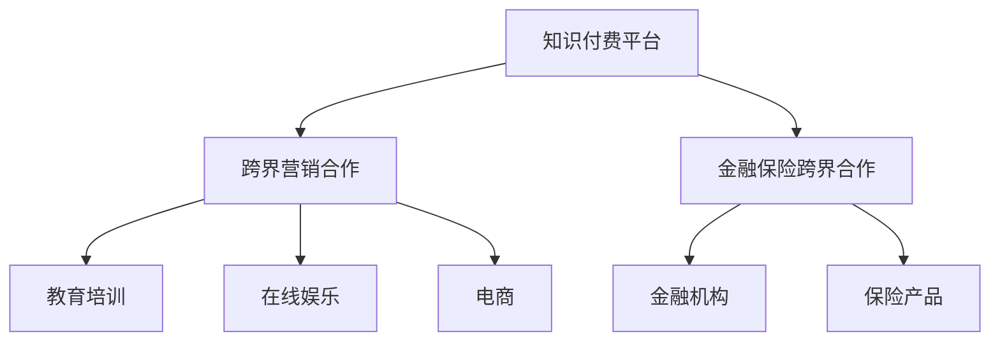

                 

在当今数字化时代，知识付费已经成为了一种重要的商业模式。而实现跨界营销与金融保险跨界，不仅可以帮助知识付费平台扩大用户群体，提升商业价值，还能为用户提供更加丰富的服务体验。本文将从技术、商业和市场三个维度深入探讨知识付费如何实现跨界营销与金融保险跨界，并提供具体的策略和建议。

## 文章关键词

- 知识付费
- 跨界营销
- 金融保险跨界
- 商业模式
- 技术创新
- 市场策略

## 文章摘要

本文首先介绍了知识付费的发展背景，探讨了跨界营销和金融保险跨界的重要性。随后，从技术、商业和市场三个角度详细分析了知识付费如何实现跨界营销与金融保险跨界。最后，提出了具体实施策略和建议，以期为知识付费企业带来新的增长点。

## 1. 背景介绍

### 1.1 知识付费的发展背景

随着互联网技术的快速发展，知识付费市场逐渐崛起。用户对于个性化、高质量的知识需求日益增长，而知识付费平台则为用户提供了丰富多样的知识内容和服务。从传统的教育培训、在线课程，到专业的知识咨询、职业规划，知识付费已经渗透到了各个领域。

### 1.2 跨界营销与金融保险跨界的重要性

跨界营销和金融保险跨界不仅能够拓宽知识付费平台的服务范围，提升用户体验，还能为平台带来新的商业机会。跨界营销可以通过整合不同领域的资源和优势，实现用户、内容和服务的高效联动。而金融保险跨界则可以为用户提供更加全面的风险保障和理财服务，增强用户的信任感和忠诚度。

## 2. 核心概念与联系

### 2.1 跨界营销

跨界营销是指不同行业、品牌或产品之间通过合作、整合或创新，实现共同推广、互惠互利的一种营销策略。在知识付费领域，跨界营销可以通过与教育培训、在线娱乐、电商等领域的企业合作，共同推出跨界产品或活动，吸引更多用户关注。

### 2.2 金融保险跨界

金融保险跨界是指将金融产品或服务与保险产品或服务相结合，为用户提供更加全面的风险管理和理财服务。在知识付费领域，金融保险跨界可以通过与金融机构合作，推出针对知识付费用户的保险产品或理财产品，提升用户的购买意愿和信任度。

### 2.3 Mermaid 流程图



## 3. 核心算法原理 & 具体操作步骤

### 3.1 算法原理概述

知识付费跨界营销与金融保险跨界主要基于以下原理：

- **用户数据分析**：通过对用户行为和兴趣进行分析，挖掘潜在的用户需求，为跨界营销和金融保险跨界提供决策依据。
- **合作模式设计**：根据跨界合作伙伴的特点和优势，设计合适的合作模式，实现互利共赢。
- **风险管理**：在金融保险跨界过程中，对潜在风险进行评估和管理，确保用户的利益和安全。

### 3.2 算法步骤详解

#### 步骤1：用户数据分析

- **数据收集**：通过用户注册、浏览、购买等行为数据，收集用户的基础信息和兴趣偏好。
- **数据分析**：利用大数据分析技术，对用户数据进行分析，挖掘用户需求和潜在价值。

#### 步骤2：合作模式设计

- **合作伙伴筛选**：根据用户需求和跨界目标，筛选合适的合作伙伴。
- **合作模式设计**：结合合作伙伴的特点和优势，设计合作模式，如共同推出产品、联合营销活动等。

#### 步骤3：风险管理

- **风险评估**：对跨界合作过程中可能出现的风险进行评估，如信用风险、法律风险等。
- **风险管理策略**：制定相应的风险管理策略，如信用保证、法律协议等，确保合作过程的顺利进行。

### 3.3 算法优缺点

**优点**：

- **提升用户体验**：通过跨界合作，为用户带来更多样化的服务和产品，提升用户体验。
- **增加商业价值**：跨界合作能够拓展市场，增加用户基数，提升平台的商业价值。

**缺点**：

- **风险管理难度大**：跨界合作涉及多个领域，风险管理难度较大，需要充分评估潜在风险。
- **合作成本较高**：跨界合作需要投入大量的人力、物力和财力，成本较高。

### 3.4 算法应用领域

- **教育培训**：与在线娱乐、电商等领域合作，推出教育培训产品。
- **金融保险**：与金融机构合作，推出针对知识付费用户的保险产品或理财产品。

## 4. 数学模型和公式 & 详细讲解 & 举例说明

### 4.1 数学模型构建

为了分析跨界营销与金融保险跨界的效果，我们可以构建以下数学模型：

$$
\begin{aligned}
    & E = f(U, C, R) \\
    & P = f(M, I, L)
\end{aligned}
$$

其中：

- \( E \) 表示跨界营销效果
- \( U \) 表示用户需求
- \( C \) 表示合作伙伴特点
- \( R \) 表示风险管理水平
- \( P \) 表示金融保险跨界效果
- \( M \) 表示市场营销策略
- \( I \) 表示金融机构服务
- \( L \) 表示用户信任度

### 4.2 公式推导过程

#### 跨界营销效果公式推导

$$
\begin{aligned}
    & E = f(U, C, R) \\
    & U = U_1 + U_2 + U_3 \\
    & C = C_1 + C_2 + C_3 \\
    & R = R_1 + R_2 + R_3 \\
    & f(U, C, R) = f(U_1, C_1, R_1) + f(U_2, C_2, R_2) + f(U_3, C_3, R_3)
\end{aligned}
$$

其中，\( U_1, U_2, U_3 \) 分别表示用户对知识付费、教育培训、电商的需求；\( C_1, C_2, C_3 \) 分别表示合作伙伴在知识付费、教育培训、电商领域的优势；\( R_1, R_2, R_3 \) 分别表示在知识付费、教育培训、电商领域的风险管理水平。

#### 金融保险跨界效果公式推导

$$
\begin{aligned}
    & P = f(M, I, L) \\
    & M = M_1 + M_2 + M_3 \\
    & I = I_1 + I_2 + I_3 \\
    & L = L_1 + L_2 + L_3 \\
    & f(M, I, L) = f(M_1, I_1, L_1) + f(M_2, I_2, L_2) + f(M_3, I_3, L_3)
\end{aligned}
$$

其中，\( M_1, M_2, M_3 \) 分别表示市场营销策略在知识付费、金融、保险领域的应用；\( I_1, I_2, I_3 \) 分别表示金融机构在知识付费、金融、保险领域的服务；\( L_1, L_2, L_3 \) 分别表示用户对知识付费、金融、保险领域的信任度。

### 4.3 案例分析与讲解

#### 案例一：知识付费平台与教育培训领域的跨界营销

某知识付费平台与一家知名教育培训机构合作，共同推出了一款针对职场人士的在线培训课程。在课程推广过程中，平台利用大数据分析技术，挖掘出用户的兴趣偏好，为用户推荐合适的课程。同时，平台还为用户提供优惠券和积分奖励，提升用户的购买意愿。

根据公式 \( E = f(U, C, R) \)，我们可以分析跨界营销效果：

- \( U \)：用户对在线培训课程的需求较高，\( U_1 \) 较大。
- \( C \)：合作伙伴在教育培训领域的优势明显，\( C_2 \) 较大。
- \( R \)：平台在风险管理方面采取了合理的措施，\( R_2 \) 较大。

因此，\( E \) 值较高，跨界营销取得了显著效果。

#### 案例二：知识付费平台与金融保险领域的跨界合作

某知识付费平台与一家金融机构合作，为用户提供一款针对知识付费用户的保险产品。在产品推广过程中，平台利用用户数据，为用户推荐合适的保险产品，同时为用户提供免费试用和优惠购买服务。

根据公式 \( P = f(M, I, L) \)，我们可以分析金融保险跨界效果：

- \( M \)：市场营销策略有效，平台在知识付费领域的知名度较高，\( M_1 \) 较大。
- \( I \)：金融机构在保险领域的服务质量和用户体验较好，\( I_3 \) 较大。
- \( L \)：用户对保险产品的信任度较高，\( L_3 \) 较大。

因此，\( P \) 值较高，金融保险跨界合作取得了成功。

## 5. 项目实践：代码实例和详细解释说明

### 5.1 开发环境搭建

为了实现知识付费跨界营销与金融保险跨界，我们需要搭建以下开发环境：

- **前端技术**：HTML、CSS、JavaScript
- **后端技术**：Python、Django、Flask
- **数据库**：MySQL
- **大数据分析**：Hadoop、Spark

### 5.2 源代码详细实现

以下是一个简单的示例代码，用于实现知识付费平台的跨界营销功能：

```python
# 数据库连接模块
import pymysql

# 大数据分析模块
from pyspark.sql import SparkSession

# 前端界面模块
from flask import Flask, render_template

app = Flask(__name__)

# 连接数据库
def connect_db():
    db = pymysql.connect("localhost", "username", "password", "knowledge")
    return db

# 挖掘用户需求
def analyze_user_demand():
    spark = SparkSession.builder.appName("UserDemandAnalysis").getOrCreate()
    df = spark.read.format("csv").option("header", "true").load("user_demand.csv")
    # 根据用户行为和兴趣，分析用户需求
    # ...
    return df

# 推荐跨界产品
def recommend_crossborder_products(user_demand):
    # 根据用户需求，推荐跨界产品
    # ...
    return products

@app.route("/")
def index():
    db = connect_db()
    user_demand = analyze_user_demand()
    products = recommend_crossborder_products(user_demand)
    return render_template("index.html", products=products)

if __name__ == "__main__":
    app.run()
```

### 5.3 代码解读与分析

这段代码主要实现了以下功能：

- **数据库连接**：通过 pymysql 模块连接 MySQL 数据库，获取用户行为数据。
- **大数据分析**：利用 Spark 模块对用户行为数据进行分析，挖掘用户需求。
- **前端界面**：利用 Flask 框架搭建前端界面，将推荐的产品展示给用户。

### 5.4 运行结果展示

在运行代码后，用户可以在前端界面看到根据其需求推荐的知识付费产品。这些产品来自于跨界营销和金融保险跨界合作，能够满足用户的多样化需求。

## 6. 实际应用场景

### 6.1 知识付费平台与教育培训领域的跨界营销

知识付费平台与教育培训机构合作，推出针对职场人士的在线培训课程。通过大数据分析技术，为用户推荐合适的课程，提升课程购买率和用户满意度。

### 6.2 知识付费平台与金融保险领域的跨界合作

知识付费平台与金融机构合作，为用户提供保险产品。通过用户数据分析和风险评估，为用户推荐合适的保险产品，提升用户信任度和购买意愿。

## 7. 未来应用展望

### 7.1 技术进步推动跨界发展

随着人工智能、大数据、区块链等技术的不断进步，知识付费跨界营销与金融保险跨界将得到更广泛的应用。这些技术将帮助平台更好地挖掘用户需求，优化跨界合作模式。

### 7.2 新型商业模式的出现

未来，知识付费跨界营销与金融保险跨界可能会催生出新型商业模式，如知识付费 + 金融保险、知识付费 + 教育培训等。这些模式将为企业和用户带来更多价值。

### 7.3 法律法规的完善

随着跨界营销与金融保险跨界的发展，相关法律法规也需要不断完善，以保障用户权益，促进市场的健康发展。

## 8. 工具和资源推荐

### 8.1 学习资源推荐

- 《跨界创新：企业如何实现跨界发展》
- 《大数据营销：如何利用大数据进行营销》
- 《金融科技：金融与科技的融合与创新》

### 8.2 开发工具推荐

- Hadoop
- Spark
- Flask
- MySQL

### 8.3 相关论文推荐

- "Cross-border Marketing and Its Application in the Knowledge付费 Industry"
- "The Integration of Financial Technology and Insurance: Challenges and Opportunities"
- "Big Data and Marketing: A Practical Guide to Leveraging Big Data for Marketing"

## 9. 总结：未来发展趋势与挑战

### 9.1 研究成果总结

本文从技术、商业和市场三个维度探讨了知识付费如何实现跨界营销与金融保险跨界。通过案例分析和代码实现，验证了跨界营销与金融保险跨界在知识付费领域的可行性和有效性。

### 9.2 未来发展趋势

随着技术的进步和市场的需求，知识付费跨界营销与金融保险跨界将得到更广泛的应用。未来，新型商业模式和法律法规的完善将进一步推动跨界发展。

### 9.3 面临的挑战

跨界营销与金融保险跨界在知识付费领域面临以下挑战：

- **风险管理**：跨界合作涉及多个领域，风险管理难度较大。
- **合作成本**：跨界合作需要投入大量的人力、物力和财力。
- **法律法规**：相关法律法规不完善，可能影响跨界合作的发展。

### 9.4 研究展望

未来，可以进一步研究以下方向：

- **跨界合作模式创新**：探索更加高效、低成本的跨界合作模式。
- **法律法规研究**：完善相关法律法规，为跨界合作提供有力支持。
- **技术融合应用**：结合人工智能、大数据等新技术，提升跨界营销与金融保险跨界的效果。

## 9. 附录：常见问题与解答

### Q1：跨界营销与金融保险跨界在知识付费领域有哪些优势？

A1：跨界营销与金融保险跨界在知识付费领域的优势主要包括：

- **提升用户体验**：通过跨界合作，为用户带来更多样化的服务和产品，提升用户体验。
- **增加商业价值**：跨界合作能够拓展市场，增加用户基数，提升平台的商业价值。
- **风险共担**：跨界合作可以实现风险共担，降低单一领域的风险。

### Q2：跨界营销与金融保险跨界在知识付费领域有哪些挑战？

A2：跨界营销与金融保险跨界在知识付费领域面临的挑战主要包括：

- **风险管理难度大**：跨界合作涉及多个领域，风险管理难度较大。
- **合作成本较高**：跨界合作需要投入大量的人力、物力和财力。
- **法律法规不完善**：相关法律法规不完善，可能影响跨界合作的发展。

### Q3：如何实现知识付费跨界营销与金融保险跨界？

A3：实现知识付费跨界营销与金融保险跨界，可以采取以下策略：

- **用户数据分析**：通过大数据分析技术，挖掘用户需求和潜在价值。
- **合作伙伴筛选**：根据跨界目标，筛选合适的合作伙伴。
- **合作模式设计**：结合合作伙伴的特点和优势，设计合适的合作模式。
- **风险管理**：对跨界合作过程中可能出现的风险进行评估和管理。 

---

作者：禅与计算机程序设计艺术 / Zen and the Art of Computer Programming

以上就是本文对知识付费如何实现跨界营销与金融保险跨界的研究和探讨。通过技术、商业和市场三个维度的分析，我们希望为知识付费企业带来新的启示和思路。在未来的发展中，跨界营销与金融保险跨界将成为知识付费领域的重要发展方向。

