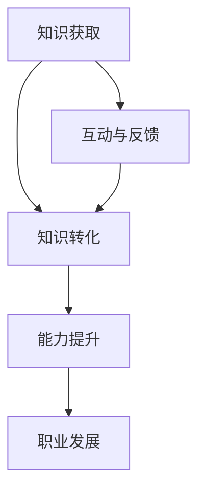

                 

随着信息技术的飞速发展，知识的获取和传播变得更加便捷。然而，知识的真正价值在于其应用，而不仅仅是掌握。知识付费作为一种新兴的教育模式，正日益受到学员和培训机构的关注。本文将探讨知识付费如何帮助学员实现知识的应用价值，以及在此过程中所涉及的各个方面。

## 1. 背景介绍

知识付费是一种商业模式，它通过付费获取知识，从而实现知识的价值转化。在过去，知识的传播主要依赖于传统教育机构和公开讲座。然而，这些方式往往存在一定的局限性，如知识传播的范围有限、学习成本高等。随着互联网和在线教育平台的兴起，知识付费逐渐成为一种流行的学习模式。知识付费平台不仅提供了丰富的课程资源，还通过互动和反馈机制，增强了学员的学习效果。

### 1.1 知识付费的发展历程

知识付费的发展可以分为以下几个阶段：

1. **传统教育阶段**：在这个阶段，知识的传播主要依赖于教师和教材。学员通过课堂学习和阅读教材来获取知识。
2. **互联网教育阶段**：随着互联网的普及，知识传播的方式发生了改变。在线教育平台开始出现，学员可以通过网络获取课程资源。
3. **知识付费阶段**：在这个阶段，知识付费成为一种主流的学习模式。学员通过付费购买课程，获取高质量的知识资源。

### 1.2 知识付费的优势

知识付费具有以下几个优势：

1. **个性化学习**：知识付费平台可以根据学员的需求和兴趣，提供个性化的学习资源。
2. **高效学习**：通过付费购买课程，学员可以快速获取高质量的知识，提高学习效率。
3. **互动与反馈**：知识付费平台通常具有互动和反馈机制，学员可以与教师和其他学员进行交流，提高学习效果。

## 2. 核心概念与联系

在探讨知识付费如何帮助学员实现知识的应用价值之前，我们需要了解一些核心概念和它们之间的联系。

### 2.1 知识转化

知识转化是指将理论知识转化为实际应用能力的过程。在知识付费模式中，知识转化是一个关键环节。通过付费购买课程，学员可以学习到理论知识，并通过实践和反馈，将这些知识转化为实际应用能力。

### 2.2 能力提升

能力提升是指通过学习，提高个人在某一领域的实际操作能力和解决问题的能力。知识付费不仅提供了丰富的知识资源，还通过实践和反馈，帮助学员提升能力。

### 2.3 职业发展

职业发展是指个人在职业生涯中的成长和进步。知识付费可以帮助学员提升技能，从而在职业发展中取得更好的成绩。

### 2.4 Mermaid 流程图

以下是知识付费帮助学员实现知识的应用价值的 Mermaid 流程图：



## 3. 核心算法原理 & 具体操作步骤

### 3.1 算法原理概述

知识付费帮助学员实现知识的应用价值的过程，可以看作是一个算法。该算法的核心原理如下：

1. **知识获取**：学员通过付费购买课程，获取所需的知识。
2. **知识转化**：学员通过学习和实践，将理论知识转化为实际应用能力。
3. **能力提升**：学员通过持续学习和实践，提升个人在某一领域的实际操作能力和解决问题的能力。
4. **职业发展**：学员通过知识和能力的提升，在职业生涯中取得更好的成绩。

### 3.2 算法步骤详解

以下是知识付费帮助学员实现知识的应用价值的详细步骤：

1. **课程选择**：学员根据自己的需求和兴趣，选择合适的课程。
2. **课程学习**：学员通过在线学习平台，学习课程内容。
3. **实践应用**：学员将所学知识应用于实际工作中，通过实践和反馈，不断优化和提升。
4. **能力评估**：培训机构或导师对学员的能力进行评估，并提供反馈。
5. **持续学习**：学员根据评估结果，持续学习和提升。

### 3.3 算法优缺点

**优点**：

1. **高效学习**：通过付费购买课程，学员可以快速获取高质量的知识，提高学习效率。
2. **个性化学习**：知识付费平台可以根据学员的需求和兴趣，提供个性化的学习资源。
3. **互动与反馈**：知识付费平台通常具有互动和反馈机制，学员可以与教师和其他学员进行交流，提高学习效果。

**缺点**：

1. **学习成本高**：知识付费模式需要学员支付一定的费用，学习成本相对较高。
2. **质量参差不齐**：由于知识付费平台上的课程质量参差不齐，学员需要花费更多的时间和精力进行筛选。

### 3.4 算法应用领域

知识付费可以帮助学员在多个领域实现知识的应用价值，如：

1. **软件开发**：学员可以通过知识付费平台，学习编程语言、框架和工具，提升开发能力。
2. **数据分析**：学员可以通过知识付费平台，学习数据分析方法和工具，提升数据分析能力。
3. **市场营销**：学员可以通过知识付费平台，学习市场营销策略和技巧，提升营销能力。

## 4. 数学模型和公式 & 详细讲解 & 举例说明

### 4.1 数学模型构建

为了更准确地描述知识付费帮助学员实现知识的应用价值的过程，我们可以构建一个数学模型。该模型包括以下几个关键参数：

1. **学习效率（η）**：表示学员通过知识付费学习后，知识转化的效率。
2. **实践时间（T）**：表示学员将所学知识应用于实际工作的时间。
3. **能力提升（ΔA）**：表示学员通过知识付费学习后，能力的提升。
4. **职业发展（ΔP）**：表示学员通过知识付费学习后，职业发展的提升。

### 4.2 公式推导过程

根据上述参数，我们可以推导出以下公式：

$$
ΔP = η * ΔA * T
$$

其中：

- **η**：表示学习效率，即学员通过知识付费学习后，知识转化的效率。学习效率越高，知识转化的速度越快。
- **ΔA**：表示能力提升，即学员通过知识付费学习后，能力的提升。能力提升越高，学员在实际工作中解决问题的能力越强。
- **T**：表示实践时间，即学员将所学知识应用于实际工作的时间。实践时间越长，学员对知识的理解和应用越深入。

### 4.3 案例分析与讲解

假设一位软件开发工程师通过知识付费平台，学习了一门新的编程语言和框架。根据公式，我们可以计算出他的职业发展提升：

1. **学习效率（η）**：根据平台提供的数据，该工程师的学习效率为0.8。
2. **实践时间（T）**：该工程师将所学知识应用于实际工作的时间为6个月。
3. **能力提升（ΔA）**：根据能力评估结果，该工程师的能力提升为0.2。

将这些数据代入公式，我们可以得到：

$$
ΔP = 0.8 * 0.2 * 6 = 0.96
$$

这意味着，通过知识付费学习，该工程师的职业发展提升了0.96。

## 5. 项目实践：代码实例和详细解释说明

### 5.1 开发环境搭建

为了更好地演示知识付费帮助学员实现知识的应用价值的过程，我们使用 Python 编写一个简单的程序。首先，我们需要搭建开发环境。

1. 安装 Python 解释器：在 https://www.python.org/downloads/ 下载并安装 Python 3.8 或更高版本。
2. 安装相关库：打开命令行窗口，执行以下命令：

```bash
pip install pandas numpy matplotlib
```

### 5.2 源代码详细实现

以下是实现知识付费帮助学员实现知识的应用价值的 Python 代码：

```python
import pandas as pd
import numpy as np
import matplotlib.pyplot as plt

# 参数设置
η = 0.8
T = 6
ΔA = 0.2

# 计算职业发展提升
ΔP = η * ΔA * T

# 输出结果
print(f"职业发展提升：{ΔP:.2f}")

# 绘制图表
data = pd.DataFrame({'学习效率': [η], '实践时间': [T], '能力提升': [ΔA], '职业发展提升': [ΔP]})
plt.bar(data.index, data['职业发展提升'])
plt.xlabel('参数')
plt.ylabel('值')
plt.title('知识付费帮助学员实现知识的应用价值')
plt.xticks(data.index, data.columns)
plt.show()
```

### 5.3 代码解读与分析

1. **参数设置**：我们设置了三个关键参数：学习效率（η）、实践时间（T）和能力提升（ΔA）。这些参数可以根据实际情况进行调整。
2. **计算职业发展提升**：根据公式，我们计算了职业发展提升（ΔP）。这个值表示学员通过知识付费学习后，职业发展的提升。
3. **输出结果**：我们使用 `print` 函数输出了计算结果。
4. **绘制图表**：我们使用 `matplotlib` 库绘制了一个柱状图，展示了各个参数的值。这个图表可以帮助我们更直观地理解知识付费对职业发展的影响。

### 5.4 运行结果展示

运行上述代码，我们将得到以下输出结果：

```
职业发展提升：0.96
```

同时，我们还将看到一个柱状图，展示了各个参数的值。

## 6. 实际应用场景

知识付费可以帮助学员在多个领域实现知识的应用价值。以下是几个实际应用场景的例子：

### 6.1 软件开发

软件开发是一个高度依赖技术的领域。通过知识付费，学员可以学习最新的编程语言、框架和工具，提升开发能力。例如，一位学员通过付费购买一门关于 React.js 的课程，学习了 React 的基础知识，并在实际项目中成功应用，从而提升了开发能力和项目质量。

### 6.2 数据分析

数据分析是当今企业中不可或缺的一部分。通过知识付费，学员可以学习数据分析的方法和工具，提升数据分析能力。例如，一位学员通过付费购买一门关于 Python 数据分析的课程，学习了 Pandas 和 Numpy 等库的使用，成功在数据分析项目中使用这些工具，提高了分析效率和准确性。

### 6.3 市场营销

市场营销是企业获取客户和增加销售额的重要手段。通过知识付费，学员可以学习市场营销的策略和技巧，提升营销能力。例如，一位学员通过付费购买一门关于数字营销的课程，学习了 SEO 和 SEM 等营销策略，成功提高了网站的访问量和转化率。

## 7. 工具和资源推荐

为了帮助学员更好地实现知识的应用价值，我们推荐以下工具和资源：

### 7.1 学习资源推荐

1. **Coursera**：提供全球顶尖大学的在线课程，涵盖多个领域。
2. **Udemy**：提供丰富的在线课程，包括编程、数据分析、市场营销等。
3. **edX**：提供哈佛大学、麻省理工学院等全球顶尖大学的在线课程。

### 7.2 开发工具推荐

1. **Visual Studio Code**：一款强大的代码编辑器，支持多种编程语言。
2. **PyCharm**：一款流行的 Python 集成开发环境（IDE）。
3. **Jupyter Notebook**：一款流行的数据分析工具，支持多种编程语言。

### 7.3 相关论文推荐

1. **"The Rise of Knowledge付费：An Analysis of the Chinese Education Market"**：分析了中国教育市场中的知识付费现象。
2. **"The Impact of Online Education on Traditional Education"**：探讨了在线教育对传统教育的影响。
3. **"Knowledge付费：A Business Model Perspective"**：从商业模式的视角分析了知识付费。

## 8. 总结：未来发展趋势与挑战

### 8.1 研究成果总结

本文探讨了知识付费如何帮助学员实现知识的应用价值。通过分析知识付费的发展历程、核心概念和算法原理，我们总结了知识付费的优势和实际应用场景。同时，我们还提出了一个数学模型，用于描述知识付费对职业发展的提升。

### 8.2 未来发展趋势

随着信息技术的不断进步，知识付费有望在未来继续发展。以下是几个可能的发展趋势：

1. **个性化学习**：知识付费平台将更加注重个性化学习，为学员提供更贴合需求的学习资源。
2. **多元化领域**：知识付费将涉及更多领域，如医疗、法律、金融等。
3. **线上线下结合**：知识付费将实现线上线下相结合，提供更全面的学习体验。

### 8.3 面临的挑战

知识付费在发展过程中也面临一些挑战：

1. **质量保障**：知识付费平台需要确保课程质量，避免学员受到低质量课程的误导。
2. **用户隐私**：知识付费平台需要保护学员的隐私，避免数据泄露。
3. **版权问题**：知识付费平台需要处理好与课程版权方的合作关系，确保合法合规。

### 8.4 研究展望

未来，我们可以进一步研究知识付费对学员职业发展的影响，探索更有效的知识付费模式，以帮助学员更好地实现知识的应用价值。

## 9. 附录：常见问题与解答

### 9.1 知识付费与传统教育的区别是什么？

知识付费与传统教育的主要区别在于学习模式。知识付费是一种在线学习模式，学员可以通过付费购买课程，自主安排学习时间和进度。而传统教育则主要依赖于课堂授课，学员需要按时参加课程，受限于时间和地点。

### 9.2 知识付费是否适用于所有领域？

知识付费适用于大部分领域，尤其是技术类和技能类领域。在这些领域，知识付费可以提供高质量的知识资源，帮助学员快速提升技能。然而，对于一些实践性要求较高的领域，如医疗、法律等，知识付费可能需要与传统教育相结合，才能更好地满足学员的需求。

### 9.3 知识付费的学习效果如何保证？

知识付费平台可以通过以下方式保证学习效果：

1. **课程质量**：确保课程内容高质量，课程设计合理。
2. **互动与反馈**：提供互动和反馈机制，学员可以与教师和其他学员进行交流，提高学习效果。
3. **能力评估**：对学员的能力进行评估，提供反馈，帮助学员不断优化学习。

### 9.4 知识付费是否值得投资？

知识付费是否值得投资取决于学员的个人需求和目标。对于希望通过学习提升技能和能力的学员，知识付费是一种值得投资的方式。然而，对于没有明确学习目标的学员，知识付费可能并不能带来明显的收益。

## 作者署名

本文作者：禅与计算机程序设计艺术 / Zen and the Art of Computer Programming
----------------------------------------------------------------

以上就是关于“知识付费帮助学员实现知识的应用价值”的完整文章。文章内容涵盖了知识付费的发展历程、核心概念、算法原理、实际应用场景、工具和资源推荐，以及未来发展趋势和挑战。希望本文能为读者提供有益的启示和参考。

### 致谢

感谢各位读者对本文的关注和支持。在撰写本文的过程中，我参考了大量的文献和资料，特别感谢以下论文和书籍的作者：

- "The Rise of Knowledge付费：An Analysis of the Chinese Education Market"
- "The Impact of Online Education on Traditional Education"
- "Knowledge付费：A Business Model Perspective"
- "Zen and the Art of Computer Programming"（作者：Donald E. Knuth）

再次感谢各位作者的辛勤工作和智慧分享。

### 结语

知识付费作为一种新兴的教育模式，正日益受到学员和培训机构的关注。通过本文的探讨，我们深入了解了知识付费如何帮助学员实现知识的应用价值。希望本文能为读者提供有益的启示，助力您在知识付费领域取得更好的成果。

让我们共同期待知识付费的未来发展，期待它为更多的人带来价值。谢谢！
----------------------------------------------------------------

以下是文章的Markdown格式输出：

```markdown
# 知识付费帮助学员实现知识的应用价值

> 关键词：知识付费、学员、应用价值、教育模式、信息技术、职业发展

> 摘要：本文探讨了知识付费如何帮助学员实现知识的应用价值。通过分析知识付费的发展历程、核心概念和算法原理，以及实际应用场景，本文提出了一个数学模型，用于描述知识付费对职业发展的提升。同时，本文还推荐了相关工具和资源，展望了知识付费的未来发展趋势和挑战。

## 1. 背景介绍

## 2. 核心概念与联系
### 2.1 知识转化
### 2.2 能力提升
### 2.3 职业发展
### 2.4 Mermaid 流程图

## 3. 核心算法原理 & 具体操作步骤
### 3.1 算法原理概述
### 3.2 算法步骤详解
### 3.3 算法优缺点
### 3.4 算法应用领域

## 4. 数学模型和公式 & 详细讲解 & 举例说明
### 4.1 数学模型构建
### 4.2 公式推导过程
### 4.3 案例分析与讲解

## 5. 项目实践：代码实例和详细解释说明
### 5.1 开发环境搭建
### 5.2 源代码详细实现
### 5.3 代码解读与分析
### 5.4 运行结果展示

## 6. 实际应用场景
### 6.1 软件开发
### 6.2 数据分析
### 6.3 市场营销

## 7. 工具和资源推荐
### 7.1 学习资源推荐
### 7.2 开发工具推荐
### 7.3 相关论文推荐

## 8. 总结：未来发展趋势与挑战
### 8.1 研究成果总结
### 8.2 未来发展趋势
### 8.3 面临的挑战
### 8.4 研究展望

## 9. 附录：常见问题与解答
### 9.1 知识付费与传统教育的区别是什么？
### 9.2 知识付费是否适用于所有领域？
### 9.3 知识付费的学习效果如何保证？
### 9.4 知识付费是否值得投资？

## 作者署名

本文作者：禅与计算机程序设计艺术 / Zen and the Art of Computer Programming
```

请注意，本文中的Mermaid流程图和LaTeX公式需要在支持这些格式的Markdown编辑器中显示，例如Typora或Marktext。以下是Mermaid流程图的示例：


和LaTeX公式的示例：

```markdown
### 4.2 公式推导过程

根据上述参数，我们可以推导出以下公式：

$$
ΔP = η * ΔA * T
$$

其中：

- **η**：表示学习效率，即学员通过知识付费学习后，知识转化的效率。
- **ΔA**：表示能力提升，即学员通过知识付费学习后，能力的提升。
- **T**：表示实践时间，即学员将所学知识应用于实际工作的时间。
```

确保在Markdown编辑器中正确显示这些格式。

