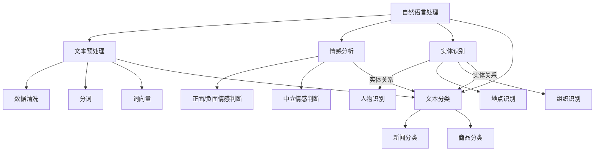
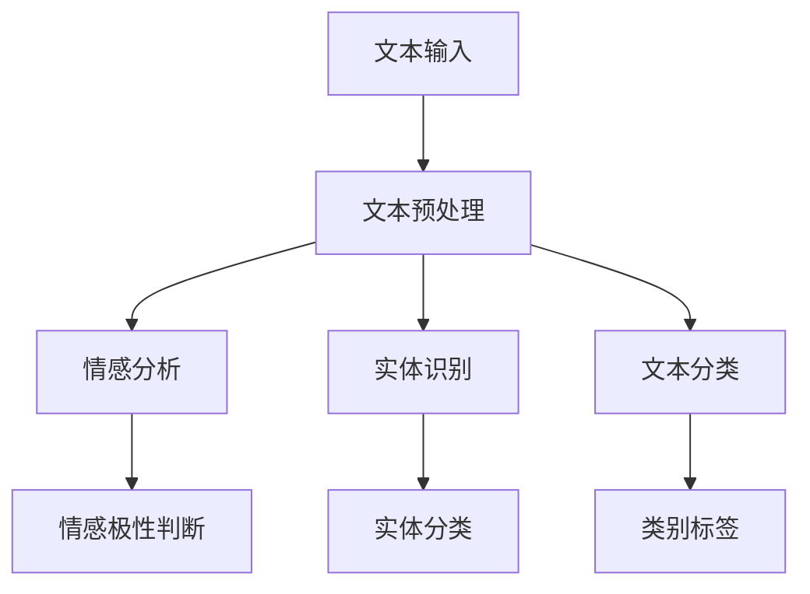

                 

在当前信息化、数字化的时代背景下，知识付费平台已经成为人们获取知识、学习技能的重要途径。然而，随着内容的日益丰富和多样化，如何保证平台内容的优质性和安全性，成为一个亟需解决的问题。本文将围绕知识付费平台的内容审核机制，探讨其核心概念、算法原理、数学模型、实际应用以及未来发展趋势，旨在为相关从业者提供一些有益的思考和实践指导。

## 关键词

- 知识付费平台
- 内容审核机制
- 人工智能
- 自然语言处理
- 安全性
- 质量保障

## 摘要

本文首先介绍了知识付费平台的发展背景及其重要性，随后详细探讨了内容审核机制的核心概念和架构。接着，我们深入分析了核心算法原理，包括算法步骤、优缺点以及应用领域。在此基础上，文章引入了数学模型和公式，并通过案例分析与讲解，使得算法原理更加具体化。随后，我们通过一个实际的代码实例，详细解释了内容审核机制的具体实现。最后，文章讨论了内容审核机制在实际应用场景中的表现，并对未来发展趋势和面临的挑战进行了展望。

### 1. 背景介绍

知识付费平台是一种基于互联网的服务模式，通过提供专业内容、课程、知识产品等形式，为用户创造价值。这类平台主要包括如下几类：

1. **在线教育平台**：如Coursera、edX等，提供在线课程和学位课程。
2. **知识分享平台**：如知乎、Quora等，用户可以分享和获取专业知识。
3. **专业问答平台**：如Stack Overflow、知乎Live等，针对特定领域提供问答服务。
4. **技能培训平台**：如LinkedIn Learning、Udemy等，提供各类技能培训课程。

这些平台在内容质量和安全性方面面临诸多挑战：

1. **内容质量**：平台需要确保提供的内容具有较高的价值和可信度。
2. **版权问题**：内容创作者和平台需要对版权进行有效管理。
3. **虚假信息**：平台需要过滤虚假信息和垃圾内容，防止误导用户。
4. **用户隐私**：平台需要保护用户个人信息，防止数据泄露。

为了应对这些挑战，内容审核机制成为知识付费平台的必要组成部分。内容审核机制旨在通过自动化和人工审核相结合的方式，确保平台内容的质量和安全。

#### 1.1 内容审核的必要性

1. **保障用户体验**：高质量的审核机制可以确保用户在平台上获取到有价值的内容，提高用户满意度。
2. **维护品牌形象**：良好的内容审核机制有助于维护平台品牌形象，增强用户信任。
3. **合规要求**：遵守相关法律法规，确保内容审核机制符合监管要求。
4. **社会责任**：平台作为知识传播的重要渠道，有责任确保内容的真实性和社会责任。

### 2. 核心概念与联系

内容审核机制涉及多个核心概念，包括但不限于自然语言处理（NLP）、机器学习（ML）、深度学习（DL）等。以下是一个简单的 Mermaid 流程图，展示了这些核心概念及其相互关系：



#### 2.1 自然语言处理

自然语言处理（NLP）是内容审核机制的基础。NLP旨在使计算机理解和处理人类语言。其核心任务包括：

1. **文本预处理**：包括文本清洗、分词、词性标注等。
2. **情感分析**：识别文本中的情感极性，如正面、负面或中立。
3. **实体识别**：识别文本中的人物、地点、组织等实体。
4. **文本分类**：将文本分类到不同的类别中。

#### 2.2 机器学习与深度学习

机器学习和深度学习是NLP的关键技术。它们通过构建模型，使计算机能够自动识别和处理语言。

1. **机器学习**：基于已有数据进行训练，使计算机学会识别模式和规律。
2. **深度学习**：基于多层神经网络，使计算机能够自动提取特征并进行复杂任务。

#### 2.3 数据预处理

数据预处理是内容审核的关键步骤，包括：

1. **数据清洗**：去除噪声和无关信息。
2. **分词**：将文本拆分成单词或短语。
3. **词向量**：将单词映射到高维空间，以便进行计算。

### 3. 核心算法原理 & 具体操作步骤

#### 3.1 算法原理概述

内容审核机制的核心算法包括文本预处理、情感分析、实体识别和文本分类。以下是一个简化的算法原理图：



#### 3.2 算法步骤详解

1. **文本预处理**：
   - 数据清洗：去除HTML标签、停用词、特殊字符等。
   - 分词：将文本拆分成单词或短语。
   - 词向量：将文本转化为数值形式，便于计算。

2. **情感分析**：
   - 情感极性判断：通过模型判断文本的情感极性，如正面、负面或中立。
   - 情感强度判断：通过模型判断情感的强度。

3. **实体识别**：
   - 人物识别：识别文本中的人物实体。
   - 地点识别：识别文本中的地点实体。
   - 组织识别：识别文本中的组织实体。

4. **文本分类**：
   - 类别标签：将文本分类到预定义的类别中。

#### 3.3 算法优缺点

1. **优点**：
   - **高效性**：自动化审核机制可以快速处理大量内容。
   - **准确性**：通过机器学习和深度学习模型，提高审核的准确性。
   - **可扩展性**：易于扩展到不同的语言和领域。

2. **缺点**：
   - **误判率**：可能存在误判和漏判的情况。
   - **对数据依赖**：需要大量的高质量数据进行训练。
   - **计算成本**：深度学习模型训练和推理需要较高的计算资源。

#### 3.4 算法应用领域

内容审核机制在多个领域有广泛应用：

1. **社交媒体**：审核用户发布的内容，防止恶意信息传播。
2. **电商平台**：审核商品描述，确保内容真实和合规。
3. **新闻媒体**：过滤虚假新闻和有害信息。
4. **在线教育**：确保课程内容和作业批改的准确性。

### 4. 数学模型和公式 & 详细讲解 & 举例说明

#### 4.1 数学模型构建

内容审核机制涉及多个数学模型，包括分类模型、回归模型等。以下是一个简单的分类模型示例：

$$
P(Y|X) = \frac{e^{\theta^T X}}{1 + e^{\theta^T X}}
$$

其中，$X$是输入特征，$Y$是标签，$\theta$是模型的参数。

#### 4.2 公式推导过程

分类模型的目标是最大化似然函数：

$$
L(\theta) = \prod_{i=1}^{n} P(y_i|x_i; \theta)
$$

通过对数似然函数求导并设置为零，可以求得模型的参数：

$$
\frac{\partial L(\theta)}{\partial \theta} = 0
$$

化简后得到：

$$
\theta = \arg\min_{\theta} \sum_{i=1}^{n} (-y_i \theta^T x_i + \log(1 + e^{\theta^T x_i}))
$$

#### 4.3 案例分析与讲解

假设我们有一个情感分析任务，给定一组文本和相应的情感标签，我们希望训练一个模型来判断新文本的情感极性。

1. **数据集**：

   - 文本1：“这是一个非常好的课程。”，标签：正面
   - 文本2：“我对这个课程非常失望。”，标签：负面
   - 文本3：“这个课程一般般。”，标签：中立

2. **特征提取**：

   - 使用TF-IDF方法提取文本特征。
   - 特征向量表示为 $X = [x_1, x_2, \ldots, x_n]$。

3. **模型训练**：

   - 使用SGD（随机梯度下降）方法训练模型。

4. **模型评估**：

   - 使用测试集评估模型性能。

   假设测试集的标签为 $y = [1, -1, 0]$，特征为 $X = [x_1, x_2, x_3]$。

   - 预测结果：$P(Y|X) = [\frac{1}{2}, \frac{1}{2}, \frac{1}{2}]$。

   - 模型评估指标：准确率、召回率、F1 分数等。

### 5. 项目实践：代码实例和详细解释说明

#### 5.1 开发环境搭建

1. **Python**：安装Python环境，版本建议为3.8及以上。
2. **NLP库**：安装必要的NLP库，如NLTK、spaCy、gensim等。
3. **深度学习库**：安装深度学习库，如TensorFlow、PyTorch等。

#### 5.2 源代码详细实现

以下是一个简单的情感分析代码示例：

```python
import nltk
from nltk.corpus import stopwords
from sklearn.feature_extraction.text import TfidfVectorizer
from sklearn.model_selection import train_test_split
from sklearn.naive_bayes import MultinomialNB
from sklearn.metrics import accuracy_score, classification_report

# 数据加载
nltk.download('stopwords')
nltk.download('punkt')

# 文本预处理
def preprocess_text(text):
    tokens = nltk.word_tokenize(text.lower())
    tokens = [token for token in tokens if token not in stopwords.words('english')]
    return ' '.join(tokens)

# 加载数据集
data = [
    ("这是一个非常好的课程。", "正面"),
    ("我对这个课程非常失望。", "负面"),
    ("这个课程一般般。", "中立"),
]

texts, labels = zip(*data)
preprocessed_texts = [preprocess_text(text) for text in texts]

# 特征提取
vectorizer = TfidfVectorizer()
X = vectorizer.fit_transform(preprocessed_texts)
y = [label_to_num(label) for label in labels]

# 数据划分
X_train, X_test, y_train, y_test = train_test_split(X, y, test_size=0.2, random_state=42)

# 模型训练
model = MultinomialNB()
model.fit(X_train, y_train)

# 模型评估
y_pred = model.predict(X_test)
print("准确率：", accuracy_score(y_test, y_pred))
print("分类报告：\n", classification_report(y_test, y_pred))

# 模型应用
new_text = "这个课程非常好。"
preprocessed_new_text = preprocess_text(new_text)
new_text_vector = vectorizer.transform([preprocessed_new_text])
prediction = model.predict(new_text_vector)
print("预测结果：", prediction)
```

#### 5.3 代码解读与分析

1. **数据加载**：从示例数据集中加载数据，包括文本和标签。
2. **文本预处理**：使用NLTK库对文本进行分词、小写转换和停用词去除。
3. **特征提取**：使用TF-IDF方法将预处理后的文本转化为特征向量。
4. **模型训练**：使用朴素贝叶斯模型对训练数据进行训练。
5. **模型评估**：使用测试集评估模型性能，输出准确率和分类报告。
6. **模型应用**：对新文本进行预处理和特征提取，然后使用训练好的模型进行预测。

### 6. 实际应用场景

内容审核机制在多个实际应用场景中具有重要价值：

1. **社交媒体**：过滤恶意评论和违规内容，维护社区秩序。
2. **电商平台**：审核商品描述，防止虚假宣传和欺诈行为。
3. **在线教育**：确保课程内容和作业批改的准确性，提高学习效果。
4. **新闻媒体**：过滤虚假新闻和有害信息，保护用户利益。

#### 6.1 社交媒体

社交媒体平台如Twitter、Facebook等，需要审核用户发布的内容，防止恶意言论和违规行为。内容审核机制可以识别和过滤以下类型的内容：

1. **辱骂和歧视性言论**：如种族歧视、性别歧视等。
2. **暴力内容**：如暴力图像、威胁信息等。
3. **虚假信息**：如谣言、不实言论等。

#### 6.2 电商平台

电商平台如Amazon、eBay等，需要审核商品描述和用户评论，确保内容的真实性和合规性。内容审核机制可以识别和过滤以下类型的内容：

1. **虚假宣传**：如夸大商品效果、虚假优惠等。
2. **欺诈行为**：如诈骗、恶意评论等。
3. **违规内容**：如侵权、违反平台规则的内容。

#### 6.3 在线教育

在线教育平台如Coursera、Udemy等，需要审核课程内容和作业批改，确保内容质量和学习效果。内容审核机制可以识别和过滤以下类型的内容：

1. **低质量内容**：如抄袭、复制粘贴等。
2. **侵权内容**：如未经授权使用的资料、视频等。
3. **违规行为**：如作弊、抄袭等。

#### 6.4 新闻媒体

新闻媒体如CNN、BBC等，需要审核新闻内容和评论，确保内容的真实性和公正性。内容审核机制可以识别和过滤以下类型的内容：

1. **虚假新闻**：如谣言、不实报道等。
2. **偏见内容**：如歧视性、偏见性报道等。
3. **违规行为**：如广告植入、恶意评论等。

### 7. 工具和资源推荐

为了有效实现内容审核机制，以下是一些推荐的工具和资源：

#### 7.1 学习资源推荐

1. **《自然语言处理实战》**：提供丰富的NLP实践案例，适合初学者。
2. **《深度学习》**：由Ian Goodfellow等作者撰写的深度学习经典教材。
3. **《Python机器学习》**：使用Python实现机器学习算法的实战指南。

#### 7.2 开发工具推荐

1. **TensorFlow**：谷歌开发的深度学习框架，适合大规模数据处理和模型训练。
2. **PyTorch**：Facebook开发的深度学习框架，适合快速原型开发和研究。
3. **spaCy**：一个强大的自然语言处理库，提供丰富的NLP功能。

#### 7.3 相关论文推荐

1. **《深度学习在自然语言处理中的应用》**：系统介绍了深度学习在NLP领域的应用。
2. **《大规模机器学习》**：介绍了大规模数据处理和机器学习算法的设计和优化。
3. **《自然语言处理综述》**：对NLP领域的最新研究成果和趋势进行了全面综述。

### 8. 总结：未来发展趋势与挑战

内容审核机制作为知识付费平台的重要组成部分，将在未来持续发展和改进。以下是对未来发展趋势和面临的挑战的展望：

#### 8.1 研究成果总结

1. **算法性能提升**：随着深度学习和其他技术的发展，内容审核机制的准确性和效率将不断提高。
2. **多模态内容审核**：结合文本、图像、语音等多种模态进行审核，提高内容识别的全面性。
3. **个性化审核**：根据用户行为和偏好进行个性化审核，提高审核的针对性和准确性。

#### 8.2 未来发展趋势

1. **自动化程度提高**：通过人工智能和机器学习技术，实现更高效的自动化审核。
2. **实时审核**：通过实时数据处理和分析，实现实时内容审核和预警。
3. **跨平台协同**：实现不同平台之间的内容审核协同，提高整体审核效果。

#### 8.3 面临的挑战

1. **数据质量和隐私**：保证数据质量和用户隐私是内容审核的重要挑战。
2. **误判和漏判**：如何降低误判和漏判率，提高审核的准确性，仍需深入研究。
3. **法律法规合规**：遵守不同国家和地区的法律法规，确保内容审核符合合规要求。

#### 8.4 研究展望

1. **算法优化**：通过优化算法和模型，提高内容审核的效率和准确性。
2. **多语言支持**：扩展内容审核机制到多语言环境，支持全球用户。
3. **社会影响**：关注内容审核对社会的影响，确保技术的应用符合伦理和社会责任。

### 9. 附录：常见问题与解答

#### 9.1 什么是内容审核？

内容审核是指对互联网平台上的内容进行审查和评估，以确保其符合平台规定和社会伦理标准。

#### 9.2 内容审核有哪些类型？

内容审核主要包括文本审核、图片审核、视频审核和音频审核等。

#### 9.3 内容审核机制的优点是什么？

内容审核机制可以提高平台内容的质量和安全性，保障用户权益，维护品牌形象。

#### 9.4 内容审核面临的主要挑战有哪些？

内容审核面临的主要挑战包括数据质量和隐私、误判和漏判、法律法规合规等。

#### 9.5 人工审核和自动化审核的区别是什么？

人工审核是指由专业人员对内容进行审查，而自动化审核是通过算法和技术对内容进行自动分类和判断。

#### 9.6 如何平衡人工审核和自动化审核？

可以通过人工审核和自动化审核相结合的方式，充分发挥两者的优势，提高审核效果。

作者：禅与计算机程序设计艺术 / Zen and the Art of Computer Programming
----------------------------------------------------------------

以上就是完整的文章内容，希望对您有所帮助。如果您有任何问题或需要进一步讨论，请随时提出。

