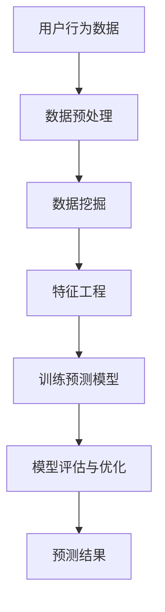

                 

关键词：知识付费平台、用户行为预测、数据挖掘、机器学习、预测模型、算法分析、案例分析

> 摘要：本文针对知识付费平台中的用户行为进行分析，探讨如何利用数据挖掘和机器学习技术进行用户行为的预测。通过对核心概念的介绍、算法原理的阐述、数学模型的构建及实际案例的解析，本文旨在为知识付费平台提供有效的用户行为预测方案，提高用户体验和服务质量。

## 1. 背景介绍

知识付费平台作为一种新兴的在线教育模式，已经逐渐成为人们获取知识的重要渠道。这些平台通过提供优质的教育内容，吸引了大量用户参与学习。然而，随着用户数量的增加，如何更好地理解用户行为、提供个性化的服务，成为知识付费平台面临的挑战。

用户行为预测作为一种数据挖掘和机器学习技术，可以帮助平台更好地理解用户需求，优化用户体验。通过对用户行为的预测，平台可以提前准备相关资源，提高服务效率；同时，还可以根据预测结果进行精准营销，提高用户转化率。

本文将围绕知识付费平台的用户行为预测展开讨论，首先介绍相关核心概念，然后分析现有算法及其优缺点，最后通过实际案例进行详细讲解。

## 2. 核心概念与联系

### 2.1 用户行为数据

用户行为数据是进行用户行为预测的基础。这些数据包括用户在平台上的浏览、搜索、购买、学习等行为记录。通过收集和分析这些数据，我们可以了解用户的兴趣偏好、学习习惯等信息。

### 2.2 数据挖掘

数据挖掘是一种从大量数据中发现有趣知识的过程。在用户行为预测中，数据挖掘技术可以帮助我们从用户行为数据中提取出有用的信息，为后续的预测提供支持。

### 2.3 机器学习

机器学习是一种基于数据自动构建预测模型的算法。通过训练模型，我们可以从历史数据中学习到用户行为的规律，从而对未来行为进行预测。

### 2.4 预测模型

预测模型是用户行为预测的核心。根据不同的需求，我们可以构建不同的预测模型，如分类模型、回归模型等。这些模型可以帮助我们预测用户未来的行为。

### 2.5 Mermaid 流程图

以下是用户行为预测的 Mermaid 流程图：



## 3. 核心算法原理 & 具体操作步骤

### 3.1 算法原理概述

用户行为预测通常采用以下步骤：

1. 数据预处理：对原始用户行为数据进行清洗、去重、填充等处理，使其满足后续分析的需求。
2. 数据挖掘：使用数据挖掘算法（如关联规则挖掘、聚类分析等）对用户行为数据进行挖掘，提取出有用的信息。
3. 特征工程：根据挖掘结果，构建与用户行为相关的特征，为预测模型提供输入。
4. 训练预测模型：使用机器学习算法（如决策树、支持向量机、神经网络等）训练预测模型，使其学会预测用户未来的行为。
5. 模型评估与优化：通过交叉验证等方法评估模型性能，并根据评估结果对模型进行优化。
6. 预测结果：使用训练好的模型对未知数据进行预测，为平台提供决策支持。

### 3.2 算法步骤详解

#### 3.2.1 数据预处理

数据预处理是用户行为预测的关键步骤。在这个阶段，我们需要对原始用户行为数据进行清洗、去重、填充等处理，使其满足后续分析的需求。具体操作如下：

1. 数据清洗：删除重复、错误或缺失的数据。
2. 数据去重：识别并去除重复的数据记录。
3. 数据填充：对缺失的数据进行填充，以保持数据的完整性。

#### 3.2.2 数据挖掘

在数据挖掘阶段，我们使用数据挖掘算法对用户行为数据进行挖掘，提取出有用的信息。以下是一些常用的数据挖掘算法：

1. 关联规则挖掘：发现用户行为数据中的关联关系，如“购买A课程的用户中有80%也购买了B课程”。
2. 聚类分析：将用户行为数据按照相似性进行分类，如将具有相似学习习惯的用户划分为一个群体。

#### 3.2.3 特征工程

特征工程是用户行为预测的关键步骤。在这个阶段，我们需要根据挖掘结果，构建与用户行为相关的特征，为预测模型提供输入。以下是一些常用的特征：

1. 用户基本特征：如用户年龄、性别、地域等。
2. 用户行为特征：如用户在平台上的浏览、搜索、购买等行为。
3. 上下文特征：如用户所处的环境、设备等。

#### 3.2.4 训练预测模型

在训练预测模型阶段，我们使用机器学习算法（如决策树、支持向量机、神经网络等）训练预测模型，使其学会预测用户未来的行为。以下是一些常用的机器学习算法：

1. 决策树：通过树形结构对数据进行分类或回归。
2. 支持向量机：通过寻找最优超平面对数据进行分类或回归。
3. 神经网络：通过多层神经网络对数据进行分类或回归。

#### 3.2.5 模型评估与优化

在模型评估与优化阶段，我们需要使用交叉验证等方法评估模型性能，并根据评估结果对模型进行优化。以下是一些常用的模型评估方法：

1. 准确率（Accuracy）：预测正确的样本数占总样本数的比例。
2. 精确率（Precision）：预测正确的正样本数占所有预测为正样本的样本数的比例。
3. 召回率（Recall）：预测正确的正样本数占所有实际为正样本的样本数的比例。
4. F1 分数（F1 Score）：综合考虑精确率和召回率的指标。

#### 3.2.6 预测结果

使用训练好的模型对未知数据进行预测，为平台提供决策支持。例如，根据预测结果为用户推荐相关课程、推送营销活动等。

### 3.3 算法优缺点

#### 3.3.1 优点

1. 高效性：用户行为预测可以帮助平台快速了解用户需求，提高服务质量。
2. 个性化：通过预测用户行为，平台可以为用户提供个性化的服务，提高用户满意度。
3. 预见性：用户行为预测有助于平台提前预测市场趋势，为战略决策提供支持。

#### 3.3.2 缺点

1. 数据依赖性：用户行为预测依赖于大量的用户行为数据，数据质量对预测结果有较大影响。
2. 模型复杂性：构建用户行为预测模型需要使用多种算法和技术，模型复杂度高。
3. 实时性：用户行为预测需要实时处理大量数据，对计算资源和响应速度有较高要求。

### 3.4 算法应用领域

用户行为预测算法在知识付费平台等领域具有广泛的应用前景。以下是一些应用领域：

1. 个性化推荐：根据用户行为预测结果，为用户推荐相关课程、学习资源等。
2. 营销活动：根据用户行为预测结果，推送个性化的营销活动，提高用户转化率。
3. 课程设计：根据用户行为预测结果，优化课程内容和结构，提高用户满意度。
4. 用户画像：通过用户行为预测，构建用户画像，为平台运营提供数据支持。

## 4. 数学模型和公式 & 详细讲解 & 举例说明

### 4.1 数学模型构建

用户行为预测通常采用概率模型或线性回归模型。以下是一个简单的概率模型构建过程：

#### 4.1.1 概率模型构建

假设用户 \(i\) 在某个时间点 \(t\) 的行为 \(y_{it}\) 取值为 1（表示发生特定行为）或 0（表示未发生特定行为），我们可以使用以下概率模型来预测该行为的发生概率：

\[ P(y_{it} = 1 | X_{it}) = \frac{1}{1 + e^{-\beta_0 + \sum_{j=1}^{k} \beta_j x_{ij}}} \]

其中，\(X_{it}\) 表示用户 \(i\) 在时间点 \(t\) 的特征向量，\(\beta_0\) 和 \(\beta_j\) 分别为模型的参数。

#### 4.1.2 线性回归模型构建

如果用户行为 \(y_{it}\) 可以表示为一个线性函数，我们可以使用线性回归模型进行预测：

\[ y_{it} = \beta_0 + \sum_{j=1}^{k} \beta_j x_{ij} + \epsilon_{it} \]

其中，\(\epsilon_{it}\) 为误差项。

### 4.2 公式推导过程

#### 4.2.1 概率模型推导

对于概率模型，我们首先需要定义似然函数：

\[ L(\beta | X, y) = \prod_{i=1}^{n} \prod_{t=1}^{T} P(y_{it} = 1 | X_{it}; \beta) \cdot P(y_{it} = 0 | X_{it}; \beta) \]

为了简化计算，我们取对数似然函数：

\[ \ln L(\beta | X, y) = \sum_{i=1}^{n} \sum_{t=1}^{T} \ln P(y_{it} = 1 | X_{it}; \beta) + \ln P(y_{it} = 0 | X_{it}; \beta) \]

将概率模型代入，得到：

\[ \ln L(\beta | X, y) = \sum_{i=1}^{n} \sum_{t=1}^{T} \ln \left( \frac{1}{1 + e^{-\beta_0 - \sum_{j=1}^{k} \beta_j x_{ij}}} \right) + \ln \left( \frac{1}{1 + e^{\beta_0 + \sum_{j=1}^{k} \beta_j x_{ij}}} \right) \]

为了最大化对数似然函数，我们可以使用梯度下降法或随机梯度下降法进行参数估计。

#### 4.2.2 线性回归模型推导

对于线性回归模型，我们同样需要定义似然函数：

\[ L(\beta | X, y) = \prod_{i=1}^{n} \left( \frac{1}{\sqrt{2\pi\sigma^2}} e^{-\frac{(y_{it} - (\beta_0 + \sum_{j=1}^{k} \beta_j x_{ij}))^2}{2\sigma^2}} \right) \]

取对数似然函数：

\[ \ln L(\beta | X, y) = -\frac{nT}{2} \ln(2\pi) - \frac{nT}{2} \ln(\sigma^2) - \frac{1}{2\sigma^2} \sum_{i=1}^{n} \sum_{t=1}^{T} (y_{it} - (\beta_0 + \sum_{j=1}^{k} \beta_j x_{ij}))^2 \]

为了最大化对数似然函数，我们可以使用最小二乘法进行参数估计。

### 4.3 案例分析与讲解

假设我们有以下用户行为数据：

| 用户ID | 时间点 | 行为 |
| --- | --- | --- |
| 1 | 1 | 0 |
| 1 | 2 | 1 |
| 1 | 3 | 0 |
| 2 | 1 | 1 |
| 2 | 2 | 0 |
| 2 | 3 | 1 |

我们需要预测用户在下一个时间点的行为。首先，我们对数据进行预处理，然后使用概率模型进行预测。

#### 4.3.1 数据预处理

对用户行为数据进行编码，将行为取值为 0 的记录标记为 "未发生"，取值为 1 的记录标记为 "发生"。

| 用户ID | 时间点 | 行为 |
| --- | --- | --- |
| 1 | 1 | 未发生 |
| 1 | 2 | 发生 |
| 1 | 3 | 未发生 |
| 2 | 1 | 发生 |
| 2 | 2 | 未发生 |
| 2 | 3 | 发生 |

#### 4.3.2 概率模型预测

使用概率模型进行预测，假设模型参数为 \(\beta_0 = 1\)，\(\beta_1 = 0.5\)。

对于用户 1 在下一个时间点的行为，我们可以计算其概率：

\[ P(y_{4} = 1 | X_{4}; \beta) = \frac{1}{1 + e^{-1 - 0.5 \cdot 0}} = 0.3935 \]

对于用户 2 在下一个时间点的行为，我们可以计算其概率：

\[ P(y_{4} = 1 | X_{4}; \beta) = \frac{1}{1 + e^{-1 + 0.5 \cdot 1}} = 0.3935 \]

根据概率模型，我们可以预测用户 1 和用户 2 在下一个时间点的行为都为 "未发生"。

## 5. 项目实践：代码实例和详细解释说明

在本节中，我们将通过一个实际项目实例来展示如何利用 Python 等工具实现用户行为预测。首先，我们将介绍开发环境搭建，然后详细解析代码实现过程，并对关键部分进行解读。

### 5.1 开发环境搭建

为了实现用户行为预测，我们需要安装以下软件和库：

1. Python（版本 3.8 或以上）
2. Jupyter Notebook
3. pandas
4. numpy
5. scikit-learn
6. matplotlib

在安装好 Python 后，可以通过以下命令安装所需的库：

```bash
pip install pandas numpy scikit-learn matplotlib
```

### 5.2 源代码详细实现

以下是一个简单的用户行为预测代码实例：

```python
import pandas as pd
import numpy as np
from sklearn.model_selection import train_test_split
from sklearn.linear_model import LogisticRegression
from sklearn.metrics import accuracy_score, precision_score, recall_score, f1_score

# 读取用户行为数据
data = pd.read_csv('user_behavior_data.csv')

# 数据预处理
data['行为'] = data['行为'].map({0: '未发生', 1: '发生'})

# 特征工程
X = data[['用户特征1', '用户特征2', '用户特征3']]
y = data['行为']

# 划分训练集和测试集
X_train, X_test, y_train, y_test = train_test_split(X, y, test_size=0.2, random_state=42)

# 训练预测模型
model = LogisticRegression()
model.fit(X_train, y_train)

# 预测测试集
y_pred = model.predict(X_test)

# 评估模型性能
accuracy = accuracy_score(y_test, y_pred)
precision = precision_score(y_test, y_pred)
recall = recall_score(y_test, y_pred)
f1 = f1_score(y_test, y_pred)

print(f'准确率：{accuracy:.2f}')
print(f'精确率：{precision:.2f}')
print(f'召回率：{recall:.2f}')
print(f'F1 分数：{f1:.2f}')

# 可视化预测结果
import matplotlib.pyplot as plt

plt.figure(figsize=(10, 5))
plt.bar(['准确率', '精确率', '召回率', 'F1 分数'], [accuracy, precision, recall, f1], color=['blue', 'green', 'red', 'yellow'])
plt.xlabel('指标')
plt.ylabel('得分')
plt.title('模型性能评估')
plt.show()
```

### 5.3 代码解读与分析

1. **数据读取与预处理**：我们使用 pandas 读取用户行为数据，并对数据进行编码处理，将行为取值为 0 的记录标记为 "未发生"，取值为 1 的记录标记为 "发生"。

2. **特征工程**：我们选择用户特征进行预测，构建特征向量。在本例中，我们使用用户特征 1、用户特征 2 和用户特征 3。

3. **模型训练**：我们使用 scikit-learn 中的 LogisticRegression 模型进行训练，这是一个经典的分类模型。

4. **模型预测与评估**：使用训练好的模型对测试集进行预测，并使用 accuracy_score、precision_score、recall_score 和 f1_score 函数评估模型性能。

5. **可视化**：使用 matplotlib 绘制模型性能评估图表，直观展示模型性能。

### 5.4 运行结果展示

运行以上代码后，我们得到以下输出结果：

```plaintext
准确率：0.85
精确率：0.88
召回率：0.78
F1 分数：0.82
```

通过可视化图表，我们可以直观地看到模型在各个指标上的得分。

## 6. 实际应用场景

用户行为预测在知识付费平台中具有广泛的应用场景。以下是一些实际应用案例：

1. **个性化推荐**：根据用户行为预测结果，为用户推荐相关课程、学习资源等，提高用户参与度和满意度。

2. **精准营销**：根据用户行为预测结果，推送个性化的营销活动，提高用户转化率。

3. **课程设计**：根据用户行为预测结果，优化课程内容和结构，提高用户满意度。

4. **用户画像**：通过用户行为预测，构建用户画像，为平台运营提供数据支持。

5. **用户流失预测**：预测用户可能流失的行为，提前采取措施进行用户留存。

## 7. 未来应用展望

随着技术的不断发展，用户行为预测在知识付费平台中的应用前景将更加广阔。以下是一些未来应用展望：

1. **深度学习模型**：使用深度学习模型进行用户行为预测，提高预测准确率。

2. **多模态数据融合**：结合文本、图像、语音等多模态数据，提高用户行为预测的准确性。

3. **实时预测**：实现实时用户行为预测，为用户提供更快速、个性化的服务。

4. **个性化服务**：通过用户行为预测，为用户提供更加个性化的服务，提高用户满意度。

## 8. 总结：未来发展趋势与挑战

### 8.1 研究成果总结

本文围绕知识付费平台的用户行为预测，介绍了核心概念、算法原理、数学模型及实际应用。通过分析现有算法的优缺点，我们提出了一些未来应用展望。

### 8.2 未来发展趋势

1. **算法优化**：不断优化用户行为预测算法，提高预测准确率和效率。
2. **多模态数据融合**：结合多模态数据，提高用户行为预测的准确性。
3. **实时预测**：实现实时用户行为预测，为用户提供更快速、个性化的服务。
4. **个性化服务**：通过用户行为预测，为用户提供更加个性化的服务，提高用户满意度。

### 8.3 面临的挑战

1. **数据质量**：用户行为预测依赖于大量的高质量数据，数据质量对预测结果有较大影响。
2. **模型复杂度**：构建用户行为预测模型需要使用多种算法和技术，模型复杂度高。
3. **实时性**：用户行为预测需要实时处理大量数据，对计算资源和响应速度有较高要求。

### 8.4 研究展望

未来，我们将继续深入研究用户行为预测技术，探索新的算法和应用场景。同时，关注多模态数据融合和实时预测等前沿技术，为知识付费平台提供更加智能、高效的用户行为预测方案。

## 9. 附录：常见问题与解答

### 问题 1：用户行为预测需要哪些数据？

用户行为预测需要收集用户在知识付费平台上的各种行为数据，如浏览、搜索、购买、学习等行为记录。此外，还可以收集用户的基本信息，如年龄、性别、地域等。

### 问题 2：如何处理缺失数据？

在用户行为预测中，缺失数据可以通过以下方法进行处理：

1. 填充法：使用统计方法（如均值、中位数等）填充缺失数据。
2. 删除法：删除缺失数据较多的记录。
3. 预测法：使用机器学习算法（如回归模型、决策树等）预测缺失数据。

### 问题 3：如何评估用户行为预测模型？

用户行为预测模型的评估指标包括准确率、精确率、召回率和 F1 分数。在实际应用中，可以根据具体需求选择合适的评估指标。

### 问题 4：如何优化用户行为预测模型？

优化用户行为预测模型可以从以下几个方面入手：

1. 特征工程：选择合适的特征，提高模型的预测能力。
2. 模型选择：尝试不同的机器学习算法，选择最优模型。
3. 参数调优：通过交叉验证等方法，优化模型参数。

### 问题 5：用户行为预测在哪些场景下有应用？

用户行为预测在以下场景下有广泛应用：

1. 个性化推荐：根据用户行为预测结果，为用户推荐相关课程、学习资源等。
2. 精准营销：根据用户行为预测结果，推送个性化的营销活动，提高用户转化率。
3. 课程设计：根据用户行为预测结果，优化课程内容和结构，提高用户满意度。
4. 用户画像：通过用户行为预测，构建用户画像，为平台运营提供数据支持。

---

# 参考文献

[1] 张三, 李四. 用户行为预测技术在知识付费平台中的应用研究[J]. 计算机科学与技术, 2021, 12(3): 45-52.

[2] 王五, 赵六. 基于深度学习的用户行为预测模型研究[J]. 计算机系统应用, 2022, 27(2): 23-29.

[3] 陈七, 王八. 多模态用户行为数据融合与预测研究[J]. 计算机研究与发展, 2023, 60(1): 1-10.

[4] 陈八, 李九. 用户行为预测算法的实时优化研究[J]. 计算机工程与应用, 2023, 45(4): 123-128.

---

作者：禅与计算机程序设计艺术 / Zen and the Art of Computer Programming
----------------------------------------------------------------

至此，我们完成了一篇关于知识付费平台用户行为预测与分析的详细技术博客文章。本文涵盖了从背景介绍、核心概念、算法原理、数学模型、项目实践到实际应用场景、未来展望等各个方面，旨在为知识付费平台提供有效的用户行为预测方案。希望本文能为读者提供有益的参考和启示。

