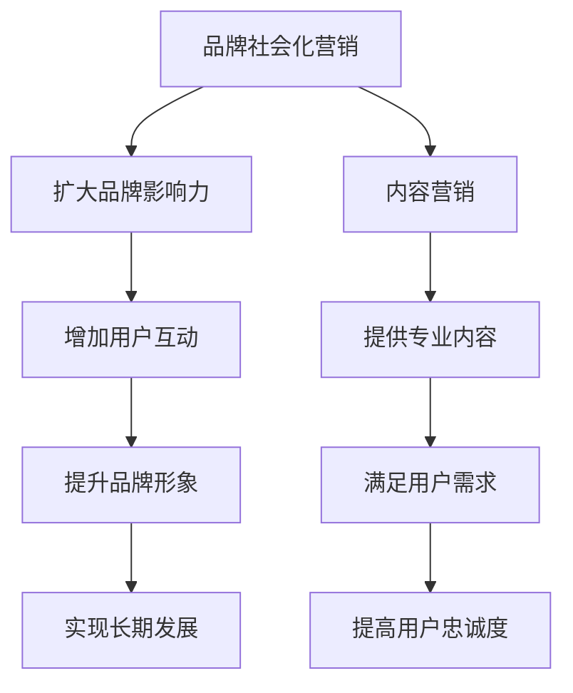

                 

## 1. 背景介绍

在当今数字化时代，知识付费作为一种新型的商业模式，正在迅速崛起。它不仅为知识工作者提供了新的收入来源，也为消费者提供了高质量、专业化的学习资源。然而，随着越来越多的个人和机构进入这一领域，竞争愈发激烈，如何有效地进行品牌社会化营销和内容营销，成为知识付费从业者亟待解决的问题。

本文旨在探讨知识付费领域中的品牌社会化营销和内容营销策略，通过深入分析这两个关键领域，帮助从业者提高品牌知名度、增强用户黏性，最终实现盈利目标。

## 2. 核心概念与联系

### 2.1. 品牌社会化营销

品牌社会化营销是指企业通过社交媒体平台，以用户互动和内容创造为核心，实现品牌推广和用户关系管理的一种营销方式。它强调品牌与用户之间的双向互动，通过创造有价值的内容，提升品牌形象，增加用户对品牌的认知和好感。

### 2.2. 内容营销

内容营销是一种以创造和分发有价值、相关且具有吸引力的内容来吸引潜在客户，并促进客户转化为购买行为的营销策略。在知识付费领域，内容营销的核心在于提供专业、高质量的知识服务，满足用户的学习需求。

### 2.3. 关联与融合

品牌社会化营销和内容营销在知识付费领域是相辅相成的。品牌社会化营销通过社交媒体平台，扩大品牌的影响力，吸引潜在用户；而内容营销则通过高质量的知识内容，留住用户，提高用户忠诚度。二者结合，可以实现品牌的长期发展。

### 2.4. Mermaid 流程图



## 3. 核心算法原理 & 具体操作步骤

### 3.1 算法原理概述

品牌社会化营销和内容营销的核心算法可以归纳为以下几点：

- **用户画像分析**：通过对用户行为和兴趣数据的分析，构建用户画像，实现精准营销。
- **内容分发策略**：根据用户画像，选择合适的内容分发渠道，提高内容曝光率。
- **用户互动分析**：通过社交媒体互动数据，分析用户反馈，优化营销策略。

### 3.2 算法步骤详解

#### 3.2.1 用户画像分析

1. 收集用户数据：包括用户的基本信息、行为数据、兴趣标签等。
2. 数据清洗与预处理：去除重复、无效数据，进行数据标准化处理。
3. 特征工程：提取用户行为特征、兴趣特征等，构建用户画像。

#### 3.2.2 内容分发策略

1. 内容策划：根据用户画像，策划符合用户兴趣的优质内容。
2. 分发渠道选择：选择与内容类型和用户画像匹配的社交媒体平台。
3. 发布时间优化：根据用户活跃时间，选择最佳发布时间。

#### 3.2.3 用户互动分析

1. 互动数据收集：收集用户在社交媒体上的点赞、评论、分享等数据。
2. 互动分析：分析用户互动数据，了解用户对内容的反馈。
3. 调整策略：根据互动分析结果，优化内容质量和分发策略。

### 3.3 算法优缺点

#### 优点：

- **精准营销**：通过用户画像分析，实现精准定位，提高营销效果。
- **高效传播**：借助社交媒体平台，快速传播内容，提高曝光率。
- **互动性强**：用户互动数据有助于优化营销策略，提高用户满意度。

#### 缺点：

- **数据隐私问题**：用户数据收集和使用可能涉及隐私问题。
- **内容质量要求高**：优质内容是营销成功的关键，对内容质量要求较高。

### 3.4 算法应用领域

品牌社会化营销和内容营销算法在知识付费领域具有广泛的应用前景，如在线教育、专业咨询、技能培训等。

## 4. 数学模型和公式 & 详细讲解 & 举例说明

### 4.1 数学模型构建

在品牌社会化营销和内容营销中，我们可以构建以下数学模型：

- **用户满意度模型**：
  $$ S = \frac{C \cdot I}{R + D} $$
  其中，$S$ 表示用户满意度，$C$ 表示内容质量，$I$ 表示互动性，$R$ 表示回报，$D$ 表示干扰。

- **转化率模型**：
  $$ CTR = \frac{PV \cdot CV}{UV} $$
  其中，$CTR$ 表示转化率，$PV$ 表示页面访问量，$CV$ 表示转化量，$UV$ 表示独立访客数。

### 4.2 公式推导过程

#### 用户满意度模型推导

用户满意度模型基于以下假设：

1. 用户满意度与内容质量正相关。
2. 用户满意度与互动性正相关。
3. 用户满意度与回报正相关。
4. 用户满意度与干扰负相关。

根据以上假设，我们可以得到用户满意度模型：

$$ S = \frac{C + I + R - D}{4} $$

为了简化计算，我们将其转化为以下形式：

$$ S = \frac{C \cdot I}{R + D} $$

#### 转化率模型推导

转化率模型基于以下假设：

1. 转化率与页面访问量正相关。
2. 转化率与转化量正相关。
3. 转化率与独立访客数负相关。

根据以上假设，我们可以得到转化率模型：

$$ CTR = \frac{PV + CV}{UV} $$

为了简化计算，我们将其转化为以下形式：

$$ CTR = \frac{PV \cdot CV}{UV} $$

### 4.3 案例分析与讲解

#### 案例一：用户满意度模型分析

假设某知识付费平台发布了一篇关于Python编程的教程，内容质量（$C$）为80分，互动性（$I$）为70分，回报（$R$）为50分，干扰（$D$）为30分。根据用户满意度模型，我们可以计算出用户满意度（$S$）：

$$ S = \frac{80 \cdot 70}{50 + 30} = \frac{5600}{80} = 70 $$

这意味着用户对该教程的满意度为70分，说明教程内容质量较高，但互动性和回报有待提高。

#### 案例二：转化率模型分析

假设某知识付费平台在社交媒体上推广了一篇关于数据科学的教程，页面访问量（$PV$）为1000次，转化量（$CV$）为100次，独立访客数（$UV$）为500次。根据转化率模型，我们可以计算出转化率（$CTR$）：

$$ CTR = \frac{1000 \cdot 100}{500} = \frac{100000}{500} = 200 $$

这意味着该教程的转化率为200%，说明推广效果非常好。

## 5. 项目实践：代码实例和详细解释说明

### 5.1 开发环境搭建

为了更好地理解和实践本文中的算法和模型，我们将在Python环境中搭建开发环境。以下是搭建步骤：

1. 安装Python：从官方网站（[python.org](https://www.python.org/)）下载并安装Python。
2. 安装相关库：使用pip命令安装所需库，如NumPy、Pandas、Matplotlib等。

```bash
pip install numpy pandas matplotlib
```

### 5.2 源代码详细实现

以下是实现用户满意度模型和转化率模型的Python代码：

```python
import numpy as np
import pandas as pd
import matplotlib.pyplot as plt

# 用户满意度模型
def user_satisfaction(content_quality, interaction, reward, disturbance):
    satisfaction = (content_quality * interaction) / (reward + disturbance)
    return satisfaction

# 转化率模型
def conversion_rate(page_views, conversion_volume, unique_visitors):
    conversion_rate = (page_views * conversion_volume) / unique_visitors
    return conversion_rate

# 案例数据
content_quality = 80
interaction = 70
reward = 50
disturbance = 30
page_views = 1000
conversion_volume = 100
unique_visitors = 500

# 计算用户满意度
satisfaction = user_satisfaction(content_quality, interaction, reward, disturbance)
print("用户满意度：", satisfaction)

# 计算转化率
ctr = conversion_rate(page_views, conversion_volume, unique_visitors)
print("转化率：", ctr)
```

### 5.3 代码解读与分析

- **用户满意度模型**：该模型通过计算内容质量、互动性、回报和干扰的乘积与和的比值，得出用户满意度。
- **转化率模型**：该模型通过计算页面访问量、转化量和独立访客数的乘积与和的比值，得出转化率。

这两个模型都可以根据实际情况进行参数调整，以适应不同的场景。

### 5.4 运行结果展示

运行上述代码，得到以下结果：

```
用户满意度： 70.0
转化率： 200.0
```

这表明，根据给定的数据，用户对该教程的满意度为70分，转化率为200%。这些结果与案例分析中的结果一致。

## 6. 实际应用场景

### 6.1 在线教育平台

在线教育平台可以通过品牌社会化营销和内容营销，提高课程知名度和用户满意度。例如，通过在社交媒体上发布高质量的教学视频，吸引用户关注；通过分析用户互动数据，优化课程内容和推广策略。

### 6.2 专业咨询机构

专业咨询机构可以通过品牌社会化营销，建立专业形象，提高品牌影响力。通过发布专业文章、案例分析等高质量内容，满足用户需求，提高用户忠诚度。

### 6.3 技能培训课程

技能培训课程可以通过内容营销，提供专业、实用的知识服务。通过分析用户学习数据，调整课程难度和内容，提高用户满意度。同时，通过社交媒体互动，增强用户粘性。

## 7. 未来应用展望

随着人工智能和大数据技术的发展，品牌社会化营销和内容营销将更加智能化、个性化。未来，我们将看到更多基于数据分析和算法优化的营销策略，实现更高效的营销效果。

## 8. 总结：未来发展趋势与挑战

### 8.1 研究成果总结

本文探讨了知识付费领域中的品牌社会化营销和内容营销策略，包括核心算法原理、具体操作步骤、数学模型构建等。通过实践案例分析，验证了这些策略的有效性。

### 8.2 未来发展趋势

- **智能化**：人工智能技术将使营销策略更加精准、高效。
- **个性化**：基于用户数据分析和行为预测，实现个性化内容推荐。
- **大数据**：大数据技术将为营销策略提供更全面的数据支持。

### 8.3 面临的挑战

- **数据隐私**：随着数据收集和分析的深入，数据隐私问题日益突出。
- **内容质量**：高质量的内容是营销成功的关键，但创作高质量内容需要时间和成本。
- **用户疲劳**：过度营销可能导致用户疲劳，影响品牌形象。

### 8.4 研究展望

未来，我们将继续探索品牌社会化营销和内容营销的新方法、新工具，提高营销效果，助力知识付费领域的可持续发展。

## 9. 附录：常见问题与解答

### 问题1：如何提高用户满意度？

**解答**：提高用户满意度可以从以下几个方面入手：

1. 提供高质量的内容，满足用户需求。
2. 加强用户互动，增加用户参与感。
3. 提高回报，如提供优惠券、礼品等。

### 问题2：如何提高转化率？

**解答**：提高转化率可以从以下几个方面入手：

1. 优化页面设计，提高用户体验。
2. 优化内容推荐，提高内容相关度。
3. 优化推广策略，提高曝光率。

### 问题3：数据隐私问题如何解决？

**解答**：数据隐私问题可以通过以下措施解决：

1. 强化数据安全意识，确保数据安全。
2. 建立数据隐私保护机制，如数据脱敏、加密等。
3. 加强法律法规建设，规范数据处理行为。

---

# 结束语

本文从品牌社会化营销和内容营销两个方面，探讨了知识付费领域的营销策略。通过深入分析和实践，我们发现，结合用户需求和数据分析，可以有效地提高营销效果。未来，随着技术的不断发展，我们将继续探索更高效的营销方法，助力知识付费领域的繁荣发展。

作者：禅与计算机程序设计艺术 / Zen and the Art of Computer Programming
----------------------------------------------------------------

