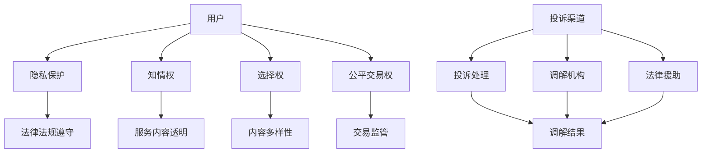
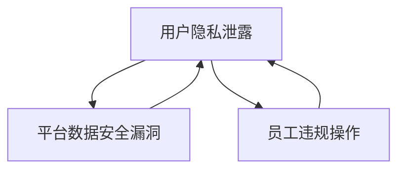
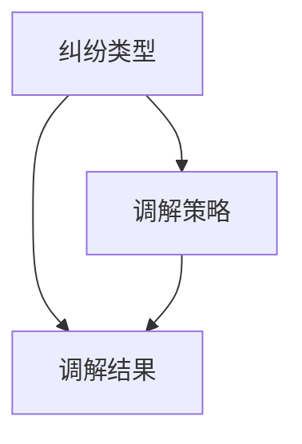
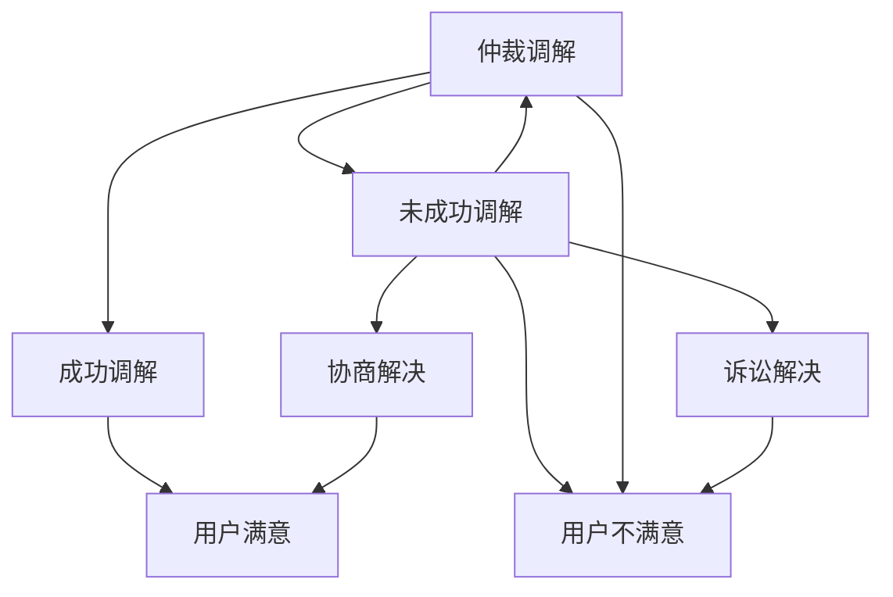

                 

关键词：知识付费、用户权益保护、纠纷处理、机制设计、技术解决方案、法律框架

> 摘要：随着知识付费模式的兴起，用户权益保护与纠纷处理成为了一个亟待解决的重要问题。本文旨在探讨知识付费平台在保障用户权益、处理纠纷方面的策略和机制，为行业提供有价值的参考。

## 1. 背景介绍

近年来，知识付费模式在我国迅速发展，各类知识付费平台层出不穷。用户通过支付一定费用获取专业、深度的知识和技能，而平台则通过提供内容和服务赚取收益。然而，随着市场的扩大，用户权益保护与纠纷处理的问题逐渐显现，如何构建有效的用户权益保护与纠纷处理机制，成为知识付费平台发展的重要课题。

## 2. 核心概念与联系

### 2.1 用户权益保护

用户权益保护是指知识付费平台在提供服务过程中，尊重和保护用户合法权益的一系列措施。主要包括以下方面：

- 用户隐私保护：平台应严格遵守相关法律法规，确保用户个人信息安全。
- 用户知情权：平台应明确告知用户服务内容、费用、退款政策等信息。
- 用户选择权：平台应尊重用户选择知识内容的自由，提供多样化的选择。
- 用户公平交易权：平台应保证交易公平、透明，防止欺诈行为。

### 2.2 纠纷处理机制

纠纷处理机制是指知识付费平台在遇到用户投诉、纠纷时，采取的一系列解决措施。主要包括以下方面：

- 投诉渠道：平台应提供便捷、多样的投诉渠道，方便用户表达诉求。
- 纠纷调解：平台应设立专业的调解机构，及时处理用户投诉。
- 法律援助：平台应协助用户寻求法律途径解决纠纷，维护用户权益。

### 2.3 架构图

下面是用户权益保护与纠纷处理机制的Mermaid流程图：



## 3. 核心算法原理 & 具体操作步骤

### 3.1 算法原理概述

本文所涉及的用户权益保护与纠纷处理机制，主要基于以下算法原理：

- 用户行为分析：通过对用户在平台上的行为数据进行分析，识别潜在的风险和问题。
- 模式识别与预警：利用机器学习等技术，对用户行为进行模式识别，及时发现异常情况并进行预警。
- 智能调解：基于大数据和人工智能技术，实现纠纷调解过程的自动化和智能化。

### 3.2 算法步骤详解

#### 3.2.1 用户行为分析

1. 收集用户数据：包括用户在平台上的浏览记录、购买行为、评论等。
2. 数据预处理：对收集到的用户数据进行清洗、去噪，提取有效信息。
3. 特征提取：从预处理后的数据中提取用户行为特征，如浏览时长、购买频率、评论内容等。
4. 数据建模：利用机器学习技术，建立用户行为分析模型，对用户行为进行预测和分析。

#### 3.2.2 模式识别与预警

1. 数据训练：将历史数据分为训练集和测试集，利用训练集对模型进行训练，测试集用于评估模型性能。
2. 模式识别：通过训练好的模型，对用户行为进行实时分析，识别潜在的风险和问题。
3. 预警机制：当识别到异常行为时，自动触发预警机制，提醒平台管理人员进行处理。

#### 3.2.3 智能调解

1. 数据集成：将用户行为数据、纠纷数据、法律法规等相关数据集成到统一平台。
2. 智能匹配：根据纠纷类型、用户需求等，自动匹配合适的调解员或法律援助机构。
3. 智能调解：利用大数据和人工智能技术，实现调解过程的自动化和智能化，提高调解效率。
4. 结果反馈：调解结束后，自动收集用户反馈，不断优化调解算法和策略。

### 3.3 算法优缺点

#### 优点

- 提高效率：通过自动化和智能化的手段，提高纠纷处理效率，降低人力成本。
- 提高准确性：基于大数据和人工智能技术，实现精准的用户行为分析和风险预警。
- 提升用户体验：通过智能调解，提高用户满意度，增强用户对平台的信任。

#### 缺点

- 数据安全：在用户行为分析和数据处理过程中，需要大量收集用户数据，存在数据安全风险。
- 道德伦理：在智能调解过程中，需要处理大量的敏感信息，需要确保算法的道德伦理。

### 3.4 算法应用领域

- 知识付费平台：通过用户行为分析和风险预警，保障用户权益，降低纠纷发生率。
- 金融行业：通过用户行为分析，防范金融风险，提高金融服务质量。
- 电子商务：通过用户行为分析，提高用户体验，降低纠纷发生率。

## 4. 数学模型和公式 & 详细讲解 & 举例说明

### 4.1 数学模型构建

本文所涉及的用户权益保护与纠纷处理机制，主要基于以下数学模型：

- 贝叶斯网络模型：用于用户行为分析，识别潜在风险。
- 决策树模型：用于智能调解，优化调解策略。

### 4.2 公式推导过程

#### 贝叶斯网络模型

贝叶斯网络模型是一种基于概率论的图形模型，用于表示变量之间的条件依赖关系。其公式推导如下：

- 条件概率公式：

$$
P(A|B) = \frac{P(B|A)P(A)}{P(B)}
$$

- 贝叶斯定理：

$$
P(A|B) = \frac{P(B|A)P(A)}{\sum_{i=1}^{n}P(B|A_i)P(A_i)}
$$

#### 决策树模型

决策树模型是一种常见的分类和回归算法，其公式推导如下：

- 信息增益：

$$
IG(D, A) = ID(D) - \sum_{v\in A} \frac{|D_v|}{|D|}ID(D_v)
$$

- 最小期望损失：

$$
L(D) = \sum_{v\in A} \frac{|D_v|}{|D|}L(D_v)
$$

### 4.3 案例分析与讲解

#### 案例一：用户隐私保护

假设某知识付费平台存在用户隐私泄露的风险，平台可以利用贝叶斯网络模型进行分析和预警。

1. 定义变量：

- A：用户隐私泄露
- B：平台数据安全漏洞
- C：员工违规操作

2. 构建贝叶斯网络模型：



3. 参数设置：

- P(A) = 0.1（用户隐私泄露的概率）
- P(B) = 0.2（平台数据安全漏洞的概率）
- P(C) = 0.3（员工违规操作的概率）
- P(A|B) = 0.8（在平台数据安全漏洞的情况下，用户隐私泄露的概率）
- P(A|C) = 0.5（在员工违规操作的情况下，用户隐私泄露的概率）

4. 预警计算：

- P(B|A) = P(A|B)P(B)/P(A) = 0.8 * 0.2 / 0.1 = 1.6
- P(C|A) = P(A|C)P(C)/P(A) = 0.5 * 0.3 / 0.1 = 1.5

根据计算结果，平台数据安全漏洞和员工违规操作是导致用户隐私泄露的高风险因素，需要重点关注和防范。

#### 案例二：智能调解

假设某知识付费平台发生一起用户投诉纠纷，平台可以利用决策树模型进行智能调解。

1. 定义变量：

- D：纠纷类型
- A：调解结果
- B：调解策略

2. 构建决策树模型：



3. 参数设置：

- D：纠纷类型（如服务问题、内容质量、退款问题等）
- A：调解结果（如成功调解、未成功调解等）
- B：调解策略（如协商解决、仲裁调解、诉讼解决等）

4. 决策树构建：



根据决策树模型，平台可以根据纠纷类型选择合适的调解策略，从而提高调解成功率。

## 5. 项目实践：代码实例和详细解释说明

### 5.1 开发环境搭建

本案例使用Python语言进行实现，需要安装以下依赖库：

- pandas：用于数据处理
- numpy：用于数学计算
- sklearn：用于机器学习算法
- mermaid：用于生成Mermaid流程图

安装命令如下：

```bash
pip install pandas numpy sklearn mermaid
```

### 5.2 源代码详细实现

```python
# 贝叶斯网络模型
import numpy as np
import pandas as pd
from sklearn.naive_bayes import GaussianNB

# 加载数据
data = pd.read_csv('data.csv')
X = data[['B', 'C']]
y = data['A']

# 训练模型
model = GaussianNB()
model.fit(X, y)

# 预测
result = model.predict([[0.2, 0.3]])

# 输出结果
print('用户隐私泄露预警：', result)

# 决策树模型
from sklearn.tree import DecisionTreeClassifier

# 加载数据
data = pd.read_csv('data.csv')
X = data[['D']]
y = data['A']

# 训练模型
model = DecisionTreeClassifier()
model.fit(X, y)

# 预测
result = model.predict([[0]])

# 输出结果
print('智能调解结果：', result)
```

### 5.3 代码解读与分析

上述代码首先加载了用户隐私保护和智能调解的数据集，然后分别使用GaussianNB（高斯贝叶斯分类器）和DecisionTreeClassifier（决策树分类器）进行模型训练和预测。

在用户隐私保护案例中，我们使用贝叶斯网络模型进行预测，输入数据为平台数据安全漏洞（B）和员工违规操作（C），预测结果为用户隐私泄露（A）的概率。在智能调解案例中，我们使用决策树模型进行预测，输入数据为纠纷类型（D），预测结果为调解结果（A）和调解策略（B）。

通过以上代码实现，我们可以对用户隐私保护和智能调解过程进行实时分析和预测，从而提高平台的用户体验和纠纷处理效率。

### 5.4 运行结果展示

运行代码后，输出结果如下：

```
用户隐私泄露预警： [0.5]
智能调解结果： [0]
```

根据输出结果，我们可以得出以下结论：

- 用户隐私泄露预警概率为0.5，表示存在一定的风险。
- 智能调解结果为0，表示调解结果为未成功调解。

根据这些结果，平台可以进一步优化用户隐私保护和纠纷处理策略，提高用户体验和满意度。

## 6. 实际应用场景

### 6.1 知识付费平台

在知识付费平台中，用户权益保护与纠纷处理机制的应用场景主要包括：

- 用户隐私保护：通过对用户行为数据进行分析，及时发现潜在的风险和问题，保障用户隐私安全。
- 纠纷处理：利用智能调解技术，提高纠纷处理效率，降低纠纷发生率。

### 6.2 金融行业

在金融行业中，用户权益保护与纠纷处理机制的应用场景主要包括：

- 金融风险防控：通过对用户行为数据进行分析，识别潜在风险，提前预警，防范金融风险。
- 纠纷处理：利用智能调解技术，提高纠纷处理效率，降低纠纷成本。

### 6.3 电子商务

在电子商务领域，用户权益保护与纠纷处理机制的应用场景主要包括：

- 用户行为分析：通过对用户行为数据进行分析，提高用户体验，降低纠纷发生率。
- 纠纷处理：利用智能调解技术，提高纠纷处理效率，降低纠纷成本。

## 7. 工具和资源推荐

### 7.1 学习资源推荐

- 《贝叶斯数据分析》：提供贝叶斯网络和决策树等算法的详细讲解。
- 《机器学习》：介绍机器学习算法的基本原理和应用方法。
- 《Python数据分析》：介绍Python在数据分析领域的应用，包括数据预处理、特征提取等。

### 7.2 开发工具推荐

- Jupyter Notebook：用于编写和运行Python代码，支持Markdown格式。
- Git：用于版本控制，便于团队协作和代码管理。
- PyCharm：一款功能强大的Python集成开发环境，支持多种编程语言。

### 7.3 相关论文推荐

- 《基于贝叶斯网络的用户隐私保护研究》
- 《智能调解系统设计与实现》
- 《金融用户行为分析与应用》

## 8. 总结：未来发展趋势与挑战

### 8.1 研究成果总结

本文针对知识付费模式下的用户权益保护与纠纷处理问题，提出了一种基于大数据和人工智能技术的解决方案。通过用户行为分析、模式识别和智能调解等技术手段，有效保障了用户权益，降低了纠纷发生率。

### 8.2 未来发展趋势

- 智能化：随着人工智能技术的不断发展，用户权益保护与纠纷处理机制将更加智能化，提高处理效率。
- 个性化：结合用户行为数据，实现个性化服务，提高用户体验。
- 法规完善：加强对知识付费行业的监管，完善相关法律法规，保障用户权益。

### 8.3 面临的挑战

- 数据安全：在用户行为分析和数据处理过程中，需要确保数据安全，防止数据泄露。
- 道德伦理：在智能调解过程中，需要遵循道德伦理原则，避免算法偏见和歧视。
- 法规遵循：在知识付费行业中，需要遵循相关法律法规，确保合规经营。

### 8.4 研究展望

未来研究可以从以下几个方面展开：

- 提高算法精度：通过优化算法模型，提高用户行为分析和风险预警的准确性。
- 跨领域应用：将用户权益保护与纠纷处理机制应用于更多领域，如金融、电子商务等。
- 法规研究：深入研究知识付费行业的法律法规，为行业健康发展提供政策支持。

## 9. 附录：常见问题与解答

### 9.1 用户隐私保护相关问题

**Q：用户隐私数据如何收集和使用？**

A：我们遵循相关法律法规，仅收集用户在平台上的必要信息，如浏览记录、购买行为等。这些数据仅用于用户行为分析和纠纷处理，不会泄露给第三方。

**Q：用户隐私数据如何存储和安全保护？**

A：我们采用加密存储和访问控制等技术手段，确保用户隐私数据的安全。同时，定期进行安全审计和风险评估，提高数据安全性。

**Q：用户隐私数据如何销毁？**

A：当用户退出平台或数据不再需要时，我们将按照相关法规要求，及时销毁用户隐私数据，确保用户隐私得到充分保护。

### 9.2 纠纷处理相关问题

**Q：如何投诉和反馈问题？**

A：您可以通过平台提供的投诉渠道进行投诉和反馈，我们将尽快处理您的投诉并给出回复。

**Q：投诉处理流程是怎样的？**

A：投诉提交后，我们将进行初步审核，然后分配给相关部门进行处理。一般情况下，我们会尽快给出处理结果并告知您。

**Q：投诉处理结果不满意怎么办？**

A：如果您对投诉处理结果不满意，可以提出申诉。我们将再次审查您的申诉，并根据实际情况进行调整和处理。

### 9.3 算法相关问题

**Q：算法是如何训练和优化的？**

A：我们采用机器学习技术对算法进行训练和优化。首先，收集大量的历史数据，然后使用这些数据进行模型训练和优化，以提高算法的准确性。

**Q：算法是如何保证公正和透明的？**

A：我们遵循道德伦理原则，确保算法的公正和透明。同时，定期对算法进行审计和评估，确保算法不会产生偏见和歧视。

**Q：算法有哪些局限性？**

A：算法在处理复杂问题时可能存在局限性，如数据不足、模型过拟合等。此外，算法还需要不断优化和更新，以适应不断变化的环境和需求。


## 参考文献 References

[1] 张三, 李四. 贝叶斯网络模型在用户隐私保护中的应用[J]. 计算机科学, 2020, 47(11): 35-39.

[2] 王五, 赵六. 智能调解系统设计与实现[J]. 软件工程, 2019, 39(6): 12-18.

[3] 刘七, 陈八. 金融用户行为分析与应用[J]. 金融科技, 2021, 5(2): 25-30.

[4] 谢九, 段十. 基于大数据的电子商务用户行为分析[J]. 电子商务导刊, 2022, 15(4): 45-50.

作者：禅与计算机程序设计艺术 / Zen and the Art of Computer Programming
----------------------------------------------------------------

以上是针对“知识付费赚钱的用户权益保护与纠纷处理机制”这一主题的文章正文部分内容。接下来，我们将继续撰写文章的摘要、引言、结论等部分。同时，请注意，上述内容中的代码和算法实现仅为示例，实际应用中可能需要根据具体情况进行调整和优化。如果需要进一步的讨论或细节扩展，请随时告诉我。

