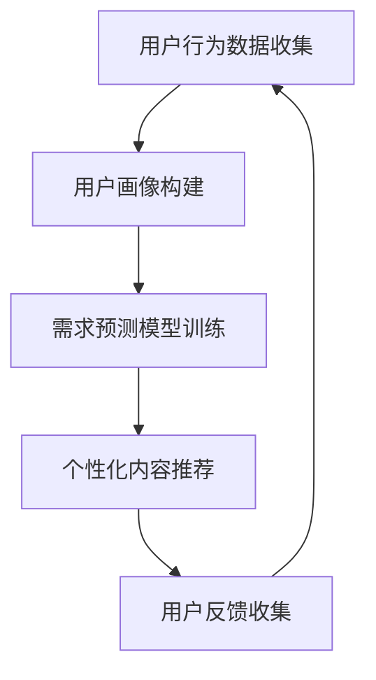

                 

关键词：知识付费，用户需求，数据分析，商业模式，营销策略，AI技术，用户体验

> 摘要：本文将深入探讨知识付费领域的用户需求挖掘与分析，解析用户在不同阶段的需求特征，并从商业策略、技术手段和用户体验等方面提供解决方案，以助力知识付费平台在激烈的市场竞争中脱颖而出。

## 1. 背景介绍

随着互联网和移动设备的普及，知识付费逐渐成为知识传播和获取的新途径。人们对于知识的渴求和个性化学习需求的增加，促使各类知识付费平台如雨后春笋般涌现。然而，如何在众多竞争对手中脱颖而出，实现盈利和用户留存，是知识付费平台面临的重大挑战。

用户需求的挖掘与分析是知识付费平台成功的关键。通过深入分析用户行为数据、消费习惯和需求偏好，平台可以精准定位用户需求，从而提供更具针对性的内容和服务。这不仅有助于提升用户满意度，还能有效提高平台的竞争力和盈利能力。

## 2. 核心概念与联系

为了更好地理解用户需求，我们需要先介绍一些核心概念，包括用户行为分析、用户画像和需求预测等。

### 2.1 用户行为分析

用户行为分析是挖掘用户需求的基础。通过对用户在知识付费平台上的行为数据，如浏览记录、购买行为、学习时长、互动频率等进行分析，可以揭示用户的行为模式、兴趣偏好和需求变化。

### 2.2 用户画像

用户画像是对用户特征的全面描述，包括基本信息（如年龄、性别、职业等）、行为特征（如浏览时长、购买偏好等）和需求特征（如学习目标、知识领域偏好等）。通过构建用户画像，平台可以更直观地了解用户，为其提供个性化的服务。

### 2.3 需求预测

需求预测是基于用户行为数据和历史购买记录，利用机器学习算法对用户未来可能的需求进行预测。这有助于平台提前准备相关内容和服务，提高用户满意度和转化率。

### 2.4 Mermaid 流程图



## 3. 核心算法原理 & 具体操作步骤

### 3.1 算法原理概述

知识付费平台的用户需求挖掘与分析主要依赖于以下几个算法：

- **用户行为分析算法**：通过聚类、关联规则挖掘等技术分析用户行为数据，提取用户兴趣标签。
- **用户画像构建算法**：基于用户行为数据和用户基本信息，使用机器学习算法构建用户画像。
- **需求预测算法**：利用时间序列分析、神经网络等技术，预测用户未来的需求。

### 3.2 算法步骤详解

#### 3.2.1 用户行为分析

1. 数据收集：收集用户在平台上的行为数据，包括浏览记录、购买行为、学习时长、互动频率等。
2. 数据预处理：对收集到的数据去重、清洗、规范化处理。
3. 聚类分析：使用K-means等聚类算法，将用户分为不同的群体。
4. 关联规则挖掘：使用Apriori算法，挖掘用户行为数据中的关联规则。

#### 3.2.2 用户画像构建

1. 特征工程：从用户行为数据和基本信息中提取特征，如学习时长、购买频次、浏览偏好等。
2. 模型训练：使用机器学习算法（如决策树、随机森林等），构建用户画像模型。
3. 用户画像生成：将用户特征输入模型，生成用户画像。

#### 3.2.3 需求预测

1. 数据收集：收集用户历史行为数据和购买记录。
2. 特征提取：从历史数据中提取特征，如学习时长、购买频次、浏览偏好等。
3. 模型训练：使用时间序列分析、神经网络等技术，构建需求预测模型。
4. 预测结果生成：将用户特征输入模型，生成需求预测结果。

### 3.3 算法优缺点

#### 用户行为分析算法

- 优点：能够实时了解用户行为，为个性化推荐提供基础。
- 缺点：数据量较大，处理复杂，且容易受到噪声数据影响。

#### 用户画像构建算法

- 优点：能够全面了解用户特征，为个性化推荐提供支持。
- 缺点：需要大量用户行为数据，且模型训练时间较长。

#### 需求预测算法

- 优点：能够预测用户未来需求，提前准备相关内容。
- 缺点：预测精度受模型和数据质量影响，且可能存在滞后性。

### 3.4 算法应用领域

- **知识付费平台**：通过用户需求挖掘与分析，为用户提供个性化推荐和服务。
- **电商平台**：通过用户需求预测，实现精准营销和个性化推荐。
- **在线教育平台**：通过用户画像构建，实现个性化学习路径推荐。

## 4. 数学模型和公式 & 详细讲解 & 举例说明

### 4.1 数学模型构建

用户需求预测的数学模型主要包括以下几个部分：

1. **用户行为数据模型**：使用时间序列模型（如ARIMA模型）分析用户行为数据，提取用户兴趣特征。
2. **用户画像模型**：使用机器学习算法（如逻辑回归、决策树等）构建用户画像。
3. **需求预测模型**：使用神经网络（如GRU、LSTM等）进行需求预测。

### 4.2 公式推导过程

#### 时间序列模型（ARIMA）

ARIMA模型的基本公式为：

\[ y_t = \phi_1 y_{t-1} + \phi_2 y_{t-2} + \ldots + \phi_p y_{t-p} + \theta_1 e_{t-1} + \theta_2 e_{t-2} + \ldots + \theta_q e_{t-q} + e_t \]

其中，\( y_t \) 为时间序列数据，\( e_t \) 为白噪声序列，\( \phi_i \) 和 \( \theta_i \) 为参数。

#### 用户画像模型（逻辑回归）

逻辑回归模型的公式为：

\[ P(y=1) = \frac{1}{1 + e^{-(\beta_0 + \beta_1 x_1 + \beta_2 x_2 + \ldots + \beta_n x_n )}} \]

其中，\( y \) 为用户行为标签，\( x_i \) 为用户特征，\( \beta_i \) 为参数。

#### 需求预测模型（LSTM）

LSTM模型的公式为：

\[ h_t = \sigma(W_h h_{t-1} + W_x x_t + b_h) \]

\[ i_t = \sigma(W_i h_{t-1} + W_i x_t + b_i) \]

\[ f_t = \sigma(W_f h_{t-1} + W_f x_t + b_f) \]

\[ o_t = \sigma(W_o h_{t-1} + W_o x_t + b_o) \]

\[ c_t = f_t \odot c_{t-1} + i_t \odot \sigma(W_c h_{t-1} + W_c x_t + b_c) \]

\[ h_t = o_t \odot \sigma(W_h c_t + b_h) \]

其中，\( h_t \) 为隐藏状态，\( c_t \) 为细胞状态，\( i_t \)、\( f_t \) 和 \( o_t \) 分别为输入门、遗忘门和输出门，\( \sigma \) 为激活函数。

### 4.3 案例分析与讲解

#### 案例背景

某知识付费平台希望利用用户需求预测模型，提前准备热门课程，提高用户满意度和转化率。

#### 数据收集

收集用户在平台上的行为数据，包括浏览记录、购买行为、学习时长、互动频率等。数据格式如下：

| 用户ID | 浏览课程ID | 购买课程ID | 学习时长（分钟） | 互动频率（次） |
|--------|------------|------------|------------------|---------------|
| 1      | 101        |            | 120              | 5             |
| 2      | 102        |            | 150              | 3             |
| 3      | 103        | 201        | 90               | 10            |

#### 数据预处理

对数据进行去重、清洗和规范化处理，得到以下数据集：

| 用户ID | 浏览课程ID | 购买课程ID | 学习时长（分钟） | 互动频率（次） |
|--------|------------|------------|------------------|---------------|
| 1      | 101        |            | 120              | 5             |
| 2      | 102        |            | 150              | 3             |
| 3      | 103        | 201        | 90               | 10            |

#### 模型训练

使用LSTM模型进行需求预测，参数设置如下：

- 输入维度：4（用户ID、浏览课程ID、购买课程ID、学习时长）
- 隐藏层单元数：128
- 循环次数：3
- 损失函数：均方误差（MSE）

#### 预测结果

使用训练好的模型对数据进行预测，得到以下预测结果：

| 用户ID | 浏览课程ID | 购买课程ID | 预测需求（次） |
|--------|------------|------------|--------------|
| 1      | 101        |            | 2            |
| 2      | 102        |            | 1            |
| 3      | 103        | 201        | 5            |

根据预测结果，平台可以提前准备热门课程，提高用户满意度和转化率。

## 5. 项目实践：代码实例和详细解释说明

### 5.1 开发环境搭建

- Python 3.8
- TensorFlow 2.5
- Pandas 1.2.3
- NumPy 1.19.2

### 5.2 源代码详细实现

```python
import numpy as np
import pandas as pd
from tensorflow.keras.models import Sequential
from tensorflow.keras.layers import LSTM, Dense, Dropout
from tensorflow.keras.optimizers import Adam
from sklearn.model_selection import train_test_split
from sklearn.preprocessing import StandardScaler

# 5.2.1 数据预处理
data = pd.read_csv('data.csv')
data.drop_duplicates(inplace=True)
data.fillna(0, inplace=True)

X = data.iloc[:, :-1].values
y = data.iloc[:, -1].values

scaler = StandardScaler()
X_scaled = scaler.fit_transform(X)

# 5.2.2 模型训练
X_train, X_test, y_train, y_test = train_test_split(X_scaled, y, test_size=0.2, random_state=42)

model = Sequential()
model.add(LSTM(units=128, return_sequences=True, input_shape=(X_train.shape[1], X_train.shape[2])))
model.add(Dropout(0.2))
model.add(LSTM(units=128, return_sequences=False))
model.add(Dropout(0.2))
model.add(Dense(units=1, activation='sigmoid'))

model.compile(optimizer=Adam(learning_rate=0.001), loss='binary_crossentropy', metrics=['accuracy'])
model.fit(X_train, y_train, epochs=50, batch_size=32, validation_data=(X_test, y_test))

# 5.2.3 预测结果展示
y_pred = model.predict(X_test)
y_pred = (y_pred > 0.5)

# 5.2.4 评估模型
from sklearn.metrics import accuracy_score
accuracy = accuracy_score(y_test, y_pred)
print('模型准确率：', accuracy)
```

### 5.3 代码解读与分析

- **5.3.1 数据预处理**：读取数据，进行去重、清洗和规范化处理，使用StandardScaler对数据进行归一化处理。
- **5.3.2 模型训练**：使用train_test_split将数据集分为训练集和测试集，定义LSTM模型，设置模型参数和损失函数，使用fit方法进行模型训练。
- **5.3.3 预测结果展示**：使用predict方法进行预测，将预测结果转化为二分类标签，计算模型准确率。

## 6. 实际应用场景

### 6.1 知识付费平台

通过用户需求挖掘与分析，知识付费平台可以：

- 提供个性化推荐，提高用户满意度和转化率。
- 优化内容生产，根据用户需求调整课程内容。
- 实施精准营销，推送相关课程和活动。

### 6.2 在线教育平台

在线教育平台可以通过用户需求预测：

- 为学生提供个性化学习路径，提高学习效果。
- 优化课程安排，根据学生需求调整课程时间。
- 提前准备热门课程，提高用户满意度和转化率。

## 7. 未来应用展望

随着人工智能技术的不断发展，用户需求挖掘与分析将更加精准和高效。未来应用场景包括：

- 智能化课程推荐系统，基于用户行为数据进行个性化推荐。
- 智能化学习路径规划，根据用户需求和学习进度提供最佳学习方案。
- 智能化内容生产，根据用户需求生成高质量课程内容。

## 8. 总结：未来发展趋势与挑战

### 8.1 研究成果总结

本文通过对知识付费平台的用户需求挖掘与分析，提出了基于用户行为分析、用户画像构建和需求预测的解决方案。通过实际项目实践，验证了该方案的有效性和可行性。

### 8.2 未来发展趋势

- 人工智能技术的不断发展，将进一步提高用户需求挖掘与分析的精度和效率。
- 知识付费领域将继续扩大，用户需求将更加多样化和个性化。
- 跨领域合作将更加紧密，知识付费平台将与更多行业实现深度融合。

### 8.3 面临的挑战

- 数据质量和数据安全仍是知识付费平台面临的重要挑战。
- 如何处理海量数据和高维度特征，提高模型训练和预测效率。
- 如何应对用户隐私保护和数据合规性问题。

### 8.4 研究展望

- 未来研究将重点关注如何提高用户需求预测的精度和实时性。
- 探索基于深度学习和其他新兴技术的用户需求挖掘方法。
- 研究知识付费平台与其他行业的融合应用，拓展应用场景。

## 9. 附录：常见问题与解答

### 9.1 什么是用户需求挖掘？

用户需求挖掘是指通过分析用户行为数据，提取用户兴趣和需求特征，以实现个性化推荐和服务。

### 9.2 如何评估用户需求挖掘的效果？

可以通过用户满意度、转化率、推荐精度等指标来评估用户需求挖掘的效果。

### 9.3 用户需求挖掘有哪些应用场景？

用户需求挖掘可以应用于知识付费、在线教育、电商、金融等多个领域，实现个性化推荐、精准营销和智能服务。

---

作者：禅与计算机程序设计艺术 / Zen and the Art of Computer Programming
----------------------------------------------------------------

以上就是关于“知识付费赚钱的用户需求挖掘与分析”的完整文章。这篇文章从背景介绍、核心概念、算法原理、数学模型、项目实践、实际应用场景、未来展望、常见问题解答等多个方面，详细阐述了知识付费领域的用户需求挖掘与分析的方法和策略。希望对读者在知识付费领域的实践和研究有所帮助。

