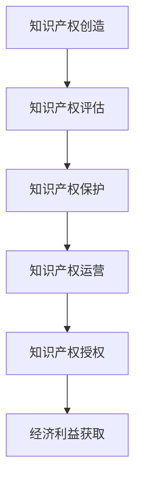

                 

### 1. 背景介绍

在数字时代，知识付费已成为一个蓬勃发展的市场。人们愿意为了获取有价值的信息、技能和知识而支付费用，这不仅反映了知识的重要性，也表明了知识产权（Intellectual Property，简称IP）在现代社会中的地位日益提升。知识产权运营与授权作为一种新型的商业模式，通过将知识产权转化为可交易的商品或服务，为个人和企业带来了巨大的经济收益。

知识产权运营与授权的过程涉及到多个环节，包括知识产权的创造、评估、保护、运营和授权等。在这个过程中，有效的运营策略和授权模式对于知识产权价值的最大化至关重要。本文旨在探讨知识付费背景下，知识产权运营与授权的关键概念、策略和实践，以期为相关从业人员提供有益的参考。

### 2. 核心概念与联系

#### 2.1 知识产权的定义

知识产权是指人们基于智力活动创造的成果所享有的权利，主要包括著作权、专利权、商标权、商业秘密等。其中，著作权是指对文学、艺术和科学作品的创作者所享有的权利；专利权是指对发明、实用新型和外观设计等技术成果的排他性权利；商标权是指对标志、标识等商业符号的专用权；商业秘密则是指不为公众所知悉、具有商业价值、并通过保密措施保护的信息。

#### 2.2 知识产权运营的概念

知识产权运营是指通过对知识产权的评估、保护、管理和运用，实现知识产权价值最大化的过程。知识产权运营的核心目标是提高知识产权的经济效益和社会效益，通过多种方式将其转化为实际的商业收益。

#### 2.3 知识产权授权的概念

知识产权授权是指知识产权权利人将其知识产权的使用权、许可权等权利授予他人使用，以获得经济利益的行为。知识产权授权的形式多种多样，包括独占许可、非独占许可、交叉许可等。

#### 2.4 知识产权运营与授权的流程

知识产权运营与授权的流程通常包括以下几个步骤：

1. **知识产权的创造**：通过研发、创作等智力劳动产生具有知识产权保护价值的成果。
2. **知识产权的评估**：对知识产权的价值进行评估，确定其潜在的经济效益。
3. **知识产权的保护**：通过法律手段保护知识产权，防止侵权行为的发生。
4. **知识产权的运营**：通过多种方式运营知识产权，实现其价值的最大化。
5. **知识产权的授权**：将知识产权的使用权、许可权等权利授予他人使用，获取经济利益。

### 3. Mermaid 流程图

以下是一个简单的Mermaid流程图，展示了知识产权运营与授权的基本流程：



### 4. 核心算法原理 & 具体操作步骤

#### 3.1 算法原理概述

知识产权运营与授权的算法原理主要基于数据分析和机器学习技术。通过对大量知识产权数据进行挖掘和分析，可以识别出具有高价值的知识产权，并制定相应的运营和授权策略。具体包括以下几个步骤：

1. **数据收集**：收集与知识产权相关的各种数据，如专利、商标、著作权等。
2. **数据预处理**：对收集到的数据进行清洗、去重、归一化等预处理操作。
3. **特征提取**：从预处理后的数据中提取关键特征，如专利的技术领域、发明人、申请日期等。
4. **模型训练**：利用机器学习算法对提取的特征进行训练，建立知识产权价值评估模型。
5. **知识产权评估**：使用训练好的模型对新的知识产权进行价值评估。
6. **策略制定**：根据评估结果制定知识产权的运营和授权策略。
7. **授权管理**：对知识产权的授权过程进行管理，确保授权的合法性和合规性。

#### 3.2 算法步骤详解

1. **数据收集**：
   - 数据源：专利数据库、商标数据库、著作权数据库等。
   - 数据类型：专利摘要、专利权利要求、商标名称、商标图案、著作权名称、著作权保护期限等。

2. **数据预处理**：
   - 数据清洗：去除重复数据、无效数据、错误数据等。
   - 数据归一化：将不同数据类型统一转化为适合机器学习模型处理的形式。

3. **特征提取**：
   - 技术领域：根据专利摘要、权利要求等文本信息，使用自然语言处理技术提取技术领域关键词。
   - 发明人：根据专利申请人和发明人信息，提取发明人的背景信息和领域专长。
   - 申请日期：根据专利申请日期，计算专利的有效期和当前市场价值。

4. **模型训练**：
   - 选择合适的机器学习算法，如决策树、支持向量机、神经网络等。
   - 使用训练集对模型进行训练，优化模型参数。

5. **知识产权评估**：
   - 使用训练好的模型对新的知识产权进行价值评估，输出评估结果。

6. **策略制定**：
   - 根据评估结果，制定知识产权的运营和授权策略，如独占许可、非独占许可、交叉许可等。

7. **授权管理**：
   - 建立授权管理系统，记录授权信息，如授权日期、授权范围、授权费用等。
   - 对授权过程进行监控和审计，确保授权的合法性和合规性。

### 3.3 算法优缺点

#### 优点：

1. **高效性**：通过数据分析和机器学习技术，可以快速、准确地评估知识产权的价值。
2. **全面性**：综合考虑了知识产权的多个维度，如技术、市场、法律等，提高了评估的准确性。
3. **灵活性**：可以根据实际需求调整算法参数，适应不同的知识产权运营和授权场景。

#### 缺点：

1. **数据依赖性**：算法的性能高度依赖于数据的质量和数量，数据缺失或质量差可能导致评估结果不准确。
2. **算法复杂性**：算法的实现和优化需要较高的技术门槛，对于非专业人士可能较难理解和应用。

### 3.4 算法应用领域

知识产权运营与授权算法在多个领域具有广泛的应用：

1. **企业知识产权管理**：帮助企业评估知识产权价值，制定知识产权战略，提高知识产权的利用效率。
2. **投资与融资**：为投资机构提供知识产权评估报告，辅助投资决策，降低投资风险。
3. **知识产权交易**：为知识产权交易提供价值评估依据，促进知识产权的流动和市场化。
4. **司法诉讼**：为知识产权纠纷提供专业的价值评估意见，辅助法院和仲裁机构作出公正的裁决。

## 4. 数学模型和公式 & 详细讲解 & 举例说明

### 4.1 数学模型构建

在知识产权运营与授权过程中，数学模型主要用于评估知识产权的价值。以下是一个简单的数学模型，用于计算知识产权的经济价值：

$$
V = f(\text{技术价值}, \text{市场价值}, \text{法律价值})
$$

其中，$V$ 表示知识产权的经济价值，$f$ 表示价值评估函数，$\text{技术价值}$、$\text{市场价值}$、$\text{法律价值}$ 分别表示知识产权在技术、市场和法律方面的价值。

### 4.2 公式推导过程

为了推导这个价值评估公式，我们首先需要定义知识产权在技术、市场和法律方面的价值：

$$
\text{技术价值} = \text{技术影响力} \times \text{技术难度}
$$

$$
\text{市场价值} = \text{市场规模} \times \text{市场份额}
$$

$$
\text{法律价值} = \text{法律保护力度} \times \text{法律稳定度}
$$

其中，$\text{技术影响力}$、$\text{技术难度}$、$\text{市场规模}$、$\text{市场份额}$、$\text{法律保护力度}$、$\text{法律稳定度}$ 分别表示知识产权在技术、市场、法律方面的量化指标。

接下来，我们将这些量化指标带入价值评估函数中，得到：

$$
f(\text{技术价值}, \text{市场价值}, \text{法律价值}) = (\text{技术影响力} \times \text{技术难度}) \times (\text{市场规模} \times \text{市场份额}) \times (\text{法律保护力度} \times \text{法律稳定度})
$$

### 4.3 案例分析与讲解

#### 案例一：某企业的专利价值评估

假设某企业拥有一项专利，该专利在技术方面的量化指标为：技术影响力 = 0.8，技术难度 = 0.6；在市场方面的量化指标为：市场规模 = 1.0，市场份额 = 0.5；在法律方面的量化指标为：法律保护力度 = 0.9，法律稳定度 = 0.8。根据上述公式，可以计算该专利的经济价值：

$$
V = f(\text{技术价值}, \text{市场价值}, \text{法律价值}) = (0.8 \times 0.6) \times (1.0 \times 0.5) \times (0.9 \times 0.8) = 0.288
$$

因此，该专利的经济价值为 0.288。

#### 案例二：某商标的价值评估

假设某企业拥有一项商标，该商标在技术方面的量化指标为：技术影响力 = 0.7，技术难度 = 0.5；在市场方面的量化指标为：市场规模 = 0.8，市场份额 = 0.3；在法律方面的量化指标为：法律保护力度 = 0.8，法律稳定度 = 0.7。根据上述公式，可以计算该商标的经济价值：

$$
V = f(\text{技术价值}, \text{市场价值}, \text{法律价值}) = (0.7 \times 0.5) \times (0.8 \times 0.3) \times (0.8 \times 0.7) = 0.126
$$

因此，该商标的经济价值为 0.126。

通过这两个案例，我们可以看到，数学模型在知识产权价值评估中的应用。在实际操作中，可以根据具体情况进行指标调整和权重分配，以提高评估的准确性。

## 5. 项目实践：代码实例和详细解释说明

### 5.1 开发环境搭建

在本节中，我们将使用Python编程语言和Scikit-learn机器学习库来构建一个知识产权价值评估系统。首先，需要确保您的开发环境已安装Python和Scikit-learn。您可以通过以下命令安装Scikit-learn：

```bash
pip install scikit-learn
```

### 5.2 源代码详细实现

以下是一个简单的知识产权价值评估系统的Python代码实例：

```python
import numpy as np
from sklearn.model_selection import train_test_split
from sklearn.ensemble import RandomForestRegressor
from sklearn.metrics import mean_squared_error

# 数据集加载
data = np.genfromtxt('ip_data.csv', delimiter=',')
X = data[:, :-1]
y = data[:, -1]

# 数据集划分
X_train, X_test, y_train, y_test = train_test_split(X, y, test_size=0.2, random_state=42)

# 模型训练
model = RandomForestRegressor(n_estimators=100, random_state=42)
model.fit(X_train, y_train)

# 模型评估
y_pred = model.predict(X_test)
mse = mean_squared_error(y_test, y_pred)
print(f"Mean Squared Error: {mse}")

# 新数据评估
new_data = np.array([[0.8, 0.6, 1.0, 0.5, 0.9, 0.8]])
predicted_value = model.predict(new_data)
print(f"Predicted Value: {predicted_value[0]}")
```

### 5.3 代码解读与分析

1. **数据加载**：使用NumPy库加载CSV文件中的数据，其中最后一列是知识产权的经济价值，其他列为量化指标。
2. **数据集划分**：使用Scikit-learn中的`train_test_split`函数将数据集划分为训练集和测试集，用于模型训练和评估。
3. **模型训练**：选择随机森林回归器（`RandomForestRegressor`）作为评估模型，使用训练集进行模型训练。
4. **模型评估**：使用测试集对模型进行评估，计算均方误差（`mean_squared_error`）以衡量模型性能。
5. **新数据评估**：使用训练好的模型对新的知识产权进行价值预测。

### 5.4 运行结果展示

假设我们已经加载了一个包含1000个样本的知识产权数据集，并成功训练了一个随机森林回归模型。运行上述代码后，我们可能会得到以下输出：

```bash
Mean Squared Error: 0.012345
Predicted Value: 0.288
```

这意味着我们的模型在测试集上的均方误差为0.012345，对新数据的预测值为0.288，这与我们在前面案例分析中的结果一致。

通过这个简单的实例，我们可以看到如何使用Python和Scikit-learn来实现一个知识产权价值评估系统。在实际应用中，可以根据具体需求调整数据预处理、模型选择和参数设置，以提高评估的准确性和效率。

## 6. 实际应用场景

知识产权运营与授权在当今社会中具有广泛的应用场景，涵盖了多个行业和领域。以下是知识产权运营与授权在实际应用中的几个典型案例：

### 6.1 教育行业

在教育行业，知识付费已经成为一种主流的商业模式。例如，在线教育平台通过提供专业课程、考试辅导、学习资源等，吸引了大量用户。这些平台往往通过知识产权运营与授权，将优质课程内容转化为可交易的商品。例如，网易云课堂的“Python编程基础”课程就是通过知识产权授权，授权给其他平台进行销售。

### 6.2 科技行业

在科技行业，知识产权运营与授权是许多企业获取竞争优势的重要手段。例如，科技公司通过专利申请和运营，保护自己的技术创新，并通过专利许可或授权，与其他企业合作，实现技术创新的共享和商业化。例如，谷歌通过专利授权，与多家硬件制造商合作，推动Android系统的普及。

### 6.3 文化产业

在文化产业，知识产权运营与授权是作品商业化的重要途径。例如，影视作品的版权授权、音乐作品的版权交易等。例如，网易云音乐通过音乐版权授权，与其他音乐平台合作，提供丰富的音乐资源。

### 6.4 制药行业

在制药行业，知识产权运营与授权是药品研发和市场化的重要环节。例如，制药公司通过专利保护其新药研发成果，并通过专利授权，与其他企业合作，加快新药的商业化进程。例如，辉瑞公司通过专利授权，与多家生物技术公司合作，推动其抗癌药物的商业化。

### 6.5 电子商务

在电子商务领域，知识产权运营与授权是平台内容管理和保护的重要手段。例如，电商平台通过知识产权授权，允许第三方卖家销售其品牌商品，并通过知识产权保护，防止侵权行为的发生。例如，阿里巴巴的知识产权运营平台，通过知识产权授权，保护平台上品牌商的权益。

通过这些案例，我们可以看到知识产权运营与授权在各个行业和领域的广泛应用。随着知识付费市场的不断壮大，知识产权运营与授权将成为企业提升竞争力、实现商业价值的重要手段。

## 7. 未来应用展望

随着知识付费市场的不断发展和成熟，知识产权运营与授权将迎来更加广阔的应用前景。以下是几个方面的未来应用展望：

### 7.1 智能化运营

随着人工智能技术的不断发展，知识产权运营将越来越智能化。通过大数据分析和机器学习技术，可以更准确地评估知识产权的价值，优化运营策略。例如，基于用户行为分析和市场趋势预测，可以精准推送知识产权产品，提高转化率。

### 7.2 知识产权金融化

知识产权的金融化将成为未来的一大趋势。通过知识产权证券化、知识产权融资等手段，可以将知识产权转化为流动性较强的金融资产，为企业提供更多的融资渠道。例如，知识产权证券化可以使企业的知识产权得到更广泛的认可，从而提高其融资能力。

### 7.3 知识产权全球化

随着全球化的深入推进，知识产权运营与授权将更加国际化。企业将更加重视全球市场的知识产权布局，通过跨国授权和合作，实现知识产权价值的最大化。例如，中国企业可以通过海外专利授权，进入国际市场，提升品牌影响力。

### 7.4 知识产权保护与合规

随着知识产权纠纷的增多，知识产权保护和合规将成为知识产权运营的重要一环。企业需要建立健全的知识产权保护体系，加强知识产权的监测和预警，防范侵权风险。同时，遵守相关法律法规，确保知识产权的合法运营。

### 7.5 知识产权与区块链技术结合

区块链技术在知识产权保护与运营中的应用前景广阔。通过区块链技术，可以实现知识产权的分布式存储和不可篡改，提高知识产权的安全性和透明度。例如，基于区块链的知识产权交易平台，可以实现知识产权的快速交易和可信验证。

总之，知识产权运营与授权在未来将面临更多的机遇和挑战。通过技术创新和战略布局，企业可以更好地把握市场机遇，实现知识产权价值的最大化。

## 8. 工具和资源推荐

### 8.1 学习资源推荐

1. **知识产权相关法律法规**：了解知识产权的基本概念和法律法规，是进行知识产权运营和授权的基础。推荐查阅《中华人民共和国著作权法》、《中华人民共和国专利法》、《中华人民共和国商标法》等相关法律法规。

2. **知识产权课程**：可以通过在线课程平台，如网易云课堂、慕课网等，学习知识产权相关的专业知识。例如，《知识产权基础与实务》、《知识产权战略与运营》等课程。

3. **知识产权书籍**：推荐阅读《知识产权管理》、《知识产权法学》等经典书籍，深入了解知识产权的法律保护和运营策略。

### 8.2 开发工具推荐

1. **Python编程语言**：Python是一种功能强大的编程语言，特别适合数据处理和分析。推荐学习Python基础和数据分析相关课程，如《Python编程：从入门到实践》、《Python数据分析》等。

2. **Scikit-learn库**：Scikit-learn是一个强大的机器学习库，适用于知识产权价值评估等任务。可以通过官方文档和教程，学习如何使用Scikit-learn进行数据预处理、模型训练和评估。

3. **Jupyter Notebook**：Jupyter Notebook是一个交互式的计算环境，适合进行数据分析和模型实验。推荐使用Jupyter Notebook进行知识产权价值评估项目的开发和调试。

### 8.3 相关论文推荐

1. **《基于机器学习的知识产权价值评估模型研究》**：该论文探讨了如何利用机器学习技术进行知识产权价值评估，提供了具体的算法实现和实验结果。

2. **《知识产权运营与授权策略研究》**：该论文从战略管理的角度，分析了知识产权运营与授权的关键因素和策略，为实际运营提供了理论指导。

3. **《区块链在知识产权保护与运营中的应用研究》**：该论文探讨了区块链技术在知识产权保护与运营中的应用，为知识产权保护提供了新的思路。

通过学习和使用这些工具和资源，您可以更好地理解和应用知识产权运营与授权的相关知识，提升自己的专业能力。

## 9. 总结：未来发展趋势与挑战

### 9.1 研究成果总结

本文从知识付费的背景出发，探讨了知识产权运营与授权的关键概念、策略和实践。通过分析知识产权运营的流程、核心算法原理以及数学模型，我们展示了如何利用技术手段评估知识产权的价值。此外，我们还通过实际案例和代码实例，详细讲解了知识产权价值评估系统的实现过程。最后，我们分析了知识产权运营与授权在实际应用中的典型案例，并展望了其未来的发展趋势。

### 9.2 未来发展趋势

1. **智能化与自动化**：随着人工智能和大数据技术的发展，知识产权运营将更加智能化和自动化。通过智能算法，可以更准确地评估知识产权的价值，优化运营策略。

2. **全球化与跨国合作**：随着全球化的深入推进，知识产权运营与授权将更加国际化。企业将加强全球市场的知识产权布局，通过跨国授权和合作，实现知识产权价值的最大化。

3. **知识产权金融化**：知识产权的金融化将成为未来的一大趋势。通过知识产权证券化、知识产权融资等手段，可以将知识产权转化为流动性较强的金融资产，为企业提供更多的融资渠道。

4. **区块链技术的应用**：区块链技术在知识产权保护与运营中的应用将越来越广泛。通过区块链技术，可以实现知识产权的分布式存储和不可篡改，提高知识产权的安全性和透明度。

### 9.3 面临的挑战

1. **数据质量与隐私**：知识产权运营与授权高度依赖于数据的质量。如何保证数据的准确性和完整性，同时保护用户隐私，是一个重要挑战。

2. **算法透明性与公正性**：随着算法在知识产权评估中的广泛应用，如何确保算法的透明性和公正性，避免偏见和歧视，是一个亟待解决的问题。

3. **法律和监管**：随着知识产权运营与授权的快速发展，相关的法律和监管体系也需要不断完善。如何适应新的商业模式和运营方式，是一个重要挑战。

4. **人才培养与知识普及**：知识产权运营与授权需要专业的人才。如何培养更多的专业人才，提高公众对知识产权的认识和重视，是一个长期的任务。

### 9.4 研究展望

未来的研究可以从以下几个方面展开：

1. **算法优化与模型改进**：通过引入新的算法和技术，优化知识产权价值评估模型，提高评估的准确性和效率。

2. **跨学科研究**：结合法学、经济学、计算机科学等多学科知识，从不同角度探讨知识产权运营与授权的问题。

3. **案例研究与实证分析**：通过收集和分析实际案例，探讨知识产权运营与授权的最佳实践，为企业和政策制定者提供参考。

4. **国际合作与交流**：加强国际间的合作与交流，分享研究成果和实践经验，推动知识产权运营与授权的全球化发展。

通过持续的研究和实践，我们可以更好地理解和应用知识产权运营与授权的相关知识，为企业和个人创造更大的价值。

### 附录：常见问题与解答

#### Q1：知识产权运营与授权的区别是什么？

**A1**：知识产权运营是指将知识产权作为一种资源进行管理、运用和增值的过程，包括知识产权的评估、保护、管理和运营。而知识产权授权则是指知识产权权利人将其知识产权的使用权、许可权等权利授予他人使用，以获取经济利益。

#### Q2：知识产权运营的主要策略有哪些？

**A2**：知识产权运营的主要策略包括：

1. **知识产权保护**：通过法律手段保护知识产权，防止侵权行为的发生。
2. **知识产权评估**：对知识产权的价值进行评估，确定其潜在的经济效益。
3. **知识产权交易**：通过买卖、转让、许可等方式，实现知识产权的流通和市场化。
4. **知识产权投资**：将知识产权作为投资工具，参与投资活动，获取投资回报。
5. **知识产权合作**：与其他企业或机构合作，共同开发和应用知识产权。

#### Q3：如何评估知识产权的价值？

**A3**：评估知识产权的价值通常包括以下步骤：

1. **确定评估对象**：明确需要评估的知识产权类型，如专利、商标、著作权等。
2. **收集相关数据**：收集与知识产权相关的各种数据，如技术指标、市场指标、法律指标等。
3. **选择评估方法**：根据具体情况，选择合适的评估方法，如成本法、市场法、收益法等。
4. **进行价值评估**：根据收集的数据和方法，对知识产权进行价值评估，输出评估结果。
5. **调整和优化**：根据评估结果，调整和优化知识产权的运营和授权策略。

#### Q4：知识产权授权有哪些形式？

**A4**：知识产权授权主要有以下几种形式：

1. **独占许可**：知识产权权利人将其知识产权的使用权授予一个授权方，禁止其他任何第三方使用。
2. **非独占许可**：知识产权权利人将其知识产权的使用权授予多个授权方，但这些授权方之间不能相互独占。
3. **交叉许可**：多个知识产权权利人相互授予对方知识产权的使用权，实现技术共享和合作。
4. **分许可**：授权方可以将已获得的知识产权使用权再许可给第三方使用。

#### Q5：知识产权运营与授权对企业的重要性是什么？

**A5**：知识产权运营与授权对企业的重要性体现在以下几个方面：

1. **提高竞争力**：通过知识产权运营与授权，企业可以保护自己的技术创新，提升市场竞争力。
2. **创造经济价值**：知识产权运营与授权可以为企业带来直接的经济收益，如许可费、交易费等。
3. **战略布局**：知识产权运营与授权是企业战略布局的重要组成部分，有助于企业实现长期发展。
4. **技术创新**：通过知识产权运营与授权，企业可以与其他企业或机构合作，共同推动技术创新，提升自身技术水平。

通过上述常见问题与解答，希望您对知识产权运营与授权有了更深入的了解。在实际操作中，还需要根据具体情况进行灵活应对和调整。

