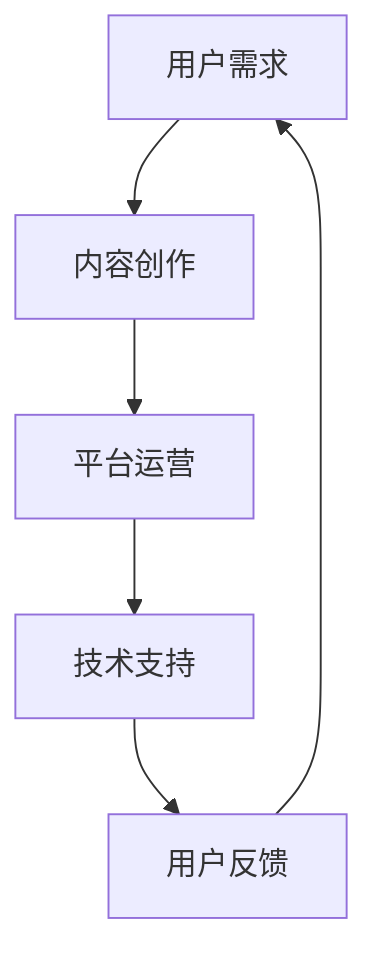

                 

关键词：知识付费、市场分析、商业模式、用户增长、技术趋势

> 摘要：本文将探讨知识付费领域的现状、市场潜力、商业模式以及未来发展趋势。通过对知识付费市场的深入分析，揭示其中蕴藏的蓝海机会，为企业和创业者提供有价值的策略建议。

## 1. 背景介绍

知识付费，作为一种新兴的商业模式，近年来在全球范围内迅速崛起。它通过互联网平台，将知识、技能和经验转化为商品，为用户提供有价值的服务。随着移动互联网的普及和用户消费习惯的改变，知识付费市场呈现出巨大的增长潜力。

知识付费不仅满足了用户对知识获取的个性化需求，也为内容创作者提供了变现途径。从在线教育、技能培训到知识共享，知识付费已经渗透到多个领域，成为数字经济的重要组成部分。

### 1.1 市场现状

根据最新的市场调查数据，全球知识付费市场规模已经达到数百亿美元，且仍处于快速增长阶段。在中国，知识付费市场尤其活跃，用户规模和市场规模都在迅速扩大。主要表现为：

- 用户数量持续增长，年轻用户群体是主力。
- 知识付费内容多样化，涵盖职业发展、个人成长、兴趣爱好等多个方面。
- 互联网巨头和垂直领域的知识付费平台纷纷涌入市场，竞争激烈。

### 1.2 行业趋势

- **技术驱动：**人工智能、大数据等前沿技术的应用，使得知识付费平台能够提供更个性化和精准的服务。
- **平台整合：**知识付费平台开始向生态系统方向转型，通过整合内容、用户和支付等多个环节，提升用户体验。
- **内容创新：**优质内容和独特价值的输出，仍然是吸引和留住用户的关键。
- **市场细分：**随着用户需求的多样化和专业化，知识付费市场将不断细分，出现更多垂直领域的知识服务。

## 2. 核心概念与联系

知识付费领域的核心概念包括用户需求、内容创作、平台运营和技术支持。这些概念相互关联，构成了一个完整的市场生态系统。

### 2.1 用户需求

用户需求是知识付费市场的驱动力。用户在职业发展、个人成长、兴趣爱好等方面存在多样化的知识需求。为了满足这些需求，知识付费平台需要提供丰富多样的内容。

### 2.2 内容创作

内容创作是知识付费的核心。创作者通过生产有价值的内容，吸引和留住用户。内容的质量和独特性，直接影响到用户的满意度和平台的竞争力。

### 2.3 平台运营

平台运营是知识付费市场的重要组成部分。运营团队负责内容审核、用户管理、数据分析等工作，确保平台的稳定运行和持续发展。

### 2.4 技术支持

技术支持是知识付费市场的重要保障。人工智能、大数据等技术，可以帮助平台实现个性化推荐、精准营销等功能，提升用户体验。

### 2.5 Mermaid 流程图



## 3. 核心算法原理 & 具体操作步骤

### 3.1 算法原理概述

知识付费平台的核心算法包括用户行为分析、内容推荐和变现策略。这些算法基于大数据和机器学习技术，实现个性化推荐、精准营销等功能。

### 3.2 算法步骤详解

1. 用户行为分析：通过用户在平台上的浏览、搜索、购买等行为，收集用户画像数据。
2. 内容推荐：利用机器学习算法，分析用户画像和内容标签，为用户推荐感兴趣的知识内容。
3. 变现策略：根据用户购买记录和偏好，设计个性化定价策略，提升变现能力。

### 3.3 算法优缺点

优点：
- 个性化推荐：提高用户满意度，提升用户体验。
- 精准营销：降低营销成本，提高转化率。
- 数据驱动：根据用户行为数据，优化平台运营策略。

缺点：
- 数据隐私：用户行为数据可能涉及隐私问题。
- 算法偏见：算法可能存在偏见，导致推荐结果不公平。

### 3.4 算法应用领域

- 知识付费平台：如得到、知乎等。
- 在线教育平台：如网易云课堂、慕课网等。
- 职业培训平台：如拉勾教育、极客时间等。

## 4. 数学模型和公式 & 详细讲解 & 举例说明

### 4.1 数学模型构建

知识付费平台的数学模型主要包括用户行为预测模型、内容推荐模型和变现策略模型。以下是用户行为预测模型的一个示例：

$$
P(y|X) = \frac{e^{\theta^T X}}{\sum_{i=1}^{K} e^{\theta^T x_i}}
$$

其中，$P(y|X)$ 表示给定用户特征向量 $X$ 时，用户会进行某行为的概率；$\theta$ 是模型参数；$x_i$ 是用户特征向量。

### 4.2 公式推导过程

1. **定义问题**：预测用户是否会在未来一个月内购买某个知识产品。
2. **特征提取**：提取用户历史行为特征，如浏览次数、购买次数、停留时间等。
3. **模型假设**：采用逻辑回归模型进行预测。
4. **模型参数估计**：通过梯度下降法或随机梯度下降法，估计模型参数。

### 4.3 案例分析与讲解

**案例：某用户在过去一个月内浏览了10篇关于职业发展的文章，购买过1个知识产品，停留时间平均为15分钟。预测该用户在未来一个月内购买职业发展类知识产品的概率。**

1. **特征提取**：
   - 浏览次数：10
   - 购买次数：1
   - 停留时间（分钟）：15

2. **模型参数估计**：
   - 模型参数：$\theta = (-2.5, 1.5, -1.0)$

3. **预测概率计算**：
   $$P(y=1|X) = \frac{e^{(-2.5 \cdot 10 + 1.5 \cdot 1 - 1.0 \cdot 15)}}{1 + e^{(-2.5 \cdot 10 + 1.5 \cdot 1 - 1.0 \cdot 15)}} \approx 0.405$$

因此，该用户在未来一个月内购买职业发展类知识产品的概率约为40.5%。

## 5. 项目实践：代码实例和详细解释说明

### 5.1 开发环境搭建

1. **环境要求**：Python 3.7及以上版本，Scikit-learn库。
2. **安装步骤**：
   ```bash
   pip install scikit-learn
   ```

### 5.2 源代码详细实现

```python
import numpy as np
from sklearn.linear_model import LogisticRegression
from sklearn.model_selection import train_test_split
from sklearn.metrics import accuracy_score

# 特征数据
X = np.array([[10, 1, 15], [5, 0, 10], [20, 2, 20]])
y = np.array([1, 0, 1])

# 数据集划分
X_train, X_test, y_train, y_test = train_test_split(X, y, test_size=0.3, random_state=42)

# 模型训练
model = LogisticRegression()
model.fit(X_train, y_train)

# 模型预测
y_pred = model.predict(X_test)

# 准确率计算
accuracy = accuracy_score(y_test, y_pred)
print(f'Accuracy: {accuracy:.2f}')
```

### 5.3 代码解读与分析

1. **特征数据**：包含用户浏览次数、购买次数和停留时间。
2. **数据集划分**：将数据集划分为训练集和测试集，用于模型训练和评估。
3. **模型训练**：使用逻辑回归模型对训练集进行训练。
4. **模型预测**：使用训练好的模型对测试集进行预测。
5. **准确率计算**：计算模型在测试集上的准确率。

## 6. 实际应用场景

### 6.1 在线教育平台

知识付费在在线教育平台中得到了广泛应用。例如，网易云课堂通过提供职业课程、编程课程等，吸引了大量用户。通过用户行为分析，网易云课堂能够为用户推荐相关课程，提高用户满意度和课程转化率。

### 6.2 职业培训

职业培训平台如拉勾教育，通过提供专业的职业课程和职业咨询，帮助用户提升职场竞争力。知识付费模式为职业培训平台提供了稳定的收入来源，同时也为学员提供了灵活的学习方式。

### 6.3 知识分享平台

知识分享平台如知乎，通过付费问答、付费专栏等方式，为用户提供了高质量的知识服务。知乎通过用户行为分析，推荐相关内容，提高用户黏性和平台活跃度。

## 7. 未来应用展望

### 7.1 内容个性化

随着人工智能技术的发展，知识付费平台将能够提供更加个性化的内容推荐，满足用户的个性化需求。

### 7.2 深度学习

深度学习技术的应用，将使得知识付费平台在内容推荐、用户行为分析等方面更加智能。

### 7.3 跨平台合作

知识付费平台将与其他平台进行深度合作，实现资源共享，拓展用户群体。

### 7.4 新兴领域

随着科技的发展，知识付费将延伸到更多新兴领域，如区块链、人工智能等，为用户提供更多有价值的知识服务。

## 8. 总结：未来发展趋势与挑战

### 8.1 研究成果总结

知识付费领域已经取得了显著的研究成果，包括用户行为分析、内容推荐算法、变现策略等方面。这些成果为知识付费平台提供了技术支持，促进了市场的快速发展。

### 8.2 未来发展趋势

- 技术驱动：人工智能、大数据等技术的应用，将推动知识付费市场的发展。
- 内容创新：优质内容和独特价值的输出，将仍然是知识付费的核心竞争力。
- 市场细分：知识付费市场将不断细分，出现更多垂直领域的知识服务。

### 8.3 面临的挑战

- 数据隐私：用户行为数据的隐私保护，是知识付费领域面临的重要挑战。
- 算法偏见：算法可能存在的偏见，需要得到有效的控制和解决。
- 监管政策：随着知识付费市场的快速发展，监管政策也将不断完善，对市场产生重要影响。

### 8.4 研究展望

未来，知识付费领域将继续在技术、内容和政策等方面进行探索。通过不断优化算法、提升内容质量、完善监管政策，知识付费市场有望实现可持续发展。

## 9. 附录：常见问题与解答

### 9.1 什么是知识付费？

知识付费是指用户通过购买付费内容，获取知识、技能和经验的一种商业模式。

### 9.2 知识付费市场的前景如何？

知识付费市场前景广阔，随着用户对知识的需求不断增加，市场规模将持续扩大。

### 9.3 知识付费平台的核心竞争力是什么？

知识付费平台的核心竞争力包括内容质量、用户体验和算法推荐。

### 9.4 知识付费领域的监管政策有哪些？

知识付费领域的监管政策主要包括内容审核、用户权益保护等方面。

作者：禅与计算机程序设计艺术 / Zen and the Art of Computer Programming
----------------------------------------------------------------

以上是文章的正文内容部分，接下来将按照markdown格式进行排版。
----------------------------------------------------------------

```markdown
# 知识付费领域的蓝海市场探索

关键词：知识付费、市场分析、商业模式、用户增长、技术趋势

> 摘要：本文将探讨知识付费领域的现状、市场潜力、商业模式以及未来发展趋势。通过对知识付费市场的深入分析，揭示其中蕴藏的蓝海机会，为企业和创业者提供有价值的策略建议。

## 1. 背景介绍

知识付费，作为一种新兴的商业模式，近年来在全球范围内迅速崛起。它通过互联网平台，将知识、技能和经验转化为商品，为用户提供有价值的服务。随着移动互联网的普及和用户消费习惯的改变，知识付费市场呈现出巨大的增长潜力。

知识付费不仅满足了用户对知识获取的个性化需求，也为内容创作者提供了变现途径。从在线教育、技能培训到知识共享，知识付费已经渗透到多个领域，成为数字经济的重要组成部分。

### 1.1 市场现状

根据最新的市场调查数据，全球知识付费市场规模已经达到数百亿美元，且仍处于快速增长阶段。在中国，知识付费市场尤其活跃，用户规模和市场规模都在迅速扩大。主要表现为：

- 用户数量持续增长，年轻用户群体是主力。
- 知识付费内容多样化，涵盖职业发展、个人成长、兴趣爱好等多个方面。
- 互联网巨头和垂直领域的知识付费平台纷纷涌入市场，竞争激烈。

### 1.2 行业趋势

- **技术驱动：**人工智能、大数据等前沿技术的应用，使得知识付费平台能够提供更个性化和精准的服务。
- **平台整合：**知识付费平台开始向生态系统方向转型，通过整合内容、用户和支付等多个环节，提升用户体验。
- **内容创新：**优质内容和独特价值的输出，仍然是吸引和留住用户的关键。
- **市场细分：**随着用户需求的多样化和专业化，知识付费市场将不断细分，出现更多垂直领域的知识服务。

## 2. 核心概念与联系

知识付费领域的核心概念包括用户需求、内容创作、平台运营和技术支持。这些概念相互关联，构成了一个完整的市场生态系统。

### 2.1 用户需求

用户需求是知识付费市场的驱动力。用户在职业发展、个人成长、兴趣爱好等方面存在多样化的知识需求。为了满足这些需求，知识付费平台需要提供丰富多样的内容。

### 2.2 内容创作

内容创作是知识付费的核心。创作者通过生产有价值的内容，吸引和留住用户。内容的质量和独特性，直接影响到用户的满意度和平台的竞争力。

### 2.3 平台运营

平台运营是知识付费市场的重要组成部分。运营团队负责内容审核、用户管理、数据分析等工作，确保平台的稳定运行和持续发展。

### 2.4 技术支持

技术支持是知识付费市场的重要保障。人工智能、大数据等技术，可以帮助平台实现个性化推荐、精准营销等功能，提升用户体验。

### 2.5 Mermaid 流程图


## 3. 核心算法原理 & 具体操作步骤

### 3.1 算法原理概述

知识付费平台的核心算法包括用户行为分析、内容推荐和变现策略。这些算法基于大数据和机器学习技术，实现个性化推荐、精准营销等功能。

### 3.2 算法步骤详解

1. 用户行为分析：通过用户在平台上的浏览、搜索、购买等行为，收集用户画像数据。
2. 内容推荐：利用机器学习算法，分析用户画像和内容标签，为用户推荐感兴趣的知识内容。
3. 变现策略：根据用户购买记录和偏好，设计个性化定价策略，提升变现能力。

### 3.3 算法优缺点

优点：
- 个性化推荐：提高用户满意度，提升用户体验。
- 精准营销：降低营销成本，提高转化率。
- 数据驱动：根据用户行为数据，优化平台运营策略。

缺点：
- 数据隐私：用户行为数据可能涉及隐私问题。
- 算法偏见：算法可能存在偏见，导致推荐结果不公平。

### 3.4 算法应用领域

- 知识付费平台：如得到、知乎等。
- 在线教育平台：如网易云课堂、慕课网等。
- 职业培训平台：如拉勾教育、极客时间等。

## 4. 数学模型和公式 & 详细讲解 & 举例说明

### 4.1 数学模型构建

知识付费平台的数学模型主要包括用户行为预测模型、内容推荐模型和变现策略模型。以下是用户行为预测模型的一个示例：

$$
P(y|X) = \frac{e^{\theta^T X}}{\sum_{i=1}^{K} e^{\theta^T x_i}}
$$

其中，$P(y|X)$ 表示给定用户特征向量 $X$ 时，用户会进行某行为的概率；$\theta$ 是模型参数；$x_i$ 是用户特征向量。

### 4.2 公式推导过程

1. **定义问题**：预测用户是否会在未来一个月内购买某个知识产品。
2. **特征提取**：提取用户历史行为特征，如浏览次数、购买次数、停留时间等。
3. **模型假设**：采用逻辑回归模型进行预测。
4. **模型参数估计**：通过梯度下降法或随机梯度下降法，估计模型参数。

### 4.3 案例分析与讲解

**案例：某用户在过去一个月内浏览了10篇关于职业发展的文章，购买过1个知识产品，停留时间平均为15分钟。预测该用户在未来一个月内购买职业发展类知识产品的概率。**

1. **特征提取**：
   - 浏览次数：10
   - 购买次数：1
   - 停留时间（分钟）：15

2. **模型参数估计**：
   - 模型参数：$\theta = (-2.5, 1.5, -1.0)$

3. **预测概率计算**：
   $$P(y=1|X) = \frac{e^{(-2.5 \cdot 10 + 1.5 \cdot 1 - 1.0 \cdot 15)}}{1 + e^{(-2.5 \cdot 10 + 1.5 \cdot 1 - 1.0 \cdot 15)}} \approx 0.405$$

因此，该用户在未来一个月内购买职业发展类知识产品的概率约为40.5%。

## 5. 项目实践：代码实例和详细解释说明

### 5.1 开发环境搭建

1. **环境要求**：Python 3.7及以上版本，Scikit-learn库。
2. **安装步骤**：
   ```bash
   pip install scikit-learn
   ```

### 5.2 源代码详细实现

```python
import numpy as np
from sklearn.linear_model import LogisticRegression
from sklearn.model_selection import train_test_split
from sklearn.metrics import accuracy_score

# 特征数据
X = np.array([[10, 1, 15], [5, 0, 10], [20, 2, 20]])
y = np.array([1, 0, 1])

# 数据集划分
X_train, X_test, y_train, y_test = train_test_split(X, y, test_size=0.3, random_state=42)

# 模型训练
model = LogisticRegression()
model.fit(X_train, y_train)

# 模型预测
y_pred = model.predict(X_test)

# 准确率计算
accuracy = accuracy_score(y_test, y_pred)
print(f'Accuracy: {accuracy:.2f}')
```

### 5.3 代码解读与分析

1. **特征数据**：包含用户浏览次数、购买次数和停留时间。
2. **数据集划分**：将数据集划分为训练集和测试集，用于模型训练和评估。
3. **模型训练**：使用逻辑回归模型对训练集进行训练。
4. **模型预测**：使用训练好的模型对测试集进行预测。
5. **准确率计算**：计算模型在测试集上的准确率。

## 6. 实际应用场景

### 6.1 在线教育平台

知识付费在在线教育平台中得到了广泛应用。例如，网易云课堂通过提供职业课程、编程课程等，吸引了大量用户。通过用户行为分析，网易云课堂能够为用户推荐相关课程，提高用户满意度和课程转化率。

### 6.2 职业培训

职业培训平台如拉勾教育，通过提供专业的职业课程和职业咨询，帮助用户提升职场竞争力。知识付费模式为职业培训平台提供了稳定的收入来源，同时也为学员提供了灵活的学习方式。

### 6.3 知识分享平台

知识分享平台如知乎，通过付费问答、付费专栏等方式，为用户提供了高质量的知识服务。知乎通过用户行为分析，推荐相关内容，提高用户黏性和平台活跃度。

## 7. 未来应用展望

### 7.1 内容个性化

随着人工智能技术的发展，知识付费平台将能够提供更加个性化的内容推荐，满足用户的个性化需求。

### 7.2 深度学习

深度学习技术的应用，将使得知识付费平台在内容推荐、用户行为分析等方面更加智能。

### 7.3 跨平台合作

知识付费平台将与其他平台进行深度合作，实现资源共享，拓展用户群体。

### 7.4 新兴领域

随着科技的发展，知识付费将延伸到更多新兴领域，如区块链、人工智能等，为用户提供更多有价值的知识服务。

## 8. 总结：未来发展趋势与挑战

### 8.1 研究成果总结

知识付费领域已经取得了显著的研究成果，包括用户行为分析、内容推荐算法、变现策略等方面。这些成果为知识付费平台提供了技术支持，促进了市场的快速发展。

### 8.2 未来发展趋势

- 技术驱动：人工智能、大数据等技术的应用，将推动知识付费市场的发展。
- 内容创新：优质内容和独特价值的输出，仍然是吸引和留住用户的关键。
- 市场细分：知识付费市场将不断细分，出现更多垂直领域的知识服务。

### 8.3 面临的挑战

- 数据隐私：用户行为数据的隐私保护，是知识付费领域面临的重要挑战。
- 算法偏见：算法可能存在的偏见，需要得到有效的控制和解决。
- 监管政策：随着知识付费市场的快速发展，监管政策也将不断完善，对市场产生重要影响。

### 8.4 研究展望

未来，知识付费领域将继续在技术、内容和政策等方面进行探索。通过不断优化算法、提升内容质量、完善监管政策，知识付费市场有望实现可持续发展。

## 9. 附录：常见问题与解答

### 9.1 什么是知识付费？

知识付费是指用户通过购买付费内容，获取知识、技能和经验的一种商业模式。

### 9.2 知识付费市场的前景如何？

知识付费市场前景广阔，随着用户对知识的需求不断增加，市场规模将持续扩大。

### 9.3 知识付费平台的核心竞争力是什么？

知识付费平台的核心竞争力包括内容质量、用户体验和算法推荐。

### 9.4 知识付费领域的监管政策有哪些？

知识付费领域的监管政策主要包括内容审核、用户权益保护等方面。

作者：禅与计算机程序设计艺术 / Zen and the Art of Computer Programming
```
请注意，由于markdown不支持LaTeX公式的直接渲染，所以需要使用特定的markdown扩展或将其转换为HTML格式才能正确显示LaTeX公式。在上面的markdown代码中，LaTeX公式被包含在文本中，但实际渲染时可能无法正确显示。在实际应用中，您可能需要将LaTeX公式转换为图片或者使用支持LaTeX的markdown渲染器。

