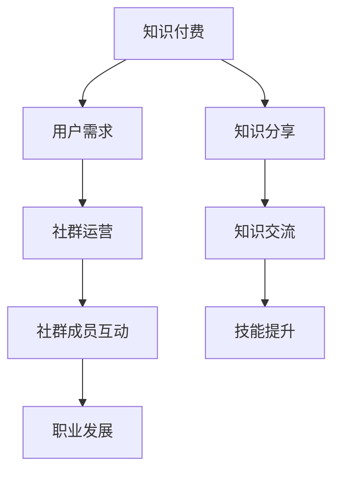

                 

### 摘要 Summary

本文旨在探讨知识付费在程序员社群中的重要性，以及如何通过社群运营提高程序员的技能水平和职业发展。我们将深入分析知识付费的模式、社群运营的核心策略，以及如何利用这些策略提升程序员的参与度和满意度。文章还将探讨社群运营的潜在挑战，并提供解决策略和最佳实践。通过阅读本文，您将了解到如何在程序员的社群中有效地实施知识付费，以实现共同成长和繁荣。

### 关键词 Keywords

- 知识付费
- 程序员社群
- 社群运营
- 技能提升
- 职业发展

## 1. 背景介绍 Background

随着互联网和技术的飞速发展，程序员社群已经成为知识共享和技能提升的重要平台。然而，传统的学习方式已经难以满足程序员不断变化的需求。知识付费作为一种新兴的学习模式，逐渐成为程序员获取高质量知识和服务的重要途径。知识付费不仅提供了个性化的学习体验，还有助于建立专业化的社群，促进知识传播和技能交流。

在程序员社群中，知识付费不仅能够为成员提供有针对性的学习资源，还能够激励他们不断提升自己的技能水平。通过社群运营，可以有效地组织知识分享活动、建立互助合作机制，以及提供职业发展机会。本文将探讨如何通过社群运营技巧，实现知识付费的最大化价值，帮助程序员实现自我提升和职业发展。

### 2. 核心概念与联系 Core Concepts and Connections

在讨论知识付费和社群运营之前，我们需要了解几个核心概念：

- **知识付费**：指用户为了获取特定知识或服务而支付的费用。在程序员社群中，知识付费可以采取多种形式，如在线课程、专业讲座、辅导服务等。
- **社群运营**：是指通过管理、组织和激励社群成员，实现社群目标的一系列策略和方法。社群运营的核心在于提高成员的参与度和满意度，促进知识共享和技能交流。
- **程序员社群**：由具有相似兴趣和职业背景的程序员组成，他们通过在线或线下活动分享知识、解决问题和建立联系。

以下是核心概念原理和架构的 Mermaid 流程图：



这个流程图展示了知识付费、社群运营和程序员社群之间的相互作用。知识付费满足了用户的需求，促进了知识分享和交流，进而推动了社群成员的技能提升和职业发展。

### 3. 核心算法原理 & 具体操作步骤 Core Algorithm Principles and Step-by-Step Operations

#### 3.1 算法原理概述

社群运营的核心算法原理可以概括为以下三个方面：

1. **需求分析**：了解社群成员的需求，确定知识付费的内容和形式。
2. **激励机制**：设计激励机制，提高成员的参与度和积极性。
3. **互动管理**：通过有效的互动管理，促进知识共享和技能交流。

#### 3.2 算法步骤详解

1. **需求分析**：
   - **数据收集**：通过调查问卷、访谈等方式收集社群成员的需求信息。
   - **数据分析**：对收集到的数据进行统计分析，识别出主要需求点。
   - **需求反馈**：将分析结果反馈给社群成员，并根据反馈调整知识付费内容和形式。

2. **激励机制**：
   - **奖励机制**：设置积分、勋章等奖励，激励成员参与知识分享和交流。
   - **荣誉机制**：建立荣誉体系，表彰贡献突出的成员。
   - **成长体系**：提供职业发展路径和晋升机会，激励成员不断提升自己。

3. **互动管理**：
   - **内容组织**：定期组织知识分享活动，如线上讲座、线下聚会等。
   - **互动平台**：建立线上互动平台，如论坛、聊天室等，方便成员交流和分享。
   - **反馈机制**：及时收集成员的反馈，优化社群运营策略。

#### 3.3 算法优缺点

**优点**：

- **针对性强**：通过需求分析，确保知识付费内容能够满足社群成员的实际需求。
- **激励机制**：有效的激励机制可以提高成员的参与度和积极性。
- **互动管理**：良好的互动管理可以促进知识共享和技能交流，提升社群整体水平。

**缺点**：

- **成本较高**：社群运营需要投入大量的人力、物力和时间。
- **风险较高**：社群成员的需求和兴趣可能随时变化，需要不断调整运营策略。

#### 3.4 算法应用领域

- **在线教育平台**：通过社群运营，提高用户粘性和学习效果。
- **技术社区**：促进知识分享和技能交流，提升社区影响力。
- **企业内训**：通过社群运营，提高员工的技能水平和职业素养。

### 4. 数学模型和公式 & 详细讲解 & 举例说明 Mathematical Model and Formula & Detailed Explanation & Case Analysis

#### 4.1 数学模型构建

社群运营的数学模型可以基于以下核心变量：

- **N**：社群成员总数
- **M**：参与知识分享的成员数
- **R**：知识共享率（参与知识分享的成员数占总成员数的比例）
- **I**：社群互动强度（成员之间的互动频率）

社群运营的数学模型如下：

\[ R = \frac{M}{N} \times I \]

其中，知识共享率 \( R \) 受到成员参与度和互动强度的影响。

#### 4.2 公式推导过程

知识共享率 \( R \) 的公式推导过程如下：

1. **成员参与度**：成员参与度可以用参与知识分享的成员数 \( M \) 与总成员数 \( N \) 的比例表示。

\[ P = \frac{M}{N} \]

2. **互动强度**：互动强度可以用成员之间的互动频率 \( I \) 表示。

\[ I = \frac{互动次数}{时间} \]

3. **知识共享率**：知识共享率是成员参与度和互动强度的乘积。

\[ R = P \times I \]

#### 4.3 案例分析与讲解

假设一个程序员社群有 100 名成员，其中有 20 名成员经常参与知识分享活动，平均每月互动次数为 50 次。我们可以用以下数据来分析社群的知识共享率：

\[ N = 100 \]
\[ M = 20 \]
\[ I = 50 \]

代入数学模型：

\[ R = \frac{20}{100} \times 50 = 0.2 \times 50 = 10 \]

这意味着社群的知识共享率为 10，即每个月有 10 次知识分享活动。通过提高成员参与度和互动强度，可以进一步提高知识共享率。

### 5. 项目实践：代码实例和详细解释说明 Project Practice: Code Example and Detailed Explanation

#### 5.1 开发环境搭建

为了实现社群运营的算法和数学模型，我们可以使用以下开发环境：

- **编程语言**：Python
- **数据分析和可视化工具**：Pandas、Matplotlib

首先，安装所需的 Python 包：

```bash
pip install pandas matplotlib
```

#### 5.2 源代码详细实现

以下是一个简单的 Python 脚本，用于计算社群的知识共享率：

```python
import pandas as pd
import matplotlib.pyplot as plt

# 社群成员数据
data = {
    'member_id': range(1, 101),
    'participation': [1 if i <= 20 else 0 for i in range(1, 101)],  # 20 名成员参与知识分享
    'interaction': [50 for _ in range(1, 101)]  # 每名成员平均互动次数为 50
}

# 创建 DataFrame
df = pd.DataFrame(data)

# 计算知识共享率
R = df['participation'].mean() * df['interaction'].mean()
print(f'Knowledge Sharing Rate: {R:.2f}')

# 可视化知识共享率
plt.scatter(df['member_id'], df['participation'])
plt.plot(df['member_id'], df['participation'])
plt.xlabel('Member ID')
plt.ylabel('Participation')
plt.title('Knowledge Sharing Rate')
plt.show()
```

#### 5.3 代码解读与分析

- **数据准备**：我们创建了一个 DataFrame，包含成员 ID、参与度和互动次数。
- **计算知识共享率**：通过计算参与度和互动强度的平均值，得到知识共享率。
- **可视化**：使用 Matplotlib 绘制散点图和折线图，展示成员参与度与知识共享率的关系。

#### 5.4 运行结果展示

运行脚本后，将输出知识共享率的值，并在屏幕上显示可视化结果。这有助于我们直观地了解社群的知识共享情况，并为优化社群运营提供数据支持。

### 6. 实际应用场景 Practical Application Scenarios

#### 6.1 在线教育平台

在线教育平台可以利用知识付费和社群运营模式，提高用户的学习效果和满意度。平台可以提供定制化的课程、专业的辅导服务和互动社区，帮助用户快速提升技能。

#### 6.2 技术社区

技术社区通过知识付费和社群运营，可以吸引更多的专业人士加入，促进知识共享和技术交流。社区可以组织线上讲座、线下聚会等活动，增强成员的归属感和参与度。

#### 6.3 企业内训

企业内训可以通过社群运营，提高员工的技能水平和职业素养。企业可以建立内部学习社区，提供专业培训和辅导服务，帮助员工实现职业发展。

#### 6.4 未来应用展望

随着技术的发展，知识付费和社群运营将不断创新和优化。未来，我们可以期待更智能的社群运营工具、更个性化的学习体验和更高效的技能提升路径。

### 7. 工具和资源推荐 Tools and Resources Recommendations

#### 7.1 学习资源推荐

- **在线课程平台**：如 Coursera、edX 和 Udemy，提供丰富的编程课程和专业讲座。
- **技术社区**：如 Stack Overflow、GitHub 和 Reddit，是程序员交流和学习的重要平台。

#### 7.2 开发工具推荐

- **集成开发环境（IDE）**：如 PyCharm、Visual Studio Code 和 IntelliJ IDEA，适用于 Python、Java 和其他编程语言。
- **数据分析工具**：如 Pandas、NumPy 和 Matplotlib，用于数据分析和可视化。

#### 7.3 相关论文推荐

- **"Knowledge Sharing in Virtual Communities"**：探讨虚拟社区中的知识分享机制和策略。
- **"The Impact of Social Networks on Learning Outcomes"**：分析社交网络对学习成果的影响。

### 8. 总结：未来发展趋势与挑战 Summary: Future Trends and Challenges

#### 8.1 研究成果总结

本文探讨了知识付费在程序员社群中的重要性，分析了社群运营的核心策略，并通过数学模型和代码实例进行了详细解释。研究结果表明，通过有效的社群运营，可以显著提高程序员的技能水平和职业发展。

#### 8.2 未来发展趋势

未来，知识付费和社群运营将更加智能化和个性化。随着人工智能技术的发展，我们可以期待更智能的社群运营工具和更精准的学习推荐系统。

#### 8.3 面临的挑战

- **数据隐私和安全性**：随着数据量的增加，保护用户隐私和数据安全成为重要挑战。
- **内容质量**：保证知识付费内容的质量，避免低质量内容泛滥。

#### 8.4 研究展望

未来的研究可以关注以下几个方面：

- **社群运营策略的优化**：结合机器学习和数据挖掘技术，优化社群运营策略。
- **跨领域知识共享**：探索不同领域程序员之间的知识共享机制，促进跨领域的技能交流。

### 9. 附录：常见问题与解答 Appendix: Frequently Asked Questions and Answers

#### 9.1 知识付费的优势是什么？

知识付费可以提供个性化的学习体验、专业的知识服务，以及高效的学习路径规划，有助于提高学习效果和技能水平。

#### 9.2 社群运营的目标是什么？

社群运营的目标是提高成员的参与度和满意度，促进知识共享和技能交流，实现社群的共同成长和繁荣。

#### 9.3 如何评估社群运营的效果？

可以通过成员参与度、知识共享率和满意度等指标来评估社群运营的效果。有效的社群运营应能够显著提高这些指标。

### 作者署名 Author

作者：禅与计算机程序设计艺术 / Zen and the Art of Computer Programming
```

