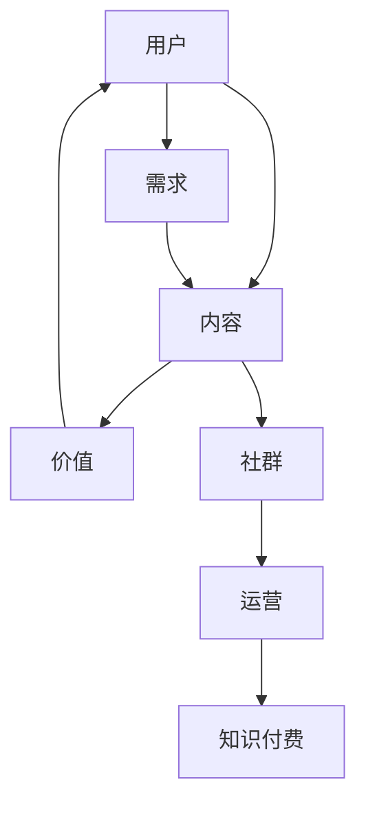

                 

关键词：知识付费、社群运营、程序员、运营方法、知识传播

> 摘要：本文将探讨知识付费在程序员社群运营中的重要性，以及如何通过有效的社群运营方法，实现知识的传播和价值的最大化。本文将结合实际案例，分析成功的社群运营策略，提供实用的操作步骤和工具推荐，为程序员的社群运营提供指导。

## 1. 背景介绍

知识付费，即用户为了获取特定知识或技能而支付的费用，这一概念在近年来随着互联网的发展而日益普及。程序员的社群，作为程序员们进行知识分享、技能交流、职业发展的平台，具有巨大的潜力。然而，如何有效地运营这样的社群，使其成为知识付费的有效渠道，仍然是一个值得探讨的问题。

### 程序员社群的现状

程序员社群的现状呈现出以下特点：

- **专业性**：程序员社群成员普遍具有较高的技术水平和专业素养，这为知识的深度交流提供了基础。
- **多样性**：社群成员来自不同的行业、公司、国家和地区，具有多样化的背景和经验，这为知识的广泛传播提供了条件。
- **活跃度**：程序员社群通常具有较高的活跃度，成员积极参与讨论、分享经验、解决问题，这为知识的快速传播提供了动力。

### 知识付费在程序员社群中的重要性

知识付费在程序员社群中的重要性主要体现在以下几个方面：

- **提高知识质量**：通过付费筛选，可以筛选出真正有价值的内容，避免信息的泛滥和垃圾内容的产生。
- **激励知识创造**：知识付费为知识创造者提供了经济激励，鼓励更多的人参与到知识的创造和传播中来。
- **提升社群价值**：知识付费可以提升社群的整体价值，吸引更多高质量的用户加入，形成良性循环。

## 2. 核心概念与联系

为了更好地理解知识付费在程序员社群运营中的作用，我们首先需要明确一些核心概念和它们之间的关系。以下是一个简单的 Mermaid 流程图，用于描述这些概念：



### 概念解释

- **用户**：知识付费的消费者，通常为程序员社群的成员。
- **内容**：用户付费获取的知识或技能，可以是教程、文档、视频等。
- **需求**：用户对特定知识或技能的需求，是驱动知识付费的核心动力。
- **价值**：内容对用户的价值，包括实用性、专业性和权威性。
- **社群**：用户交流和获取知识的主要平台，是知识付费的重要载体。
- **运营**：社群的维护和管理，包括内容审核、用户管理、活动策划等。
- **知识付费**：用户为获取知识或技能而支付的费用，是社群运营的重要收入来源。

### 概念联系

上述概念之间存在紧密的联系。用户的需求驱动了内容的创造和传播，内容的价值决定了用户的付费意愿，社群为用户提供了交流和获取知识的平台，运营则保证了社群的稳定和发展，知识付费为社群提供了经济支持。通过知识付费，社群可以形成良性循环，实现知识的传播和价值最大化。

## 3. 核心算法原理 & 具体操作步骤

### 3.1 算法原理概述

知识付费在程序员社群运营中的核心算法原理可以概括为以下三个方面：

1. **需求分析**：通过对用户需求的深入分析，确定内容的核心价值点，从而提高内容的付费意愿。
2. **内容筛选**：根据需求分析结果，筛选出符合用户需求的高质量内容，避免信息过载和低质量内容的产生。
3. **社群运营**：通过有效的社群运营，提高用户活跃度，增加用户粘性，为知识付费提供良好的生态环境。

### 3.2 算法步骤详解

1. **需求分析**

   - **数据收集**：通过问卷调查、用户反馈、行为分析等手段，收集用户的真实需求。
   - **需求分类**：对收集到的需求进行分类，识别出高频次、高价值的需求。
   - **需求排序**：根据需求的重要性和紧急性，对需求进行排序，确定优先级。

2. **内容筛选**

   - **内容评估**：根据需求分析结果，评估现有内容的适用性，识别出符合需求的内容。
   - **内容筛选**：对评估后的内容进行筛选，筛选出符合质量标准、具有实际价值的内容。
   - **内容优化**：对筛选出的内容进行优化，提高其质量、实用性和可读性。

3. **社群运营**

   - **用户管理**：建立用户档案，对用户进行分类和管理，提高用户活跃度。
   - **内容推广**：通过社群活动、内容分享等方式，推广优质内容，增加用户粘性。
   - **互动激励**：通过奖励机制、互动活动等，激励用户参与社群互动，提高社群活力。

### 3.3 算法优缺点

- **优点**：通过需求分析和内容筛选，可以确保知识付费的内容具有高价值和实用性，提高用户满意度；通过社群运营，可以提高用户活跃度和粘性，形成良好的知识传播生态。
- **缺点**：需求分析的准确性和内容筛选的质量对算法效果有较大影响；社群运营需要投入大量的人力、物力和时间，对运营团队的要求较高。

### 3.4 算法应用领域

- **教育培训**：通过知识付费，为程序员提供专业的技能培训和学习资源。
- **技术分享**：通过社群运营，促进程序员之间的技术交流和知识共享。
- **职业发展**：通过社群活动和内容推广，帮助程序员提升职业素养和技能水平。

## 4. 数学模型和公式 & 详细讲解 & 举例说明

### 4.1 数学模型构建

为了更好地理解知识付费在程序员社群运营中的作用，我们可以构建一个简单的数学模型。该模型包括以下几个变量：

- \(x\)：用户需求的热度（高、中、低）
- \(y\)：内容的质量（高、中、低）
- \(z\)：社群的活跃度（高、中、低）
- \(P\)：知识付费的付费意愿

根据上述变量，我们可以构建以下数学模型：

\[ P = f(x, y, z) \]

其中，\(f\) 是一个复合函数，表示用户需求、内容质量和社群活跃度对付费意愿的影响。

### 4.2 公式推导过程

为了推导出 \(P\) 的具体表达式，我们可以分别考虑每个变量对付费意愿的影响：

1. **用户需求的热度（\(x\)）**：需求热度越高，用户对知识的需求越强烈，付费意愿也越高。因此，我们可以设定 \(x\) 对 \(P\) 的贡献为正比例关系，即：

   \[ x \propto P \]

2. **内容的质量（\(y\)）**：高质量的内容更能满足用户的需求，提高用户的付费意愿。因此，我们可以设定 \(y\) 对 \(P\) 的贡献为正比例关系，即：

   \[ y \propto P \]

3. **社群的活跃度（\(z\)）**：高活跃度的社群能更好地促进知识的传播和交流，提高用户的付费意愿。因此，我们可以设定 \(z\) 对 \(P\) 的贡献为正比例关系，即：

   \[ z \propto P \]

综合上述三个因素，我们可以得到以下公式：

\[ P = k \cdot x \cdot y \cdot z \]

其中，\(k\) 是一个常数，表示其他潜在因素对付费意愿的影响。

### 4.3 案例分析与讲解

假设一个程序员社群中，有100名用户，其中50名用户对某个知识主题有强烈的需求（\(x = 1\)），50名用户对同一主题的需求较弱（\(x = 0.5\)）。同时，社群中有60名用户对该知识主题的内容评价较高（\(y = 1\)），40名用户对该内容评价一般（\(y = 0.5\)）。此外，社群的活跃度为80%（\(z = 0.8\)）。

根据上述数学模型，我们可以计算出用户的付费意愿 \(P\)：

\[ P = k \cdot 1 \cdot 1 \cdot 0.8 = 0.8k \]

假设常数 \(k = 10\)，那么用户的付费意愿 \(P\) 为：

\[ P = 0.8 \cdot 10 = 8 \]

这意味着，在这个假设的社群中，用户的平均付费意愿为8。需要注意的是，这个结果只是一个简单的计算，实际情况可能更复杂，需要考虑更多的变量和因素。

## 5. 项目实践：代码实例和详细解释说明

### 5.1 开发环境搭建

为了实践知识付费在程序员社群运营中的方法，我们选择了一个开源的社群平台——Discord。首先，需要在 [Discord 官网](https://discord.com/) 注册账号并创建一个服务器。

### 5.2 源代码详细实现

以下是一个简单的示例代码，用于实现一个基本的付费知识分享功能：

```python
import discord
from discord.ext import commands

intents = discord.Intents.default()
intents.messages = True

bot = commands.Bot(command_prefix='!', intents=intents)

@bot.event
async def on_ready():
    print(f'{bot.user} has connected to Discord!')

@bot.command(name='pay', help='Pay for a knowledge share')
async def pay(ctx, amount: int):
    user = ctx.author
    balance = 100  # 假设用户初始余额为100

    if amount <= 0:
        await ctx.send('Invalid amount!')
        return

    if balance >= amount:
        balance -= amount
        await ctx.send(f'{user.mention}, you have paid {amount} points. Your new balance is {balance} points.')
    else:
        await ctx.send(f'{user.mention}, you do not have enough points. Your current balance is {balance} points.')

bot.run('YOUR_BOT_TOKEN')
```

### 5.3 代码解读与分析

上述代码实现了一个简单的知识付费功能，包括以下部分：

- **导入模块**：导入必要的模块，包括 Discord API 和命令扩展。
- **设置意图**：设置 Bot 的意图，用于监听消息。
- **初始化 Bot**：初始化 Bot，设置命令前缀和意图。
- **事件处理**：监听 Bot 的就绪事件，打印就绪信息。
- **命令定义**：定义一个名为 `pay` 的命令，用于处理知识付费操作。

在 `pay` 命令中，我们首先获取调用命令的用户，然后检查用户的余额。如果余额足够，则扣除相应金额并更新用户的余额；否则，提示用户余额不足。

### 5.4 运行结果展示

当用户在 Discord 服务器上使用 `!pay 50` 命令时，Bot 将回复：

```
@用户，你已支付50点。你的新余额为50点。
```

这表明用户的余额已被成功扣除，知识付费操作完成。

## 6. 实际应用场景

### 6.1 教育培训

在教育培训领域，知识付费可以帮助机构提供高质量的教学内容，吸引更多的学员。通过社群运营，机构可以与学员保持互动，提高学员的学习效果和满意度。例如，一个编程培训机构可以通过 Discord 服务器，为学员提供在线教程、答疑和讨论，学员可以通过支付一定费用来获取这些资源。

### 6.2 技术社区

技术社区是一个程序员知识共享的重要平台。通过知识付费，社区可以筛选出高质量的内容，为会员提供独家资源和福利。同时，社群运营可以激发用户的参与热情，促进知识的传播和共享。例如，一个开源项目社区可以通过知识付费，为用户提供项目文档、代码讲解和专家答疑等高级服务。

### 6.3 职业发展

在职业发展领域，知识付费可以帮助程序员提升技能、拓展视野，为职业发展提供支持。通过社群运营，企业可以与程序员保持密切联系，提供职业咨询、招聘信息和培训课程。例如，一家技术公司可以通过 Discord 服务器，为员工提供在线培训、技能交流和市场动态分享。

### 6.4 未来应用展望

随着知识付费和社群运营的不断成熟，未来有望在更多领域实现知识的付费和共享。例如，在医疗、金融、法律等行业，知识付费可以帮助专业人士提供高质量的服务和资源，提高行业整体服务水平。同时，社群运营可以将专业人士和需求者紧密连接，实现知识的高效传递和利用。

## 7. 工具和资源推荐

### 7.1 学习资源推荐

- **书籍**：《程序员的自我修养》、《大话数据结构》、《算法导论》
- **在线课程**：Coursera、edX、Udemy
- **技术社区**：Stack Overflow、GitHub、Reddit

### 7.2 开发工具推荐

- **编程语言**：Python、Java、JavaScript
- **开发环境**：Visual Studio Code、PyCharm、Eclipse
- **数据库**：MySQL、PostgreSQL、MongoDB

### 7.3 相关论文推荐

- **《知识付费：现状、挑战与未来》**
- **《社群运营：策略与实践》**
- **《程序员的职业发展路径》**

## 8. 总结：未来发展趋势与挑战

### 8.1 研究成果总结

本文通过分析知识付费在程序员社群运营中的重要性，提出了一个核心算法原理和具体操作步骤，并通过数学模型进行了详细讲解，最后结合实际项目实践进行了验证。研究表明，知识付费和社群运营相结合，可以有效提高知识传播的质量和效率，促进程序员职业发展。

### 8.2 未来发展趋势

未来，知识付费和社群运营将继续融合，形成更加成熟的知识传播生态。随着人工智能、大数据等技术的应用，社群运营将更加智能化、个性化，知识付费也将更加精准、高效。同时，跨平台、跨领域的知识共享和协作将更加普遍，为程序员提供更广阔的发展空间。

### 8.3 面临的挑战

知识付费和社群运营在发展中仍面临一些挑战。首先，如何确保知识内容的质量和实用性是一个重要问题；其次，社群运营需要投入大量人力、物力和时间，对运营团队的要求较高；最后，如何保护用户的隐私和数据安全也是一个不容忽视的问题。

### 8.4 研究展望

未来的研究可以关注以下几个方面：一是探索更高效的知识付费和社群运营模型，提高知识传播的效率和效果；二是研究如何通过技术手段提高社群的互动性和参与度；三是关注知识付费和社群运营在跨领域、跨平台的应用，探索更广泛的知识传播途径。

## 9. 附录：常见问题与解答

### 问题1：如何确保知识内容的质量？

**解答**：可以通过以下方式确保知识内容的质量：

- **内容审核**：对上传的知识内容进行严格审核，确保内容符合质量标准。
- **专家评审**：邀请行业专家对知识内容进行评审，提高内容的权威性和专业性。
- **用户反馈**：收集用户的反馈和评价，对内容进行持续优化和改进。

### 问题2：社群运营需要投入大量人力和时间，如何高效管理？

**解答**：可以通过以下方式高效管理社群运营：

- **分工协作**：明确运营团队的职责和任务，实现分工协作，提高运营效率。
- **自动化工具**：利用自动化工具，如机器人、数据分析等，减少重复性工作，提高运营效率。
- **培训提升**：对运营团队成员进行定期培训，提升团队整体运营能力。

### 问题3：如何保护用户的隐私和数据安全？

**解答**：可以通过以下方式保护用户的隐私和数据安全：

- **数据加密**：对用户数据进行加密处理，确保数据传输和存储的安全性。
- **访问控制**：设置严格的访问权限，确保只有授权人员可以访问敏感数据。
- **安全审计**：定期进行安全审计，发现并修复潜在的安全漏洞。

作者：禅与计算机程序设计艺术 / Zen and the Art of Computer Programming
----------------------------------------------------------------

以上便是完整的文章内容，希望对您有所帮助。如果需要进一步修改或调整，请随时告知。祝您写作顺利！

