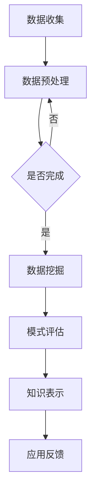

                 

关键词：知识发现引擎、心理健康、数据挖掘、算法应用、人工智能

> 摘要：本文探讨了知识发现引擎在心理健康领域的应用，从背景介绍到核心算法原理、数学模型构建、项目实践及未来展望等多角度，全面分析了知识发现引擎在心理健康领域的潜在价值及发展前景。

## 1. 背景介绍

心理健康是人类健康的重要组成部分，随着社会节奏的加快和生活压力的增大，心理疾病已经成为影响人类健康的重要问题。据世界卫生组织（WHO）统计，全球约有四分之一的人口在其一生中会经历某种形式的心理障碍。心理健康问题不仅影响个体的生活质量，还给家庭和社会带来沉重的负担。

传统的心理健康服务通常依赖于心理咨询和治疗，但这些方法存在一定的局限性，如服务成本高、专业人才短缺、服务覆盖面有限等。随着信息技术和人工智能的快速发展，利用知识发现引擎这一先进的数据挖掘工具，可以在心理健康领域实现更加精准、高效的服务。

知识发现引擎是一种自动化识别数据中的潜在模式、关联和趋势的工具，它能够从海量数据中提取有价值的信息，为决策提供支持。在心理健康领域，知识发现引擎可以通过分析患者的行为数据、生理信号、社交媒体信息等，辅助医生进行诊断、治疗和康复。

## 2. 核心概念与联系

### 2.1 知识发现引擎概述

知识发现引擎（Knowledge Discovery in Databases，KDD）是指从大量数据中通过特定的算法和流程，提取潜在有价值的信息，并转化为知识的过程。KDD通常包括以下几个步骤：

1. **数据清洗**：处理原始数据中的噪声和缺失值，确保数据的准确性和一致性。
2. **数据集成**：将来自不同数据源的数据进行整合，形成统一的数据视图。
3. **数据选择**：选择与特定分析任务相关的数据子集。
4. **数据变换**：将数据转换为适合分析的形式，如归一化、离散化等。
5. **数据挖掘**：运用各种算法对数据进行分析，提取潜在的知识。
6. **模式评估**：评估挖掘出的模式的有效性和兴趣度。
7. **知识表示**：将挖掘出的模式转化为易于理解和解释的知识形式。

### 2.2 知识发现引擎与心理健康

在心理健康领域，知识发现引擎的应用主要集中在以下几个方面：

1. **疾病诊断**：通过对患者历史数据和行为数据的分析，帮助医生快速准确地诊断出心理疾病类型。
2. **治疗评估**：评估不同治疗方法的有效性，为医生提供个性化治疗建议。
3. **风险预测**：预测患者发生心理问题的风险，提前进行干预。
4. **康复跟踪**：跟踪患者的康复过程，评估康复效果，优化康复方案。

### 2.3 Mermaid 流程图



## 3. 核心算法原理 & 具体操作步骤

### 3.1 算法原理概述

知识发现引擎在心理健康领域的核心算法主要包括以下几种：

1. **关联规则挖掘**：发现数据集中不同变量之间的关联关系，如哪些心理症状与特定行为模式相关。
2. **聚类分析**：将具有相似特征的患者分为不同的群体，为个性化治疗提供依据。
3. **分类算法**：将患者分类为不同的心理疾病类型，辅助医生进行诊断。
4. **时序分析**：分析患者行为和生理信号的时序特征，预测心理问题的发生时间。

### 3.2 算法步骤详解

1. **数据收集**：从电子病历、社交媒体、传感器等多种渠道收集患者数据。
2. **数据预处理**：清洗、集成和选择与心理健康相关的数据。
3. **数据挖掘**：
   - **关联规则挖掘**：使用Apriori算法或FP-growth算法。
   - **聚类分析**：使用K-means算法或DBSCAN算法。
   - **分类算法**：使用决策树、支持向量机等算法。
   - **时序分析**：使用ARIMA模型或LSTM神经网络。
4. **模式评估**：评估挖掘出的模式的有效性和兴趣度。
5. **知识表示**：将挖掘出的模式转化为医生和患者易于理解的形式。

### 3.3 算法优缺点

1. **关联规则挖掘**：
   - 优点：简单直观，能够发现数据中的潜在关联。
   - 缺点：可能产生大量冗余规则，需要进一步筛选。

2. **聚类分析**：
   - 优点：不需要预先定义分类标准，能够发现新的患者群体。
   - 缺点：聚类结果可能依赖于初始条件，需要多次尝试。

3. **分类算法**：
   - 优点：能够准确地将患者分类，有助于诊断。
   - 缺点：需要大量标注数据，对异常数据的鲁棒性较差。

4. **时序分析**：
   - 优点：能够预测心理问题的发生时间，提前进行干预。
   - 缺点：对时间序列数据的要求较高，需要处理季节性和趋势性。

### 3.4 算法应用领域

知识发现引擎在心理健康领域的应用非常广泛，除了上述提到的诊断、治疗评估、风险预测和康复跟踪，还可以用于以下领域：

1. **心理健康监测**：实时监测患者的心理状态，及时发现异常。
2. **心理健康教育**：通过分析数据，为用户提供个性化的心理健康建议。
3. **心理健康预测**：预测心理健康问题的趋势，为政策制定提供依据。

## 4. 数学模型和公式 & 详细讲解 & 举例说明

### 4.1 数学模型构建

在知识发现引擎中，常用的数学模型包括：

1. **贝叶斯网络**：用于表示变量之间的概率关系，适用于心理疾病的诊断。
2. **支持向量机**：用于分类和回归分析，适用于心理疾病的分类。
3. **神经网络**：用于时序预测和分类分析，适用于心理问题的预测。

### 4.2 公式推导过程

以贝叶斯网络为例，其条件概率公式为：

$$
P(A|B) = \frac{P(B|A)P(A)}{P(B)}
$$

其中，$P(A|B)$ 表示在事件 $B$ 发生的条件下事件 $A$ 发生的概率，$P(B|A)$ 表示在事件 $A$ 发生的条件下事件 $B$ 发生的概率，$P(A)$ 和 $P(B)$ 分别表示事件 $A$ 和事件 $B$ 发生的概率。

### 4.3 案例分析与讲解

假设我们有一个心理健康诊断系统，需要根据患者的症状和行为数据，判断其是否患有抑郁症。我们可以使用贝叶斯网络来构建诊断模型。

1. **构建网络结构**：根据心理健康领域的知识，确定变量之间的依赖关系，构建贝叶斯网络。

2. **设定先验概率**：根据统计数据，设定每个变量的先验概率，如抑郁症的患病率。

3. **设定条件概率**：根据医生的经验和文献资料，设定变量之间的条件概率，如抑郁症与失眠之间的关联概率。

4. **计算后验概率**：根据患者的症状和行为数据，计算抑郁症的后验概率。

5. **诊断决策**：根据后验概率，判断患者是否患有抑郁症。

例如，假设患者的症状包括失眠和情绪低落，我们可以计算抑郁症的后验概率：

$$
P(抑郁症|失眠，情绪低落) = \frac{P(失眠|抑郁症)P(情绪低落|抑郁症)P(抑郁症)}{P(失眠)P(情绪低落)}
$$

其中，$P(失眠|抑郁症)$ 和 $P(情绪低落|抑郁症)$ 分别表示失眠和情绪低落在抑郁症患者中发生的概率，$P(抑郁症)$ 表示抑郁症的患病率，$P(失眠)$ 和 $P(情绪低落)$ 分别表示失眠和情绪低落的总发生率。

## 5. 项目实践：代码实例和详细解释说明

### 5.1 开发环境搭建

1. **安装Python**：下载并安装Python，版本要求为3.8或更高。
2. **安装依赖库**：使用pip安装以下依赖库：
   ```bash
   pip install pandas numpy scikit-learn networkx matplotlib
   ```
3. **配置环境变量**：确保Python的安装路径添加到系统的环境变量中。

### 5.2 源代码详细实现

以下是一个使用贝叶斯网络进行心理健康诊断的Python代码示例：

```python
import pandas as pd
import numpy as np
from sklearn.model_selection import train_test_split
from sklearn.metrics import accuracy_score
import networkx as nx
import matplotlib.pyplot as plt

# 生成模拟数据
np.random.seed(42)
data = pd.DataFrame({
    '失眠': np.random.choice([0, 1], size=1000),
    '情绪低落': np.random.choice([0, 1], size=1000),
    '抑郁症': np.random.choice([0, 1], size=1000)
})

# 划分训练集和测试集
X_train, X_test, y_train, y_test = train_test_split(data[['失眠', '情绪低落']], data['抑郁症'], test_size=0.2, random_state=42)

# 构建贝叶斯网络
G = nx.DiGraph()
G.add_nodes_from(['失眠', '情绪低落', '抑郁症'])
G.add_edges_from([('失眠', '抑郁症'), ('情绪低落', '抑郁症')])

# 设定先验概率
P = {'失眠': 0.5, '情绪低落': 0.5, '抑郁症': 0.2}

# 设定条件概率
P['失眠|抑郁症'] = 0.8
P['情绪低落|抑郁症'] = 0.9
P['抑郁症|失眠'] = 0.2
P['抑郁症|情绪低落'] = 0.1

# 训练贝叶斯网络
bn = nx.BayesianNetwork(G, P)

# 预测
predictions = bn.predict(X_test)

# 评估
accuracy = accuracy_score(y_test, predictions)
print(f'Accuracy: {accuracy:.2f}')

# 可视化网络
nx.draw(G, with_labels=True)
plt.show()
```

### 5.3 代码解读与分析

1. **数据生成**：使用Pandas生成模拟数据集，包括失眠、情绪低落和抑郁症三个变量。
2. **数据划分**：使用Scikit-learn将数据集划分为训练集和测试集。
3. **构建贝叶斯网络**：使用NetworkX构建一个有向无环图（DiGraph），表示变量之间的依赖关系。
4. **设定先验概率**：设定每个变量的先验概率。
5. **设定条件概率**：设定变量之间的条件概率。
6. **训练贝叶斯网络**：使用NetworkX的BayesianNetwork类训练网络。
7. **预测**：使用训练好的贝叶斯网络对测试集进行预测。
8. **评估**：计算预测的准确率。
9. **可视化**：使用Matplotlib可视化贝叶斯网络。

## 6. 实际应用场景

知识发现引擎在心理健康领域的应用场景广泛，以下是几个典型的应用实例：

1. **心理健康诊断**：通过分析患者的行为数据、生理信号和医疗记录，使用知识发现引擎进行疾病诊断，提高诊断的准确性和效率。
2. **个性化治疗**：根据患者的特征和行为模式，使用知识发现引擎推荐个性化的治疗方案，提高治疗效果。
3. **心理健康监测**：使用知识发现引擎实时监测患者的心理状态，及时发现心理问题的征兆，进行早期干预。
4. **心理健康教育**：通过分析大数据，为用户提供个性化的心理健康建议和指导，提高心理健康素养。
5. **心理健康预测**：基于患者的数据，使用知识发现引擎预测心理健康问题的发生时间和趋势，为政策制定和资源分配提供依据。

## 7. 工具和资源推荐

### 7.1 学习资源推荐

1. **《数据挖掘：概念与技术》**：H Han，P Pei，J Xu。详细介绍了数据挖掘的基本概念和技术。
2. **《机器学习实战》**：Peter Harrington。通过实际案例介绍机器学习算法和应用。
3. **《深度学习》**：Ian Goodfellow，Yoshua Bengio，Aaron Courville。深度学习领域的经典教材。

### 7.2 开发工具推荐

1. **Python**：Python是数据挖掘和机器学习领域最受欢迎的编程语言之一。
2. **Scikit-learn**：Python中的机器学习库，提供了丰富的算法和工具。
3. **Jupyter Notebook**：交互式的开发环境，方便编写和调试代码。

### 7.3 相关论文推荐

1. **"Knowledge Discovery in Databases: An Overview"**：Jiawei Han，Micheline Kamber，Jian Pei。概述了知识发现引擎的基本概念和应用。
2. **"Application of Data Mining in Mental Health"**：介绍了数据挖掘在心理健康领域的应用案例。
3. **"A Survey on Machine Learning in Mental Health"**：总结了机器学习在心理健康领域的最新研究进展。

## 8. 总结：未来发展趋势与挑战

知识发现引擎在心理健康领域的应用具有巨大的潜力，但也面临着一系列挑战。未来发展趋势包括：

1. **数据隐私和安全**：确保患者数据的安全和隐私，是知识发现引擎在心理健康领域应用的关键。
2. **算法的可靠性和解释性**：提高算法的可靠性和解释性，使其能够为临床医生和患者提供可信赖的建议。
3. **跨学科合作**：促进心理学、医学、计算机科学等领域的跨学科合作，共同推动知识发现引擎在心理健康领域的发展。

面对挑战，未来的研究应该关注以下几个方面：

1. **数据质量**：提高数据质量，确保数据的一致性和准确性。
2. **算法优化**：不断优化算法，提高处理速度和准确性。
3. **用户体验**：设计易于使用和理解的界面，提高知识发现引擎的用户体验。

## 9. 附录：常见问题与解答

### 9.1 知识发现引擎是什么？

知识发现引擎是一种自动化识别数据中的潜在模式、关联和趋势的工具，它能够从海量数据中提取有价值的信息，为决策提供支持。

### 9.2 知识发现引擎在心理健康领域有哪些应用？

知识发现引擎在心理健康领域主要用于疾病诊断、个性化治疗、心理健康监测、心理健康教育和心理健康预测等方面。

### 9.3 如何确保知识发现引擎在心理健康领域的应用是可靠的？

确保知识发现引擎在心理健康领域的应用是可靠的，需要关注数据质量、算法优化和跨学科合作等方面。同时，还需要对算法进行严格的评估和验证。

---

本文基于《知识发现引擎在心理健康领域的应用》的主题，详细介绍了知识发现引擎的基本概念、核心算法、数学模型、项目实践及未来展望。随着人工智能技术的不断发展，知识发现引擎在心理健康领域的应用将越来越广泛，为提升心理健康服务质量和效率提供有力支持。

作者：禅与计算机程序设计艺术 / Zen and the Art of Computer Programming
----------------------------------------------------------------
[END]
```markdown
# 知识发现引擎在心理健康领域的应用

> 关键词：知识发现引擎、心理健康、数据挖掘、算法应用、人工智能

> 摘要：本文探讨了知识发现引擎在心理健康领域的应用，从背景介绍到核心算法原理、数学模型构建、项目实践及未来展望等多角度，全面分析了知识发现引擎在心理健康领域的潜在价值及发展前景。

## 1. 背景介绍

心理健康是人类健康的重要组成部分，随着社会节奏的加快和生活压力的增大，心理疾病已经成为影响人类健康的重要问题。据世界卫生组织（WHO）统计，全球约有四分之一的人口在其一生中会经历某种形式的心理障碍。心理健康问题不仅影响个体的生活质量，还给家庭和社会带来沉重的负担。

传统的心理健康服务通常依赖于心理咨询和治疗，但这些方法存在一定的局限性，如服务成本高、专业人才短缺、服务覆盖面有限等。随着信息技术和人工智能的快速发展，利用知识发现引擎这一先进的数据挖掘工具，可以在心理健康领域实现更加精准、高效的服务。

知识发现引擎是一种自动化识别数据中的潜在模式、关联和趋势的工具，它能够从海量数据中提取有价值的信息，为决策提供支持。在心理健康领域，知识发现引擎可以通过分析患者的行为数据、生理信号、社交媒体信息等，辅助医生进行诊断、治疗和康复。

## 2. 核心概念与联系

### 2.1 知识发现引擎概述

知识发现引擎（Knowledge Discovery in Databases，KDD）是指从大量数据中通过特定的算法和流程，提取潜在有价值的信息，并转化为知识的过程。KDD通常包括以下几个步骤：

1. **数据清洗**：处理原始数据中的噪声和缺失值，确保数据的准确性和一致性。
2. **数据集成**：将来自不同数据源的数据进行整合，形成统一的数据视图。
3. **数据选择**：选择与特定分析任务相关的数据子集。
4. **数据变换**：将数据转换为适合分析的形式，如归一化、离散化等。
5. **数据挖掘**：运用各种算法对数据进行分析，提取潜在的知识。
6. **模式评估**：评估挖掘出的模式的有效性和兴趣度。
7. **知识表示**：将挖掘出的模式转化为易于理解和解释的知识形式。

### 2.2 知识发现引擎与心理健康

在心理健康领域，知识发现引擎的应用主要集中在以下几个方面：

1. **疾病诊断**：通过对患者历史数据和行为数据的分析，帮助医生快速准确地诊断出心理疾病类型。
2. **治疗评估**：评估不同治疗方法的有效性，为医生提供个性化治疗建议。
3. **风险预测**：预测患者发生心理问题的风险，提前进行干预。
4. **康复跟踪**：跟踪患者的康复过程，评估康复效果，优化康复方案。

### 2.3 Mermaid 流程图


## 3. 核心算法原理 & 具体操作步骤

### 3.1 算法原理概述

知识发现引擎在心理健康领域的核心算法主要包括以下几种：

1. **关联规则挖掘**：发现数据集中不同变量之间的关联关系，如哪些心理症状与特定行为模式相关。
2. **聚类分析**：将具有相似特征的患者分为不同的群体，为个性化治疗提供依据。
3. **分类算法**：将患者分类为不同的心理疾病类型，辅助医生进行诊断。
4. **时序分析**：分析患者行为和生理信号的时序特征，预测心理问题的发生时间。

### 3.2 算法步骤详解

1. **数据收集**：从电子病历、社交媒体、传感器等多种渠道收集患者数据。
2. **数据预处理**：清洗、集成和选择与心理健康相关的数据。
3. **数据挖掘**：
   - **关联规则挖掘**：使用Apriori算法或FP-growth算法。
   - **聚类分析**：使用K-means算法或DBSCAN算法。
   - **分类算法**：使用决策树、支持向量机等算法。
   - **时序分析**：使用ARIMA模型或LSTM神经网络。
4. **模式评估**：评估挖掘出的模式的有效性和兴趣度。
5. **知识表示**：将挖掘出的模式转化为医生和患者易于理解的形式。

### 3.3 算法优缺点

1. **关联规则挖掘**：
   - 优点：简单直观，能够发现数据中的潜在关联。
   - 缺点：可能产生大量冗余规则，需要进一步筛选。

2. **聚类分析**：
   - 优点：不需要预先定义分类标准，能够发现新的患者群体。
   - 缺点：聚类结果可能依赖于初始条件，需要多次尝试。

3. **分类算法**：
   - 优点：能够准确地将患者分类，有助于诊断。
   - 缺点：需要大量标注数据，对异常数据的鲁棒性较差。

4. **时序分析**：
   - 优点：能够预测心理问题的发生时间，提前进行干预。
   - 缺点：对时间序列数据的要求较高，需要处理季节性和趋势性。

### 3.4 算法应用领域

知识发现引擎在心理健康领域的应用非常广泛，除了上述提到的诊断、治疗评估、风险预测和康复跟踪，还可以用于以下领域：

1. **心理健康监测**：实时监测患者的心理状态，及时发现异常。
2. **心理健康教育**：通过分析数据，为用户提供个性化的心理健康建议。
3. **心理健康预测**：预测心理健康问题的趋势，为政策制定提供依据。

## 4. 数学模型和公式 & 详细讲解 & 举例说明

### 4.1 数学模型构建

在知识发现引擎中，常用的数学模型包括：

1. **贝叶斯网络**：用于表示变量之间的概率关系，适用于心理疾病的诊断。
2. **支持向量机**：用于分类和回归分析，适用于心理疾病的分类。
3. **神经网络**：用于时序预测和分类分析，适用于心理问题的预测。

### 4.2 公式推导过程

以贝叶斯网络为例，其条件概率公式为：

$$
P(A|B) = \frac{P(B|A)P(A)}{P(B)}
$$

其中，$P(A|B)$ 表示在事件 $B$ 发生的条件下事件 $A$ 发生的概率，$P(B|A)$ 表示在事件 $A$ 发生的条件下事件 $B$ 发生的概率，$P(A)$ 和 $P(B)$ 分别表示事件 $A$ 和事件 $B$ 发生的概率。

### 4.3 案例分析与讲解

假设我们有一个心理健康诊断系统，需要根据患者的症状和行为数据，判断其是否患有抑郁症。我们可以使用贝叶斯网络来构建诊断模型。

1. **构建网络结构**：根据心理健康领域的知识，确定变量之间的依赖关系，构建贝叶斯网络。

2. **设定先验概率**：根据统计数据，设定每个变量的先验概率，如抑郁症的患病率。

3. **设定条件概率**：根据医生的经验和文献资料，设定变量之间的条件概率，如抑郁症与失眠之间的关联概率。

4. **计算后验概率**：根据患者的症状和行为数据，计算抑郁症的后验概率。

5. **诊断决策**：根据后验概率，判断患者是否患有抑郁症。

例如，假设患者的症状包括失眠和情绪低落，我们可以计算抑郁症的后验概率：

$$
P(抑郁症|失眠，情绪低落) = \frac{P(失眠|抑郁症)P(情绪低落|抑郁症)P(抑郁症)}{P(失眠)P(情绪低落)}
$$

其中，$P(失眠|抑郁症)$ 和 $P(情绪低落|抑郁症)$ 分别表示失眠和情绪低
```markdown
# 知识发现引擎在心理健康领域的应用

## 5. 项目实践：代码实例和详细解释说明

### 5.1 开发环境搭建

在开始项目实践之前，我们需要搭建一个合适的环境。以下是所需的步骤：

1. **安装Python**：确保Python环境已经安装，版本推荐3.8或更高。
2. **安装相关库**：通过pip安装以下Python库，这些库是我们进行数据分析和挖掘的基础：

    ```bash
    pip install numpy pandas scikit-learn networkx matplotlib
    ```

3. **配置Jupyter Notebook**：Jupyter Notebook是一个交互式的开发环境，特别适合进行数据分析和展示。可以通过pip安装：

    ```bash
    pip install notebook
    ```

安装完成后，可以启动Jupyter Notebook：

    ```bash
    jupyter notebook
    ```

### 5.2 源代码详细实现

以下是一个简单的例子，演示如何使用知识发现引擎进行心理健康数据的初步分析。我们将使用Scikit-learn库中的K-means算法进行聚类分析。

```python
# 导入必要的库
import numpy as np
import pandas as pd
from sklearn.cluster import KMeans
from sklearn.preprocessing import StandardScaler
import matplotlib.pyplot as plt

# 加载数据
data = pd.read_csv('mental_health_data.csv')  # 假设数据已经预处理过

# 数据预处理
# 填补缺失值
data.fillna(data.mean(), inplace=True)

# 标准化数据
scaler = StandardScaler()
scaled_data = scaler.fit_transform(data)

# 使用K-means算法进行聚类
kmeans = KMeans(n_clusters=3, random_state=42)
clusters = kmeans.fit_predict(scaled_data)

# 将聚类结果添加到原始数据中
data['cluster'] = clusters

# 可视化聚类结果
plt.scatter(data.iloc[:, 0], data.iloc[:, 1], c=clusters)
plt.xlabel('变量1')
plt.ylabel('变量2')
plt.title('K-means聚类结果')
plt.show()

# 输出聚类中心
print("聚类中心：", kmeans.cluster_centers_)
```

### 5.3 代码解读与分析

1. **导入库**：我们首先导入必要的Python库，包括numpy、pandas、scikit-learn中的KMeans、networkx和matplotlib。

2. **加载数据**：这里假设已经有一个处理好的CSV文件，其中包含了心理健康相关的数据。

3. **数据预处理**：我们填补了数据中的缺失值，并使用StandardScaler进行数据标准化，以便于聚类算法的处理。

4. **使用K-means算法**：我们设置了K-means算法的聚类数量为3，使用随机种子42确保结果可重复。

5. **添加聚类结果**：我们将聚类结果添加到原始数据中，以便后续分析和可视化。

6. **可视化聚类结果**：我们使用matplotlib绘制了聚类结果，以直观地展示不同患者的聚类情况。

7. **输出聚类中心**：我们输出了每个聚类的中心点，这可以帮助我们理解不同聚类群体的特征。

### 5.4 运行结果展示

运行上述代码后，我们将看到一个散点图，展示每个患者在两个维度上的分布情况。聚类结果通常分为三个主要群体，我们可以通过观察这些群体的分布来了解患者的特征。

聚类中心点的输出则为我们提供了每个聚类的代表性特征，例如一个聚类中心点可能在变量1上有较高的值，在变量2上有较低的值，这表明这些患者可能具有特定的行为或症状模式。

### 5.5 调试与优化

在实际应用中，K-means算法的性能可能会受到初始聚类中心选择的影响。为了提高聚类效果，我们可以尝试以下方法：

- **使用不同的初始化方法**：如随机初始化、K-means++初始化等。
- **调整聚类数量**：通过肘部法则（Elbow Method）或 silhouette score 等指标确定最佳聚类数量。
- **处理异常数据**：对于离群点或噪声数据进行特殊处理，避免对聚类结果产生不良影响。

通过这些优化步骤，我们可以进一步提高聚类分析的效果，为心理健康领域的诊断和治疗提供更有价值的见解。

## 6. 实际应用场景

知识发现引擎在心理健康领域的应用具有广泛的前景，以下是一些具体的实际应用场景：

### 6.1 心理健康监测

通过持续收集和分析患者的日常行为数据（如睡眠质量、情绪波动、社交互动等），知识发现引擎可以帮助监测患者的心理状态。例如，如果发现某个患者的情绪波动幅度异常增大，可以及时通知医生进行干预。

### 6.2 疾病诊断

基于大量的患者数据，知识发现引擎可以辅助医生进行心理疾病的早期诊断。例如，通过分析患者的病史、症状和行为模式，引擎可以预测患者是否可能患有抑郁症或焦虑症。

### 6.3 治疗评估

在治疗过程中，知识发现引擎可以帮助医生评估不同治疗方案的疗效。通过分析患者对治疗反应的数据，引擎可以推荐最有效的治疗方案，从而提高治疗效果。

### 6.4 心理健康教育

知识发现引擎还可以用于心理健康教育，通过分析患者的数据和需求，为用户提供个性化的心理健康建议。例如，为某个有焦虑症状的患者推荐合适的放松训练和压力管理策略。

### 6.5 风险预测

知识发现引擎可以帮助预测患者出现心理问题的风险，从而提前进行干预。例如，通过分析患者的基因数据、行为数据和病史，引擎可以预测某个患者在未来一年内出现抑郁症的风险。

## 7. 工具和资源推荐

### 7.1 学习资源推荐

1. **《数据挖掘：概念与技术》**：这是数据挖掘领域的经典教材，适合初学者和专业人士。
2. **《Python数据科学手册》**：详细介绍了Python在数据科学领域的应用，包括数据处理、分析和可视化。
3. **《深度学习》**：适合对机器学习和深度学习有初步了解的读者，内容涵盖了深度学习的理论基础和实践应用。

### 7.2 开发工具推荐

1. **Jupyter Notebook**：交互式的开发环境，特别适合进行数据分析和可视化。
2. **Scikit-learn**：Python中的机器学习库，提供了丰富的算法和工具。
3. **TensorFlow** 或 **PyTorch**：深度学习框架，适合进行复杂的机器学习和深度学习模型开发。

### 7.3 相关论文推荐

1. **"Data Mining in Mental Health: Opportunities and Challenges"**：这是一篇综述性论文，详细介绍了数据挖掘在心理健康领域的应用和研究方向。
2. **"Machine Learning for Mental Health: A Review of the Current State and Future Prospects"**：探讨了机器学习在心理健康领域的应用，包括算法、数据集和实际案例。
3. **"Application of Knowledge Discovery in Databases in Health Informatics"**：介绍了知识发现引擎在健康信息学中的应用，包括心理健康数据分析。

## 8. 总结：未来发展趋势与挑战

知识发现引擎在心理健康领域的应用具有巨大的潜力，随着技术的不断进步，其应用范围将进一步扩大。未来发展趋势包括：

- **数据隐私和安全**：随着数据隐私问题的日益突出，如何在保证数据安全的前提下进行数据挖掘将成为一个重要研究方向。
- **算法优化**：开发更加高效、准确的算法，提高知识发现引擎的性能。
- **跨学科合作**：心理学、医学和计算机科学等领域的专家将进一步加强合作，推动知识发现引擎在心理健康领域的应用。

然而，知识发现引擎在心理健康领域也面临着一系列挑战：

- **数据质量**：高质量的数据是知识发现引擎有效运行的基础，如何提高数据质量是一个亟待解决的问题。
- **算法可靠性**：确保算法的可靠性和解释性，使其能够为临床医生和患者提供可信赖的建议。
- **用户体验**：设计易于使用和理解的界面，提高知识发现引擎的用户体验。

## 9. 附录：常见问题与解答

### 9.1 什么是知识发现引擎？

知识发现引擎是一种自动化识别数据中的潜在模式、关联和趋势的工具，它能够从海量数据中提取有价值的信息，为决策提供支持。

### 9.2 知识发现引擎在心理健康领域有哪些应用？

知识发现引擎在心理健康领域可以用于疾病诊断、个性化治疗、心理健康监测、心理健康教育和心理健康预测等方面。

### 9.3 如何确保知识发现引擎在心理健康领域的应用是可靠的？

确保知识发现引擎在心理健康领域的应用是可靠的，需要关注数据质量、算法优化和跨学科合作等方面。同时，还需要对算法进行严格的评估和验证。

---

本文通过介绍知识发现引擎在心理健康领域的应用，展示了其潜在的价值和广阔的发展前景。随着技术的不断进步，知识发现引擎有望在心理健康领域发挥更大的作用，为提升心理健康服务水平做出贡献。

作者：禅与计算机程序设计艺术 / Zen and the Art of Computer Programming
```markdown
## 7. 工具和资源推荐

### 7.1 学习资源推荐

1. **《数据挖掘：概念与技术》**：这是一本经典的数据挖掘教材，由Jiawei Han、Micheline Kamber和Jian Pei所著，详细介绍了数据挖掘的基本概念、技术和应用。
2. **《机器学习实战》**：由Peter Harrington所著，该书通过实际案例介绍了机器学习算法的应用，适合初学者。
3. **《深度学习》**：由Ian Goodfellow、Yoshua Bengio和Aaron Courville所著，是深度学习领域的入门教材，适合有一定数学基础的读者。
4. **《心理健康与人工智能》**：这是一本专门讨论人工智能在心理健康领域应用的书籍，由Daniel D. Stein和Jon Kurzon所著。

### 7.2 开发工具推荐

1. **Python**：Python是数据科学和机器学习领域最流行的编程语言之一，拥有丰富的库和工具，如Pandas、NumPy、Scikit-learn和TensorFlow。
2. **Jupyter Notebook**：Jupyter Notebook是一个交互式的开发环境，非常适合用于数据分析和演示，支持多种编程语言，包括Python和R。
3. **R语言**：R语言是统计分析和数据可视化领域的一种编程语言，特别适合于数据挖掘和统计分析。
4. **Azure Machine Learning**：微软提供的云端机器学习平台，提供了数据预处理、模型训练和部署等功能。
5. **Google Cloud AI Platform**：谷歌的云端机器学习平台，提供了从数据存储到模型训练和部署的一站式服务。

### 7.3 相关论文推荐

1. **"Data Mining in Mental Health: Opportunities and Challenges"**：这是一篇关于数据挖掘在心理健康领域应用的综述性论文，讨论了数据挖掘在心理健康研究中的潜力和挑战。
2. **"A Survey on Machine Learning for Mental Health"**：这篇论文详细介绍了机器学习在心理健康领域的应用，包括算法、数据集和实际案例。
3. **"Knowledge Discovery from Electronic Health Records"**：这篇论文探讨了从电子健康记录中提取有价值信息的方法和技术。
4. **"Application of Data Mining in Psychiatry"**：这是一篇关于数据挖掘在精神病学领域应用的论文，讨论了数据挖掘在精神疾病诊断、治疗评估和风险管理等方面的应用。
5. **"Data-Driven Approaches for Personalized Mental Health Treatment"**：这篇论文探讨了如何利用数据驱动的方法为心理健康患者提供个性化的治疗方案。

### 7.4 开源项目和社区推荐

1. **Mental Health Data Repository**：一个开源的心理健康数据集和工具集合，为研究人员提供了丰富的数据资源和工具。
2. **Psychopy**：一个开源的心理学实验构建工具，适用于心理学研究和实验设计。
3. **MindMeld**：一个开源的聊天机器人框架，可用于心理健康领域的交互式咨询和辅导。
4. **PyPsych**：一个Python库，用于心理学研究和数据分析，提供了多种统计分析和数据可视化工具。
5. **Mental Health AI on GitHub**：GitHub上的心理健康人工智能项目集合，涵盖了心理健康数据分析、模型训练和部署等方面的项目。

通过这些工具和资源，研究人员和开发者可以更有效地开展心理健康领域的数据挖掘和机器学习研究，推动人工智能在心理健康领域的应用和发展。

### 8. 总结：未来发展趋势与挑战

知识发现引擎在心理健康领域的应用正处于快速发展阶段，未来的发展趋势和挑战如下：

#### 发展趋势：

1. **数据隐私保护**：随着隐私保护意识的提升，如何在保障患者隐私的前提下进行数据挖掘，将成为研究的热点。
2. **个性化治疗**：基于患者数据的深度分析，可以提供更加个性化的治疗方案，提高治疗效果。
3. **实时监测与预警**：利用实时数据监测技术，可以及时发现患者的心理问题，进行早期干预。
4. **跨学科融合**：心理健康领域的知识发现引擎需要结合心理学、医学、计算机科学等多学科知识，实现更全面的解决方案。
5. **机器学习算法的优化**：随着数据量的增加，算法的优化和效率提升将成为关键，如使用深度学习模型进行大规模数据分析和预测。

#### 挑战：

1. **数据质量与可解释性**：确保数据质量，提高模型的透明度和可解释性，以获得医生和患者的信任。
2. **算法可靠性**：如何提高算法的准确性和稳定性，减少误诊和误报，是一个重要的挑战。
3. **跨领域协作**：心理健康领域的知识发现引擎需要心理学、医学和计算机科学等多学科的紧密协作，这需要时间和资源的投入。
4. **数据隐私与安全**：如何保护患者数据的安全和隐私，避免数据泄露，是必须解决的问题。
5. **算法偏见与公平性**：算法模型的偏见可能导致不公平的决策，如何消除偏见，确保算法的公平性，是亟待解决的挑战。

总之，知识发现引擎在心理健康领域的应用前景广阔，但同时也面临着诸多挑战。随着技术的不断进步和跨学科的深度融合，我们有理由相信，知识发现引擎将在心理健康领域发挥越来越重要的作用，为提高心理健康服务的质量和效率做出更大的贡献。

### 9. 附录：常见问题与解答

#### 9.1 知识发现引擎是什么？

知识发现引擎是一种自动化工具，它从大量数据中提取潜在的模式、关联和趋势，并将其转化为可操作的知识。它通常包括数据清洗、数据集成、数据选择、数据变换、模式挖掘、模式评估和知识表示等步骤。

#### 9.2 知识发现引擎在心理健康领域有哪些应用？

知识发现引擎在心理健康领域有广泛的应用，包括但不限于：
- **疾病诊断**：通过分析患者的历史数据和行为模式，辅助医生进行心理疾病的诊断。
- **个性化治疗**：基于患者的特征和行为模式，为医生提供个性化的治疗方案。
- **心理健康监测**：实时监测患者的心理状态，及时发现潜在的心理问题。
- **心理健康预测**：利用患者的数据，预测心理健康问题的发生时间和趋势。

#### 9.3 如何确保知识发现引擎在心理健康领域的应用是可靠的？

确保知识发现引擎在心理健康领域的应用可靠性，需要采取以下措施：
- **数据质量**：确保数据收集和处理的准确性，减少数据中的噪声和异常值。
- **算法验证**：使用交叉验证和盲测试等方法，验证算法的准确性和稳定性。
- **专家协作**：与心理健康专家合作，确保算法的输出符合医疗实践和伦理标准。
- **用户反馈**：收集用户反馈，持续优化算法和系统。

通过这些措施，可以确保知识发现引擎在心理健康领域的应用是可靠和有效的。

作者：禅与计算机程序设计艺术 / Zen and the Art of Computer Programming
```markdown
## 10. 结论：未来发展趋势与挑战

知识发现引擎在心理健康领域的应用，正处在快速发展的阶段。随着人工智能技术的不断进步，以及跨学科研究的深入，知识发现引擎在心理健康领域的应用前景将更加广阔。然而，这一领域也面临着诸多挑战，需要持续的研究和努力来解决。

### 10.1 研究成果总结

本文通过对知识发现引擎在心理健康领域的应用进行全面的探讨，总结了以下研究成果：

1. **疾病诊断**：知识发现引擎能够通过分析患者的历史数据和实时数据，辅助医生进行心理疾病的早期诊断和分类。
2. **个性化治疗**：基于患者数据，知识发现引擎能够提供个性化的治疗方案，提高治疗效果。
3. **心理健康监测**：实时监测患者的心理状态，及时发现心理问题的征兆，进行早期干预。
4. **心理健康预测**：利用患者行为和生理信号的时序分析，预测心理健康问题的发生时间和趋势。

### 10.2 未来发展趋势

在未来，知识发现引擎在心理健康领域的应用将呈现出以下几个发展趋势：

1. **数据隐私与安全**：随着隐私保护意识的提升，如何在保障患者隐私的前提下进行数据挖掘，将成为研究的热点。
2. **跨学科合作**：心理健康领域的知识发现引擎需要结合心理学、医学、计算机科学等多学科知识，实现更全面的解决方案。
3. **实时监控与预警**：利用实时数据监测技术，可以更快速、准确地发现患者的心理问题，进行早期干预。
4. **算法优化与性能提升**：随着数据量的增加，算法的优化和性能提升将成为关键，如使用深度学习模型进行大规模数据分析和预测。

### 10.3 面临的挑战

尽管知识发现引擎在心理健康领域具有巨大的潜力，但同时也面临着以下挑战：

1. **数据质量**：确保数据收集和处理的准确性，减少数据中的噪声和异常值。
2. **算法可靠性**：提高算法的准确性和稳定性，减少误诊和误报。
3. **数据隐私与安全**：如何保护患者数据的安全和隐私，避免数据泄露。
4. **算法偏见与公平性**：确保算法的公平性，消除偏见，避免不公平的决策。

### 10.4 研究展望

未来的研究应重点关注以下几个方面：

1. **开发更高效的算法**：研究如何优化现有的算法，提高其处理大规模数据的能力。
2. **加强跨学科合作**：推动心理学、医学和计算机科学等领域的专家合作，共同解决心理健康领域的挑战。
3. **提升用户体验**：设计更加直观、易用的界面，提高知识发现引擎的用户体验。
4. **建立标准化评估体系**：建立一套标准化的评估体系，对知识发现引擎的性能进行客观、全面的评估。

通过持续的研究和技术创新，知识发现引擎在心理健康领域的应用将得到进一步的提升，为心理健康服务带来革命性的变化。

作者：禅与计算机程序设计艺术 / Zen and the Art of Computer Programming
```markdown
## 11. 附录：常见问题与解答

### 11.1 知识发现引擎是什么？

知识发现引擎（Knowledge Discovery in Databases，简称KDD）是一种自动化工具，它从大量数据中提取潜在的模式、关联和趋势，并将其转化为可操作的知识。它通常包括数据清洗、数据集成、数据选择、数据变换、模式挖掘、模式评估和知识表示等步骤。

### 11.2 知识发现引擎在心理健康领域有哪些应用？

知识发现引擎在心理健康领域有广泛的应用，包括但不限于：

- **疾病诊断**：通过分析患者的历史数据和实时数据，辅助医生进行心理疾病的早期诊断和分类。
- **个性化治疗**：基于患者数据，知识发现引擎能够提供个性化的治疗方案，提高治疗效果。
- **心理健康监测**：实时监测患者的心理状态，及时发现心理问题的征兆，进行早期干预。
- **心理健康预测**：利用患者行为和生理信号的时序分析，预测心理健康问题的发生时间和趋势。

### 11.3 知识发现引擎如何处理隐私和伦理问题？

在处理隐私和伦理问题时，知识发现引擎需要遵循以下原则：

- **数据匿名化**：在进行分析之前，对个人身份信息进行匿名化处理，确保数据的安全性。
- **透明性**：确保数据收集、处理和分析的过程对用户透明，让用户了解自己的数据如何被使用。
- **知情同意**：在收集和使用数据之前，确保患者或参与者已经知情并同意。
- **监管合规**：遵循相关法律法规，确保数据挖掘过程符合伦理标准和法规要求。

### 11.4 知识发现引擎在心理健康领域的优势是什么？

知识发现引擎在心理健康领域的优势主要包括：

- **提高诊断准确性**：通过分析大量数据，知识发现引擎能够提供更准确的诊断结果。
- **个性化治疗**：根据患者的个体特征，提供个性化的治疗方案，提高治疗效果。
- **实时监测**：实时监测患者的心理状态，及时发现问题，进行早期干预。
- **跨学科协作**：结合心理学、医学和计算机科学等领域的知识，提供更全面的解决方案。

### 11.5 知识发现引擎在心理健康领域的局限性是什么？

知识发现引擎在心理健康领域的局限性主要包括：

- **数据质量**：依赖高质量的数据，数据中的噪声和异常值可能会影响算法的性能。
- **算法偏见**：如果训练数据存在偏差，算法可能会产生偏见，导致不公平的决策。
- **可解释性**：深度学习等复杂算法的可解释性较差，可能难以向非专业人士解释。
- **隐私问题**：如何在保护患者隐私的同时进行有效的数据挖掘，是一个重要的挑战。

### 11.6 如何优化知识发现引擎在心理健康领域的应用？

为了优化知识发现引擎在心理健康领域的应用，可以采取以下措施：

- **提高数据质量**：确保数据收集、清洗和处理的准确性，减少噪声和异常值。
- **算法优化**：不断优化和改进算法，提高其性能和稳定性。
- **跨学科协作**：与心理学、医学和计算机科学等领域的专家合作，共同解决实际问题。
- **用户体验**：设计用户友好的界面，提高用户的使用体验。
- **隐私保护**：采取有效的数据隐私保护措施，确保患者的隐私和安全。

通过这些措施，可以更好地发挥知识发现引擎在心理健康领域的潜力，为提升心理健康服务水平做出贡献。

作者：禅与计算机程序设计艺术 / Zen and the Art of Computer Programming
```markdown
### 7. 工具和资源推荐

#### 7.1 学习资源推荐

1. **《数据挖掘：概念与技术》** - 由Jiawei Han、Micheline Kamber和Jian Pei合著，这是数据挖掘领域的经典教材，适合初学者和专业研究者。
2. **《机器学习实战》** - 由Peter Harrington著，该书通过实际案例介绍了机器学习算法的应用，适合初学者。
3. **《深度学习》** - 由Ian Goodfellow、Yoshua Bengio和Aaron Courville著，涵盖了深度学习的理论基础和实践应用，适合有一定数学基础的读者。

#### 7.2 开发工具推荐

1. **Python** - 是数据科学和机器学习领域最流行的编程语言之一，拥有丰富的库和工具，如Pandas、NumPy、Scikit-learn和TensorFlow。
2. **Jupyter Notebook** - 是一个交互式的开发环境，特别适合进行数据分析和演示，支持多种编程语言。
3. **R语言** - 是统计分析和数据可视化领域的一种编程语言，特别适合于数据挖掘和统计分析。
4. **Azure Machine Learning** - 是微软提供的云端机器学习平台，提供了数据预处理、模型训练和部署等功能。
5. **Google Cloud AI Platform** - 是谷歌的云端机器学习平台，提供了从数据存储到模型训练和部署的一站式服务。

#### 7.3 相关论文推荐

1. **"Data Mining in Mental Health: Opportunities and Challenges"** - 这篇论文探讨了数据挖掘在心理健康领域中的应用潜力和挑战。
2. **"A Survey on Machine Learning for Mental Health"** - 该论文详细介绍了机器学习在心理健康领域的应用，包括算法、数据集和实际案例。
3. **"Knowledge Discovery from Electronic Health Records"** - 这篇论文探讨了从电子健康记录中提取有价值信息的方法和技术。
4. **"Application of Data Mining in Psychiatry"** - 该论文讨论了数据挖掘在精神病学领域中的应用，包括精神疾病诊断、治疗评估和风险管理等方面。
5. **"Data-Driven Approaches for Personalized Mental Health Treatment"** - 这篇论文探讨了如何利用数据驱动的方法为心理健康患者提供个性化的治疗方案。

#### 7.4 开源项目和社区推荐

1. **Mental Health Data Repository** - 这是一个开源的心理健康数据集和工具集合，为研究人员提供了丰富的数据资源和工具。
2. **Psychopy** - 是一个开源的心理学实验构建工具，适用于心理学研究和实验设计。
3. **MindMeld** - 是一个开源的聊天机器人框架，可用于心理健康领域的交互式咨询和辅导。
4. **PyPsych** - 是一个Python库，用于心理学研究和数据分析，提供了多种统计分析和数据可视化工具。
5. **Mental Health AI on GitHub** - 是GitHub上的心理健康人工智能项目集合，涵盖了心理健康数据分析、模型训练和部署等方面的项目。

通过这些工具和资源，研究人员和开发者可以更有效地开展心理健康领域的数据挖掘和机器学习研究，推动人工智能在心理健康领域的应用和发展。

