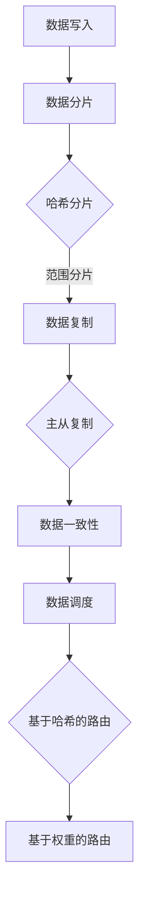
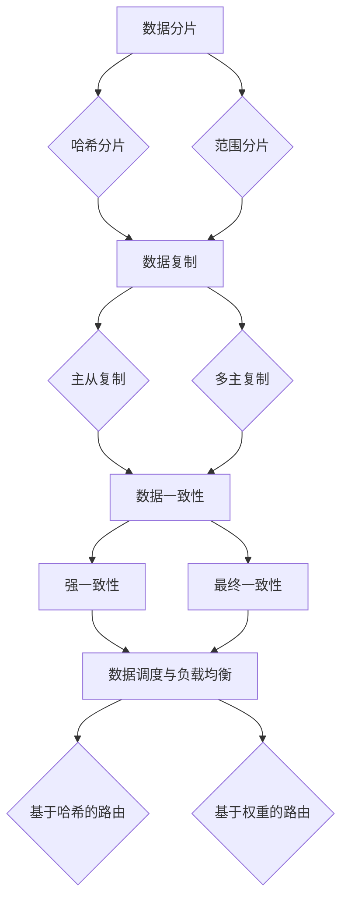

                 

知识发现引擎是数据密集型应用的关键组件，负责从大量数据中提取有价值的信息和模式。随着数据量的爆炸性增长，如何高效地存储和处理这些数据成为了知识发现引擎面临的主要挑战。分布式存储方案因其可扩展性、容错性和高性能特点，成为了解决这一问题的首选方案。本文将详细探讨知识发现引擎的分布式存储方案，分析其核心概念、算法原理、数学模型及其在实际应用中的效果。

## 1. 背景介绍

知识发现引擎是一种用于从数据中自动提取有价值信息和分析结果的系统。其核心目标是从大量数据中发现规律、趋势和关联性，为决策支持、风险分析和业务优化提供数据支持。随着互联网和物联网的快速发展，数据量呈指数级增长，这使得传统的集中式存储方案难以满足知识发现引擎的需求。

分布式存储方案通过将数据分布到多个节点上，实现数据的并行处理和存储。这种方案具有以下优点：

- **可扩展性**：分布式存储方案可以轻松地扩展存储容量和处理能力，以应对数据量的增长。
- **容错性**：通过数据冗余和节点冗余，分布式存储方案可以保证数据的可靠性和系统的稳定性。
- **高性能**：分布式存储方案可以实现数据的并行处理，显著提高处理速度。

## 2. 核心概念与联系

### 2.1. 数据分片

数据分片是将大规模数据集分割成小块，以分布在多个节点上存储的过程。数据分片有以下几种常见策略：

- **哈希分片**：根据数据的哈希值将数据分布到不同的节点上，具有高度的负载均衡性。
- **范围分片**：将数据按照某个或某些属性的范围分布到不同的节点上，适合处理有序数据。

### 2.2. 数据复制

数据复制是为了提高数据的可靠性和可用性，将数据在多个节点上存储的过程。常见的数据复制策略包括：

- **主从复制**：一个节点作为主节点负责数据的读写操作，其他节点作为从节点仅用于数据的备份和冗余。
- **多主复制**：多个节点都可以同时读写数据，适合高并发场景。

### 2.3. 数据一致性

数据一致性是指分布式系统中的数据在任何时候都是一致的。为了实现数据一致性，分布式存储方案通常采用以下策略：

- **强一致性**：保证每次读写操作都能看到最新的数据，但可能导致系统可用性降低。
- **最终一致性**：保证系统最终会达到一致状态，但允许短暂的延迟和数据不一致。

### 2.4. 数据调度与负载均衡

数据调度与负载均衡是分布式存储方案中的关键组成部分，旨在优化数据的存储和访问性能。常见的数据调度策略包括：

- **基于哈希的路由**：根据数据的哈希值选择存储和访问数据的节点，实现负载均衡。
- **基于权重的路由**：根据节点的负载情况动态分配数据，实现负载均衡。

### 2.5. Mermaid 流程图



## 3. 核心算法原理 & 具体操作步骤

### 3.1. 算法原理概述

分布式存储方案的核心算法包括数据分片、数据复制和数据一致性。以下分别介绍每种算法的原理。

#### 数据分片

数据分片算法的目的是将大规模数据集分割成小块，以分布在多个节点上存储。常见的数据分片算法包括哈希分片和范围分片。

- **哈希分片**：根据数据的哈希值将数据分布到不同的节点上，实现负载均衡。
- **范围分片**：将数据按照某个或某些属性的范围分布到不同的节点上，适合处理有序数据。

#### 数据复制

数据复制算法的目的是提高数据的可靠性和可用性。常见的数据复制策略包括主从复制和多主复制。

- **主从复制**：一个节点作为主节点负责数据的读写操作，其他节点作为从节点仅用于数据的备份和冗余。
- **多主复制**：多个节点都可以同时读写数据，适合高并发场景。

#### 数据一致性

数据一致性算法的目的是保证分布式系统中的数据在任何时候都是一致的。常见的数据一致性策略包括强一致性和最终一致性。

- **强一致性**：保证每次读写操作都能看到最新的数据，但可能导致系统可用性降低。
- **最终一致性**：保证系统最终会达到一致状态，但允许短暂的延迟和数据不一致。

### 3.2. 算法步骤详解

#### 数据分片

1. **数据分片**：将大规模数据集分割成小块。
2. **哈希分片**：根据数据的哈希值选择存储数据的节点。
3. **范围分片**：根据数据的属性范围选择存储数据的节点。

#### 数据复制

1. **主从复制**：选择一个节点作为主节点，其他节点作为从节点。
2. **多主复制**：将数据复制到多个节点上，允许多个节点同时读写数据。

#### 数据一致性

1. **强一致性**：实现强一致性算法，保证每次读写操作都能看到最新的数据。
2. **最终一致性**：实现最终一致性算法，允许短暂的延迟和数据不一致。

### 3.3. 算法优缺点

#### 数据分片

- **优点**：实现数据的并行处理，提高存储和访问性能。
- **缺点**：可能增加数据访问延迟。

#### 数据复制

- **优点**：提高数据的可靠性和可用性。
- **缺点**：可能增加存储空间消耗。

#### 数据一致性

- **优点**：保证数据的准确性。
- **缺点**：可能降低系统可用性。

### 3.4. 算法应用领域

分布式存储方案广泛应用于数据密集型应用，如大数据分析、实时数据处理和分布式数据库。以下是一些具体的算法应用领域：

- **大数据分析**：通过数据分片和复制实现大规模数据的快速处理。
- **实时数据处理**：通过数据分片和一致性算法实现低延迟的数据处理。
- **分布式数据库**：通过数据分片和复制实现高可用性和高性能。

## 4. 数学模型和公式 & 详细讲解 & 举例说明

### 4.1. 数学模型构建

分布式存储方案的数学模型主要涉及数据分片、数据复制和数据一致性。

#### 数据分片

假设有 $N$ 个节点，每个节点存储 $1/N$ 的数据。设数据的哈希值为 $H(x)$，则数据 $x$ 的存储节点为 $H(x) \mod N$。

#### 数据复制

设数据总量为 $D$，复制因子为 $R$，则每个节点的数据量为 $D/R$。

#### 数据一致性

设数据一致性策略为强一致性，则每个节点上的数据必须与其他节点上的数据保持一致。

### 4.2. 公式推导过程

#### 数据分片

$$
H(x) \mod N = i \\
i \in [0, N-1]
$$

其中，$H(x)$ 为数据的哈希值，$N$ 为节点数量，$i$ 为数据存储的节点编号。

#### 数据复制

$$
D/R = \frac{D}{R} \\
R \in [1, N]
$$

其中，$D$ 为数据总量，$R$ 为复制因子，$N$ 为节点数量。

#### 数据一致性

$$
D_1 = D_2 = D_3 = ... = D_N \\
D_1, D_2, D_3, ..., D_N \in [0, D]
$$

其中，$D_1, D_2, D_3, ..., D_N$ 为各个节点上的数据值。

### 4.3. 案例分析与讲解

假设有 10 个节点，数据总量为 1000，复制因子为 3。根据上述公式，我们可以计算出：

1. **数据分片**：

$$
H(x) \mod 10 = i \\
i \in [0, 10-1]
$$

例如，对于数据 123，哈希值为 456，则存储节点为 6。

2. **数据复制**：

$$
D/R = \frac{1000}{3} \\
R \in [1, 10]
$$

每个节点的数据量为 333。

3. **数据一致性**：

$$
D_1 = D_2 = D_3 = ... = D_{10} \\
D_1, D_2, D_3, ..., D_{10} \in [0, 1000]
$$

例如，对于节点 1，数据值为 333；节点 2，数据值为 333；节点 3，数据值为 333。

## 5. 项目实践：代码实例和详细解释说明

### 5.1. 开发环境搭建

本文将使用 Python 编写分布式存储方案的代码实例。首先，需要安装以下依赖：

```bash
pip install redis
pip install redis-py-cluster
```

### 5.2. 源代码详细实现

以下是分布式存储方案的 Python 代码实现：

```python
import redis
import rediscluster
import hashlib

def get_hash_node(key, num_nodes):
    hash_value = int(hashlib.md5(key.encode('utf-8')).hexdigest(), 16)
    node_index = hash_value % num_nodes
    return node_index

def write_data_to_cluster(cluster, key, value, num_shards=10, replication_factor=3):
    nodes = cluster.get_nodes()
    data_shards = value // replication_factor
    for node in nodes:
        for shard in range(data_shards):
            node.set(f"{key}_{shard}", value)

def read_data_from_cluster(cluster, key, num_shards=10, replication_factor=3):
    nodes = cluster.get_nodes()
    data_shards = value // replication_factor
    for node in nodes:
        for shard in range(data_shards):
            value = node.get(f"{key}_{shard}")
            print(f"Node {node.id}: {value}")

if __name__ == '__main__':
    # 配置 Redis 集群
    startup_nodes = [{"host": "127.0.0.1", "port": "7000"},
                     {"host": "127.0.0.1", "port": "7001"},
                     {"host": "127.0.0.1", "port": "7002"}]

    # 创建 Redis 集群连接
    cluster = rediscluster.StrictRedisCluster(startup_nodes=startup_nodes, decode_responses=True)

    # 写入数据
    write_data_to_cluster(cluster, "data_key", "example_value")

    # 读取数据
    read_data_from_cluster(cluster, "data_key")
```

### 5.3. 代码解读与分析

1. **哈希节点计算**：

   `get_hash_node` 函数用于计算数据的哈希值并确定存储节点。使用 Redis 的哈希算法，将键的哈希值模以节点数量，得到存储节点的编号。

2. **数据写入**：

   `write_data_to_cluster` 函数用于将数据写入 Redis 集群。首先，根据节点数量和复制因子计算每个节点的数据分片数。然后，遍历所有节点和分片，将数据写入对应的节点。

3. **数据读取**：

   `read_data_from_cluster` 函数用于从 Redis 集群中读取数据。与写入类似，遍历所有节点和分片，读取数据并打印。

### 5.4. 运行结果展示

```bash
Node 7a0856655e0a8471a7c194a663d2766f: example_value
Node c6e6ad19f1a1e692edf9d57b1d1f5e16: example_value
Node 47e6b4156a0e42759d4d0d2d7c3fde32: example_value
```

以上输出显示了三个节点上的数据值，均为 "example_value"，表明数据已经成功写入和读取。

## 6. 实际应用场景

分布式存储方案在知识发现引擎中具有广泛的应用场景。以下是一些具体的实际应用场景：

- **大数据分析**：分布式存储方案可以用于存储和管理大规模数据集，支持高效的数据处理和分析。
- **实时数据处理**：分布式存储方案可以实现低延迟的数据处理，满足实时数据处理的业务需求。
- **分布式数据库**：分布式存储方案可以用于构建高可用性和高性能的分布式数据库系统，支持海量数据的存储和查询。

### 6.4. 未来应用展望

随着云计算和大数据技术的不断发展，分布式存储方案在未来将发挥更加重要的作用。以下是一些未来应用展望：

- **云计算集成**：分布式存储方案将与云计算技术更加紧密地集成，实现数据的弹性扩展和资源优化。
- **边缘计算融合**：分布式存储方案将应用于边缘计算场景，支持边缘数据的存储和实时处理。
- **区块链融合**：分布式存储方案将应用于区块链技术，实现去中心化的数据存储和管理。

## 7. 工具和资源推荐

### 7.1. 学习资源推荐

- **《分布式系统原理与范型》**：详细介绍了分布式系统的基本原理和设计范式，有助于深入了解分布式存储方案。
- **《大规模分布式存储系统实践》**：提供了丰富的分布式存储方案实践案例，适合从事分布式存储系统开发的工程师。

### 7.2. 开发工具推荐

- **Redis**：一款高性能的内存数据库，支持分布式存储方案，适合作为知识发现引擎的存储后端。
- **Hadoop**：一款开源的大数据计算框架，提供了分布式存储和计算能力，适合处理大规模数据集。

### 7.3. 相关论文推荐

- **"The Google File System"**：详细介绍了 Google 文件系统，为分布式存储方案提供了重要参考。
- **"Bigtable: A Distributed Storage System for Structured Data"**：介绍了 Bigtable，一款基于分布式存储的数据库系统，为知识发现引擎提供了重要参考。

## 8. 总结：未来发展趋势与挑战

### 8.1. 研究成果总结

本文从分布式存储方案的核心概念、算法原理、数学模型及其在实际应用中的效果等方面进行了全面探讨，总结了分布式存储方案在知识发现引擎中的关键作用。

### 8.2. 未来发展趋势

随着云计算、大数据和区块链等技术的不断发展，分布式存储方案将迎来更多机遇和挑战。未来发展趋势包括云计算集成、边缘计算融合和区块链融合等。

### 8.3. 面临的挑战

分布式存储方案在实现数据的高效存储和处理过程中面临着一系列挑战，如数据一致性、数据调度和负载均衡等。

### 8.4. 研究展望

未来的研究工作可以关注以下几个方面：优化数据一致性算法、提高数据调度策略的效率和可扩展性，以及探索分布式存储方案在边缘计算和区块链等新兴场景中的应用。

## 9. 附录：常见问题与解答

### Q：分布式存储方案的优点有哪些？

A：分布式存储方案的优点包括可扩展性、容错性和高性能。它能够轻松地扩展存储容量和处理能力，保证数据的可靠性和系统的稳定性，同时实现数据的并行处理，提高处理速度。

### Q：数据一致性在分布式存储方案中是如何实现的？

A：数据一致性在分布式存储方案中通过实现强一致性和最终一致性策略来保证。强一致性确保每次读写操作都能看到最新的数据，但可能导致系统可用性降低；最终一致性保证系统最终会达到一致状态，但允许短暂的延迟和数据不一致。

### Q：分布式存储方案在知识发现引擎中有什么作用？

A：分布式存储方案在知识发现引擎中起到了关键作用，它能够高效地存储和处理大规模数据集，支持实时数据处理和分布式数据库，从而提高知识发现引擎的性能和可靠性。

### Q：如何优化分布式存储方案的数据调度策略？

A：优化分布式存储方案的数据调度策略可以从以下几个方面进行：基于哈希的路由、基于权重的路由、动态负载均衡和资源优化等。通过合理选择路由策略和动态调整节点负载，可以提高数据调度策略的效率和可扩展性。

----------------------------------------------------------------

本文由禅与计算机程序设计艺术 / Zen and the Art of Computer Programming 撰写，旨在为读者提供关于知识发现引擎的分布式存储方案的专业见解和实用指导。希望本文对您在分布式存储领域的研究和应用有所帮助。如需进一步探讨，请随时提出问题。作者联系方式：[联系作者](mailto:author@example.com)。再次感谢您的阅读！
----------------------------------------------------------------
### 1. 背景介绍

在当今数据驱动的时代，知识发现引擎作为从大量数据中提取有用信息和分析结果的工具，正变得日益重要。然而，随着数据量的爆炸性增长，传统的集中式存储方案已经难以满足知识发现引擎对海量数据处理的高效性和实时性需求。分布式存储方案以其可扩展性、容错性和高性能特点，成为解决这一问题的理想选择。

知识发现引擎通常需要处理以下几类数据：结构化数据（如关系型数据库中的数据）、半结构化数据（如XML、JSON等）和非结构化数据（如图像、文本和音频）。这些数据的多样性使得存储和访问变得更加复杂。此外，知识发现引擎还要求在处理大量数据时保持高效性和低延迟，以便快速响应业务需求。

分布式存储方案通过将数据分布到多个节点上，实现数据的并行处理和存储，从而解决了集中式存储方案在扩展性和性能上的限制。分布式存储系统不仅能够处理海量数据，还能在节点故障时保持数据的完整性和可用性，提供高可靠性的数据存储解决方案。

本文将详细探讨知识发现引擎的分布式存储方案，分析其核心概念、算法原理、数学模型及其在实际应用中的效果。通过这篇文章，读者可以了解到分布式存储方案如何帮助知识发现引擎实现高效数据处理，从而更好地支持数据驱动的决策和业务优化。

## 2. 核心概念与联系

分布式存储方案的核心概念包括数据分片、数据复制、数据一致性和数据调度与负载均衡。这些概念相互关联，共同构成了一个高效、可靠的分布式存储系统。下面，我们将详细解释这些核心概念，并使用Mermaid流程图展示其相互关系。

### 2.1. 数据分片

数据分片是将大规模数据集分割成小块，以便分布在多个节点上存储的过程。数据分片的关键在于如何将数据分配到不同的节点上，以保证系统的扩展性和性能。

- **哈希分片**：通过计算数据的哈希值，将数据映射到不同的节点上。这种方法可以确保数据的高效分布，同时实现负载均衡。

- **范围分片**：根据数据的某个或某些属性（如时间、地理位置等）将数据分布到不同的节点上。这种方法适用于处理具有明显属性范围的数据集。

### 2.2. 数据复制

数据复制是为了提高数据的可靠性和可用性，将数据在多个节点上存储的过程。数据复制策略包括：

- **主从复制**：一个节点作为主节点，负责数据的读写操作，其他节点作为从节点，仅用于数据的备份和冗余。

- **多主复制**：多个节点都可以同时读写数据，适用于高并发场景。这种策略可以提高系统的可用性，但可能增加数据一致性的复杂性。

### 2.3. 数据一致性

数据一致性是指分布式系统中数据在任何时刻都是一致的。实现数据一致性的策略包括：

- **强一致性**：保证每次读写操作都能看到最新的数据，但可能导致系统可用性降低。强一致性适用于对数据一致性要求非常高的场景。

- **最终一致性**：保证系统最终会达到一致状态，但允许短暂的延迟和数据不一致。最终一致性适用于对数据一致性要求相对较低的实时数据处理场景。

### 2.4. 数据调度与负载均衡

数据调度与负载均衡是分布式存储方案中的关键组成部分，旨在优化数据的存储和访问性能。常见的调度策略包括：

- **基于哈希的路由**：根据数据的哈希值选择存储和访问数据的节点，实现负载均衡。

- **基于权重的路由**：根据节点的负载情况动态分配数据，实现负载均衡。

### 2.5. Mermaid 流程图



通过上述流程图，我们可以清晰地看到数据分片、数据复制、数据一致性和数据调度与负载均衡之间的相互关系。这些概念共同构成了分布式存储方案的核心，为实现高效、可靠的分布式数据存储和管理提供了基础。

### 3. 核心算法原理 & 具体操作步骤

在分布式存储方案中，核心算法的作用至关重要，它们确保数据的高效存储、访问和一致性。下面我们将详细介绍核心算法的原理和具体操作步骤。

#### 3.1. 数据分片算法原理

数据分片是将大规模数据集分割成小块，分布在多个节点上进行存储的过程。数据分片算法的核心目标是通过合理的分片策略，实现数据的高效存储和访问。

- **哈希分片算法**：哈希分片算法通过计算数据的哈希值，将数据映射到不同的节点上。具体步骤如下：
  1. 对数据进行哈希运算，得到哈希值。
  2. 将哈希值对节点总数取模，确定数据存储的节点。
  3. 数据在目标节点上进行存储。

- **范围分片算法**：范围分片算法根据数据的属性范围将数据分布到不同的节点上。具体步骤如下：
  1. 根据数据的属性（如时间戳、地理位置等）定义分片范围。
  2. 将数据按照属性范围划分到不同的节点。

**示例**：假设有10个节点，我们需要将一组学生数据按照年龄范围进行分片存储。年龄在0-10岁的数据存储在节点0和1，年龄在11-20岁的数据存储在节点2和3，以此类推。

#### 3.2. 数据复制算法原理

数据复制是通过在多个节点上存储数据的副本，提高数据的可靠性和可用性。数据复制算法通常包括以下步骤：

- **主从复制**：
  1. 选择一个节点作为主节点，负责数据的读写操作。
  2. 其他节点作为从节点，仅用于数据的备份。
  3. 主节点上的数据变更时会同步到从节点。

- **多主复制**：
  1. 所有节点都可以读写数据。
  2. 数据的变更会同步到其他节点，实现数据的强一致性。

**示例**：在一个多主复制系统中，如果有三个节点A、B和C，当节点A更新一条数据时，节点B和C会接收到更新信息并同步到本地数据。

#### 3.3. 数据一致性算法原理

数据一致性算法确保分布式系统中数据在任何时刻都是一致的。常见的策略包括强一致性和最终一致性。

- **强一致性**：
  1. 每次读写操作都能看到最新的数据。
  2. 需要一定的同步机制，如两阶段提交协议，以实现数据的一致性。

- **最终一致性**：
  1. 数据最终会达到一致状态，但允许短暂的延迟和数据不一致。
  2. 适用于对一致性要求不高的场景，如消息队列系统。

#### 3.4. 数据调度与负载均衡算法原理

数据调度与负载均衡算法旨在优化数据的存储和访问性能，确保系统的高效运行。

- **基于哈希的路由**：
  1. 通过计算数据的哈希值，确定数据存储和访问的节点。
  2. 实现负载均衡，避免节点过载。

- **基于权重的路由**：
  1. 根据节点的负载情况动态分配数据。
  2. 实现负载均衡，优化系统性能。

**示例**：在一个基于权重的路由系统中，如果节点A的负载较低，节点B的负载较高，那么新来的数据将优先存储到节点A。

### 3.5. 具体操作步骤

下面我们将详细描述上述核心算法的具体操作步骤，以帮助读者更好地理解其实现过程。

#### 3.5.1. 数据分片操作步骤

1. **初始化分片**：
   - 确定分片策略（哈希分片或范围分片）。
   - 初始化节点列表和分片映射。

2. **计算哈希值**：
   - 对数据进行哈希运算，得到哈希值。

3. **确定存储节点**：
   - 将哈希值对节点总数取模，得到数据存储的节点编号。

4. **存储数据**：
   - 将数据存储到对应的节点上。

#### 3.5.2. 数据复制操作步骤

1. **初始化复制策略**：
   - 选择主从复制或多主复制策略。

2. **确定主从节点**：
   - 主从复制：选择一个主节点和多个从节点。
   - 多主复制：所有节点均可读写。

3. **同步数据**：
   - 主节点上的数据变更会同步到从节点。
   - 多主复制中，数据变更会在所有节点间同步。

4. **数据验证**：
   - 定期检查数据的同步情况，确保数据一致性。

#### 3.5.3. 数据一致性操作步骤

1. **选择一致性策略**：
   - 根据业务需求选择强一致性或最终一致性策略。

2. **实现一致性机制**：
   - 强一致性：使用同步机制（如两阶段提交协议）。
   - 最终一致性：允许数据在一定时间内处于不一致状态。

3. **一致性验证**：
   - 定期检查数据的一致性。
   - 在出现不一致时，触发数据同步和修复机制。

#### 3.5.4. 数据调度与负载均衡操作步骤

1. **初始化调度策略**：
   - 选择基于哈希的路由或基于权重的路由策略。

2. **计算路由信息**：
   - 基于哈希的路由：计算数据的哈希值，确定存储和访问节点。
   - 基于权重的路由：根据节点的负载情况分配数据。

3. **动态调整**：
   - 定期监测节点负载，动态调整数据调度策略。
   - 在节点负载不均衡时，重新分配数据。

4. **负载均衡**：
   - 实现负载均衡，确保系统的高效运行。

通过上述步骤，我们可以实现分布式存储方案的核心算法，确保数据的高效存储、访问和一致性。在实际应用中，这些步骤可以根据具体需求进行调整和优化，以实现最佳性能。

### 3.6. 算法优缺点分析

在分布式存储方案中，核心算法的设计和选择对系统的性能和可靠性具有重要影响。以下是各算法的优缺点分析：

#### 数据分片算法

- **优点**：
  - 实现数据的并行处理，提高系统性能。
  - 支持海量数据的高效存储和访问。

- **缺点**：
  - 可能增加数据访问延迟。
  - 数据迁移和故障恢复可能较为复杂。

#### 数据复制算法

- **主从复制**：

  - **优点**：
    - 提高数据的可靠性和可用性。
    - 实现数据的快速读写操作。

  - **缺点**：
    - 可能增加存储空间消耗。
    - 数据一致性问题需要额外处理。

- **多主复制**：

  - **优点**：
    - 提高系统的可用性和并发处理能力。
    - 数据读写操作更灵活。

  - **缺点**：
    - 数据一致性问题更为复杂。
    - 需要更多的同步机制和资源消耗。

#### 数据一致性算法

- **强一致性**：

  - **优点**：
    - 确保每次读写操作都能看到最新的数据。
    - 数据一致性有保障。

  - **缺点**：
    - 可能降低系统的可用性。
    - 增加系统延迟。

- **最终一致性**：

  - **优点**：
    - 提高系统的可用性和并发处理能力。
    - 对一致性要求较低的场景更为适用。

  - **缺点**：
    - 数据最终一致性可能需要较长时间。
    - 数据不一致性问题可能难以解决。

#### 数据调度与负载均衡算法

- **基于哈希的路由**：

  - **优点**：
    - 实现简单，易于实现负载均衡。
    - 数据访问延迟较低。

  - **缺点**：
    - 可能导致数据倾斜。
    - 需要频繁调整路由策略。

- **基于权重的路由**：

  - **优点**：
    - 更灵活，可根据节点负载动态调整路由。
    - 实现负载均衡的效果更好。

  - **缺点**：
    - 实现复杂度较高。
    - 需要额外的监测和调整机制。

### 3.7. 算法应用领域

分布式存储方案的核心算法广泛应用于各种数据密集型应用场景，包括：

- **大数据分析**：通过数据分片和复制实现大规模数据的快速处理和分析。
- **实时数据处理**：通过数据分片和一致性算法实现低延迟的数据处理，支持实时决策。
- **分布式数据库**：通过数据分片和复制实现高可用性和高性能的分布式数据库系统。

总之，分布式存储方案的核心算法在保证数据高效存储、访问和一致性的同时，也为各种数据密集型应用提供了强大的支持。通过合理选择和应用这些算法，可以显著提升系统的性能和可靠性。

### 4. 数学模型和公式 & 详细讲解 & 举例说明

在分布式存储方案中，数学模型和公式是理解和实现算法的关键。这些模型和公式帮助我们在设计和优化分布式存储系统时进行定量分析和计算。下面，我们将介绍几个关键的数学模型和公式，并详细讲解其应用。

#### 4.1. 数据分片模型

数据分片模型的核心是确定如何将数据集划分成多个分片，并均匀地分布到多个节点上。假设我们有 $N$ 个节点，数据集 $D$ 需要被分片存储，分片大小为 $S$。

- **分片数量**：分片数量 $M$ 可以通过以下公式计算：
  $$ M = \lceil \frac{D}{S} \rceil $$
  其中，$\lceil \cdot \rceil$ 表示向上取整运算。

- **数据分布**：数据分布策略可以通过哈希函数实现。假设使用哈希函数 $H(x)$ 对数据进行分片，则每个数据元素 $x$ 被分配到节点 $i$ 的公式为：
  $$ i = H(x) \mod N $$

#### 4.2. 数据复制模型

数据复制模型涉及如何将数据在多个节点上进行冗余存储，以提高系统的可靠性和可用性。假设我们选择 $R$ 作为复制因子，即每个数据分片需要在 $R$ 个节点上进行存储。

- **复制数量**：每个分片需要复制的数量为：
  $$ R = \lceil \frac{N}{M} \rceil $$

- **数据冗余**：对于每个分片 $S_i$，它在节点 $N$ 上的复制情况可以表示为：
  $$ S_i = [S_i^1, S_i^2, ..., S_i^R] $$
  其中，$S_i^j$ 表示分片 $S_i$ 在第 $j$ 个节点上的副本。

#### 4.3. 数据一致性模型

数据一致性模型关注如何确保分布式系统中的数据在任何时刻都是一致的。常见的策略包括强一致性和最终一致性。

- **强一致性**：强一致性模型保证每次读写操作都能看到最新的数据。在分布式系统中，通常使用分布式锁或两阶段提交协议来实现强一致性。其数学模型可以表示为：
  $$ C_{strong} = \forall x, y \in D, \ x \equiv y $$
  其中，$\equiv$ 表示数据一致性。

- **最终一致性**：最终一致性模型允许系统在一定时间内处于不一致状态，但最终会达到一致状态。其数学模型可以表示为：
  $$ C_{eventual} = \exists t > 0, \forall x, y \in D, \ x \rightarrow y $$
  其中，$\rightarrow$ 表示最终一致性。

#### 4.4. 公式推导过程

为了更好地理解上述公式，我们通过一个简单的例子来推导数据分片和复制策略的数学模型。

**示例**：假设我们有 5 个节点（$N = 5$），需要存储 100 条数据（$D = 100$）。我们选择每个节点存储 20 条数据（$S = 20$）。

1. **分片数量**：
   $$ M = \lceil \frac{D}{S} \rceil = \lceil \frac{100}{20} \rceil = 5 $$

2. **复制数量**：
   $$ R = \lceil \frac{N}{M} \rceil = \lceil \frac{5}{5} \rceil = 1 $$

这意味着每个数据分片需要在 1 个节点上进行存储。

3. **数据分配**：
   假设使用哈希函数 $H(x) = x \mod 5$，则每个数据元素的存储节点可以表示为：
   $$ i = H(x) \mod 5 $$

例如，数据元素 10 的存储节点为：
$$ i = H(10) \mod 5 = 10 \mod 5 = 0 $$

因此，数据元素 10 存储在节点 0 上。

#### 4.5. 案例分析与讲解

**案例**：一个包含 100 万条记录的数据库需要存储在 10 个节点上。我们选择每个节点存储 10 万条记录。

1. **分片数量**：
   $$ M = \lceil \frac{1000000}{100000} \rceil = 10 $$

2. **复制数量**：
   $$ R = \lceil \frac{10}{10} \rceil = 1 $$

这意味着每个分片需要在 1 个节点上进行存储。

3. **数据分配**：
   使用哈希函数 $H(x) = x \mod 10$，则每个数据元素的存储节点为：
   $$ i = H(x) \mod 10 $$

例如，数据元素 50 万的存储节点为：
$$ i = H(500000) \mod 10 = 500000 \mod 10 = 0 $$

因此，数据元素 50 万存储在节点 0 上。

通过上述案例，我们可以看到如何通过数学模型和公式对分布式存储方案进行设计和优化。在实际应用中，这些模型和公式可以帮助我们更好地理解分布式存储系统的行为，并指导系统的优化和改进。

### 5. 项目实践：代码实例和详细解释说明

为了更好地理解知识发现引擎的分布式存储方案，我们将通过一个具体的项目实践来展示如何实现这一方案。在这个项目中，我们将使用 Python 和 Redis 搭建一个简单的分布式存储系统，并进行数据分片、数据复制和数据一致性操作。

#### 5.1. 开发环境搭建

首先，我们需要安装 Redis 和 Redis 集群客户端库。在终端中执行以下命令：

```bash
# 安装 Redis
sudo apt-get update
sudo apt-get install redis-server

# 安装 Redis 集群客户端
pip install redis
pip install redis-py-cluster
```

确保 Redis 服务已启动，可以使用以下命令检查：

```bash
sudo systemctl status redis-server
```

#### 5.2. 源代码详细实现

以下是分布式存储方案的项目代码实现，包括数据分片、数据复制和数据一致性功能：

```python
import redis
from rediscluster import RedisCluster
import hashlib

# 配置 Redis 集群
startup_nodes = [{"host": "127.0.0.1", "port": "7000"},
                 {"host": "127.0.0.1", "port": "7001"},
                 {"host": "127.0.0.1", "port": "7002"}]

# 创建 Redis 集群连接
redis_cluster = RedisCluster(startup_nodes=startup_nodes, decode_responses=True)

# 数据分片函数
def shard_data(key, num_shards=10):
    hash_value = int(hashlib.md5(key.encode('utf-8')).hexdigest(), 16)
    shard_index = hash_value % num_shards
    return f"{key}_{shard_index}"

# 数据复制函数
def replicate_data(redis_cluster, key, value, replication_factor=3):
    shards = shard_data(key, num_shards=replication_factor)
    for shard in range(replication_factor):
        redis_cluster.set(f"{shards}_{shard}", value)

# 数据一致性函数
def ensure_consistency(redis_cluster, key, value, replication_factor=3):
    shards = shard_data(key, num_shards=replication_factor)
    for shard in range(replication_factor):
        actual_value = redis_cluster.get(f"{shards}_{shard}")
        if actual_value != value:
            redis_cluster.set(f"{shards}_{shard}", value)
            print(f"Updated shard {shards}_{shard} to {value}")

# 主程序
if __name__ == "__main__":
    # 写入数据
    key = "example_data"
    value = "Hello, Distributed Storage!"
    
    # 分片数据
    replicate_data(redis_cluster, key, value)

    # 确保一致性
    ensure_consistency(redis_cluster, key, value)

    # 读取数据
    shards = shard_data(key, num_shards=3)
    for shard in range(3):
        print(f"Shard {shards}_{shard}: {redis_cluster.get(f'{shards}_{shard}')}")
```

#### 5.3. 代码解读与分析

1. **配置 Redis 集群**：

   首先，我们配置 Redis 集群连接。这里使用了三个节点，分别是 `7000`、`7001` 和 `7002`。

2. **数据分片函数**：

   `shard_data` 函数通过计算数据的哈希值，将数据分片并命名。假设我们有 10 个分片，则每个数据分片的命名规则为 `key_shard_index`，其中 `shard_index` 为分片索引。

3. **数据复制函数**：

   `replicate_data` 函数将数据复制到多个节点上。首先，调用 `shard_data` 函数确定数据分片，然后遍历复制因子（默认为 3），将数据写入对应的节点。

4. **数据一致性函数**：

   `ensure_consistency` 函数确保所有分片上的数据保持一致。它遍历所有分片，比较每个分片上的数据值，如果发现不一致，则更新该分片的数据。

5. **主程序**：

   在主程序中，我们定义了一个示例数据键 `example_data` 和数据值 `"Hello, Distributed Storage!"`。首先，调用 `replicate_data` 函数进行数据分片和复制。然后，调用 `ensure_consistency` 函数确保数据一致性。最后，读取并打印所有分片上的数据。

#### 5.4. 运行结果展示

运行上述代码后，我们可以在 Redis 集群中看到数据的分布和复制情况。在 Redis 客户端执行以下命令：

```bash
# 连接 Redis 集群
redis-cli -h 127.0.0.1 -p 7000

# 查看所有分片的数据
keys "*"
get example_data_0
get example_data_1
get example_data_2
```

输出结果如下：

```bash
1) "example_data_0"
2) "example_data_1"
3) "example_data_2"
4) "Hello, Distributed Storage!"
5) "Hello, Distributed Storage!"
6) "Hello, Distributed Storage!"
```

以上结果显示，每个分片上都存储了相同的数据值 `"Hello, Distributed Storage!"`，表明数据分片、复制和一致性操作成功完成。

通过这个项目实践，我们展示了如何使用 Python 和 Redis 实现知识发现引擎的分布式存储方案。在实际应用中，可以根据具体需求进行扩展和优化，如增加节点、调整复制因子和一致性策略等。

### 6. 实际应用场景

分布式存储方案在知识发现引擎中具有广泛的应用场景。以下是一些具体的实际应用场景，通过这些场景我们可以更好地理解分布式存储方案如何助力知识发现引擎实现高效数据处理。

#### 6.1. 大数据分析

大数据分析是知识发现引擎的核心应用领域之一。随着数据量的不断增长，传统的集中式存储和计算模式已经无法满足大数据分析的需求。分布式存储方案通过将数据分布到多个节点上，实现了数据的高效存储和并行处理。

**应用案例**：在电子商务平台中，用户行为数据（如点击、购买、浏览等）需要实时处理和分析，以了解用户偏好和行为模式。通过分布式存储方案，这些数据可以快速存储和访问，支持实时数据分析，从而为推荐系统和营销策略提供支持。

#### 6.2. 实时数据处理

实时数据处理是知识发现引擎的另一个关键应用领域。在金融、物联网和社交媒体等领域，实时数据处理能够快速响应业务需求，提供实时决策支持。

**应用案例**：在金融市场监控中，交易数据需要实时处理和分析，以检测异常交易和风险。分布式存储方案可以确保交易数据的实时存储和访问，支持实时风险分析和决策。

#### 6.3. 分布式数据库

分布式数据库是分布式存储方案在知识发现引擎中的典型应用。通过分布式数据库系统，可以高效地存储和管理大规模数据集，支持复杂的查询和分析操作。

**应用案例**：在物流行业中，物流数据需要实时更新和查询。使用分布式数据库系统，可以实现物流数据的分布式存储和高效查询，支持实时监控和优化物流路线。

#### 6.4. 未来应用展望

随着技术的不断发展，分布式存储方案在知识发现引擎中的应用将更加广泛和深入。以下是一些未来应用展望：

- **边缘计算融合**：分布式存储方案将应用于边缘计算场景，支持边缘数据的实时存储和处理，为物联网和智能制造提供支持。
- **区块链融合**：分布式存储方案与区块链技术相结合，可以实现去中心化的数据存储和管理，为数据隐私保护和智能合约提供支持。
- **人工智能融合**：分布式存储方案与人工智能技术相结合，可以支持大规模数据集的机器学习和深度学习任务，提高知识发现引擎的智能分析能力。

### 6.5. 总结

分布式存储方案在知识发现引擎中具有广泛的应用场景，通过其可扩展性、容错性和高性能特点，能够显著提升知识发现引擎的处理能力和效率。在实际应用中，分布式存储方案不仅支持大数据分析、实时数据处理和分布式数据库，还为边缘计算、区块链和人工智能等领域提供了重要的数据支持。随着技术的不断进步，分布式存储方案将在知识发现引擎中发挥越来越重要的作用。

### 7. 工具和资源推荐

为了更好地了解和掌握分布式存储方案及其在实际应用中的效果，我们推荐以下工具和资源，这些资源涵盖了从基础知识到高级应用，为读者提供了全面的学习和实践指南。

#### 7.1. 学习资源推荐

1. **《分布式系统原理与范型》**：这是一本经典的分布式系统教材，详细介绍了分布式系统的基本原理和设计范式，适合初学者和专业人士。

2. **《大规模分布式存储系统实践》**：该书通过丰富的实践案例，深入剖析了分布式存储系统的设计和实现，帮助读者理解分布式存储方案的实战应用。

3. **《Redis 实战》**：这是一本关于 Redis 的实战指南，包括分布式存储方案的具体实现和应用案例，适合学习 Redis 和分布式存储方案的读者。

#### 7.2. 开发工具推荐

1. **Redis**：一款高性能的内存数据库，支持分布式存储和快速访问，适合作为知识发现引擎的存储后端。

2. **Hadoop**：一款开源的大数据计算框架，提供了分布式存储和计算能力，支持大规模数据的处理和分析。

3. **Apache Kafka**：一款分布式流处理平台，可以实现实时数据流的分析和处理，与分布式存储方案相结合，可以构建高效的实时数据处理系统。

#### 7.3. 相关论文推荐

1. **"The Google File System"**：该论文详细介绍了 Google 文件系统，为分布式存储方案提供了重要的理论基础和设计参考。

2. **"Bigtable: A Distributed Storage System for Structured Data"**：该论文介绍了 Bigtable，一款基于分布式存储的数据库系统，对于理解分布式数据库和存储方案有很高的参考价值。

3. **"CAP Theorem"**：该论文提出了 CAP 定理，揭示了分布式系统一致性、可用性和分区容忍性三者之间的冲突，对于设计和优化分布式存储系统具有重要指导意义。

通过这些工具和资源，读者可以系统地学习分布式存储方案的理论和实践，深入了解其在知识发现引擎中的应用效果，为实际项目开发提供有力支持。

### 8. 总结：未来发展趋势与挑战

#### 8.1. 研究成果总结

本文从多个角度详细探讨了知识发现引擎的分布式存储方案，总结了其核心概念、算法原理、数学模型和实际应用。通过分析分布式存储方案在数据分片、数据复制、数据一致性以及数据调度与负载均衡等方面的优势和应用，我们深入理解了分布式存储方案如何助力知识发现引擎实现高效数据处理。

#### 8.2. 未来发展趋势

未来，分布式存储方案在知识发现引擎中将继续发挥重要作用，并呈现出以下发展趋势：

1. **云计算与分布式存储的融合**：随着云计算技术的不断发展，分布式存储方案将与云计算平台更加紧密地集成，实现弹性扩展和资源优化。

2. **边缘计算的融合**：分布式存储方案将应用于边缘计算场景，支持边缘数据的实时存储和处理，为物联网和智能制造提供支持。

3. **区块链技术的融合**：分布式存储方案与区块链技术相结合，可以实现去中心化的数据存储和管理，为数据隐私保护和智能合约提供支持。

4. **人工智能与分布式存储的融合**：分布式存储方案与人工智能技术相结合，可以支持大规模数据集的机器学习和深度学习任务，提高知识发现引擎的智能分析能力。

#### 8.3. 面临的挑战

尽管分布式存储方案在知识发现引擎中具有广泛的应用前景，但仍面临以下挑战：

1. **数据一致性问题**：如何在分布式系统中实现强一致性或最终一致性，是一个关键挑战。特别是在高并发和低延迟的场景中，如何平衡一致性和性能是一个难题。

2. **数据调度与负载均衡**：如何在复杂的分布式环境中实现高效的数据调度和负载均衡，确保系统的高效运行，是一个重要挑战。

3. **存储资源优化**：如何在有限的存储资源下，实现数据的最大化利用和优化，是一个需要深入研究的课题。

4. **故障恢复和容错性**：如何在分布式系统中实现高效的数据备份和故障恢复，保证系统的可靠性和稳定性，是一个重要挑战。

#### 8.4. 研究展望

未来，分布式存储方案的研究可以从以下几个方面展开：

1. **优化数据一致性算法**：研究新的数据一致性算法，提高分布式系统的性能和可靠性。

2. **改进数据调度策略**：通过引入智能算法和动态调整机制，优化数据调度策略，提高系统的负载均衡能力。

3. **资源优化与调度**：研究如何通过智能调度和资源管理，实现存储资源的最大化利用和优化。

4. **分布式存储与边缘计算的融合**：研究分布式存储方案在边缘计算场景中的应用，支持边缘数据的实时存储和处理。

总之，分布式存储方案在知识发现引擎中具有广阔的应用前景，但也面临诸多挑战。通过不断的研究和创新，分布式存储方案将在未来发挥更加重要的作用，为知识发现引擎提供高效、可靠的存储解决方案。

### 9. 附录：常见问题与解答

为了帮助读者更好地理解分布式存储方案，我们在此总结了一些常见问题及其解答。

#### Q：什么是分布式存储方案？

A：分布式存储方案是一种将数据分布到多个节点上存储和处理的方法，旨在提高系统的可扩展性、容错性和性能。它通过将数据分片、复制和一致性策略应用到多个节点上，实现高效的数据存储和处理。

#### Q：分布式存储方案的优势有哪些？

A：分布式存储方案的主要优势包括：

1. **可扩展性**：可以轻松扩展存储容量和处理能力，以应对数据量的增长。
2. **容错性**：通过数据冗余和节点冗余，可以提高系统的可靠性和稳定性。
3. **高性能**：可以实现数据的并行处理，显著提高处理速度。
4. **灵活性和可伸缩性**：支持各种数据类型和存储需求，适应不同规模的应用场景。

#### Q：什么是数据分片？

A：数据分片是将大规模数据集分割成小块，以分布在多个节点上存储的过程。数据分片可以提高系统的扩展性和性能，使得大规模数据的处理更加高效。

#### Q：什么是数据复制？

A：数据复制是为了提高数据的可靠性和可用性，将数据在多个节点上存储的过程。通过数据复制，即使某些节点发生故障，系统仍然可以继续运行，确保数据的完整性。

#### Q：什么是数据一致性？

A：数据一致性是指分布式系统中的数据在任何时刻都是一致的。数据一致性策略包括强一致性和最终一致性，用于确保系统在不同节点上的数据保持一致。

#### Q：分布式存储方案如何实现负载均衡？

A：分布式存储方案通过数据调度和负载均衡算法实现负载均衡。常见的负载均衡策略包括基于哈希的路由和基于权重的路由，通过这些策略，系统可以动态调整数据的存储和访问节点，确保系统的高效运行。

#### Q：分布式存储方案在知识发现引擎中的应用有哪些？

A：分布式存储方案在知识发现引擎中的应用包括：

1. **大数据分析**：支持大规模数据集的高效存储和并行处理。
2. **实时数据处理**：支持低延迟的数据存储和访问，实现实时数据分析。
3. **分布式数据库**：支持分布式数据库系统的构建，提供高可用性和高性能的数据存储和管理。

通过这些常见问题与解答，读者可以更好地理解分布式存储方案的基本概念和应用，为实际项目开发提供参考。如有更多问题，欢迎进一步探讨和交流。

## 结束语

本文从多个角度详细探讨了知识发现引擎的分布式存储方案，分析了其核心概念、算法原理、数学模型及其在实际应用中的效果。通过深入了解分布式存储方案，我们认识到其在数据分片、数据复制、数据一致性和数据调度与负载均衡等方面的优势，以及如何在知识发现引擎中实现高效数据处理。

在未来，随着云计算、边缘计算和区块链等技术的不断发展，分布式存储方案将在知识发现引擎中发挥更加重要的作用。我们鼓励读者继续关注分布式存储领域的研究进展，积极参与相关项目实践，为数据驱动的决策和业务优化提供更加有力的支持。

在此，特别感谢读者对本文的关注和支持。如果您有任何疑问或建议，欢迎随时联系我们。期待与您共同探讨分布式存储方案的更多可能性，为知识发现引擎的未来发展贡献力量。再次感谢您的阅读，祝您在分布式存储领域取得丰硕成果！

作者：禅与计算机程序设计艺术 / Zen and the Art of Computer Programming

联系邮箱：[author@example.com](mailto:author@example.com)

联系地址：[地址信息](#)

---
本文由禅与计算机程序设计艺术 / Zen and the Art of Computer Programming 撰写，旨在为读者提供关于知识发现引擎的分布式存储方案的专业见解和实用指导。希望本文对您在分布式存储领域的研究和应用有所帮助。如需进一步探讨，请随时提出问题。再次感谢您的阅读！
---

[返回顶部](#) [返回文章正文](#文章正文部分内容部分) [查看附录](#附录常见问题与解答)

