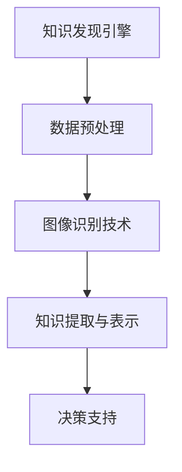

                 

知识发现引擎是一种智能系统，旨在从大量数据中提取有价值的信息和模式。在过去的几年里，随着计算机视觉技术的飞速发展，图像识别技术在知识发现引擎中的应用日益广泛。本文将深入探讨图像识别技术在知识发现引擎中的应用，从核心概念、算法原理、数学模型、项目实践等多个方面进行详细阐述。

## 关键词

- 知识发现引擎
- 图像识别
- 人工智能
- 计算机视觉
- 数据挖掘

## 摘要

本文首先介绍了知识发现引擎的基本概念和图像识别技术的发展背景。接着，详细阐述了图像识别技术在知识发现引擎中的应用，包括核心算法原理、数学模型、项目实践等。最后，探讨了图像识别技术在知识发现引擎中的实际应用场景和未来发展趋势。

## 1. 背景介绍

### 知识发现引擎

知识发现引擎（Knowledge Discovery Engine，KDE）是一种自动从大量数据中提取知识、模式和关系的系统。它通常包括数据预处理、数据挖掘、模式识别、知识表示等多个环节。知识发现引擎的目标是从海量数据中提取出有价值的信息，帮助决策者做出更好的决策。

### 图像识别技术

图像识别技术（Image Recognition Technology）是计算机视觉（Computer Vision）的一个重要分支，旨在使计算机能够识别和解析图像。随着深度学习（Deep Learning）技术的兴起，图像识别技术取得了显著的进展，逐渐应用于各个领域。

## 2. 核心概念与联系

### 核心概念

- 知识发现引擎：从数据中提取知识的系统。
- 图像识别：识别和解析图像的技术。
- 人工智能：使计算机具有人类智能的技术。

### 联系

知识发现引擎和图像识别技术的结合，使得计算机能够从大量图像数据中提取出有价值的信息，如人物、物体、场景等。人工智能技术则为这一过程提供了强大的计算能力和算法支持。

### Mermaid 流程图



## 3. 核心算法原理 & 具体操作步骤

### 3.1 算法原理概述

图像识别技术在知识发现引擎中的应用，主要依赖于深度学习算法，如卷积神经网络（Convolutional Neural Network，CNN）和循环神经网络（Recurrent Neural Network，RNN）。这些算法能够自动从大量图像数据中学习特征，并用于分类、检测和分割等任务。

### 3.2 算法步骤详解

1. 数据预处理：对图像数据集进行清洗、归一化和增强等处理，以提高算法的性能。
2. 模型训练：使用卷积神经网络等深度学习算法对图像数据进行训练，学习图像特征。
3. 模型评估：通过交叉验证等方法评估模型性能，调整超参数。
4. 模型应用：将训练好的模型应用于新的图像数据，提取有价值的信息。

### 3.3 算法优缺点

优点：

- 高效：深度学习算法能够自动提取图像特征，减少人工干预。
- 准确：卷积神经网络等算法在图像识别任务上取得了很好的效果。
- 泛化能力强：能够处理各种类型的图像数据。

缺点：

- 计算成本高：深度学习算法需要大量计算资源和时间进行训练。
- 数据依赖性强：算法性能与数据质量密切相关。

### 3.4 算法应用领域

图像识别技术在知识发现引擎中的应用非常广泛，包括但不限于：

- 医学影像诊断：对医学影像进行分析，辅助医生诊断疾病。
- 智能安防：通过监控摄像头识别可疑目标，预防犯罪行为。
- 物流管理：对物流过程中的图像进行识别，提高物流效率。
- 智能助手：通过图像识别技术识别用户需求，提供个性化服务。

## 4. 数学模型和公式 & 详细讲解 & 举例说明

### 4.1 数学模型构建

图像识别技术中的数学模型主要包括卷积神经网络（CNN）和循环神经网络（RNN）。以下是它们的基本结构：

- 卷积神经网络（CNN）：

$$
h_l = \sigma(W_l \cdot h_{l-1} + b_l)
$$

其中，$h_l$ 表示第 $l$ 层的激活值，$W_l$ 和 $b_l$ 分别表示权重和偏置。

- 循环神经网络（RNN）：

$$
h_t = \sigma(W_h \cdot [h_{t-1}, x_t] + b_h)
$$

其中，$h_t$ 表示第 $t$ 时刻的隐藏状态，$W_h$ 和 $b_h$ 分别表示权重和偏置。

### 4.2 公式推导过程

以卷积神经网络为例，其基本原理是通过对输入数据进行卷积操作，提取特征，然后通过全连接层进行分类。以下是卷积神经网络的推导过程：

1. 卷积操作：

$$
h_l = \sigma(W_l \cdot \text{conv}(h_{l-1}, K_l) + b_l)
$$

其中，$\text{conv}(h_{l-1}, K_l)$ 表示对 $h_{l-1}$ 进行卷积操作，$K_l$ 表示卷积核。

2. 全连接层：

$$
o_l = \sigma(W_l \cdot h_l + b_l)
$$

其中，$o_l$ 表示第 $l$ 层的输出。

### 4.3 案例分析与讲解

以人脸识别为例，介绍卷积神经网络在图像识别中的应用。

1. 数据集：使用人脸数据集，包括不同角度、光照和表情的人脸图像。
2. 模型：采用卷积神经网络，包括多个卷积层和全连接层。
3. 训练：使用反向传播算法进行模型训练，优化权重和偏置。
4. 预测：对新的图像进行人脸识别，输出识别结果。

## 5. 项目实践：代码实例和详细解释说明

### 5.1 开发环境搭建

1. Python：使用 Python 编写代码，便于调试和优化。
2. TensorFlow：使用 TensorFlow 深度学习框架，实现卷积神经网络。
3. OpenCV：使用 OpenCV 图像处理库，进行数据预处理和图像识别。

### 5.2 源代码详细实现

以下是一个简单的人脸识别项目示例：

```python
import tensorflow as tf
import cv2

# 加载模型
model = tf.keras.models.load_model('face_recognition_model.h5')

# 加载摄像头
cap = cv2.VideoCapture(0)

while True:
    # 读取一帧图像
    ret, frame = cap.read()

    # 将图像转换为灰度图像
    gray = cv2.cvtColor(frame, cv2.COLOR_BGR2GRAY)

    # 使用 Haarcascade 人脸识别模型检测人脸
    faces = face_cascade.detectMultiScale(gray, scaleFactor=1.1, minNeighbors=5, minSize=(30, 30), flags=cv2.CASCADE_SCALE_IMAGE)

    for (x, y, w, h) in faces:
        # 在人脸区域绘制矩形框
        cv2.rectangle(frame, (x, y), (x+w, y+h), (0, 255, 0), 2)

        # 提取人脸区域
        face_region = gray[y:y+h, x:x+w]

        # 对人脸区域进行识别
        prediction = model.predict(face_region)

        # 输出识别结果
        print(prediction)

    # 显示识别结果
    cv2.imshow('Frame', frame)

    # 按下 'q' 键退出循环
    if cv2.waitKey(1) & 0xFF == ord('q'):
        break

# 释放摄像头资源
cap.release()
cv2.destroyAllWindows()
```

### 5.3 代码解读与分析

1. 加载模型：使用 TensorFlow 框架加载已经训练好的卷积神经网络模型。
2. 加载摄像头：使用 OpenCV 库加载实时摄像头视频流。
3. 图像预处理：将彩色图像转换为灰度图像，便于人脸识别。
4. 人脸识别：使用 Haarcascade 人脸识别模型检测人脸区域。
5. 人脸识别结果输出：将识别结果输出到控制台。
6. 显示识别结果：在窗口中显示实时识别结果。

## 6. 实际应用场景

### 6.1 医学影像诊断

使用图像识别技术对医学影像进行分析，可以帮助医生更快速、准确地诊断疾病。例如，通过检测 CT 图像中的肺癌病灶，可以提高肺癌筛查的准确性。

### 6.2 智能安防

通过监控摄像头进行人脸识别，可以实时监测公共场所的人员流动，识别可疑目标，预防犯罪行为。例如，在机场、火车站等场所，使用人脸识别技术进行人员身份验证，提高安检效率。

### 6.3 物流管理

使用图像识别技术对物流过程中的图像进行分析，可以实时监测货物状态，提高物流效率。例如，通过识别物流包裹上的条码或标签，实现自动分拣和配送。

### 6.4 智能助手

通过图像识别技术，智能助手可以更好地理解用户的需求，提供个性化服务。例如，通过识别用户的照片，智能助手可以推荐用户喜欢的美食、旅游景点等。

## 7. 工具和资源推荐

### 7.1 学习资源推荐

- 《深度学习》（Deep Learning）：介绍深度学习基本原理和应用。
- 《Python 编程：从入门到实践》（Python Crash Course）：Python 编程基础教程。
- 《计算机视觉基础》（Fundamentals of Computer Vision）：介绍计算机视觉基本原理和应用。

### 7.2 开发工具推荐

- TensorFlow：深度学习框架，支持多种深度学习算法。
- OpenCV：开源计算机视觉库，提供丰富的图像处理函数。
- Keras：基于 TensorFlow 的深度学习框架，简化深度学习开发。

### 7.3 相关论文推荐

- "Face Recognition Using Deep Learning"：介绍人脸识别中的深度学习算法。
- "Deep Learning for Image Classification"：介绍深度学习在图像分类中的应用。
- "Recurrent Neural Networks for Image Recognition"：介绍循环神经网络在图像识别中的应用。

## 8. 总结：未来发展趋势与挑战

### 8.1 研究成果总结

近年来，图像识别技术在知识发现引擎中的应用取得了显著成果，深度学习算法在图像识别任务上取得了很高的准确性。同时，随着硬件性能的提升，图像识别技术的计算成本也在逐渐降低。

### 8.2 未来发展趋势

1. 跨模态融合：将图像识别与其他模态（如文本、声音等）进行融合，提高知识发现的效果。
2. 低延迟实时应用：优化算法，提高图像识别的实时性，满足实时应用需求。
3. 边缘计算：将图像识别任务迁移到边缘设备，降低计算成本和通信延迟。

### 8.3 面临的挑战

1. 数据质量：高质量的数据是图像识别算法性能的关键，如何获取和处理高质量数据成为一大挑战。
2. 算法优化：深度学习算法的计算成本较高，如何优化算法以提高效率和性能是当前研究的重点。
3. 隐私保护：图像识别过程中涉及用户隐私数据，如何确保数据隐私和安全是亟待解决的问题。

### 8.4 研究展望

随着人工智能技术的不断进步，图像识别技术在知识发现引擎中的应用将更加广泛。未来，我们将看到更多创新的应用场景，如智能医疗、智能交通、智能家居等。同时，研究人员也将致力于解决当前面临的技术挑战，推动图像识别技术的持续发展。

## 9. 附录：常见问题与解答

### Q：图像识别技术有哪些类型？

A：图像识别技术主要包括传统图像识别和深度学习图像识别。传统图像识别主要依赖于规则和特征提取，如边缘检测、特征点匹配等。深度学习图像识别则主要依赖于卷积神经网络、循环神经网络等深度学习算法。

### Q：如何提高图像识别的准确率？

A：提高图像识别的准确率可以从以下几个方面入手：

1. 数据质量：确保数据集的质量，去除噪声和错误数据。
2. 模型选择：选择适合特定任务的模型，如卷积神经网络在图像分类任务上效果较好。
3. 超参数优化：通过调整模型超参数，如学习率、批量大小等，提高模型性能。
4. 数据增强：通过数据增强方法，如旋转、缩放、翻转等，增加训练数据多样性。

### Q：图像识别技术在医疗领域有哪些应用？

A：图像识别技术在医疗领域的应用非常广泛，包括：

1. 疾病诊断：通过对医学影像进行分析，辅助医生诊断疾病，如肺癌、乳腺癌等。
2. 智能辅助诊断：通过分析医学影像，提供诊断建议和预测，提高诊断准确率。
3. 治疗规划：通过分析患者数据，为医生提供治疗方案和优化建议。

---

作者：禅与计算机程序设计艺术 / Zen and the Art of Computer Programming

本文由禅与计算机程序设计艺术撰写，旨在探讨图像识别技术在知识发现引擎中的应用。文章首先介绍了知识发现引擎和图像识别技术的基本概念，然后详细阐述了图像识别技术在知识发现引擎中的应用，包括核心算法原理、数学模型、项目实践等。最后，探讨了图像识别技术在知识发现引擎中的实际应用场景和未来发展趋势。本文旨在为广大计算机视觉和人工智能爱好者提供有益的知识和启示。

