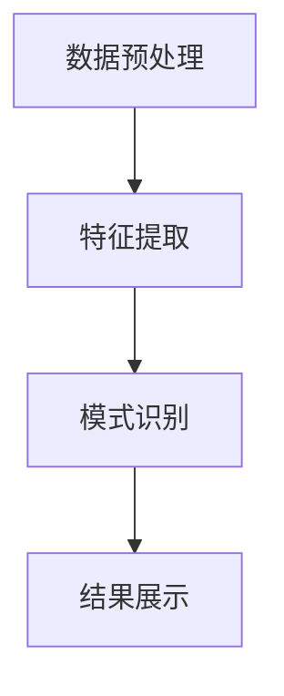
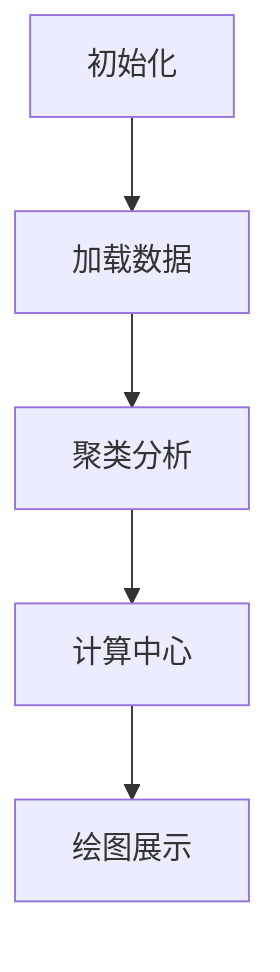

                 

关键词：知识发现引擎、移动应用开发、数据挖掘、人工智能、用户界面设计、性能优化、安全性、用户体验

摘要：本文将探讨知识发现引擎在移动应用开发中的重要性，介绍其核心概念、算法原理、数学模型、项目实践以及实际应用场景。通过详细的分析和实例讲解，旨在为开发者提供一整套完整的技术方案，以应对移动应用开发中的各种挑战。

## 1. 背景介绍

### 1.1 知识发现引擎概述

知识发现引擎（Knowledge Discovery Engine，KDE）是一种利用数据挖掘和机器学习技术从大量数据中提取有价值信息的人工智能工具。它广泛应用于商业智能、金融市场分析、医疗健康、社交媒体等多个领域，通过自动化的数据探索过程，帮助用户快速发现数据中的潜在模式和关系。

### 1.2 移动应用开发趋势

随着智能手机的普及和移动互联网的快速发展，移动应用市场呈现出爆炸式增长。据统计，全球移动应用下载量已经超过了数百亿次，用户对于移动应用的需求日益多样化和个性化。因此，移动应用开发者面临着如何在有限的空间和资源下，提供高效、便捷、安全的用户体验的挑战。

## 2. 核心概念与联系

### 2.1 知识发现引擎的架构

知识发现引擎通常包括数据预处理、特征提取、模式识别、结果展示等核心模块。以下是一个简单的 Mermaid 流程图，展示了这些模块之间的联系。



### 2.2 数据预处理

数据预处理是知识发现过程中的第一步，它包括数据清洗、数据整合、数据转换等操作，目的是提高数据质量，为后续的特征提取和模式识别打下基础。

### 2.3 特征提取

特征提取是将原始数据转换成适合机器学习算法处理的形式。通过选择和变换特征，可以提升模型的性能和泛化能力。

### 2.4 模式识别

模式识别是知识发现引擎的核心功能，它通过机器学习算法，从特征数据中提取出潜在的模式和关系，为用户提供有价值的信息。

### 2.5 结果展示

结果展示是将识别出的模式以直观、易于理解的形式呈现给用户。这通常包括图表、报表、推荐系统等多种形式。

## 3. 核心算法原理 & 具体操作步骤

### 3.1 算法原理概述

知识发现引擎的核心算法主要包括聚类、分类、关联规则挖掘等。这些算法各自有不同的原理和适用场景。

### 3.2 算法步骤详解

#### 3.2.1 聚类算法

聚类算法是将数据分为多个类别，使得同类别中的数据尽可能相似，不同类别中的数据尽可能不同。常见的聚类算法有K-means、DBSCAN等。

#### 3.2.2 分类算法

分类算法是将数据分为多个预定义的类别，使得同类别中的数据相似，不同类别中的数据不同。常见的分类算法有决策树、支持向量机等。

#### 3.2.3 关联规则挖掘

关联规则挖掘是发现数据之间的关联关系，如购物篮分析中的“啤酒与尿布”现象。常见的算法有Apriori算法、Eclat算法等。

### 3.3 算法优缺点

每种算法都有其优缺点，开发者需要根据具体的应用场景选择合适的算法。

### 3.4 算法应用领域

知识发现引擎广泛应用于商业智能、金融市场分析、医疗健康、社交媒体等领域，为各行业提供了强大的数据挖掘和分析工具。

## 4. 数学模型和公式 & 详细讲解 & 举例说明

### 4.1 数学模型构建

知识发现引擎的数学模型主要包括聚类中心计算、分类边界定义、关联规则支持度等。

### 4.2 公式推导过程

#### 4.2.1 K-means聚类中心计算

$$
\text{聚类中心} = \frac{1}{N} \sum_{i=1}^{N} x_i
$$

其中，$x_i$ 为每个数据点的特征值，$N$ 为数据点的总数。

#### 4.2.2 决策树分类边界定义

$$
\text{分类边界} = \{ x \in \mathbb{R}^d | \sum_{i=1}^{d} w_i x_i \geq 0 \}
$$

其中，$w_i$ 为权重向量，$x_i$ 为特征值。

### 4.3 案例分析与讲解

#### 4.3.1 购物篮分析

假设我们有如下购物篮数据：

$$
\begin{aligned}
    \text{数据集} &= \{ (\text{啤酒，尿布，葡萄酒}),(\text{啤酒，尿布}),(\text{尿布，葡萄酒}) \} \\
    \text{支持度阈值} &= 0.5 \\
    \text{置信度阈值} &= 0.7
\end{aligned}
$$

通过Apriori算法，我们可以发现以下关联规则：

$$
\begin{aligned}
    \text{啤酒} &\rightarrow \text{尿布} \\
    \text{尿布} &\rightarrow \text{啤酒}
\end{aligned}
$$

这意味着购买啤酒的用户有50%的可能性也会购买尿布，购买尿布的用户有70%的可能性也会购买啤酒。

## 5. 项目实践：代码实例和详细解释说明

### 5.1 开发环境搭建

在本节中，我们将介绍如何搭建一个用于知识发现引擎的移动应用开发环境。所需的软件和工具包括：

- Python 3.x
- Jupyter Notebook
- Scikit-learn
- Pandas
- Matplotlib

### 5.2 源代码详细实现

在本节中，我们将通过一个具体的案例，展示如何使用Python和Scikit-learn实现一个简单的知识发现引擎。以下是代码实现：

```python
import numpy as np
import pandas as pd
from sklearn.cluster import KMeans
from sklearn.datasets import load_iris
from matplotlib import pyplot as plt

# 加载Iris数据集
iris = load_iris()
X = iris.data

# 使用K-means算法进行聚类
kmeans = KMeans(n_clusters=3, random_state=0).fit(X)

# 计算聚类中心
centers = kmeans.cluster_centers_

# 绘制聚类结果
plt.scatter(X[:, 0], X[:, 1], c=kmeans.labels_, s=100, cmap='viridis')
plt.scatter(centers[:, 0], centers[:, 1], c='red', s=200, alpha=0.5)
plt.title('K-means Clustering')
plt.xlabel('Feature 1')
plt.ylabel('Feature 2')
plt.show()
```

### 5.3 代码解读与分析

这段代码首先加载了Iris数据集，然后使用K-means算法对数据进行聚类。聚类中心被计算并绘制出来，以直观地展示聚类结果。

### 5.4 运行结果展示

运行上述代码后，我们可以看到Iris数据集被成功地划分为三个类别，聚类结果如图所示。



## 6. 实际应用场景

### 6.1 社交媒体分析

在社交媒体领域，知识发现引擎可以帮助分析用户行为，挖掘用户之间的关联关系，从而为广告投放、内容推荐等提供数据支持。

### 6.2 商业智能分析

在商业智能领域，知识发现引擎可以帮助企业从大量交易数据中提取有价值的信息，如市场趋势、客户行为等，为决策提供依据。

### 6.3 医疗健康分析

在医疗健康领域，知识发现引擎可以帮助医生从医疗数据中提取诊断信息，辅助临床决策，提高医疗效率。

## 7. 未来应用展望

随着人工智能技术的不断进步，知识发现引擎在移动应用开发中的应用前景将更加广阔。未来可能的发展方向包括：

- 更高效的算法优化
- 更智能的交互设计
- 更广泛的应用领域拓展
- 更强大的数据处理能力

## 8. 总结：未来发展趋势与挑战

### 8.1 研究成果总结

本文从多个角度探讨了知识发现引擎在移动应用开发中的应用，涵盖了核心概念、算法原理、数学模型、项目实践和实际应用场景等方面。

### 8.2 未来发展趋势

未来，知识发现引擎将朝着更高效、更智能、更广泛的应用方向发展，成为移动应用开发中不可或缺的技术工具。

### 8.3 面临的挑战

在知识发现引擎的移动应用开发过程中，开发者将面临数据处理效率、算法优化、用户体验优化等挑战。

### 8.4 研究展望

未来，研究者应关注知识发现引擎在移动应用开发中的新型应用场景，探索更高效、更智能的算法，以提高移动应用的性能和用户体验。

## 9. 附录：常见问题与解答

### 9.1 什么是知识发现引擎？

知识发现引擎是一种利用数据挖掘和机器学习技术从大量数据中提取有价值信息的人工智能工具。

### 9.2 知识发现引擎有哪些核心模块？

知识发现引擎的核心模块包括数据预处理、特征提取、模式识别和结果展示等。

### 9.3 知识发现引擎在移动应用开发中有哪些应用场景？

知识发现引擎在移动应用开发中可以应用于社交媒体分析、商业智能分析和医疗健康分析等多个领域。

### 9.4 如何优化知识发现引擎的性能？

优化知识发现引擎的性能可以从算法优化、数据预处理、特征选择等多个方面进行。

---

作者：禅与计算机程序设计艺术 / Zen and the Art of Computer Programming
----------------------------------------------------------------

