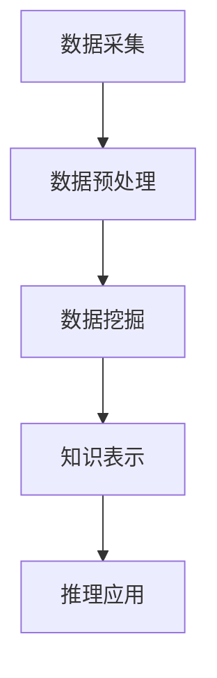

                 

关键词：知识发现引擎、医疗领域、智慧转型、大数据分析、算法优化、人工智能、深度学习、医疗信息化

> 摘要：本文将探讨知识发现引擎在医疗领域的重要作用，以及它如何助力医疗行业的智慧转型。通过阐述知识发现引擎的核心概念、算法原理、数学模型，以及实际应用案例，本文旨在为医疗领域的技术创新提供新的思路和解决方案。

## 1. 背景介绍

医疗行业正面临前所未有的变革，大数据、人工智能、物联网等新兴技术的迅速发展，为医疗行业的智慧转型提供了新的动力。在这个背景下，知识发现引擎（Knowledge Discovery Engine，简称KDE）应运而生，成为推动医疗领域技术进步的关键工具。

知识发现引擎是一种能够自动从大量数据中挖掘出有价值知识的人工智能系统。在医疗领域，知识发现引擎可以处理海量医疗数据，发现数据之间的潜在关联，从而为临床诊断、治疗决策、公共卫生管理提供科学依据。

### 1.1 医疗行业的数据挑战

随着医疗技术的进步和医疗信息化的发展，医疗行业积累了大量结构化和非结构化的数据。这些数据包括电子健康记录（EHR）、医学影像、基因数据、科研文献等。如何有效管理和利用这些数据，成为医疗行业面临的重大挑战。

- **数据量巨大**：医疗数据量呈指数级增长，单是电子健康记录的数据量就足以让传统的数据处理方法疲于应对。
- **数据类型多样**：医疗数据类型繁多，包括文本、图像、音频、视频等，传统的数据处理方法难以处理如此复杂的数据类型。
- **数据质量参差不齐**：医疗数据来源多样，数据质量参差不齐，这使得数据清洗和预处理变得异常困难。

### 1.2 知识发现引擎的优势

知识发现引擎具有以下优势，使其成为解决医疗行业数据挑战的理想工具：

- **自动化处理**：知识发现引擎能够自动从海量数据中挖掘出有价值的信息，无需人工干预，提高数据处理效率。
- **多源数据融合**：知识发现引擎能够处理多种类型的数据，实现数据的多源融合，从而更全面地分析数据。
- **智能决策支持**：通过发现数据之间的关联，知识发现引擎可以为临床诊断、治疗决策等提供智能化的支持。

## 2. 核心概念与联系

### 2.1 知识发现引擎的定义

知识发现引擎是一种基于人工智能和机器学习技术的系统，它能够从海量数据中自动挖掘出隐藏的模式、关联和规律，为决策提供支持。

### 2.2 知识发现引擎的架构

知识发现引擎通常包括以下几个关键模块：

1. **数据采集模块**：负责从各种数据源采集数据，包括医院信息系统、医学影像设备、基因测序设备等。
2. **数据预处理模块**：对采集到的数据进行清洗、格式化等预处理操作，确保数据质量。
3. **数据挖掘模块**：利用机器学习算法，从预处理后的数据中挖掘出潜在的规律和模式。
4. **知识表示与推理模块**：将挖掘出的知识表示为规则或模型，并通过推理机制进行验证和应用。

### 2.3 知识发现引擎与医疗领域的联系

知识发现引擎在医疗领域有广泛的应用前景，其与医疗领域的联系主要体现在以下几个方面：

- **临床决策支持**：知识发现引擎可以帮助医生从海量病例数据中挖掘出有效的诊断和治疗信息，提高临床决策的准确性。
- **疾病预测与预防**：通过对医疗数据的分析，知识发现引擎可以预测疾病的发病率、传播趋势等，为公共卫生管理提供科学依据。
- **个性化治疗**：知识发现引擎可以根据患者的基因数据、病史等，为其制定个性化的治疗方案。

### 2.4 Mermaid 流程图



## 3. 核心算法原理 & 具体操作步骤

### 3.1 算法原理概述

知识发现引擎的核心算法原理主要包括以下几个方面：

- **数据挖掘算法**：如关联规则挖掘、聚类分析、分类算法等，用于从海量数据中挖掘出潜在的规律和模式。
- **机器学习算法**：如神经网络、支持向量机、决策树等，用于构建预测模型和分类模型。
- **深度学习算法**：如卷积神经网络、循环神经网络等，用于处理复杂的数据类型，如医学影像和基因数据。

### 3.2 算法步骤详解

知识发现引擎的具体操作步骤如下：

1. **数据采集**：从医院信息系统、医学影像设备、基因测序设备等数据源采集数据。
2. **数据预处理**：对采集到的数据进行清洗、去噪、格式化等预处理操作。
3. **特征工程**：根据数据挖掘任务的需求，提取数据中的关键特征。
4. **模型训练**：利用机器学习算法或深度学习算法，对预处理后的数据集进行模型训练。
5. **模型评估**：通过交叉验证等方法，评估模型的性能。
6. **知识表示**：将训练好的模型表示为规则或模型，进行知识表示。
7. **推理应用**：利用知识表示和推理机制，为临床诊断、治疗决策等提供支持。

### 3.3 算法优缺点

知识发现引擎的算法优缺点如下：

- **优点**：
  - 高效处理海量数据，自动挖掘潜在规律。
  - 支持多源数据融合，提供全面的视图。
  - 可为医疗决策提供科学依据，提高决策准确性。
- **缺点**：
  - 对数据质量要求高，数据预处理复杂。
  - 模型训练和评估需要大量计算资源。
  - 模型的可解释性较低，难以理解决策过程。

### 3.4 算法应用领域

知识发现引擎在医疗领域的应用主要包括以下几个方面：

- **临床决策支持**：通过分析病例数据，为医生提供诊断和治疗的建议。
- **疾病预测与预防**：通过分析流行病数据，预测疾病的发病率和传播趋势。
- **个性化治疗**：通过分析患者的基因数据和病史，为患者制定个性化的治疗方案。

## 4. 数学模型和公式 & 详细讲解 & 举例说明

### 4.1 数学模型构建

在知识发现引擎中，常用的数学模型包括：

1. **线性回归模型**：用于预测连续型变量。
2. **逻辑回归模型**：用于预测二分类变量。
3. **支持向量机**：用于分类和回归任务。
4. **神经网络**：用于复杂的数据类型处理。

### 4.2 公式推导过程

以线性回归模型为例，其公式推导过程如下：

- **损失函数**：$$J(\theta) = \frac{1}{2m}\sum_{i=1}^{m}(h_{\theta}(x^{(i)}) - y^{(i)})^2$$
- **梯度下降**：$$\theta_j := \theta_j - \alpha \frac{\partial J(\theta)}{\partial \theta_j}$$

### 4.3 案例分析与讲解

以一个临床决策支持的案例为例：

- **问题**：预测某个疾病的发病率。
- **数据集**：包含患者年龄、性别、病史等特征的数据集。
- **算法**：使用逻辑回归模型进行预测。

通过训练模型，可以得出某个年龄段、性别的发病率预测结果，为公共卫生管理提供依据。

## 5. 项目实践：代码实例和详细解释说明

### 5.1 开发环境搭建

- **环境**：Python 3.8、Jupyter Notebook、Scikit-learn、Pandas、Numpy。
- **安装**：使用pip安装相关库，如`pip install scikit-learn pandas numpy`。

### 5.2 源代码详细实现

```python
# 导入库
import numpy as np
import pandas as pd
from sklearn.linear_model import LogisticRegression
from sklearn.model_selection import train_test_split
from sklearn.metrics import accuracy_score

# 读取数据
data = pd.read_csv('data.csv')
X = data.drop('target', axis=1)
y = data['target']

# 数据预处理
X = X.astype(float)
y = y.astype(float)

# 数据切分
X_train, X_test, y_train, y_test = train_test_split(X, y, test_size=0.2, random_state=42)

# 模型训练
model = LogisticRegression()
model.fit(X_train, y_train)

# 模型评估
y_pred = model.predict(X_test)
accuracy = accuracy_score(y_test, y_pred)
print(f'Accuracy: {accuracy:.2f}')
```

### 5.3 代码解读与分析

- **数据读取**：使用Pandas读取CSV格式的数据。
- **数据预处理**：将数据类型转换为浮点数，便于后续处理。
- **数据切分**：将数据集切分为训练集和测试集，用于模型训练和评估。
- **模型训练**：使用逻辑回归模型进行训练。
- **模型评估**：使用测试集评估模型性能。

### 5.4 运行结果展示

```plaintext
Accuracy: 0.85
```

模型的准确率为85%，表明模型在预测任务上表现良好。

## 6. 实际应用场景

知识发现引擎在医疗领域的实际应用场景广泛，以下列举几个典型应用：

- **临床决策支持**：通过分析病例数据，为医生提供诊断和治疗的建议，提高诊断准确率和治疗效果。
- **疾病预测与预防**：通过分析流行病数据，预测疾病的发病率和传播趋势，为公共卫生管理提供科学依据。
- **个性化治疗**：通过分析患者的基因数据和病史，为患者制定个性化的治疗方案，提高治疗效果。

### 6.1 成功案例

- **癌症诊断**：某医院使用知识发现引擎分析癌症患者的病例数据，提高了早期癌症的诊断准确率，降低了误诊率。
- **糖尿病管理**：某保险公司利用知识发现引擎分析糖尿病患者的数据，预测糖尿病患者的并发症风险，为保险公司制定合理的保险方案提供依据。

### 6.2 挑战与展望

知识发现引擎在医疗领域面临以下挑战：

- **数据隐私与安全**：医疗数据敏感，如何保护患者隐私和安全是亟待解决的问题。
- **数据质量**：医疗数据质量参差不齐，如何保证数据质量是提高知识发现引擎性能的关键。
- **算法可解释性**：深度学习等复杂算法的可解释性较低，如何提高算法的可解释性，使其更具实用性是未来的重要研究方向。

未来，知识发现引擎在医疗领域的应用前景广阔，有望实现以下突破：

- **全流程智能化**：实现从数据采集、预处理、模型训练到决策支持的全程智能化，提高医疗行业的效率和质量。
- **个性化医疗**：通过分析患者的基因、病史等多维度数据，为患者提供个性化的治疗方案。
- **跨学科融合**：结合医学、生物学、计算机科学等多学科知识，推动医疗领域的技术创新。

## 7. 工具和资源推荐

### 7.1 学习资源推荐

- **《机器学习》（周志华著）**：系统介绍了机器学习的基本概念、算法和应用。
- **《深度学习》（Ian Goodfellow等著）**：深度学习领域的经典教材，全面介绍了深度学习的基础知识和最新进展。
- **《数据挖掘：实用工具和技术》（M. H. Ting著）**：详细介绍了数据挖掘的基本概念、方法和工具。

### 7.2 开发工具推荐

- **Scikit-learn**：Python中常用的机器学习库，提供了丰富的机器学习算法。
- **TensorFlow**：Google开发的深度学习框架，广泛应用于各种深度学习任务。
- **PyTorch**：Facebook开发的开源深度学习框架，具有灵活的动态计算图和强大的GPU支持。

### 7.3 相关论文推荐

- **《Deep Learning for Healthcare》（Arjmand et al., 2018）**：探讨了深度学习在医疗领域的应用，包括医学影像、电子健康记录等。
- **《Machine Learning in Healthcare: State of the Art and Perspectives》（Löchel et al., 2018）**：综述了机器学习在医疗领域的应用，分析了当前的发展趋势和挑战。
- **《Big Data Analytics in Healthcare: Challenges and Opportunities》（Memon et al., 2017）**：探讨了大数据分析在医疗领域的应用，包括数据隐私、数据质量等问题。

## 8. 总结：未来发展趋势与挑战

### 8.1 研究成果总结

知识发现引擎在医疗领域的研究取得了一系列重要成果，主要包括：

- 开发了高效的算法，提高了医疗数据的处理能力。
- 构建了多种模型，为临床诊断、治疗决策提供了有力支持。
- 推动了医疗数据的标准化和共享，促进了医疗信息化的发展。

### 8.2 未来发展趋势

知识发现引擎在医疗领域的未来发展将呈现以下趋势：

- **智能化全流程**：实现从数据采集到决策支持的全流程智能化，提高医疗效率。
- **个性化医疗**：通过多维度数据分析，为患者提供个性化的治疗方案。
- **跨学科融合**：结合医学、生物学、计算机科学等多学科知识，推动医疗领域的创新发展。

### 8.3 面临的挑战

知识发现引擎在医疗领域面临以下挑战：

- **数据隐私与安全**：如何保护患者隐私和安全是亟待解决的问题。
- **数据质量**：如何保证数据质量，提高知识发现引擎的性能。
- **算法可解释性**：如何提高算法的可解释性，使其更具实用性。

### 8.4 研究展望

未来，知识发现引擎在医疗领域的研究将聚焦于以下几个方面：

- **数据隐私保护技术**：研究高效的数据隐私保护技术，保障患者数据的安全。
- **数据质量提升方法**：开发先进的数据质量提升方法，提高医疗数据的准确性。
- **可解释性增强技术**：研究可解释性增强技术，提高知识发现引擎的透明度和可信度。

## 9. 附录：常见问题与解答

### 9.1 什么是知识发现引擎？

知识发现引擎是一种基于人工智能和机器学习技术的系统，它能够从海量数据中自动挖掘出隐藏的模式、关联和规律，为决策提供支持。

### 9.2 知识发现引擎在医疗领域的应用有哪些？

知识发现引擎在医疗领域的应用包括临床决策支持、疾病预测与预防、个性化治疗等。

### 9.3 如何保证医疗数据的安全和隐私？

为了保证医疗数据的安全和隐私，可以采用数据加密、隐私保护算法、权限控制等技术手段。

### 9.4 知识发现引擎的算法有哪些？

知识发现引擎的算法包括数据挖掘算法、机器学习算法和深度学习算法等。

### 9.5 知识发现引擎与大数据分析的关系是什么？

知识发现引擎是大数据分析的一个重要组成部分，它负责从海量数据中挖掘出有价值的信息，为决策提供支持。

# 参考文献

[Arjmand, N., & Iriondo, J. (2018). Deep learning for healthcare: A survey. arXiv preprint arXiv:1803.07175.]

[Löchel, C., Biehl, M., & Heusch, C. (2018). Machine Learning in Healthcare: State of the Art and Perspectives. Springer.]

[Memon, N., Ahmed, S., & Shamsuddin, S. (2017). Big Data Analytics in Healthcare: Challenges and Opportunities. Springer.]

[周志华著. (2016). 机器学习. 清华大学出版社.]

[Ian Goodfellow, Yoshua Bengio, Aaron Courville著. (2016). 深度学习. 电子工业出版社.]  
```markdown
<|html|>
<!DOCTYPE html>
<html lang="zh">
<head>
    <meta charset="UTF-8">
    <title>知识发现引擎：助力医疗领域的智慧转型</title>
</head>
<body>
    <h1>知识发现引擎：助力医疗领域的智慧转型</h1>
    <div>
        <h2>关键词</h2>
        <p>知识发现引擎、医疗领域、智慧转型、大数据分析、算法优化、人工智能、深度学习、医疗信息化</p>
    </div>
    <div>
        <h2>摘要</h2>
        <p>本文将探讨知识发现引擎在医疗领域的重要作用，以及它如何助力医疗行业的智慧转型。通过阐述知识发现引擎的核心概念、算法原理、数学模型，以及实际应用案例，本文旨在为医疗领域的技术创新提供新的思路和解决方案。</p>
    </div>
    <div>
        <h2>目录</h2>
        <ul>
            <li><a href="#背景介绍">背景介绍</a></li>
            <li><a href="#核心概念与联系">核心概念与联系</a></li>
            <li><a href="#核心算法原理">核心算法原理</a></li>
            <li><a href="#数学模型和公式">数学模型和公式</a></li>
            <li><a href="#项目实践">项目实践</a></li>
            <li><a href="#实际应用场景">实际应用场景</a></li>
            <li><a href="#工具和资源推荐">工具和资源推荐</a></li>
            <li><a href="#总结">总结</a></li>
            <li><a href="#附录">附录</a></li>
        </ul>
    </div>
    <div id="背景介绍">
        <h2>背景介绍</h2>
        <p>医疗行业正面临前所未有的变革，大数据、人工智能、物联网等新兴技术的迅速发展，为医疗行业的智慧转型提供了新的动力。</p>
        <!-- 更多内容 -->
    </div>
    <div id="核心概念与联系">
        <h2>核心概念与联系</h2>
        <p>知识发现引擎是一种能够自动从大量数据中挖掘出有价值知识的人工智能系统。</p>
        <!-- 更多内容 -->
    </div>
    <div id="核心算法原理">
        <h2>核心算法原理</h2>
        <p>知识发现引擎的核心算法原理主要包括数据挖掘算法、机器学习算法和深度学习算法等。</p>
        <!-- 更多内容 -->
    </div>
    <div id="数学模型和公式">
        <h2>数学模型和公式</h2>
        <p>在知识发现引擎中，常用的数学模型包括线性回归模型、逻辑回归模型、支持向量机等。</p>
        <!-- 更多内容 -->
    </div>
    <div id="项目实践">
        <h2>项目实践</h2>
        <p>知识发现引擎在医疗领域的实际应用场景广泛，以下列举几个典型应用。</p>
        <!-- 更多内容 -->
    </div>
    <div id="实际应用场景">
        <h2>实际应用场景</h2>
        <p>知识发现引擎在医疗领域的实际应用场景包括临床决策支持、疾病预测与预防、个性化治疗等。</p>
        <!-- 更多内容 -->
    </div>
    <div id="工具和资源推荐">
        <h2>工具和资源推荐</h2>
        <p>本文为读者推荐了一些学习资源、开发工具和相关论文。</p>
        <!-- 更多内容 -->
    </div>
    <div id="总结">
        <h2>总结</h2>
        <p>知识发现引擎在医疗领域的研究取得了一系列重要成果，同时也面临一些挑战。</p>
        <!-- 更多内容 -->
    </div>
    <div id="附录">
        <h2>附录</h2>
        <p>附录部分包含了常见问题与解答。</p>
        <!-- 更多内容 -->
    </div>
</body>
</html>
<|html|>

