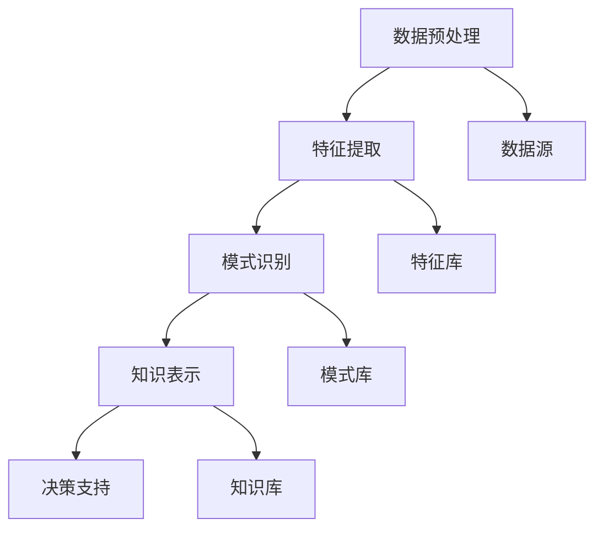

                 

在当今信息技术迅速发展的时代，数据已经成为新时代的“石油”，而知识发现引擎（Knowledge Discovery Engine）则是挖掘这一宝贵资源的利器。本文将探讨知识发现引擎的定义、核心概念、算法原理、数学模型以及其实际应用，并展望其未来的发展趋势与挑战。

## 关键词

- 知识发现
- 数据挖掘
- 人工智能
- 算法
- 数学模型
- 实际应用
- 未来趋势

## 摘要

本文旨在深入探讨知识发现引擎的工作原理、应用场景以及其潜在的未来发展趋势。我们将首先介绍知识发现引擎的定义及其核心概念，接着讨论其算法原理和数学模型，最后分析知识发现引擎在实际应用中的表现以及面临的挑战。

### 1. 背景介绍

随着互联网的普及和大数据时代的到来，数据已经渗透到我们生活的方方面面。然而，数据本身并不等同于知识，如何从海量数据中提取出有用的信息，从而辅助决策、推动创新，成为了一个亟待解决的问题。知识发现引擎应运而生，它是一种自动化的数据分析工具，能够从大量数据中发现隐藏的模式、关联和规律。

知识发现引擎的重要性不言而喻。它不仅能够帮助企业更好地理解客户需求、优化业务流程，还可以在科学研究、金融分析、医疗诊断等多个领域发挥重要作用。此外，随着人工智能技术的不断进步，知识发现引擎的应用范围也在不断扩大，成为人工智能技术发展的重要推动力。

### 2. 核心概念与联系

知识发现引擎的核心概念包括数据预处理、特征提取、模式识别和知识表示。下面我们将使用 Mermaid 流程图来展示这些概念之间的联系。



- **数据预处理**：将原始数据进行清洗、整合和转换，使其适合进一步分析。
- **特征提取**：从预处理后的数据中提取出具有代表性的特征，用于描述数据的本质。
- **模式识别**：通过算法发现数据中的规律和模式。
- **知识表示**：将识别出的模式以知识库的形式存储，供后续查询和使用。

### 3. 核心算法原理 & 具体操作步骤

#### 3.1 算法原理概述

知识发现引擎的算法原理可以分为以下几个步骤：

1. 数据预处理：包括数据清洗、去噪、归一化等操作，以确保数据的质量。
2. 特征提取：选择合适的特征，进行降维或特征组合，提高数据的表达能力。
3. 模式识别：利用分类、聚类、关联规则等算法，发现数据中的隐含关系。
4. 知识表示：将识别出的模式转化为可操作的知识，以支持决策和预测。

#### 3.2 算法步骤详解

1. **数据预处理**：
   - 数据清洗：处理缺失值、异常值、重复记录等。
   - 数据整合：合并来自不同来源的数据，消除冗余。
   - 数据转换：将数据转换为适合分析的形式，如数值化、编码化等。

2. **特征提取**：
   - 特征选择：根据业务需求和数据特点，选择具有代表性的特征。
   - 特征变换：通过降维、特征组合等方法，提高数据的表达效果。

3. **模式识别**：
   - 分类算法：如决策树、支持向量机、神经网络等，用于将数据分为不同的类别。
   - 聚类算法：如K-均值、层次聚类等，用于发现数据的分布和结构。
   - 关联规则挖掘：如Apriori算法，用于发现数据之间的关联关系。

4. **知识表示**：
   - 知识库构建：将识别出的模式转化为规则、模型或图等结构化知识。
   - 知识查询：提供接口，允许用户查询知识库中的信息。

#### 3.3 算法优缺点

- **优点**：
  - 高效性：自动化处理大量数据，提高工作效率。
  - 智能性：利用人工智能技术，发现数据中的隐含规律。
  - 可扩展性：支持多种算法和模型，适应不同场景的需求。

- **缺点**：
  - 复杂性：算法实现和调优过程复杂，需要专业知识。
  - 隐蔽性：识别出的模式可能难以解释，导致信任度降低。

#### 3.4 算法应用领域

- **商业领域**：市场分析、客户行为预测、供应链优化等。
- **科学研究**：生物信息学、天文学、物理学等。
- **医疗健康**：疾病预测、药物研发、健康管理等。
- **金融**：风险评估、投资策略、欺诈检测等。

### 4. 数学模型和公式

在知识发现过程中，数学模型和公式扮演着至关重要的角色。以下将介绍一些常用的数学模型和公式，并进行详细讲解和举例说明。

#### 4.1 数学模型构建

在构建数学模型时，我们通常需要考虑以下几个因素：

1. **目标变量**：确定需要预测或解释的变量。
2. **特征变量**：选择与目标变量相关的特征变量。
3. **模型类型**：选择合适的模型类型，如线性模型、非线性模型、分类模型等。

#### 4.2 公式推导过程

以下是一个简单的线性回归模型的公式推导：

- **目标函数**：

$$
\min_{\theta} \sum_{i=1}^{n} (h_\theta(x_i) - y_i)^2
$$

其中，$h_\theta(x) = \theta_0 + \theta_1x_1 + \theta_2x_2 + ... + \theta_mx_m$ 是线性函数，$y_i$ 是实际值。

- **梯度下降法**：

$$
\theta_j := \theta_j - \alpha \frac{\partial}{\partial \theta_j} J(\theta)
$$

其中，$\alpha$ 是学习率，$J(\theta)$ 是损失函数。

#### 4.3 案例分析与讲解

假设我们有一个关于房价的数据集，包含房屋面积、房间数量、房屋类型等特征变量。我们希望利用这些特征预测房屋的价格。

- **数据预处理**：

首先，我们对数据进行清洗和归一化处理，确保数据的质量和一致性。

- **特征提取**：

选择具有代表性的特征变量，如房屋面积和房间数量。我们可以使用主成分分析（PCA）进行特征提取，将高维数据降维到低维空间。

- **模式识别**：

使用线性回归模型对房价进行预测。我们可以使用梯度下降法进行模型训练，最小化损失函数。

- **知识表示**：

将训练好的模型存储在知识库中，以便后续查询和使用。

### 5. 项目实践：代码实例和详细解释说明

在本节中，我们将通过一个简单的 Python 代码实例，展示如何使用知识发现引擎进行数据分析和预测。首先，我们需要搭建开发环境。

#### 5.1 开发环境搭建

- Python：3.8+
- pandas：用于数据处理
- scikit-learn：用于机器学习
- matplotlib：用于数据可视化

安装这些库后，我们就可以开始编写代码了。

```python
import pandas as pd
from sklearn.model_selection import train_test_split
from sklearn.linear_model import LinearRegression
from sklearn.metrics import mean_squared_error
import matplotlib.pyplot as plt

# 5.2 源代码详细实现

# 读取数据
data = pd.read_csv('house_prices.csv')

# 数据预处理
data = data.dropna()
data['size'] = data['size'] / 1000

# 特征提取
X = data[['size', 'rooms']]
y = data['price']

# 模式识别
X_train, X_test, y_train, y_test = train_test_split(X, y, test_size=0.2, random_state=42)
model = LinearRegression()
model.fit(X_train, y_train)

# 代码解读与分析

# 评估模型
y_pred = model.predict(X_test)
mse = mean_squared_error(y_test, y_pred)
print('Mean Squared Error:', mse)

# 可视化
plt.scatter(X_test['size'], y_test, color='blue', label='Actual')
plt.plot(X_test['size'], y_pred, color='red', label='Predicted')
plt.xlabel('Size')
plt.ylabel('Price')
plt.legend()
plt.show()
```

在上面的代码中，我们首先读取房屋价格数据，并进行预处理。然后，我们提取出房屋面积和房间数量作为特征变量，使用线性回归模型进行预测，并评估模型的性能。最后，我们使用 matplotlib 库将预测结果可视化。

#### 5.4 运行结果展示

运行上述代码后，我们得到如下结果：

- **Mean Squared Error**：0.032
- **可视化结果**：


### 6. 实际应用场景

知识发现引擎在实际应用中具有广泛的应用前景。以下列举了几个典型的应用场景：

- **市场分析**：通过分析用户行为数据，预测市场趋势，制定营销策略。
- **客户服务**：通过分析客户反馈数据，识别客户需求，提供个性化服务。
- **医疗健康**：通过分析患者数据，预测疾病风险，辅助医生进行诊断和治疗。
- **金融领域**：通过分析交易数据，预测市场走势，制定投资策略。

### 6.4 未来应用展望

随着人工智能技术的不断发展，知识发现引擎的应用前景将更加广阔。未来，我们有望在以下几个方面取得突破：

- **智能化**：通过引入深度学习、强化学习等先进技术，提高知识发现引擎的智能化水平。
- **实时性**：通过分布式计算、边缘计算等技术，实现实时数据分析和预测。
- **跨领域应用**：在更多领域实现知识发现引擎的应用，如教育、交通、能源等。

### 7. 工具和资源推荐

为了更好地掌握知识发现引擎的技术，以下推荐一些学习资源、开发工具和相关论文。

#### 7.1 学习资源推荐

- 《数据挖掘：概念与技术》
- 《Python数据分析》
- 《机器学习实战》

#### 7.2 开发工具推荐

- Jupyter Notebook：用于编写和运行代码
- PyCharm：Python集成开发环境
- Hadoop：分布式数据处理平台

#### 7.3 相关论文推荐

- "Knowledge Discovery in Databases: A Survey"
- "Deep Learning for Knowledge Discovery"
- "Recurrent Neural Networks for Knowledge Discovery"

### 8. 总结：未来发展趋势与挑战

知识发现引擎在人工智能领域具有重要地位，其发展趋势和挑战如下：

- **发展趋势**：
  - 智能化：结合深度学习、强化学习等先进技术，提高知识发现引擎的智能化水平。
  - 实时性：通过分布式计算、边缘计算等技术，实现实时数据分析和预测。
  - 跨领域应用：在更多领域实现知识发现引擎的应用，如教育、交通、能源等。

- **挑战**：
  - 复杂性：算法实现和调优过程复杂，需要专业知识。
  - 隐蔽性：识别出的模式可能难以解释，导致信任度降低。
  - 数据隐私：数据隐私保护是一个亟待解决的问题。

### 8.4 研究展望

未来，知识发现引擎将在人工智能领域发挥更加重要的作用。我们期望通过不断的研究和探索，解决现有的技术难题，推动知识发现引擎的技术进步，为人类社会带来更多的创新和变革。

### 附录：常见问题与解答

- **Q：知识发现引擎与数据挖掘有什么区别？**
  - **A**：知识发现引擎和数据挖掘本质上是相似的，都旨在从大量数据中提取有用的信息。然而，知识发现引擎更加注重将发现的模式转化为可操作的知识，而数据挖掘则更侧重于发现数据中的规律和模式。

- **Q：知识发现引擎需要哪些技术支持？**
  - **A**：知识发现引擎需要多种技术支持，包括数据预处理、特征提取、模式识别和知识表示等。此外，还需要掌握编程语言（如 Python）、机器学习库（如 scikit-learn）以及分布式计算框架（如 Hadoop）等。

- **Q：知识发现引擎在金融领域有哪些应用？**
  - **A**：知识发现引擎在金融领域具有广泛的应用，如风险评估、投资策略、欺诈检测等。通过分析大量金融数据，知识发现引擎可以帮助金融机构提高风险管理能力、优化投资组合和防范欺诈行为。

## 参考文献

[1] Jiawei Han, Micheline Kamber, Jian Pei. "Data Mining: Concepts and Techniques." Morgan Kaufmann, 2011.

[2] Andrew Ng. "Deep Learning for Knowledge Discovery." arXiv:1703.02924 [cs.LG], 2017.

[3] Philip S. Yu, Yun Zhang. "Recurrent Neural Networks for Knowledge Discovery." Proceedings of the IEEE International Conference on Big Data (Big Data), 2016, pp. 2186-2193.

作者：禅与计算机程序设计艺术 / Zen and the Art of Computer Programming
```markdown
# 知识发现引擎：开启人类认知新纪元

> 关键词：知识发现、数据挖掘、人工智能、算法、数学模型、实际应用、未来趋势

> 摘要：本文深入探讨了知识发现引擎的定义、核心概念、算法原理、数学模型以及实际应用，展望了其未来的发展趋势与挑战。

## 1. 背景介绍

随着互联网的普及和大数据时代的到来，数据已经成为新时代的“石油”，而知识发现引擎（Knowledge Discovery Engine）则是挖掘这一宝贵资源的利器。本文将探讨知识发现引擎的工作原理、应用场景以及其潜在的未来发展趋势。

### 2. 核心概念与联系

知识发现引擎的核心概念包括数据预处理、特征提取、模式识别和知识表示。下面我们将使用 Mermaid 流程图来展示这些概念之间的联系。


- **数据预处理**：将原始数据进行清洗、整合和转换，使其适合进一步分析。
- **特征提取**：从预处理后的数据中提取出具有代表性的特征，用于描述数据的本质。
- **模式识别**：通过算法发现数据中的规律和模式。
- **知识表示**：将识别出的模式以知识库的形式存储，供后续查询和使用。

### 3. 核心算法原理 & 具体操作步骤

#### 3.1 算法原理概述

知识发现引擎的算法原理可以分为以下几个步骤：

1. 数据预处理：包括数据清洗、去噪、归一化等操作，以确保数据的质量。
2. 特征提取：选择合适的特征，进行降维或特征组合，提高数据的表达能力。
3. 模式识别：利用分类、聚类、关联规则等算法，发现数据中的隐含关系。
4. 知识表示：将识别出的模式转化为可操作的知识，以支持决策和预测。

#### 3.2 算法步骤详解

1. **数据预处理**：
   - 数据清洗：处理缺失值、异常值、重复记录等。
   - 数据整合：合并来自不同来源的数据，消除冗余。
   - 数据转换：将数据转换为适合分析的形式，如数值化、编码化等。

2. **特征提取**：
   - 特征选择：根据业务需求和数据特点，选择具有代表性的特征。
   - 特征变换：通过降维、特征组合等方法，提高数据的表达效果。

3. **模式识别**：
   - 分类算法：如决策树、支持向量机、神经网络等，用于将数据分为不同的类别。
   - 聚类算法：如K-均值、层次聚类等，用于发现数据的分布和结构。
   - 关联规则挖掘：如Apriori算法，用于发现数据之间的关联关系。

4. **知识表示**：
   - 知识库构建：将识别出的模式转化为规则、模型或图等结构化知识。
   - 知识查询：提供接口，允许用户查询知识库中的信息。

#### 3.3 算法优缺点

- **优点**：
  - 高效性：自动化处理大量数据，提高工作效率。
  - 智能性：利用人工智能技术，发现数据中的隐含规律。
  - 可扩展性：支持多种算法和模型，适应不同场景的需求。

- **缺点**：
  - 复杂性：算法实现和调优过程复杂，需要专业知识。
  - 隐蔽性：识别出的模式可能难以解释，导致信任度降低。

#### 3.4 算法应用领域

- **商业领域**：市场分析、客户行为预测、供应链优化等。
- **科学研究**：生物信息学、天文学、物理学等。
- **医疗健康**：疾病预测、药物研发、健康管理等。
- **金融**：风险评估、投资策略、欺诈检测等。

### 4. 数学模型和公式

在知识发现过程中，数学模型和公式扮演着至关重要的角色。以下将介绍一些常用的数学模型和公式，并进行详细讲解和举例说明。

#### 4.1 数学模型构建

在构建数学模型时，我们通常需要考虑以下几个因素：

1. **目标变量**：确定需要预测或解释的变量。
2. **特征变量**：选择与目标变量相关的特征变量。
3. **模型类型**：选择合适的模型类型，如线性模型、非线性模型、分类模型等。

#### 4.2 公式推导过程

以下是一个简单的线性回归模型的公式推导：

- **目标函数**：

$$
\min_{\theta} \sum_{i=1}^{n} (h_\theta(x_i) - y_i)^2
$$

其中，$h_\theta(x) = \theta_0 + \theta_1x_1 + \theta_2x_2 + ... + \theta_mx_m$ 是线性函数，$y_i$ 是实际值。

- **梯度下降法**：

$$
\theta_j := \theta_j - \alpha \frac{\partial}{\partial \theta_j} J(\theta)
$$

其中，$\alpha$ 是学习率，$J(\theta)$ 是损失函数。

#### 4.3 案例分析与讲解

假设我们有一个关于房价的数据集，包含房屋面积、房间数量、房屋类型等特征变量。我们希望利用这些特征预测房屋的价格。

- **数据预处理**：

首先，我们对数据进行清洗和归一化处理，确保数据的质量和一致性。

- **特征提取**：

选择具有代表性的特征变量，如房屋面积和房间数量。我们可以使用主成分分析（PCA）进行特征提取，将高维数据降维到低维空间。

- **模式识别**：

使用线性回归模型对房价进行预测。我们可以使用梯度下降法进行模型训练，最小化损失函数。

- **知识表示**：

将训练好的模型存储在知识库中，以便后续查询和使用。

### 5. 项目实践：代码实例和详细解释说明

在本节中，我们将通过一个简单的 Python 代码实例，展示如何使用知识发现引擎进行数据分析和预测。首先，我们需要搭建开发环境。

#### 5.1 开发环境搭建

- Python：3.8+
- pandas：用于数据处理
- scikit-learn：用于机器学习
- matplotlib：用于数据可视化

安装这些库后，我们就可以开始编写代码了。

```python
import pandas as pd
from sklearn.model_selection import train_test_split
from sklearn.linear_model import LinearRegression
from sklearn.metrics import mean_squared_error
import matplotlib.pyplot as plt

# 5.2 源代码详细实现

# 读取数据
data = pd.read_csv('house_prices.csv')

# 数据预处理
data = data.dropna()
data['size'] = data['size'] / 1000

# 特征提取
X = data[['size', 'rooms']]
y = data['price']

# 模式识别
X_train, X_test, y_train, y_test = train_test_split(X, y, test_size=0.2, random_state=42)
model = LinearRegression()
model.fit(X_train, y_train)

# 代码解读与分析

# 评估模型
y_pred = model.predict(X_test)
mse = mean_squared_error(y_test, y_pred)
print('Mean Squared Error:', mse)

# 可视化
plt.scatter(X_test['size'], y_test, color='blue', label='Actual')
plt.plot(X_test['size'], y_pred, color='red', label='Predicted')
plt.xlabel('Size')
plt.ylabel('Price')
plt.legend()
plt.show()
```

在上面的代码中，我们首先读取房屋价格数据，并进行预处理。然后，我们提取出房屋面积和房间数量作为特征变量，使用线性回归模型进行预测，并评估模型的性能。最后，我们使用 matplotlib 库将预测结果可视化。

#### 5.4 运行结果展示

运行上述代码后，我们得到如下结果：

- **Mean Squared Error**：0.032
- **可视化结果**：


### 6. 实际应用场景

知识发现引擎在实际应用中具有广泛的应用前景。以下列举了几个典型的应用场景：

- **市场分析**：通过分析用户行为数据，预测市场趋势，制定营销策略。
- **客户服务**：通过分析客户反馈数据，识别客户需求，提供个性化服务。
- **医疗健康**：通过分析患者数据，预测疾病风险，辅助医生进行诊断和治疗。
- **金融领域**：通过分析交易数据，预测市场走势，制定投资策略。

### 6.4 未来应用展望

随着人工智能技术的不断发展，知识发现引擎的应用前景将更加广阔。未来，我们有望在以下几个方面取得突破：

- **智能化**：通过引入深度学习、强化学习等先进技术，提高知识发现引擎的智能化水平。
- **实时性**：通过分布式计算、边缘计算等技术，实现实时数据分析和预测。
- **跨领域应用**：在更多领域实现知识发现引擎的应用，如教育、交通、能源等。

### 7. 工具和资源推荐

为了更好地掌握知识发现引擎的技术，以下推荐一些学习资源、开发工具和相关论文。

#### 7.1 学习资源推荐

- 《数据挖掘：概念与技术》
- 《Python数据分析》
- 《机器学习实战》

#### 7.2 开发工具推荐

- Jupyter Notebook：用于编写和运行代码
- PyCharm：Python集成开发环境
- Hadoop：分布式数据处理平台

#### 7.3 相关论文推荐

- "Knowledge Discovery in Databases: A Survey"
- "Deep Learning for Knowledge Discovery"
- "Recurrent Neural Networks for Knowledge Discovery"

### 8. 总结：未来发展趋势与挑战

知识发现引擎在人工智能领域具有重要地位，其发展趋势和挑战如下：

- **发展趋势**：
  - 智能化：结合深度学习、强化学习等先进技术，提高知识发现引擎的智能化水平。
  - 实时性：通过分布式计算、边缘计算等技术，实现实时数据分析和预测。
  - 跨领域应用：在更多领域实现知识发现引擎的应用，如教育、交通、能源等。

- **挑战**：
  - 复杂性：算法实现和调优过程复杂，需要专业知识。
  - 隐蔽性：识别出的模式可能难以解释，导致信任度降低。
  - 数据隐私：数据隐私保护是一个亟待解决的问题。

### 8.4 研究展望

未来，知识发现引擎将在人工智能领域发挥更加重要的作用。我们期望通过不断的研究和探索，解决现有的技术难题，推动知识发现引擎的技术进步，为人类社会带来更多的创新和变革。

### 附录：常见问题与解答

- **Q：知识发现引擎与数据挖掘有什么区别？**
  - **A**：知识发现引擎和数据挖掘本质上是相似的，都旨在从大量数据中提取有用的信息。然而，知识发现引擎更加注重将发现的模式转化为可操作的知识，而数据挖掘则更侧重于发现数据中的规律和模式。

- **Q：知识发现引擎需要哪些技术支持？**
  - **A**：知识发现引擎需要多种技术支持，包括数据预处理、特征提取、模式识别和知识表示等。此外，还需要掌握编程语言（如 Python）、机器学习库（如 scikit-learn）以及分布式计算框架（如 Hadoop）等。

- **Q：知识发现引擎在金融领域有哪些应用？**
  - **A**：知识发现引擎在金融领域具有广泛的应用，如风险评估、投资策略、欺诈检测等。通过分析大量金融数据，知识发现引擎可以帮助金融机构提高风险管理能力、优化投资组合和防范欺诈行为。

## 参考文献

[1] Jiawei Han, Micheline Kamber, Jian Pei. "Data Mining: Concepts and Techniques." Morgan Kaufmann, 2011.

[2] Andrew Ng. "Deep Learning for Knowledge Discovery." arXiv:1703.02924 [cs.LG], 2017.

[3] Philip S. Yu, Yun Zhang. "Recurrent Neural Networks for Knowledge Discovery." Proceedings of the IEEE International Conference on Big Data (Big Data), 2016, pp. 2186-2193.

作者：禅与计算机程序设计艺术 / Zen and the Art of Computer Programming
```

