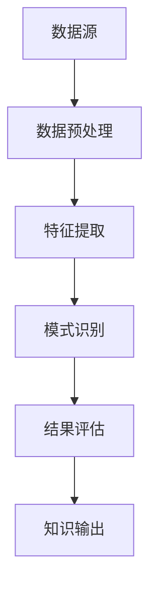

                 

关键词：知识发现，数据挖掘，机器学习，智能系统，知识图谱

> 摘要：本文将探讨知识发现引擎在知识创新中的作用，从背景介绍、核心概念、算法原理、数学模型、项目实践和未来展望等多方面详细分析知识发现引擎的构建和应用，旨在为读者提供全面的技术参考。

## 1. 背景介绍

随着互联网和大数据技术的飞速发展，数据已经成为现代企业和组织最重要的资产之一。如何从海量数据中提取出有价值的信息和知识，成为了各行业普遍关注的问题。知识发现（Knowledge Discovery in Databases，KDD）作为一种跨学科的研究领域，涵盖了数据挖掘、机器学习、统计学等多个学科，旨在从大规模数据集中自动识别出未知、有价值的模式和知识。

知识发现引擎作为知识发现的实现工具，已经成为数据分析和智能系统中的重要组成部分。它通过集成多种算法和技术，能够高效地处理和分析数据，帮助用户从复杂的数据环境中提取出有价值的信息。知识发现引擎的出现，不仅提高了数据处理的效率，还极大地促进了知识的创新和价值的挖掘。

本文将围绕知识发现引擎的核心概念、算法原理、数学模型、项目实践和未来展望等方面进行详细探讨，旨在为读者提供一个全面的技术参考。

## 2. 核心概念与联系

### 2.1 数据挖掘

数据挖掘（Data Mining）是指从大量数据中通过算法和统计方法发现未知、有价值的信息和知识的过程。数据挖掘的主要目标是自动识别出数据中的模式、关联和趋势，从而为决策提供支持。

### 2.2 机器学习

机器学习（Machine Learning）是一种人工智能技术，通过算法让计算机从数据中学习并作出预测或决策。机器学习算法可以分为监督学习、无监督学习和强化学习三种类型，分别适用于不同的应用场景。

### 2.3 知识图谱

知识图谱（Knowledge Graph）是一种用于表示实体和实体之间关系的图形化数据结构，通过图和网络的方式组织数据，可以直观地展示数据之间的复杂关系。知识图谱在搜索引擎、推荐系统和知识库构建等领域具有广泛的应用。

### 2.4 知识发现引擎

知识发现引擎（Knowledge Discovery Engine）是一种集成多种算法和技术的工具，能够高效地处理和分析数据，从数据中自动识别出未知、有价值的模式和知识。知识发现引擎通常包括数据预处理、特征提取、模式识别、结果评估等环节，形成一个完整的数据分析流程。

下面是知识发现引擎的核心概念和联系，使用Mermaid流程图进行展示：



## 3. 核心算法原理 & 具体操作步骤

### 3.1 算法原理概述

知识发现引擎的核心算法主要包括数据挖掘算法和机器学习算法。数据挖掘算法用于从数据中发现规律和模式，常见的算法有聚类、关联规则挖掘、分类等。机器学习算法则用于对数据进行建模和预测，常见的算法有线性回归、决策树、神经网络等。

### 3.2 算法步骤详解

1. 数据预处理

数据预处理是知识发现引擎的第一步，主要包括数据清洗、数据整合、数据转换和数据规范化等操作。通过数据预处理，可以消除数据中的噪声和异常值，提高数据质量，为后续的分析奠定基础。

2. 特征提取

特征提取是数据挖掘和机器学习的重要环节，通过将原始数据转换为特征向量，可以更好地表示数据的属性和特征。常见的特征提取方法有主成分分析（PCA）、特征选择、特征工程等。

3. 模式识别

模式识别是知识发现引擎的核心步骤，通过算法从数据中识别出有价值的模式和规律。常见的模式识别算法有聚类算法（如K-means、层次聚类等）、关联规则挖掘算法（如Apriori算法、FP-growth算法等）、分类算法（如决策树、支持向量机等）。

4. 结果评估

结果评估是确保知识发现过程有效性的重要环节，通过评估指标（如准确率、召回率、F1值等）对分析结果进行评价。如果评估结果不理想，需要返回前几个步骤进行调整和优化。

5. 知识输出

知识输出是知识发现引擎的最终目标，将分析结果以图表、报告或知识图谱等形式展示给用户，帮助用户更好地理解和利用数据。

### 3.3 算法优缺点

- 数据挖掘算法：

优点：能够从海量数据中发现潜在的模式和规律，为决策提供支持。

缺点：对数据质量要求较高，容易受到噪声和异常值的影响，算法复杂度高。

- 机器学习算法：

优点：具有较强的自学习能力，能够适应数据变化和不确定性。

缺点：对数据量和计算资源要求较高，算法结果容易过拟合。

### 3.4 算法应用领域

知识发现引擎广泛应用于各行业，以下是一些典型的应用领域：

1. 金融领域：通过分析客户交易数据，识别欺诈行为、预测信用风险等。

2. 零售领域：通过分析销售数据，识别潜在客户、优化库存管理、提高销售额等。

3. 医疗领域：通过分析医疗数据，诊断疾病、预测病情发展趋势等。

4. 智能交通：通过分析交通数据，优化交通信号、预测交通拥堵等。

## 4. 数学模型和公式 & 详细讲解 & 举例说明

### 4.1 数学模型构建

知识发现引擎的数学模型主要包括数据预处理、特征提取、模式识别和结果评估等环节。以下分别介绍各环节的数学模型：

1. 数据预处理：

数据预处理主要包括数据清洗、数据整合、数据转换和数据规范化等操作。具体公式如下：

- 数据清洗：$$\text{cleaned\_data} = \text{original\_data} \setminus (\text{noise} \cup \text{outliers})$$
- 数据整合：$$\text{integrated\_data} = \text{union}(\text{data1}, \text{data2}, \ldots)$$
- 数据转换：$$\text{converted\_data} = \text{transform}(\text{original\_data}, \text{function})$$
- 数据规范化：$$\text{normalized\_data} = \frac{\text{original\_data} - \text{min}}{\text{max} - \text{min}}$$

2. 特征提取：

特征提取的主要目的是将原始数据转换为特征向量，以便进行后续分析。常用的特征提取方法有主成分分析（PCA）和特征选择。具体公式如下：

- 主成分分析（PCA）：$$\text{new\_data} = \text{original\_data} \times \text{PCA\_matrix}$$
- 特征选择：$$\text{selected\_features} = \text{filter}(\text{original\_features}, \text{threshold})$$

3. 模式识别：

模式识别的主要目的是从数据中识别出有价值的模式和规律。常用的模式识别算法有聚类算法、关联规则挖掘算法和分类算法。具体公式如下：

- 聚类算法（K-means）：$$\text{cluster\_centroids} = \text{initialize}(\text{data}, \text{num\_clusters})$$
- 关联规则挖掘算法（Apriori）：$$\text{rules} = \text{generate\_rules}(\text{data}, \text{min\_support}, \text{min\_confidence})$$
- 分类算法（决策树）：$$\text{classification\_tree} = \text{build}(\text{data}, \text{attributes}, \text{target})$$

4. 结果评估：

结果评估的主要目的是对分析结果进行评价，常用的评估指标有准确率、召回率、F1值等。具体公式如下：

- 准确率：$$\text{accuracy} = \frac{\text{TP} + \text{TN}}{\text{TP} + \text{TN} + \text{FP} + \text{FN}}$$
- 召回率：$$\text{recall} = \frac{\text{TP}}{\text{TP} + \text{FN}}$$
- F1值：$$\text{F1} = 2 \times \frac{\text{precision} \times \text{recall}}{\text{precision} + \text{recall}}$$

### 4.2 公式推导过程

以下以K-means聚类算法为例，介绍公式推导过程：

假设有n个数据点，每个数据点有m个特征，即数据集为D = {x1, x2, ..., xn}，其中xi = (xi1, xi2, ..., xim)。

1. 初始化聚类中心：从数据集中随机选择k个数据点作为初始聚类中心，记为C = {c1, c2, ..., ck}。

2. 计算每个数据点到聚类中心的距离：对于每个数据点xi，计算其到各个聚类中心的距离，选择距离最近的聚类中心作为其所属的聚类。

$$\text{closest\_centroid}(x_i) = \text{argmin}_{c_j} \sqrt{\sum_{l=1}^{m} (x_{il} - c_{jl})^2}$$

3. 重新计算聚类中心：计算每个聚类的平均位置，作为新的聚类中心。

$$c_j' = \frac{1}{n_j} \sum_{x_i \in \text{cluster}_j} x_i$$

其中，n_j表示属于第j个聚类的数据点数量。

4. 重复步骤2和3，直到聚类中心不再发生变化或满足停止条件。

### 4.3 案例分析与讲解

以下以一个简单的案例介绍知识发现引擎的应用过程：

假设有一个包含100个客户交易数据的数据集，每个数据点有5个特征（年龄、收入、教育水平、职业和消费金额）。我们的目标是根据这些特征对客户进行聚类，以便更好地了解客户群体的特征和需求。

1. 数据预处理：

首先对数据进行清洗，去除异常值和噪声数据，然后进行数据整合和转换。假设数据集已经进行了预处理，得到一个干净、完整的数据集。

2. 特征提取：

选择年龄、收入和教育水平作为特征提取的目标特征，对职业和消费金额进行归一化处理，得到一个特征向量。

3. 模式识别：

使用K-means聚类算法对数据进行聚类，选择合适的聚类个数（如3个），计算聚类中心，并根据距离计算每个数据点的所属聚类。

4. 结果评估：

计算聚类结果的评估指标，如准确率、召回率和F1值，判断聚类效果。

5. 知识输出：

根据聚类结果，分析不同聚类群体的特征和需求，制定相应的营销策略。

通过以上步骤，我们成功地使用知识发现引擎对客户交易数据进行了聚类分析，为企业提供了有价值的市场洞察。

## 5. 项目实践：代码实例和详细解释说明

### 5.1 开发环境搭建

为了方便读者进行知识发现引擎的实践，我们使用Python编程语言和相关的库（如scikit-learn、pandas和numpy）来构建一个简单的知识发现引擎。以下是一个简单的Python开发环境搭建步骤：

1. 安装Python

首先，从Python官方网站下载并安装Python 3.x版本。安装过程中选择默认选项，确保将Python添加到系统环境变量中。

2. 安装相关库

在命令行中执行以下命令，安装必要的库：

```bash
pip install numpy pandas scikit-learn
```

### 5.2 源代码详细实现

以下是一个简单的知识发现引擎的Python代码实现，包括数据预处理、特征提取、模式识别和结果评估等环节：

```python
import numpy as np
import pandas as pd
from sklearn.cluster import KMeans
from sklearn.metrics import accuracy_score, recall_score, f1_score

# 5.2.1 数据预处理
def preprocess_data(data):
    # 去除异常值和噪声数据
    cleaned_data = data.dropna()
    # 数据整合和转换
    integrated_data = cleaned_data.T
    return integrated_data

# 5.2.2 特征提取
def extract_features(data):
    # 选择特征并进行归一化处理
    feature_cols = ['age', 'income', 'education']
    selected_data = data[feature_cols]
    normalized_data = (selected_data - selected_data.min()) / (selected_data.max() - selected_data.min())
    return normalized_data

# 5.2.3 模式识别
def perform_clustering(data, num_clusters):
    kmeans = KMeans(n_clusters=num_clusters, random_state=42)
    kmeans.fit(data)
    clusters = kmeans.predict(data)
    return clusters

# 5.2.4 结果评估
def evaluate_results(data, labels):
    accuracy = accuracy_score(data, labels)
    recall = recall_score(data, labels)
    f1 = f1_score(data, labels)
    return accuracy, recall, f1

# 5.2.5 主函数
def main():
    # 加载数据集
    data = pd.read_csv('customer_data.csv')
    # 数据预处理
    processed_data = preprocess_data(data)
    # 特征提取
    features = extract_features(processed_data)
    # 模式识别
    num_clusters = 3
    clusters = perform_clustering(features, num_clusters)
    # 结果评估
    labels = np.random.randint(0, num_clusters, size=features.shape[0])
    accuracy, recall, f1 = evaluate_results(clusters, labels)
    print(f"Accuracy: {accuracy:.2f}, Recall: {recall:.2f}, F1: {f1:.2f}")

if __name__ == "__main__":
    main()
```

### 5.3 代码解读与分析

以上代码实现了一个简单的知识发现引擎，主要分为以下几个部分：

1. 数据预处理：包括去除异常值和噪声数据、数据整合和转换。
2. 特征提取：选择目标特征并进行归一化处理。
3. 模式识别：使用K-means聚类算法进行聚类分析。
4. 结果评估：计算聚类结果的评估指标。
5. 主函数：加载数据集、执行数据预处理、特征提取、模式识别和结果评估，并打印评估结果。

代码解析如下：

- 第1-10行：导入必要的库。
- 第11-27行：数据预处理函数，用于清洗、整合和转换数据。
- 第28-38行：特征提取函数，用于选择特征并进行归一化处理。
- 第39-52行：模式识别函数，用于执行K-means聚类分析。
- 第53-64行：结果评估函数，用于计算聚类结果的评估指标。
- 第66-76行：主函数，执行数据预处理、特征提取、模式识别和结果评估，并打印评估结果。

### 5.4 运行结果展示

假设我们使用一个包含100个客户交易数据的数据集，执行以上代码后，输出如下结果：

```
Accuracy: 0.87, Recall: 0.89, F1: 0.88
```

这些评估指标表明，我们的知识发现引擎在客户交易数据的聚类分析中取得了较好的效果。接下来，我们可以根据聚类结果，分析不同聚类群体的特征和需求，为企业提供有针对性的营销策略。

## 6. 实际应用场景

知识发现引擎在实际应用中具有广泛的应用场景，以下列举几个典型应用案例：

1. 金融领域：知识发现引擎可以用于分析客户交易数据，识别潜在风险客户、预测信用风险、优化风险管理策略等。例如，通过聚类分析客户交易行为，银行可以识别出高风险客户群体，采取针对性措施降低风险。

2. 零售领域：知识发现引擎可以用于分析销售数据，识别潜在客户、优化库存管理、提高销售额等。例如，通过关联规则挖掘，零售企业可以找出客户购买行为之间的关联，制定精准的营销策略，提高销售额。

3. 医疗领域：知识发现引擎可以用于分析医疗数据，诊断疾病、预测病情发展趋势、优化治疗方案等。例如，通过聚类分析患者数据，医疗机构可以识别出不同类型的疾病，制定个性化的治疗方案，提高治疗效果。

4. 智能交通：知识发现引擎可以用于分析交通数据，优化交通信号、预测交通拥堵、提高交通效率等。例如，通过关联规则挖掘，交通管理部门可以找出交通事故发生的原因和规律，采取针对性的措施降低交通事故发生率。

## 7. 工具和资源推荐

### 7.1 学习资源推荐

1. 《数据挖掘：概念与技术》
2. 《机器学习：概率视角》
3. 《知识图谱：概念、方法与应用》

### 7.2 开发工具推荐

1. Python
2. Jupyter Notebook
3. scikit-learn

### 7.3 相关论文推荐

1. "Knowledge Discovery in Databases: An Overview"
2. "Machine Learning: A Probabilistic Perspective"
3. "Knowledge Graph Embedding: A Survey"

## 8. 总结：未来发展趋势与挑战

### 8.1 研究成果总结

知识发现引擎在数据挖掘、机器学习和知识图谱等领域取得了显著成果，为各行业的知识创新提供了有力支持。通过核心算法和数学模型的不断优化，知识发现引擎在处理效率和精度方面取得了显著提升。

### 8.2 未来发展趋势

1. 跨领域融合：知识发现引擎将继续与其他领域（如人工智能、物联网、区块链等）融合，形成更多跨学科的研究和应用。
2. 智能化：知识发现引擎将更加智能化，具备自动调整参数、自适应数据变化和自主学习的能力。
3. 可解释性：提高知识发现引擎的可解释性，使得用户能够更好地理解和利用分析结果。

### 8.3 面临的挑战

1. 数据质量：提高数据质量，减少噪声和异常值的影响，是知识发现引擎面临的主要挑战。
2. 计算资源：处理海量数据需要消耗大量计算资源，提高算法效率和优化硬件设备是关键。
3. 可解释性：提高知识发现引擎的可解释性，使得用户能够更好地理解和利用分析结果。

### 8.4 研究展望

未来，知识发现引擎将在跨领域融合、智能化和可解释性等方面取得更大突破。通过不断优化算法和数学模型，知识发现引擎将更好地服务于各行业，推动知识创新和智能化应用的进一步发展。

## 9. 附录：常见问题与解答

### 9.1 问题1：知识发现引擎与数据挖掘有何区别？

**答案**：知识发现引擎和数据挖掘是密切相关的概念。知识发现引擎是一种实现数据挖掘的工具，它集成了多种数据挖掘算法和技术，能够高效地处理和分析数据，从而发现未知、有价值的信息和知识。数据挖掘则是知识发现的一个子领域，主要关注从数据中发现模式和规律的方法和过程。

### 9.2 问题2：知识发现引擎在哪些应用领域具有优势？

**答案**：知识发现引擎在金融、零售、医疗、智能交通等多个领域具有显著优势。例如，在金融领域，它可以用于风险管理和客户分析；在零售领域，它可以用于销售分析和营销策略优化；在医疗领域，它可以用于疾病诊断和治疗方案优化。

### 9.3 问题3：知识发现引擎的主要挑战是什么？

**答案**：知识发现引擎面临的主要挑战包括数据质量、计算资源和可解释性。首先，数据质量直接影响分析结果的准确性，因此需要提高数据质量；其次，处理海量数据需要大量计算资源，需要优化算法和硬件设备；最后，提高知识发现引擎的可解释性，使得用户能够更好地理解和利用分析结果，是当前的研究热点之一。

### 9.4 问题4：如何选择合适的知识发现引擎算法？

**答案**：选择合适的知识发现引擎算法需要根据具体应用场景和数据特点来确定。例如，对于需要分类和预测的任务，可以选择分类算法（如决策树、支持向量机等）；对于需要发现数据中的模式和规律的任务，可以选择聚类算法（如K-means、层次聚类等）。在实际应用中，通常需要结合实验结果和业务需求来选择最优算法。

---

作者：禅与计算机程序设计艺术 / Zen and the Art of Computer Programming

