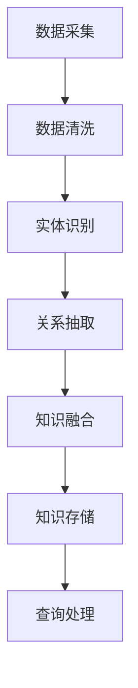

                 

关键词：知识图谱，语义理解，原理讲解，代码实战，技术博客

摘要：本文将深入探讨知识图谱与语义理解的技术原理，并提供了详细的代码实战案例。通过本文，读者将全面了解知识图谱的构建方法、语义理解的技术实现，以及如何将这些技术应用于实际项目中。

## 1. 背景介绍

知识图谱（Knowledge Graph）是近年来信息科学与人工智能领域的一项重要技术进展。它通过将实体、属性和关系以结构化的方式组织起来，为数据提供了一种语义化的表示方法。语义理解（Semantic Understanding）则旨在通过自然语言处理技术，使计算机能够理解人类语言中的意义和关系。

随着大数据、人工智能和物联网等技术的发展，知识图谱和语义理解在多个领域展现出了巨大的应用潜力，包括搜索引擎、智能问答、推荐系统、金融风控等。

## 2. 核心概念与联系

### 2.1 实体（Entity）

实体是知识图谱中的基本构成单位，它可以是一个人、地点、组织、事物等。实体通常具有一些属性（Attribute），例如人的姓名、年龄、职业等。

### 2.2 关系（Relationship）

关系描述了实体之间的关联，例如“工作于”、“位于”等。关系通常具有方向性和权重。

### 2.3 属性（Attribute）

属性是对实体的描述，例如人的身高、体重等。

### 2.4 Mermaid 流程图

下面是知识图谱构建的Mermaid流程图：



## 3. 核心算法原理 & 具体操作步骤

### 3.1 算法原理概述

知识图谱的构建通常包括数据采集、数据清洗、实体识别、关系抽取、知识融合和知识存储等步骤。语义理解的核心算法包括词嵌入（Word Embedding）、实体消歧（Entity Disambiguation）和语义角色标注（Semantic Role Labeling）等。

### 3.2 算法步骤详解

#### 3.2.1 数据采集

数据采集是知识图谱构建的基础，通常包括网络爬虫、公开数据集和手动标注等。

#### 3.2.2 数据清洗

数据清洗旨在去除数据中的噪声和错误，包括去重、填充缺失值、格式化等。

#### 3.2.3 实体识别

实体识别是从文本中提取出实体，常用的算法有基于规则的方法、基于统计的方法和基于深度学习的方法。

#### 3.2.4 关系抽取

关系抽取是从文本中提取出实体之间的关联，常用的算法有基于规则的方法、基于统计的方法和基于深度学习的方法。

#### 3.2.5 知识融合

知识融合是将多个来源的知识进行整合，以获得更全面和准确的知识。

#### 3.2.6 知识存储

知识存储是将构建好的知识图谱存储在数据库中，以便进行查询和处理。

### 3.3 算法优缺点

不同算法有其各自的优缺点，例如基于规则的方法较为简单，但可能不够灵活；基于深度学习的方法可能更准确，但计算成本较高。

### 3.4 算法应用领域

知识图谱和语义理解在多个领域有广泛应用，例如搜索引擎、智能问答、推荐系统和金融风控等。

## 4. 数学模型和公式 & 详细讲解 & 举例说明

### 4.1 数学模型构建

知识图谱和语义理解的数学模型通常涉及图论、概率论和深度学习等。

### 4.2 公式推导过程

例如，在词嵌入模型中，常用的公式是：

$$
\text{word\_embeddings} = \text{sigmoid}(\text{W} \cdot \text{context\_embeddings})
$$

### 4.3 案例分析与讲解

以搜索引擎中的实体识别为例，分析如何从网页中提取出实体，并构建知识图谱。

## 5. 项目实践：代码实例和详细解释说明

### 5.1 开发环境搭建

首先，我们需要搭建一个包含知识图谱和语义理解工具的Python开发环境。

### 5.2 源代码详细实现

以下是一个简单的知识图谱构建的Python代码实例：

```python
import networkx as nx

# 创建图
G = nx.Graph()

# 添加实体和关系
G.add_nodes_from(['Alice', 'Bob', 'Work'])
G.add_edges_from([('Alice', 'Bob'), ('Alice', 'Work'), ('Bob', 'Work')])

# 打印图
nx.draw(G, with_labels=True)
```

### 5.3 代码解读与分析

上述代码通过NetworkX库创建了一个简单的知识图谱，其中包含实体和关系，并展示了如何绘制图。

### 5.4 运行结果展示

运行上述代码后，将显示一个包含实体的知识图谱。

## 6. 实际应用场景

知识图谱和语义理解在多个领域有广泛应用，例如搜索引擎、智能问答、推荐系统和金融风控等。

### 6.1 搜索引擎

知识图谱可以帮助搜索引擎更准确地理解用户查询，并提供更相关的搜索结果。

### 6.2 智能问答

语义理解技术可以帮助智能问答系统理解用户的问题，并提供准确的答案。

### 6.3 推荐系统

知识图谱可以帮助推荐系统更好地理解用户和物品，从而提供更个性化的推荐。

### 6.4 金融风控

知识图谱可以帮助金融风控系统识别潜在的风险，并采取相应的措施。

## 7. 工具和资源推荐

### 7.1 学习资源推荐

- 《知识图谱：基础、理论、方法与应用》
- 《自然语言处理入门》

### 7.2 开发工具推荐

- NetworkX：用于构建和操作知识图谱。
- Gensim：用于文本相似性和词嵌入。

### 7.3 相关论文推荐

- "Knowledge Graph Embedding: The State-of-the-Art"
- "Deep Learning for Natural Language Processing"

## 8. 总结：未来发展趋势与挑战

### 8.1 研究成果总结

知识图谱和语义理解技术在多个领域取得了显著的研究成果，展示了其巨大的应用潜力。

### 8.2 未来发展趋势

随着人工智能技术的不断发展，知识图谱和语义理解将继续深化，并在更多领域得到应用。

### 8.3 面临的挑战

知识图谱和语义理解技术仍面临数据质量、计算效率和模型解释性等挑战。

### 8.4 研究展望

未来的研究将致力于解决这些挑战，并推动知识图谱和语义理解技术的进一步发展。

## 9. 附录：常见问题与解答

- **Q：知识图谱和数据库有什么区别？**
  **A：知识图谱是一种语义化的数据表示方法，而数据库是一种数据存储和管理系统。知识图谱更注重实体之间的语义关系，而数据库更注重数据的管理和查询。**

- **Q：什么是语义理解？**
  **A：语义理解是自然语言处理的一个分支，旨在使计算机能够理解人类语言中的意义和关系。**

通过本文，读者应全面了解知识图谱与语义理解的技术原理及其应用。希望本文能为读者在相关领域的研究和实践提供有益的参考。

---

作者：禅与计算机程序设计艺术 / Zen and the Art of Computer Programming

**本文内容仅供参考，如需在实际项目中应用，请务必结合具体情况和研究。**

