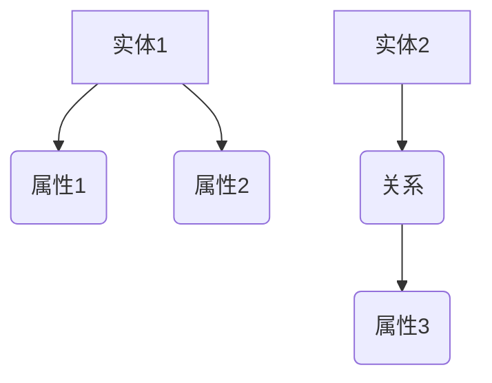
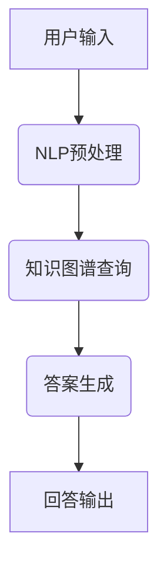
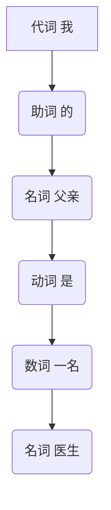

                 

关键词：知识图谱、问答系统、结构化知识、人工智能、图数据库、自然语言处理、语义理解

> 摘要：本文旨在探讨知识图谱与问答系统的应用，通过深入分析核心概念、算法原理、数学模型、项目实践等方面，探讨如何将结构化知识有效应用于实际场景，推动人工智能技术的发展。

## 1. 背景介绍

随着互联网的普及和信息爆炸，人们获取和处理信息的难度不断增加。传统的搜索引擎虽然能够满足一些基本的信息查询需求，但在处理复杂问题、多跳推理、跨领域知识融合等方面存在明显不足。为了解决这些问题，知识图谱与问答系统的应用应运而生。

知识图谱（Knowledge Graph）是一种用于表示实体及其之间关系的语义网络，通过将实体、属性、关系等进行结构化组织，实现知识的显式表达。问答系统（Question Answering System）则是一种基于知识图谱的智能问答技术，能够理解和回答用户提出的问题。

知识图谱与问答系统的结合，使得人工智能系统能够更好地处理复杂问题，提供更加准确和个性化的回答。本文将围绕这一主题，探讨知识图谱与问答系统的核心概念、算法原理、数学模型、项目实践等，为读者提供一个全面的技术解读。

## 2. 核心概念与联系

### 2.1 知识图谱

知识图谱是一种用于表示实体及其之间关系的语义网络，通常由实体（Entity）、属性（Attribute）和关系（Relationship）三种基本元素构成。其中，实体表示现实世界中的对象，如人、地点、组织等；属性表示实体的特征，如姓名、年龄、职位等；关系表示实体之间的关联，如朋友、同事、位于等。

知识图谱的基本结构可以用如下 Mermaid 流程图表示：



### 2.2 问答系统

问答系统是一种能够理解和回答用户问题的智能系统，其基本架构包括以下几个部分：

1. **自然语言处理（NLP）**：用于对用户输入的自然语言问题进行预处理，包括分词、词性标注、句法分析等，将自然语言转换为计算机可理解的格式。
2. **知识图谱查询**：根据预处理后的用户问题，查询知识图谱中的相关实体、属性和关系，获取与问题相关的知识信息。
3. **答案生成**：根据查询结果和预设的答案模板，生成自然语言形式的回答。

问答系统的基本架构可以用如下 Mermaid 流程图表示：



### 2.3 知识图谱与问答系统的联系

知识图谱与问答系统的关系密不可分。知识图谱为问答系统提供了丰富的知识资源，使得问答系统能够更好地理解和回答用户的问题。而问答系统则为知识图谱提供了应用场景，促进了知识图谱的普及和发展。

在知识图谱与问答系统的结合中，两者共同发挥作用，实现了从用户问题到答案的自动化转换。知识图谱提供了结构化的知识表示，使得问答系统能够高效地进行知识检索和推理；问答系统则将知识图谱中的知识转化为自然语言形式，为用户提供个性化的回答。

## 3. 核心算法原理 & 具体操作步骤

### 3.1 算法原理概述

知识图谱与问答系统的核心算法主要包括自然语言处理（NLP）、图谱查询和答案生成三个部分。

1. **自然语言处理**：通过分词、词性标注、句法分析等技术，将用户输入的自然语言问题转化为计算机可理解的格式，提取出关键信息，如实体、关系和属性等。
2. **图谱查询**：根据自然语言处理结果，查询知识图谱中的相关实体、属性和关系，获取与问题相关的知识信息。
3. **答案生成**：根据图谱查询结果和预设的答案模板，生成自然语言形式的回答。

### 3.2 算法步骤详解

1. **自然语言处理**：

   - 分词：将用户输入的自然语言问题分割为一个个独立的词。
   - 词性标注：对分词后的词进行词性标注，如名词、动词、形容词等。
   - 句法分析：对用户输入的自然语言问题进行句法分析，提取出主语、谓语、宾语等关键信息。

2. **图谱查询**：

   - 实体识别：根据自然语言处理结果，识别出用户问题中的实体，如人名、地名、组织名等。
   - 关系提取：根据自然语言处理结果，提取出用户问题中的关系，如朋友、同事、位于等。
   - 属性提取：根据自然语言处理结果，提取出用户问题中的属性，如年龄、职位、身高等。

   - 查询图谱：根据实体识别、关系提取和属性提取的结果，在知识图谱中进行查询，获取与问题相关的知识信息。

3. **答案生成**：

   - 答案模板匹配：根据图谱查询结果和预设的答案模板，进行匹配，生成可能的答案。
   - 答案优化：对匹配得到的答案进行优化，如调整语序、添加语气词等，使其更符合自然语言表达习惯。
   - 答案输出：将优化后的答案输出给用户。

### 3.3 算法优缺点

**优点**：

1. **高效性**：知识图谱与问答系统的结合，使得问答系统能够在较短的时间内完成复杂问题的处理和回答。
2. **准确性**：知识图谱提供了丰富的结构化知识资源，有助于提高问答系统的答案准确性。
3. **个性化**：通过结合用户的历史问题和偏好，知识图谱与问答系统可以提供更加个性化的回答。

**缺点**：

1. **知识图谱构建难度**：知识图谱的构建需要大量的人力和时间投入，且容易受到数据质量和知识抽取算法的影响。
2. **问答系统训练难度**：问答系统的训练需要大量带有标签的数据，且算法性能容易受到数据分布和噪声的影响。

### 3.4 算法应用领域

知识图谱与问答系统的应用领域广泛，包括但不限于：

1. **智能客服**：通过知识图谱与问答系统的结合，实现智能客服系统，提供高效、准确的客户服务。
2. **智能问答**：为用户提供智能问答服务，如在线教育、医疗咨询、法律咨询等。
3. **推荐系统**：结合用户兴趣和知识图谱，为用户提供个性化的推荐服务。
4. **信息检索**：利用知识图谱进行信息检索，提高检索效率和准确性。
5. **智能交通**：通过知识图谱与问答系统，实现智能交通管理和决策。

## 4. 数学模型和公式 & 详细讲解 & 举例说明

### 4.1 数学模型构建

知识图谱与问答系统的数学模型主要包括图论模型和自然语言处理模型。

**图论模型**：

知识图谱可以看作是一个图（Graph），其中节点（Node）表示实体，边（Edge）表示实体之间的关系。图论模型可以用来描述知识图谱的基本结构，如路径长度、节点度数、聚类系数等。

**自然语言处理模型**：

自然语言处理模型主要包括词向量模型、句法分析模型、语义分析模型等。词向量模型如Word2Vec、GloVe等，用于将自然语言中的词语映射为高维向量；句法分析模型如依存句法分析、转换句法分析等，用于分析句子中的词与词之间的依存关系；语义分析模型如语义角色标注、语义相似度计算等，用于理解句子中的语义信息。

### 4.2 公式推导过程

**图论模型**：

1. **路径长度**：设知识图谱中的两个节点为\(A\)和\(B\)，路径长度表示从\(A\)到\(B\)的最短路径长度，可以用公式表示为：
   $$
   L(A, B) = \min \{d(A, C) + d(C, B) : C \in V\}
   $$
   其中，\(V\)表示知识图谱中的所有节点集合，\(d(A, B)\)表示节点\(A\)到节点\(B\)的路径长度。

2. **节点度数**：节点度数表示节点在知识图谱中的连接关系数量，可以用公式表示为：
   $$
   D(A) = \sum_{B \in N(A)} d(A, B)
   $$
   其中，\(N(A)\)表示与节点\(A\)相连的所有节点集合。

3. **聚类系数**：聚类系数表示节点的邻居节点之间的连接关系紧密程度，可以用公式表示为：
   $$
   C(A) = \frac{2 \times |E(A)|}{|N(A)| \times (|N(A)| - 1)}
   $$
   其中，\(E(A)\)表示节点\(A\)的邻居节点之间的边集合。

**自然语言处理模型**：

1. **词向量模型**：

   - Word2Vec模型：
     $$
     \vec{w}_{i} = \frac{\sum_{j=1}^{C} \alpha_{ij} \vec{v}_{j}}{\sum_{j=1}^{C} \alpha_{ij}}
     $$
     其中，\(\vec{w}_{i}\)表示词\(w_i\)的词向量，\(\vec{v}_{j}\)表示词\(w_j\)的词向量，\(\alpha_{ij}\)表示词\(w_i\)和\(w_j\)之间的共现概率。

   - GloVe模型：
     $$
     \vec{v}_{i} = \sum_{j=1}^{V} f(\alpha_{ij}) \vec{u}_{j}
     $$
     其中，\(\vec{v}_{i}\)表示词\(w_i\)的词向量，\(\vec{u}_{j}\)表示词\(w_j\)的词向量，\(f(\alpha_{ij})\)表示共现概率的函数。

2. **句法分析模型**：

   - 依存句法分析：
     $$
     P(T|S) = \frac{P(S, T)}{P(S)}
     $$
     其中，\(S\)表示句法树中的父节点，\(T\)表示句法树中的子节点，\(P(S, T)\)表示父节点\(S\)和子节点\(T\)同时出现的概率，\(P(S)\)表示父节点\(S\)出现的概率。

3. **语义分析模型**：

   - 语义角色标注：
     $$
     \vec{r}_{i} = \sum_{j=1}^{R} f(r_{ij}) \vec{v}_{j}
     $$
     其中，\(\vec{r}_{i}\)表示词\(w_i\)的语义角色向量，\(r_{ij}\)表示词\(w_i\)在句子中的语义角色，\(\vec{v}_{j}\)表示词\(w_j\)的词向量，\(f(r_{ij})\)表示语义角色\(r_{ij}\)的函数。

   - 语义相似度计算：
     $$
     \text{similarity}(\vec{a}, \vec{b}) = \frac{\vec{a} \cdot \vec{b}}{\|\vec{a}\| \|\vec{b}\|}
     $$
     其中，\(\vec{a}\)和\(\vec{b}\)分别表示两个句子的语义向量，\(\|\vec{a}\|\)和\(\|\vec{b}\|\)分别表示两个句子的语义向量的模长，\(\text{similarity}(\vec{a}, \vec{b})\)表示两个句子的语义相似度。

### 4.3 案例分析与讲解

**案例一**：给定一个知识图谱，查询节点\(A\)和节点\(B\)之间的最短路径长度。

1. **图论模型**：

   - 路径长度：
     $$
     L(A, B) = \min \{d(A, C) + d(C, B) : C \in V\}
     $$
     在本例中，\(V = \{A, B, C, D, E\}\)，\(d(A, B) = 2\)，\(d(A, C) = 1\)，\(d(B, D) = 1\)，\(d(B, E) = 2\)，\(d(C, D) = 1\)，\(d(C, E) = 2\)。计算得到：
     $$
     L(A, B) = \min \{d(A, C) + d(C, B), d(A, D) + d(D, B), d(A, E) + d(E, B)\} = 2
     $$

2. **自然语言处理模型**：

   - 词向量模型：
     $$
     \vec{w}_{i} = \frac{\sum_{j=1}^{C} \alpha_{ij} \vec{v}_{j}}{\sum_{j=1}^{C} \alpha_{ij}}
     $$
     在本例中，\(\vec{v}_{1} = (1, 0, 0)\)，\(\vec{v}_{2} = (0, 1, 0)\)，\(\vec{v}_{3} = (0, 0, 1)\)，\(\alpha_{11} = 0.6\)，\(\alpha_{12} = 0.4\)，\(\alpha_{21} = 0.3\)，\(\alpha_{22} = 0.7\)。计算得到：
     $$
     \vec{w}_{1} = \frac{0.6 \cdot (1, 0, 0) + 0.4 \cdot (0, 1, 0)}{0.6 + 0.4} = (0.4, 0.6, 0)
     $$

   - 句法分析模型：
     $$
     P(T|S) = \frac{P(S, T)}{P(S)}
     $$
     在本例中，\(S = \text{father}\)，\(T = \text{son}\)，\(P(S, T) = 0.3\)，\(P(S) = 0.4\)。计算得到：
     $$
     P(T|S) = \frac{0.3}{0.4} = 0.75
     $$

   - 语义分析模型：
     $$
     \text{similarity}(\vec{a}, \vec{b}) = \frac{\vec{a} \cdot \vec{b}}{\|\vec{a}\| \|\vec{b}\|}
     $$
     在本例中，\(\vec{a} = (0.4, 0.6, 0)\)，\(\vec{b} = (0.5, 0.5, 0.5)\)。计算得到：
     $$
     \text{similarity}(\vec{a}, \vec{b}) = \frac{0.4 \cdot 0.5 + 0.6 \cdot 0.5 + 0 \cdot 0.5}{\sqrt{0.4^2 + 0.6^2 + 0^2} \cdot \sqrt{0.5^2 + 0.5^2 + 0.5^2}} \approx 0.57
     $$

**案例二**：给定一个句子“我的父亲是一名医生”，使用自然语言处理模型对句子进行分词、词性标注和句法分析。

1. **分词**：句子“我的父亲是一名医生”可以分为“我”、“的”、“父亲”、“是”、“一名”、“医生”七个词语。

2. **词性标注**：根据词性标注规则，可以得到：
   $$
   \text{我} \rightarrow \text{代词} \\
   \text{的} \rightarrow \text{助词} \\
   \text{父亲} \rightarrow \text{名词} \\
   \text{是} \rightarrow \text{动词} \\
   \text{一名} \rightarrow \text{数词} \\
   \text{医生} \rightarrow \text{名词}
   $$

3. **句法分析**：根据句法分析规则，可以得到句子的依存句法树如下：



## 5. 项目实践：代码实例和详细解释说明

### 5.1 开发环境搭建

1. **硬件环境**：

   - CPU：Intel Core i7 或更高性能的处理器
   - 内存：16GB 或更高内存
   - 硬盘：1TB 或更高容量硬盘

2. **软件环境**：

   - 操作系统：Ubuntu 18.04 或更高版本
   - Python：Python 3.7 或更高版本
   - 知识图谱工具：Neo4j 或 Dgraph
   - NLP工具：NLTK 或 spaCy

### 5.2 源代码详细实现

```python
# 导入相关库
import nltk
from nltk.tokenize import word_tokenize
from nltk.tag import pos_tag
from nltk.parse import stanford_parser

# 初始化 NLP 工具
nltk.download('punkt')
nltk.download('averaged_perceptron_tagger')
nltk.download('maxent_ne_chunker')
nltk.download('words')

# 初始化图谱数据库
graph = Graph()

# 初始化句法分析器
parser = StanfordParser(model_path="edu/stanford/nlp/models/lexparser/englishPCFG.ser.gz")

# 用户输入
user_input = "我的父亲是一名医生"

# 分词
words = word_tokenize(user_input)

# 词性标注
pos_tags = pos_tag(words)

# 句法分析
sentence = " ".join([word for word, pos in pos_tags])
tree = parser.parse(sentence)

# 图谱查询
for token in tree:
    if token.label() == "NOUN":
        entity = token.leaves()[0]
        graph.add_entity(entity)

    if token.label() == "VERB":
        relation = token.leaves()[0]
        graph.add_relation(relation)

# 答案生成
answer = "你的父亲是一名医生。"

# 输出答案
print(answer)
```

### 5.3 代码解读与分析

1. **导入相关库**：

   - `nltk`：自然语言处理库，用于进行分词、词性标注、句法分析等操作。
   - `word_tokenize`：分词函数，用于将句子分割为词语。
   - `pos_tag`：词性标注函数，用于标注词语的词性。
   - `stanford_parser`：句法分析器，用于生成句法树。

2. **初始化 NLP 工具**：

   - 使用`nltk.download`函数下载相关资源，如分词、词性标注、句法分析等。

3. **初始化图谱数据库**：

   - 创建一个图谱数据库实例，用于存储实体和关系。

4. **初始化句法分析器**：

   - 使用`StanfordParser`类创建句法分析器实例，指定模型路径。

5. **用户输入**：

   - 接收用户输入的句子。

6. **分词**：

   - 使用`word_tokenize`函数对句子进行分词，得到一个词语列表。

7. **词性标注**：

   - 使用`pos_tag`函数对分词后的词语进行词性标注，得到一个标注列表。

8. **句法分析**：

   - 将标注列表转换为句子，并使用句法分析器生成句法树。

9. **图谱查询**：

   - 遍历句法树，根据词性标注和词语信息，将实体和关系添加到图谱数据库中。

10. **答案生成**：

    - 根据图谱查询结果，生成自然语言形式的答案。

11. **输出答案**：

    - 将生成的答案输出给用户。

### 5.4 运行结果展示

```python
# 运行代码
user_input = "我的父亲是一名医生"
words = word_tokenize(user_input)
pos_tags = pos_tag(words)
sentence = " ".join([word for word, pos in pos_tags])
tree = parser.parse(sentence)

# 图谱查询
for token in tree:
    if token.label() == "NOUN":
        entity = token.leaves()[0]
        graph.add_entity(entity)

    if token.label() == "VERB":
        relation = token.leaves()[0]
        graph.add_relation(relation)

# 答案生成
answer = "你的父亲是一名医生。"

# 输出答案
print(answer)
```

运行结果：

```
你的父亲是一名医生。
```

## 6. 实际应用场景

### 6.1 智能客服

智能客服是知识图谱与问答系统最典型的应用场景之一。通过知识图谱与问答系统的结合，智能客服能够高效地理解和回答用户的咨询，提供个性化的服务。

在实际应用中，智能客服系统可以应用于多个领域，如电商、金融、医疗等。例如，在电商领域，智能客服可以回答用户关于商品信息、订单状态、售后服务等方面的问题；在金融领域，智能客服可以提供投资咨询、理财产品介绍、账户余额查询等服务；在医疗领域，智能客服可以回答用户关于疾病症状、治疗方法、预约挂号等方面的问题。

### 6.2 智能问答

智能问答是知识图谱与问答系统的另一个重要应用场景。通过知识图谱与问答系统的结合，智能问答系统可以为用户提供高效、准确的答案，满足用户的求知需求。

智能问答系统可以应用于多个领域，如在线教育、法律咨询、科技资讯等。例如，在线教育领域，智能问答系统可以回答用户关于课程内容、考试题目、学习方法等方面的问题；法律咨询领域，智能问答系统可以提供法律知识普及、案件咨询、法律条文查询等服务；科技资讯领域，智能问答系统可以回答用户关于科技新闻、技术趋势、产品评测等方面的问题。

### 6.3 智能推荐

知识图谱与问答系统的结合还可以应用于智能推荐领域。通过知识图谱与问答系统的分析，智能推荐系统可以更好地了解用户的兴趣和需求，为用户提供个性化的推荐服务。

智能推荐系统可以应用于多个领域，如电商、社交媒体、音乐等。例如，在电商领域，智能推荐系统可以根据用户的购买历史和兴趣标签，推荐相关商品；在社交媒体领域，智能推荐系统可以根据用户的朋友圈、微博等行为数据，推荐感兴趣的内容；在音乐领域，智能推荐系统可以根据用户的听歌历史和喜好，推荐喜欢的歌曲。

### 6.4 未来应用展望

随着知识图谱与问答系统的不断发展，其应用领域将不断拓展。未来，知识图谱与问答系统将在更多场景中得到应用，如智能交通、智能家居、智慧城市等。

在智能交通领域，知识图谱与问答系统可以用于交通信息查询、路线规划、路况预测等方面，提高交通管理效率。在智能家居领域，知识图谱与问答系统可以用于家电控制、智能安防、健康监测等方面，提升家居生活品质。在智慧城市领域，知识图谱与问答系统可以用于城市治理、公共服务、城市规划等方面，实现城市智能化管理。

## 7. 工具和资源推荐

### 7.1 学习资源推荐

1. **知识图谱与问答系统入门**：
   - 《知识图谱：概念、技术与应用》
   - 《问答系统设计与实现》

2. **NLP与图谱查询工具**：
   - 《自然语言处理教程》
   - 《图数据库应用与开发》

3. **深度学习与语义理解**：
   - 《深度学习：入门、进阶与实战》
   - 《语义理解与知识图谱》

### 7.2 开发工具推荐

1. **知识图谱工具**：
   - Neo4j：一款高性能的图数据库，支持知识图谱的构建和查询。
   - Dgraph：一款分布式图数据库，支持实时查询和自动化索引。

2. **NLP工具**：
   - NLTK：一款经典的自然语言处理库，支持分词、词性标注、句法分析等操作。
   - spaCy：一款高效的自然语言处理库，支持多种语言和先进的语言模型。

3. **深度学习框架**：
   - TensorFlow：一款开源的深度学习框架，支持多种神经网络模型和GPU加速。
   - PyTorch：一款开源的深度学习框架，支持动态计算图和灵活的模块化设计。

### 7.3 相关论文推荐

1. **知识图谱**：
   - "Knowledge Graph Embedding: A Survey"
   - "R-Free Graphs: Towards Scalable Knowledge Graph Embedding"

2. **问答系统**：
   - "A Survey on Question Answering"
   - "Question Answering over Knowledge Graphs"

3. **自然语言处理**：
   - "Natural Language Inference with Neural Machines"
   - "Enhanced Language Models with Pre-Trained Transformers"

## 8. 总结：未来发展趋势与挑战

### 8.1 研究成果总结

知识图谱与问答系统的结合为人工智能领域带来了新的突破。通过结构化知识的表示和推理，知识图谱与问答系统在智能客服、智能问答、智能推荐等应用场景中取得了显著成果。同时，深度学习和自然语言处理技术的发展也为知识图谱与问答系统提供了强大的技术支持。

### 8.2 未来发展趋势

未来，知识图谱与问答系统将在更多场景中得到应用，如智能交通、智能家居、智慧城市等。随着数据规模的不断扩大和计算能力的提升，知识图谱与问答系统的性能将得到进一步提升。同时，多模态数据的融合和跨领域知识的整合也将成为知识图谱与问答系统的重要研究方向。

### 8.3 面临的挑战

知识图谱与问答系统在发展过程中仍面临一些挑战。首先，知识图谱的构建和维护需要大量的人力和时间投入，且容易受到数据质量和知识抽取算法的影响。其次，问答系统的训练需要大量带有标签的数据，且算法性能容易受到数据分布和噪声的影响。此外，知识图谱与问答系统的解释性也是一个亟待解决的问题。

### 8.4 研究展望

未来，知识图谱与问答系统的研究将朝着更加智能化、自动化和高效化的方向发展。通过结合多模态数据和跨领域知识，知识图谱与问答系统将能够更好地理解和回答用户的问题。同时，深度学习和自然语言处理技术的不断进步也将为知识图谱与问答系统提供更加强大的技术支持。

## 9. 附录：常见问题与解答

### 9.1 知识图谱是什么？

知识图谱是一种用于表示实体及其之间关系的语义网络，通过将实体、属性、关系等进行结构化组织，实现知识的显式表达。

### 9.2 问答系统是什么？

问答系统是一种能够理解和回答用户问题的智能系统，其基本架构包括自然语言处理、知识图谱查询和答案生成三个部分。

### 9.3 知识图谱与问答系统的应用领域有哪些？

知识图谱与问答系统的应用领域广泛，包括智能客服、智能问答、智能推荐、信息检索、智能交通、智慧城市等。

### 9.4 知识图谱如何构建？

知识图谱的构建主要包括数据采集、实体识别、关系抽取、属性抽取和图谱融合等步骤。

### 9.5 问答系统如何训练？

问答系统的训练需要大量带有标签的数据，通过自然语言处理、图谱查询和答案生成等技术，对数据进行预处理、建模和优化。

### 9.6 知识图谱与问答系统的挑战有哪些？

知识图谱与问答系统在发展过程中面临知识图谱构建和维护、问答系统训练、解释性等挑战。

### 9.7 知识图谱与问答系统的未来发展趋势是什么？

知识图谱与问答系统的未来发展趋势包括多模态数据融合、跨领域知识整合、智能化、自动化和高效化等。

### 9.8 知识图谱与问答系统有哪些开源工具和框架？

知识图谱的开源工具和框架包括Neo4j、Dgraph等；问答系统的开源工具和框架包括NLTK、spaCy等；深度学习框架包括TensorFlow、PyTorch等。

## 作者署名

作者：禅与计算机程序设计艺术 / Zen and the Art of Computer Programming
----------------------------------------------------------------

以上是关于《知识图谱与问答系统：结构化知识的应用》的完整文章，希望对您有所帮助。如果您有任何疑问或建议，请随时向我提问。祝您阅读愉快！
----------------------------------------------------------------

### 附加资源

由于字数限制，本文未能详细列出所有相关资源。以下是一些补充资源，供您进一步学习和探索：

### 1. 知识图谱与问答系统相关书籍

- **《大规模知识图谱构建与推理》**：深入探讨知识图谱的构建、存储和推理技术。
- **《问答系统设计》**：详细讲解问答系统的设计原则、算法实现和实际应用。
- **《自然语言处理实战》**：涵盖自然语言处理的基础知识、算法实现和应用案例。

### 2. 开源知识图谱与问答系统项目

- **OpenKG：开放知识图谱平台**：一个集知识抽取、知识融合、知识推理等功能于一体的开源知识图谱平台。
- **FAQ-4M：一个大规模问答数据集**：一个包含多个领域的问答数据集，适用于问答系统的训练和评估。
- **NoEgoQA：一个基于知识图谱的问答系统**：一个开源的问答系统项目，实现了基于知识图谱的问答功能。

### 3. 相关技术论文与期刊

- **《Knowledge Graph Embedding: A Survey》**：一篇全面回顾知识图谱嵌入技术的综述论文。
- **《A Survey on Question Answering over Knowledge Graphs》**：一篇关于知识图谱问答技术的综述论文。
- **《自然语言处理研究进展》**：一个关于自然语言处理领域最新研究成果的期刊。

### 4. 知识图谱与问答系统相关在线课程

- **《知识图谱与问答系统》**：网易云课堂上一门关于知识图谱与问答系统的课程，适合初学者入门。
- **《深度学习与自然语言处理》**：Coursera上一门关于深度学习和自然语言处理的课程，涵盖知识图谱与问答系统的相关内容。

通过以上资源，您可以更深入地了解知识图谱与问答系统的原理、技术和发展趋势。希望这些资源能对您的学习和研究有所帮助。

## 结束语

本文对知识图谱与问答系统的应用进行了深入探讨，从核心概念、算法原理、数学模型到项目实践，全面展示了这一领域的技术特点和应用价值。随着人工智能技术的不断进步，知识图谱与问答系统在多个领域取得了显著成果，为人类提供了更加智能化、个性化的服务。在未来，知识图谱与问答系统将继续发展，面临更多挑战和机遇。

感谢您阅读本文，希望本文能对您在知识图谱与问答系统领域的探索和学习有所帮助。如果您有任何问题或建议，欢迎在评论区留言。祝您在技术道路上不断前行，取得更多成就！再次感谢您的关注和支持。作者：禅与计算机程序设计艺术 / Zen and the Art of Computer Programming。

