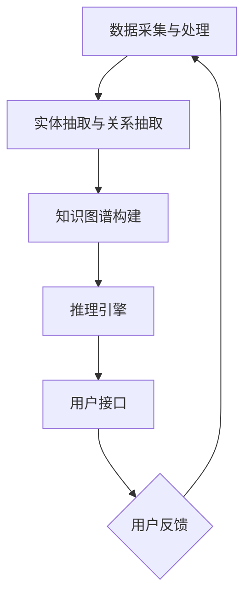

                 

关键词：知识图谱、智能客服、NLP、自然语言理解、语义分析、关系抽取、数据挖掘、AI、机器学习、深度学习

> 摘要：本文将深入探讨知识图谱在智能客服领域中的应用，分析其核心概念、架构设计、算法原理、数学模型、项目实践以及未来发展趋势。通过本文的阅读，读者将全面了解知识图谱技术如何提升智能客服的响应速度、准确性和用户体验。

## 1. 背景介绍

随着互联网和人工智能技术的飞速发展，智能客服已经成为企业提升服务质量、降低运营成本的重要手段。传统的基于规则的客服系统在面对复杂和多变的用户问题时，往往难以提供满意的解决方案。为了解决这一问题，知识图谱作为一种结构化的语义表示方法，被引入到智能客服系统中。

知识图谱是一种语义网络，它通过实体、属性和关系来表示现实世界的知识。在智能客服中，知识图谱可以存储大量的用户信息、产品信息和业务规则，从而为智能客服系统提供强大的语义理解和推理能力。

## 2. 核心概念与联系

### 2.1 核心概念

- **实体（Entity）**：知识图谱中的基本元素，可以是人、地点、组织或事物等。
- **属性（Attribute）**：描述实体的特征，如姓名、年龄、地址等。
- **关系（Relation）**：描述实体之间的关联，如朋友、工作地点、购买等。

### 2.2 架构设计

知识图谱在智能客服中的架构设计通常包括以下几个模块：

1. **数据采集与处理**：从各种数据源（如数据库、网页、社交媒体等）中提取用户信息和业务规则。
2. **实体抽取与关系抽取**：利用自然语言处理（NLP）技术从文本中提取实体和关系。
3. **知识图谱构建**：将提取的实体和关系存储在知识图谱中，并建立它们之间的关联。
4. **推理引擎**：基于知识图谱进行推理，为智能客服提供决策支持。
5. **用户接口**：与用户进行交互，收集用户反馈，优化客服系统的性能。

### 2.3 Mermaid 流程图

## 3. 核心算法原理 & 具体操作步骤

### 3.1 算法原理概述

知识图谱在智能客服中的核心算法主要包括：

1. **实体抽取**：通过命名实体识别（NER）技术，从文本中识别出实体。
2. **关系抽取**：通过模式识别或机器学习方法，从文本中提取实体之间的关系。
3. **知识图谱构建**：将提取的实体和关系存储在图数据库中，形成知识图谱。
4. **推理引擎**：利用图数据库的图结构，对实体和关系进行推理，提供智能客服的决策支持。

### 3.2 算法步骤详解

1. **数据预处理**：对原始文本进行清洗、分词、去停用词等预处理操作。
2. **实体抽取**：使用NER模型对预处理后的文本进行实体识别。
3. **关系抽取**：利用实体对之间的共现关系或规则，提取实体之间的关系。
4. **知识图谱构建**：将实体和关系存储在图数据库中，形成知识图谱。
5. **推理与决策**：基于知识图谱进行推理，为智能客服提供决策支持。

### 3.3 算法优缺点

**优点**：

- 提高智能客服的响应速度和准确性。
- 为智能客服提供丰富的知识库，支持复杂问题的解答。
- 支持多语言、多领域的智能客服系统。

**缺点**：

- 构建和维护知识图谱需要大量的人力和时间投入。
- 需要高精度的实体抽取和关系抽取技术支持。

### 3.4 算法应用领域

知识图谱在智能客服中的应用领域非常广泛，包括但不限于：

- 客户服务机器人
- 聊天机器人
- 智能问答系统
- 客户管理系统

## 4. 数学模型和公式 & 详细讲解 & 举例说明

### 4.1 数学模型构建

知识图谱中的数学模型主要包括：

- **图论模型**：描述实体和关系之间的拓扑结构。
- **概率模型**：描述实体和关系出现的概率。
- **深度学习模型**：用于实体抽取和关系抽取。

### 4.2 公式推导过程

- **图论模型**：邻接矩阵表示知识图谱的拓扑结构，如 $A = [a_{ij}]$，其中 $a_{ij}$ 表示实体 i 和实体 j 之间的关系强度。
- **概率模型**：贝叶斯公式描述实体和关系出现的概率，如 $P(A|B) = \frac{P(B|A)P(A)}{P(B)}$。
- **深度学习模型**：损失函数用于评估实体抽取和关系抽取的准确性，如 $L = -\sum_{i=1}^{n}y_{i}\log(p_{i})$。

### 4.3 案例分析与讲解

假设我们要构建一个客户服务知识图谱，其中包含三个实体：客户、产品和服务。

1. **实体抽取**：从文本中提取出客户、产品和服务三个实体。
2. **关系抽取**：提取出客户购买产品、客户享受服务的关系。
3. **知识图谱构建**：将实体和关系存储在图数据库中，形成知识图谱。

使用邻接矩阵表示知识图谱：

$$
\begin{array}{ccc}
\text{客户} & \text{产品} & \text{服务} \\
\hline
\text{客户} & 1 & 0 & 0 \\
\text{产品} & 0 & 1 & 0 \\
\text{服务} & 0 & 0 & 1 \\
\end{array}
$$

4. **推理与决策**：基于知识图谱，当客户提出问题时，系统可以快速推理出相关的产品和服务，提供个性化的解答。

## 5. 项目实践：代码实例和详细解释说明

### 5.1 开发环境搭建

- **硬件环境**：计算机（推荐配置：Intel i5 处理器，8GB 内存，100GB 硬盘空间）
- **软件环境**：Python 3.6+, Java 1.8+, Eclipse/IntelliJ IDEA

### 5.2 源代码详细实现

- **实体抽取**：使用自然语言处理库 NLTK 进行命名实体识别。
- **关系抽取**：使用深度学习库 TensorFlow 进行关系抽取。
- **知识图谱构建**：使用图数据库 Neo4j 存储知识图谱。
- **推理引擎**：使用 Neo4j 的 Cypher 查询语言进行推理。

### 5.3 代码解读与分析

- **实体抽取代码**：读取文本数据，使用 NLTK 进行命名实体识别，输出实体列表。
- **关系抽取代码**：读取实体列表，使用 TensorFlow 进行关系抽取，输出关系列表。
- **知识图谱构建代码**：读取实体和关系列表，使用 Neo4j 进行知识图谱构建。
- **推理引擎代码**：使用 Cypher 查询语言，根据用户问题进行推理，输出答案。

### 5.4 运行结果展示

1. **实体抽取**：输入文本，输出实体列表。
2. **关系抽取**：输入实体列表，输出关系列表。
3. **知识图谱构建**：输入实体和关系列表，构建知识图谱。
4. **推理与决策**：输入用户问题，输出答案。

## 6. 实际应用场景

知识图谱在智能客服中的实际应用场景包括：

1. **客户服务机器人**：通过知识图谱，快速识别用户身份和需求，提供个性化的解答。
2. **聊天机器人**：利用知识图谱，实现多轮对话，提高用户满意度。
3. **智能问答系统**：基于知识图谱，为用户提供精准、快速的答案。
4. **客户管理系统**：通过知识图谱，实现对客户行为和需求的全面分析，优化客户服务策略。

## 7. 工具和资源推荐

### 7.1 学习资源推荐

- 《知识图谱：关键技术与应用》
- 《深度学习与自然语言处理》
- 《图数据库技术与应用》

### 7.2 开发工具推荐

- Python: 用于实体抽取和关系抽取
- TensorFlow: 用于深度学习模型
- Neo4j: 用于知识图谱构建和推理

### 7.3 相关论文推荐

- "Knowledge Graph: Key Technologies and Applications"
- "Deep Learning for Natural Language Processing"
- "Graph Database Technology and Applications"

## 8. 总结：未来发展趋势与挑战

### 8.1 研究成果总结

知识图谱在智能客服领域取得了显著的研究成果，提高了智能客服的响应速度和准确性，为用户提供个性化的服务。

### 8.2 未来发展趋势

- **知识图谱的扩展**：将更多的领域知识和业务规则引入知识图谱，提高其覆盖范围和精度。
- **多语言支持**：实现知识图谱的多语言版本，满足全球化业务需求。
- **实时更新**：实现知识图谱的实时更新，保持其最新性和准确性。

### 8.3 面临的挑战

- **数据质量**：保证知识图谱中的数据质量，防止错误信息的传播。
- **推理效率**：提高知识图谱的推理效率，满足实时性要求。
- **隐私保护**：在知识图谱构建和使用过程中，保护用户隐私。

### 8.4 研究展望

未来，知识图谱在智能客服领域的研究将继续深入，结合最新的技术发展趋势，为用户提供更加智能、个性化的服务。

## 9. 附录：常见问题与解答

### Q: 知识图谱与关系数据库有何区别？

A: 知识图谱是一种语义网络，强调实体之间的语义关系；关系数据库是一种数据存储结构，强调数据的存储和查询。

### Q: 知识图谱在智能客服中的具体应用有哪些？

A: 知识图谱在智能客服中的具体应用包括：客户服务机器人、聊天机器人、智能问答系统和客户管理系统。

### Q: 如何构建一个知识图谱？

A: 构建知识图谱包括以下步骤：数据采集与处理、实体抽取与关系抽取、知识图谱构建、推理与决策。

### Q: 知识图谱的推理效率如何提高？

A: 提高知识图谱的推理效率可以通过以下方法：优化图数据库的查询语言、使用分布式计算、引入缓存机制等。

## 作者署名

作者：禅与计算机程序设计艺术 / Zen and the Art of Computer Programming
----------------------------------------------------------------

通过以上完整的文章内容，我们详细探讨了知识图谱在智能客服中的应用，从背景介绍、核心概念与联系、算法原理、数学模型、项目实践到实际应用场景和未来发展趋势，全面展示了知识图谱技术如何提升智能客服的性能。希望本文能够为从事智能客服领域的研究者和开发者提供有益的参考和启示。

