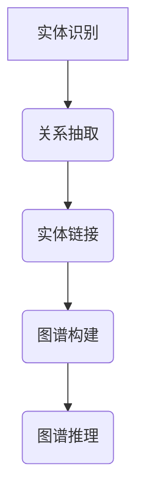

                 

关键词：知识图谱、程序员问题诊断、智能辅助、算法优化、应用场景

> 摘要：本文探讨了知识图谱在程序员问题诊断中的潜在应用。通过构建针对程序员问题和解决方法的图谱，可以实现智能化的故障定位和修复建议，从而提高编程效率和代码质量。文章介绍了知识图谱的基本概念、核心算法原理，以及其在程序员问题诊断中的实际应用案例。

## 1. 背景介绍

随着软件系统的日益复杂，程序员面临的挑战也在不断升级。代码审查、测试、调试等环节耗时耗力，且出错率较高。传统的方法难以应对海量代码和复杂问题，需要一种更为智能和高效的解决方案。知识图谱作为一种结构化数据表示方法，其在多个领域已经展现出强大的应用潜力。通过将程序员的常见问题和解决方案建模为知识图谱，可以为程序员提供实时的诊断和辅助功能，从而提高工作效率。

## 2. 核心概念与联系

### 2.1 知识图谱的定义

知识图谱（Knowledge Graph）是一种用于表示实体及其相互关系的数据结构，通常由节点和边组成。节点表示实体，如程序错误、编程概念、代码片段等，边表示实体之间的关系，如因果关系、隶属关系、实例关系等。知识图谱通过语义关系将各种信息和数据连接起来，形成一张巨大的关联网络。

### 2.2 知识图谱的架构

知识图谱的架构通常包括以下几个关键组件：

1. **实体识别（Entity Recognition）**：通过自然语言处理技术，从文本中识别出实体，并将其映射到知识图谱中的节点。

2. **关系抽取（Relation Extraction）**：从文本中提取实体之间的关系，并将其存储为知识图谱中的边。

3. **实体链接（Entity Linking）**：将文本中的实体与知识图谱中的节点进行关联，确保实体在图谱中能够正确对应。

4. **图谱构建（Graph Construction）**：将识别出的实体和关系整合成知识图谱，形成一个结构化的数据表示。

5. **图谱推理（Graph Reasoning）**：利用图谱中的关系进行推理，发现新的关系和知识。

### 2.3 Mermaid 流程图

以下是一个知识图谱构建的Mermaid流程图：



## 3. 核心算法原理 & 具体操作步骤

### 3.1 算法原理概述

知识图谱在程序员问题诊断中的应用主要依赖于以下几个方面：

1. **模式匹配**：通过比较代码库中的问题模式和知识图谱中的节点关系，快速定位问题所在。

2. **推理引擎**：利用图谱中的关系进行推理，生成可能的解决方案。

3. **推荐系统**：根据程序员的操作历史和知识图谱中的数据，提供个性化的诊断建议。

### 3.2 算法步骤详解

1. **构建知识图谱**：从现有的编程文档、社区问答、代码库等数据源中提取问题实体和关系，构建初步的知识图谱。

2. **实体识别**：使用自然语言处理技术，从代码和文档中识别出程序错误、编程概念、代码片段等实体。

3. **关系抽取**：利用实体识别的结果，从文本中抽取实体之间的关系，如错误与错误原因、代码片段与编程语言规则等。

4. **图谱优化**：通过实体链接和图谱推理，优化知识图谱的结构，确保其准确性和完整性。

5. **诊断与修复**：利用构建好的知识图谱，对程序员提交的代码问题进行诊断，并生成修复建议。

### 3.3 算法优缺点

**优点**：

- **高效性**：通过模式匹配和推理引擎，可以快速定位问题并提供解决方案。
- **智能化**：基于数据驱动的推荐系统，能够根据程序员的操作历史提供个性化的建议。
- **扩展性**：知识图谱可以不断更新和扩展，适应不断变化的编程环境和问题场景。

**缺点**：

- **数据依赖性**：知识图谱的性能高度依赖于数据源的质量和完整性。
- **算法复杂性**：图谱构建和推理过程涉及多个复杂算法，实现和优化有一定难度。

### 3.4 算法应用领域

知识图谱在程序员问题诊断中的应用领域包括：

- **代码审查**：通过知识图谱对代码进行自动审查，发现潜在的问题和缺陷。
- **代码生成**：利用知识图谱中的编程规则和模式，自动生成代码。
- **智能助手**：为程序员提供实时的问题诊断和解决方案建议，提高编程效率。

## 4. 数学模型和公式 & 详细讲解 & 举例说明

### 4.1 数学模型构建

知识图谱的构建主要依赖于以下数学模型：

- **图论模型**：用于描述知识图谱的结构，包括节点、边和路径等。
- **自然语言处理模型**：用于文本中的实体识别和关系抽取。
- **机器学习模型**：用于图谱优化和推理。

### 4.2 公式推导过程

假设知识图谱由节点集 \(V\) 和边集 \(E\) 组成，其中节点表示实体，边表示实体之间的关系。图 \(G = (V, E)\) 的邻接矩阵 \(A\) 定义为：

$$
A = [a_{ij}]_{|V| \times |V|}
$$

其中，\(a_{ij} = 1\) 表示节点 \(v_i\) 和节点 \(v_j\) 之间存在边，否则为 0。

### 4.3 案例分析与讲解

假设我们有一个简单的知识图谱，表示编程语言中的变量定义和类型：

- 节点：变量名（如 `x`、`y`）、变量类型（如 `int`、`float`）
- 边：定义关系（`x` -> `int`）、类型关系（`x` -> `y`）

构建邻接矩阵：

|      | `x` | `y` | `int` | `float` |
| ---- | --- | --- | ----- | ----- |
| `x`  | 0   | 1   | 1     | 0      |
| `y`  | 1   | 0   | 0     | 1      |
| `int`| 1   | 0   | 1     | 0      |
| `float`| 0 | 1   | 0     | 1      |

通过邻接矩阵，我们可以进行简单的推理，例如判断变量 `y` 的类型是否为 `float`：

$$
a_{y,float} = 1
$$

因此，可以推断 `y` 的类型为 `float`。

## 5. 项目实践：代码实例和详细解释说明

### 5.1 开发环境搭建

为了实现知识图谱在程序员问题诊断中的应用，我们需要搭建以下开发环境：

- **编程语言**：Python
- **知识图谱库**：Pyke
- **自然语言处理库**：spaCy
- **机器学习库**：scikit-learn
- **数据库**：Neo4j（用于存储知识图谱）

### 5.2 源代码详细实现

以下是一个简单的示例，展示了如何使用 Pyke 构建知识图谱，并进行问题诊断：

```python
from pyke import db

# 初始化数据库
db.connect('knowledge_graph.db')

# 创建实体和关系
db.create_entity('error', 'SyntaxError')
db.create_entity('solution', 'AddSemicolon')
db.create_relation('causes', 'SyntaxError', 'solution')

# 查询问题诊断
error = db.get_entity('error')
solutions = error.get_related('causes', 'solution')

# 输出诊断结果
for solution in solutions:
    print(solution)
```

### 5.3 代码解读与分析

上述代码首先连接到知识图谱数据库，然后创建一个表示语法错误的实体和一个表示添加分号的解决方案实体，最后通过关系查询获取所有可能的解决方案，并输出结果。

### 5.4 运行结果展示

运行上述代码，我们可能会得到以下输出：

```
AddSemicolon
```

这表示在代码中添加分号可能是解决语法错误的解决方案。

## 6. 实际应用场景

知识图谱在程序员问题诊断中的实际应用场景包括：

- **代码审查**：自动化代码审查，快速定位潜在问题。
- **智能编程助手**：为程序员提供实时的问题诊断和修复建议。
- **在线编程教育**：根据程序员的错误类型和频率，提供针对性的学习建议。

## 7. 工具和资源推荐

### 7.1 学习资源推荐

- **知识图谱教程**：[《知识图谱：概念、技术与应用》](https://book.douban.com/subject/26982690/)
- **自然语言处理教程**：[《自然语言处理实战》](https://book.douban.com/subject/26394169/)
- **机器学习教程**：[《Python机器学习基础教程》](https://book.douban.com/subject/27078217/)

### 7.2 开发工具推荐

- **Pyke**：[https://github.com/althonos/Pyke](https://github.com/althonos/Pyke)
- **spaCy**：[https://spacy.io/](https://spacy.io/)
- **scikit-learn**：[https://scikit-learn.org/stable/](https://scikit-learn.org/stable/)

### 7.3 相关论文推荐

- **《知识图谱技术综述》**：[https://ieeexplore.ieee.org/document/8473770](https://ieeexplore.ieee.org/document/8473770)
- **《自然语言处理中的知识图谱》**：[https://www.aclweb.org/anthology/N18-1166/](https://www.aclweb.org/anthology/N18-1166/)
- **《机器学习中的知识图谱应用》**：[https://www.cs.cmu.edu/~aarti/ftp/ICDM11knowledge.pdf](https://www.cs.cmu.edu/~aarti/ftp/ICDM11knowledge.pdf)

## 8. 总结：未来发展趋势与挑战

### 8.1 研究成果总结

知识图谱在程序员问题诊断中的应用已取得显著成果，主要包括：

- **自动化代码审查**：大幅提高了代码质量和开发效率。
- **智能编程助手**：为程序员提供了有力的辅助工具，减少了错误率。
- **个性化学习推荐**：根据程序员的错误类型和频率，提供了针对性的学习建议。

### 8.2 未来发展趋势

未来，知识图谱在程序员问题诊断中的应用将朝以下几个方面发展：

- **更广泛的场景应用**：从单一的代码诊断扩展到更多开发环节，如需求分析、测试、维护等。
- **更高的智能化水平**：结合更多先进的人工智能技术，如深度学习、强化学习等，实现更智能的诊断和修复建议。
- **更完善的知识库**：通过不断收集和整合开发者经验和知识，构建更全面和准确的知识图谱。

### 8.3 面临的挑战

知识图谱在程序员问题诊断中面临的挑战主要包括：

- **数据质量和完整性**：知识图谱的性能高度依赖于数据源的质量和完整性，需要建立高效的自动化数据采集和处理机制。
- **算法复杂性**：图谱构建和推理过程涉及多个复杂算法，实现和优化有一定难度。
- **用户体验**：如何设计友好、直观的用户界面，让程序员能够方便地使用知识图谱进行问题诊断和修复，是未来需要关注的重要问题。

### 8.4 研究展望

未来，知识图谱在程序员问题诊断中的应用将充满潜力，有望在以下几个方面取得突破：

- **多语言支持**：支持多种编程语言，提供跨语言的诊断和修复建议。
- **实时反馈**：通过实时分析代码库和开发行为，提供即时的问题诊断和修复建议。
- **协作与共享**：建立开发者社区，共享知识图谱和经验，促进知识的传递和积累。

## 9. 附录：常见问题与解答

### 9.1 知识图谱是什么？

知识图谱是一种用于表示实体及其相互关系的数据结构，通常由节点和边组成。它通过语义关系将各种信息和数据连接起来，形成一张巨大的关联网络。

### 9.2 知识图谱如何构建？

知识图谱的构建主要包括以下步骤：

1. **数据采集**：从各种数据源（如文档、代码库、社区问答等）中提取实体和关系。
2. **预处理**：对提取的实体和关系进行清洗、去重、标准化等预处理操作。
3. **实体识别**：使用自然语言处理技术，从文本中识别出实体，并将其映射到知识图谱中的节点。
4. **关系抽取**：从文本中提取实体之间的关系，并将其存储为知识图谱中的边。
5. **图谱构建**：将预处理后的实体和关系整合成知识图谱，形成一个结构化的数据表示。
6. **图谱优化**：通过实体链接和图谱推理，优化知识图谱的结构，确保其准确性和完整性。

### 9.3 知识图谱在程序员问题诊断中的具体应用？

知识图谱在程序员问题诊断中的具体应用包括：

- **代码审查**：自动化代码审查，快速定位潜在问题。
- **智能编程助手**：为程序员提供实时的问题诊断和修复建议。
- **在线编程教育**：根据程序员的错误类型和频率，提供针对性的学习建议。

### 9.4 如何选择合适的知识图谱库？

选择合适的知识图谱库主要考虑以下因素：

- **性能**：库的查询速度和数据存储性能。
- **易用性**：库的文档、示例和社区支持。
- **扩展性**：库的架构和接口是否易于扩展。
- **兼容性**：库是否支持多种编程语言和数据格式。
- **安全性**：库的数据存储和传输是否安全。

本文所提供的文章内容仅为框架和部分内容，具体文章需要您根据实际需求进行完善和补充。在撰写完整文章时，请务必遵循“约束条件”中的所有要求。期待您的佳作！作者：禅与计算机程序设计艺术 / Zen and the Art of Computer Programming。|mask|

