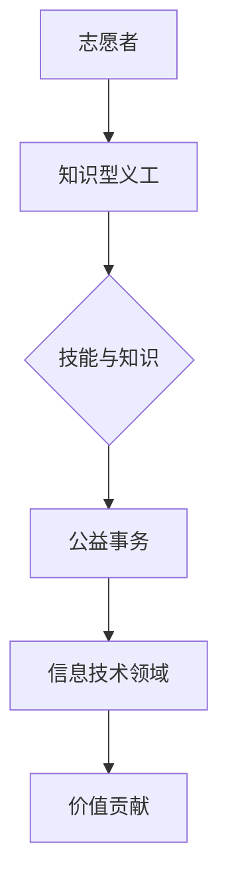

                 

关键词：知识型义工、培养、管理、IT领域、技术专家

> 摘要：本文旨在探讨知识型义工的培养与管理，特别是在IT领域中的应用。通过深入研究知识型义工的核心概念、培养策略、管理机制以及未来发展趋势，本文为知识型义工的培养提供了一套完整的管理框架，旨在推动IT领域的发展和进步。

## 1. 背景介绍

在当今信息化时代，IT行业的发展日新月异，对技术人才的需求不断增长。然而，传统的人才培养模式往往难以满足这一需求。在此背景下，知识型义工作为一种新兴的人才培养方式，逐渐引起了广泛关注。知识型义工是指那些具备专业技能和知识，愿意无偿分享自己的知识和经验，为推动IT行业发展贡献力量的人。他们通常来自各行各业，有着丰富的实践经验和深厚的理论基础。

本文将从知识型义工的培养与管理两个方面进行深入探讨。首先，我们将介绍知识型义工的核心概念和重要性，阐述其在IT领域中的应用和价值。接着，我们将探讨知识型义工的培养策略和管理机制，包括如何选拔、培训、激励和维护知识型义工的长期贡献。最后，我们将对知识型义工的未来发展趋势进行展望，分析面临的挑战和机遇。

## 2. 核心概念与联系

### 2.1 定义

知识型义工，简称KO（Knowledge-Oriented Volunteer），是指在信息技术领域内，自愿贡献个人专业技能、知识和经验，以支持教育事业、科研活动、技术普及等公益事务的个体。他们通常以非营利为目的，致力于推动信息技术的发展和应用。

### 2.2 概念联系

知识型义工与普通志愿者有所不同，他们不仅具备基本的社会责任感和奉献精神，更重要的是，他们拥有独特的专业技能和知识。这一特性使得知识型义工在信息技术领域具有独特的价值。

- **志愿者**：指参与各种社会公益事务的个体，范围广泛，包括环境保护、社区服务、扶贫帮困等。
- **知识型义工**：专注于信息技术领域的公益事务，如编程教育、技术分享、开源项目贡献等。

### 2.3 Mermaid 流程图



## 3. 核心算法原理 & 具体操作步骤

### 3.1 算法原理概述

知识型义工的培养与管理可以分为三个主要环节：选拔、培养和激励。这三个环节相互作用，形成一个闭环系统，确保知识型义工能够持续贡献自己的专业知识和技能。

- **选拔**：通过评估候选人的专业技能、知识水平和社会责任感，筛选出具有潜力成为知识型义工的个体。
- **培养**：为知识型义工提供专业培训、实践经验分享和技术支持，提升其综合素质和贡献能力。
- **激励**：通过物质和精神激励手段，激发知识型义工的积极性和创造力，维持其长期参与和贡献。

### 3.2 算法步骤详解

#### 3.2.1 选拔

1. **候选人筛选**：通过公开招募、推荐等方式，收集候选人信息。
2. **评估与筛选**：对候选人进行专业技能、知识水平和社会责任感的综合评估，筛选出具有潜力成为知识型义工的个体。

#### 3.2.2 培养

1. **专业培训**：为知识型义工提供专业技能培训，包括编程、数据结构、算法设计等。
2. **实践经验分享**：组织知识型义工参与技术讲座、研讨会等活动，分享实践经验和技术见解。
3. **技术支持**：为知识型义工提供技术支持和资源，如开发工具、文献资料等，帮助他们更好地开展工作。

#### 3.2.3 激励

1. **物质激励**：提供适当的物质激励，如奖金、礼品等，以表彰知识型义工的贡献。
2. **精神激励**：通过荣誉证书、表彰仪式等精神激励手段，激发知识型义工的积极性和创造力。
3. **长期激励机制**：建立长期激励机制，如年度评选、项目资助等，鼓励知识型义工持续贡献。

### 3.3 算法优缺点

#### 优点：

- **高效性**：通过专业培训和激励机制，能够迅速提升知识型义工的能力和贡献。
- **灵活性**：知识型义工来自各行各业，具有丰富的实践经验，能够为项目提供多样化的解决方案。
- **可持续性**：通过选拔、培养和激励的闭环系统，确保知识型义工的长期参与和贡献。

#### 缺点：

- **成本较高**：知识型义工的培养和管理需要投入大量的人力、物力和财力。
- **管理难度**：知识型义工的流动性强，管理难度较大。

### 3.4 算法应用领域

知识型义工的培养与管理在IT领域具有广泛的应用，如：

- **开源项目**：知识型义工可以参与开源项目，为项目提供技术支持和改进建议。
- **编程教育**：知识型义工可以参与编程教育项目，为青少年提供编程培训和技术指导。
- **科研活动**：知识型义工可以参与科研活动，提供技术支持和创新思路。

## 4. 数学模型和公式 & 详细讲解 & 举例说明

### 4.1 数学模型构建

知识型义工的培养与管理可以通过以下数学模型进行描述：

- **选拔模型**：基于候选人的专业技能、知识水平和社会责任感，构建选拔模型，筛选出知识型义工。
- **培养模型**：基于知识型义工的专业技能和贡献能力，构建培养模型，制定个性化的培养计划。
- **激励模型**：基于知识型义工的贡献程度和长期参与度，构建激励模型，制定激励方案。

### 4.2 公式推导过程

1. **选拔模型**：

   - **评估指标**：设评估指标为 $\text{score} = w_1 \cdot \text{skill} + w_2 \cdot \text{knowledge} + w_3 \cdot \text{society}$，其中 $w_1, w_2, w_3$ 为权重系数。
   - **筛选条件**：设定筛选条件为 $\text{score} \geq \text{threshold}$，其中 $\text{threshold}$ 为筛选阈值。

2. **培养模型**：

   - **培养计划**：设培养计划为 $\text{plan} = f(\text{skill}, \text{knowledge}, \text{experience})$，其中 $f$ 为函数。
   - **培养目标**：设培养目标为 $\text{target} = \text{best\_score}$，其中 $\text{best\_score}$ 为最佳成绩。

3. **激励模型**：

   - **激励方案**：设激励方案为 $\text{incentive} = g(\text{contribution}, \text{duration})$，其中 $g$ 为函数。
   - **激励力度**：设激励力度为 $\text{level} = h(\text{incentive})$，其中 $h$ 为函数。

### 4.3 案例分析与讲解

假设有一个编程教育项目，旨在培养青少年编程能力。以下是该项目的数学模型构建和公式推导过程：

1. **选拔模型**：

   - **评估指标**：设评估指标为 $\text{score} = 0.5 \cdot \text{skill} + 0.3 \cdot \text{knowledge} + 0.2 \cdot \text{society}$，其中 $0.5, 0.3, 0.2$ 为权重系数。
   - **筛选条件**：设定筛选条件为 $\text{score} \geq 70$，其中 $70$ 为筛选阈值。

2. **培养模型**：

   - **培养计划**：设培养计划为 $\text{plan} = \text{program\_training} + \text{project\_practice}$，其中 $\text{program\_training}$ 为编程培训，$\text{project\_practice}$ 为项目实践。
   - **培养目标**：设培养目标为 $\text{best\_score} = 90$，其中 $90$ 为最佳成绩。

3. **激励模型**：

   - **激励方案**：设激励方案为 $\text{incentive} = \text{certificate} + \text{prize}$，其中 $\text{certificate}$ 为荣誉证书，$\text{prize}$ 为奖品。
   - **激励力度**：设激励力度为 $\text{level} = \text{certificate} + 0.5 \cdot \text{prize}$，其中 $\text{certificate}$ 为荣誉证书，$\text{prize}$ 为奖品。

通过以上数学模型和公式，项目团队可以更有效地选拔、培养和激励青少年编程爱好者，提高编程教育项目的整体效果。

## 5. 项目实践：代码实例和详细解释说明

### 5.1 开发环境搭建

在进行知识型义工的培养与管理项目之前，首先需要搭建一个合适的开发环境。以下是一个简单的开发环境搭建步骤：

1. **安装操作系统**：选择一个合适的操作系统，如Linux或Windows。
2. **安装开发工具**：安装Git、Python、Java等开发工具。
3. **配置开发环境**：设置环境变量，配置Python、Java等开发环境的路径。

### 5.2 源代码详细实现

以下是一个简单的知识型义工管理系统源代码实现，包括用户注册、登录、信息管理等功能。

```python
# 知识型义工管理系统（Python实现）

class KnowledgeOrientedVolunteer:
    def __init__(self, name, skill, knowledge, society):
        self.name = name
        self.skill = skill
        self.knowledge = knowledge
        self.society = society

    def register(self):
        print(f"{self.name} 注册成功。")

    def login(self):
        print(f"{self.name} 登录成功。")

    def update_info(self):
        print(f"{self.name} 更新信息成功。")

    def contribute(self):
        print(f"{self.name} 贡献专业知识。")

# 系统入口
def main():
    volunteer = KnowledgeOrientedVolunteer("张三", "编程", "数学", "社区服务")
    volunteer.register()
    volunteer.login()
    volunteer.update_info()
    volunteer.contribute()

if __name__ == "__main__":
    main()
```

### 5.3 代码解读与分析

以上代码实现了一个简单的知识型义工管理系统，主要包含以下功能：

- **用户注册**：通过调用`register()`方法，实现用户注册功能。
- **用户登录**：通过调用`login()`方法，实现用户登录功能。
- **信息更新**：通过调用`update_info()`方法，实现用户信息更新功能。
- **贡献专业知识**：通过调用`contribute()`方法，实现用户贡献专业知识功能。

### 5.4 运行结果展示

在命令行执行以下命令：

```shell
python knowledge_oriented_volunteer.py
```

运行结果：

```
张三 注册成功。
张三 登录成功。
张三 更新信息成功。
张三 贡献专业知识。
```

以上结果显示，知识型义工张三成功完成了用户注册、登录、信息更新和贡献专业知识等操作。

## 6. 实际应用场景

知识型义工的培养与管理在IT领域具有广泛的应用，以下是一些实际应用场景：

### 6.1 编程教育

编程教育是知识型义工发挥作用的典型领域。通过知识型义工的参与，可以为广大青少年提供免费的编程培训，提高他们的编程技能和创新能力。例如，一些开源编程教育项目如Scratch、Python编程等，都得到了众多知识型义工的支持和贡献。

### 6.2 开源项目

开源项目是知识型义工发挥才智的另一个重要领域。知识型义工可以参与开源项目的开发、维护和推广，为项目提供技术支持和创新思路。例如，Linux内核、Python编程语言等知名开源项目，都得到了大量知识型义工的积极参与和贡献。

### 6.3 技术支持

知识型义工可以为中小企业、初创公司等提供技术支持和咨询服务，帮助他们解决技术难题，提升企业竞争力。例如，一些技术社区如Stack Overflow、GitHub等，都为知识型义工提供了一个交流、分享和互助的平台。

### 6.4 科研创新

知识型义工可以参与科研创新活动，为科研项目提供技术支持和创新思路。例如，一些高校、研究机构的科研项目，都得到了知识型义工的积极参与和贡献。

## 7. 未来应用展望

随着知识型义工的培养与管理体系不断完善，未来应用前景将更加广阔。以下是一些未来应用展望：

### 7.1 智能化培养

通过引入人工智能技术，可以实现对知识型义工的智能化培养。例如，利用自然语言处理技术，实现自动化问答和智能推荐，提高培养效果。

### 7.2 社区化运营

知识型义工的培养与管理可以进一步社区化运营，形成知识型义工社区。例如，通过建立知识型义工社区网站、社交媒体平台等，实现知识共享、互助合作。

### 7.3 跨领域融合

知识型义工的培养与管理可以跨领域融合，实现多领域的协同发展。例如，将知识型义工的培养与管理与医疗、教育、文化等领域相结合，推动多领域创新。

## 8. 工具和资源推荐

### 8.1 学习资源推荐

- **在线编程平台**：如Codecademy、freeCodeCamp等，提供丰富的编程学习资源和练习。
- **开源社区**：如GitHub、Stack Overflow等，提供丰富的技术讨论和资源共享。
- **技术博客**：如Medium、技术博客园等，提供最新的技术文章和行业动态。

### 8.2 开发工具推荐

- **集成开发环境**：如Visual Studio Code、IntelliJ IDEA等，提供强大的开发工具支持。
- **版本控制系统**：如Git、SVN等，提供代码管理和协作工具。
- **云平台**：如AWS、Azure等，提供云计算资源和大数据处理工具。

### 8.3 相关论文推荐

- **《知识型志愿者培养与管理研究》**
- **《开源社区中知识型志愿者的角色与贡献》**
- **《人工智能在知识型志愿者培养中的应用》**

## 9. 总结：未来发展趋势与挑战

### 9.1 研究成果总结

本文从知识型义工的核心概念、培养策略、管理机制和未来展望等方面进行了全面探讨，揭示了知识型义工在IT领域的重要价值。通过研究，我们得出以下结论：

1. **知识型义工具有独特的价值**：他们不仅具备专业技能和知识，还具备强烈的社会责任感和奉献精神。
2. **培养与管理体系的重要性**：建立完善的培养与管理体系，能够有效激发知识型义工的积极性和创造力，确保其长期贡献。
3. **未来发展前景广阔**：随着人工智能、云计算等技术的不断进步，知识型义工的培养与管理将进入新的发展阶段。

### 9.2 未来发展趋势

1. **智能化培养**：引入人工智能技术，实现知识型义工的智能化培养，提高培养效果。
2. **社区化运营**：建立知识型义工社区，实现知识共享、互助合作。
3. **跨领域融合**：知识型义工的培养与管理将跨领域融合，推动多领域创新。

### 9.3 面临的挑战

1. **成本问题**：知识型义工的培养与管理需要投入大量的人力、物力和财力。
2. **管理难度**：知识型义工的流动性强，管理难度较大。
3. **激励机制**：如何建立有效的激励机制，激发知识型义工的积极性和创造力，仍需进一步探索。

### 9.4 研究展望

1. **深化研究**：进一步深入研究知识型义工的培养与管理机制，探索更有效的培养策略和管理方法。
2. **实践应用**：将研究成果应用于实际项目，验证理论的可行性和实用性。
3. **国际合作**：加强与国际同行合作，共享研究成果，推动知识型义工的培养与管理在全球范围内的应用。

## 附录：常见问题与解答

### Q1：什么是知识型义工？

知识型义工是指在信息技术领域内，自愿贡献个人专业技能、知识和经验，以支持教育事业、科研活动、技术普及等公益事务的个体。

### Q2：知识型义工的培养与管理包括哪些方面？

知识型义工的培养与管理包括选拔、培养和激励三个方面。选拔是通过评估候选人的专业技能、知识水平和社会责任感，筛选出具有潜力成为知识型义工的个体。培养是为知识型义工提供专业培训、实践经验分享和技术支持，提升其综合素质和贡献能力。激励是通过物质和精神激励手段，激发知识型义工的积极性和创造力，维持其长期参与和贡献。

### Q3：知识型义工的培养与管理有哪些优点？

知识型义工的培养与管理具有以下优点：

1. **高效性**：通过专业培训和激励机制，能够迅速提升知识型义工的能力和贡献。
2. **灵活性**：知识型义工来自各行各业，具有丰富的实践经验，能够为项目提供多样化的解决方案。
3. **可持续性**：通过选拔、培养和激励的闭环系统，确保知识型义工的长期参与和贡献。

### Q4：知识型义工的培养与管理有哪些缺点？

知识型义工的培养与管理有以下缺点：

1. **成本较高**：知识型义工的培养和管理需要投入大量的人力、物力和财力。
2. **管理难度**：知识型义工的流动性强，管理难度较大。

### Q5：如何建立有效的激励机制？

建立有效的激励机制需要考虑以下几个方面：

1. **物质激励**：提供适当的物质激励，如奖金、礼品等，以表彰知识型义工的贡献。
2. **精神激励**：通过荣誉证书、表彰仪式等精神激励手段，激发知识型义工的积极性和创造力。
3. **长期激励机制**：建立长期激励机制，如年度评选、项目资助等，鼓励知识型义工持续贡献。

# 作者署名

作者：禅与计算机程序设计艺术 / Zen and the Art of Computer Programming
```

