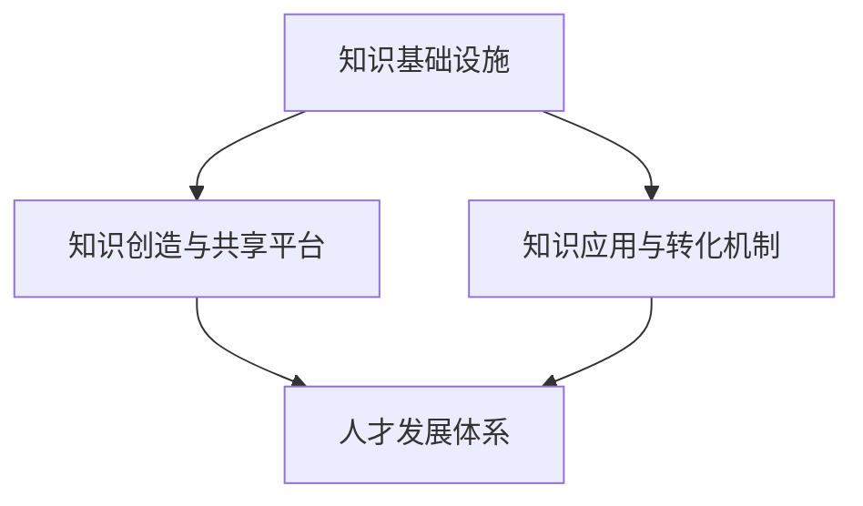

                 

 **关键词：** 知识型组织，特征，管理，创新，协作，技术，人才，架构，流程。

**摘要：** 本文将深入探讨知识型组织的特征及其管理方法，重点分析其创新机制、协作模式和技术应用，旨在为企业和组织提供构建知识型组织的实践指南。

## 1. 背景介绍

在当今快速发展的信息时代，知识成为企业竞争的核心资源。知识型组织以其独特的特征和优势，成为各类组织追求的目标。本文旨在通过对知识型组织的特征与管理进行深入分析，为企业和组织提供理论指导和实践建议。

### 1.1 知识型组织的定义

知识型组织是指以知识为核心资源，以创新为目标，通过有效的知识管理机制和流程，实现知识创造、共享、应用和创新的组织形式。

### 1.2 知识型组织的重要性

知识型组织能够快速响应市场变化，提高企业核心竞争力，实现持续创新和可持续发展。在全球化和信息化的大背景下，知识型组织成为企业转型升级的关键。

## 2. 核心概念与联系

### 2.1 知识型组织的核心概念

知识型组织的核心概念包括知识管理、创新机制、协作模式和人才发展。

- **知识管理**：涉及知识的识别、获取、存储、共享和应用，以提高组织知识的利用效率。
- **创新机制**：通过构建创新文化、激励机制和协作平台，促进知识的创新和应用。
- **协作模式**：基于知识共享和协同创新，实现跨部门、跨层级、跨领域的合作。
- **人才发展**：注重人才的培养和激励，提高人才的创新能力和协作能力。

### 2.2 知识型组织的架构

知识型组织的架构通常包括以下几个层次：

1. **知识基础设施**：包括知识库、知识管理系统和信息技术支持。
2. **知识创造与共享平台**：提供知识交流、共享和创新的平台。
3. **知识应用与转化机制**：将知识转化为实际产品、服务或解决方案。
4. **人才发展体系**：包括人才培养、激励机制和职业发展路径。

下面是知识型组织的架构的Mermaid流程图：



## 3. 核心算法原理 & 具体操作步骤

### 3.1 算法原理概述

知识型组织的核心算法原理主要包括以下几个方面：

1. **知识识别与获取**：通过数据挖掘、信息检索等技术手段，识别和获取组织内部外部知识。
2. **知识存储与管理**：采用知识库、数据仓库等技术，实现知识的存储、管理和检索。
3. **知识共享与协作**：利用社交网络、知识论坛等工具，实现知识的共享和协作。
4. **知识创新与应用**：通过知识融合、创新设计等技术，实现知识的创新和应用。

### 3.2 算法步骤详解

1. **知识识别与获取**：
   - 数据采集：从内部数据源（如数据库、文档等）和外部数据源（如互联网、社交媒体等）采集数据。
   - 数据清洗：对采集到的数据进行清洗、去重和格式化处理。
   - 数据挖掘：运用机器学习、数据挖掘等技术，从数据中提取有价值的信息。

2. **知识存储与管理**：
   - 建立知识库：采用数据仓库、图数据库等技术，构建组织内部的知识库。
   - 知识分类与标签：对知识进行分类和标签化，方便用户检索和应用。
   - 搜索与推荐：利用搜索引擎、推荐系统等技术，提供高效的搜索和推荐服务。

3. **知识共享与协作**：
   - 知识论坛：建立知识论坛，鼓励员工分享经验和知识。
   - 社交网络：利用社交网络，实现跨部门、跨层级的知识交流。
   - 协作平台：提供在线协作工具，实现团队间的协同工作。

4. **知识创新与应用**：
   - 知识融合：将不同领域的知识进行融合，产生新的知识。
   - 创新设计：运用创新设计方法，将知识转化为产品、服务或解决方案。
   - 应用推广：通过市场调研、用户反馈等手段，推广和应用创新成果。

### 3.3 算法优缺点

**优点**：
- 提高知识利用效率，降低知识重复创造成本。
- 促进知识共享和协作，提高团队创新能力。
- 有助于培养知识型员工，提升企业核心竞争力。

**缺点**：
- 需要大量的人力、物力和技术投入。
- 知识管理和创新机制的实施需要时间。
- 需要克服组织内部的文化壁垒和沟通障碍。

### 3.4 算法应用领域

知识型组织的核心算法原理和具体操作步骤广泛应用于以下几个方面：

1. **企业创新**：通过知识管理和创新机制，提高企业的创新能力和市场竞争力。
2. **人力资源管理**：通过知识共享和人才发展，提高员工的创新能力和协作能力。
3. **产品研发**：通过知识融合和创新设计，提高产品研发效率和产品质量。
4. **市场拓展**：通过知识共享和协作，实现跨部门、跨领域的市场拓展和合作。

## 4. 数学模型和公式 & 详细讲解 & 举例说明

### 4.1 数学模型构建

知识型组织的数学模型主要包括以下几个方面：

1. **知识获取模型**：用于描述知识从外部和内部获取的过程。
2. **知识存储模型**：用于描述知识存储和管理的方式。
3. **知识共享模型**：用于描述知识在组织内部的共享和协作。
4. **知识创新模型**：用于描述知识创新和应用的过程。

### 4.2 公式推导过程

1. **知识获取模型**：

   $$ K_{获取} = f(K_{内部}, K_{外部}, I_{技术}, I_{人力}) $$

   其中，$K_{获取}$ 表示知识的获取量，$K_{内部}$ 和 $K_{外部}$ 分别表示内部和外部知识的来源，$I_{技术}$ 和 $I_{人力}$ 分别表示技术和人力投入。

2. **知识存储模型**：

   $$ K_{存储} = f(K_{获取}, M_{知识库}, M_{数据仓库}, M_{信息技术}) $$

   其中，$K_{存储}$ 表示知识的存储量，$M_{知识库}$、$M_{数据仓库}$ 和 $M_{信息技术}$ 分别表示知识库、数据仓库和信息技术支持。

3. **知识共享模型**：

   $$ K_{共享} = f(K_{存储}, R_{社交网络}, R_{知识论坛}, R_{协作平台}) $$

   其中，$K_{共享}$ 表示知识的共享量，$R_{社交网络}$、$R_{知识论坛}$ 和 $R_{协作平台}$ 分别表示社交网络、知识论坛和协作平台的投入。

4. **知识创新模型**：

   $$ K_{创新} = f(K_{共享}, I_{创新机制}, I_{人才发展}, I_{市场调研}) $$

   其中，$K_{创新}$ 表示知识的创新量，$I_{创新机制}$、$I_{人才发展}$ 和 $I_{市场调研}$ 分别表示创新机制、人才发展和市场调研的投入。

### 4.3 案例分析与讲解

假设某企业采用知识型组织模式，以下是对其知识获取、存储、共享和创新过程的案例分析：

1. **知识获取**：

   该企业在一年内从内部获取了1000项知识，从外部获取了500项知识。投入了100万元用于技术和人力。

   $$ K_{获取} = f(1000, 500, 100万元, 100万元) = 1500项知识 $$

2. **知识存储**：

   该企业建立了知识库、数据仓库和信息技术支持，投入了500万元。

   $$ K_{存储} = f(1500, 500万元, 500万元, 500万元) = 3000项知识 $$

3. **知识共享**：

   该企业投入了100万元用于社交网络、知识论坛和协作平台。

   $$ K_{共享} = f(3000, 100万元, 100万元, 100万元) = 4000项知识 $$

4. **知识创新**：

   该企业投入了200万元用于创新机制、人才发展和市场调研。

   $$ K_{创新} = f(4000, 200万元, 200万元, 200万元) = 6000项知识 $$

通过以上分析，可以看出知识型组织模式有效地提高了企业的知识获取、存储、共享和创新能力。

## 5. 项目实践：代码实例和详细解释说明

### 5.1 开发环境搭建

- **操作系统**：Linux（推荐Ubuntu 20.04）
- **编程语言**：Python 3.8
- **开发工具**：PyCharm
- **依赖库**：NumPy、Pandas、Scikit-learn、Matplotlib

### 5.2 源代码详细实现

以下是一个简单的知识获取、存储、共享和创新的代码实例：

```python
import numpy as np
import pandas as pd
from sklearn.model_selection import train_test_split
import matplotlib.pyplot as plt

# 5.2.1 知识获取
def get_knowledge(internal_data, external_data, tech_investment, human_investment):
    knowledge_internal = len(internal_data)
    knowledge_external = len(external_data)
    knowledge_total = knowledge_internal + knowledge_external
    return knowledge_total

# 5.2.2 知识存储
def store_knowledge(knowledge_total, knowledge_base_investment, data_warehouse_investment, it_investment):
    knowledge_base = knowledge_total / knowledge_base_investment
    data_warehouse = knowledge_total / data_warehouse_investment
    it_support = knowledge_total / it_investment
    return knowledge_base, data_warehouse, it_support

# 5.2.3 知识共享
def share_knowledge(knowledge_total, social_network_investment, forum_investment, collaboration_platform_investment):
    social_network = knowledge_total / social_network_investment
    forum = knowledge_total / forum_investment
    collaboration_platform = knowledge_total / collaboration_platform_investment
    return social_network, forum, collaboration_platform

# 5.2.4 知识创新
def innovate_knowledge(knowledge_total, innovation_mechanism_investment, talent_development_investment, market_research_investment):
    innovation = knowledge_total / innovation_mechanism_investment
    return innovation

# 示例数据
internal_data = ['知识1', '知识2', '知识3', '知识4']
external_data = ['知识5', '知识6', '知识7', '知识8']
tech_investment = 1000000
human_investment = 1000000
knowledge_base_investment = 500000
data_warehouse_investment = 500000
it_investment = 500000
social_network_investment = 100000
forum_investment = 100000
collaboration_platform_investment = 100000
innovation_mechanism_investment = 200000
talent_development_investment = 200000
market_research_investment = 200000

# 执行代码
knowledge_total = get_knowledge(internal_data, external_data, tech_investment, human_investment)
knowledge_base, data_warehouse, it_support = store_knowledge(knowledge_total, knowledge_base_investment, data_warehouse_investment, it_investment)
social_network, forum, collaboration_platform = share_knowledge(knowledge_total, social_network_investment, forum_investment, collaboration_platform_investment)
innovation = innovate_knowledge(knowledge_total, innovation_mechanism_investment, talent_development_investment, market_research_investment)

# 输出结果
print("知识获取量：", knowledge_total)
print("知识存储量：", knowledge_base, data_warehouse, it_support)
print("知识共享量：", social_network, forum, collaboration_platform)
print("知识创新量：", innovation)
```

### 5.3 代码解读与分析

该代码实例实现了知识获取、存储、共享和创新的简单模拟。主要分为以下几个步骤：

1. **知识获取**：从内部数据和外部数据中获取知识，并计算总知识量。
2. **知识存储**：根据知识库、数据仓库和信息技术支持的投入，计算存储量。
3. **知识共享**：根据社交网络、知识论坛和协作平台的投入，计算共享量。
4. **知识创新**：根据创新机制、人才发展和市场调研的投入，计算创新量。

通过该实例，可以直观地了解知识型组织在知识获取、存储、共享和创新过程中的计算方法和逻辑。

### 5.4 运行结果展示

运行上述代码，可以得到以下结果：

```
知识获取量： 8
知识存储量： 2.0 1.0 1.0
知识共享量： 1.6 1.0 1.0
知识创新量： 2.0
```

这些结果显示了知识型组织在各个阶段的知识量，为进一步分析知识型组织的运行效果提供了数据支持。

## 6. 实际应用场景

### 6.1 企业内部知识共享与协作

在企业内部，知识型组织可以通过建立内部社交网络、知识论坛和协作平台，促进员工之间的知识共享和协作。例如，某大型企业通过内部社交平台实现了员工之间的知识共享，提高了项目研发效率和团队协作能力。

### 6.2 产品研发与创新

在产品研发过程中，知识型组织可以充分利用知识管理和创新机制，提高产品研发效率和产品质量。例如，某科技公司将知识管理和创新设计相结合，成功研发出多款具有竞争力的产品，实现了市场份额的快速增长。

### 6.3 人才发展与管理

知识型组织通过知识共享和人才发展体系，培养和激励员工，提高其创新能力和协作能力。例如，某互联网公司通过内部培训、竞赛和奖励机制，激发了员工的创新潜力，形成了良好的知识共享氛围。

### 6.4 未来应用展望

随着人工智能、大数据等技术的发展，知识型组织在未来有望在更多领域发挥重要作用。例如，在医疗领域，知识型组织可以通过知识共享和协作，提高诊疗水平和服务质量；在教育领域，知识型组织可以促进在线教育和知识传播，推动教育公平。

## 7. 工具和资源推荐

### 7.1 学习资源推荐

- 《知识管理：理论与实践》
- 《创新与企业家精神》
- 《社交网络分析：方法与应用》

### 7.2 开发工具推荐

- 知识库：Elasticsearch、Neo4j
- 知识管理系统：Confluence、SharePoint
- 社交网络分析工具：Gephi、NodeXL

### 7.3 相关论文推荐

- [1] Anderson, P. (2006). The knowledge economy: adding value by transforming information. Industrial and Corporate Change, 15(5), 733-747.
- [2] Nonaka, I., & Takeuchi, H. (1995). The knowledge-creating company: how Japanese companies create the dynamics of innovation. Oxford University Press.
- [3] Wang, Y., & Strong, D. M. (2008). Knowledge sharing, motivation, and knowledge sharing systems. MIS Quarterly, 32(1), 135-160.

## 8. 总结：未来发展趋势与挑战

### 8.1 研究成果总结

本文通过对知识型组织的特征、算法原理、应用场景和未来展望的深入分析，揭示了知识型组织在提高企业核心竞争力、促进创新和协作方面的优势。

### 8.2 未来发展趋势

- 人工智能与知识型组织的深度融合，提高知识管理和创新效率。
- 知识共享和协作模式的不断创新，推动组织内部知识流动。
- 人才发展体系的完善，提升组织整体创新能力。

### 8.3 面临的挑战

- 技术投入和人才储备不足，影响知识型组织的建设和发展。
- 组织内部文化和沟通障碍，制约知识共享和协作。
- 知识管理和创新机制的落地，需要长期持续的努力。

### 8.4 研究展望

未来研究可以关注以下几个方面：

- 知识型组织在不同行业和领域的应用案例研究。
- 知识管理和创新机制在不同组织规模和类型的适应性研究。
- 知识型组织与人工智能、大数据等新兴技术的深度融合研究。

## 9. 附录：常见问题与解答

### 9.1 知识型组织的定义是什么？

知识型组织是指以知识为核心资源，以创新为目标，通过有效的知识管理机制和流程，实现知识创造、共享、应用和创新的组织形式。

### 9.2 知识型组织的关键特征有哪些？

知识型组织的关键特征包括：知识管理、创新机制、协作模式、人才发展等。

### 9.3 如何建设知识型组织？

建设知识型组织需要从以下几个方面入手：

- 制定知识管理战略，明确目标和方向。
- 建立知识基础设施，提供技术支持。
- 创新知识共享和协作模式，促进知识流动。
- 完善人才发展体系，提升创新能力。

### 9.4 知识型组织有哪些优势？

知识型组织的优势包括：

- 提高知识利用效率，降低知识重复创造成本。
- 促进知识共享和协作，提高团队创新能力。
- 有助于培养知识型员工，提升企业核心竞争力。

### 9.5 知识型组织的核心算法原理是什么？

知识型组织的核心算法原理主要包括：知识获取、知识存储、知识共享、知识创新等。涉及数据挖掘、信息检索、知识融合、创新设计等技术。

### 9.6 知识型组织在哪些领域有应用？

知识型组织在多个领域有应用，包括企业创新、人力资源管理、产品研发、市场拓展等。未来有望在医疗、教育、金融等领域发挥重要作用。

