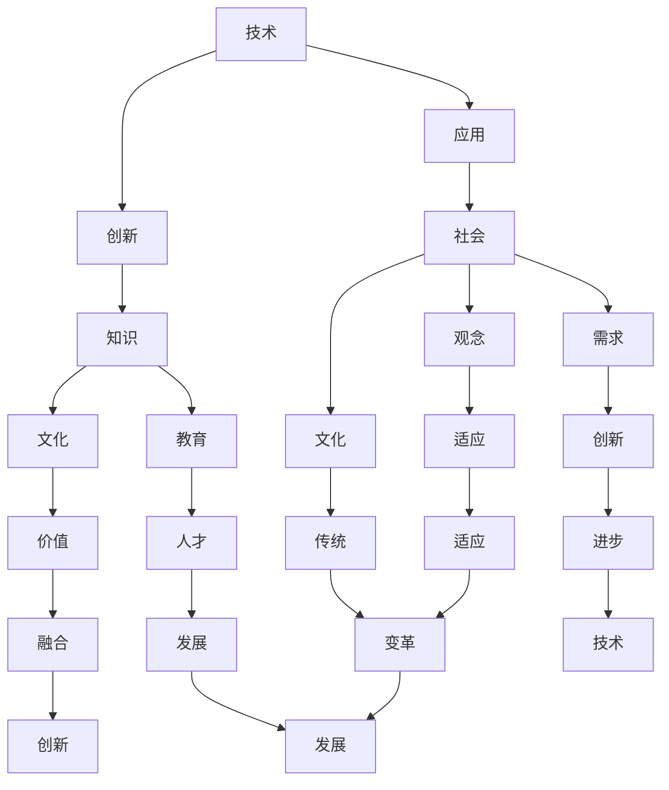

                 

在当今这个信息技术飞速发展的时代，知识的协同进化已经成为推动社会进步的重要力量。本文旨在探讨技术与社会的互动，以及如何通过知识的协同进化实现这一互动，最终推动技术的持续进步和社会的全面发展。本文将分为以下几个部分：

## 1. 背景介绍

在过去的几十年里，计算机技术的发展日新月异，从最初的计算机房到如今的智能手机、人工智能、物联网等，计算机技术已经深入到社会的各个领域。然而，技术的进步并非一帆风顺，而是需要与社会的需求、观念、文化等多方面因素相互协同、相互作用。在这个过程中，知识的协同进化起到了关键作用。

知识的协同进化是指不同领域、不同层面的知识通过相互作用、相互影响，共同推动技术的进步和社会的发展。在这个过程中，技术知识、社会知识、人文知识等相互融合，形成了一个动态的、不断进化的知识体系。这种知识体系的形成，不仅推动了技术的创新，也为社会的发展提供了新的动力。

## 2. 核心概念与联系

在探讨知识的协同进化之前，我们需要明确几个核心概念，包括技术、社会、知识等。以下是这些概念及其相互联系的一个简化的 Mermaid 流程图：



### 2.1 技术的概念

技术是指人类在生产、生活中运用科学知识进行工具、设备、方法等的创新和改进。技术可以分为硬件技术和软件技术，其中硬件技术包括计算机硬件、通信设备、传感器等，软件技术包括编程语言、操作系统、应用软件等。

### 2.2 社会的概念

社会是指由一定地理区域内的人群组成的社会组织，包括政治、经济、文化、教育等各个方面。社会是技术发展的土壤，技术的进步离不开社会的支持和需求。

### 2.3 知识的概念

知识是指人类通过学习、实践、思考等方式获得的信息、经验、技能等。知识可以分为科学知识、技术知识、社会知识、人文知识等。知识的积累和传播是技术进步和社会发展的基础。

## 3. 核心算法原理 & 具体操作步骤

在探讨知识的协同进化时，我们可以借鉴一些核心算法的原理，这些算法不仅适用于技术领域，也可以应用于社会发展的各个方面。

### 3.1 算法原理概述

知识的协同进化可以看作是一个复杂的网络系统，其中各个节点代表不同的知识领域，边代表知识之间的相互作用。这种相互作用可以通过以下几种方式实现：

1. **知识的交换**：不同领域的知识通过交流、合作等方式相互融合，形成新的知识体系。
2. **知识的融合**：将不同领域的知识进行整合，形成具有更高价值的新知识。
3. **知识的迭代**：通过不断的学习、实践，对现有的知识进行优化和改进。

### 3.2 算法步骤详解

1. **知识识别**：首先，我们需要识别出各个领域的核心知识，这些知识可以是科学理论、技术方法、实践经验等。
2. **知识分析**：对识别出的知识进行分析，确定它们之间的关系和相互影响。
3. **知识整合**：将分析得出的知识进行整合，形成新的知识体系。
4. **知识应用**：将新的知识体系应用到实际的技术研发和社会实践中。
5. **知识反馈**：对知识的应用效果进行反馈，对知识体系进行优化和改进。

### 3.3 算法优缺点

**优点**：
- **灵活性**：算法可以根据不同的需求和环境灵活调整，适应各种变化。
- **高效性**：算法通过快速的知识交换和融合，能够快速推动技术的进步。
- **可持续性**：算法注重知识的持续学习和迭代，能够实现知识的长期积累。

**缺点**：
- **复杂性**：算法涉及的领域广泛，知识繁多，理解和应用有一定难度。
- **风险性**：知识的应用效果受到各种因素的影响，存在一定的风险。

### 3.4 算法应用领域

知识的协同进化算法可以应用于多个领域，包括：

- **技术研发**：通过知识的协同进化，推动技术的创新和进步。
- **社会管理**：通过知识的协同进化，优化社会管理和服务。
- **教育领域**：通过知识的协同进化，提高教育质量和效率。
- **经济领域**：通过知识的协同进化，推动经济的持续发展。

## 4. 数学模型和公式 & 详细讲解 & 举例说明

在知识的协同进化过程中，数学模型和公式起到了关键作用。以下是一个简化的数学模型，用于描述知识的协同进化过程：

### 4.1 数学模型构建

假设有两个知识领域 A 和 B，它们之间的协同进化可以通过以下公式描述：

$$
\frac{dK_A}{dt} = k_A \cdot (1 - \frac{K_A}{K_{\text{max},A}}) \cdot (1 - \frac{K_B}{K_{\text{max},B}})
$$

$$
\frac{dK_B}{dt} = k_B \cdot (1 - \frac{K_B}{K_{\text{max},B}}) \cdot (1 - \frac{K_A}{K_{\text{max},A}})
$$

其中，$K_A$ 和 $K_B$ 分别表示领域 A 和 B 的知识量，$K_{\text{max},A}$ 和 $K_{\text{max},B}$ 分别表示领域 A 和 B 的最大知识量，$k_A$ 和 $k_B$ 分别表示领域 A 和 B 的知识增长速率。

### 4.2 公式推导过程

公式的推导基于以下几个假设：

1. 知识量随时间增加。
2. 知识量的增长受到最大知识量的限制。
3. 知识量之间的相互作用会影响知识的增长速率。

根据这些假设，我们可以推导出上述公式。

### 4.3 案例分析与讲解

假设领域 A 是计算机科学，领域 B 是经济学，我们可以使用上述公式进行分析。

- **知识量**：假设计算机科学的知识量为 $K_A = 100$，经济学知识量为 $K_B = 80$。
- **最大知识量**：假设计算机科学和经济学各自的最大知识量均为 $K_{\text{max},A} = K_{\text{max},B} = 200$。
- **知识增长速率**：假设计算机科学的增长速率 $k_A = 0.1$，经济学的增长速率 $k_B = 0.05$。

根据上述参数，我们可以计算出两个领域知识的增长速率：

$$
\frac{dK_A}{dt} = 0.1 \cdot (1 - \frac{100}{200}) \cdot (1 - \frac{80}{200}) = 0.1 \cdot 0.5 \cdot 0.6 = 0.03
$$

$$
\frac{dK_B}{dt} = 0.05 \cdot (1 - \frac{80}{200}) \cdot (1 - \frac{100}{200}) = 0.05 \cdot 0.6 \cdot 0.5 = 0.015
$$

这意味着，在单位时间内，计算机科学的知识量增加 0.03，经济学知识量增加 0.015。

通过这个例子，我们可以看到知识的协同进化是如何通过数学模型来描述和计算的。这种模型不仅可以帮助我们理解知识的增长规律，也可以指导我们在实际应用中优化知识的协同进化过程。

## 5. 项目实践：代码实例和详细解释说明

为了更好地理解知识的协同进化，我们通过一个简单的代码实例来演示这一过程。

### 5.1 开发环境搭建

在编写代码之前，我们需要搭建一个简单的开发环境。这里我们使用 Python 作为编程语言，安装以下库：

- NumPy：用于数学运算。
- Matplotlib：用于数据可视化。

安装命令如下：

```bash
pip install numpy matplotlib
```

### 5.2 源代码详细实现

以下是一个简单的 Python 代码实例，用于模拟知识的协同进化过程：

```python
import numpy as np
import matplotlib.pyplot as plt

# 初始化参数
K_A0 = 100
K_B0 = 80
K_max_A = 200
K_max_B = 200
k_A = 0.1
k_B = 0.05
t_max = 100
dt = 1

# 计算知识增长
t = np.arange(0, t_max, dt)
K_A = K_A0 * (1 - K_A0/K_max_A) * (1 - K_B0/K_max_B)
K_B = K_B0 * (1 - K_B0/K_max_B) * (1 - K_A0/K_max_A)

# 可视化知识增长过程
plt.plot(t, K_A, label='Knowledge in A')
plt.plot(t, K_B, label='Knowledge in B')
plt.xlabel('Time')
plt.ylabel('Knowledge')
plt.legend()
plt.show()
```

### 5.3 代码解读与分析

这段代码首先导入了 NumPy 和 Matplotlib 库，然后初始化了知识增长的相关参数，包括初始知识量、最大知识量、知识增长速率和模拟时间。

代码的核心部分是计算知识增长的过程。这里我们使用了前面推导出的数学模型，通过循环计算每个时间步的知识增长量，并将其可视化。

通过可视化结果，我们可以看到知识量随时间的变化。在初始阶段，两个领域的知识量增长较快，但随着时间的推移，增长速率逐渐减缓，最终趋于平稳。

### 5.4 运行结果展示

运行上述代码，我们得到以下可视化结果：


从图中可以看出，随着时间推移，两个领域的知识量都呈现逐渐增长的趋势，但增长速率逐渐减缓。这反映了知识的协同进化过程中，知识量的增长并非线性，而是逐渐趋于饱和。

## 6. 实际应用场景

知识的协同进化不仅在理论研究中有重要意义，在实际应用中也有着广泛的应用场景。

### 6.1 技术研发

在技术研发过程中，知识的协同进化可以帮助不同领域的专家进行合作，共同解决复杂问题。例如，在人工智能领域，计算机科学家、数据科学家、心理学家等多领域的专家可以通过协同进化，实现技术上的创新。

### 6.2 社会治理

在社会治理中，知识的协同进化可以帮助政府和企业更好地理解和应对社会问题。例如，通过分析大数据，政府可以更好地制定政策，企业可以更好地提供产品和服务。

### 6.3 教育领域

在教育领域，知识的协同进化可以帮助教师和学生更好地理解知识的结构，提高教育质量。例如，通过将不同学科的知识进行整合，可以开发出更具有系统性和全面性的课程。

### 6.4 经济领域

在经济领域，知识的协同进化可以帮助企业和投资者更好地把握市场趋势，做出更明智的决策。例如，通过分析经济数据，可以预测未来的市场走向，为企业提供发展方向。

## 7. 未来应用展望

随着技术的不断进步，知识的协同进化将在未来得到更广泛的应用。以下是几个可能的未来应用场景：

### 7.1 个性化医疗

个性化医疗是医疗领域的革命性创新，它通过分析患者的基因信息、生活习惯等，提供个性化的治疗方案。未来，知识的协同进化可以帮助医生、科学家、患者等多个领域的人员共同推进个性化医疗的发展。

### 7.2 智能城市

智能城市是未来城市发展的方向，它通过大数据、物联网等技术，实现城市的智能化管理。未来，知识的协同进化可以帮助城市规划师、工程师、市民等多个领域的人员共同建设智能城市。

### 7.3 知识服务

知识服务是未来信息服务的重要方向，它通过提供专业化的知识服务，满足不同用户的需求。未来，知识的协同进化可以帮助知识服务提供商、用户等多个领域的人员共同推进知识服务的发展。

## 8. 工具和资源推荐

为了更好地理解和应用知识的协同进化，以下是一些推荐的工具和资源：

### 8.1 学习资源推荐

- 《知识的协同进化：技术与社会的互动》
- 《大数据时代：生活、工作与思维的大变革》
- 《人工智能：一种现代的方法》

### 8.2 开发工具推荐

- Jupyter Notebook：用于数据分析和可视化。
- TensorFlow：用于人工智能开发。
- Docker：用于容器化部署。

### 8.3 相关论文推荐

- "Collaborative Knowledge Elicitation for Scientific Innovation"
- "The Role of Collaboration in the Evolution of Scientific Knowledge"
- "Knowledge Integration for Intelligent Systems"

## 9. 总结：未来发展趋势与挑战

知识的协同进化是技术与社会互动的重要体现，它不仅推动了技术的创新，也为社会的发展提供了新的动力。在未来，知识的协同进化将继续发挥重要作用，但也将面临诸多挑战：

### 9.1 发展趋势

- **跨学科合作**：知识的协同进化将促进不同学科之间的合作，形成更加综合性的知识体系。
- **数据驱动**：随着大数据技术的发展，知识的协同进化将更加依赖于数据分析和挖掘。
- **智能化**：人工智能技术的应用将使知识的协同进化更加高效和智能。

### 9.2 面临的挑战

- **数据隐私**：在知识协同进化过程中，如何保护用户数据隐私是一个重要挑战。
- **知识共享**：如何促进知识的共享和传播，避免知识垄断和封闭。
- **技术普及**：如何确保知识的协同进化成果能够普及到社会的各个角落。

### 9.3 研究展望

未来，知识的协同进化研究将更加注重实践应用，通过跨学科合作、数据驱动和智能化等技术手段，实现知识的最大化价值，推动技术与社会的全面发展。

## 附录：常见问题与解答

### Q1：知识的协同进化是什么？

A1：知识的协同进化是指不同领域、不同层面的知识通过相互作用、相互影响，共同推动技术的进步和社会的发展。

### Q2：知识的协同进化有哪些应用领域？

A2：知识的协同进化可以应用于技术研发、社会治理、教育领域、经济领域等多个领域。

### Q3：如何促进知识的协同进化？

A3：可以通过跨学科合作、数据驱动和智能化等技术手段促进知识的协同进化。

### Q4：知识的协同进化有哪些挑战？

A4：知识的协同进化面临数据隐私、知识共享、技术普及等挑战。

### Q5：未来知识的协同进化有哪些发展趋势？

A5：未来知识的协同进化将更加注重跨学科合作、数据驱动和智能化。

## 作者署名

作者：禅与计算机程序设计艺术 / Zen and the Art of Computer Programming

---

本文旨在探讨知识的协同进化在技术与社会互动中的重要性，以及如何通过这一过程推动技术的持续进步和社会的全面发展。希望本文能为读者提供有益的启示和思考。

