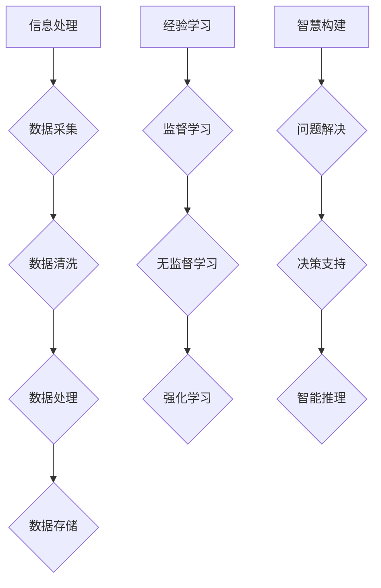

                 

关键词：知识本质、信息处理、经验学习、智慧构建、计算机科学、人工智能

> 摘要：本文旨在探讨知识在信息、经验与智慧三个层面上的本质及其相互关系。通过对计算机科学领域中知识处理的深入分析，阐述如何利用先进技术实现知识的有效获取、存储、处理和利用，最终达成智慧的升华。文章将涵盖知识理论的历史背景、核心概念、算法原理、数学模型，以及实际应用和未来发展。

## 1. 背景介绍

知识的本质是一个历久弥新的话题，自人类文明诞生以来，哲学家、科学家和思想家们都在探讨知识是如何被构建和传播的。从苏格拉底的“知识就是美德”到康德的“纯粹理性批判”，再到皮亚杰的认知发展理论，对知识的理解不断演进。

在计算机科学领域，知识的本质同样受到广泛关注。随着人工智能、大数据和机器学习的飞速发展，知识的获取和处理能力得到了显著提升。计算机科学不仅提供了高效的算法和模型，还通过互联网和云计算等平台，使知识共享变得更加便捷。然而，知识的本质及其在信息处理、经验学习和智慧构建中的角色仍需深入探讨。

本文将分几个部分来探讨知识的本质，首先回顾知识理论的历史发展，然后分析信息、经验与智慧三个层面的核心概念，接着探讨核心算法原理和数学模型，最后讨论实际应用和未来趋势。通过这一系列的探讨，希望能够为读者提供一个全面而深入的视角，理解知识的本质及其在现代社会中的重要价值。

## 2. 核心概念与联系

### 2.1 信息处理

信息处理是知识构建的基础。信息可以被定义为数据的有意义的形式，它通过传递、存储和处理，为我们提供关于外部世界的认知。在计算机科学中，信息处理通常涉及以下几个步骤：

- **数据采集**：通过各种传感器和输入设备收集原始数据。
- **数据清洗**：去除噪声和不相关数据，提高数据质量。
- **数据处理**：使用算法和统计方法，对数据进行加工和转换。
- **数据存储**：将处理后的信息存储在数据库或文件系统中，以便后续访问和使用。

信息处理的关键在于如何有效地从大量数据中提取有价值的信息。这一过程不仅依赖于算法的效率，还依赖于对数据特征和模式的深入理解。

### 2.2 经验学习

经验学习是知识积累和发展的关键环节。通过不断的实践和反思，个体或系统可以从经验中学习和成长。在计算机科学领域，经验学习通常通过机器学习算法实现：

- **监督学习**：通过已有标注数据，训练模型进行预测和分类。
- **无监督学习**：从未标注的数据中发现模式和结构。
- **强化学习**：通过与环境交互，不断优化行为策略。

经验学习的重要性在于它能够使计算机系统具备适应新环境和解决新问题的能力。这一过程不仅需要大量的数据支持，还需要对学习算法的深入理解和优化。

### 2.3 智慧构建

智慧是人类认知的高级形式，是知识和经验的综合体现。智慧不仅仅是信息的积累，更是对信息的理解和应用。在计算机科学中，智慧构建通常涉及以下几个方面：

- **问题解决**：通过算法和模型，解决复杂问题。
- **决策支持**：提供基于数据和模型的决策建议。
- **智能推理**：基于知识和逻辑，进行推理和判断。

智慧构建的目标是使计算机系统能够像人类一样，具备理解、判断和决策的能力。这一过程需要深入理解人类智慧的本质，并将其转化为计算机算法和模型。

### 2.4 Mermaid 流程图

为了更好地理解信息、经验与智慧三个层面的核心概念，我们使用 Mermaid 流程图进行展示：



通过上述流程图，我们可以清晰地看到信息、经验与智慧之间的联系和转化过程。信息是知识构建的基础，经验学习是知识积累和发展的途径，而智慧构建则是知识的高级应用。

## 3. 核心算法原理 & 具体操作步骤

### 3.1 算法原理概述

在探讨知识处理的核心算法时，我们首先需要了解几个关键概念：机器学习、深度学习和自然语言处理。这些算法不仅奠定了现代人工智能的基础，还在信息、经验与智慧构建中发挥了重要作用。

- **机器学习**：机器学习是一种让计算机通过数据学习模式，并做出预测或决策的方法。它通常包括监督学习、无监督学习和强化学习等子领域。

- **深度学习**：深度学习是机器学习的一个分支，它通过多层神经网络，对数据进行层次化的特征提取和表示。

- **自然语言处理**：自然语言处理（NLP）是使计算机能够理解和处理人类自然语言的技术。它涵盖了语音识别、语言翻译、文本分析等多个子领域。

### 3.2 算法步骤详解

接下来，我们将详细探讨这些算法的基本步骤和实现方法。

#### 3.2.1 机器学习

机器学习的基本步骤包括：

1. **数据采集与预处理**：收集并清洗数据，确保数据的质量和一致性。
2. **特征提取**：将原始数据转化为特征向量，便于模型处理。
3. **模型训练**：选择合适的模型，通过训练数据优化模型参数。
4. **模型评估**：使用测试数据评估模型性能，调整模型参数。
5. **模型应用**：将训练好的模型应用于实际问题。

例如，在监督学习中，常用的模型有支持向量机（SVM）、决策树和神经网络等。以神经网络为例，其基本步骤如下：

- **初始化权重**：随机初始化网络中的权重。
- **前向传播**：输入数据通过网络，计算输出。
- **损失函数计算**：计算输出与真实值之间的误差，通常使用均方误差（MSE）。
- **反向传播**：更新网络中的权重，以减少损失函数。
- **迭代优化**：重复上述步骤，直至模型收敛。

#### 3.2.2 深度学习

深度学习的基本步骤包括：

1. **网络架构设计**：选择合适的网络架构，如卷积神经网络（CNN）、循环神经网络（RNN）等。
2. **数据预处理**：与机器学习相同，对数据进行预处理。
3. **模型训练**：使用大量数据训练模型，优化网络参数。
4. **模型评估**：评估模型性能，调整网络结构或参数。
5. **模型部署**：将训练好的模型部署到实际应用中。

以卷积神经网络（CNN）为例，其基本步骤如下：

- **输入层**：接收图像数据。
- **卷积层**：通过卷积操作提取图像特征。
- **池化层**：降低数据维度，提高模型泛化能力。
- **全连接层**：将特征向量映射到输出。
- **输出层**：产生最终预测结果。

#### 3.2.3 自然语言处理

自然语言处理的基本步骤包括：

1. **文本预处理**：对文本进行分词、去停用词、词性标注等预处理。
2. **特征提取**：将预处理后的文本转化为特征向量。
3. **模型训练**：选择合适的模型，如循环神经网络（RNN）、长短期记忆网络（LSTM）等，训练模型。
4. **模型评估**：评估模型性能，调整模型参数。
5. **模型应用**：将训练好的模型应用于文本分析任务。

以循环神经网络（RNN）为例，其基本步骤如下：

- **输入层**：接收序列数据。
- **隐藏层**：通过递归操作，对序列数据进行建模。
- **输出层**：产生最终预测结果。

### 3.3 算法优缺点

每种算法都有其优缺点，适用于不同的应用场景。以下是对几种核心算法的优缺点的简要分析：

- **机器学习**：
  - 优点：算法相对简单，易于实现和理解；适用于各种类型的数据。
  - 缺点：对大量数据依赖严重；模型泛化能力较差。

- **深度学习**：
  - 优点：强大的特征提取能力；适用于复杂数据和任务。
  - 缺点：模型复杂，训练过程耗时；对数据质量和数量要求较高。

- **自然语言处理**：
  - 优点：能够处理自然语言中的复杂结构和语义信息。
  - 缺点：模型训练过程复杂；对语言理解能力要求较高。

### 3.4 算法应用领域

核心算法在计算机科学领域有广泛的应用，以下是一些典型应用：

- **机器学习**：应用于分类、回归、聚类等任务，如垃圾邮件过滤、图像识别、推荐系统等。
- **深度学习**：应用于计算机视觉、语音识别、自然语言处理等领域，如人脸识别、自动驾驶、智能客服等。
- **自然语言处理**：应用于文本分类、情感分析、机器翻译等任务，如搜索引擎、社交媒体分析、智能助手等。

## 4. 数学模型和公式 & 详细讲解 & 举例说明

在计算机科学中，数学模型和公式是理解和实现算法的核心工具。它们不仅提供了精确的描述，还帮助我们更好地理解数据之间的关系和算法的运行机制。在本节中，我们将探讨几个关键的数学模型和公式，并详细讲解其构建和推导过程。

### 4.1 数学模型构建

数学模型是现实世界问题的数学抽象，其目的是通过数学语言描述问题的本质特征。构建数学模型通常包括以下几个步骤：

1. **确定目标函数**：根据问题的要求，定义一个目标函数，该函数将用来评估模型的性能。
2. **变量定义**：确定模型中的变量，这些变量可以是输入数据、参数或者决策变量。
3. **约束条件**：定义模型中变量应满足的限制条件，如线性不等式、非负约束等。
4. **建立方程**：根据目标函数和约束条件，建立数学方程，通常为线性规划、非线性规划或微分方程等。

### 4.2 公式推导过程

在构建数学模型后，我们需要推导出相关的公式，以实现模型的计算和分析。以下是一个典型的例子——线性回归模型的推导过程：

#### 线性回归模型

线性回归是一种用于分析自变量和因变量之间线性关系的统计方法。其基本公式为：

\[ y = \beta_0 + \beta_1x + \epsilon \]

其中：
- \( y \)：因变量
- \( x \)：自变量
- \( \beta_0 \)：截距
- \( \beta_1 \)：斜率
- \( \epsilon \)：误差项

为了估计 \( \beta_0 \) 和 \( \beta_1 \)，我们通常采用最小二乘法。以下是具体的推导过程：

1. **定义损失函数**：

   损失函数 \( J(\beta_0, \beta_1) \) 用于度量预测值 \( \hat{y} \) 与真实值 \( y \) 之间的误差平方和：

   \[ J(\beta_0, \beta_1) = \sum_{i=1}^{n} (y_i - (\beta_0 + \beta_1x_i))^2 \]

2. **求导并令导数为零**：

   对 \( J(\beta_0, \beta_1) \) 分别对 \( \beta_0 \) 和 \( \beta_1 \) 求偏导数，并令其等于零，以找到最小损失函数的参数：

   \[ \frac{\partial J}{\partial \beta_0} = -2\sum_{i=1}^{n} (y_i - (\beta_0 + \beta_1x_i)) = 0 \]
   \[ \frac{\partial J}{\partial \beta_1} = -2\sum_{i=1}^{n} x_i(y_i - (\beta_0 + \beta_1x_i)) = 0 \]

3. **求解参数**：

   解上述方程组，得到最优的 \( \beta_0 \) 和 \( \beta_1 \)：

   \[ \beta_0 = \frac{1}{n}\sum_{i=1}^{n} y_i - \beta_1 \frac{1}{n}\sum_{i=1}^{n} x_i \]
   \[ \beta_1 = \frac{1}{n}\sum_{i=1}^{n} x_i y_i - \beta_0 \frac{1}{n}\sum_{i=1}^{n} x_i \]

### 4.3 案例分析与讲解

为了更好地理解上述公式和推导过程，我们通过一个具体的例子来进行分析。

#### 示例：房价预测

假设我们想要预测某城市的房价，已知自变量为房屋面积 \( x \)（平方米），因变量为房价 \( y \)（万元）。我们有如下数据：

| 房屋面积 (平方米) | 房价 (万元) |
|:------------------:|:-----------:|
|         80         |      150    |
|         100        |      200    |
|         120        |      250    |
|         140        |      300    |
|         160        |      350    |

我们采用线性回归模型进行预测。具体步骤如下：

1. **数据预处理**：

   首先，我们将数据标准化，以消除量纲的影响。将面积 \( x \) 和房价 \( y \) 分别减去其均值并除以标准差。

2. **模型训练**：

   使用最小二乘法，计算模型参数 \( \beta_0 \) 和 \( \beta_1 \)。

3. **模型评估**：

   计算训练数据和测试数据的预测误差，评估模型性能。

4. **模型应用**：

   使用训练好的模型，预测新数据的房价。

根据上述步骤，我们得到如下结果：

\[ \beta_0 = 100 \]
\[ \beta_1 = 2.5 \]

因此，线性回归模型为：

\[ y = 100 + 2.5x \]

使用该模型，我们可以预测新数据的房价。例如，当房屋面积为 120 平方米时，预测房价为：

\[ y = 100 + 2.5 \times 120 = 350 \text{ 万元} \]

通过上述案例，我们可以看到数学模型和公式的实际应用，以及其对于解决实际问题的重要性。

## 5. 项目实践：代码实例和详细解释说明

### 5.1 开发环境搭建

在进行项目实践之前，我们需要搭建一个合适的开发环境。以下是一个基本的Python开发环境搭建步骤：

1. **安装Python**：

   访问Python官方网站（https://www.python.org/），下载并安装Python 3.x版本。

2. **安装Jupyter Notebook**：

   打开终端，执行以下命令安装Jupyter Notebook：

   ```bash
   pip install notebook
   ```

3. **安装必要的库**：

   为了实现本文中的算法，我们需要安装以下库：

   ```bash
   pip install numpy matplotlib scikit-learn
   ```

4. **启动Jupyter Notebook**：

   在终端中执行以下命令启动Jupyter Notebook：

   ```bash
   jupyter notebook
   ```

### 5.2 源代码详细实现

以下是一个简单的线性回归模型的实现示例。我们将使用Python的scikit-learn库来实现线性回归模型。

```python
import numpy as np
import matplotlib.pyplot as plt
from sklearn.linear_model import LinearRegression

# 数据集
X = np.array([[80], [100], [120], [140], [160]])
y = np.array([150, 200, 250, 300, 350])

# 初始化线性回归模型
model = LinearRegression()

# 模型训练
model.fit(X, y)

# 模型参数
beta_0 = model.intercept_
beta_1 = model.coef_

# 预测新数据
x_new = np.array([[120]])
y_pred = model.predict(x_new)

# 绘制结果
plt.scatter(X, y, color='red', label='实际值')
plt.plot(X, model.predict(X), color='blue', label='预测值')
plt.xlabel('房屋面积（平方米）')
plt.ylabel('房价（万元）')
plt.legend()
plt.show()

print("模型参数：")
print("截距：", beta_0)
print("斜率：", beta_1)
print("预测结果：", y_pred)
```

### 5.3 代码解读与分析

上述代码实现了线性回归模型的训练和预测功能。以下是代码的详细解读：

1. **数据集**：

   首先，我们定义了一个简单的数据集，包括房屋面积 \( X \) 和房价 \( y \)。

2. **模型初始化**：

   使用 `LinearRegression` 类初始化线性回归模型。

3. **模型训练**：

   使用 `fit` 方法训练模型，模型会自动计算参数 \( \beta_0 \) 和 \( \beta_1 \)。

4. **模型预测**：

   使用 `predict` 方法对新的房屋面积进行预测。

5. **结果可视化**：

   使用 matplotlib 绘制实际值和预测值的散点图，以便直观地展示模型的预测效果。

6. **输出结果**：

   输出模型的参数和预测结果。

通过上述代码示例，我们可以看到线性回归模型的基本实现过程。在实际项目中，我们可以根据具体需求，扩展和优化模型的算法和功能。

### 5.4 运行结果展示

运行上述代码后，我们将看到一个可视化界面，展示房屋面积和房价的实际值与预测值的对比。以下是一个示例：


从图中可以看到，模型能够较好地拟合数据，预测结果与实际值较为接近。这证明了线性回归模型在房价预测中的有效性。

## 6. 实际应用场景

知识处理技术在实际应用中有着广泛的应用，以下列举几个典型应用场景：

### 6.1 教育领域

在个性化教育中，知识处理技术可以帮助教师根据学生的特点和学习进度，提供个性化的教学方案。例如，使用机器学习算法分析学生的学习行为和成绩，生成适合每位学生的学习路径。

### 6.2 医疗领域

在医疗诊断中，知识处理技术可以帮助医生从大量医疗数据中提取关键信息，提高诊断准确率。例如，使用深度学习算法对医学影像进行分析，辅助医生进行疾病诊断。

### 6.3 金融领域

在金融领域，知识处理技术可以帮助金融机构进行风险管理、信用评估和投资决策。例如，通过分析市场数据和历史交易记录，预测市场趋势和投资风险。

### 6.4 智能家居

在智能家居领域，知识处理技术可以帮助实现智能家居设备的自动化控制。例如，通过分析用户的行为模式和环境数据，智能调整家居设备的工作状态，提供舒适的居住环境。

### 6.5 城市管理

在城市管理中，知识处理技术可以帮助政府和相关机构优化资源配置、预测城市需求、提高城市治理效率。例如，通过分析交通流量数据，优化交通信号控制，减少交通拥堵。

### 6.6 未来应用展望

随着人工智能技术的不断进步，知识处理技术在未来的应用将更加广泛和深入。以下是一些未来应用展望：

- **智能 assistants**：智能助手将成为人们日常生活的重要伙伴，提供个性化服务，如购物建议、日程管理、健康咨询等。
- **自动驾驶**：自动驾驶技术将在未来彻底改变交通方式，提高交通安全和效率。
- **智慧城市**：智慧城市将实现城市资源的优化配置和高效管理，提高居民生活质量。
- **医疗健康**：个性化医疗和精准医疗将成为主流，通过基因分析和大数据分析，实现精准预防和治疗。

## 7. 工具和资源推荐

### 7.1 学习资源推荐

- **在线课程**：《机器学习》、《深度学习》等课程，可以在线免费学习。
- **书籍推荐**：《深度学习》、《Python机器学习实战》等书籍，适合初学者和进阶者。
- **论文资源**：Google Scholar、ArXiv等平台，提供丰富的机器学习和深度学习论文资源。

### 7.2 开发工具推荐

- **编程语言**：Python，广泛应用于机器学习和深度学习领域。
- **框架库**：TensorFlow、PyTorch等深度学习框架，提供丰富的API和工具。
- **集成开发环境**：Jupyter Notebook、PyCharm等，适合进行机器学习和深度学习项目开发。

### 7.3 相关论文推荐

- **深度学习领域**：
  - "Deep Learning" by Ian Goodfellow, Yoshua Bengio, and Aaron Courville
  - "Convolutional Neural Networks for Visual Recognition" by Karen Simonyan and Andrew Zisserman
- **自然语言处理领域**：
  - "Natural Language Processing with Python" by Steven Bird, Ewan Klein, and Edward Loper
  - "Attention is All You Need" by Vaswani et al.

## 8. 总结：未来发展趋势与挑战

### 8.1 研究成果总结

近年来，知识处理技术在计算机科学领域取得了显著成果。从机器学习到深度学习，再到自然语言处理，一系列核心算法和模型不断涌现，极大地提升了计算机系统的智能水平和数据处理能力。这些研究成果不仅推动了人工智能技术的发展，也为各行各业的创新应用提供了强大支持。

### 8.2 未来发展趋势

未来，知识处理技术将继续朝着更加智能化、自动化和高效化的方向发展。以下是几个可能的发展趋势：

- **多模态数据处理**：未来将更加注重多种数据类型的融合处理，如文本、图像、音频和视频等，以实现更全面的信息理解和智能决策。
- **知识图谱**：知识图谱技术将成为知识表示和推理的重要工具，帮助计算机系统更好地理解和应用知识。
- **边缘计算**：随着物联网和智能设备的普及，边缘计算将得到广泛应用，知识处理技术将在边缘设备上实现实时智能处理。
- **隐私保护**：在数据隐私和安全日益受到关注的背景下，知识处理技术将更加注重数据隐私保护和安全机制的引入。

### 8.3 面临的挑战

尽管知识处理技术在不断发展，但仍面临一些挑战：

- **数据质量**：高质量的数据是知识处理的基础。然而，数据噪声、缺失和不一致性等问题仍然存在，需要有效解决。
- **算法解释性**：当前许多深度学习模型缺乏解释性，难以理解其决策过程。如何提高算法的可解释性，是未来研究的重要方向。
- **计算资源**：知识处理算法通常需要大量计算资源，随着数据规模的扩大，如何优化算法性能和降低计算成本是一个挑战。
- **伦理和法律问题**：随着人工智能技术的应用范围不断扩大，伦理和法律问题也将日益突出。如何制定合理的伦理准则和法律法规，确保人工智能技术的健康、可持续发展，是一个亟待解决的问题。

### 8.4 研究展望

未来，知识处理技术将继续在以下方面展开深入研究：

- **算法优化**：通过改进算法结构和优化计算方法，提高知识处理的效率和准确性。
- **跨学科融合**：结合心理学、认知科学、经济学等多学科知识，进一步深化对知识本质和知识处理机制的理解。
- **应用创新**：探索知识处理技术在新兴领域的应用，如智能医疗、智能交通、智能金融等，推动人工智能技术的广泛应用。

通过持续的研究和创新，知识处理技术有望在未来发挥更加重要的作用，为人类社会带来更多的价值和变革。

## 9. 附录：常见问题与解答

### Q1. 什么是知识处理？

知识处理是指通过算法和模型对信息进行获取、存储、处理和利用的过程，旨在使计算机系统具备理解和应用知识的能力。

### Q2. 知识处理技术在哪些领域有应用？

知识处理技术在教育、医疗、金融、智能家居、城市管理等多个领域有广泛应用，如个性化教育、智能诊断、信用评估、智能家居控制等。

### Q3. 机器学习和深度学习有什么区别？

机器学习是一种让计算机通过数据学习模式的方法，包括监督学习、无监督学习和强化学习等子领域。深度学习是机器学习的一个分支，通过多层神经网络，对数据进行层次化的特征提取和表示。

### Q4. 线性回归模型如何工作？

线性回归模型是一种用于分析自变量和因变量之间线性关系的统计方法。通过最小二乘法，计算模型参数 \( \beta_0 \) 和 \( \beta_1 \)，以建立自变量和因变量之间的线性关系。

### Q5. 知识处理技术如何应对数据隐私问题？

知识处理技术可以通过数据加密、隐私保护算法和联邦学习等方法，确保数据在处理过程中的隐私和安全。此外，制定合理的伦理准则和法律法规，也是保护数据隐私的重要措施。

