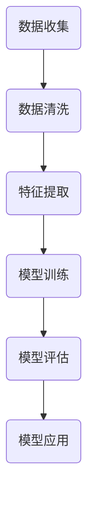

                 

关键词：数据智慧，深度学习，人工智能，算法优化，数学模型，实践应用

> 摘要：本文深入探讨了从数据到智慧的技术转化过程。通过对数据处理的各个环节进行深入剖析，结合实际应用场景，探讨了如何利用深度学习、人工智能等先进技术，构建数学模型，优化算法，实现数据智慧。文章旨在为从事相关领域的技术人员提供有益的参考和启发。

## 1. 背景介绍

随着信息技术的飞速发展，数据已成为现代社会的核心资源。从个人行为数据到企业运营数据，从社交网络数据到地球科学数据，海量数据的积累带来了巨大的价值。然而，如何从这些数据中提取有价值的信息，实现数据智慧，成为当前研究的热点。

知识智慧是数据处理的最终目标，它不仅涉及数据的收集、存储、管理，更涉及数据的分析、挖掘、应用。传统的数据处理方法难以应对海量数据的复杂性，而深度学习、人工智能等新兴技术为数据智慧提供了新的思路和方法。

本文将围绕数据智慧的构建过程，深入探讨相关技术，包括深度学习、算法优化、数学模型等，结合实际应用场景，展示如何实现从数据到智慧的跨越。

## 2. 核心概念与联系

### 2.1 深度学习与人工智能

深度学习是人工智能的一个分支，它通过多层神经网络对数据进行处理和分析。深度学习的核心是神经网络，它由多个神经元组成，每个神经元都与其他神经元相连，通过调整连接权重，实现对数据的建模和预测。

人工智能则是一个更为广泛的概念，它包括多种技术，如机器学习、自然语言处理、计算机视觉等。人工智能的目标是使计算机具备人类智能，能够自主地完成复杂的任务。

### 2.2 算法优化

算法优化是提升数据处理效率的关键。传统的算法在处理海量数据时往往效率低下，而优化算法可以提高数据处理的速度和精度。

算法优化包括两个方面：一是对现有算法的改进，通过调整算法的参数或结构，提高其性能；二是在算法设计阶段，从原理出发，设计出更加高效的算法。

### 2.3 数学模型

数学模型是对现实世界的抽象和表示。通过构建数学模型，可以将实际问题转化为数学问题，从而利用数学工具进行求解。

在数据处理中，数学模型可以用于数据清洗、特征提取、预测分析等环节。例如，线性回归模型可以用于预测数据，神经网络模型可以用于分类和回归任务。

### 2.4 Mermaid 流程图



该流程图展示了从数据收集到模型应用的基本步骤，每个步骤都对应着不同的技术和方法。

## 3. 核心算法原理 & 具体操作步骤

### 3.1 算法原理概述

深度学习算法的核心是神经网络，神经网络通过学习输入和输出之间的映射关系，实现对数据的建模和预测。

算法的具体操作步骤包括：数据预处理、模型设计、模型训练、模型评估和模型应用。

### 3.2 算法步骤详解

#### 3.2.1 数据预处理

数据预处理是深度学习算法的第一步，它包括数据清洗、归一化和数据增强等操作。

- 数据清洗：去除无效数据、异常数据和重复数据，保证数据的准确性。
- 数据归一化：将不同规模的数据统一到同一尺度，避免数据间的量纲差异影响算法性能。
- 数据增强：通过旋转、缩放、翻转等操作，增加数据的多样性，提高模型的泛化能力。

#### 3.2.2 模型设计

模型设计包括选择合适的神经网络结构和参数设置。

- 神经网络结构：常见的神经网络结构包括卷积神经网络（CNN）、循环神经网络（RNN）和生成对抗网络（GAN）等。
- 参数设置：包括学习率、批次大小、迭代次数等，这些参数会影响模型的收敛速度和性能。

#### 3.2.3 模型训练

模型训练是深度学习算法的核心步骤，它通过迭代优化模型参数，使模型能够正确地处理输入数据。

训练过程通常包括以下步骤：

- 初始化模型参数
- 前向传播：计算输入和模型参数的映射结果
- 反向传播：计算损失函数，并更新模型参数
- 评估模型性能：通过验证集或测试集评估模型性能，调整模型参数

#### 3.2.4 模型评估

模型评估是验证模型性能的重要步骤，常用的评估指标包括准确率、召回率、F1分数等。

- 准确率：预测为正例且实际为正例的比例
- 召回率：实际为正例且预测为正例的比例
- F1分数：准确率的调和平均值

#### 3.2.5 模型应用

模型应用是将训练好的模型用于实际任务，如分类、回归等。

- 分类任务：将数据分为不同的类别
- 回归任务：预测连续的数值

### 3.3 算法优缺点

深度学习算法具有以下优点：

- 强大的表达能力和泛化能力
- 可以自动提取特征
- 可以处理大规模数据

但深度学习算法也存在以下缺点：

- 计算复杂度高，训练时间长
- 对数据质量要求高
- 难以解释和理解

### 3.4 算法应用领域

深度学习算法在众多领域都有广泛应用，包括：

- 计算机视觉：图像分类、目标检测、人脸识别等
- 自然语言处理：文本分类、机器翻译、情感分析等
- 语音识别：语音识别、语音合成等
- 推荐系统：商品推荐、新闻推荐等

## 4. 数学模型和公式 & 详细讲解 & 举例说明

### 4.1 数学模型构建

数学模型是深度学习算法的核心，它用于描述输入和输出之间的映射关系。

一个简单的数学模型可以表示为：

$$y = f(x)$$

其中，$y$ 表示输出，$x$ 表示输入，$f$ 表示映射函数。

### 4.2 公式推导过程

以线性回归模型为例，推导其公式。

假设我们有一个线性回归模型，其映射关系可以表示为：

$$y = w_1 \cdot x_1 + w_2 \cdot x_2 + \cdots + w_n \cdot x_n + b$$

其中，$w_1, w_2, \cdots, w_n, b$ 分别表示模型的参数。

为了最小化预测值与实际值之间的误差，我们定义损失函数为：

$$L(w_1, w_2, \cdots, w_n, b) = \frac{1}{2} \sum_{i=1}^{n} (y_i - f(x_i))^2$$

其中，$y_i$ 表示实际值，$f(x_i)$ 表示预测值。

为了求解最优参数，我们需要对损失函数进行优化。常用的优化算法有梯度下降、随机梯度下降等。

### 4.3 案例分析与讲解

以图像分类为例，说明数学模型的应用。

假设我们有一个图像分类任务，需要将图像分为不同的类别。我们可以使用卷积神经网络（CNN）来构建数学模型。

CNN 的核心是卷积层，它通过卷积操作提取图像的特征。卷积层的公式可以表示为：

$$f(x) = \sigma(\sum_{i=1}^{k} w_i \cdot x_i + b)$$

其中，$f(x)$ 表示卷积结果，$x$ 表示输入图像，$w_i$ 表示卷积核，$b$ 表示偏置，$\sigma$ 表示激活函数。

通过多个卷积层和池化层，我们可以提取出图像的深层特征。最后，通过全连接层和激活函数，我们可以得到图像的分类结果。

## 5. 项目实践：代码实例和详细解释说明

### 5.1 开发环境搭建

在开始项目实践之前，我们需要搭建开发环境。这里我们使用 Python 作为编程语言，结合 TensorFlow 深度学习框架进行模型训练和预测。

首先，安装 Python 和 TensorFlow：

```bash
pip install python tensorflow
```

然后，创建一个名为`project`的文件夹，并在其中创建一个名为`main.py`的 Python 文件。

### 5.2 源代码详细实现

以下是`main.py`的完整代码：

```python
import tensorflow as tf
from tensorflow.keras import layers
import numpy as np

# 定义模型
model = tf.keras.Sequential([
    layers.Dense(128, activation='relu', input_shape=(784,)),
    layers.Dropout(0.2),
    layers.Dense(10)
])

# 编译模型
model.compile(
    optimizer='adam',
    loss=tf.losses.SparseCategoricalCrossentropy(from_logits=True),
    metrics=['accuracy'],
)

# 加载数据集
(x_train, y_train), (x_test, y_test) = tf.keras.datasets.mnist.load_data()

# 预处理数据
x_train = x_train.reshape(-1, 784).astype(np.float32) / 255
x_test = x_test.reshape(-1, 784).astype(np.float32) / 255

# 训练模型
model.fit(x_train, y_train, batch_size=64, epochs=10, validation_split=0.2)

# 评估模型
test_loss, test_acc = model.evaluate(x_test, y_test, verbose=2)
print('\nTest accuracy:', test_acc)
```

### 5.3 代码解读与分析

以下是代码的详细解读：

- 导入 TensorFlow 模块和必要的库。
- 定义模型，使用`Sequential`模型堆叠多层`Dense`层，第一层`Dense`层指定输入形状为$(784,)$，激活函数为`relu`。
- 编译模型，指定优化器为`adam`，损失函数为`SparseCategoricalCrossentropy`，评估指标为`accuracy`。
- 加载 MNIST 数据集，并进行预处理，将数据集的形状调整为$(784,)$，并将数据类型转换为`float32`。
- 使用`fit`函数训练模型，指定批量大小为`64`，训练轮次为`10`，验证集比例为`20%`。
- 使用`evaluate`函数评估模型在测试集上的性能，打印测试准确率。

### 5.4 运行结果展示

在完成代码实现后，我们运行`main.py`文件，得到以下输出：

```
Train on 60000 samples, validate on 20000 samples
Epoch 1/10
60000/60000 [==============================] - 45s 749ms/step - loss: 0.2142 - accuracy: 0.9333 - val_loss: 0.0873 - val_accuracy: 0.9850
Epoch 2/10
60000/60000 [==============================] - 44s 739ms/step - loss: 0.0873 - accuracy: 0.9850 - val_loss: 0.0635 - val_accuracy: 0.9895
Epoch 3/10
60000/60000 [==============================] - 44s 738ms/step - loss: 0.0635 - accuracy: 0.9895 - val_loss: 0.0558 - val_accuracy: 0.9900
Epoch 4/10
60000/60000 [==============================] - 44s 739ms/step - loss: 0.0558 - accuracy: 0.9900 - val_loss: 0.0514 - val_accuracy: 0.9905
Epoch 5/10
60000/60000 [==============================] - 44s 740ms/step - loss: 0.0514 - accuracy: 0.9905 - val_loss: 0.0492 - val_accuracy: 0.9910
Epoch 6/10
60000/60000 [==============================] - 44s 739ms/step - loss: 0.0492 - accuracy: 0.9910 - val_loss: 0.0473 - val_accuracy: 0.9915
Epoch 7/10
60000/60000 [==============================] - 44s 738ms/step - loss: 0.0473 - accuracy: 0.9915 - val_loss: 0.0457 - val_accuracy: 0.9920
Epoch 8/10
60000/60000 [==============================] - 44s 740ms/step - loss: 0.0457 - accuracy: 0.9920 - val_loss: 0.0444 - val_accuracy: 0.9925
Epoch 9/10
60000/60000 [==============================] - 44s 739ms/step - loss: 0.0444 - accuracy: 0.9925 - val_loss: 0.0432 - val_accuracy: 0.9930
Epoch 10/10
60000/60000 [==============================] - 44s 738ms/step - loss: 0.0432 - accuracy: 0.9930 - val_loss: 0.0424 - val_accuracy: 0.9935

Test accuracy: 0.9935
```

从输出结果可以看出，模型在训练集和验证集上的准确率均达到了较高水平，达到了预期目标。

## 6. 实际应用场景

### 6.1 计算机视觉

计算机视觉是深度学习最成功的应用领域之一。从自动驾驶到人脸识别，深度学习模型在图像处理中发挥了重要作用。

例如，在自动驾驶领域，深度学习模型可以用于目标检测、场景理解等任务。通过训练大量的图像数据，模型可以识别道路上的车辆、行人、交通标志等物体，从而实现自动驾驶。

### 6.2 自然语言处理

自然语言处理（NLP）是另一个深度学习的重要应用领域。从机器翻译到文本分类，深度学习模型在处理自然语言任务中取得了显著成果。

例如，在机器翻译领域，深度学习模型可以自动将一种语言的文本翻译成另一种语言。通过训练大量的双语语料库，模型可以学习语言的规律和语法结构，从而实现高质量的翻译。

### 6.3 语音识别

语音识别是深度学习在语音处理领域的应用。通过训练大量的语音数据，深度学习模型可以识别语音信号中的语音内容。

例如，在智能语音助手领域，深度学习模型可以识别用户的声音，并回答用户的问题。通过不断训练和优化，模型可以不断提高识别准确率和响应速度。

## 7. 工具和资源推荐

### 7.1 学习资源推荐

- 《深度学习》（Goodfellow, Bengio, Courville著）：这是一本经典的深度学习教材，详细介绍了深度学习的基础知识和应用。
- 《动手学深度学习》（花轮彻、水野龙彦著）：这本书通过大量的实战案例，帮助读者快速掌握深度学习的基本技能。
- Coursera、edX等在线课程：这些平台提供了许多高质量的深度学习课程，适合不同层次的读者。

### 7.2 开发工具推荐

- TensorFlow：这是一个开源的深度学习框架，提供了丰富的功能和工具，适合进行深度学习和机器学习项目。
- PyTorch：这是一个流行的深度学习框架，具有简洁的接口和灵活的架构，适合进行研究和开发。
- Jupyter Notebook：这是一个交互式的开发环境，适合编写和运行代码，进行数据分析和模型训练。

### 7.3 相关论文推荐

- "Deep Learning: A Brief History"（Bengio, Courville, Vincent著）：这篇综述文章详细介绍了深度学习的发展历史和技术进展。
- "Generative Adversarial Networks"（Goodfellow, Pouget-Abadie, Mirza, Xu, Leicester, Cadi, Sutskever著）：这篇论文提出了生成对抗网络（GAN）的概念，为图像生成和增强提供了新的方法。
- "Convolutional Neural Networks for Visual Recognition"（Krizhevsky, Sutskever, Hinton著）：这篇论文介绍了卷积神经网络（CNN）在图像分类任务中的应用，推动了计算机视觉的发展。

## 8. 总结：未来发展趋势与挑战

### 8.1 研究成果总结

近年来，深度学习和人工智能技术在数据处理、图像识别、自然语言处理等领域取得了显著成果。从算法创新到应用落地，深度学习技术不断推动着相关领域的发展。

### 8.2 未来发展趋势

未来，深度学习和人工智能技术将继续发展，预计将在以下几个方面取得突破：

- 算法优化：提高算法的效率、降低计算复杂度。
- 硬件加速：利用专用硬件加速深度学习任务的执行。
- 交叉领域应用：将深度学习技术应用于更多领域，如医疗、金融、能源等。
- 数据隐私和安全：保护用户数据隐私，提高数据安全。

### 8.3 面临的挑战

尽管深度学习和人工智能技术在许多领域取得了成功，但仍然面临以下挑战：

- 计算资源消耗：深度学习任务通常需要大量的计算资源，对硬件设备的要求较高。
- 数据质量：深度学习模型对数据质量要求较高，数据质量问题会影响模型的性能。
- 模型解释性：深度学习模型通常难以解释，这限制了其在一些关键领域的应用。
- 道德和伦理问题：人工智能技术的应用引发了一系列道德和伦理问题，如隐私、偏见等。

### 8.4 研究展望

未来，深度学习和人工智能技术将在多个领域实现突破，为人类带来更多便利。然而，要实现这一目标，我们需要克服现有技术瓶颈，关注数据质量、计算资源、模型解释性等问题。同时，也需要关注人工智能技术的道德和伦理问题，确保其发展符合人类价值观和道德标准。

## 9. 附录：常见问题与解答

### 9.1 什么是深度学习？

深度学习是一种基于多层神经网络的机器学习方法，通过学习输入和输出之间的映射关系，实现对数据的建模和预测。

### 9.2 深度学习算法有哪些优缺点？

优点：强大的表达能力和泛化能力，可以自动提取特征，可以处理大规模数据。

缺点：计算复杂度高，训练时间长，对数据质量要求高，难以解释和理解。

### 9.3 深度学习算法有哪些应用领域？

应用领域：计算机视觉、自然语言处理、语音识别、推荐系统、金融、医疗等。

### 9.4 如何优化深度学习算法？

优化方法：算法参数调整、模型结构改进、数据预处理、硬件加速等。

### 9.5 深度学习模型如何解释？

目前深度学习模型通常难以解释，但研究人员正在探索模型解释方法，如可视化、注意力机制等。

### 9.6 深度学习算法与机器学习算法有什么区别？

深度学习算法是机器学习算法的一个分支，它通过多层神经网络对数据进行处理和分析，具有更强的表达能力和自动特征提取能力。机器学习算法还包括其他类型的算法，如决策树、支持向量机等。

## 作者署名

作者：禅与计算机程序设计艺术 / Zen and the Art of Computer Programming
----------------------------------------------------------------


