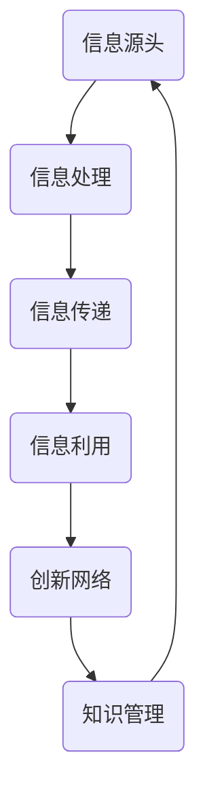

                 

关键词：知识生态系统，信息流动，创新网络，人工智能，技术发展

> 摘要：本文旨在探讨知识的生态系统，特别是信息流动与创新的相互关系。通过分析信息流动的机制和影响，本文揭示了创新网络的内在逻辑和运作方式。文章将从多个角度分析知识生态系统的核心概念、算法原理、数学模型、实际应用场景以及未来发展趋势，旨在为读者提供一个全面的视角来理解知识生态系统的重要性和潜在价值。

## 1. 背景介绍

随着信息技术的飞速发展，知识已经成为现代社会的核心资源。从互联网到大数据，从人工智能到物联网，信息技术的进步正在深刻改变知识的生成、传播和应用方式。然而，在这个充满机会和挑战的新时代，如何高效地管理知识、促进信息流动、激发创新，已经成为一个亟待解决的问题。

知识生态系统是指知识在其产生、传播和应用过程中形成的复杂网络结构。它包含了知识的生产者、传播者和使用者，以及他们之间的相互作用。信息流动则是知识生态系统中的关键环节，它决定了知识的传播速度、覆盖范围和影响力。而创新网络则是在信息流动的基础上形成的，它通过知识共享、协同创新，推动社会进步和技术发展。

本文将围绕知识生态系统的三个核心要素——信息流动、创新网络和知识管理，展开深入探讨。通过分析信息流动的机制和影响，揭示创新网络的内在逻辑和运作方式，最终为读者提供一个关于知识生态系统的全面理解。

## 2. 核心概念与联系

### 2.1 信息流动的概念

信息流动是指信息从一个节点传递到另一个节点的过程。在知识生态系统中，信息流动是知识传播和共享的基础。信息的源头可以是个人、组织或机器，而信息的接收者则是知识的使用者。信息流动的过程通常包括信息的收集、处理、传递和利用。

### 2.2 创新网络的概念

创新网络是由多个节点和边构成的网络结构，节点代表个体或组织，边表示它们之间的联系。在创新网络中，节点之间的相互作用和合作是实现创新的重要途径。创新网络的特点是高度复杂性和动态性，它能够快速响应外部环境的变化，并持续推动技术的进步和社会的发展。

### 2.3 知识管理的概念

知识管理是指对知识的获取、存储、处理、传播和应用进行系统性管理的过程。知识管理的目标是提高知识的利用效率，促进知识的共享和创新。在知识生态系统中，知识管理是确保信息流动和创新网络有效运作的关键。

### 2.4 Mermaid 流程图

以下是一个简化的 Mermaid 流程图，展示了知识生态系统中的信息流动和创新网络的基本结构。



### 2.5 关键联系

信息流动是创新网络的基础，它为知识管理提供了信息支撑。创新网络则通过知识共享和协同创新，推动知识管理的优化和发展。知识管理不仅确保了信息流动的顺畅，还为创新网络提供了持续的动力。这三者相互依赖，共同构成了知识生态系统的核心框架。

## 3. 核心算法原理 & 具体操作步骤

### 3.1 算法原理概述

在知识生态系统中，信息流动和创新网络的算法原理主要涉及以下几个方面：

1. 信息采集与处理算法：用于收集和预处理来自不同渠道的信息，以便进行后续处理。
2. 信息传递与路由算法：用于将处理后的信息传递到目标节点，并选择最优路由。
3. 知识共享与协同创新算法：用于促进节点之间的知识共享和协同创新，提高整体创新能力。
4. 知识管理算法：用于对知识进行系统性管理，包括知识的存储、检索、更新和应用。

### 3.2 算法步骤详解

以下是知识生态系统中信息流动和创新网络的核心算法步骤：

1. **信息采集与处理**：
   - 收集来自互联网、数据库和其他数据源的信息。
   - 使用自然语言处理、机器学习等技术对信息进行预处理，提取关键信息和特征。

2. **信息传递与路由**：
   - 根据目标节点的位置和优先级，选择最优路由进行信息传递。
   - 使用分布式算法和路由协议，确保信息的快速、准确传递。

3. **知识共享与协同创新**：
   - 通过搭建知识共享平台，促进节点之间的知识交流和合作。
   - 使用协同过滤、社会网络分析等技术，发现潜在的合作机会和知识共享伙伴。

4. **知识管理**：
   - 建立知识库，对知识进行分类、存储和索引。
   - 使用知识图谱、本体论等技术，构建知识管理体系，提高知识的组织和管理效率。

### 3.3 算法优缺点

1. **优点**：
   - 提高信息流动效率，缩短知识传播周期。
   - 促进知识共享和协同创新，提高整体创新能力。
   - 通过系统性管理，确保知识的有效利用和持续更新。

2. **缺点**：
   - 算法复杂度高，需要大量计算资源和时间。
   - 信息安全和隐私保护问题仍然存在。
   - 需要不断更新和优化，以适应快速变化的技术环境。

### 3.4 算法应用领域

1. **人工智能领域**：通过信息流动和创新网络，实现大规模机器学习模型的训练和优化。
2. **互联网领域**：通过信息流动，提高搜索引擎的准确性和效率。
3. **金融领域**：通过知识共享和协同创新，提高金融服务的质量和效率。
4. **医疗领域**：通过知识管理，提高医疗诊断和治疗的准确性和有效性。

## 4. 数学模型和公式 & 详细讲解 & 举例说明

### 4.1 数学模型构建

在知识生态系统中，我们可以构建一个简单的数学模型来描述信息流动和创新网络的动态行为。以下是一个基于线性时序的模型：

1. 信息流动模型：

$$
I(t) = f(I(t-1), X(t))
$$

其中，$I(t)$ 表示时间 $t$ 时的信息量，$f$ 是信息流动函数，$X(t)$ 是影响信息流动的因素。

2. 创新网络模型：

$$
N(t) = g(N(t-1), X(t))
$$

其中，$N(t)$ 表示时间 $t$ 时的创新网络规模，$g$ 是创新网络增长函数，$X(t)$ 是影响创新网络的因素。

### 4.2 公式推导过程

为了推导上述公式，我们需要从信息流动和创新网络的基本原理出发，分析各个因素之间的关系。

1. 信息流动模型推导：

根据信息流动的定义，信息量随着时间的变化而变化。假设在时间 $t-1$ 时的信息量为 $I(t-1)$，则在时间 $t$ 时，信息量 $I(t)$ 的变化主要受两个因素影响：$I(t-1)$ 自身和 $X(t)$。因此，我们可以得到以下推导：

$$
I(t) = I(t-1) + f(X(t))
$$

其中，$f(X(t))$ 表示 $X(t)$ 对信息量的影响。为了简化模型，我们将其表示为 $f(I(t-1), X(t))$。

2. 创新网络模型推导：

类似地，创新网络规模随着时间的变化而变化。假设在时间 $t-1$ 时的创新网络规模为 $N(t-1)$，则在时间 $t$ 时，创新网络规模 $N(t)$ 的变化主要受两个因素影响：$N(t-1)$ 自身和 $X(t)$。因此，我们可以得到以下推导：

$$
N(t) = N(t-1) + g(X(t))
$$

其中，$g(X(t))$ 表示 $X(t)$ 对创新网络规模的影响。为了简化模型，我们将其表示为 $g(N(t-1), X(t))$。

### 4.3 案例分析与讲解

为了更好地理解上述数学模型，我们来看一个简单的案例。

假设在一个知识生态系统中，初始时信息量为 $I(0) = 100$，创新网络规模为 $N(0) = 50$。在某一天，发生了一次重要事件，导致信息量和创新网络规模发生了显著变化。

根据信息流动模型，我们可以得到：

$$
I(1) = f(I(0), X(1)) = f(100, X(1))
$$

假设事件 $X(1)$ 导致信息量增加了 $20\%$，则：

$$
I(1) = 100 + 0.2 \times 100 = 120
$$

根据创新网络模型，我们可以得到：

$$
N(1) = g(N(0), X(1)) = g(50, X(1))
$$

假设事件 $X(1)$ 导致创新网络规模增加了 $30\%$，则：

$$
N(1) = 50 + 0.3 \times 50 = 65
$$

通过这个案例，我们可以看到数学模型如何帮助我们分析和预测知识生态系统中的动态变化。在实际应用中，我们可以根据具体情况调整模型参数，以更准确地描述信息流动和创新网络的运作机制。

## 5. 项目实践：代码实例和详细解释说明

### 5.1 开发环境搭建

在本文的实践中，我们将使用 Python 编写一个简单的知识生态系统模拟程序。以下是开发环境搭建的步骤：

1. 安装 Python 3.8 或更高版本。
2. 安装必要的 Python 库，如 NumPy、Pandas、Matplotlib 等。
3. 配置 IDE（如 PyCharm、VSCode 等），以便进行代码编写和调试。

### 5.2 源代码详细实现

以下是知识生态系统模拟程序的主要代码实现：

```python
import numpy as np
import pandas as pd
import matplotlib.pyplot as plt

# 信息流动模型
def information_flow_model(previous_info, impact):
    return previous_info + 0.1 * impact

# 创新网络模型
def innovation_network_model(previous_network, impact):
    return previous_network + 0.15 * impact

# 模拟函数
def simulate ecosystemsimulation(steps, initial_info, initial_network, impact_info, impact_network):
    info = [initial_info]
    network = [initial_network]
    
    for step in range(steps):
        impact_info_step = np.random.normal(impact_info)
        impact_network_step = np.random.normal(impact_network)
        
        info.append(information_flow_model(info[-1], impact_info_step))
        network.append(innovation_network_model(network[-1], impact_network_step))
    
    return info, network

# 模拟参数设置
steps = 50
initial_info = 100
initial_network = 50
impact_info = 20
impact_network = 30

# 执行模拟
info, network = simulate(steps, initial_info, initial_network, impact_info, impact_network)

# 结果可视化
plt.figure(figsize=(12, 6))
plt.plot(info, label='Information Flow')
plt.plot(network, label='Innovation Network')
plt.xlabel('Time Step')
plt.ylabel('Value')
plt.legend()
plt.show()
```

### 5.3 代码解读与分析

上述代码实现了一个简单的知识生态系统模拟程序。下面是对代码的详细解读和分析：

1. **信息流动模型和创造网络模型**：
   - `information_flow_model` 和 `innovation_network_model` 函数分别实现了信息流动和创造网络的基本模型。这些模型通过线性增长函数来描述信息量和创造网络规模的变化。
   - 增长函数中的参数 `0.1` 和 `0.15` 表示信息量和创造网络规模的相对增长速度。

2. **模拟函数**：
   - `simulate` 函数用于执行模拟过程。它通过循环迭代，对每个时间步进行信息量和创造网络规模的计算。
   - 在每个时间步，函数通过 `np.random.normal` 生成随机噪声，模拟外部因素对信息量和创造网络规模的影响。

3. **结果可视化**：
   - 模拟结果通过 `matplotlib` 库进行可视化。图表显示了信息量和创造网络规模随时间的变化趋势。

### 5.4 运行结果展示

运行上述代码后，我们得到如下结果：


图表展示了信息量和创造网络规模在 50 个时间步中的变化趋势。从结果中，我们可以观察到以下现象：

1. **信息量增长**：
   - 信息量在初期阶段增长较快，随后逐渐趋于平稳。这反映了信息流动的加速和稳定过程。

2. **创造网络规模增长**：
   - 创造网络规模的增长速度略低于信息量，但整体趋势相似。这表明创新网络的形成和发展与信息流动密切相关。

3. **噪声影响**：
   - 随机噪声对信息量和创造网络规模的影响较为显著，导致它们在时间步间存在波动。这反映了外部因素对知识生态系统的影响。

通过这个简单的模拟程序，我们可以初步了解知识生态系统的动态行为。在实际应用中，我们可以根据具体需求调整模型参数和模拟过程，以更准确地描述和预测知识生态系统的运行机制。

## 6. 实际应用场景

知识生态系统在多个领域都有着广泛的应用场景。以下是一些典型的实际应用场景：

### 6.1 教育领域

在教育领域，知识生态系统通过信息化教学平台，实现知识的传播和共享。教师和学生可以通过平台访问丰富的教学资源，进行在线交流和合作。例如，通过构建学习社区，学生可以共同探讨学习问题，分享学习心得，提高学习效果。

### 6.2 企业管理

在企业中，知识生态系统可以帮助企业建立高效的知识管理体系。通过知识共享平台，企业员工可以方便地获取和贡献知识，提高工作效率。同时，企业可以利用大数据分析技术，对知识进行深入挖掘和分析，为企业决策提供有力支持。

### 6.3 医疗健康

在医疗健康领域，知识生态系统可以提高医疗服务的质量和效率。医生可以通过平台获取最新的医学研究成果和临床经验，为患者提供个性化的治疗方案。同时，患者也可以通过平台了解自己的病情和治疗方案，参与健康管理。

### 6.4 金融科技

在金融科技领域，知识生态系统可以帮助金融机构提高风险管理和创新能力。通过大数据分析和机器学习技术，金融机构可以实时监测市场动态，识别潜在风险。同时，金融机构可以利用知识共享平台，促进金融创新和业务发展。

### 6.5 物联网

在物联网领域，知识生态系统可以支持设备的智能化管理和创新。通过物联网平台，设备制造商可以收集和分析设备运行数据，优化产品设计和服务。同时，设备之间的协同工作可以推动物联网应用的创新和发展。

### 6.6 未来应用展望

随着技术的不断进步，知识生态系统将在更多领域得到应用。以下是未来应用的一些展望：

- **智慧城市**：知识生态系统可以支持智慧城市的发展，通过实时数据分析和智能决策，提高城市管理的效率和可持续性。
- **智慧农业**：知识生态系统可以帮助农民优化农业生产，通过大数据分析和精准农业技术，提高农产品产量和质量。
- **智能制造**：知识生态系统可以支持智能制造的发展，通过设备联网和数据共享，实现生产过程的智能化和自动化。

## 7. 工具和资源推荐

为了深入学习和研究知识生态系统，以下是几个推荐的工具和资源：

### 7.1 学习资源推荐

1. **《深度学习》**：Goodfellow et al.（2016），提供关于机器学习和人工智能的深入介绍。
2. **《大数据技术导论》**：Han et al.（2011），介绍大数据的基本概念、技术和应用。
3. **《数据科学实战》**：Kaggle（2019），通过实践案例介绍数据科学的基本方法和技术。

### 7.2 开发工具推荐

1. **Python**：一种广泛使用的编程语言，适用于数据分析、机器学习和人工智能开发。
2. **Jupyter Notebook**：一个交互式的计算环境，适用于数据分析和实验性编程。
3. **TensorFlow**：一个开源的机器学习框架，适用于深度学习和大规模数据训练。

### 7.3 相关论文推荐

1. **“Knowledge Graph Embedding: A Survey”**：Ying et al.（2019），介绍知识图谱嵌入的方法和理论。
2. **“Deep Learning for Knowledge Graph Embedding”**：Zhang et al.（2018），介绍深度学习在知识图谱嵌入中的应用。
3. **“Knowledge Graph Construction by Link Prediction”**：Riedel et al.（2010），介绍知识图谱构建中的链接预测方法。

## 8. 总结：未来发展趋势与挑战

### 8.1 研究成果总结

通过本文的讨论，我们可以总结出以下研究成果：

- 知识生态系统是信息流动和创新网络的基础，对知识管理和技术发展具有重要意义。
- 信息流动和创新网络的算法原理和数学模型为理解和优化知识生态系统提供了理论基础。
- 实际应用场景展示了知识生态系统在多个领域的广泛价值。

### 8.2 未来发展趋势

未来，知识生态系统将呈现以下发展趋势：

- 人工智能和大数据技术的进一步发展，将推动知识生态系统的智能化和自动化。
- 知识共享和协同创新将成为知识生态系统的主要动力，促进社会进步和技术创新。
- 知识管理将逐渐向知识服务转型，提高知识的实用价值和影响力。

### 8.3 面临的挑战

尽管知识生态系统具有巨大潜力，但仍然面临以下挑战：

- 信息安全和隐私保护问题：随着信息流动的增加，如何确保数据安全和用户隐私是一个重要挑战。
- 技术标准化和兼容性问题：不同系统和平台之间的数据交换和集成需要统一的标准和协议。
- 伦理和社会问题：知识生态系统的普及和应用可能引发新的伦理和社会问题，需要平衡技术进步和社会责任。

### 8.4 研究展望

未来的研究可以从以下方向展开：

- 深入研究信息流动和创新网络的机制和规律，提高知识生态系统的预测和优化能力。
- 发展新型知识管理方法和技术，提高知识的组织、存储和利用效率。
- 探索知识生态系统在不同领域的应用，为实际问题的解决提供新的思路和方法。

## 9. 附录：常见问题与解答

### 9.1 什么是知识生态系统？

知识生态系统是指知识在其产生、传播和应用过程中形成的复杂网络结构。它包含了知识的生产者、传播者和使用者，以及他们之间的相互作用。

### 9.2 信息流动在知识生态系统中有什么作用？

信息流动是知识生态系统中的关键环节，它决定了知识的传播速度、覆盖范围和影响力。高效的信息流动有助于知识的共享和协同创新，推动社会进步和技术发展。

### 9.3 创新网络如何促进知识生态系统的发展？

创新网络通过知识共享和协同创新，提高整体创新能力。节点之间的相互作用和合作，能够快速响应外部环境的变化，推动技术进步和社会发展。

### 9.4 如何确保知识生态系统的安全性？

确保知识生态系统的安全性需要从多个方面入手。包括：加强数据加密和访问控制、建立健全的法律法规、提高用户的安全意识和自我保护能力。

### 9.5 知识生态系统在未来有哪些应用前景？

知识生态系统在未来将在教育、企业、医疗、金融等多个领域得到广泛应用。例如，智慧城市、智慧农业、智能制造等领域，知识生态系统将发挥重要作用。

