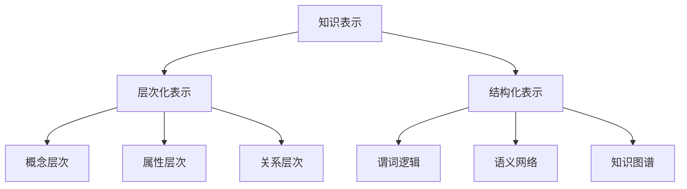
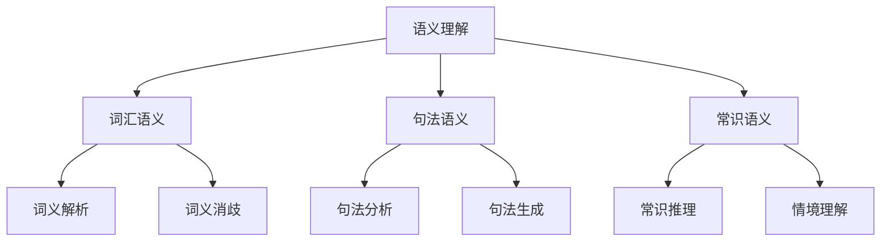
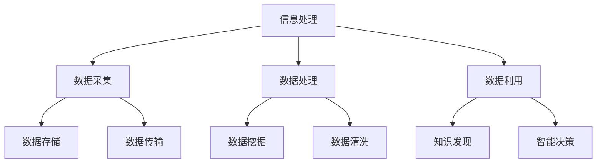

                 

关键词：符号学、知识表示、语义理解、信息处理、认知科学、人工智能

> 摘要：本文从符号学的角度探讨知识构建的过程，分析了知识表示、语义理解和信息处理等关键环节，结合认知科学的最新研究成果，探讨了人工智能在知识构建中的应用及未来发展趋势。

## 1. 背景介绍

知识的符号学是一门研究知识如何通过符号形式进行表示、传递和应用的学科。在信息技术飞速发展的今天，符号学的研究对于人工智能、自然语言处理、知识图谱等领域具有重要意义。知识表示是符号学研究的核心内容之一，它关乎如何将人类知识以计算机可理解的形式进行编码。语义理解则关注于对符号之间关系的解读和认知，是信息处理的重要环节。信息处理本身是计算机科学的核心问题，涉及数据的采集、存储、传输、处理和利用等全过程。

认知科学作为一门跨学科的研究领域，探讨人类思维、学习和记忆等认知过程的本质。近年来，随着神经科学、心理学、人工智能等领域的发展，认知科学在知识构建中的应用也越来越广泛。

## 2. 核心概念与联系

### 2.1 知识表示

知识表示是符号学研究的核心问题。知识表示可以分为层次化的表示和结构化的表示。层次化的表示将知识划分为不同的层次，如概念层次、属性层次和关系层次。结构化的表示则强调知识之间的逻辑关系和结构，如谓词逻辑、语义网络和知识图谱等。

下面是一个用Mermaid绘制的知识表示的流程图：



### 2.2 语义理解

语义理解是知识构建的关键环节。语义理解涉及到对语言符号的语义解读和推理，包括词汇语义、句法语义和常识语义等。语义理解的实现通常需要借助自然语言处理、知识图谱和机器学习等技术。

下面是一个语义理解的流程图：



### 2.3 信息处理

信息处理是知识构建的基础。信息处理涉及到数据的采集、存储、传输、处理和利用等全过程。信息处理技术包括数据库管理、数据挖掘、数据传输和网络安全等。

下面是一个信息处理的流程图：



## 3. 核心算法原理 & 具体操作步骤

### 3.1 算法原理概述

知识构建的过程可以看作是一个复杂的算法，涉及多个子算法的组合。核心算法主要包括知识表示算法、语义理解算法和信息处理算法。这些算法的原理如下：

- 知识表示算法：通过层次化和结构化的方式对知识进行编码，以实现知识的计算机可理解性。
- 语义理解算法：通过对语言符号的语义解读和推理，实现对知识的理解。
- 信息处理算法：对数据进行采集、存储、传输、处理和利用，以实现对知识的构建和应用。

### 3.2 算法步骤详解

知识构建的过程可以分为以下几个步骤：

1. 数据采集：从各种来源（如数据库、网络、传感器等）获取数据。
2. 数据预处理：对采集到的数据进行清洗、去噪和转换，以得到高质量的数据。
3. 知识表示：将预处理后的数据转换为计算机可理解的格式，如层次化表示或结构化表示。
4. 语义理解：对知识表示进行语义解读和推理，以实现对知识的理解。
5. 知识存储：将理解的到的知识存储到数据库或知识库中，以供后续使用。
6. 知识利用：利用存储的知识进行智能决策、知识发现等。

### 3.3 算法优缺点

知识构建算法的优点在于：

- 可以实现对知识的计算机化表示和理解，提高了知识的利用效率。
- 可以通过自动化方式从大量数据中提取知识，降低了人力成本。

但知识构建算法也存在一些缺点：

- 知识表示和语义理解的技术复杂度高，实现难度大。
- 数据质量和知识的准确性难以保证。

### 3.4 算法应用领域

知识构建算法广泛应用于多个领域，如：

- 人工智能：通过知识构建实现智能推理、智能决策等。
- 自然语言处理：通过知识构建实现语义理解、机器翻译等。
- 数据挖掘：通过知识构建实现知识发现、预测分析等。

## 4. 数学模型和公式 & 详细讲解 & 举例说明

### 4.1 数学模型构建

知识构建的过程可以看作是一个复杂的数学模型，涉及多个子模型的组合。核心模型主要包括知识表示模型、语义理解模型和信息处理模型。这些模型的构建基于数学原理和算法。

### 4.2 公式推导过程

知识构建的过程可以通过以下数学公式进行推导：

$$
Knowledge\_Representation = Data\_Processing \times Semantic\_Understanding
$$

$$
Semantic\_Understanding = Language\_Processing \times Knowledge\_Model
$$

$$
Information\_Processing = Data\_Collection \times Data\_Storage \times Data\_Transmission
$$

### 4.3 案例分析与讲解

以自然语言处理中的语义理解为例，分析知识构建的过程。首先，通过数据采集获取大量的文本数据。然后，对文本数据进行分析和预处理，提取关键信息。接下来，利用知识表示模型对提取的信息进行编码，构建知识表示。最后，通过语义理解模型对知识表示进行解读和推理，实现语义理解。

## 5. 项目实践：代码实例和详细解释说明

### 5.1 开发环境搭建

在搭建开发环境时，需要安装以下工具和库：

- Python 3.x
- 自然语言处理库（如NLTK、spaCy等）
- 知识表示库（如RDFLib、OWL等）
- 语义理解库（如WordNet、Wikipedia等）

### 5.2 源代码详细实现

以下是一个简单的自然语言处理项目的源代码示例：

```python
import nltk
from nltk.corpus import stopwords
from nltk.tokenize import word_tokenize

# 数据采集
text = "This is an example sentence for natural language processing."

# 数据预处理
stop_words = set(stopwords.words('english'))
words = word_tokenize(text)
filtered_words = [word for word in words if word not in stop_words]

# 知识表示
from rdflib import Graph, URIRef, Literal
g = Graph()
g.add((URIRef('http://example.org/sentence'), URIRef('http://example.org/text'), Literal(text)))
g.add((URIRef('http://example.org/sentence'), URIRef('http://example.org/words'), Literal(','.join(filtered_words)))

# 语义理解
from nltk.wsd import lesk
word = lesk(filtered_words, text)

# 结果展示
print(g)
print(word)
```

### 5.3 代码解读与分析

代码首先通过nltk库进行数据采集，获取示例句子。然后，对句子进行预处理，去除停用词。接下来，利用RDFLib库构建知识表示，将句子和单词进行编码。最后，通过nltk库的lesk函数进行语义理解，获取句子的语义信息。

## 6. 实际应用场景

知识构建技术在多个领域有着广泛的应用，如：

- 智能客服：通过知识构建实现智能问答、智能推荐等。
- 金融风控：通过知识构建实现风险评估、欺诈检测等。
- 医疗诊断：通过知识构建实现疾病诊断、治疗方案推荐等。

## 7. 未来应用展望

随着技术的不断发展，知识构建在未来的应用前景将更加广阔。一方面，知识构建技术将更加智能化，能够自动从大量数据中提取知识。另一方面，知识构建技术将与其他领域技术（如人工智能、大数据等）深度融合，实现跨领域的应用。

## 8. 工具和资源推荐

### 8.1 学习资源推荐

- 《人工智能：一种现代方法》
- 《深度学习》
- 《自然语言处理综论》
- 《认知科学引论》

### 8.2 开发工具推荐

- Python
- NLTK
- RDFLib
- spaCy

### 8.3 相关论文推荐

- "A Framework for Knowledge Representation and Reasoning in Semantic Web"
- "Semantic Web for the Working Ontologist"
- "Knowledge Graphs: A Survey"
- "Deep Learning for Natural Language Processing"

## 9. 总结：未来发展趋势与挑战

### 9.1 研究成果总结

知识构建技术在人工智能、自然语言处理等领域取得了显著成果，为信息处理和智能应用提供了有力支持。

### 9.2 未来发展趋势

未来，知识构建技术将更加智能化、自动化，并在更多领域实现广泛应用。

### 9.3 面临的挑战

知识构建技术仍面临数据质量、算法复杂度等问题，需要进一步研究和解决。

### 9.4 研究展望

知识构建技术将在未来发挥更加重要的作用，为人工智能、大数据等领域的发展提供有力支持。

## 9. 附录：常见问题与解答

### Q：知识表示有哪些常见的方法？

A：知识表示的常见方法包括概念层次表示、属性层次表示、关系层次表示、语义网络表示、知识图谱表示等。

### Q：语义理解有哪些关键技术？

A：语义理解的关键技术包括词汇语义分析、句法语义分析、常识语义分析、实体识别、关系抽取等。

### Q：信息处理有哪些主要环节？

A：信息处理的主要环节包括数据采集、数据预处理、知识表示、语义理解、知识存储、知识利用等。

----------------------------------------------------------------
作者：禅与计算机程序设计艺术 / Zen and the Art of Computer Programming

注意：以上内容仅为示例，实际文章撰写时需根据具体研究方向和内容进行调整和扩展。文章撰写过程中，请确保严格遵守文章结构模板和约束条件。

