                 

关键词：知识结构化、洞察力、认知模型、算法原理、数学模型、项目实践、应用场景、未来展望

> 摘要：本文探讨了知识结构化的重要性和洞察力在IT领域的关键作用。通过分析核心概念和架构，阐述了算法原理和数学模型，并给出了具体的项目实践案例。文章旨在为读者提供一个全面、深入的视角，以帮助他们在信息技术领域取得更大成就。

## 1. 背景介绍

在信息爆炸的时代，知识的积累和传播速度前所未有。然而，随之而来的问题是如何有效地管理和利用这些知识。知识结构化在这个过程中显得尤为重要。知识结构化不仅仅是一种数据处理方法，更是一种思考方式，它能够帮助我们从海量信息中提取出有价值的知识，并构建出清晰的逻辑关系。

洞察力作为知识结构化的核心要素，对IT领域的发展起到了至关重要的作用。洞察力是理解和解决问题的能力，它使得我们能够从表面现象中发现深层次的规律，从而指导我们的实践。在信息技术领域，洞察力不仅帮助我们设计出高效的算法，还促使我们开发出创新的软件和系统。

本文将围绕知识结构化和洞察力这两个核心主题，深入探讨其在IT领域的应用。文章将分为以下几个部分：

- 背景介绍
- 核心概念与联系
- 核心算法原理 & 具体操作步骤
- 数学模型和公式 & 详细讲解 & 举例说明
- 项目实践：代码实例和详细解释说明
- 实际应用场景
- 工具和资源推荐
- 总结：未来发展趋势与挑战
- 附录：常见问题与解答

通过这些部分的探讨，本文希望能够为读者提供一个全面的视角，帮助他们更好地理解和应用知识结构化和洞察力。

## 2. 核心概念与联系

### 2.1 知识结构化的定义

知识结构化是指将无序、零散的知识进行整理、分类、关联和优化，使其变得更加有序和易于理解。这一过程涉及到数据的收集、整理、分析和存储等多个环节。通过知识结构化，我们能够从海量数据中提取出有价值的信息，为决策提供依据。

### 2.2 洞察力的定义

洞察力是一种从表面现象中看到本质的能力。它涉及到对问题的深刻理解，能够帮助我们从复杂的信息中找到关键点，并提出创新的解决方案。在IT领域，洞察力尤为重要，因为它能够指导我们设计出更加高效、可靠的系统。

### 2.3 知识结构化与洞察力的联系

知识结构化和洞察力是相辅相成的。知识结构化提供了处理和分析信息的工具，而洞察力则利用这些工具来发现问题的本质。具体来说，知识结构化使得信息变得更加有序，为洞察力的发挥提供了基础；而洞察力则通过深入分析，使得知识结构化变得更加有效。

### 2.4 认知模型的构建

认知模型是知识结构化和洞察力的重要工具。它通过模拟人类思维过程，帮助我们理解复杂问题，并找到解决问题的方法。认知模型通常包括感知、记忆、推理和决策等环节，这些环节相互作用，共同构成了一个完整的认知过程。

### 2.5 Mermaid 流程图

为了更好地展示知识结构化和洞察力的联系，我们可以使用Mermaid流程图来表示各个核心概念和架构。以下是一个简化的流程图示例：

```mermaid
graph TD
    A[知识结构化] --> B[数据处理]
    A --> C[知识整理]
    A --> D[知识关联]
    A --> E[知识优化]
    B --> F[信息提取]
    B --> G[决策支持]
    C --> H[分类整理]
    C --> I[关联分析]
    D --> J[逻辑关系]
    D --> K[知识体系]
    E --> L[效率提升]
    E --> M[可靠性增强]
    F --> N[数据可视化]
    F --> O[模式识别]
    G --> P[预测分析]
    G --> Q[优化方案]
    H --> R[数据标签]
    H --> S[属性分类]
    I --> T[因果关系]
    I --> U[逻辑推理]
    J --> V[知识图谱]
    J --> W[关系网络]
    K --> X[知识库]
    K --> Y[信息检索]
    L --> Z[性能优化]
    L --> AA[资源管理]
    M --> BB[稳定性分析]
    M --> CC[安全控制]
    N --> DD[图表展示]
    N --> EE[交互设计]
    O --> FF[异常检测]
    O --> GG[特征提取]
    P --> HH[趋势预测]
    P --> II[策略优化]
    Q --> JJ[效果评估]
    Q --> KK[反馈调整]
    R --> LL[数据标注]
    R --> MM[属性增强]
    S --> NN[分类层次]
    S --> OO[聚类分析]
    T --> PP[因果推断]
    T --> QQ[逻辑推导]
    U --> RR[推理引擎]
    U --> SS[智能推理]
    V --> TT[知识网络]
    V --> UU[语义关联]
    W --> VV[网络分析]
    W --> WW[关系建模]
    X --> YY[知识存储]
    X --> ZZ[信息整合]
    Y --> AAA[快速检索]
    Y --> BBB[索引优化]
    Z --> CCC[算法优化]
    Z --> DDD[性能监控]
    AA --> EEE[资源调度]
    AA --> FFF[负载均衡]
    BB --> GGG[风险评估]
    BB --> HHH[威胁检测]
    CC --> III[安全策略]
    CC --> JJJ[访问控制]
    DD --> KKK[用户交互]
    DD --> LLL[用户体验]
    EE --> MMM[交互设计]
    EE --> NNN[界面优化]
    FF --> OOO[异常监控]
    FF --> PPP[故障排查]
    GG --> QQQ[特征提取]
    GG --> RRR[数据分析]
    HH --> SSS[趋势分析]
    HH --> TTT[预测模型]
    II --> UUU[策略优化]
    II --> VVV[效果评估]
    JJ --> WWW[效果评估]
    JJ --> XXX[反馈机制]
    KK --> YYY[调整策略]
    KK --> ZZZ[优化方案]
    LL --> AAAA[数据标注]
    LL --> BBBB[数据质量]
    MM --> CCC[属性分类]
    MM --> DDD[数据增强]
    NN --> EEES[聚类效果]
    NN --> FF[聚类模型]
    OO --> GGG[聚类分析]
    OO --> HHH[模式识别]
    PP --> III[因果分析]
    PP --> JJJ[逻辑推断]
    QQ --> KKK[推理结果]
    QQ --> LLL[知识验证]
    RR --> MMM[推理引擎]
    RR --> NNN[智能推理]
    SS --> OOO[推理算法]
    SS --> PPP[推理框架]
    TT --> BBB[知识网络]
    TT --> CCC[知识关联]
    UU --> DDD[语义理解]
    UU --> EEE[语义关联]
    VV --> FFF[网络分析]
    VV --> GGG[关系建模]
    WW --> HHH[关系网络]
    WW --> IIII[语义网络]
    YY --> JJJ[知识存储]
    YY --> KKK[信息整合]
    ZZ --> LLL[知识结构化]
    ZZ --> MMM[数据优化]
    AAA --> BBB[资源调度]
    AAA --> CCC[负载均衡]
    BBB --> DDD[风险评估]
    BBB --> EEE[威胁检测]
    CCC --> FFF[算法优化]
    CCC --> GGG[性能监控]
    DDD --> HHH[性能优化]
    DDD --> IIII[资源管理]
```



通过这个流程图，我们可以清晰地看到知识结构化与洞察力之间的相互作用。每一个环节都为后续的环节提供了基础，而洞察力则在这些基础上进行了深入的挖掘和探索。

## 3. 核心算法原理 & 具体操作步骤

### 3.1 算法原理概述

在知识结构化过程中，算法的选择至关重要。本文将介绍一种基于深度学习的知识结构化算法，该算法通过自动提取数据中的特征，并将其关联到相应的知识库中，从而实现知识的结构化。

该算法的主要原理包括：

- 数据预处理：对原始数据进行清洗、去噪和标准化处理，以提高后续算法的准确性。
- 特征提取：使用卷积神经网络（CNN）自动提取数据中的特征，这些特征能够有效地表示数据的本质。
- 知识关联：将提取出的特征与现有的知识库进行关联，通过语义匹配和推理，将特征映射到相应的知识节点上。

### 3.2 算法步骤详解

#### 3.2.1 数据预处理

数据预处理是算法的第一步，它的目的是提高数据的质量，为后续的特征提取和知识关联提供可靠的数据基础。具体步骤如下：

1. 数据清洗：去除数据中的噪声和异常值，以保证数据的准确性。
2. 数据标准化：将不同特征的数据进行标准化处理，使其具有相似的尺度，便于后续计算。
3. 数据划分：将数据划分为训练集、验证集和测试集，用于训练模型、验证模型和评估模型性能。

#### 3.2.2 特征提取

特征提取是算法的核心步骤，它决定了知识结构化的效果。本文采用卷积神经网络（CNN）进行特征提取，具体步骤如下：

1. 数据输入：将预处理后的数据输入到CNN中。
2. 卷积操作：使用卷积核对数据进行卷积操作，提取出数据中的局部特征。
3. 池化操作：对卷积后的特征进行池化操作，减少数据维度，提高特征表达能力。
4. 全连接层：将池化后的特征通过全连接层输出，得到最终的特征向量。

#### 3.2.3 知识关联

知识关联是将提取出的特征与现有的知识库进行匹配和映射的过程。具体步骤如下：

1. 知识库构建：构建一个包含各类知识的知识库，用于存储和检索知识。
2. 语义匹配：使用自然语言处理技术，对提取出的特征进行语义分析，找到与特征相关的知识节点。
3. 知识推理：基于知识库中的逻辑关系和语义匹配结果，进行知识推理，将特征映射到相应的知识节点上。
4. 知识更新：根据新的特征和知识，对知识库进行更新，以保持知识库的实时性和准确性。

### 3.3 算法优缺点

#### 3.3.1 优点

1. 高效性：算法采用深度学习技术，能够自动提取数据中的特征，大大提高了特征提取的效率和准确性。
2. 灵活性：算法能够根据不同的数据和应用场景，灵活调整模型参数和特征提取策略，适应各种知识结构化需求。
3. 实时性：算法能够实时更新知识库，适应不断变化的数据和应用需求。

#### 3.3.2 缺点

1. 复杂性：算法涉及到多个技术环节，如数据预处理、特征提取、知识关联等，实现过程相对复杂。
2. 资源消耗：算法对计算资源的需求较高，需要一定的硬件和软件支持。
3. 数据依赖：算法的性能高度依赖于数据的质量和数量，需要大量高质量的数据进行训练。

### 3.4 算法应用领域

该算法在多个领域具有广泛的应用前景，包括：

1. 数据挖掘：利用算法对大量数据进行结构化处理，提取出有价值的信息和知识。
2. 人工智能：将算法应用于人工智能系统，提高系统的智能化水平和决策能力。
3. 机器学习：作为机器学习模型的一部分，参与模型的训练和优化，提高模型的性能和准确性。

## 4. 数学模型和公式 & 详细讲解 & 举例说明

### 4.1 数学模型构建

在知识结构化过程中，数学模型起到了至关重要的作用。一个有效的数学模型可以帮助我们理解和处理复杂的现实问题，从而实现知识的结构化。本文将介绍一种基于图论的数学模型，该模型通过构建知识图谱来表示知识结构。

#### 4.1.1 知识图谱

知识图谱是一种用于表示实体及其之间关系的图形结构。在知识结构化过程中，知识图谱起到了核心作用。它通过实体、边和权重的形式，将各种知识有机地组织在一起，使得知识结构更加清晰和易于理解。

#### 4.1.2 图论基本概念

在构建知识图谱的过程中，需要了解图论的基本概念。以下是一些重要的概念：

- **节点（Node）**：图中的基本元素，表示实体。
- **边（Edge）**：连接两个节点的线，表示实体之间的关系。
- **权重（Weight）**：边的属性，表示关系的强度或重要性。

### 4.2 公式推导过程

#### 4.2.1 知识图谱构建公式

知识图谱的构建可以通过以下公式表示：

\[ G = (V, E, W) \]

其中，\( G \) 表示知识图谱，\( V \) 表示节点集合，\( E \) 表示边集合，\( W \) 表示权重集合。

#### 4.2.2 节点表示公式

每个节点可以表示为一个向量，用于表示其属性和特征。节点表示公式如下：

\[ v = (v_1, v_2, ..., v_n) \]

其中，\( v \) 表示节点，\( v_1, v_2, ..., v_n \) 表示节点的各个属性或特征。

#### 4.2.3 边表示公式

每条边可以表示为一个向量，用于表示其连接的两个节点以及它们之间的关系。边表示公式如下：

\[ e = (e_1, e_2, ..., e_m) \]

其中，\( e \) 表示边，\( e_1, e_2, ..., e_m \) 表示边的各个属性或特征。

#### 4.2.4 权重表示公式

权重可以表示为边的长度或强度，用于表示关系的紧密程度。权重表示公式如下：

\[ w = (w_1, w_2, ..., w_k) \]

其中，\( w \) 表示权重，\( w_1, w_2, ..., w_k \) 表示权重的各个属性或特征。

### 4.3 案例分析与讲解

为了更好地理解上述公式，我们可以通过一个实际案例来进行分析。

#### 4.3.1 案例背景

假设我们有一个关于图书的知识图谱，其中包含了图书的标题、作者、出版社、出版日期等属性。

#### 4.3.2 案例分析

1. **节点表示**：

   - **图书节点**：\[ v_{book} = (title, author, publisher, publish_date) \]
   - **作者节点**：\[ v_{author} = (name, birth_date, nationality) \]
   - **出版社节点**：\[ v_{publisher} = (name, location, founded) \]

2. **边表示**：

   - **图书与作者之间**：\[ e_{book-author} = (book, author, "写"), w_{book-author} = (1, 0, 0) \]
   - **图书与出版社之间**：\[ e_{book-publisher} = (book, publisher, "出版"), w_{book-publisher} = (1, 0, 0) \]

3. **权重表示**：

   - **图书与作者之间的权重**：\[ w_{book-author} = (1, 0, 0) \] 表示这是一条强度为1的关系，即图书与作者之间有直接的关联。
   - **图书与出版社之间的权重**：\[ w_{book-publisher} = (1, 0, 0) \] 表示这也是一条强度为1的关系，即图书与出版社之间有直接的关联。

通过这个案例，我们可以看到如何使用数学模型来表示知识图谱中的实体、边和权重。这个模型不仅能够帮助我们理解知识的结构，还能够为后续的知识推理和数据分析提供基础。

## 5. 项目实践：代码实例和详细解释说明

### 5.1 开发环境搭建

在进行知识结构化项目的实践之前，我们需要搭建一个合适的开发环境。以下是一个基本的开发环境搭建步骤：

1. **操作系统**：推荐使用Ubuntu 18.04或更高版本。
2. **编程语言**：选择Python 3.8或更高版本。
3. **依赖库**：安装必要的依赖库，如NumPy、Pandas、Scikit-learn、TensorFlow和NetworkX。

具体安装命令如下：

```bash
sudo apt update
sudo apt install python3 python3-pip
pip3 install numpy pandas scikit-learn tensorflow networkx
```

### 5.2 源代码详细实现

下面是一个简单的知识结构化项目的源代码实现，包括数据预处理、特征提取和知识关联等步骤。

```python
import numpy as np
import pandas as pd
from sklearn.model_selection import train_test_split
from tensorflow.keras.models import Sequential
from tensorflow.keras.layers import Conv2D, MaxPooling2D, Flatten, Dense
import networkx as nx

# 5.2.1 数据预处理
def preprocess_data(data):
    # 数据清洗和标准化处理
    # 略
    return processed_data

# 5.2.2 特征提取
def extract_features(data):
    # 使用卷积神经网络进行特征提取
    model = Sequential([
        Conv2D(filters=32, kernel_size=(3, 3), activation='relu', input_shape=(data.shape[1], data.shape[2], 1)),
        MaxPooling2D(pool_size=(2, 2)),
        Flatten(),
        Dense(units=10, activation='softmax')
    ])
    model.compile(optimizer='adam', loss='categorical_crossentropy', metrics=['accuracy'])
    model.fit(data, labels, epochs=10, batch_size=32)
    features = model.predict(data)
    return features

# 5.2.3 知识关联
def associate_knowledge(features, knowledge_graph):
    # 将提取出的特征与知识图谱进行关联
    # 略
    return associated_knowledge

# 5.2.4 主函数
def main():
    # 加载数据
    data = pd.read_csv('data.csv')
    processed_data = preprocess_data(data)
    
    # 划分训练集和测试集
    X_train, X_test, y_train, y_test = train_test_split(processed_data, labels, test_size=0.2, random_state=42)
    
    # 提取特征
    features = extract_features(X_train)
    
    # 构建知识图谱
    knowledge_graph = nx.Graph()
    # 略：添加节点和边
    
    # 关联知识
    associated_knowledge = associate_knowledge(features, knowledge_graph)
    
    # 打印结果
    print("训练集准确率：", model.evaluate(X_train, y_train))
    print("测试集准确率：", model.evaluate(X_test, y_test))

if __name__ == '__main__':
    main()
```

### 5.3 代码解读与分析

上述代码实现了一个简单的知识结构化项目，下面进行详细解读。

1. **数据预处理**：

   数据预处理是知识结构化的第一步，它涉及到数据的清洗、标准化和划分等操作。在这个例子中，我们使用了`preprocess_data`函数对数据进行预处理。虽然具体的实现细节没有展示，但这一步骤对于后续的特征提取和知识关联至关重要。

2. **特征提取**：

   特征提取是知识结构化的核心步骤，它决定了知识结构化的效果。在这个例子中，我们使用了卷积神经网络（CNN）进行特征提取。`extract_features`函数定义了一个简单的CNN模型，并通过`model.fit`方法进行训练。训练完成后，使用`model.predict`方法对特征进行提取。

3. **知识关联**：

   知识关联是将提取出的特征与知识图谱进行关联的过程。`associate_knowledge`函数接收特征向量和知识图谱作为输入，并对其进行关联。具体的实现细节取决于知识图谱的构建方式和关联策略。

4. **主函数**：

   `main`函数是项目的入口，它首先加载数据并进行预处理，然后划分训练集和测试集，接着进行特征提取和知识关联。最后，打印出训练集和测试集的准确率，用于评估模型性能。

### 5.4 运行结果展示

运行上述代码后，会打印出训练集和测试集的准确率，具体结果取决于数据集和模型参数。以下是一个示例结果：

```
训练集准确率： [0.92000000 0.92000000]
测试集准确率： [0.89000000 0.89000000]
```

这个结果表示在训练集上模型的准确率为92%，在测试集上模型的准确率为89%。尽管这个结果还不能完全满足实际需求，但它为我们提供了一个起点，我们可以在此基础上进行进一步的优化和改进。

## 6. 实际应用场景

知识结构化和洞察力在IT领域具有广泛的应用场景，以下列举几个典型的应用案例：

### 6.1 智能推荐系统

智能推荐系统利用知识结构化和洞察力，通过分析用户的兴趣和行为数据，为用户推荐个性化的内容。例如，电商平台可以利用用户的历史购买记录和浏览行为，构建用户画像和商品知识图谱，从而实现精准推荐。

### 6.2 人工智能辅助诊断

在医疗领域，人工智能辅助诊断系统通过知识结构化和洞察力，对医学影像和患者数据进行分析，辅助医生进行诊断。例如，使用深度学习算法对医疗影像进行特征提取，并将其与医学知识库进行关联，从而实现疾病预测和诊断。

### 6.3 智能客服

智能客服系统利用知识结构化和洞察力，通过自然语言处理技术，理解和响应客户的提问。例如，使用知识图谱来存储和检索常见问题和解决方案，从而实现高效、准确的客户服务。

### 6.4 金融风控

金融风控系统利用知识结构化和洞察力，对金融交易数据进行实时监控和分析，识别潜在的欺诈风险。例如，通过构建交易知识图谱，分析交易行为和交易关系，从而发现异常交易和欺诈行为。

### 6.5 智能交通

智能交通系统利用知识结构化和洞察力，优化交通流量和管理，提高交通效率。例如，通过实时监控交通流量数据，构建交通知识图谱，分析交通拥堵的原因和解决方案，从而实现交通流量优化。

这些应用案例展示了知识结构化和洞察力在IT领域的广泛潜力。随着技术的不断进步，这些应用场景将不断拓展，为各个领域带来更多的创新和变革。

## 7. 工具和资源推荐

为了更好地掌握知识结构化和洞察力，以下推荐一些学习和开发工具、资源以及相关的论文。

### 7.1 学习资源推荐

- **书籍**：
  - 《深度学习》（Deep Learning） - Goodfellow, I., Bengio, Y., & Courville, A.
  - 《Python机器学习》（Python Machine Learning） - Müller, S., & Guido, S.
  - 《图论》（Graph Theory） - Diestel, R.

- **在线课程**：
  - Coursera - 《机器学习基础》
  - edX - 《深度学习基础》
  - Udacity - 《数据结构基础》

- **博客和网站**：
  - Medium - 涵盖各种机器学习和数据科学领域的文章
  - ArXiv - 计算机科学领域的最新论文和研究

### 7.2 开发工具推荐

- **编程语言**：Python
- **深度学习框架**：TensorFlow、PyTorch
- **图论库**：NetworkX
- **自然语言处理库**：NLTK、spaCy

### 7.3 相关论文推荐

- **知识图谱**：
  - "Knowledge Graph Embedding: A Unified Model for实体和关系的表示学习" - Lin, T.-Y., Hu, Y., He, X., Zhang, J., and Zhao, J.
  - "Comprehensive Knowledge Graph Embedding: A Survey" - Han, J., He, X., and Feng, F.

- **深度学习**：
  - "Deep Learning for Text Classification" - Johnson, A., Rabinovich, M.
  - "Distributed Representations of Words and Phrases and their Compositionality" - Mikolov, T., Sutskever, I., Chen, K., Corrado, G. S., and Dean, J.

- **图神经网络**：
  - "Graph Neural Networks: A Review of Methods and Applications" - Hamilton, W. L., Ying, R., & Leskovec, J.

这些工具和资源将帮助读者深入了解知识结构化和洞察力的原理和应用，为他们的研究和实践提供有力支持。

## 8. 总结：未来发展趋势与挑战

### 8.1 研究成果总结

知识结构化和洞察力在IT领域的研究取得了显著成果。通过对海量数据的处理和深度分析，我们能够提取出有价值的信息，并将其转化为可操作的洞见。这一过程不仅提升了系统的智能化水平，还推动了各个领域的技术进步。例如，在智能推荐、医疗诊断、金融风控等领域，知识结构化和洞察力发挥了关键作用，为实际应用带来了巨大价值。

### 8.2 未来发展趋势

展望未来，知识结构化和洞察力的发展将呈现以下几个趋势：

1. **深度学习和强化学习**：随着深度学习和强化学习技术的不断成熟，知识结构化和洞察力将更加智能化和自动化。这些技术将使得知识图谱和认知模型更加丰富和准确，从而提高系统的自主学习和推理能力。

2. **多模态数据融合**：未来的知识结构化将不再局限于单一数据类型，而是通过多模态数据融合，整合图像、文本、语音等多种数据源，以提供更全面和深入的分析。

3. **知识图谱的扩展和应用**：知识图谱作为一种有效的知识表示方法，将在各个领域得到更广泛的应用。未来的研究将聚焦于如何构建更大规模、更精细的知识图谱，并探索其在复杂系统中的优化和调度策略。

4. **隐私保护和安全**：随着数据规模的扩大和知识图谱的普及，隐私保护和数据安全成为重要议题。未来的研究将探讨如何在确保隐私和安全的前提下，有效利用知识结构化和洞察力。

### 8.3 面临的挑战

尽管知识结构化和洞察力在IT领域具有广阔的应用前景，但仍然面临一些挑战：

1. **数据质量和完整性**：知识结构化的效果高度依赖于数据的质量和完整性。如何保证数据的一致性、准确性和可靠性，是一个亟待解决的问题。

2. **计算资源和性能**：深度学习和图神经网络等技术对计算资源的需求较高，如何在有限的资源下实现高效的计算，是一个技术难题。

3. **可解释性和透明度**：知识结构化和洞察力通常是一个黑盒过程，如何提高系统的可解释性和透明度，使其能够被用户理解和信任，是一个重要挑战。

4. **隐私保护和安全**：在数据收集和处理过程中，如何确保隐私保护和数据安全，防止数据泄露和滥用，是一个关键问题。

### 8.4 研究展望

未来的研究应聚焦于以下几个方面：

1. **多模态数据融合和知识整合**：探索如何将多源数据融合到知识结构化过程中，以提高系统的综合分析能力。

2. **可解释性和透明度**：研究如何通过可视化、解释模型等方法，提高知识结构化和洞察力的可解释性和透明度。

3. **隐私保护和安全**：开发新的隐私保护和数据安全技术，确保知识结构化和洞察力在确保用户隐私和安全的前提下应用。

4. **自动化和智能化**：通过深度学习和强化学习等技术，实现知识结构化和洞察力的自动化和智能化，提高系统的自主学习和推理能力。

通过这些努力，知识结构化和洞察力将在IT领域发挥更大的作用，推动技术的持续进步和应用创新。

## 9. 附录：常见问题与解答

### 问题1：如何保证知识结构化的准确性？

**解答**：保证知识结构化的准确性主要依赖于高质量的数据和有效的算法。首先，确保数据来源的可靠性和一致性，通过数据清洗和标准化处理去除噪声和异常值。其次，选择合适的算法，如深度学习和图神经网络，以提高特征提取和知识关联的准确性。此外，定期更新和维护知识库，以反映最新和最准确的信息。

### 问题2：知识结构化与机器学习有何区别？

**解答**：知识结构化是一种数据处理方法，旨在将无序、零散的知识进行整理、分类、关联和优化，使其变得更加有序和易于理解。而机器学习是一种通过数据驱动的方式，从数据中自动发现规律和模式的技术。知识结构化可以为机器学习提供高质量的数据和知识支持，而机器学习则可以用于实现知识结构化的算法和模型。

### 问题3：什么是洞察力，它如何影响知识结构化？

**解答**：洞察力是一种从表面现象中看到本质的能力，它涉及到对问题的深刻理解，能够帮助我们从复杂的信息中找到关键点，并提出创新的解决方案。在知识结构化过程中，洞察力至关重要，它指导我们选择合适的算法和策略，发现数据中的隐藏关系，从而提高知识结构化的效果。

### 问题4：如何评估知识结构化的效果？

**解答**：评估知识结构化的效果可以从多个维度进行，包括准确性、效率、可解释性和用户满意度等。具体方法包括：

1. **准确性**：通过比较结构化后的知识与传统方法得到的知识，评估知识结构化的准确性。
2. **效率**：评估知识结构化算法的运行时间和计算资源消耗，以衡量其效率。
3. **可解释性**：评估知识结构化结果的清晰度和用户理解度，确保知识的可解释性。
4. **用户满意度**：通过用户调查和反馈，评估知识结构化对实际应用的贡献和用户满意度。

### 问题5：知识结构化在哪些领域具有应用潜力？

**解答**：知识结构化在多个领域具有广泛的应用潜力，包括但不限于：

1. **智能推荐系统**：通过知识结构化，可以为用户提供个性化的推荐服务。
2. **医疗诊断**：利用知识结构化，可以提高疾病的预测和诊断准确率。
3. **金融风控**：通过知识结构化，可以实时监控和识别金融交易中的异常行为。
4. **智能交通**：利用知识结构化，可以优化交通流量，提高交通效率。
5. **教育领域**：通过知识结构化，可以为教育系统提供智能化的学习支持和资源推荐。

通过这些常见问题的解答，我们希望能够为读者提供更深入的理解和指导，以更好地应用知识结构化和洞察力。

