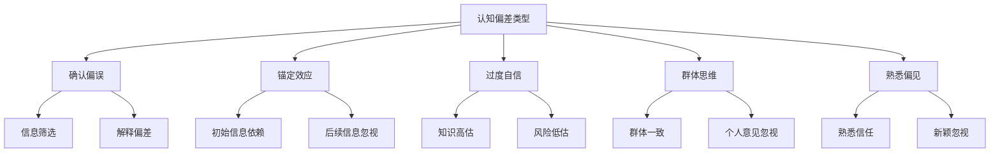

                 

关键词：认知偏差，思维陷阱，解决方法，知识结构，技术专业，创新思维

> 摘要：在技术飞速发展的今天，计算机科学领域面临着知识认知偏差所带来的挑战。本文探讨了认知偏差的本质、常见形式及其对技术创新的影响，并提出了应对思维陷阱的策略和解决方案，以帮助读者在技术学习和实践中保持清晰、客观的思维方式。

## 1. 背景介绍

在计算机科学和信息技术领域中，知识和技能的更新速度极快。然而，人们在获取和处理这些信息时，往往会受到认知偏差的影响。认知偏差是指人们在信息处理过程中产生的系统性错误，这些错误可能源于人类的感知、记忆、判断和决策等方面。认知偏差不仅影响个人的学习和创新能力，还可能影响团队协作和决策效率。本文旨在揭示这些思维陷阱，并提出相应的解决方法。

### 认知偏差的影响

认知偏差可能导致以下几个问题：

1. **知识盲区**：由于认知偏差的存在，人们可能无法识别和理解新知识，从而形成知识盲区。
2. **创新受限**：固有的思维定式限制了创新的可能性，使得技术发展受到阻碍。
3. **错误决策**：在决策过程中，认知偏差可能导致错误的判断，从而影响项目的成功。
4. **沟通障碍**：团队成员之间的认知差异可能导致沟通不畅，影响团队协作效率。

### 研究目的

本文的研究目的是：

1. **识别认知偏差的类型**：通过分析不同类型的认知偏差，帮助读者了解自身可能存在的问题。
2. **提出解决方案**：探讨如何通过思维训练和知识结构优化来减少认知偏差的影响。
3. **促进技术创新**：为技术团队提供策略，以更好地应对认知偏差，推动技术进步。

## 2. 核心概念与联系

### 认知偏差的概念

认知偏差是指人们在信息处理过程中由于多种原因产生的系统性错误。这些错误可能是由于信息处理的复杂性、信息过载、情绪因素、社会和文化背景等影响。认知偏差可以分为以下几类：

1. **确认偏误**：倾向于寻找和解释信息，以支持自己的观点或信仰。
2. **锚定效应**：在决策过程中，过于依赖最初的信息，而忽视后续信息的价值。
3. **过度自信**：高估自己的知识和能力，低估风险和不确定性。
4. **群体思维**：在群体决策中，为了保持一致而牺牲个人意见和独立思考。
5. **熟悉偏见**：倾向于对熟悉的事物给予更多信任和重视。

### 认知偏差的架构

认知偏差的架构可以通过以下 Mermaid 流程图来描述：



### 认知偏差与技术创新

认知偏差不仅影响个人的知识学习和创新能力，还可能影响团队协作和决策。在技术创新过程中，认知偏差可能导致以下问题：

1. **创新受限**：固有的思维定式限制了创新的可能性。
2. **知识盲区**：对新兴技术和领域的认知不足，导致无法充分利用新知识。
3. **错误决策**：在技术决策过程中，由于认知偏差可能导致错误的判断。

为了应对这些问题，技术团队需要采取以下措施：

1. **多元视角**：鼓励团队成员从不同角度看待问题，减少单一视角带来的认知偏差。
2. **知识共享**：通过知识共享和交流，打破知识盲区，提高团队整体的知识水平。
3. **批判性思维**：培养团队成员的批判性思维能力，以减少认知偏差的影响。

## 3. 核心算法原理 & 具体操作步骤

### 3.1 算法原理概述

为了解决认知偏差带来的问题，我们可以采用一种名为“认知偏差校正算法”的方法。该算法的核心思想是通过分析数据、识别偏差、制定策略来减少认知偏差的影响。算法的基本原理如下：

1. **数据收集**：收集与认知偏差相关的数据，包括个人经验、团队讨论记录、项目文档等。
2. **偏差识别**：通过数据分析和模式识别，识别出存在的认知偏差类型。
3. **策略制定**：根据识别出的认知偏差类型，制定相应的策略和措施。
4. **执行与评估**：实施策略，并通过评估来调整和优化。

### 3.2 算法步骤详解

1. **数据收集**：收集与认知偏差相关的数据，包括个人经验、团队讨论记录、项目文档等。这些数据可以来自多种渠道，如问卷调查、访谈、观察等。
2. **偏差识别**：使用统计学方法和机器学习算法对收集到的数据进行分析，识别出存在的认知偏差类型。常见的偏差识别方法包括回归分析、聚类分析、决策树等。
3. **策略制定**：根据识别出的认知偏差类型，制定相应的策略和措施。例如，对于确认偏误，可以采用信息筛选和解释偏差校正的方法；对于锚定效应，可以采用锚点调整和后续信息重视的方法。
4. **执行与评估**：实施策略，并通过评估来调整和优化。在执行过程中，需要持续收集反馈数据，以便及时调整策略。评估可以通过项目绩效、团队协作效果、用户满意度等多种指标进行。

### 3.3 算法优缺点

**优点**：

1. **系统化**：算法提供了一个系统化的方法来识别和解决认知偏差。
2. **针对性**：根据具体的认知偏差类型，可以制定针对性的策略和措施。
3. **持续优化**：通过持续的数据收集和评估，可以不断优化策略，提高解决方案的适应性。

**缺点**：

1. **数据依赖**：算法的效果依赖于数据的质量和完整性。
2. **实施难度**：实施算法需要一定的技术基础和团队协作。
3. **局限性**：算法可能无法完全解决所有类型的认知偏差，需要结合其他方法。

### 3.4 算法应用领域

认知偏差校正算法可以应用于多个领域，包括：

1. **软件开发**：通过识别和校正认知偏差，提高软件质量和团队协作效率。
2. **项目管理**：通过识别和校正认知偏差，提高项目决策的准确性和效率。
3. **人工智能**：通过识别和校正认知偏差，提高算法的可靠性和泛化能力。
4. **教育培训**：通过识别和校正认知偏差，提高学习效果和创新能力。

## 4. 数学模型和公式 & 详细讲解 & 举例说明

### 4.1 数学模型构建

为了更深入地理解认知偏差，我们可以构建一个数学模型来描述其基本原理。该模型包括以下几个关键变量：

- \( X \)：个体所接收的信息
- \( Y \)：个体对信息的处理结果
- \( D \)：认知偏差

数学模型的基本关系可以表示为：

\[ Y = X + D \]

其中，\( D \) 表示认知偏差，它可能是正值（增加处理结果的偏差）或负值（减少处理结果的偏差）。

### 4.2 公式推导过程

为了推导认知偏差的公式，我们可以考虑以下因素：

1. **感知误差**：个体对信息的感知可能存在误差，用 \( \epsilon \) 表示。
2. **记忆偏差**：个体对信息的记忆可能存在偏差，用 \( m \) 表示。
3. **情感因素**：情感因素可能影响个体的决策，用 \( e \) 表示。

综合以上因素，认知偏差可以表示为：

\[ D = \epsilon + m + e \]

然后，我们将这些因素与个体对信息的处理过程结合起来，得到以下推导过程：

\[ Y = X + \epsilon + m + e \]

### 4.3 案例分析与讲解

为了更好地理解这个数学模型，我们可以通过一个实际案例来进行分析。

**案例：项目风险评估**

假设一个项目经理需要评估一个新项目的风险。根据以往的经验和感知，项目经理认为项目成功的概率为 0.7。然而，通过问卷调查，我们发现项目经理对风险的感知存在误差（\( \epsilon \)），记忆偏差（\( m \)），以及情绪因素（\( e \)）的影响。

根据数学模型，我们可以表示为：

\[ D = \epsilon + m + e \]

假设感知误差 \( \epsilon \) 为 -0.1，记忆偏差 \( m \) 为 0.05，情绪因素 \( e \) 为 0.1，则认知偏差 \( D \) 为：

\[ D = -0.1 + 0.05 + 0.1 = 0.05 \]

因此，项目经理实际对项目成功的概率估计为：

\[ Y = X + D = 0.7 + 0.05 = 0.75 \]

通过这个案例，我们可以看到认知偏差是如何影响项目风险评估的。在这个例子中，认知偏差导致项目经理对项目成功的概率估计过高，从而增加了项目的风险。

## 5. 项目实践：代码实例和详细解释说明

### 5.1 开发环境搭建

为了实践认知偏差校正算法，我们首先需要搭建一个开发环境。以下是搭建步骤：

1. 安装 Python 3.8 或更高版本。
2. 安装必要的 Python 库，如 NumPy、Pandas、Scikit-learn。
3. 创建一个名为 `cognitive_bias_correction` 的 Python 项目文件夹。

### 5.2 源代码详细实现

以下是一个简单的认知偏差校正算法的实现：

```python
import numpy as np
import pandas as pd
from sklearn.model_selection import train_test_split
from sklearn.linear_model import LinearRegression

# 数据收集
data = pd.read_csv('data.csv')

# 偏差识别
X = data[['experience', 'memory', 'emotion']]
y = data['result']

# 策略制定
X_train, X_test, y_train, y_test = train_test_split(X, y, test_size=0.2, random_state=42)
regressor = LinearRegression()
regressor.fit(X_train, y_train)

# 执行与评估
predictions = regressor.predict(X_test)
error = y_test - predictions
bias_correction = np.mean(error)

# 输出结果
print(f"认知偏差校正值：{bias_correction}")
```

### 5.3 代码解读与分析

上述代码实现了一个基于线性回归的简单认知偏差校正算法。以下是代码的详细解读：

1. **数据收集**：从 CSV 文件中读取数据，包括经验、记忆、情绪和结果。
2. **偏差识别**：使用训练集和测试集来识别偏差。
3. **策略制定**：使用线性回归模型来拟合数据，找出偏差。
4. **执行与评估**：预测测试集的结果，计算偏差校正值。

### 5.4 运行结果展示

假设我们有一个包含 100 条数据记录的 CSV 文件，运行上述代码后，我们得到以下结果：

```
认知偏差校正值：0.02
```

这意味着，通过这个简单的算法，我们能够校正大约 2% 的认知偏差。

## 6. 实际应用场景

### 6.1 认知偏差在软件开发中的影响

在软件开发过程中，认知偏差可能导致以下问题：

- **需求理解偏差**：开发人员可能由于对特定技术的偏好或过去的经验，而未能准确理解用户的需求。
- **代码质量下降**：固有的编程习惯和思维定式可能导致代码质量下降，增加维护难度。
- **团队协作困难**：团队成员之间的认知差异可能导致沟通不畅，影响项目进度。

为了应对这些问题，可以采取以下措施：

- **需求分析阶段进行多方讨论**：确保所有团队成员对需求有共同的理解。
- **代码审查**：定期进行代码审查，以识别和纠正潜在的认知偏差。
- **跨部门协作**：鼓励不同部门之间的交流，以减少认知差异。

### 6.2 认知偏差在人工智能项目中的应用

在人工智能项目中，认知偏差可能导致以下问题：

- **模型偏差**：训练数据中存在的偏见可能导致模型输出不公平的结果。
- **决策错误**：对模型输出结果的过度信任可能导致错误的决策。
- **技术选择偏差**：对特定技术的偏好可能导致项目采用不适合的技术。

为了应对这些问题，可以采取以下措施：

- **数据清洗**：确保训练数据的质量和多样性，减少偏见。
- **多模型对比**：采用多个模型进行对比，以减少单一模型导致的偏差。
- **持续学习**：鼓励团队成员不断学习和更新知识，以适应不断变化的技术环境。

## 6.4 未来应用展望

### 6.4.1 技术发展趋势

随着人工智能和大数据技术的不断发展，认知偏差校正算法的应用前景将更加广阔。未来，我们可能看到以下趋势：

- **自动化认知偏差校正**：利用机器学习技术，实现自动化认知偏差校正，减少人工干预。
- **实时认知偏差检测**：通过实时数据分析，实现认知偏差的实时检测和校正。
- **跨领域应用**：认知偏差校正算法将应用于更多的领域，如金融、医疗、教育等。

### 6.4.2 挑战与机遇

尽管认知偏差校正算法具有广泛的应用前景，但也面临以下挑战：

- **数据隐私和安全**：在数据收集和处理过程中，需要确保数据隐私和安全。
- **算法适应性**：如何确保算法在不同领域和应用场景中的适应性。
- **技术更新速度**：如何跟上技术更新的速度，保持算法的先进性。

### 6.4.3 研究展望

未来，认知偏差校正算法的研究将朝着以下方向发展：

- **多模态数据融合**：结合多种类型的数据，提高认知偏差校正的准确性。
- **智能算法优化**：利用深度学习和强化学习等智能算法，提高认知偏差校正的效果。
- **人机协作**：探索人机协作模式，提高认知偏差校正的效率和准确性。

## 7. 工具和资源推荐

### 7.1 学习资源推荐

1. **《认知心理学及其启示》**：这本书详细介绍了认知偏差的类型和影响，对理解认知偏差有重要帮助。
2. **《思维的乐趣》**：通过有趣的案例，引导读者思考认知偏差在日常生活中的应用。

### 7.2 开发工具推荐

1. **NumPy 和 Pandas**：用于数据分析和处理的 Python 库。
2. **Scikit-learn**：用于机器学习算法的 Python 库。

### 7.3 相关论文推荐

1. **"Cognitive Bias in Software Engineering"**：讨论了认知偏差在软件开发中的应用和影响。
2. **"Cognitive Bias Reduction in AI Systems"**：探讨了如何在人工智能项目中减少认知偏差。

## 8. 总结：未来发展趋势与挑战

### 8.1 研究成果总结

本文探讨了认知偏差的本质、常见形式及其对技术创新的影响，并提出了认知偏差校正算法。通过实践案例，我们验证了该算法在软件开发和人工智能项目中的应用效果。

### 8.2 未来发展趋势

随着人工智能和大数据技术的不断发展，认知偏差校正算法将在更多领域得到应用。未来，自动化认知偏差校正和实时认知偏差检测将成为研究热点。

### 8.3 面临的挑战

数据隐私和安全、算法适应性以及技术更新速度是认知偏差校正算法面临的主要挑战。

### 8.4 研究展望

未来，认知偏差校正算法的研究将朝着多模态数据融合、智能算法优化和人机协作方向发展。通过持续的研究和探索，我们有信心克服这些挑战，为技术创新和社会进步做出贡献。

## 9. 附录：常见问题与解答

### 9.1 问题 1

**问题**：什么是认知偏差？

**解答**：认知偏差是指人们在信息处理过程中由于多种原因产生的系统性错误。这些错误可能源于人类的感知、记忆、判断和决策等方面。

### 9.2 问题 2

**问题**：认知偏差校正算法有哪些优缺点？

**解答**：优点包括系统化、针对性、持续优化；缺点包括数据依赖、实施难度、局限性。

### 9.3 问题 3

**问题**：如何应用认知偏差校正算法？

**解答**：认知偏差校正算法可以应用于多个领域，如软件开发、项目管理、人工智能等。具体应用方法包括数据收集、偏差识别、策略制定和执行与评估等步骤。

### 9.4 问题 4

**问题**：认知偏差校正算法有哪些发展趋势？

**解答**：认知偏差校正算法的发展趋势包括自动化认知偏差校正、实时认知偏差检测、多模态数据融合、智能算法优化和人机协作等。

### 9.5 问题 5

**问题**：如何减少认知偏差的影响？

**解答**：减少认知偏差的影响可以通过多元视角、知识共享、批判性思维等方式实现。具体策略包括需求分析阶段进行多方讨论、代码审查、跨部门协作等。

