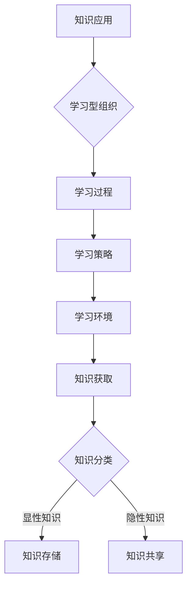

                 

关键词：知识管理、组织学习、企业战略、数据驱动、技术创新

> 摘要：本文深入探讨了知识管理与组织学习在企业战略发展中的关键作用。通过阐述知识管理与组织学习的核心概念、原理和方法，结合实际案例，分析其在推动企业持续创新、增强竞争力方面的实际效果，并对未来知识管理与组织学习的发展趋势和挑战进行了展望。

## 1. 背景介绍

在当今快速变化的经济环境中，企业面临着前所未有的挑战和机遇。全球化和数字化技术的飞速发展，使得知识成为企业核心竞争力的重要组成部分。知识管理（Knowledge Management，KM）和组织学习（Organizational Learning，OL）作为推动企业持续创新和发展的关键因素，日益受到企业和学术界的关注。

知识管理是指通过系统的方法，收集、存储、共享和应用知识，以提高组织的效率和创新能力。组织学习则是通过不断的知识交流和知识创新，提高组织适应外部环境变化的能力。两者相辅相成，共同构成企业发展的动力系统。

## 2. 核心概念与联系

### 2.1 知识管理的核心概念

知识管理涉及以下几个核心概念：

- **知识分类**：知识可以分为显性知识和隐性知识。显性知识是易于编码和共享的知识，如文档、数据库等；隐性知识则是难以编码和共享的知识，如个人经验、技能和态度等。

- **知识获取**：通过内部开发、外部采购、知识共享等方式获取知识。

- **知识存储**：利用数据库、知识库等技术手段存储知识。

- **知识共享**：通过培训、交流、社区等方式共享知识。

- **知识应用**：将知识应用于实际问题解决和决策制定中。

### 2.2 组织学习的核心概念

组织学习包括以下几个核心概念：

- **学习型组织**：组织成员具有共同的学习目标和价值观，通过持续的交流和合作，实现知识的共享和创新。

- **学习过程**：包括信息的收集、分析、整合和应用。

- **学习策略**：通过计划、执行、监控和反馈等环节，确保学习过程的顺利进行。

- **学习环境**：为组织成员提供良好的学习氛围和资源支持。

### 2.3 知识管理与组织学习的联系

知识管理与组织学习之间的关系可以看作是两个互动的循环系统。知识管理为组织学习提供了知识和工具，而组织学习则通过知识的创造和应用，进一步推动知识管理的发展。两者相互促进，共同构成企业发展的动力系统。

### 2.4 Mermaid 流程图

下面是一个简单的 Mermaid 流程图，展示了知识管理与组织学习之间的联系：



## 3. 核心算法原理 & 具体操作步骤

### 3.1 算法原理概述

知识管理和组织学习的过程可以抽象为一个算法模型，包括以下几个步骤：

1. **知识识别**：识别组织内部和外部的知识源。
2. **知识获取**：通过各种方式获取知识。
3. **知识分类**：根据知识的特点进行分类。
4. **知识存储**：将知识存储在数据库或知识库中。
5. **知识共享**：通过共享机制将知识传递给组织成员。
6. **知识应用**：将知识应用于实际问题解决和决策制定中。
7. **学习过程**：通过学习过程不断更新和优化知识。

### 3.2 算法步骤详解

1. **知识识别**：通过问卷调查、访谈、专家评审等方式，识别组织内部和外部的知识源。

2. **知识获取**：通过内部开发、外部采购、知识共享等方式获取知识。

3. **知识分类**：将获取到的知识分为显性知识和隐性知识。

4. **知识存储**：将分类后的知识存储在数据库或知识库中，方便后续检索和应用。

5. **知识共享**：通过培训、交流、社区等方式，将知识传递给组织成员。

6. **知识应用**：将知识应用于实际问题解决和决策制定中，提高组织效率和创新能力。

7. **学习过程**：通过学习过程不断更新和优化知识，实现知识的持续积累和进化。

### 3.3 算法优缺点

**优点**：

- 提高知识共享和复用效率，降低知识孤岛现象。
- 增强组织适应外部环境变化的能力。
- 促进组织成员的持续学习和能力提升。

**缺点**：

- 知识管理和组织学习过程复杂，需要大量资源和时间投入。
- 隐性知识的共享和转化难度较大。
- 可能导致组织内部的依赖性增加。

### 3.4 算法应用领域

知识管理和组织学习算法在以下领域有广泛的应用：

- 企业战略规划：通过知识管理和组织学习，提高企业战略规划和执行能力。
- 产品研发：通过知识管理和组织学习，加速产品创新和研发。
- 员工培训与发展：通过知识管理和组织学习，提高员工能力和绩效。
- 知识服务：通过知识管理和组织学习，提供高质量的知识服务。

## 4. 数学模型和公式 & 详细讲解 & 举例说明

### 4.1 数学模型构建

知识管理和组织学习的数学模型可以基于以下假设：

- 知识量随时间增长，符合指数增长模型。
- 知识共享和转化效率与组织成员的参与度成正比。
- 学习效果与知识应用次数和反馈质量成正比。

基于以上假设，我们可以构建如下数学模型：

$$
K(t) = K_0 \cdot e^{rt} \cdot (1 + \alpha \cdot P(t))
$$

其中：

- $K(t)$ 表示时间 $t$ 时的知识量。
- $K_0$ 表示初始知识量。
- $r$ 表示知识增长速率。
- $\alpha$ 表示知识共享和转化效率。
- $P(t)$ 表示时间 $t$ 时的组织成员参与度。

### 4.2 公式推导过程

推导过程如下：

1. 知识量 $K(t)$ 的增长速率 $\frac{dK(t)}{dt}$ 可以表示为：

$$
\frac{dK(t)}{dt} = r \cdot K(t)
$$

2. 由于知识量 $K(t)$ 随时间 $t$ 的增长符合指数增长模型，我们可以将上述微分方程转换为：

$$
\frac{dK(t)}{dt} = r \cdot K_0 \cdot e^{rt}
$$

3. 两边同时积分，得到：

$$
K(t) = K_0 \cdot e^{rt} + C
$$

其中，$C$ 是积分常数。

4. 由于初始知识量 $K(0) = K_0$，我们可以得到 $C = 0$，因此：

$$
K(t) = K_0 \cdot e^{rt}
$$

5. 考虑到知识共享和转化效率的影响，我们可以引入一个系数 $\alpha$，表示知识共享和转化效率。此时，知识量 $K(t)$ 可以表示为：

$$
K(t) = K_0 \cdot e^{rt} \cdot (1 + \alpha \cdot P(t))
$$

其中，$P(t)$ 表示时间 $t$ 时的组织成员参与度。

### 4.3 案例分析与讲解

以下是一个简单的案例，用于说明知识管理和组织学习的数学模型在实际中的应用。

假设一家企业在初始时拥有100个知识点（$K_0 = 100$）。知识增长速率 $r = 0.1$，知识共享和转化效率 $\alpha = 0.5$。假设在时间 $t = 1$ 年时，组织成员参与度 $P(1) = 0.8$。

根据上述数学模型，我们可以计算出在1年后的知识量：

$$
K(1) = 100 \cdot e^{0.1 \cdot 1} \cdot (1 + 0.5 \cdot 0.8) \approx 165.4
$$

这意味着在1年后，企业的知识量将增加到约165.4个知识点。

## 5. 项目实践：代码实例和详细解释说明

### 5.1 开发环境搭建

在本项目中，我们将使用Python编程语言和Jupyter Notebook作为开发环境。首先，需要在本地计算机上安装Python和Jupyter Notebook。

1. 安装Python：访问Python官网（https://www.python.org/），下载并安装Python。
2. 安装Jupyter Notebook：在终端中运行以下命令：

```bash
pip install notebook
```

### 5.2 源代码详细实现

以下是一个简单的知识管理和组织学习模型的Python代码实现：

```python
import numpy as np
import matplotlib.pyplot as plt

# 参数设置
K0 = 100  # 初始知识量
r = 0.1   # 知识增长速率
alpha = 0.5  # 知识共享和转化效率
P = 0.8    # 组织成员参与度
t_max = 10  # 时间范围

# 数学模型
def knowledge_model(K0, r, alpha, P, t_max):
    t = np.arange(0, t_max+1)
    Kt = K0 * np.exp(r*t) * (1 + alpha*P)
    return t, Kt

# 计算知识量
t, Kt = knowledge_model(K0, r, alpha, P, t_max)

# 可视化结果
plt.plot(t, Kt)
plt.xlabel('Time')
plt.ylabel('Knowledge')
plt.title('Knowledge Growth with Organizational Learning')
plt.show()
```

### 5.3 代码解读与分析

1. **导入库**：首先，我们导入numpy和matplotlib库，用于数学计算和可视化。
2. **参数设置**：接下来，我们设置初始知识量 $K_0$、知识增长速率 $r$、知识共享和转化效率 $\alpha$、组织成员参与度 $P$ 和时间范围 $t_{\max}$。
3. **定义数学模型**：`knowledge_model` 函数实现了知识管理模型的计算过程。它接受初始知识量、知识增长速率、知识共享和转化效率、组织成员参与度和时间范围作为输入，返回时间序列 $t$ 和知识量序列 $K_t$。
4. **计算知识量**：调用 `knowledge_model` 函数，计算知识量序列 $K_t$。
5. **可视化结果**：使用matplotlib库，将时间序列 $t$ 和知识量序列 $K_t$ 绘制成图表，展示知识随时间增长的情况。

### 5.4 运行结果展示

运行上述代码后，我们将得到一个图表，展示知识量随时间增长的情况。图表中的曲线表明，知识量随时间的增长呈指数形式增加，这符合我们设定的数学模型。通过调整参数，我们可以模拟不同的知识增长速度和共享转化效率，从而更好地理解知识管理和组织学习过程。

## 6. 实际应用场景

知识管理和组织学习在多个实际应用场景中发挥着重要作用，以下是几个典型的应用案例：

### 6.1 企业战略规划

企业通过知识管理和组织学习，可以更好地理解和应对市场变化，制定更有效的战略规划。例如，一家制造企业通过建立知识库和实施知识共享机制，收集和分析市场趋势、客户需求和竞争对手信息，从而为产品研发和市场营销提供有力支持。

### 6.2 产品研发

在产品研发过程中，知识管理和组织学习可以加速技术创新和产品迭代。例如，一家科技公司通过知识共享平台，将研发团队的知识和经验积累下来，为新员工提供学习和参考的资源，从而提高研发效率和产品质量。

### 6.3 员工培训与发展

知识管理和组织学习可以帮助企业更好地培养和提升员工能力。例如，一家金融服务公司通过实施学习型组织模式，为员工提供丰富的学习资源和培训机会，促进员工的职业发展和技能提升。

### 6.4 知识服务

知识管理和组织学习在知识服务领域也有广泛应用。例如，一家咨询公司通过建立知识库和知识共享平台，为内部员工和客户提供高质量的知识服务，提高咨询服务水平和客户满意度。

## 7. 未来应用展望

随着人工智能、大数据和区块链等技术的发展，知识管理和组织学习在未来有望实现更多创新和应用。以下是几个未来发展趋势：

### 7.1 智能知识管理

通过引入人工智能技术，智能知识管理系统将能够自动识别、分类和推荐知识，提高知识共享和应用的效率。

### 7.2 大数据驱动的组织学习

大数据分析技术可以帮助企业更好地了解组织内部的知识结构和学习需求，从而制定更有效的学习策略和培训计划。

### 7.3 区块链技术

区块链技术可以确保知识的可追溯性和安全性，为知识共享和交易提供可靠保障。

### 7.4 跨界融合

知识管理和组织学习将与更多领域（如教育、医疗、金融等）融合，为不同行业提供定制化的解决方案。

## 8. 工具和资源推荐

为了更好地开展知识管理和组织学习，以下是一些实用的工具和资源推荐：

### 8.1 学习资源推荐

- 《知识管理：理论与实践》
- 《组织学习：战略行动指南》
- 《学习型组织：如何构建高效学习型企业》

### 8.2 开发工具推荐

- 知识库工具：Confluence、SharePoint
- 知识共享平台：Slack、Microsoft Teams
- 数据分析工具：Python、R

### 8.3 相关论文推荐

- “Knowledge Management in Organizations: An Overview”
- “The Role of Organizational Learning in Innovation”
- “Integrating Knowledge Management and Organizational Learning: A Research Agenda”

## 9. 总结：未来发展趋势与挑战

知识管理和组织学习作为企业发展的动力，在未来将继续发挥重要作用。然而，随着技术的不断进步和市场竞争的加剧，知识管理和组织学习也面临着新的挑战。如何在复杂多变的环境中有效实施知识管理和组织学习，是企业需要持续探索和解决的问题。通过技术创新和跨领域合作，我们有望推动知识管理和组织学习的发展，为企业的持续创新和成长提供更强动力。

## 10. 附录：常见问题与解答

### Q：知识管理和组织学习有什么区别？

A：知识管理主要关注知识的获取、分类、存储和共享，旨在提高组织内部知识的可访问性和利用效率。组织学习则更侧重于通过知识交流和创新，提高组织的适应能力和创新能力。知识管理是组织学习的基础，而组织学习则是知识管理的深化和应用。

### Q：知识管理和组织学习如何推动企业创新？

A：知识管理和组织学习通过以下方式推动企业创新：

1. **积累和共享知识**：促进知识的积累和共享，为创新提供丰富的知识储备。
2. **培养创新思维**：通过组织学习和知识交流，激发员工的创新思维和创造力。
3. **快速响应市场变化**：提高组织对市场变化的敏感度和响应能力，加快产品迭代和创新。
4. **跨界合作**：通过知识共享和合作，与外部合作伙伴共同开展创新项目。

### Q：知识管理和组织学习在实际应用中面临哪些挑战？

A：在实际应用中，知识管理和组织学习面临以下挑战：

1. **知识孤岛**：组织内部不同部门和团队之间缺乏有效的知识共享机制。
2. **隐性知识共享难度大**：隐性知识的编码和共享相对困难，需要更多的努力和时间。
3. **学习资源不足**：缺乏足够的学习资源和培训机会，影响组织成员的学习效果。
4. **企业文化障碍**：组织文化中可能存在知识共享和创新的阻碍，需要通过变革和组织文化建设来克服。

### Q：如何应对知识管理和组织学习的挑战？

A：以下是一些应对挑战的方法：

1. **建立知识共享机制**：通过建设知识库、知识共享平台等，促进组织内部的知识交流。
2. **鼓励隐性知识共享**：通过访谈、案例分享、导师制等方式，鼓励员工主动分享隐性知识。
3. **提供学习资源**：为企业员工提供丰富的学习资源，如在线课程、培训活动等。
4. **推动组织文化变革**：通过倡导知识共享和创新文化，消除知识管理和组织学习的障碍。

