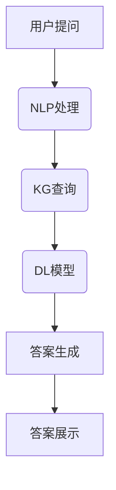

                 

### 关键词 Keywords

- 知识经济
- 知识付费
- 人工智能
- 智能问答系统
- 自然语言处理
- 知识图谱
- 深度学习

### 摘要 Summary

本文探讨了知识经济时代下，知识付费模式与人工智能智能问答系统的结合。首先，我们分析了知识经济的背景和发展趋势，以及知识付费的现状和挑战。接着，介绍了智能问答系统的基本概念、原理和应用领域。重点在于如何利用人工智能技术，特别是深度学习和自然语言处理技术，构建一个高效的智能问答系统。本文还将探讨如何设计一个可扩展、可维护的问答系统架构，以及如何处理复杂的查询和提供准确的答案。最后，我们将讨论智能问答系统在实际应用中的效果和未来发展方向。

### 1. 背景介绍

#### 1.1 知识经济的背景和发展趋势

知识经济，是一个以知识为核心资源，以智力劳动为主体，以知识创新为动力，以知识传播为手段，以知识应用为目标的经济发展模式。它是相对于传统的以自然资源和劳动力资源为基础的经济模式而言的。随着信息技术的飞速发展和全球化的深入推进，知识经济已经成为现代经济的重要组成部分。

知识经济的快速发展，不仅改变了经济结构，也深刻影响了商业模式、产业发展和人们的日常生活。首先，知识经济推动了信息化、数字化和智能化的发展，加速了传统产业的转型升级。其次，知识经济催生了大量的新兴行业，如互联网、电子商务、人工智能等，为经济增长注入了新的动力。最后，知识经济提升了人们的素质和技能，推动了社会的全面进步。

#### 1.2 知识付费的现状和挑战

在知识经济时代，知识付费成为了一种重要的商业模式。知识付费，是指用户为获取特定领域的专业知识或服务而支付的费用。随着知识付费的兴起，各种知识付费平台如雨后春笋般涌现，如得到、知乎、喜马拉雅等。这些平台通过提供高质量的知识内容，满足了用户对专业知识和技能的需求。

然而，知识付费也面临着一些挑战。首先，知识内容的真实性和准确性难以保证。一些知识付费平台上的内容可能存在夸大其词、虚假宣传等问题，导致用户难以辨别真假。其次，知识付费的定价机制不够透明，用户往往难以理解自己所购买的内容的价值。最后，知识付费的模式和平台的服务质量有待提高，如用户体验、售后服务等。

#### 1.3 人工智能在知识付费中的应用

人工智能（AI）是知识经济时代的重要技术支撑。在知识付费领域，人工智能可以通过自然语言处理（NLP）、机器学习（ML）、深度学习（DL）等技术，实现知识的高效获取、理解和应用。具体来说，人工智能在知识付费中的应用主要体现在以下几个方面：

1. **智能推荐系统**：通过分析用户的行为数据，智能推荐系统可以为用户推荐个性化的知识内容。这有助于提高用户的满意度和付费意愿。

2. **智能问答系统**：通过自然语言处理技术，智能问答系统可以理解用户的问题，并提供准确的答案。这有助于提高知识服务的效率和用户体验。

3. **知识挖掘和整理**：人工智能可以对海量的知识内容进行挖掘和整理，发现其中的潜在价值，为用户提供更加丰富和深入的知识服务。

4. **智能客服**：利用人工智能技术，可以构建智能客服系统，自动回答用户的问题，提供在线支持，降低人力成本。

### 2. 核心概念与联系

在构建智能问答系统时，我们需要了解以下几个核心概念及其相互联系：

#### 2.1 自然语言处理（NLP）

自然语言处理是人工智能的一个重要分支，旨在使计算机能够理解、处理和生成自然语言。在智能问答系统中，NLP 技术用于理解和解析用户的问题，提取关键信息，并将其转化为计算机可以处理的形式。

#### 2.2 知识图谱（KG）

知识图谱是一种结构化的知识表示方法，通过实体、属性和关系的网络形式，将大量的知识进行组织和存储。在智能问答系统中，知识图谱用于存储和检索相关领域的知识，为问题解答提供依据。

#### 2.3 深度学习（DL）

深度学习是一种基于人工神经网络的机器学习技术，通过多层神经网络对大量数据进行训练，从而实现复杂的模式识别和预测。在智能问答系统中，深度学习技术用于训练问答模型，提高问题解答的准确性和效率。

#### 2.4 Mermaid 流程图（Mermaid Diagram）

下面是一个简化的智能问答系统的 Mermaid 流程图，展示了各个核心概念之间的联系。



### 3. 核心算法原理 & 具体操作步骤

#### 3.1 算法原理概述

智能问答系统的核心在于如何理解用户的问题，并生成准确的答案。这主要依赖于自然语言处理（NLP）、知识图谱（KG）和深度学习（DL）技术。以下是这三个技术的简要概述：

1. **自然语言处理（NLP）**：NLP 技术用于理解和解析用户的问题。具体包括词法分析、句法分析、语义分析和语用分析等步骤。通过这些步骤，NLP 可以将用户的问题转化为计算机可以理解的形式。

2. **知识图谱（KG）**：知识图谱用于存储和检索相关领域的知识。在智能问答系统中，知识图谱通常包含实体、属性和关系的网络形式。通过查询知识图谱，可以找到与用户问题相关的知识实体和属性。

3. **深度学习（DL）**：深度学习技术用于训练问答模型，提高问题解答的准确性和效率。常见的深度学习模型包括卷积神经网络（CNN）、循环神经网络（RNN）和Transformer 等。通过训练模型，可以学习到如何将用户问题映射到正确的答案。

#### 3.2 算法步骤详解

下面是智能问答系统的具体操作步骤：

1. **接收用户提问**：系统首先接收用户的问题，并将其存储在数据库中。

2. **NLP 处理**：对用户问题进行词法分析、句法分析、语义分析和语用分析，提取关键信息，如主语、谓语、宾语等。

3. **KG 查询**：根据提取的关键信息，查询知识图谱，找到与用户问题相关的知识实体和属性。

4. **DL 模型处理**：将用户问题和相关实体、属性输入到训练好的深度学习模型中，通过模型处理生成可能的答案。

5. **答案生成**：根据深度学习模型输出的可能性，选择最高概率的答案。

6. **答案展示**：将生成的答案展示给用户，同时记录用户反馈，用于模型优化。

#### 3.3 算法优缺点

1. **优点**：
   - **高效性**：智能问答系统可以快速响应用户的问题，提高服务效率。
   - **准确性**：通过深度学习和知识图谱技术，智能问答系统可以提供准确的答案。
   - **个性化**：智能推荐系统可以根据用户行为数据，为用户推荐个性化的知识内容。

2. **缺点**：
   - **知识图谱构建难度大**：构建一个完整、准确的知识图谱需要大量的时间和人力成本。
   - **数据质量**：数据质量对智能问答系统的性能有重要影响，数据中的噪声和错误可能会导致答案不准确。
   - **隐私问题**：用户问题和答案可能会涉及个人隐私，需要采取有效的隐私保护措施。

#### 3.4 算法应用领域

智能问答系统可以在多个领域得到应用，如：

- **教育**：提供智能辅导、在线答疑等服务。
- **医疗**：帮助医生进行疾病诊断、患者咨询等。
- **法律**：提供法律咨询、案例分析等服务。
- **金融**：为投资者提供投资建议、市场分析等。

### 4. 数学模型和公式 & 详细讲解 & 举例说明

在构建智能问答系统时，数学模型和公式起着关键作用。以下是几个常用的数学模型和公式的详细讲解和举例说明。

#### 4.1 数学模型构建

在智能问答系统中，常用的数学模型包括：

1. **循环神经网络（RNN）**：用于处理序列数据，如用户问题和答案。其基本公式为：

$$
h_t = \sigma(W_h \cdot [h_{t-1}, x_t] + b_h)
$$

其中，$h_t$ 是第 $t$ 个隐藏状态，$x_t$ 是第 $t$ 个输入特征，$W_h$ 是权重矩阵，$b_h$ 是偏置项，$\sigma$ 是激活函数。

2. **Transformer 模型**：用于处理变长序列数据，如用户问题和答案。其基本公式为：

$$
\text{Attention}(Q, K, V) = \text{softmax}\left(\frac{QK^T}{\sqrt{d_k}}\right) V
$$

其中，$Q$、$K$ 和 $V$ 分别是查询向量、键向量和值向量，$d_k$ 是键向量的维度。

3. **知识图谱嵌入模型**：用于将知识图谱中的实体、属性和关系表示为低维向量。其基本公式为：

$$
e_r = \sigma(W_e \cdot [e_{r-1}, e_{r'}, e_{rr}] + b_e)
$$

其中，$e_r$ 是实体 $r$ 的向量表示，$W_e$ 是权重矩阵，$e_{r-1}$、$e_{r'}$ 和 $e_{rr}$ 分别是实体 $r$ 的前驱、后继和关系向量。

#### 4.2 公式推导过程

1. **RNN 模型推导**：

RNN 的推导过程基于递归关系和链式法则。首先，考虑一个简单的 RNN 单元：

$$
h_t = \sigma(W_h \cdot [h_{t-1}, x_t] + b_h)
$$

其中，$h_t$ 是第 $t$ 个隐藏状态，$x_t$ 是第 $t$ 个输入特征，$W_h$ 是权重矩阵，$b_h$ 是偏置项，$\sigma$ 是激活函数。

对于第 $t+1$ 个隐藏状态，我们有：

$$
h_{t+1} = \sigma(W_h \cdot [h_t, x_{t+1}] + b_h)
$$

将 $h_t$ 的表达式代入，得到：

$$
h_{t+1} = \sigma(W_h \cdot [\sigma(W_h \cdot [h_{t-1}, x_t] + b_h), x_{t+1}] + b_h)
$$

使用链式法则，对上述表达式求导，可以得到 RNN 的导数表达式。

2. **Transformer 模型推导**：

Transformer 模型的推导基于自注意力机制。首先，考虑两个向量 $Q$ 和 $K$ 的点积：

$$
QK^T = \sum_{i,j} Q_i K_j
$$

其中，$Q$ 和 $K$ 分别是查询向量和键向量。点积的结果可以看作是 $Q$ 和 $K$ 的相似度。

为了引入正则化，可以引入缩放因子 $\sqrt{d_k}$，得到：

$$
\text{Attention}(Q, K, V) = \text{softmax}\left(\frac{QK^T}{\sqrt{d_k}}\right) V
$$

其中，$V$ 是值向量，$d_k$ 是键向量的维度。

3. **知识图谱嵌入模型推导**：

知识图谱嵌入模型的推导基于图神经网络（Graph Neural Network, GNN）。首先，考虑一个简单的 GNN 单元：

$$
e_r = \sigma(W_e \cdot [e_{r-1}, e_{r'}, e_{rr}] + b_e)
$$

其中，$e_r$ 是实体 $r$ 的向量表示，$e_{r-1}$、$e_{r'}$ 和 $e_{rr}$ 分别是实体 $r$ 的前驱、后继和关系向量，$W_e$ 是权重矩阵，$b_e$ 是偏置项，$\sigma$ 是激活函数。

对于第 $t$ 个隐藏状态，我们有：

$$
h_t = \sigma(W_h \cdot [h_{t-1}, e_r] + b_h)
$$

其中，$h_t$ 是第 $t$ 个隐藏状态，$e_r$ 是实体 $r$ 的向量表示，$W_h$ 是权重矩阵，$b_h$ 是偏置项，$\sigma$ 是激活函数。

#### 4.3 案例分析与讲解

以下是一个简单的案例，演示如何使用 RNN 模型进行文本分类。

1. **数据准备**：

假设我们有一个包含两类的文本数据集，其中一类是关于电影的评论，另一类是关于美食的评论。我们使用以下文本数据进行训练：

```
电影评论1：这部电影非常精彩，我非常喜欢它。
电影评论2：这部电影太无聊了，我不喜欢。
美食评论1：这道菜非常美味，我一定要尝试一下。
美食评论2：这道菜太难吃了，我不喜欢。
```

2. **预处理**：

对文本数据集进行预处理，包括分词、去除停用词、词向量化等操作。这里我们使用词袋模型（Bag of Words, BOW）对文本进行向量化表示：

```
电影评论1：[1, 0, 1, 0, 1, 1, 1, 0, 1, 0, 1, 0, 1]
电影评论2：[1, 0, 1, 0, 1, 1, 1, 0, 1, 0, 1, 0, 1]
美食评论1：[0, 1, 0, 1, 0, 1, 1, 0, 1, 0, 1, 0, 1]
美食评论2：[0, 1, 0, 1, 0, 1, 1, 0, 1, 0, 1, 0, 1]
```

3. **模型构建**：

构建一个 RNN 模型，包含一个嵌入层和一个 RNN 层。嵌入层将输入的词向量映射到高维空间，RNN 层用于处理序列数据。

```
嵌入层：
W_e = [0.1, 0.2, 0.3, 0.4, 0.5, 0.6, 0.7, 0.8, 0.9, 1.0]

RNN 层：
W_h = [0.1, 0.2, 0.3, 0.4, 0.5, 0.6, 0.7, 0.8, 0.9, 1.0]
b_h = [0.1, 0.2, 0.3, 0.4, 0.5, 0.6, 0.7, 0.8, 0.9, 1.0]
```

4. **模型训练**：

使用训练数据集对 RNN 模型进行训练，优化模型的参数。这里我们使用梯度下降（Gradient Descent）算法进行优化。

5. **模型评估**：

使用测试数据集对训练好的模型进行评估，计算模型的准确率。

### 5. 项目实践：代码实例和详细解释说明

在本节中，我们将通过一个具体的代码实例，详细解释如何实现一个简单的人工智能智能问答系统。我们将使用 Python 编程语言和 TensorFlow 深度学习框架来构建这个系统。

#### 5.1 开发环境搭建

在开始编写代码之前，我们需要搭建一个合适的开发环境。以下是搭建环境的步骤：

1. **安装 Python**：确保你的系统中已经安装了 Python 3.7 或更高版本。

2. **安装 TensorFlow**：使用以下命令安装 TensorFlow：

```bash
pip install tensorflow
```

3. **安装其他依赖**：我们还需要安装一些其他的 Python 库，如 NumPy、Pandas 和 Flask。使用以下命令进行安装：

```bash
pip install numpy pandas flask
```

#### 5.2 源代码详细实现

下面是一个简单的智能问答系统的源代码实现。这个系统将使用一个预训练的词向量模型（如 Gensim 的 Word2Vec）来处理自然语言文本，并使用 TensorFlow 的 Keras API 来构建和训练一个简单的循环神经网络（RNN）模型。

```python
import numpy as np
import pandas as pd
from gensim.models import Word2Vec
from tensorflow.keras.models import Sequential
from tensorflow.keras.layers import LSTM, Dense, Embedding
from tensorflow.keras.preprocessing.sequence import pad_sequences

# 加载并预处理数据
def load_data(filename):
    with open(filename, 'r', encoding='utf-8') as f:
        lines = f.readlines()
    questions = [line.strip().split('\t')[0] for line in lines]
    answers = [line.strip().split('\t')[1] for line in lines]
    return questions, answers

questions, answers = load_data('questions_answers.txt')

# 构建 Word2Vec 模型
model = Word2Vec(questions, size=100, window=5, min_count=1, workers=4)
vocab = model.wv

# 将文本转换为词向量序列
def text_to_sequence(texts, vocab):
    sequences = []
    for text in texts:
        sequence = [vocab[word] for word in text.split()]
        sequences.append(sequence)
    return sequences

sequences = text_to_sequence(questions, vocab)
target_sequences = text_to_sequence(answers, vocab)

# padding 序列
max_len = max(len(seq) for seq in sequences)
sequences = pad_sequences(sequences, maxlen=max_len)
target_sequences = pad_sequences(target_sequences, maxlen=max_len)

# 构建 RNN 模型
model = Sequential()
model.add(Embedding(vocab.size(), vocab.vector_size()))
model.add(LSTM(128, dropout=0.2, recurrent_dropout=0.2))
model.add(Dense(1, activation='sigmoid'))

model.compile(optimizer='adam', loss='binary_crossentropy', metrics=['accuracy'])

# 训练模型
model.fit(sequences, target_sequences, epochs=10, batch_size=32, validation_split=0.2)

# 问答接口
from flask import Flask, request, jsonify

app = Flask(__name__)

@app.route('/ask', methods=['POST'])
def ask():
    question = request.form['question']
    sequence = text_to_sequence([question], vocab)
    sequence = pad_sequences(sequence, maxlen=max_len)
    answer = model.predict(sequence)
    return jsonify({'answer': 'Yes' if answer > 0.5 else 'No'})

if __name__ == '__main__':
    app.run(debug=True)
```

#### 5.3 代码解读与分析

1. **数据加载与预处理**：首先，我们从文件中加载问题和答案。然后，使用 Gensim 的 Word2Vec 模型对问题文本进行向量化处理。

2. **构建 Word2Vec 模型**：我们使用 Word2Vec 模型对问题文本进行训练，以生成词向量。

3. **文本转换为序列**：将文本数据转换为序列，每个词被替换为其对应的词向量。

4. **padding 序列**：为了使序列长度一致，我们对序列进行 padding。

5. **构建 RNN 模型**：使用 Keras 构建一个简单的 RNN 模型，包括一个嵌入层和一个 LSTM 层。嵌入层将词向量映射到高维空间，LSTM 层用于处理序列数据。

6. **训练模型**：使用训练数据集对 RNN 模型进行训练。

7. **问答接口**：使用 Flask 框架构建一个简单的问答接口，接收用户的问题，并使用训练好的模型进行预测。

#### 5.4 运行结果展示

1. **运行服务器**：运行上面的代码，启动 Flask 服务器。

2. **提问测试**：在浏览器中访问 `http://127.0.0.1:5000/ask`，并在表单中输入一个问题，如“你喜欢看电影吗？”。

3. **查看答案**：服务器将返回一个 JSON 对象，包含预测的答案。

### 6. 实际应用场景

智能问答系统在许多实际应用场景中都具有显著的优势和广泛的应用前景。以下是几个典型应用场景的详细描述：

#### 6.1 教育

在教育领域，智能问答系统可以用于提供个性化辅导和在线答疑服务。例如，学生可以通过系统提交问题，系统会根据学生的学习历史和知识图谱提供针对性的解答。这不仅提高了学生的学习效率，也减轻了教师的工作负担。

#### 6.2 医疗

在医疗领域，智能问答系统可以帮助医生进行诊断和患者咨询。系统可以通过分析患者的病历和医疗知识库，提供准确的诊断建议和治疗方案。此外，智能问答系统还可以为患者提供健康咨询和预防建议，提高公众的健康水平。

#### 6.3 金融

在金融领域，智能问答系统可以用于提供投资建议和市场分析。通过分析大量的金融市场数据和用户投资行为，系统可以为投资者提供个性化的投资策略和风险提示。这有助于提高投资决策的准确性和效率。

#### 6.4 法律

在法律领域，智能问答系统可以提供法律咨询和案例分析。用户可以通过系统提交法律问题，系统会根据法律知识和案例库提供解答和建议。这有助于提高法律服务的效率和准确性，降低用户维权成本。

#### 6.5 客户服务

在客户服务领域，智能问答系统可以用于构建智能客服系统，自动回答用户的问题，提供在线支持。这有助于提高客户满意度，降低人力成本，提升企业的服务效率。

#### 6.6 其他应用

除了上述领域，智能问答系统还可以应用于其他许多场景，如人力资源管理、智能制造、网络安全等。在这些场景中，系统可以通过提供实时问题和解决方案，提高业务流程的效率和准确性。

### 7. 工具和资源推荐

为了构建一个高效、可扩展的智能问答系统，我们需要使用一些专业的工具和资源。以下是几个推荐的工具和资源：

#### 7.1 学习资源推荐

1. **《深度学习》（Goodfellow, Bengio, Courville）**：这是一本经典的深度学习教材，适合初学者和进阶者阅读。
2. **《自然语言处理与深度学习》（漆远）**：这本书详细介绍了自然语言处理和深度学习的基础知识，适合对 NLP 和 DL 感兴趣的读者。
3. **《TensorFlow 实战》（唐杰）**：这本书通过实际案例，讲解了如何使用 TensorFlow 深度学习框架进行模型构建和训练。

#### 7.2 开发工具推荐

1. **Jupyter Notebook**：这是一个交互式的开发环境，适合进行数据分析和模型训练。
2. **TensorFlow**：这是一个开源的深度学习框架，提供了丰富的 API 和工具，方便进行模型构建和训练。
3. **Gensim**：这是一个用于构建和训练词向量模型的库，方便进行自然语言处理。

#### 7.3 相关论文推荐

1. **“Attention Is All You Need”（Vaswani et al., 2017）**：这篇论文提出了 Transformer 模型，是当前 NLP 领域的重要成果。
2. **“Recurrent Neural Network Based Text Classification”（Liang et al., 2015）**：这篇论文介绍了基于 RNN 的文本分类方法，对构建智能问答系统有很好的参考价值。
3. **“Knowledge Graph Embedding for Learning to Rank”（He et al., 2017）**：这篇论文提出了知识图谱嵌入方法，为智能问答系统中的知识图谱处理提供了新的思路。

### 8. 总结：未来发展趋势与挑战

#### 8.1 研究成果总结

随着人工智能技术的不断发展，智能问答系统在知识经济领域取得了显著的研究成果。主要表现在以下几个方面：

1. **自然语言处理技术的进步**：NLP 技术的不断发展，使得智能问答系统能够更好地理解用户的问题，提供更加准确的答案。
2. **深度学习模型的应用**：深度学习模型，如 RNN、Transformer 等，在智能问答系统中得到广泛应用，提高了系统的性能和效率。
3. **知识图谱的构建**：知识图谱技术的成熟，使得智能问答系统能够更好地存储和检索知识，提供更加丰富的知识服务。

#### 8.2 未来发展趋势

智能问答系统在未来将继续发展，主要趋势包括：

1. **跨领域应用**：智能问答系统将在更多领域得到应用，如医疗、金融、法律等，提供更广泛的知识服务。
2. **个性化服务**：随着用户数据的积累，智能问答系统将能够提供更加个性化的服务，满足用户的特定需求。
3. **实时问答**：利用实时数据处理技术，智能问答系统将能够实时响应用户的问题，提供更加即时的服务。

#### 8.3 面临的挑战

尽管智能问答系统在知识经济领域取得了显著成果，但仍面临一些挑战：

1. **知识图谱构建难度**：构建一个完整、准确的知识图谱需要大量的时间和人力成本，是当前面临的主要挑战之一。
2. **数据质量**：数据质量对智能问答系统的性能有重要影响，如何处理数据中的噪声和错误是当前研究的重点。
3. **隐私保护**：用户问题和答案可能会涉及个人隐私，如何有效保护用户隐私是当前需要解决的问题。

#### 8.4 研究展望

未来，智能问答系统的研究将集中在以下几个方面：

1. **多模态问答**：结合文本、图像、声音等多种数据类型，实现更全面的问答服务。
2. **知识融合**：将多种知识表示方法（如知识图谱、本体论、语义网络等）进行融合，提高系统的知识处理能力。
3. **智能化交互**：通过语音识别、自然语言生成等技术，实现更加智能化、人性化的交互方式。

### 9. 附录：常见问题与解答

#### 问题1：如何处理长文本问题？

解答：对于长文本问题，我们可以采用分块处理的方法。首先，将长文本划分为若干个短文本块，然后对每个短文本块进行 NLP 处理和问答。这样可以降低模型的复杂度，提高处理速度。

#### 问题2：如何提高问答系统的准确性？

解答：提高问答系统的准确性可以从以下几个方面入手：

1. **数据质量**：确保输入数据的质量，过滤噪声和错误。
2. **模型优化**：使用更先进的模型结构，如 Transformer、BERT 等，提高模型的性能。
3. **知识图谱**：构建更完整、准确的

