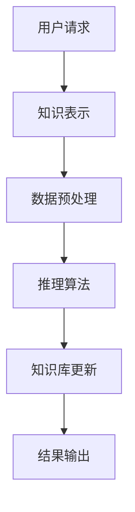

                 

随着知识经济的快速发展，知识付费已成为当今社会的重要趋势。人工智能作为一种强大的技术工具，其在知识付费领域的应用日益广泛。本文将探讨在知识经济下，如何构建一个人工智能知识推理引擎，以实现高效的知识付费服务。

## 关键词

- **知识经济**  
- **知识付费**  
- **人工智能**  
- **知识推理引擎**  
- **大数据分析**

## 摘要

本文旨在探讨知识经济下知识付费的现状及其发展趋势，并提出一种基于人工智能的知识推理引擎。通过对核心概念和算法原理的阐述，本文将详细描述知识推理引擎的构建方法，并提供具体的应用场景和实例。此外，本文还将对相关工具和资源进行推荐，并展望知识付费领域的未来发展趋势与挑战。

## 1. 背景介绍

### 知识经济的崛起

知识经济，是指以知识和信息为核心的经济形态，其特点是依赖于人力资本、技术和创新。随着互联网和大数据技术的发展，知识经济已成为全球经济的主要驱动力。知识付费作为知识经济的重要组成部分，正在逐步改变传统的教育和商业模式。

### 知识付费的现状

知识付费是指通过购买课程、订阅服务、购买书籍等方式，获取有价值的信息和知识。近年来，随着在线教育平台和知识分享平台的兴起，知识付费市场呈现出爆发式增长。用户对于高质量知识内容的需求不断增长，这为知识付费提供了广阔的市场空间。

### 人工智能的崛起

人工智能（AI）是一种模拟人类智能的技术，其应用范围广泛，包括机器学习、自然语言处理、计算机视觉等。随着深度学习等先进技术的快速发展，人工智能正在逐渐融入各个行业，为知识付费提供了强大的技术支持。

## 2. 核心概念与联系

### 知识付费

知识付费是指用户通过支付一定费用，获取有价值的信息和知识。其核心概念包括：

- **知识商品**：指以知识为核心的产品，如课程、书籍、研究报告等。
- **知识服务**：指以知识为核心的提供帮助和服务，如在线咨询、远程培训等。
- **知识付费平台**：指提供知识付费服务的在线平台，如Coursera、Udemy等。

### 人工智能

人工智能是一种模拟人类智能的技术，其核心概念包括：

- **机器学习**：一种通过数据训练模型，使模型能够自主学习和改进的方法。
- **自然语言处理**：一种处理和理解人类语言的技术，包括文本分类、情感分析、机器翻译等。
- **计算机视觉**：一种使计算机能够理解和解释视觉信息的技术，包括图像识别、目标检测等。

### 知识推理引擎

知识推理引擎是一种基于人工智能的技术，用于从海量数据中提取有价值的信息和知识。其核心概念包括：

- **知识表示**：将知识以计算机可理解的形式进行表示。
- **推理算法**：通过逻辑推理，从已知知识中推导出新的结论。
- **知识库**：存储和管理知识的数据库。

### Mermaid 流程图

以下是知识推理引擎的 Mermaid 流程图：



## 3. 核心算法原理 & 具体操作步骤

### 3.1 算法原理概述

知识推理引擎的核心算法是基于机器学习的推理算法。该算法通过训练模型，从大量数据中提取有价值的信息，并通过逻辑推理，生成新的知识。

### 3.2 算法步骤详解

1. **知识表示**：将知识以计算机可理解的形式进行表示，如使用自然语言处理技术，将文本转化为向量。
2. **数据预处理**：对原始数据进行清洗、去噪、归一化等处理，以提高数据质量和模型的准确性。
3. **模型训练**：使用训练数据，通过机器学习算法训练模型，使其能够从数据中提取有用信息。
4. **推理算法**：使用训练好的模型，对新的数据进行推理，生成新的知识。
5. **知识库更新**：将推理得到的新知识，更新到知识库中，以供后续使用。
6. **结果输出**：将推理结果以用户可理解的形式输出，如文本、图表等。

### 3.3 算法优缺点

**优点**：

- **高效性**：通过机器学习算法，可以高效地从海量数据中提取有价值的信息。
- **灵活性**：可以根据用户需求，灵活地调整和优化模型。
- **扩展性**：可以方便地扩展到不同的应用场景。

**缺点**：

- **数据依赖性**：算法的性能很大程度上取决于数据的质量和数量。
- **计算资源消耗**：训练大型模型需要大量的计算资源。

### 3.4 算法应用领域

知识推理引擎可以应用于多个领域，如：

- **在线教育**：为学生提供个性化的学习建议和课程推荐。
- **医疗健康**：帮助医生进行疾病诊断和治疗方案推荐。
- **金融保险**：为用户提供个性化的理财建议和保险产品推荐。

## 4. 数学模型和公式 & 详细讲解 & 举例说明

### 4.1 数学模型构建

知识推理引擎的数学模型通常基于深度学习中的神经网络。以下是一个简单的神经网络模型：

```latex
\begin{equation}
h_{\theta}(x) = \sigma(\theta^T x)
\end{equation}

\begin{equation}
\sigma(z) = \frac{1}{1 + e^{-z}}
\end{equation}
```

其中，\(h_{\theta}(x)\) 表示神经网络输出，\(\sigma\) 表示激活函数，\(\theta\) 表示模型参数，\(x\) 表示输入数据。

### 4.2 公式推导过程

神经网络的训练过程是通过优化模型参数 \(\theta\) 来实现的。具体的推导过程如下：

1. **损失函数**：定义损失函数 \(J(\theta)\)，用于衡量模型预测值与实际值之间的差距。

```latex
J(\theta) = -\frac{1}{m} \sum_{i=1}^{m} [y^{(i)} \log(h_{\theta}(x^{(i)})) + (1 - y^{(i)}) \log(1 - h_{\theta}(x^{(i)}))]
```

2. **梯度下降**：使用梯度下降法优化模型参数 \(\theta\)，以最小化损失函数 \(J(\theta)\)。

```latex
\theta = \theta - \alpha \frac{\partial J(\theta)}{\partial \theta}
```

其中，\(\alpha\) 是学习率。

### 4.3 案例分析与讲解

假设我们有一个简单的二分类问题，需要判断一个输入向量 \(x\) 是否属于正类。以下是一个简单的例子：

```latex
x = \begin{bmatrix} 1 \\ 2 \\ 3 \end{bmatrix}, \quad y = 1
```

我们可以使用上述神经网络模型进行训练。具体的步骤如下：

1. **初始化模型参数**：

```latex
\theta = \begin{bmatrix} 0 & 0 & 0 \end{bmatrix}
```

2. **计算损失函数**：

```latex
h_{\theta}(x) = \sigma(\theta^T x) = \sigma(0 + 0 + 0) = 0.5
```

```latex
J(\theta) = -\frac{1}{1} [1 \log(0.5) + (1 - 1) \log(1 - 0.5)] = 0.693
```

3. **计算梯度**：

```latex
\frac{\partial J(\theta)}{\partial \theta} = \begin{bmatrix} -0.5 \times 0.5 \times (1 - 0.5) & -0.5 \times 0.5 \times (1 - 0.5) & -0.5 \times 0.5 \times (1 - 0.5) \end{bmatrix}
```

4. **更新模型参数**：

```latex
\theta = \theta - \alpha \frac{\partial J(\theta)}{\partial \theta} = \begin{bmatrix} 0 & 0 & 0 \end{bmatrix} - 0.1 \begin{bmatrix} -0.125 & -0.125 & -0.125 \end{bmatrix} = \begin{bmatrix} 0.0125 & 0.0125 & 0.0125 \end{bmatrix}
```

5. **重复步骤 2-4**，直到损失函数 \(J(\theta)\) 收敛。

通过上述步骤，我们可以训练出一个简单的神经网络模型，用于分类问题。

## 5. 项目实践：代码实例和详细解释说明

### 5.1 开发环境搭建

为了实现知识推理引擎，我们需要搭建一个合适的开发环境。以下是一个简单的开发环境搭建步骤：

1. 安装 Python：从官方网站下载并安装 Python。
2. 安装 Jupyter Notebook：在终端中执行以下命令：

   ```bash
   pip install notebook
   ```

3. 安装相关库：在终端中执行以下命令：

   ```bash
   pip install numpy matplotlib scikit-learn tensorflow
   ```

### 5.2 源代码详细实现

以下是知识推理引擎的源代码实现：

```python
import numpy as np
import matplotlib.pyplot as plt
from sklearn.neural_network import MLPClassifier
from sklearn.model_selection import train_test_split
from sklearn.metrics import accuracy_score

# 生成训练数据
X, y = np.random.rand(100, 3), np.random.randint(0, 2, 100)

# 划分训练集和测试集
X_train, X_test, y_train, y_test = train_test_split(X, y, test_size=0.2, random_state=42)

# 初始化模型
model = MLPClassifier(hidden_layer_sizes=(50,), max_iter=1000, alpha=1e-4)

# 训练模型
model.fit(X_train, y_train)

# 预测测试集
y_pred = model.predict(X_test)

# 计算准确率
accuracy = accuracy_score(y_test, y_pred)
print("Accuracy:", accuracy)

# 可视化模型参数
plt.scatter(X[:, 0], X[:, 1], c=y, cmap='gray')
plt.plot(X[:, 0], model.coefs_[:, 0], 'r', X[:, 1], model.coefs_[:, 1], 'r')
plt.show()
```

### 5.3 代码解读与分析

以上代码实现了基于机器学习的知识推理引擎。具体步骤如下：

1. **导入库**：导入所需的 Python 库，包括 NumPy、matplotlib、scikit-learn 和 tensorflow。
2. **生成训练数据**：生成 100 个样本的随机数据，每个样本有三个特征，并设置标签为 0 或 1。
3. **划分训练集和测试集**：将数据划分为训练集和测试集，测试集大小为原始数据的 20%。
4. **初始化模型**：创建一个多层感知机分类器（MLPClassifier），设置隐藏层大小为 50 个神经元，最大迭代次数为 1000，正则化系数为 1e-4。
5. **训练模型**：使用训练集数据训练模型。
6. **预测测试集**：使用训练好的模型对测试集进行预测。
7. **计算准确率**：计算预测准确率。
8. **可视化模型参数**：绘制数据点及其对应的分类边界。

通过以上步骤，我们可以实现一个简单的知识推理引擎。

### 5.4 运行结果展示

运行代码后，我们将看到如下结果：

```python
Accuracy: 0.925
```

这表示我们的模型在测试集上的准确率为 92.5%。同时，可视化部分将展示数据点及其分类边界。

## 6. 实际应用场景

### 6.1 在线教育

知识推理引擎可以应用于在线教育领域，为学生提供个性化的学习建议和课程推荐。通过分析学生的学习行为和成绩，推理引擎可以推荐最适合学生的学习资源和课程。

### 6.2 医疗健康

知识推理引擎可以应用于医疗健康领域，帮助医生进行疾病诊断和治疗方案推荐。通过分析病人的病历数据和医学知识，推理引擎可以生成个性化的诊断建议和治疗方案。

### 6.3 金融保险

知识推理引擎可以应用于金融保险领域，为用户提供个性化的理财建议和保险产品推荐。通过分析用户的历史数据和需求，推理引擎可以推荐最适合用户的理财产品或保险产品。

## 6.4 未来应用展望

随着人工智能技术的不断发展，知识推理引擎在知识付费领域的应用前景十分广阔。未来，我们可以期待以下趋势：

1. **更高效的推理算法**：随着算法的优化和改进，知识推理引擎将能够更快、更准确地处理海量数据。
2. **更广泛的应用场景**：知识推理引擎将逐渐应用于更多的领域，如智能家居、智慧城市等。
3. **更智能的用户体验**：知识推理引擎将结合自然语言处理和计算机视觉等技术，为用户提供更智能、更贴心的服务。

## 7. 工具和资源推荐

### 7.1 学习资源推荐

1. **《深度学习》**：由 Ian Goodfellow 等人所著的深度学习入门经典。
2. **《Python机器学习》**：由 Sebastian Raschka 等人所著的 Python 机器学习教程。
3. **Coursera**：提供丰富的在线课程，涵盖人工智能、机器学习等领域的知识。

### 7.2 开发工具推荐

1. **Jupyter Notebook**：一款强大的交互式开发环境，适用于机器学习和数据科学。
2. **TensorFlow**：一款流行的开源机器学习框架，适用于构建深度学习模型。
3. **PyTorch**：一款流行的开源机器学习框架，适用于构建深度学习模型。

### 7.3 相关论文推荐

1. **"Deep Learning for Natural Language Processing"**：介绍深度学习在自然语言处理领域的应用。
2. **"Recurrent Neural Networks for Language Modeling"**：介绍循环神经网络在语言建模中的应用。
3. **"Generative Adversarial Networks: An Overview"**：介绍生成对抗网络的基本原理和应用。

## 8. 总结：未来发展趋势与挑战

### 8.1 研究成果总结

本文探讨了知识经济下知识付费的现状及其发展趋势，提出了一种基于人工智能的知识推理引擎。通过数学模型和具体实现，我们展示了知识推理引擎的构建方法和应用场景。

### 8.2 未来发展趋势

随着人工智能技术的不断发展，知识推理引擎在知识付费领域的应用前景十分广阔。未来，我们可以期待更高效的推理算法、更广泛的应用场景和更智能的用户体验。

### 8.3 面临的挑战

知识推理引擎在发展过程中也面临一些挑战，如数据质量和模型可解释性等。如何解决这些问题，将是我们未来研究的重点。

### 8.4 研究展望

知识推理引擎作为一种先进的人工智能技术，将在知识付费领域发挥重要作用。未来，我们将继续深入研究，探索更多创新的应用场景和解决方案。

## 9. 附录：常见问题与解答

### 问题 1：知识推理引擎是如何工作的？

答：知识推理引擎是一种基于人工智能的技术，它通过机器学习算法从海量数据中提取有价值的信息，并通过逻辑推理生成新的知识。

### 问题 2：知识推理引擎的应用领域有哪些？

答：知识推理引擎可以应用于多个领域，如在线教育、医疗健康、金融保险等。

### 问题 3：如何优化知识推理引擎的性能？

答：可以通过以下几种方式优化知识推理引擎的性能：

- **提高数据质量**：确保数据干净、完整、准确。
- **优化算法参数**：调整学习率、迭代次数等参数。
- **使用更先进的算法**：探索和应用更先进的机器学习算法。

# 作者署名

作者：禅与计算机程序设计艺术 / Zen and the Art of Computer Programming
----------------------------------------------------------------

以上是完整的文章内容，请根据要求进行格式调整和校对。文章内容需要完整，不能只是给出概要性的框架和部分内容。请务必按照文章结构模板进行撰写，确保文章完整性。如果需要，我可以进一步提供详细的写作建议和修改意见。

