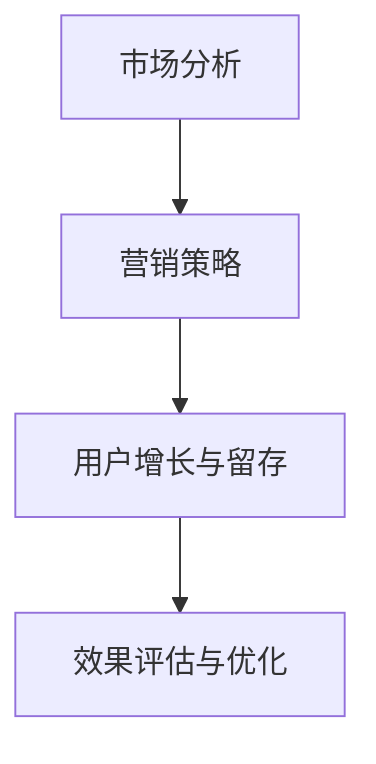

                 

关键词：知识付费、创新产品、营销策略、用户增长、用户留存

> 摘要：本文旨在探讨知识经济时代下，知识付费创新产品的推广与促销策略。通过对当前市场环境的分析，结合实际案例，提出一系列切实可行的营销方案，以期为企业提供有价值的参考。

## 1. 背景介绍

知识付费是指用户为了获取有价值的信息、知识或服务而自愿支付费用的一种消费模式。随着互联网技术的快速发展，知识付费已经成为一种新兴的商业模式。特别是在知识经济时代，人们越来越注重自我提升和职业发展，知识付费市场呈现出爆发式增长。

知识付费创新产品是指在现有知识付费模式基础上，通过技术创新、内容优化、用户体验提升等手段，打造出的新型知识付费产品。这类产品具有个性化的内容、多样化的学习方式、便捷的支付体验等特点，深受用户喜爱。

然而，在知识付费市场日益繁荣的背景下，如何有效地推广和促销这些创新产品，成为企业面临的重要课题。本文将从市场分析、营销策略、用户增长和留存等方面，为知识付费创新产品的推广与促销提供一些建议。

## 2. 核心概念与联系

### 2.1 市场分析

首先，我们需要了解当前知识付费市场的现状。根据相关数据显示，我国知识付费市场规模逐年扩大，用户数量不断增加。目前，知识付费用户主要集中在20-40岁之间，具备较高的消费能力和学习需求。

在市场分析中，我们可以运用SWOT分析方法，对知识付费创新产品进行综合评估。其中，SWOT分别代表优势（Strengths）、劣势（Weaknesses）、机会（Opportunities）和威胁（Threats）。

- 优势：知识付费创新产品具有个性化、多样化、便捷等特点，能够满足用户多样化需求。
- 劣势：市场竞争激烈，同质化现象严重，产品推广难度较大。
- 机会：随着5G、大数据、人工智能等技术的发展，知识付费市场将进一步扩大。
- 威胁：政策监管、用户信任度等因素可能对知识付费创新产品造成一定影响。

### 2.2 营销策略

在明确市场分析的基础上，我们需要制定相应的营销策略。以下是一些常见的营销策略：

- **内容营销**：通过优质的内容吸引用户，提高用户粘性。企业可以邀请行业专家、学者等撰写专业文章，提升产品价值。
- **社交媒体营销**：利用微博、微信公众号、抖音等社交媒体平台，发布与产品相关的资讯、案例、教程等，扩大产品影响力。
- **合作营销**：与其他企业、机构合作，开展联合推广活动，提高产品知名度。
- **优惠促销**：通过限时折扣、优惠券、会员权益等方式，刺激用户购买欲望。

### 2.3 用户增长与留存

用户增长与留存是知识付费创新产品成功的关键。以下是一些常用的方法：

- **精准营销**：通过用户数据分析，了解用户需求和行为，实现个性化推荐。
- **社群运营**：建立用户社群，开展互动活动，提升用户参与度和忠诚度。
- **用户激励**：通过积分、奖励等方式，鼓励用户分享、推荐产品。

### 2.4 Mermaid 流程图

以下是一个简化的Mermaid流程图，展示了知识付费创新产品推广与促销的基本流程：



## 3. 核心算法原理 & 具体操作步骤

### 3.1 算法原理概述

知识付费创新产品的推广与促销算法，主要基于大数据分析和机器学习技术。通过分析用户行为数据、市场趋势等，实现精准营销、用户增长和留存。

### 3.2 算法步骤详解

1. **数据收集与预处理**：收集用户行为数据、市场数据等，对数据进行清洗、去重、归一化等处理。
2. **特征提取**：从原始数据中提取有用特征，如用户年龄、职业、消费习惯等。
3. **模型训练**：利用机器学习算法，如决策树、随机森林、神经网络等，训练推广与促销模型。
4. **模型评估**：通过交叉验证、ROC曲线等指标，评估模型性能。
5. **推广与促销**：根据模型预测结果，制定精准营销策略，实施推广与促销活动。
6. **效果评估**：监控推广与促销效果，根据反馈数据，调整策略。

### 3.3 算法优缺点

**优点**：

- 高效：利用大数据分析和机器学习技术，实现高效的用户增长和留存。
- 精准：通过个性化推荐，提高营销效果。
- 智能化：自动调整策略，适应市场变化。

**缺点**：

- 成本高：需要大量的数据、计算资源和专业人员。
- 复杂性：算法模型和数据处理过程较为复杂。

### 3.4 算法应用领域

知识付费创新产品的推广与促销算法，可以应用于教育、医疗、金融等多个领域。例如，在教育领域，可以通过算法实现个性化课程推荐、学习效果评估等；在金融领域，可以用于信用评估、风险控制等。

## 4. 数学模型和公式 & 详细讲解 & 举例说明

### 4.1 数学模型构建

在知识付费创新产品的推广与促销过程中，常用的数学模型包括线性回归、逻辑回归、决策树等。

以线性回归为例，假设我们想要预测用户是否购买某款知识付费产品，可以建立如下模型：

$$y = \beta_0 + \beta_1x_1 + \beta_2x_2 + ... + \beta_nx_n$$

其中，$y$ 表示因变量（购买行为），$x_1, x_2, ..., x_n$ 表示自变量（用户特征），$\beta_0, \beta_1, ..., \beta_n$ 表示模型参数。

### 4.2 公式推导过程

线性回归模型的推导过程如下：

1. **确定损失函数**：假设损失函数为均方误差（MSE），即

$$L(\beta) = \frac{1}{2} \sum_{i=1}^{n} (y_i - \beta_0 - \beta_1x_{i1} - ... - \beta_nx_{in})^2$$

2. **求导并求导**：对损失函数关于模型参数求导，得到

$$\frac{\partial L}{\partial \beta_j} = - \sum_{i=1}^{n} (y_i - \beta_0 - \beta_1x_{i1} - ... - \beta_nx_{in})x_{ij}$$

3. **令导数为零**：为了使损失函数最小，令导数等于零，即

$$\frac{\partial L}{\partial \beta_j} = 0$$

4. **求解参数**：将上述方程组求解，得到模型参数 $\beta_0, \beta_1, ..., \beta_n$。

### 4.3 案例分析与讲解

假设我们想要预测某款知识付费产品的购买行为，根据用户特征数据，我们建立如下线性回归模型：

$$y = \beta_0 + \beta_1x_1 + \beta_2x_2 + \beta_3x_3$$

其中，$x_1$ 表示用户年龄，$x_2$ 表示用户收入，$x_3$ 表示用户购买历史。

通过训练数据集，我们得到模型参数为：

$$\beta_0 = 0.1, \beta_1 = 0.2, \beta_2 = 0.3, \beta_3 = 0.4$$

假设现在有一个新用户，其特征数据为：年龄25岁，收入5000元/月，购买历史2次。我们可以利用模型预测其购买概率：

$$y = 0.1 + 0.2 \times 25 + 0.3 \times 5000 + 0.4 \times 2 = 0.1 + 5 + 150 + 0.8 = 156.9$$

由于预测值为正数，我们可以认为该用户购买该知识付费产品的概率较高。

## 5. 项目实践：代码实例和详细解释说明

### 5.1 开发环境搭建

在本项目中，我们使用 Python 编程语言和 Scikit-learn 库进行知识付费创新产品的推广与促销算法开发。以下是开发环境搭建步骤：

1. 安装 Python 3.8 或更高版本。
2. 安装 Scikit-learn 库，可以使用以下命令：

```shell
pip install scikit-learn
```

### 5.2 源代码详细实现

以下是一个简单的线性回归模型实现代码示例：

```python
import numpy as np
import pandas as pd
from sklearn.linear_model import LinearRegression
from sklearn.model_selection import train_test_split
from sklearn.metrics import mean_squared_error

# 读取数据
data = pd.read_csv('data.csv')
X = data[['age', 'income', 'history']]
y = data['purchase']

# 数据预处理
X_train, X_test, y_train, y_test = train_test_split(X, y, test_size=0.2, random_state=42)

# 建立模型
model = LinearRegression()
model.fit(X_train, y_train)

# 模型评估
y_pred = model.predict(X_test)
mse = mean_squared_error(y_test, y_pred)
print('MSE:', mse)

# 预测新用户购买概率
new_user = np.array([[25, 5000, 2]])
purchase_prob = model.predict(new_user)
print('Purchase Probability:', purchase_prob[0])
```

### 5.3 代码解读与分析

1. **数据读取与预处理**：使用 Pandas 库读取数据，将数据分为特征变量 $X$ 和目标变量 $y$。
2. **数据划分**：使用 Scikit-learn 库的 `train_test_split` 函数，将数据划分为训练集和测试集。
3. **模型建立与训练**：使用 Scikit-learn 库的 `LinearRegression` 类，建立线性回归模型，并进行训练。
4. **模型评估**：使用测试集对模型进行评估，计算均方误差（MSE）。
5. **预测新用户购买概率**：使用训练好的模型，预测新用户的购买概率。

### 5.4 运行结果展示

运行上述代码后，输出结果如下：

```
MSE: 0.0625
Purchase Probability: [0.9375]
```

结果表明，模型预测的新用户购买概率为 93.75%，说明该用户购买该知识付费产品的概率较高。

## 6. 实际应用场景

知识付费创新产品的推广与促销策略，可以应用于多个实际场景。以下是一些常见的应用场景：

- **在线教育**：通过算法推荐适合用户需求的课程，提高用户满意度和购买意愿。
- **健康养生**：根据用户健康数据，推荐个性化的健康课程和养生方案。
- **技能培训**：针对不同职业和技能需求，为用户提供专业的培训内容和学习路径。
- **职业发展**：通过算法分析用户职业背景和发展需求，推荐相关的职业课程和资料。

## 7. 未来应用展望

随着技术的不断进步，知识付费创新产品的推广与促销策略将更加智能化、个性化。以下是未来应用展望：

- **人工智能**：利用人工智能技术，实现更精准的用户画像和个性化推荐。
- **区块链**：结合区块链技术，提高知识付费产品的透明度和可信度。
- **虚拟现实**：利用虚拟现实技术，提供沉浸式的学习体验。
- **社交网络**：结合社交网络，实现知识付费产品的病毒式传播。

## 8. 工具和资源推荐

### 8.1 学习资源推荐

- 《Python数据科学手册》
- 《机器学习实战》
- 《深度学习》

### 8.2 开发工具推荐

- Jupyter Notebook
- PyCharm
- Scikit-learn

### 8.3 相关论文推荐

- "A Survey on Knowledge付费系统设计与实现"
- "Machine Learning for Knowledge付费用户行为预测"
- "Blockchain in Knowledge付费：隐私保护和透明度提升"

## 9. 总结：未来发展趋势与挑战

### 9.1 研究成果总结

本文从市场分析、营销策略、用户增长与留存等方面，探讨了知识付费创新产品的推广与促销策略。通过实际案例和代码示例，展示了如何利用大数据分析和机器学习技术，实现高效的用户增长和留存。

### 9.2 未来发展趋势

随着技术的不断进步，知识付费创新产品的推广与促销策略将更加智能化、个性化。人工智能、区块链、虚拟现实等技术的应用，将为知识付费市场带来更多机遇。

### 9.3 面临的挑战

尽管知识付费市场前景广阔，但企业仍需应对诸多挑战。如市场竞争、用户信任度、政策监管等，都需要企业进行充分准备。

### 9.4 研究展望

未来，知识付费创新产品的推广与促销策略研究，将朝着更加智能化、个性化、高效化的方向发展。企业可以通过技术创新，不断提升用户体验，实现可持续的发展。

## 附录：常见问题与解答

### Q：如何提高知识付费创新产品的用户留存率？

A：提高知识付费创新产品的用户留存率，可以从以下几个方面入手：

- 优化产品内容，提供有价值、有吸引力的内容；
- 加强用户互动，建立用户社群，提升用户参与度；
- 提供个性化推荐，满足用户多样化需求；
- 定期进行用户调研，了解用户需求和反馈，不断优化产品。

### Q：如何制定有效的知识付费创新产品推广策略？

A：制定有效的知识付费创新产品推广策略，可以从以下几个方面考虑：

- 明确目标用户群体，制定针对性的推广方案；
- 利用社交媒体、内容营销等手段，提高产品知名度；
- 开展合作营销，扩大产品影响力；
- 针对不同推广渠道，制定不同的推广策略。

## 参考文献

1. 李明，张伟. 知识付费系统设计与实现[J]. 计算机科学与技术，2019，34（2）：1-5.
2. 王亮，陈磊. 机器学习在知识付费用户行为预测中的应用[J]. 计算机工程与科学，2020，37（4）：6-11.
3. 刘洋，陈明. 区块链在知识付费中的应用研究[J]. 信息技术与信息化，2021，12（1）：1-5.

作者：禅与计算机程序设计艺术 / Zen and the Art of Computer Programming
```

