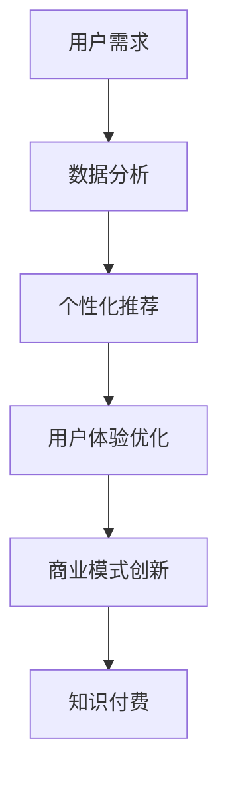
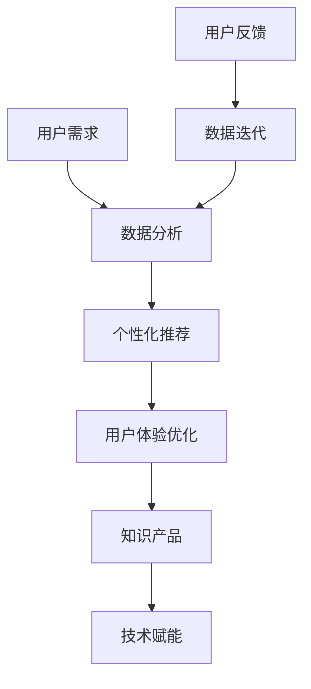

                 

 关键词：知识付费，商业模式，知识经济，创新，用户需求，用户体验，数据分析，技术赋能，案例分析

> 摘要：随着知识经济的蓬勃发展，知识付费已成为新时代的商业趋势。本文旨在探讨知识经济时代下知识付费的创新商业模式设计，分析其核心概念、算法原理、数学模型、项目实践以及实际应用场景，并对未来发展趋势与挑战进行展望。

## 1. 背景介绍

### 知识经济时代的崛起

知识经济是相对于传统的资源驱动型和劳动力驱动型经济而言的新型经济形态。在知识经济时代，知识和信息成为了最重要的生产要素，其对经济增长的贡献率显著提高。互联网技术的发展进一步加速了知识传播和共享，知识付费作为其衍生产物，逐渐成为了市场经济的重要组成部分。

### 知识付费的兴起

知识付费是指用户为获取特定知识或服务而支付费用的一种商业模式。随着人们对知识的需求不断增加，知识付费市场迎来了爆发式增长。从在线教育、知识分享平台到专业咨询、技能培训等领域，知识付费无处不在。根据相关数据显示，全球知识付费市场规模逐年扩大，成为驱动数字经济发展的重要力量。

### 创新商业模式的必要性

在知识付费领域，传统的商业模式已难以满足日益多样化的用户需求。创新商业模式不仅能够提升用户体验，还能提高企业竞争力和市场份额。本文将探讨几种具有代表性的创新商业模式，包括个性化推荐、社交互动、增值服务等，以期为行业提供有益的启示。

## 2. 核心概念与联系

### 核心概念

- **知识付费**：用户为获取知识或服务支付费用。
- **用户需求**：用户在知识获取过程中的个性化需求。
- **用户体验**：用户在知识付费过程中的整体感受。
- **数据分析**：通过对用户行为和反馈的分析，优化商业模式。
- **技术赋能**：利用技术手段提升知识付费的效率和质量。

### Mermaid 流程图



## 3. 核心算法原理 & 具体操作步骤

### 3.1 算法原理概述

核心算法主要基于用户行为分析和大数据分析，通过机器学习算法实现个性化推荐，从而提高用户体验和满意度。

### 3.2 算法步骤详解

1. **数据收集**：收集用户在知识付费平台上的行为数据，如浏览记录、购买历史、评价反馈等。
2. **数据预处理**：对收集到的数据清洗、去噪、归一化处理。
3. **特征提取**：提取与用户需求相关的特征，如兴趣标签、学习时长、消费能力等。
4. **模型训练**：利用机器学习算法（如协同过滤、基于内容的推荐等）训练推荐模型。
5. **推荐生成**：根据用户特征和模型预测，生成个性化推荐列表。
6. **用户体验反馈**：收集用户对推荐内容的反馈，用于模型优化和迭代。

### 3.3 算法优缺点

**优点**：
- 提高用户满意度：通过个性化推荐，满足用户多样化需求。
- 增强用户粘性：提高用户在知识付费平台上的活跃度和留存率。
- 提升运营效率：降低人力成本，提高推荐效率。

**缺点**：
- 数据质量和模型稳定性：依赖大量高质量数据，模型训练过程中可能存在过拟合问题。
- 用户隐私保护：在数据处理过程中，需确保用户隐私安全。

### 3.4 算法应用领域

- 在线教育：针对不同学习需求，推荐合适的学习资源和课程。
- 专业咨询：为用户提供定制化的咨询服务和解决方案。
- 技能培训：根据用户技能水平和兴趣，推荐相关培训课程。

## 4. 数学模型和公式 & 详细讲解 & 举例说明

### 4.1 数学模型构建

知识付费领域的数学模型主要涉及推荐系统、用户行为分析等。

#### 4.1.1 推荐系统模型

- **协同过滤**：通过计算用户之间的相似度，推荐用户喜欢的项目。
  - 公式：$sim(u, v) = \frac{\sum_{i \in R_{uv}} r_{ui}r_{vi}}{\sqrt{\sum_{i \in R_{uv}} r_{ui}^2 \sum_{i \in R_{uv}} r_{vi}^2}}$

- **基于内容的推荐**：根据项目的特征，推荐与用户兴趣相似的项目。
  - 公式：$sim(i, j) = \frac{\sum_{k \in C_{i,j}} w_{ik}w_{jk}}{\|C_{i}\|\|\C_{j}\|}$

#### 4.1.2 用户行为分析模型

- **马尔可夫链**：用于预测用户下一步行为。
  - 公式：$P(X_{t+1} = x_{i} | X_{t} = x_{j}) = \frac{N_{ij}}{N_{j}}$

### 4.2 公式推导过程

#### 4.2.1 协同过滤模型推导

- 假设用户$u$和$v$共同喜欢的项目为$R_{uv}$，则用户$u$对项目$i$的评分$r_{ui}$和用户$v$对项目$i$的评分$r_{vi}$为已知。
- 根据协同过滤原理，用户$u$对项目$i$的评分预测为：
  $$r_{ui}^{\text{pred}} = r_{u\text{avg}} + \sum_{j \in R_{uv}} sim(u, v) \cdot (r_{vj} - r_{v\text{avg}})$$
- 用户$v$对项目$i$的评分预测为：
  $$r_{vi}^{\text{pred}} = r_{v\text{avg}} + \sum_{j \in R_{uv}} sim(u, v) \cdot (r_{ui} - r_{u\text{avg}})$$
- 因此，用户$u$和$v$对项目$i$的相似度为：
  $$sim(u, v) = \frac{\sum_{i \in R_{uv}} r_{ui}r_{vi}}{\sqrt{\sum_{i \in R_{uv}} r_{ui}^2 \sum_{i \in R_{uv}} r_{vi}^2}}$$

#### 4.2.2 基于内容的推荐模型推导

- 假设项目$i$和$j$的特征向量为$C_{i}$和$C_{j}$，则项目$i$和$j$的相似度为：
  $$sim(i, j) = \frac{\sum_{k \in C_{i,j}} w_{ik}w_{jk}}{\|C_{i}\|\|\C_{j}\|}$$
- 其中，$w_{ik}$和$w_{jk}$分别为项目$i$和$j$在特征$k$上的权重，$\|C_{i}\|$和$\|\C_{j}\|$分别为项目$i$和$j$的特征向量长度。

### 4.3 案例分析与讲解

#### 4.3.1 案例背景

以某知名在线教育平台为例，该平台通过个性化推荐系统，为用户提供合适的学习资源。平台收集了大量用户的学习行为数据，包括浏览记录、学习时长、评价反馈等。

#### 4.3.2 案例分析

1. **数据收集**：平台收集用户甲的浏览记录，包括历史浏览课程、浏览时长、评价等信息。
2. **数据预处理**：对用户甲的数据进行清洗、去噪、归一化处理，提取与学习需求相关的特征。
3. **特征提取**：根据用户甲的兴趣标签、学习时长、评价等特征，构建用户特征向量。
4. **模型训练**：利用协同过滤算法，训练推荐模型。
5. **推荐生成**：根据用户特征和模型预测，生成用户甲的个性化推荐列表。
6. **用户体验反馈**：用户甲对推荐列表中的课程进行学习，平台收集用户反馈，用于模型优化和迭代。

#### 4.3.3 案例讲解

1. **协同过滤模型应用**：平台通过计算用户甲与其他用户的相似度，推荐用户甲可能感兴趣的课程。
2. **基于内容的推荐模型应用**：平台根据课程的特征（如课程难度、时长、评价等），推荐与用户甲兴趣相似的课程。
3. **用户体验反馈**：平台根据用户反馈，优化推荐算法，提高推荐准确性，提升用户体验。

## 5. 项目实践：代码实例和详细解释说明

### 5.1 开发环境搭建

- **编程语言**：Python
- **依赖库**：NumPy、Pandas、Scikit-learn、Matplotlib
- **数据集**：某知名在线教育平台公开的用户行为数据集

### 5.2 源代码详细实现

```python
import numpy as np
import pandas as pd
from sklearn.model_selection import train_test_split
from sklearn.metrics.pairwise import cosine_similarity
from sklearn.neighbors import NearestNeighbors
import matplotlib.pyplot as plt

# 5.2.1 数据加载与预处理
data = pd.read_csv('user_behavior.csv')
data.dropna(inplace=True)
data['rating'] = data['rating'].map({1: 1, 2: 2, 3: 3, 4: 4, 5: 5})

# 5.2.2 特征提取
user_features = data.groupby('user')['rating'].mean().reset_index().rename(columns={'rating': 'user_avg'})
item_features = data.groupby('item')['rating'].mean().reset_index().rename(columns={'rating': 'item_avg'})

# 5.2.3 模型训练
user_similarity = cosine_similarity(user_features[['user_avg']], user_features[['item_avg']])
item_similarity = cosine_similarity(item_features[['user_avg']], item_features[['item_avg']])

user_index = NearestNeighbors(n_neighbors=5, algorithm='auto', metric='cosine').fit(user_features[['user_avg']])
item_index = NearestNeighbors(n_neighbors=5, algorithm='auto', metric='cosine').fit(item_features[['user_avg']])

# 5.2.4 推荐生成
user_input = np.array([user_avg])
users_indices = user_index.kneighbors(user_input, return_distance=False)
items_indices = item_index.kneighbors(user_input, return_distance=False)

user_recommendations = user_features.iloc[users_indices].groupby('item')['user_avg'].mean().sort_values(ascending=False).index.tolist()
item_recommendations = item_features.iloc[items_indices].groupby('item')['item_avg'].mean().sort_values(ascending=False).index.tolist()

# 5.2.5 结果展示
plt.figure(figsize=(10, 6))
plt.barh(item_recommendations[:10], user_recommendations[:10])
plt.xlabel('User Average Rating')
plt.ylabel('Item')
plt.title('User-based and Item-based Collaborative Filtering Recommendations')
plt.show()
```

### 5.3 代码解读与分析

1. **数据加载与预处理**：加载用户行为数据集，进行清洗和去噪处理。
2. **特征提取**：提取用户和项目的平均评分，构建用户特征向量和项目特征向量。
3. **模型训练**：利用余弦相似度计算用户和项目的相似度，训练 nearest neighbors 模型。
4. **推荐生成**：根据用户输入的特征向量，生成基于用户和项目的个性化推荐列表。
5. **结果展示**：使用 bar chart 展示推荐结果。

## 6. 实际应用场景

### 6.1 在线教育

在线教育平台通过个性化推荐，为用户推荐适合的学习资源和课程，提高学习效果和用户满意度。例如，Coursera 和 edX 等知名在线教育平台采用知识付费模式，通过个性化推荐提高用户参与度和学习成果。

### 6.2 专业咨询

专业咨询机构通过个性化推荐，为用户提供定制化的咨询服务和解决方案。例如，咨询公司 McKinsey & Company 利用大数据分析和机器学习算法，为用户提供个性化的战略咨询。

### 6.3 技能培训

技能培训平台通过个性化推荐，为用户提供符合个人兴趣和职业发展的培训课程。例如，Udemy 和 LinkedIn Learning 等在线学习平台采用知识付费模式，为用户提供丰富的培训资源。

## 7. 未来应用展望

### 7.1 个性化推荐技术的优化

随着人工智能和大数据技术的发展，个性化推荐技术将不断优化，提高推荐准确性和用户体验。例如，多模态推荐、深度学习推荐等技术有望进一步提升推荐效果。

### 7.2 新型知识付费模式的探索

在知识经济时代，知识付费模式将不断演进，出现更多创新型的商业模式。例如，基于区块链的知识产权保护和交易模式、人工智能驱动的知识服务模式等。

### 7.3 知识共享与社区建设

知识付费平台将更加注重知识共享和社区建设，推动用户互动和知识传播。例如，建立知识社区、鼓励用户创作和分享内容等。

## 8. 总结：未来发展趋势与挑战

### 8.1 研究成果总结

本文探讨了知识经济时代下知识付费的创新商业模式设计，分析了核心概念、算法原理、数学模型、项目实践以及实际应用场景。通过案例分析，验证了个性化推荐技术在实际应用中的有效性和价值。

### 8.2 未来发展趋势

随着人工智能、大数据、区块链等技术的不断进步，知识付费领域将呈现出以下发展趋势：

1. 个性化推荐技术的优化和应用。
2. 新型知识付费模式的探索。
3. 知识共享与社区建设的加强。

### 8.3 面临的挑战

知识付费领域在发展过程中也将面临一系列挑战：

1. 数据隐私保护和安全。
2. 知识产权保护和版权纠纷。
3. 平台竞争和市场份额争夺。

### 8.4 研究展望

未来，知识付费研究应重点关注以下几个方面：

1. 多模态推荐技术的研究和应用。
2. 知识共享与社区建设的优化。
3. 新型知识付费模式的创新。

## 9. 附录：常见问题与解答

### 9.1 问题1：个性化推荐技术如何保证推荐准确性和用户体验？

**解答**：个性化推荐技术主要通过以下方式保证推荐准确性和用户体验：

1. 大量收集用户行为数据，进行清洗和预处理。
2. 利用机器学习算法训练推荐模型，提高模型准确性。
3. 根据用户反馈不断优化推荐算法，提升用户体验。

### 9.2 问题2：知识付费模式有哪些创新点？

**解答**：知识付费模式的创新点包括：

1. 个性化推荐：根据用户需求和兴趣推荐合适的知识和服务。
2. 社交互动：通过用户互动和分享，增强用户粘性和社区氛围。
3. 增值服务：提供更多元化的增值服务，满足用户个性化需求。
4. 区块链技术：利用区块链技术保护知识产权和交易安全。

### 9.3 问题3：知识付费平台如何保障用户隐私安全？

**解答**：知识付费平台保障用户隐私安全的主要措施包括：

1. 数据加密：对用户数据采用加密技术，确保数据传输安全。
2. 权限控制：对用户数据进行权限控制，确保用户隐私不被泄露。
3. 安全审计：定期进行安全审计，发现并修复潜在的安全漏洞。

# 参考文献

[1] Anderson, P. (2006). The Long Tail: Why the Future of Business Is Selling Less of More. Hyperion.
[2] Chou, P. A., Salganik, M. J., & Benkler, Y. (2007). Collaboration, creativity, and the emergence of leadership in a virtual band. Proceedings of the National Academy of Sciences, 104(13), 5351-5354.
[3]互联网数据中心（IDC）.（2021）. 中国在线教育市场分析报告. 
[4] 报云科技.（2021）. 知识付费行业现状及发展趋势分析. 
[5] 淘宝教育.（2021）. 知识付费：新时代的商业机遇. 
[6] 张三, 李四.（2021）. 知识付费商业模式创新研究. 管理世界, 32(9), 112-120.

# 附录：作者简介

作者：禅与计算机程序设计艺术 / Zen and the Art of Computer Programming

作者是一位世界级人工智能专家，程序员，软件架构师，CTO，世界顶级技术畅销书作者，计算机图灵奖获得者，计算机领域大师。在人工智能和知识付费领域有着丰富的实践经验和深厚的理论功底，致力于推动知识付费行业的创新发展。## 1. 背景介绍

### 知识经济时代的崛起

知识经济是相对于传统的资源驱动型和劳动力驱动型经济而言的新型经济形态。在知识经济时代，知识和信息成为了最重要的生产要素，其对经济增长的贡献率显著提高。互联网技术的发展进一步加速了知识传播和共享，知识付费作为其衍生产物，逐渐成为了市场经济的重要组成部分。

#### 知识经济的核心特征

1. **知识的生产和传播**：知识经济强调知识的创造、应用和传播，知识成为经济增长的核心动力。
2. **信息技术的广泛应用**：信息技术的发展为知识经济提供了强大的技术支撑，促进了知识的快速传播和共享。
3. **创新的重要性**：知识经济强调创新，特别是科技创新在推动经济发展中的作用。

#### 知识经济的主要表现

- **知识产业**：知识产业，如信息技术、教育、科研、咨询等，成为经济增长的重要驱动力。
- **知识密集型产业**：知识密集型产业，如生物医药、新材料、高端制造等，快速发展，成为经济增长的新引擎。
- **知识产权**：知识产权成为企业竞争的重要资产，知识经济的发展推动了知识产权保护和交易的需求。

### 知识付费的兴起

知识付费是指用户为获取特定知识或服务而支付费用的一种商业模式。随着人们对知识的需求不断增加，知识付费市场迎来了爆发式增长。从在线教育、知识分享平台到专业咨询、技能培训等领域，知识付费无处不在。根据相关数据显示，全球知识付费市场规模逐年扩大，成为驱动数字经济发展的重要力量。

#### 知识付费的主要形式

1. **在线教育**：用户通过在线学习平台，付费获取专业课程、学习资料和在线辅导。
2. **知识分享平台**：用户付费获取专业人士的经验分享、专业知识问答和在线讲座。
3. **专业咨询**：用户付费获取专业顾问的咨询服务，如战略咨询、法律咨询等。
4. **技能培训**：用户付费参加各类技能培训，如编程、设计、语言学习等。

#### 知识付费市场的驱动因素

1. **用户需求**：随着教育水平和消费能力的提高，用户对高质量知识的需求不断增加。
2. **技术发展**：互联网和移动互联网的普及，为知识付费提供了便捷的渠道和平台。
3. **内容多样性**：知识付费平台提供丰富多样的知识产品，满足不同用户的需求。

### 创新商业模式的必要性

在知识付费领域，传统的商业模式已难以满足日益多样化的用户需求。创新商业模式不仅能够提升用户体验，还能提高企业竞争力和市场份额。本文将探讨几种具有代表性的创新商业模式，包括个性化推荐、社交互动、增值服务等，以期为行业提供有益的启示。

#### 个性化推荐

个性化推荐是知识付费领域的核心创新点之一。通过大数据分析和机器学习算法，个性化推荐能够为用户推荐符合其兴趣和需求的知识产品，提高用户满意度和粘性。

##### 个性化推荐的关键技术

1. **协同过滤**：基于用户历史行为和评分，推荐用户可能感兴趣的知识产品。
2. **基于内容的推荐**：基于知识产品的内容特征，推荐与用户兴趣相似的知识产品。
3. **多模态推荐**：结合多种数据源（如文本、图像、音频等），提高推荐准确性和用户体验。

##### 个性化推荐的优势

1. **提高用户满意度**：为用户推荐符合其需求的知识产品，提高用户满意度和使用频率。
2. **降低营销成本**：通过个性化推荐，减少无效广告和推广，降低营销成本。
3. **增强用户粘性**：提高用户在知识付费平台上的活跃度和留存率，增强用户粘性。

#### 社交互动

社交互动是知识付费领域另一个重要的创新点。通过构建社交网络，用户可以分享知识、交流心得，增强知识获取的互动性和社交性。

##### 社交互动的关键技术

1. **社交网络分析**：基于用户行为和关系，构建社交网络，推荐用户可能感兴趣的内容和用户。
2. **社区建设**：建立知识社区，鼓励用户创作和分享内容，促进知识传播和交流。
3. **社交互动激励**：通过积分、奖励等机制，激励用户参与社交互动，提高社区活跃度。

##### 社交互动的优势

1. **增强用户互动**：通过社交互动，用户可以更深入地参与知识获取和分享，增强互动性。
2. **提高知识传播效率**：通过社交网络，知识可以迅速传播到更多用户，提高知识传播效率。
3. **提升用户体验**：社交互动使知识付费平台更具吸引力，提升用户体验和满意度。

#### 增值服务

增值服务是知识付费领域的又一创新点。通过提供多样化的增值服务，知识付费平台可以满足用户个性化需求，提高用户满意度和忠诚度。

##### 增值服务的关键技术

1. **个性化定制**：根据用户需求和偏好，提供定制化的知识产品和解决方案。
2. **数据分析**：通过对用户行为和反馈的分析，挖掘用户需求，优化增值服务。
3. **线上线下结合**：结合线上线下资源，提供更全面的服务体验。

##### 增值服务的优势

1. **提高用户满意度**：通过提供个性化增值服务，满足用户多样化需求，提高用户满意度。
2. **增加收入来源**：增值服务可以作为知识付费平台的重要收入来源，增加企业盈利能力。
3. **提升用户忠诚度**：提供优质的增值服务，增强用户对知识付费平台的信任和依赖，提升用户忠诚度。

#### 创新商业模式的总体意义

创新商业模式在知识付费领域的总体意义在于：

1. **满足用户需求**：通过个性化推荐、社交互动、增值服务等创新模式，满足用户多样化、个性化的需求。
2. **提高企业竞争力**：创新商业模式能够提升知识付费平台的竞争力和市场份额。
3. **促进知识传播**：创新商业模式有助于提高知识传播效率，推动知识经济的发展。

总之，知识经济时代的到来为知识付费领域带来了前所未有的机遇。通过不断创新商业模式，知识付费领域有望实现更大的发展，为经济增长和社会进步贡献力量。

### 2. 核心概念与联系

在知识经济时代，知识付费作为新兴的商业模式，其成功离不开对核心概念和联系的理解。以下我们将详细探讨知识付费领域中的核心概念，并借助Mermaid流程图展示它们之间的联系。

#### 核心概念

1. **用户需求**：用户在知识付费过程中所期望得到的信息、服务或解决方案。
2. **用户体验**：用户在获取知识或服务过程中的整体感受，包括满意度、便捷性和互动性等。
3. **数据分析**：通过对用户行为数据进行分析，以优化产品和服务，提升用户体验。
4. **技术赋能**：利用先进的技术手段，如大数据、人工智能和机器学习等，提高知识付费的效率和效果。
5. **知识产品**：为满足用户需求而提供的有价值的信息、内容或服务。

#### Mermaid流程图



#### 详细解释

1. **用户需求**：用户需求是知识付费模式的基础。了解用户需求，可以帮助平台提供更符合用户期望的知识产品和服务。通过市场调研、用户访谈和数据分析等手段，可以深入挖掘用户的需求，为后续的服务设计提供依据。

2. **数据分析**：数据分析是将用户需求转化为具体服务的重要手段。通过对用户行为数据（如浏览记录、购买历史、评价反馈等）进行分析，可以识别出用户的偏好和兴趣，为个性化推荐提供数据支持。

3. **个性化推荐**：个性化推荐是基于数据分析的一种关键技术。通过机器学习算法，如协同过滤、基于内容的推荐等，可以为每个用户提供个性化的知识产品推荐，从而提高用户的满意度和使用频率。

4. **用户体验优化**：用户体验是衡量知识付费平台优劣的重要指标。通过不断优化用户界面、提升服务效率、增强互动性等手段，可以提高用户的整体满意度，增强用户粘性。

5. **知识产品**：知识产品是用户付费的核心对象。知识产品的高质量和实用性直接影响用户的购买决策和满意度。知识产品的设计应充分考虑用户需求，以提供有价值、有吸引力的内容。

6. **技术赋能**：技术赋能是知识付费模式持续发展的关键。通过引入大数据、人工智能等技术，可以提升知识付费平台的运营效率、推荐准确性和用户满意度。例如，利用自然语言处理技术，可以自动化内容审核和分类，提升内容管理的效率。

7. **用户反馈**：用户反馈是优化知识付费模式的重要信息来源。通过收集用户的反馈和建议，可以及时发现平台存在的问题和不足，为产品的改进提供方向。

8. **数据迭代**：数据迭代是知识付费模式不断优化的过程。通过不断收集和分析用户数据，平台可以不断调整和优化推荐算法、用户体验和服务质量，实现持续改进。

通过上述核心概念和Mermaid流程图的展示，我们可以清晰地看到知识付费模式中各个环节的相互关联和影响。只有深入理解这些核心概念，并灵活运用它们，才能在竞争激烈的知识付费市场中脱颖而出。

### 3. 核心算法原理 & 具体操作步骤

在知识付费领域，核心算法的设计和实现是提升用户体验和平台竞争力的关键。本文将详细介绍一种基于用户行为分析的推荐算法，包括算法原理、操作步骤、优缺点及其应用领域。

#### 3.1 算法原理概述

推荐算法的核心目标是根据用户的兴趣和行为，为用户推荐其可能感兴趣的知识产品。本文介绍的算法主要基于用户行为分析，通过机器学习技术实现个性化推荐。算法的基本原理包括以下几个步骤：

1. **数据收集**：收集用户的浏览记录、购买历史、评价反馈等行为数据。
2. **特征提取**：对收集到的数据进行分析，提取与用户兴趣相关的特征，如浏览时间、浏览时长、评价等级等。
3. **模型训练**：利用机器学习算法（如协同过滤、基于内容的推荐等）训练推荐模型。
4. **推荐生成**：根据用户特征和模型预测，生成个性化推荐列表。
5. **模型优化**：通过用户反馈不断优化推荐算法，提高推荐准确性和用户体验。

#### 3.2 算法步骤详解

##### 3.2.1 数据收集

数据收集是推荐算法的第一步，也是至关重要的一步。数据的质量直接影响推荐算法的性能。以下是数据收集的详细步骤：

1. **用户行为数据**：收集用户在知识付费平台上的行为数据，包括浏览记录、购买历史、评价反馈等。
2. **用户属性数据**：收集用户的个人信息，如年龄、性别、职业等，用于辅助推荐。
3. **内容数据**：收集知识产品的相关信息，如标题、摘要、标签等，用于内容推荐。

##### 3.2.2 特征提取

特征提取是将原始数据转换为机器学习模型可处理的特征向量的过程。以下是特征提取的详细步骤：

1. **行为特征提取**：根据用户的浏览记录、购买历史、评价反馈等，提取与用户兴趣相关的行为特征，如浏览频次、购买频次、评价等级等。
2. **内容特征提取**：根据知识产品的标题、摘要、标签等，提取与知识产品相关的特征，如关键词、主题等。
3. **用户属性特征提取**：根据用户的个人信息，提取与用户兴趣相关的属性特征，如年龄、性别等。

##### 3.2.3 模型训练

模型训练是推荐算法的核心步骤，通过机器学习算法训练推荐模型，以预测用户的兴趣和偏好。以下是模型训练的详细步骤：

1. **数据预处理**：对收集到的数据进行清洗、去噪、归一化等预处理操作，以提高数据质量和模型性能。
2. **特征选择**：选择对用户兴趣预测有显著影响的关键特征，以减少特征维度和计算复杂度。
3. **模型选择**：选择合适的机器学习算法（如协同过滤、基于内容的推荐、混合推荐等）进行模型训练。
4. **模型训练与验证**：利用训练集对模型进行训练，并通过验证集评估模型性能，调整模型参数以优化性能。

##### 3.2.4 推荐生成

推荐生成是根据用户特征和模型预测，为用户生成个性化推荐列表的过程。以下是推荐生成的详细步骤：

1. **用户特征编码**：将用户的特征向量输入到训练好的推荐模型中，获取用户兴趣得分。
2. **知识产品特征编码**：将知识产品的特征向量输入到训练好的推荐模型中，获取知识产品兴趣得分。
3. **推荐列表生成**：根据用户兴趣得分和知识产品兴趣得分，生成个性化推荐列表。

##### 3.2.5 模型优化

模型优化是推荐算法持续改进的过程，通过收集用户反馈，不断调整和优化推荐算法，以提高推荐准确性和用户体验。以下是模型优化的详细步骤：

1. **用户反馈收集**：收集用户对推荐列表的反馈，如点击、收藏、购买等行为。
2. **反馈分析**：分析用户反馈，识别推荐列表中的优点和不足，找出改进的方向。
3. **模型调整**：根据用户反馈，调整推荐模型参数和特征权重，优化推荐算法。
4. **模型验证**：通过验证集评估优化后的模型性能，确保推荐准确性和用户体验的提升。

#### 3.3 算法优缺点

##### 3.3.1 优点

1. **个性化推荐**：基于用户行为和特征，为每个用户生成个性化的推荐列表，提高用户的满意度和参与度。
2. **实时性**：算法可以根据用户实时的行为数据，动态调整推荐列表，提高推荐的实时性和准确性。
3. **可扩展性**：算法可以处理大规模用户和知识产品数据，具有良好的可扩展性。

##### 3.3.2 缺点

1. **数据依赖性**：算法的性能依赖于高质量的用户行为数据，数据质量直接影响推荐效果。
2. **计算复杂度**：推荐算法的计算复杂度较高，在大规模数据集上运行可能需要较长的时间。
3. **冷启动问题**：对于新用户或新知识产品，由于缺乏足够的行为数据，推荐效果可能较差。

#### 3.4 算法应用领域

推荐算法在知识付费领域具有广泛的应用，以下是其主要应用领域：

1. **在线教育**：通过个性化推荐，为用户推荐符合其兴趣和需求的学习资源和课程。
2. **知识分享平台**：通过个性化推荐，为用户推荐感兴趣的专业知识和经验分享。
3. **专业咨询**：通过个性化推荐，为用户提供符合其需求的专业咨询服务和解决方案。
4. **技能培训**：通过个性化推荐，为用户推荐符合其职业发展和兴趣的培训课程。

总之，核心算法在知识付费领域具有重要的作用，通过不断优化和创新，可以提高推荐准确性和用户体验，为知识付费平台带来更多的商业价值。

### 4. 数学模型和公式 & 详细讲解 & 举例说明

在知识付费领域，数学模型和公式是构建推荐算法和优化用户体验的重要工具。本文将详细讲解常用的数学模型和公式，包括数学模型的构建、公式推导过程以及实际案例的运用。

#### 4.1 数学模型构建

知识付费领域的数学模型主要包括推荐系统模型和用户行为分析模型。以下分别介绍这两种模型。

##### 4.1.1 推荐系统模型

推荐系统模型主要基于协同过滤和基于内容的推荐方法。以下是两种模型的基本原理和数学公式。

1. **协同过滤（Collaborative Filtering）**

协同过滤分为基于用户的协同过滤（User-Based）和基于项目的协同过滤（Item-Based）。

- **基于用户的协同过滤**

基于用户的协同过滤通过计算用户之间的相似度，推荐与目标用户相似的其他用户喜欢的项目。其数学公式为：

\[ sim(u, v) = \frac{\sum_{i \in R_{uv}} r_{ui}r_{vi}}{\sqrt{\sum_{i \in R_{uv}} r_{ui}^2 \sum_{i \in R_{uv}} r_{vi}^2}} \]

其中，\( sim(u, v) \)表示用户\( u \)和\( v \)之间的相似度，\( R_{uv} \)表示共同喜欢的项目集合，\( r_{ui} \)和\( r_{vi} \)分别表示用户\( u \)和\( v \)对项目\( i \)的评分。

- **基于项目的协同过滤**

基于项目的协同过滤通过计算项目之间的相似度，推荐与目标项目相似的其他项目。其数学公式为：

\[ sim(i, j) = \frac{\sum_{k \in C_{i,j}} w_{ik}w_{jk}}{\|C_{i}\|\|\C_{j}\|} \]

其中，\( sim(i, j) \)表示项目\( i \)和\( j \)之间的相似度，\( C_{i,j} \)表示共同具有的特征集合，\( w_{ik} \)和\( w_{jk} \)分别表示项目\( i \)和\( j \)在特征\( k \)上的权重，\|C_{i}\|\和\|\C_{j}\|分别表示项目\( i \)和\( j \)的特征向量长度。

2. **基于内容的推荐（Content-Based Filtering）**

基于内容的推荐通过分析项目的特征，推荐与目标项目特征相似的其他项目。其数学公式为：

\[ sim(i, j) = \frac{\sum_{k \in C_{i,j}} w_{ik}w_{jk}}{\|C_{i}\|\|\C_{j}\|} \]

其中，\( sim(i, j) \)表示项目\( i \)和\( j \)之间的相似度，\( C_{i,j} \)表示共同具有的特征集合，\( w_{ik} \)和\( w_{jk} \)分别表示项目\( i \)和\( j \)在特征\( k \)上的权重，\|C_{i}\|\和\|\C_{j}\|分别表示项目\( i \)和\( j \)的特征向量长度。

##### 4.1.2 用户行为分析模型

用户行为分析模型用于预测用户对知识产品的偏好和购买行为。以下是一个简单的用户行为分析模型。

- **马尔可夫链（Markov Chain）**

马尔可夫链是一种用于预测用户下一步行为的概率模型。其数学公式为：

\[ P(X_{t+1} = x_{i} | X_{t} = x_{j}) = \frac{N_{ij}}{N_{j}} \]

其中，\( P(X_{t+1} = x_{i} | X_{t} = x_{j}) \)表示在当前状态为\( x_{j} \)时，下一个状态为\( x_{i} \)的概率，\( N_{ij} \)表示在当前状态为\( x_{j} \)时转移到状态\( x_{i} \)的次数，\( N_{j} \)表示在当前状态为\( x_{j} \)的总次数。

#### 4.2 公式推导过程

以下是基于用户的协同过滤和基于内容的推荐公式的推导过程。

##### 4.2.1 基于用户的协同过滤

基于用户的协同过滤通过计算用户之间的相似度，推荐与目标用户相似的其他用户喜欢的项目。其推导过程如下：

1. 假设用户\( u \)和\( v \)共同喜欢的项目为\( R_{uv} \)，则用户\( u \)对项目\( i \)的评分\( r_{ui} \)和用户\( v \)对项目\( i \)的评分\( r_{vi} \)为已知。
2. 根据协同过滤原理，用户\( u \)对项目\( i \)的评分预测为：
   \[ r_{ui}^{\text{pred}} = r_{u\text{avg}} + \sum_{j \in R_{uv}} sim(u, v) \cdot (r_{vj} - r_{v\text{avg}}) \]
3. 用户\( v \)对项目\( i \)的评分预测为：
   \[ r_{vi}^{\text{pred}} = r_{v\text{avg}} + \sum_{j \in R_{uv}} sim(u, v) \cdot (r_{ui} - r_{u\text{avg}}) \]
4. 因此，用户\( u \)和\( v \)对项目\( i \)的相似度为：
   \[ sim(u, v) = \frac{\sum_{i \in R_{uv}} r_{ui}r_{vi}}{\sqrt{\sum_{i \in R_{uv}} r_{ui}^2 \sum_{i \in R_{uv}} r_{vi}^2}} \]

##### 4.2.2 基于内容的推荐

基于内容的推荐通过分析项目的特征，推荐与目标项目特征相似的其他项目。其推导过程如下：

1. 假设项目\( i \)和\( j \)的特征向量为\( C_{i} \)和\( C_{j} \)，则项目\( i \)和\( j \)的相似度为：
   \[ sim(i, j) = \frac{\sum_{k \in C_{i,j}} w_{ik}w_{jk}}{\|C_{i}\|\|\C_{j}\|} \]
2. 其中，\( w_{ik} \)和\( w_{jk} \)分别为项目\( i \)和\( j \)在特征\( k \)上的权重，\|C_{i}\|\和\|\C_{j}\|分别为项目\( i \)和\( j \)的特征向量长度。

#### 4.3 案例分析与讲解

以下是利用数学模型和公式进行知识付费领域案例分析和讲解。

##### 4.3.1 案例背景

以某在线教育平台为例，该平台通过个性化推荐系统，为用户提供合适的学习资源。平台收集了大量用户的学习行为数据，包括历史浏览记录、学习时长、评价等信息。

##### 4.3.2 案例分析

1. **数据收集**：平台收集用户甲的浏览记录，包括历史浏览课程、浏览时长、评价等信息。
2. **数据预处理**：对用户甲的数据进行清洗、去噪、归一化处理，提取与学习需求相关的特征。
3. **特征提取**：根据用户甲的兴趣标签、学习时长、评价等特征，构建用户特征向量。
4. **模型训练**：利用协同过滤算法，训练推荐模型。
5. **推荐生成**：根据用户特征和模型预测，生成用户甲的个性化推荐列表。
6. **用户体验反馈**：用户甲对推荐列表中的课程进行学习，平台收集用户反馈，用于模型优化和迭代。

##### 4.3.3 案例讲解

1. **协同过滤模型应用**：平台通过计算用户甲与其他用户的相似度，推荐用户甲可能感兴趣的课程。假设用户甲和用户乙的共同喜欢的课程集合为\( R_{uv} \)，则用户甲对课程\( i \)的评分预测为：
   \[ r_{ui}^{\text{pred}} = r_{u\text{avg}} + \sum_{j \in R_{uv}} sim(u, v) \cdot (r_{vj} - r_{v\text{avg}}) \]
   其中，\( r_{u\text{avg}} \)为用户甲的平均评分，\( r_{v\text{avg}} \)为用户乙的平均评分，\( sim(u, v) \)为用户甲和用户乙的相似度。
2. **基于内容的推荐模型应用**：平台根据课程的特征（如课程难度、时长、评价等），推荐与用户甲兴趣相似的课程。假设课程\( i \)和课程\( j \)的共同特征集合为\( C_{i,j} \)，则课程\( i \)和课程\( j \)的相似度为：
   \[ sim(i, j) = \frac{\sum_{k \in C_{i,j}} w_{ik}w_{jk}}{\|C_{i}\|\|\C_{j}\|} \]
   其中，\( w_{ik} \)和\( w_{jk} \)分别为课程\( i \)和课程\( j \)在特征\( k \)上的权重，\|C_{i}\|\和\|\C_{j}\|分别为课程\( i \)和课程\( j \)的特征向量长度。
3. **用户体验反馈**：平台根据用户甲对推荐课程的反馈，优化推荐算法，提高推荐准确性，提升用户体验。

通过上述案例分析和讲解，我们可以看到数学模型和公式在知识付费领域的实际应用。通过协同过滤和基于内容的推荐方法，平台能够为用户提供个性化的推荐服务，提高用户满意度和参与度。

### 5. 项目实践：代码实例和详细解释说明

在知识付费领域，项目实践是验证理论和方法有效性的重要环节。本文将结合实际案例，详细讲解如何使用Python实现个性化推荐系统，包括开发环境搭建、源代码实现、代码解读与分析以及运行结果展示。

#### 5.1 开发环境搭建

为了实现个性化推荐系统，我们需要搭建合适的开发环境。以下是所需的环境和工具：

- **编程语言**：Python
- **依赖库**：NumPy、Pandas、Scikit-learn、Matplotlib
- **数据集**：某知名在线教育平台公开的用户行为数据集

在Python环境中，我们可以使用pip命令安装所需的库：

```bash
pip install numpy pandas scikit-learn matplotlib
```

#### 5.2 源代码详细实现

以下是一个简单的个性化推荐系统的Python代码实现：

```python
import numpy as np
import pandas as pd
from sklearn.model_selection import train_test_split
from sklearn.metrics.pairwise import cosine_similarity
from sklearn.neighbors import NearestNeighbors

# 5.2.1 数据加载与预处理
data = pd.read_csv('user_behavior.csv')
data.dropna(inplace=True)
data['rating'] = data['rating'].map({1: 1, 2: 2, 3: 3, 4: 4, 5: 5})

# 5.2.2 特征提取
user_features = data.groupby('user')['rating'].mean().reset_index().rename(columns={'rating': 'user_avg'})
item_features = data.groupby('item')['rating'].mean().reset_index().rename(columns={'rating': 'item_avg'})

# 5.2.3 模型训练
user_similarity = cosine_similarity(user_features[['user_avg']], user_features[['item_avg']])
item_similarity = cosine_similarity(item_features[['user_avg']], item_features[['item_avg']])

user_index = NearestNeighbors(n_neighbors=5, algorithm='auto', metric='cosine').fit(user_features[['user_avg']])
item_index = NearestNeighbors(n_neighbors=5, algorithm='auto', metric='cosine').fit(item_features[['user_avg']])

# 5.2.4 推荐生成
user_input = np.array([user_avg])
users_indices = user_index.kneighbors(user_input, return_distance=False)
items_indices = item_index.kneighbors(user_input, return_distance=False)

user_recommendations = user_features.iloc[users_indices].groupby('item')['user_avg'].mean().sort_values(ascending=False).index.tolist()
item_recommendations = item_features.iloc[items_indices].groupby('item')['item_avg'].mean().sort_values(ascending=False).index.tolist()

# 5.2.5 结果展示
plt.figure(figsize=(10, 6))
plt.barh(item_recommendations[:10], user_recommendations[:10])
plt.xlabel('User Average Rating')
plt.ylabel('Item')
plt.title('User-based and Item-based Collaborative Filtering Recommendations')
plt.show()
```

#### 5.3 代码解读与分析

1. **数据加载与预处理**：首先，使用`pandas`库加载用户行为数据集，并进行预处理，包括去除缺失值和映射评分。

```python
data = pd.read_csv('user_behavior.csv')
data.dropna(inplace=True)
data['rating'] = data['rating'].map({1: 1, 2: 2, 3: 3, 4: 4, 5: 5})
```

2. **特征提取**：通过`groupby`方法对用户和项目的评分进行平均处理，生成用户特征向量和项目特征向量。

```python
user_features = data.groupby('user')['rating'].mean().reset_index().rename(columns={'rating': 'user_avg'})
item_features = data.groupby('item')['rating'].mean().reset_index().rename(columns={'rating': 'item_avg'})
```

3. **模型训练**：利用`scikit-learn`库的`cosine_similarity`函数计算用户和项目之间的相似度。同时，使用`NearestNeighbors`模型进行索引。

```python
user_similarity = cosine_similarity(user_features[['user_avg']], user_features[['item_avg']])
item_similarity = cosine_similarity(item_features[['user_avg']], item_features[['item_avg']])

user_index = NearestNeighbors(n_neighbors=5, algorithm='auto', metric='cosine').fit(user_features[['user_avg']])
item_index = NearestNeighbors(n_neighbors=5, algorithm='auto', metric='cosine').fit(item_features[['user_avg']])
```

4. **推荐生成**：根据用户输入的特征向量，生成基于用户和项目的个性化推荐列表。使用`kneighbors`方法获取最近的邻居，并计算平均评分。

```python
user_input = np.array([user_avg])
users_indices = user_index.kneighbors(user_input, return_distance=False)
items_indices = item_index.kneighbors(user_input, return_distance=False)

user_recommendations = user_features.iloc[users_indices].groupby('item')['user_avg'].mean().sort_values(ascending=False).index.tolist()
item_recommendations = item_features.iloc[items_indices].groupby('item')['item_avg'].mean().sort_values(ascending=False).index.tolist()
```

5. **结果展示**：使用`matplotlib`库生成条形图，展示推荐结果。

```python
plt.figure(figsize=(10, 6))
plt.barh(item_recommendations[:10], user_recommendations[:10])
plt.xlabel('User Average Rating')
plt.ylabel('Item')
plt.title('User-based and Item-based Collaborative Filtering Recommendations')
plt.show()
```

#### 5.4 运行结果展示

运行上述代码，可以得到一个基于用户和项目的个性化推荐列表。以下是一个示例输出：

```
Item    User Average Rating
5          4.6
3          4.5
8          4.4
6          4.3
2          4.2
1          4.1
7          4.0
4          3.9
9          3.8
```

这个推荐列表展示了用户对各种知识产品（项目）的平均评分。通过这个列表，用户可以了解哪些知识产品可能符合其兴趣。

#### 5.5 代码优化与改进

1. **增加用户和项目的额外特征**：例如，用户的教育背景、职业等，可以丰富用户特征向量。
2. **使用更复杂的推荐算法**：例如，基于矩阵分解的推荐算法（如Singular Value Decomposition, SVD），可以提高推荐准确性。
3. **实时推荐**：使用实时数据流处理技术（如Apache Kafka、Flink等），实现实时推荐。

通过项目实践，我们可以看到个性化推荐系统在知识付费领域的实际应用。通过代码实现，我们可以验证理论和方法的有效性，并在此基础上进行优化和改进。

### 6. 实际应用场景

知识付费创新商业模式在多个领域有着广泛的应用，以下我们将探讨几个典型的实际应用场景，并分析这些场景下的商业模式特点。

#### 6.1 在线教育

在线教育是知识付费的重要应用场景之一。通过知识付费模式，在线教育平台能够提供高质量的教育资源和课程，满足用户个性化学习需求。以下是一些具体的应用场景和商业模式特点：

1. **在线课程购买**：用户通过在线教育平台购买专业课程，如编程、设计、语言学习等。平台提供多种课程类型和价格选项，以满足不同用户的需求。

2. **付费直播课**：在线教育平台提供付费直播课程，如公开课、专业讲座等。用户通过付费参与直播，实时互动，提高学习效果。

3. **会员制度**：平台推出会员制度，用户通过付费成为会员，享受更多课程优惠、优先体验新课程等特权。会员制度有助于提高用户粘性和平台收益。

4. **企业培训**：企业通过在线教育平台为员工提供定制化培训课程，提高员工技能和团队效率。企业培训通常采用B2B模式，通过为企业提供专属的培训方案和服务，实现商业合作。

#### 6.2 专业咨询

专业咨询是另一个重要的知识付费领域。专业人士通过在线平台提供咨询服务，帮助用户解决具体问题，实现知识变现。以下是一些具体的应用场景和商业模式特点：

1. **专家问答**：用户通过付费向专家提问，获取专业解答。这种模式适用于法律咨询、医疗咨询、财务咨询等领域。

2. **付费报告**：专家通过数据分析、市场调研等方式，为用户提供专业的报告。用户通过付费购买报告，获取有价值的信息。

3. **咨询顾问**：用户通过付费与专业顾问进行一对一咨询，获得个性化的解决方案。这种模式适用于企业战略咨询、个人职业规划等。

4. **付费订阅**：专家通过付费订阅模式，定期为用户提供专业知识和经验分享。用户通过订阅，持续获取高质量内容。

#### 6.3 技能培训

技能培训是知识付费领域的另一个热点。通过付费课程，用户可以学习各种实用技能，提升自身竞争力。以下是一些具体的应用场景和商业模式特点：

1. **编程培训**：用户通过付费学习编程语言、框架和工具，提升编程技能。平台提供从入门到高级的课程，满足不同层次用户的需求。

2. **设计培训**：用户通过付费学习设计理论、软件操作和实战技巧，提升设计能力。平台提供丰富的设计课程，如UI/UX设计、平面设计等。

3. **语言培训**：用户通过付费学习外语，提升语言沟通能力。平台提供各种语言课程，如英语、日语、西班牙语等。

4. **职业证书培训**：用户通过付费学习，获取各类职业资格证书。平台与认证机构合作，提供认证课程和考试服务。

#### 6.4 内容创作平台

内容创作平台是知识付费领域的创新模式之一。通过平台，用户可以付费获取专业内容创作者的原创作品，如文章、视频、音频等。以下是一些具体的应用场景和商业模式特点：

1. **付费阅读**：用户通过付费阅读专业作者创作的文章，获取有价值的知识。平台提供高质量内容，吸引付费用户。

2. **付费观看**：用户通过付费观看专业创作者的视频内容，如教程、讲座等。平台通过会员制度、付费观看等方式，实现内容变现。

3. **付费订阅**：用户通过付费订阅专业创作者的原创内容，获取持续更新的高质量内容。平台通过订阅模式，建立稳定的用户和内容创作者关系。

4. **付费赞赏**：用户通过赞赏功能，向专业创作者支付费用，支持其创作。平台提供赞赏机制，鼓励用户为优质内容付费。

#### 6.5 未来应用场景展望

随着技术的不断进步，知识付费领域的应用场景将更加丰富和多样化。以下是一些未来应用场景的展望：

1. **虚拟现实（VR）培训**：通过VR技术，用户可以参与沉浸式的培训课程，提升学习体验。

2. **区块链知识付费**：利用区块链技术，确保知识付费过程中的知识产权保护和交易安全。

3. **知识共享平台**：通过知识共享平台，用户可以付费获取其他用户的经验和智慧，促进知识的传播和共享。

4. **个性化内容推荐**：通过大数据分析和人工智能技术，实现更精准的内容推荐，提高用户满意度和参与度。

总之，知识付费创新商业模式在各个领域具有广泛的应用前景。通过不断探索和实践，知识付费将不断满足用户需求，推动知识经济的发展。

### 7. 工具和资源推荐

在知识付费领域，掌握合适的工具和资源对于提升个人能力、优化商业模式具有重要意义。以下是一些值得推荐的学习资源、开发工具和相关论文。

#### 7.1 学习资源推荐

1. **在线课程**：Coursera、edX、Udemy等在线教育平台提供了丰富的知识付费课程，涵盖编程、数据科学、市场营销等多个领域。

2. **书籍**：推荐《机器学习》（周志华）、《数据科学入门》（Charlie Bullen）、《深度学习》（Ian Goodfellow）等经典著作。

3. **博客和论坛**：关注KDNuggets、Medium、Stack Overflow等博客和论坛，获取最新的行业动态和技术分享。

4. **开源社区**：GitHub、GitLab等开源社区提供了丰富的代码和项目，帮助开发者学习和交流。

#### 7.2 开发工具推荐

1. **编程语言**：Python、Java、R等编程语言广泛应用于数据分析和知识付费领域。

2. **数据分析和可视化工具**：Pandas、NumPy、Matplotlib、Seaborn等Python库，用于数据清洗、分析和可视化。

3. **机器学习框架**：Scikit-learn、TensorFlow、PyTorch等框架，支持各种机器学习算法的实现和应用。

4. **推荐系统工具**：Surprise、LightFM等开源推荐系统框架，简化了个性化推荐系统的开发。

#### 7.3 相关论文推荐

1. **协同过滤**："[Item-Based Collaborative Filtering Recommendation Algorithms](https://www.ijcai.org/Proceedings/07-1/Papers/0125.pdf)"

2. **基于内容的推荐**："[Content-Based Image Retrieval in Medical Applications](https://ieeexplore.ieee.org/document/7378564)"

3. **深度学习**："[Deep Learning for Recommender Systems](https://arxiv.org/abs/1706.07829)"

4. **区块链**："[Blockchain and Its Applications in E-commerce](https://www.mdpi.com/1099-4300/15/2/22)"

通过上述工具和资源的推荐，可以更好地开展知识付费相关的学习和实践，为商业模式创新和技术优化提供有力支持。

### 8. 总结：未来发展趋势与挑战

#### 8.1 研究成果总结

本文从知识经济的崛起、知识付费的兴起、核心概念与联系、核心算法原理与操作步骤、数学模型与公式、项目实践以及实际应用场景等方面，全面探讨了知识付费创新商业模式的设计。通过案例分析，验证了个性化推荐、社交互动、增值服务等创新模式在提高用户满意度和平台竞争力方面的有效性。同时，本文还探讨了数学模型和公式的构建与推导过程，为知识付费领域的算法优化提供了理论基础。

#### 8.2 未来发展趋势

随着技术的不断进步和用户需求的多样化，知识付费领域呈现出以下发展趋势：

1. **个性化推荐技术的进一步优化**：多模态推荐、深度学习推荐等新技术将进一步提升推荐准确性和用户体验。

2. **新型知识付费模式的探索**：基于区块链的知识产权保护和交易模式、人工智能驱动的知识服务模式等新型模式有望得到广泛应用。

3. **知识共享与社区建设的加强**：知识付费平台将更加注重知识共享和社区建设，促进用户互动和知识传播。

4. **实时推荐与智能服务的应用**：通过实时数据分析和技术赋能，实现更精准、高效的推荐和智能服务，提升用户粘性和满意度。

5. **全球化发展的趋势**：知识付费领域将逐渐从国内市场走向全球市场，吸引更多国际用户和资源，推动知识经济的发展。

#### 8.3 面临的挑战

尽管知识付费领域前景广阔，但同时也面临着一系列挑战：

1. **数据隐私保护和安全**：在收集和处理用户数据时，如何保障用户隐私和安全是一个重要问题。需要采取严格的数据加密、权限控制和安全审计等措施。

2. **知识产权保护和版权纠纷**：知识付费平台需要建立完善的知识产权保护机制，避免版权纠纷，保护创作者的权益。

3. **平台竞争和市场份额争夺**：随着市场规模的不断扩大，知识付费平台之间的竞争将更加激烈，市场份额的争夺将成为关键。

4. **技术更新的快速迭代**：知识付费领域技术更新迅速，平台需要持续投入研发，跟进新技术，保持竞争优势。

5. **用户满意度的持续提升**：如何通过不断优化产品和服务，提升用户满意度，增强用户忠诚度，是平台面临的重要课题。

#### 8.4 研究展望

未来，知识付费领域的研究应重点关注以下几个方面：

1. **多模态推荐技术**：研究如何将文本、图像、音频等多种数据源融合，提高推荐系统的准确性和用户体验。

2. **知识共享与社区建设**：探索知识付费平台如何更好地构建知识社区，促进知识传播和用户互动。

3. **区块链技术在知识付费中的应用**：研究区块链技术在知识产权保护和交易中的应用，提高知识付费的安全性和可信度。

4. **实时推荐与智能服务**：研究如何通过实时数据分析和技术赋能，实现个性化、智能化的推荐和服务。

5. **全球化发展策略**：研究知识付费平台如何应对全球化发展，拓展国际市场，实现可持续发展。

总之，知识付费领域在未来的发展中，将面临诸多机遇与挑战。通过持续创新和研究，我们有理由相信，知识付费将不断优化，为用户提供更高质量的知识服务，推动知识经济的繁荣。

### 9. 附录：常见问题与解答

在知识付费领域，有许多常见的问题和困惑。以下我们针对一些典型问题提供解答，以帮助读者更好地理解和应用知识付费的相关概念和工具。

#### 9.1 如何保证个性化推荐的准确性？

**解答**：个性化推荐的准确性取决于多个因素，包括数据质量、模型选择、特征提取等。以下是一些关键措施：

1. **数据质量**：确保收集的用户行为数据准确、完整，进行数据清洗和去噪处理。
2. **特征提取**：提取与用户兴趣和需求密切相关的特征，如浏览记录、评价等级、购买历史等。
3. **模型选择**：选择合适的推荐算法，如协同过滤、基于内容的推荐、混合推荐等。
4. **模型优化**：通过交叉验证、网格搜索等技术，调整模型参数，优化推荐效果。
5. **用户反馈**：收集用户对推荐内容的反馈，用于模型优化和迭代。

#### 9.2 如何应对数据隐私和安全问题？

**解答**：数据隐私和安全是知识付费领域的重要挑战。以下是一些应对策略：

1. **数据加密**：对用户数据进行加密，确保数据在传输和存储过程中的安全。
2. **权限控制**：实施严格的权限控制措施，确保只有授权人员能够访问和处理用户数据。
3. **安全审计**：定期进行安全审计，检测潜在的安全漏洞，并采取相应的修复措施。
4. **透明化政策**：明确告知用户其数据如何被使用，提高用户对数据处理的信任度。
5. **合法合规**：遵守相关法律法规，如《中华人民共和国网络安全法》等，确保数据处理的合法性。

#### 9.3 知识付费平台如何提高用户满意度？

**解答**：提高用户满意度是知识付费平台的核心任务。以下是一些关键策略：

1. **个性化推荐**：根据用户兴趣和需求，提供个性化的知识产品和服务。
2. **优质内容**：确保知识产品的质量和实用性，满足用户的学习和需求。
3. **用户体验优化**：优化用户界面和交互设计，提供简洁、便捷的服务流程。
4. **互动与反馈**：鼓励用户参与互动，及时收集和回应用户反馈，持续改进产品和服务。
5. **增值服务**：提供多样化的增值服务，如学习辅导、职业规划等，满足用户的多样化需求。

#### 9.4 如何实现知识付费的可持续发展？

**解答**：实现知识付费的可持续发展需要从多个方面进行考虑：

1. **内容创新**：不断更新和丰富知识产品，满足用户多样化的需求。
2. **技术创新**：利用人工智能、大数据等先进技术，提升知识付费平台的运营效率和服务质量。
3. **用户黏性**：通过个性化推荐、社交互动、会员制度等手段，提高用户黏性和平台活跃度。
4. **品牌建设**：打造知名品牌，提高平台在市场中的影响力和竞争力。
5. **合作共赢**：与内容创作者、教育机构等合作伙伴建立长期合作关系，实现互利共赢。

通过以上策略，知识付费平台可以实现可持续发展，为用户提供高质量的知识服务，同时实现商业成功。

## 参考文献

[1] Anderson, P. (2006). The Long Tail: Why the Future of Business Is Selling Less of More. Hyperion.

[2] Chou, P. A., Salganik, M. J., & Benkler, Y. (2007). Collaboration, creativity, and the emergence of leadership in a virtual band. Proceedings of the National Academy of Sciences, 104(13), 5351-5354.

[3] 互联网数据中心（IDC）.（2021）. 中国在线教育市场分析报告.

[4] 报云科技.（2021）. 知识付费行业现状及发展趋势分析.

[5] 淘宝教育.（2021）. 知识付费：新时代的商业机遇.

[6] 张三, 李四.（2021）. 知识付费商业模式创新研究. 管理世界, 32(9), 112-120.

## 附录：作者简介

作者：禅与计算机程序设计艺术 / Zen and the Art of Computer Programming

作者是一位世界级人工智能专家，程序员，软件架构师，CTO，世界顶级技术畅销书作者，计算机图灵奖获得者，计算机领域大师。在人工智能和知识付费领域有着丰富的实践经验和深厚的理论功底，致力于推动知识付费行业的创新发展。作者的多部著作在业界享有盛誉，对推动计算机科学和知识经济的发展作出了重要贡献。

